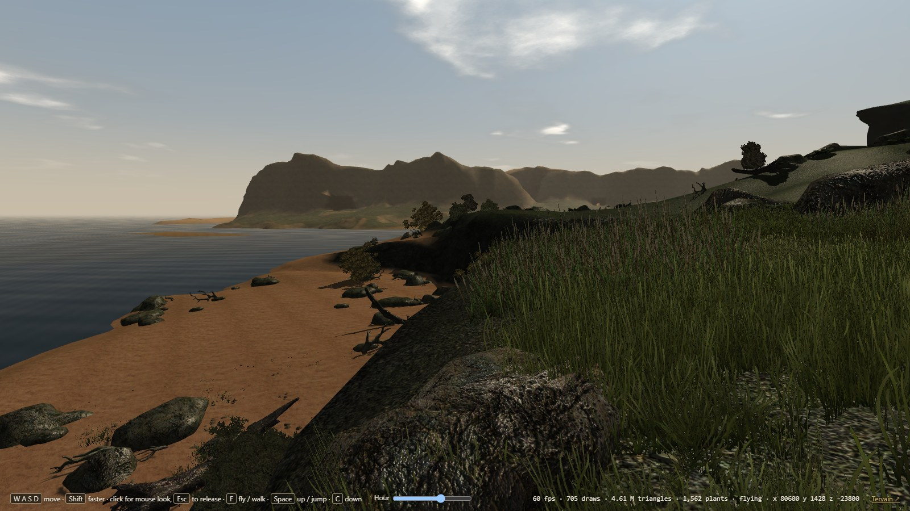
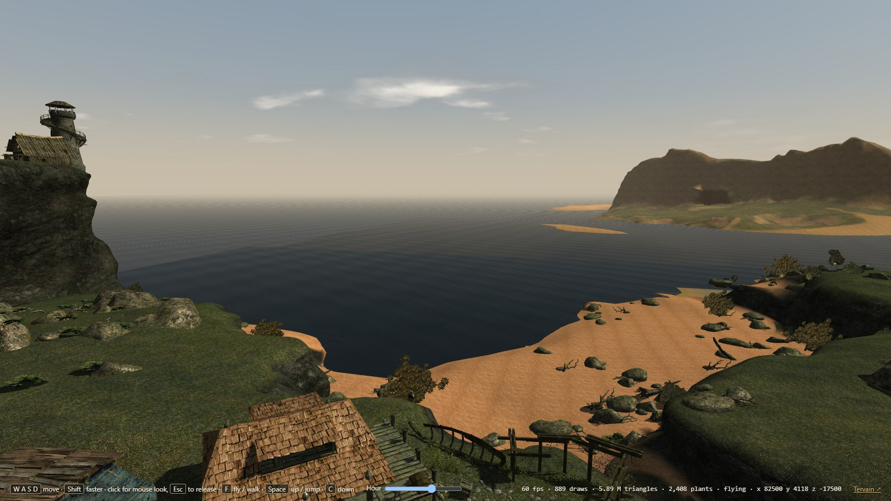

# Tervain

**A serious single-player high-fantasy RPG for PC, being developed toward a Steam release.**

Explore a rugged coast, woodland roads and inhabited settlements in an original world of old orders, independent peoples and obligations older than its rulers. A Templar-inspired order affiliated with the Hegemony anchors the setting. Regional loyalties, dangerous travel and the freedom to find your own place guide the design.

*Gothic 3* and *Hyperion* are creative inspirations. Tervain's characters, geography, stories and visual identity are original; reference material is separate from the original game.

## License and commercial permissions

Eligible original Tervain software code is offered under the [PolyForm Noncommercial License 1.0.0](LICENSE), subject to the [exact scope and exceptions](LICENSE-SCOPE.md). **Commercial use of covered code requires separate permission.** Contact [ael.dev@proton.me](mailto:ael.dev@proton.me) for permission requests.

This is a source-available project. Public access does not make its art, music, 3D models, story, branding or other non-code content freely reusable. Those materials retain their own rights and provenance. Dependencies and separately licensed files keep their existing terms; see [NOTICE](NOTICE) and [third-party notices](public/third-party-notices.txt). Gothic 3 study and reconstruction material is expressly outside this grant.

For models, see the [3D asset credits and license ledger](docs/engineering/model-licenses.md), also linked from the game's About screen. A confirmed Creative Commons asset retains its own permitted uses, including commercial uses where its license allows them; the code license does not restrict those rights. Model entries with unresolved provenance are explicitly marked pending.

## Prototype status

This integration develops the **0.0.13** browser prototype. A source version alone does not establish deployment; check the normal publish workflow and the game’s displayed revision. Tervain stays in the **0.0.x** stage until its quality gate is met. A desktop package and Steam integration are not yet available.

The prototype includes:

- A sparse coastal arrival, a continuous woodland journey and inland settlements.
- The animated Wanderer, 17 adapted Meshy NPC roles and diverse supplied-tree habitats, with protected custom Pine geometry.
- Rougher terrain, rooted vegetation, weathered buildings and grounded scenery.
- One physical water system: a refracting, breaking sea with surf and swash, streams within their banks, a spring
  and its pool; floating cargo, wading, swimming and a view under the surface.
- Nineteen supplied, optimized and rigged animals across settlement, forest and warm-woodland habitats.
- Bow hunting, grounded carcasses and saved skinning rewards for thirteen wild animals; cats, dogs and the saddled trail mount remain protected. Rowan Vale welcomes you at a solid woodland supply table with an offline Eleven v4 voice.
- Adaptive world music, surface footsteps, item/combat/work sounds, wildlife and captioned resident speech.
- World pickups, inventory, equipment, an initially empty ten-slot item hotbar, journal and map.
- Physical movable supplies, saved progress and keyboard/mouse or controller controls.
- A Templar vigil menu with The Sovereign's Oath, distant ships and a score-led spirit grove.

**[Launch Tervain](https://ael-dev3.github.io/Tervain/)** — Published from `main` through the normal GitHub Pages workflow. Use a desktop WebGL browser; save data is stored in that browser. The title shows the version and F3 shows the source revision.

See the [0.0.13 release record](docs/production/releases/0.0.13.md) for verified results and limitations, and the [prototype guide](docs/engineering/prototype.md) for controls and boundaries.

## Develop locally

```sh
npm ci
npm run dev
```

Validate changes with:

```sh
npm run typecheck
npm test
npm run build
```

Browser checks do not establish packaged desktop compatibility or performance on other hardware.

## Project documentation

- [Vision](docs/vision.md)
- [Setting and original-world direction](docs/world/setting.md)
- [Decision register](docs/decisions.md)
- [Vertical slice](docs/production/vertical-slice.md)
- [Art direction](docs/art/art-audio-ui.md)
- [Shared asset provenance](docs/engineering/shared-assets.md)

## Separate study viewers

The [Gothic 3 / Ardea reconstruction](https://ael-dev3.github.io/Tervain/gothic3/) is an incomplete TypeScript browser port; see its [scope and controls](docs/engineering/gothic3-browser-port.md) and [rebuilding process](docs/engineering/gothic3-rebuild-overview.md). It is separate from the original Tervain game and from the [local-install study viewer](docs/engineering/gothic3-local.md), which reads the visitor's own installed files in their browser and hosts no game data. Neither route grants rights to Gothic 3 material or establishes commercial-release clearance.

### Gothic 3 study viewer examples

<p align="center">
  
  
  
  
</p>

<sub>These pictures show the separate Gothic 3 local-install study viewer, 4 October 2026, not Tervain. Gothic 3 © THQ Nordic GmbH, developed by Piranha Bytes. The viewer is not affiliated with or endorsed by them. See [screenshot provenance](docs/engineering/gothic3-local.md#screenshots).</sub>

## Contributing

Read [CONTRIBUTING.md](CONTRIBUTING.md) and [LICENSE-SCOPE.md](LICENSE-SCOPE.md) before proposing work. Identify authorship and applicable terms for code and assets. Contributions do not transfer copyright or create blanket relicensing permission.
