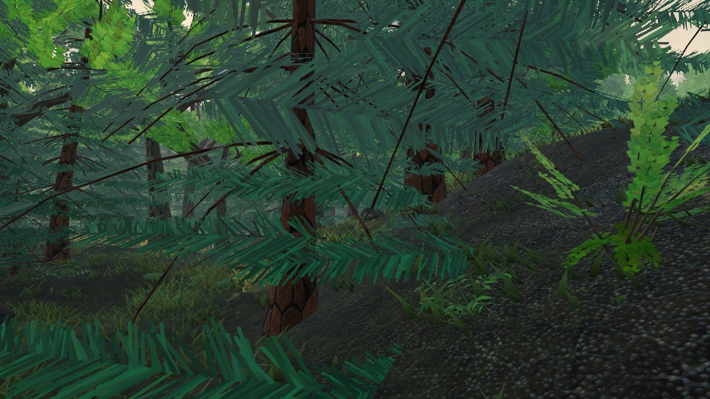
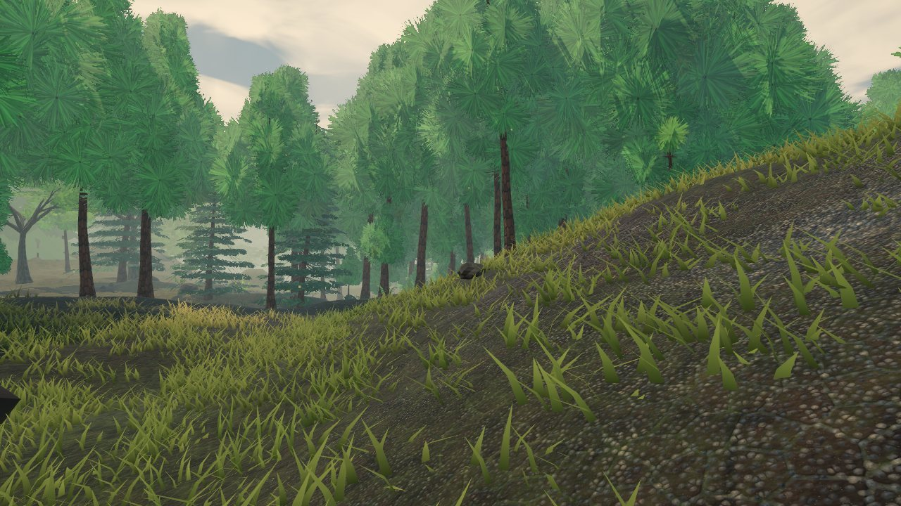
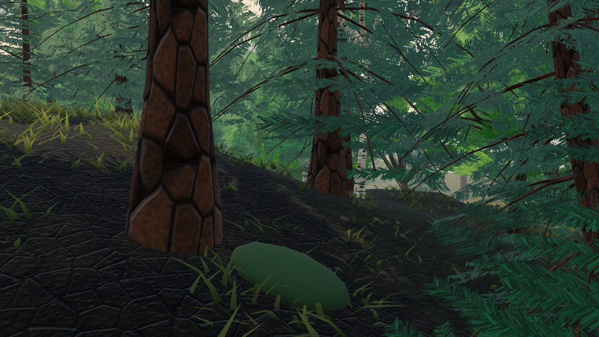
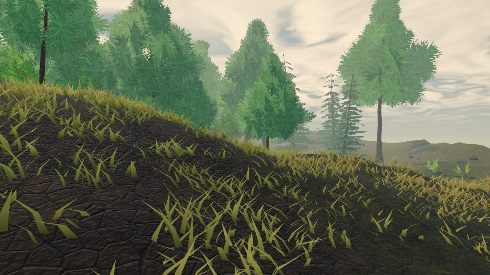
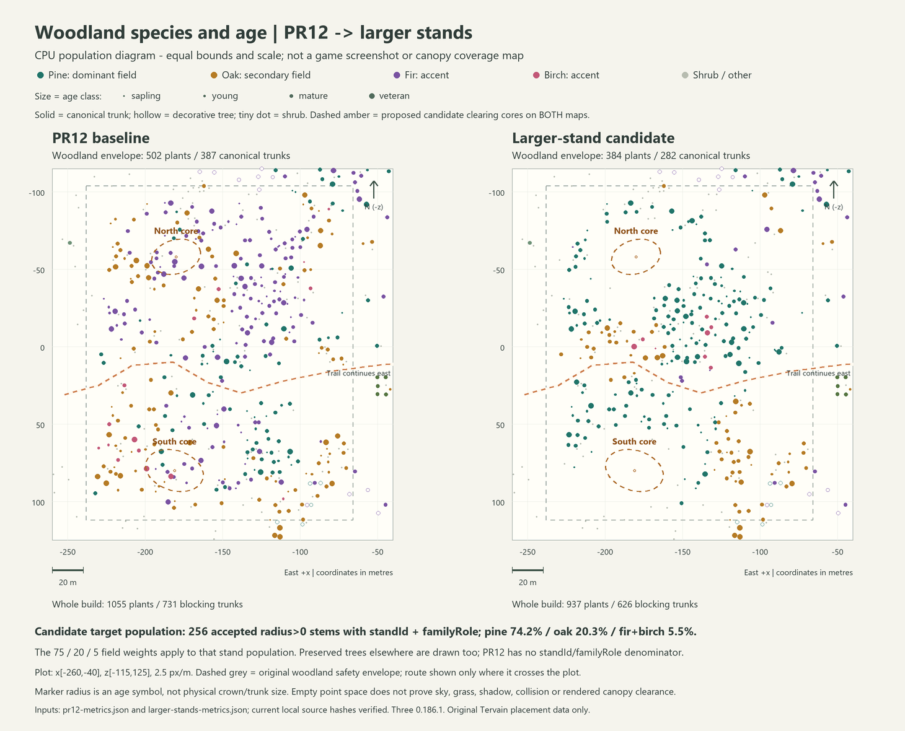
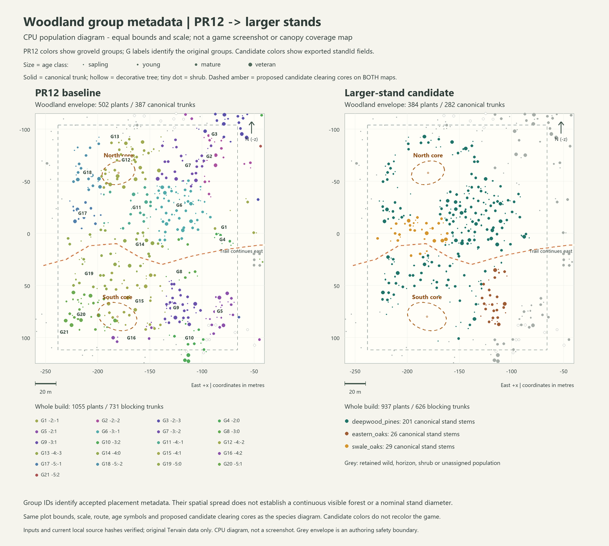

# Larger Deepwood stands and natural clearings, 3 October 2026

This dated handoff preserves the original component source, counts, captures and publication authority. The owner subsequently approved its integration with the Wanderer and source-faithful Solitary Pine as `0.0.9` under A40. Final imported-geometry population checks and publication acceptance belong to the [combined release record](../production/releases/0.0.9.md); the component measurements below remain historical.

The owner requested a **new PR** after the audit: document the Gothic 3 study, make substantially larger tree-family clusters, use approximately **75% dominant / 20% secondary / 5% other** trees, and leave broad natural free space. This is a composition candidate, **not a deployed release**. Version stays 0.0.8. The authored hills, route, settlement, hero, gameplay, water, menu and paused tree sway are retained.

Read the [Gothic 3 study](gothic3-vegetation-study.md) for measured samples, derived diagrams and limits. The original Myrtana height-cut sample is 80.9% DouglasFir / 15.3% CarolinaBuckthorn / 3.8% other; the denser sample is 57.1% / 40.5% / 2.4%. **75/20/5 is Tervain's approximate design target, not a universal Gothic 3 fact.**

## Branch dependency

Remote main was verified at `d0dc8de140ece35fe82b679beb6e9956055e316c`. [Hero PR11](https://github.com/ael-dev3/Tervain/pull/11) is open at `75a2ee61ef2a6d679563a5443a655c6f526f8e7a`. [Forest PR12](https://github.com/ael-dev3/Tervain/pull/12) remains an unmerged draft at `87f48cbed253cd9b48eb03d2454fba7c046cabed`.

This follow-on builds on PR12’s stable placement/collision, canopy-linked floor, card cleanup and immediate culling. Its recorded measurements describe the forest-stands candidate separately from PR11’s hero integration and PR12’s earlier composition.

## Implemented pattern

PR12 used 48 m grove cells and independent 76/18/6 family trials. Changing those trials to 75/20/5 alone would barely change its smaller assorted patches. The new [forestStands.ts](../../src/world/forestStands.ts) supplies a **continuous spatial family field**: a broad pine body, two coherent oak patches and much smaller fir/birch accents. No forest tree independently rolls its family. There are no per-cell quotas or rejection-until-ratio loops. Keyed randomness still controls positions, acceptance, variants, yaw, ages and conflict priority. Satellites sample the field at their own position, avoiding a dominant-only sapling bias.

The ratio applies to accepted canonical trees tagged with `standId` and `familyRole` in the organic Deepwood field, **including all ages**. Orchard rows, exposed coast, nonforest/outer transition trees, decorative horizon trees and shrubs are separate. Small oak cores can be locally oak-dominant; every small patch is not forced to repeat the regional ratio.

| Control | Current original prototype setting | Purpose and limit |
| --- | --- | --- |
| Palette | Pine dominant, oak secondary, fir/birch accents | Approximately 75/20/5 accepted regional stems; not 75% of leaf pixels. |
| Companion bodies | Swale `(-194,3)`, radii 38 x 20 m; east `(-112,62)`, 21 x 34 m; rotated/warped | Bodies span about 76 m and 68 m before warping. |
| Family transitions | 6/7 m broad coordinate warps; 9 m boundary-noise coordinates with .07 normalized amplitude; 19 m accent field | Binary family selection with connected interiors and scalloped boundaries; no prescribed transition width. |
| Density/outline | 61 m density field; overlapping landform-sized lobes; 24 m boundary fades | Landscape-scale occupied/empty areas inside the unchanged maximum footprint and coast clearance. |
| North clearing | `(-180,-58)`, rotated radii 16 x 11 m | About 553 m² open core away from the walking strip. |
| South clearing | `(-181,80)`, rotated radii 19 x 13 m | About 776 m² open core with a broad southern shoulder. |
| Clearing shoulders | 12-22 m irregular density transition; all-LOD crown buffer + .5 m | Mature crowns and satellites cannot bridge the core. |
| Cohorts | 33 m regrowth field shifts veteran/mature probabilities; young/sapling layers retained | Height varies with place; existing models are still scaled, not new age topology. |
| Floor | Accepted canopy, wetness, colonies and clearing field; terrain rejection retained | Understory follows wooded ground and does not refill the open cores. |

[world/forest.ts](../../src/world/forest.ts) owns the organic footprint and clearings; [floraPopulation.ts](../../src/presentation/floraPopulation.ts) owns accepted trees, cohorts, stable IDs and .35 m symmetric trunk spacing; [forestFloor.ts](../../src/presentation/forestFloor.ts) retains grounding, canopy dependence and parent-log quality selection. Models/materials, LOD thresholds, instancing and culling are inherited from PR12.

Conservative envelopes at scale one are oak 24.2 m, pine 10.9 m, fir 8.4 m and birch 15.2 m. They bound actual near, middle **and far** wood/leaf vertices; far-card offsets can exceed the old near/middle `crownRadius`. A normalized rotated-ellipse distance lower bound avoids diagonal leakage. Crown clearance applies around clearing cores; crowns intentionally overlap within stands.

## Actual composition and comparison

Node 24.19.0 with lockfile Three.js 0.186.1 generates **937 plants / 626 blockers**, versus PR12's **1,055 / 731**. The tagged Deepwood sample has **256 trees: 190 pine (74.22%), 52 oak (20.31%) and 14 other (5.47%; 6 fir, 8 birch)**. Its mature/veteran cohort is **171 trees: 122 pine (71.35%), 38 oak (22.22%) and 11 other (6.43%)**. Younger/sapling members are separate; they do not imply an identical mature-canopy ratio.

| Same fixed X[-215,-95], Z[-75,80] rectangle, all blocking trees | PR12 | This candidate |
| --- | ---: | ---: |
| Trees | 239 | 201 |
| Nearest same species | 63.18% | 84.58% |
| Mixture baseline, sum of squared shares | 36.20% | 56.84% |
| Same species among 25-60 m pairs | 40.92% | 56.25% |

The longer-range pair statistic improves over PR12 but is **not above the new mixture**; it alone does not prove broader clustering. Independent 2 m connected family components, accepted-tree spans and nearest matching above the new mixture verify the structure separately. The primary adult physical group has D80 about **144.3 m**, versus PR12's typical roughly **41.6 m** grove groups. The new adult companion groups have D80 about 47.8 m and 41.4 m. D80 is twice the 80th-percentile radius around a group's centroid, not a guarantee of uninterrupted canopy.

Both clearing centres have positive tall-tree crown gaps, approximately **17.5 m / 18.4 m**, versus PR12's negative gaps at the same locations. These measurements use trees taller than 12 m and near/middle radial envelopes; all sampled core probes are open under that proxy. Separate independent geometry tests use all ages and all LODs to verify core clearance. Native frames decide actual light/sky coverage.

Large oaks remain a visual limitation: in the fixed rectangle, overlap-unadjusted crown discs suggest about 47% pine and 50% oak despite the dominant pine stem count. This is neither union area nor rendered pixel coverage. Keep count ratios, model footprint and visible silhouettes distinct.

## Verification and remaining work

**Typecheck, all 676 tests in 63 files, production build and whitespace checks pass.** [forestStands.test.ts](../../tests/presentation/forestStands.test.ts) covers accepted ratios, connected components, stand spans, all-LOD envelopes, independent ellipse-to-crown clearance, core/shoulder scale, irregular boundaries, unsuitable floor terrain and actual saved-player recovery. Existing tests retain .35 m mutual/trunk-rock spacing, distant local-edit stability beyond 16 m, all-preset blockers, path/interaction clearance, enclosure outside openings, log/fungus pairing and immediate culling.

The old global rule forbidding more than 65% of one family contradicted the owner's new target; a minority-family floor and independent spatial checks replace it. A minimum of 650 floor pieces contradicted broad openings; shade/clearing/terrain behaviour replaces that nominal count while retaining kinds, geometry, clearance and presets. The strict habitat-gradient test is unchanged; the boundary fade was widened until it passed.

The first complete suite passed. A final default-parallel repeat reached the unchanged 5-second timeout in `people.test.ts` while the other 675 cases passed. `npm test -- --maxWorkers=2` then passed all 676 tests in 31.06 seconds with original assertions and timeouts; typecheck and production build also passed. The existing >1200 kB bundle advisory remains (1,473.14 kB main JS before gzip); no dependency or chunking change is included.

Native comparisons use PR12 rather than only old main: five established cameras plus broad oblique/canopy-plan views, with the same camera/FOV/terrain/settings. Temporary fresh-profile diagnostics anchor framing and freeze only their own clock/player updates; gameplay code and normal saves are unchanged. Actual source hashes and served counts identify both builds. The benchmark runs one native 72 s warm-up plus one measured repeat sequentially per build, with a recorded day-zero midday clock/quest phase. Repeated `debugTime(11)` is avoided because earlier/equal hours can advance the day. Animation-frame intervals are display-limited wall-clock measurements, not GPU timing or an FPS gain.

Deferred work remains explicit: coordinated bark/foliage art, dedicated age topology, fitted roots, bulky floor/rock endpoints, silhouette-preserving far cards/hysteresis, actual GPU/overdraw profiling and 1080p qualification. Human camera review is still the Gothic-like visual gate.

## Matched visual evidence

These are native Tervain renders at 1280 x 720, followed by independently drawn CPU diagrams. JPEG copies preserve framing and palette; lossless PNGs remain in the local audit scratch folder. The [capture provenance](forest-evidence/capture-provenance.json) records camera/player anchors, terrain heights, presets, day/time/quest phase, exact served/local module hashes and nine matching-pair checks. Embedded dev-build revision text can reflect when Vite started; served source hashes and canonical counts are authoritative here.

### North clearing, identical ground camera

PR12 puts branches and trunks across the view:

The candidate exposes the hillside and sky, with a repeated pine stand forming its boundary:

### South clearing, identical ground camera

The two cores now read as broad free space. Yellow grass, segmented reddish pine bark and bulbous conifer crowns still carry the existing Tervain art style. These placement changes do not make the materials or tree topology match Gothic 3.

### Route and landscape scale

| Camera | PR12 | Larger stands |
| --- | --- | --- |
| Trail, High | [Before](forest-evidence/pr12-trail.jpg) | [After](forest-evidence/stands-trail.jpg) |
| Entry, High | [Before](forest-evidence/pr12-entry.jpg) | [After](forest-evidence/stands-entry.jpg) |
| Grove, High | [Before](forest-evidence/pr12-grove.jpg) | [After](forest-evidence/stands-grove.jpg) |
| Margin, High | [Before](forest-evidence/pr12-margin.jpg) | [After](forest-evidence/stands-margin.jpg) |
| Trail, Low | [Before](forest-evidence/pr12-trail-low.jpg) | [After](forest-evidence/stands-trail-low.jpg) |
| Broad oblique view | [Before](forest-evidence/pr12-overview.jpg) | [After](forest-evidence/stands-overview.jpg) |
| Canopy plan view | [Before](forest-evidence/pr12-canopy-plan.jpg) | [After](forest-evidence/stands-canopy-plan.jpg) |

The trail comparison shows more sky and depth between repeated pine trunks. Normal fog substantially washes out the distant oblique view and especially the plan view; those images cannot quantify far-canopy coverage. The following maps show actual population positions at identical bounds and scale, rather than trying to infer them through fog. Marker size denotes age, not crown size. The proposed clearing cores are drawn on both baselines.

The [map provenance](forest-evidence/pr12-vs-larger-stands-map-provenance.json) records bounds, input hashes and population denominators. These maps use original Tervain data. The separate [Gothic 3 aggregate diagram](forest-evidence/gothic3-aggregate-placement.png) contains only measured aggregate counts; no game meshes, textures or raw entity dataset are included.

## Performance evidence

The [benchmark summary](forest-evidence/benchmark-summary.json) records distributions, renderer counters, device/settings, route provenance and measured/final source hashes. Public provenance records normalize local input paths to basenames and report worktree modification status as a boolean; measurement values and historical source/input hashes are unchanged. The [verification summary](forest-evidence/verification-summary.json) records matched-pair tolerances and culling results.

The measured runs use installed Chrome 154 and NVIDIA GeForce RTX 3080 Ti (ANGLE D3D11), High, 1280 x 720, DPR 1, normal grade and Reduced Motion. Each fresh profile runs the same native 72-second route once to warm, then once to measure. Both remain at day 0, hour 11 and quest phase `unseen`; no other GPU capture runs concurrently.

| Warmed measurement | PR12 | Larger stands |
| --- | ---: | ---: |
| Median frame interval | 16.7 ms | 16.7 ms |
| p95 | 17.0 ms | 17.0 ms |
| p99 | 17.2 ms | 17.1 ms |
| Worst measured interval | 33.7 ms | 33.4 ms |
| Whole-route mean submitted triangles | 1.296 million | 1.230 million (-5.08%) |
| Whole-route mean draw calls | 286.30 | 277.65 |
| Forest segments 1-2 mean submitted triangles | 1.871 million | 1.743 million (-6.86%) |
| Forest segments 1-2 mean draw calls | 376.55 | 366.55 |

These meet the proposed same-device warmed regression limits of p95 <= PR12 x 1.05 and p99 <= PR12 x 1.10. The first-route cold spikes were **416.7 ms / 483.4 ms**, respectively, and were excluded from the warmed table; cold initialization still needs separate investigation. Renderer counters include repeated shadow/reflection/postprocessing submissions, rather than unique geometry. Around 60 Hz the frame intervals are display-limited; lower triangle counts and flat p95 do not establish a GPU timing improvement, lower overdraw or spare GPU capacity.

Buffer-culling checks pass: 120 tree batches, zero dirty marks at an unchanged view, and 120 dirty marks immediately after each 180-degree pan, +2 m camera-height change and projection change. These are buffer dirty marks, not measured GPU upload times.

Captured/measured `forestStands.ts` SHA-256 is `b5de83b438f4d06c1481608e43eb33d1ee9f599415b870148f627d17fa41ce54`. After measurements and their final source check, one comment was corrected to describe the 9 m noise coordinates and .07 normalized amplitude, replacing an unsupported prescribed-width claim. Final file SHA-256 is `0aaf4e490bb725b7149f79389cd36a428d4187b694e690073bd26b38c43160e4`; executable behaviour is unchanged. Historical evidence hashes are retained rather than rewritten. All other measured production files remain identical.

## Historical publication boundary

The original stacked branch was prepared for review; that checkpoint was not a verified merged deployment.

A40 subsequently approves the latest combined changes for live `0.0.9` publication. Current publication acceptance belongs to the [combined release record](../production/releases/0.0.9.md).

## Review and next phases

1. **Placement candidate, implemented here:** review the nine matched pairs and maps before tuning geometry. Automated gates include accepted regional stems within 70-80% dominant and 15-25% secondary, small accents, independently connected fields and accepted spans, two open cores above 500 square metres, zero all-LOD core intrusions, retained path/collision clearances and deterministic recovery across presets. The longer-range same-species statistic is below the new mixture baseline; broader physical groups and field continuity carry that part of the evidence instead. Human review must still confirm the repeated dominant silhouette, distinct companion patches, broad free space and readable route.
2. **Original art cohesion, proposed subsequent work:** if the composition is accepted, coordinate bark/leaf value families, pine crown silhouettes, true young-tree topology and roots with the terrain. Review the same cameras at player height. Do not use additional mesh detail to disguise a placement problem or import reference-game assets.
3. **Rendering qualification, proposed subsequent work:** inspect hard LOD transitions and secondary-pass selection, profile alpha coverage and GPU pass time, then test actual 1920 x 1080 gameplay on a stated device. This 720p display-limited comparison cannot establish a 1080p budget or minimum PC specification. Keep named stand/clearing controls and fixed-source comparisons with each tuning pass.
