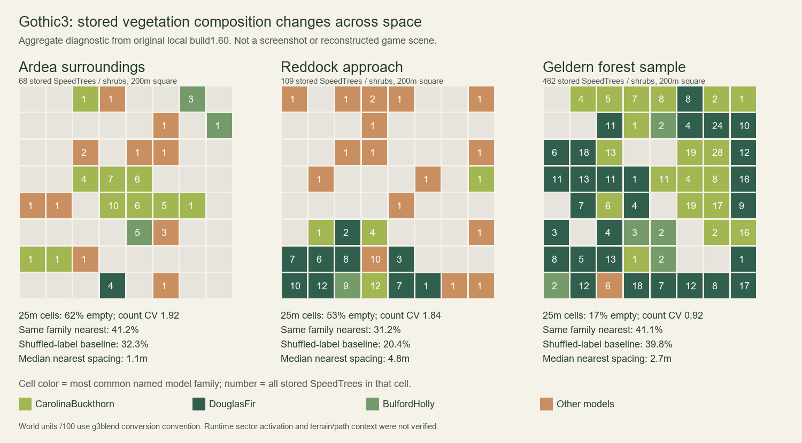

# Gothic 3 vegetation placement study, 3 October 2026

This study supports original Tervain woodland composition: broad stands with a recognisable dominant tree family, subordinate companions, irregular transitions and substantial openings. The owner's requested **approximately 75% dominant / 20% secondary / 5% other** mix is a **Tervain regional design target**, not a universal measured Gothic 3 ratio. Composition and travel readability come before more detail or polygons. Preserve the sparse arrival strand, the continuous inland woodland journey, authored hills and usable route; Gothic 3's feel and personality matter more than clinical realism. See [the existing composition candidate](forest-composition-2026-10-03.md) and [art reference](gothic3-reference.md).

## Evidence and provenance

The original game is installed at `C:\Program Files (x86)\Steam\steamapps\common\Gothic 3`. Steam's `appmanifest_39500.acf` identifies **Gothic 3, app 39500, build 1037023**, depot **39501**, manifest **246269084524623835**, English. `Gothic3.exe` and `Engine.dll` both report **1.60.25931.29**. The installed `CP_Changelog_en.txt` identifies **Community Patch 1.6, 31 January 2008**. The separately installed Gothic 1 Remake, app 1297900, was excluded from this vegetation study.

Current world archives were read with the existing local `g3pak_list.py` G3V0 index reader. Only stored or zlib-compressed entries with **encryption flag zero** were accepted. The diagnostic resolved matching paths through `Projects_compiled.pak`, then `.p00` and `.p01` overrides; it did not edit or repack them. Geometry, images, audio and SpeedTree model payloads were not exported for this work. No game launch, game-save change, new download, installation, credential change or permission change was performed.

The temporary transform decoder follows the public g3dit format readers, pinned to **30113b8254d3e6d0395d8e3c78618a99fbc0a6ca**. It validates declared entity counts, class payload lengths and `DEADC0DE` markers, graph indexes, complete string tables and end-of-file boundaries. It reads the stored entity world matrix and named SpeedTree resource; it does not infer coordinates by searching for plausible float values. See the [Node file reader](https://github.com/georgeto/g3dit/blob/30113b8254d3e6d0395d8e3c78618a99fbc0a6ca/LrentNode/src/main/java/de/george/lrentnode/archive/node/NodeFile.java), [entity matrix reader](https://github.com/georgeto/g3dit/blob/30113b8254d3e6d0395d8e3c78618a99fbc0a6ca/LrentNode/src/main/java/de/george/lrentnode/archive/ArchiveEntity.java#L39) and [property class reader](https://github.com/georgeto/g3dit/blob/30113b8254d3e6d0395d8e3c78618a99fbc0a6ca/LrentNode/src/main/java/de/george/lrentnode/util/ClassUtil.java#L70).

**2,406 of 2,421 effective `.node` paths validated.** Fourteen unsupported files and one zero-byte deletion tombstone were excluded. The decoded set contained **57,380 stored SpeedTree entities**, all in `CStat.node` files and all with entity enabled/rendering-enabled flags. This is an archive diagnostic count, **not a census of vegetation rendered in the game**: runtime sector registration, membership and activation were not established. g3dit itself checks [sector registration and membership](https://github.com/georgeto/g3dit/blob/30113b8254d3e6d0395d8e3c78618a99fbc0a6ca/g3dit/src/main/java/de/george/g3dit/check/checks/CheckSectors.java#L70).

Distances below use **100 Gothic 3 world units per metre**, the conversion implemented by the same maintainer's [g3blend exporter](https://github.com/georgeto/g3blend/blob/e4f64a496d774263efcd299206489434ab5762d9/g3blend/util.py#L174). Raw window coordinates are retained to make that conversion explicit; it was not independently calibrated in a running game. Resource-name families describe the model palette, not botanical taxonomy. `XS/S/M/L/XXL` are authoring labels, not measured tree age.

Local verification hashes identify the exact source binaries and archive snapshot without including their contents:

| File | SHA-256 |
| --- | --- |
| `Gothic3.exe` | `4573dc1cfdf8e52cc983ec4ce60d6de1d22715fd9c8745e5b43bb1e1876770c3` |
| `Engine.dll` | `d49ef92c0fdfeda433f6d04d0edeb7751e41e4c7c7effc1265630717029dc7e3` |
| `Projects_compiled.pak` | `ef2ca7935819b26f3119cdc715bf60c218b5a74d5d14c0e2b5509890930a5891` |
| `Projects_compiled.p00` | `759c64af6aea5442fc61e3a95132cc2f9d55ae232f69be8733752794118a7d45` |
| `Projects_compiled.p01` | `fb8903dcc21a1c26dac1a1e98b4012cab466e1b1ac90908cba3145f8330d4be6` |

## The supplied picture

The coordinating parent directly inspected the authoritative Library PNG **libfile_a23ae3e07ef88191b76b4737a2871fdf**, 656,899 bytes, through the supported Library flow. On the Windows executor, the local retry retrieved bytes but failed because the materialisation helper's `os.setxattr` call is unsupported; cleanup removed the temporary file. The Windows vegetation analyst did **not** inspect those pixels. The observations here are explicitly the parent's visual reading, not transform measurements:

- Rugged grey rock walls frame a winding uphill brown leaf-litter path toward a modest timber/stone building.
- Tall reddish pine trunks dominate the foreground and right side and recur deeper into the scene. Sparse lower branches and an irregular upper canopy leave gaps for sky and light.
- Leafy shrubs and saplings are subordinate. Ferns gather on shaded path margins and at rock bases.
- A clear travel corridor, varied height/crown/trunk gaps, foreground framing and a receding background make the vegetation read as one landscape.

This supports a repeated dominant silhouette, depth, grouped understory and an intentional corridor. It does not establish the image's species ratios, placement algorithm, dimensions or origin as a Gothic 3 runtime capture. Its camera and terrain were not matched to a Tervain or Gothic 3 game view.

## Original audit windows: height threshold

The first audit retained every stored woody SpeedTree in each rectangle, then selected a second group with **world bounding-box height at least 800 raw units**, conventionally about 8 m. This geometric cutoff can include models labelled `S` and excludes some smaller woody plants. It is a reproducible composition proxy, not a canopy or collision measurement.

| Window, raw X / Z bounds | All woody count | Height-cut count | Height-cut median nearest spacing | Height-cut family composition |
| --- | ---: | ---: | ---: | --- |
| Ardea vicinity: X `[80000,103000)`, Z `[-26000,4000)` | 86 | 32 | 20.43 m | GSApple 9, CarolinaBuckthorn 7, Linden 7, UmbrellaThorn 4, DouglasFir 2, HoneyLocust 2, CrepeMyrtle 1 |
| Myrtana forest example: X `[40000,60000)`, Z `[45000,65000)` | 481 | 346 | 3.21 m | DouglasFir 280 (**80.9%**), CarolinaBuckthorn 53 (15.3%), other models 13 (3.8%) |
| Myrtana dense example: X `[35000,55000)`, Z `[-85000,-65000)` | 877 | 783 | 2.38 m | DouglasFir 447 (**57.1%**), CarolinaBuckthorn 317 (40.5%), other models 19 (2.4%) |

The all-woody group in the Myrtana forest example contains DouglasFir 280, CarolinaBuckthorn 143 and BulfordHolly 45, plus 13 other models. The strong canopy-height dominance sits alongside a different small-plant palette. The dense example is a two-family mix. The sparse coastal rectangle has much more open spacing than either inland rectangle. These are local examples, not an ecological rule for the whole game.

For the height-cut groups, the fraction whose nearest XZ neighbour has the same named model family is **31.25% / 71.68% / 58.24%**, respectively. The original audit's independent-mixture comparison is **19.92% / 67.88% / 49.00%**, using `sum(p_family²)` with replacement. It describes label cohesion after accounting for the sample mix; it does not prove a procedural placement method or a statistically significant result.

## Follow-up windows: named size cohorts

The follow-up deliberately uses **different geographic windows and a different selection rule**. Each window is a 200 m square; the cohort selects `M`, `L` and `XXL` resource-name labels. Do not substitute these counts for the original 8 m height-cut results. The coastal anchor comes from the median position of objects in the named Ardea dynamic layer; the Reddock approach anchor is a named campfire placement in its outdoor layer. The Geldern-area window is a spatial forest sample, not a reconstructed named settlement sector.

| Window centre, raw X / Z, plus/minus 10000 | All woody count | M/L/XXL count | M/L/XXL composition | Cohort median nearest spacing |
| --- | ---: | ---: | --- | ---: |
| Ardea surroundings: `91270.2 / -11711.5` | 68 | 6 | DouglasFir 2, HoneyLocust 2, CrepeMyrtle 1, UmbrellaThorn 1 | 34.44 m |
| Reddock approach: `77081.0 / -4654.8` | 109 | 46 | DouglasFir 33 (**71.7%**), LongleafPine 9 (**19.6%**), other models 4 (8.7%) | 6.23 m |
| Geldern forest sample: `-60000 / 45000` | 462 | 153 | DouglasFir 127 (**83.0%**), LongleafPine 9 (5.9%), other models 17 (11.1%) | 6.27 m |

The M/L/XXL cohort's nearest-same-family share is **67.39%** at Reddock and **83.01%** at Geldern, versus **54.78%** and **69.35%** for the without-replacement label baseline `sum(n_family*(n_family-1))/(N*(N-1))`. At Geldern, the all-size share is only 41.13% against 39.77%: the stronger result belongs to the larger model cohort, while two small-plant families interleave. A whole-population statistic can hide this tiered composition.

World bounding-box height p10/median/p90 in the larger cohort is **16.68/21.46/34.57 m** at Reddock and **14.26/17.40/28.68 m** at Geldern. Yaw occupies all eight 45-degree bins in both cohorts. The median axis scale is 1.0 in each; p90 is approximately 1.18 and 1.14. Much of the variation therefore comes from different authored model sizes and variants, alongside some instance scaling. Bounding boxes include rotation/tilt and do not measure the precise visible crown surface. No juvenile or veteran age was inferred from these numbers.

[SVG version of the aggregate diagnostic](forest-evidence/gothic3-aggregate-placement.svg). The figure was created for this study from **25 m bin counts**, not copied from the game. Cell color indicates the most common named model family and the number includes shrubs and smaller models. It is not a screenshot, terrain map or proposed implemented fix. No individual placement dataset is included in the repository.

Empty-bin shares are **62.5% / 53.1% / 17.2%** for these three windows; count coefficients of variation are **1.92 / 1.84 / 0.92**. The density is spatially uneven and changes between coastal and inland samples. Without terrain and path geometry, empty cells could represent settlement, coast, rock, road or clearing; they must not all be called forest glades. Nearest-distance figures for small woody plants are not safe trunk-clearance targets.

## Independent Tervain placement principles

1. **Give a stand a dominant silhouette over a broad area.** Use the owner's approximate 75/20/5 family target for regional composition, with compatible companion forms and restrained accents. Validate the realised population after rejection and transitions; per-candidate roll percentages alone do not establish the resulting mix. A small tree or understory palette can differ from the large-tree palette.
2. **Group in depth.** An edge should lead into a substantial stand with overlapping foreground, middle and distant masses. Nearby trees can share a family and model-size character while their yaw, crown form and spacing differ. A visible straight border and an evenly mixed row cannot carry that depth.
3. **Author open space at the same scale as the stands.** Broad clearings need irregular shoulders and connections to the travelled landscape. Let sparse trees or regrowth ease the transition. Preserve the readable uphill/trail corridor and purposeful sightlines instead of filling every available position.
4. **Use a separate ground layer.** Group original ferns, shrubs and saplings near suitable rock bases, shaded margins and regrowth patches; keep the centre of the path usable. The public [vegetation property-set reader](https://github.com/georgeto/g3dit/blob/30113b8254d3e6d0395d8e3c78618a99fbc0a6ca/LrentNode/src/main/java/de/george/lrentnode/classes/eCVegetation_PS.java#L420) stores plant transforms, width/height scale and color separately from static SpeedTrees. This study did not decode its plant populations, so it establishes a separate data representation, not measured fern density.
5. **Keep rendering and physical clearance distinct.** Crown overlap can form enclosure while trunks and rocks leave traversable space. Review silhouettes, materials, sky gaps, LOD changes and alpha overdraw in the actual Tervain renderer. Stored Gothic 3 transforms establish neither those rendering budgets nor Tervain performance.

These principles should be implemented with Tervain's original procedural models, world surfaces and authoring rules. The diagram and summary metrics are lawful analytical evidence, not permission to reproduce the game's geography or import its assets. Keep the exact population/seed, sampling rule, Tervain revision, camera and graphics preset with every follow-up comparison. [The earlier composition candidate](forest-composition-2026-10-03.md) records its own narrower grove defaults and tests; those results do not automatically validate the larger-stand revision.

## Remaining limits

No Gothic 3 game view was captured. Terrain mesh, path margins, root grounding, exact canopy silhouettes, collisions, grass/fern distribution, lighting/materials, LOD cards and runtime performance were not established by this transform study. The supplied image was inspected by the parent, with its camera/terrain still unmatched. Archive entity flags do not establish runtime sector activation. Height-cut and named-size analyses are distinct. A larger stand can still look wrong in a native frame even when its ratios and neighbour statistics pass; visual review remains required.

The [larger-stand follow-on](forest-stands-2026-10-03.md) records the implemented regional palette, broad companion patches, canopy-aware clearings and its own PR12 comparison. Individual small patches are not forced to repeat the regional ratio.
