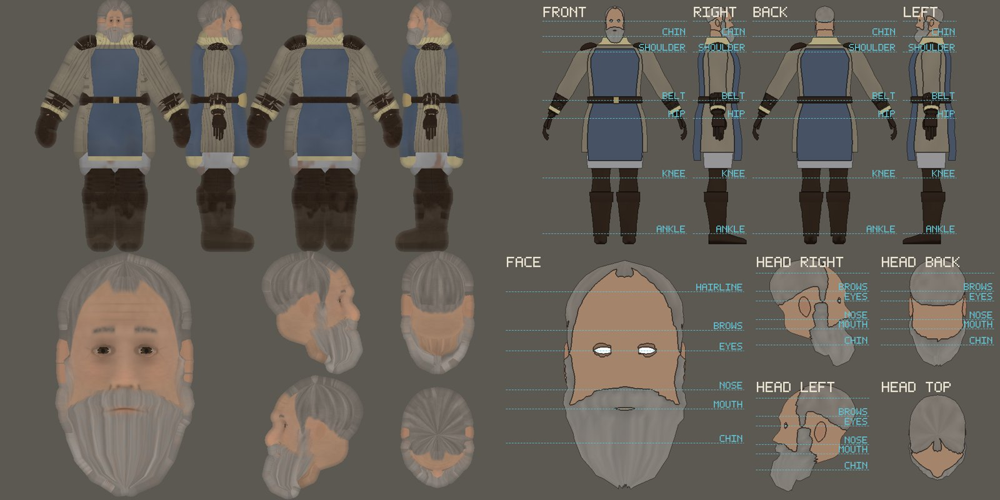
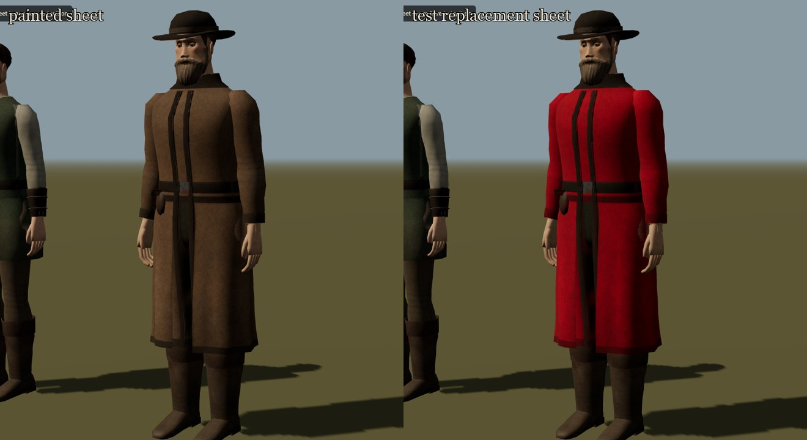

# Retexturing people

**Status:** implemented in `0.0.8` under [A33](../decisions.md). The export, the template, the fit check, the install folder and the drop preview are working tools; the [0.0.8 notes](../production/releases/0.0.8.md) record what was tested. No sheet made by an image-generation model has been tried yet, and none is installed. Every replacement sheet needs the owner's approval and an inventory record before it ships.

The owner asked for NPC models whose shapes are easy to retexture with Codex and image generation. Since `0.0.8` each person is **one skinned mesh with one square texture**, and that texture is laid out as a **character model sheet**: the whole figure from the front, the right, the back and the left, and the head large from the front and small from the sides, the back and above. An image model, a painter or a script can repaint it as a picture of the person. Then it goes in a folder, and the game wears it.



## The sheet

| Panel | Where (1024 px sheet) | Shows | Colours |
| --- | --- | --- | --- |
| `body-front`, `body-right`, `body-back`, `body-left` | the top half, side by side | the whole figure, one scale (about 270 px per metre at 1024) and one ground line | the body and everything worn on it, **headwear included** |
| `face` | bottom left, 488 px square | the head from the front, about seven times the body's scale | the face, eyes, lids, ears, hair and beard |
| `head-right`, `head-back`, `head-left`, `head-top` | bottom right, 2 × 2 | the head from the sides, the back and above, at half the face's scale | the same, from those sides |

- **Pose.** The figures stand in an unwrap A-pose with the arms lifted 30° from hanging, so the arms never cover the body. The rig still bends the sheet with the skin in play.
- **Directions.** The front views face you. `right` is the person's own right side, with their front toward the right of the picture; `left` is the reverse. `head-top` looks down with the face toward the bottom of the picture.
- **Context only.** The head in the body panels is drawn so the figures read as whole people, but the face, hair and beard take their colour only from the head panels. Paint them there.
- **Headwear.** A hood, hat, helmet, headscarf, headband or face cloth belongs to the body and takes its colour from the body panels. The head panels show the head without it.
- **Blending.** Each surface blends the views that face it, weighted toward the one that faces it most squarely; a surface hidden in a view takes nothing from that view. The body has no top view, so the top of a hat brim or a shoulder takes colour from the side views.
- **Not in the sheet.** Fine weave, grain and quilting are a detail layer multiplied over the sheet; how rough or metallic a surface is comes from its piece (linen, leather, mail, iron). The sheet carries **colour only**. Weapons, scabbards and the sash of local standing are separate props.

The exact rectangles, scales and axes of every panel are in each person's exported manifest.

## Export a person's sheet

```bash
npm run people:sheets
```

This writes every person into `out/people/` (ignored by git) at 1024 px. Options: `-- --size 2048` for a larger sheet, `-- --only player,rillford_reeve` for some people, `-- --out <folder>` for another folder. It runs the game's own code through Vite in Node and needs no browser. It takes under a second per person on the development machine.

For each person `<id>`:

| File | What it is | Use it for |
| --- | --- | --- |
| `<id>.png` | the sheet the game paints | the image to edit |
| `<id>.template.png` | every piece in its flat base colour, outlined where pieces meet and at the silhouette, with dashed guide lines (ankle, knee, hip, belt, shoulder, chin, eyes; on the head: chin, mouth, nose, eyes, brows, hairline) and each panel labelled | a block-in to paint over, or a reference for a person or a model |
| `<id>.parts.png` | each piece in its own flat colour; the same piece always has the same colour | selecting one piece (a coat, a shawl) in an editor |
| `<id>.mask.png` | white where the person is | a selection |
| `<id>.edit-mask.png` | transparent where the person is, black elsewhere | the mask an image-editing model takes ("repaint where transparent") |
| `<id>.json` | the panels' rectangles, scales and axes; the pose; the guide labels; the legend of pieces and their parts-map colours; a description of the person; the background colour; a suggested prompt; the install path | instructions for a script or an agent |

`index.json` lists everyone exported. The ids are `player`, the residents' ids (for example `rillford_reeve`, `shrine_warden`), `bandit_a` (sword), `bandit_b` (club), and the hamlet's `fisher`, `fireside` and `keeper`.

## Three ways to make a new sheet

1. **Edit the sheet (most reliable).** Give an image-editing model `<id>.png`, `<id>.edit-mask.png` and the manifest's `prompt`, adding what should change ("the coat is oxblood wool with a frayed hem"). The layout is already right, so the result only has to stay inside the silhouettes. An agent such as Codex can do the whole round trip without a browser: export with `--only <id>`, read the manifest, call the image model, check the result with `npm run people:check -- <file>`, and save it to the install path.
2. **Paint over the template.** Start from `<id>.template.png` when the person should change completely: it shows every piece's shape and where the joints and features are. Ask for the guide lines and labels to be painted out. A strong image-to-image pass loses the silhouettes, so keep the strength moderate and check the result with `npm run people:check` and in the preview.
3. **Assemble views.** Paint or generate a front, right, back and left view of the person at one scale, a face and four small head views. Place each into its panel, matching the guide lines: chin, shoulder, belt, knee and ankle lie at the same heights in all four body panels. Use the mask to cut away paint outside the figure.

Whichever way, the image must be **square**, with the **same layout as the export**. Use the size it was exported at, or the same layout scaled evenly. Export at the size the generator works at (`--size`). A non-square image is stretched square, with a console warning, and will not fit.

## Rules for a good sheet

- **Flat albedo.** Paint the colour of the materials under even light: no cast shadows, no strong highlights and no rim light, because the game lights the person. Paint in dirt, wear, stains, mending and the soft darkening in deep folds and under belts. The current painted sheets are a guide to how much.
- **Plain background.** Keep everything outside the figures flat `#5c5852`, the export's grey. The game fills background-coloured or transparent pixels near the edges from the paint beside them, and any patch of almost exactly that grey inside a figure. That fill repairs a figure that misses its silhouette by a few pixels, not one that is shifted or redrawn.
- **Consistent views.** A fold, a patch or a buckle must be the same in the front and side views where they meet, at the person's sides. Where the views disagree the game blends them over a band and the seam shows.
- **Stay inside the shape.** The silhouettes are the mesh. Painting a longer coat, a different collar or a new hat does not change the shape; that needs a costume change in code (`src/presentation/human/outfits.ts` and `dress.ts`) and a fresh export.
- **No emblems, lettering or faction marks.** The only approved emblem use is the menu's single Hegemony standard ([A24](../decisions.md)). A Templar or Hegemony mark on a tabard or a shield needs the owner's decision first.
- **Original work.** Do not give a generator Gothic 3 or Gothic Remake textures, screenshots or concept art as inputs or references ([A14](../decisions.md)), and do not ask for a real person's likeness. Describe the person; the manifest's description is a start.
- **Keep the person.** Age, build, hair and beard come from the person's style and the costume from their trade and faction ([P17](../decisions.md)). A sheet can weather, mend, recolour or enrich them. Making someone else of them is a design change for the owner.

## Try it, install it, record it

1. **Check the fit.** Run `npm run people:check -- <file>.png`; the person is the file name up to its first dot, so `caravan_master.v2.png` is checked against the caravan master. It builds the person in Node as the game does and prints two shares of the person's pixels:
   - **holes:** background deep inside a figure, where the image has no paint for a part of the person;
   - **stray paint:** solid paint well outside every silhouette, where the image's figures stand and the person's do not.

   Over 1% holes or 3% stray paint, it reports **MAY NOT FIT** and exits with 1. Edges that miss by a few pixels are repaired and not counted, and thin guide lines or labels left from a template do not count as stray paint. With no file named it checks everything installed. Only PNG is checked in Node; preview JPEG and WebP.
2. **Preview.** Run `npm run dev` and open `http://127.0.0.1:5173/tools/people.html?only=<id>`. Choose the person in the list at the top left and drop the image onto the page: they wear it at once. Drag to orbit and use the wheel to zoom; check the front, the sides, the back and the face.
3. **Install.** Save it as `src/assets/people/<id>.png` (or `.jpg`, `.jpeg`, `.webp`). Vite lists the folder when it builds, so the game and the people tool use the file from the next reload. Add `?painted=1` to the people tool to compare with the painted sheet. Delete the file to go back. The game makes the same fit check when it loads a sheet and warns in the browser console when it fails.
4. **Record it.** Add a row to the [people sheets inventory](../engineering/asset-inventory.md#replacement-people-sheets-008) before committing: id, file, size and SHA-256, the date, how it was made (the tool or model and its version when known, the prompt, which exported files it started from), who made it, and the owner's approval. Image-generation services have their own terms; record what applies rather than assuming a rights review.

A replacement sheet is used at its own size on every graphics preset. Painted sheets are 1024 px, or 512 px on Low; the player's stays 1024 px because the wanderer is built once at start and is always nearest the camera.



*Left: the painted sheet. Right: a test replacement made by script from the export (coat recoloured through the parts map, every silhouette shaved by 3 px into the background grey), applied through the people tool. Not a committed or approved asset.*

## Why these shapes retexture well

- **One texture per person.** The owner's study of Gothic 3's actor files found its bodies painted in one to three material groups. A Tervain person was 7–14 meshes with tiling maps over vertex colour, with nothing to repaint as a whole. Now each person is one mesh, one material and one sheet.
- **A familiar format.** Front, side and back views in an A-pose are a character turnaround, a format painters use and image models are commonly asked for. The sheet is that picture, not a map of unwrapped UV islands that neither can read.
- **Costumes that read from four sides.** Clothes are large panels with clear edges (collars, cuffs, belts, hems, turned boot tops) near the guide heights. New pieces are added only where their shape reads in those views: a fur collar, a wound neck cloth, a face cloth, a single shoulder guard, a headband, a tabard, gloves.
- **The arms out, the face large.** The unwrap pose keeps the arms clear of the torso, and the face panel gives the features about seven times the body's resolution.
- **Paint that agrees with itself.** The game paints a sheet as a function of each point on the surface, not of the pixel. A fold or patch is the same in every view that sees it, so the export shows a repainter consistent views to continue.

## Limits

- **Grazing surfaces.** Surfaces that no view faces squarely (under the arms, between the thighs, under the chin, the soles) take stretched colour from the nearest views.
- **Hidden layers.** A layer hidden in every view (a lining, a shirt under a closed coat) takes colour from the views it faces even though something covers it there. It is rarely seen.
- **Shape changes.** A sheet belongs to the shape it was exported from. A costume change in code needs a new export and `npm run people:check` on any installed sheet. The check catches holes and figures in the wrong place, not small shifts: a figure moved by 12 px at 1024 still passes, because the export's 16 px gutter of paint hides it.
- **No relief maps.** Relief is geometry plus painted value; there is no normal map. Painted light and shadow add to the game's.
- **Untested with models.** The workflow was tested with a scripted edit, not with an image-generation model; how well a given model keeps the layout is unverified.
