> Repository study edition: historical 5 October 2026 material. See [the study index](README.md) for the current evidence boundary, later changes and omitted private files. Embedded proposals are not project instructions.

# 01. The biggest change should be how the world is assembled

The strongest route toward this look is a coordinated art pass, not a blanket increase in triangles or a darker filter.

The native gameplay repeatedly presents connected places. Ground, rock shelves, roads, buildings, vegetation and people belong to one arrangement. Roofs have large warm shapes, walls have dark directional boards, roads remain readable, and low plants form a carpet that grows into taller tufts. Distant headlands have much less contrast than the foreground. These relationships survive changes of camera angle and activity.

Tervain already has many of the required systems: a continuous coast and inland journey, a lighthouse, mixed supplied trees, an original town, a repaired NPC cast, an authored hero, layered terrain and a working inventory. Its remaining visual gap is often the grammar of the parts. A giant leaf plate, a folded grass ribbon or a repeated black mortar rectangle stays recognizable as a primitive even when it has a detailed texture. Repeating the primitive many times magnifies the gap.

The first focused slice should be one connected route: town gateway, rough communal yard, branching dirt track, mixed meadow, rock-ledged coastal overlook and lighthouse approach. Improve this route as a coherent place before expanding more biomes. Our sparse arrival beach and dense woodland journey stay intact. This audit proposes future work; it does not modify the game or claim a new live release.

Priority order: fix dominant geometry and plant scale; connect ground and architecture; establish material and lighting relationships; improve contextual animation and camera contact; then refine small props and interface art. This order prevents a beautiful texture pass from being wasted on a shape that must be rebuilt later.

- P0: ground-cover and broadleaf silhouette repairs; readable roads; consistent structure/contact.
- P1: original architecture kit, rock shelf detail, daylight and atmosphere calibration, contextual actor animation.
- P2: detailed prop storytelling, item icon art, specialized effects and optional atmosphere refinements.

# 02. What was actually inspected

The recording was decoded end to end. Frame-level numerical analysis and human visual inspection are separate evidence types.

The source is an OBS QuickTime recording, 1920×1080, H.264, 60/1 fps, lasting 1164.516667 seconds. ffprobe reports 69,871 video frames; the complete raw decode produced exactly 69,871 frames. Every frame has a zero-based index, timestamp, downsampled luminance mean/variation, dark/bright share and adjacent-frame image difference in every-frame-metrics.csv. The metrics use 96×54 images; they locate visual changes and dark intervals. They do not measure native game FPS, GPU work, camera velocity, optical flow or display calibration.

The visual timeline contains 1,165 original-frame stills at one-second intervals and 59 chronological contact sheets. The earlier study team reviewed the complete sheet sequence. Selected scenes were inspected at higher resolution. Four two-second passages retain 120 consecutive source frames each: combat 05:23, roadside hold 11:03, stairs 17:57, and camera intersection 18:36. These 480 frames allow close temporal inspection without confusing a one-second slideshow with animation smoothness. The interactive audit provides both the one-second timeline and all frames in those bursts.

Full manual inspection of 69,871 separate full-resolution images is not claimed. This is an end-to-end decoded scan, full chronological visual sampling and focused frame-by-frame motion study. The audit retains the extraction scripts, source probe, source SHA-256 and frame index so the evidence can be reproduced. Reference images remain private local study material; no Gothic assets, code, designs or screenshot pixels are added to the Tervain game.

Some source frames crop the title, interface edges or player feet. The precise reason is not established. Neither the visible character size nor the screen crop proves the native FOV, aspect handling, resolution settings or UI scale. The menu displays a version string, but this is not proof of an unmodified installation or a complete mod/settings inventory. Brightness, fog and softness are judged as visible relationships, not copied as engine constants.

- Source SHA-256: bc4221ac17de325a83d78644f64669cb2bb0329ab5fd34cdfd25916938821e0b.
- Frame numbering is zero-based in the metric CSV. One-second still 000001.jpg is frame 0; still 000689.jpg is 11:28/frame 41,280.
- The original 1.4 GB recording is not duplicated into the Desktop audit. The HTML can inspect the local recording when you select it.

# 03. The recording contains several different kinds of reference

Gameplay, cinematic presentation, menus and recording interruptions must not be treated as one renderer.

00:00 onward includes OBS/application setup. The first title/menu passage appears around the opening seconds, followed by loading illustration. The long opening film contains ships, sea, forests, dramatic faces, combat and a party. These are valuable mood and silhouette references, but the movie is not evidence of interactive-world shading or performance. The controlled village gameplay is clearly visible at 04:24,following the transition around 04:20.

04:24-approximately 10:40 stays around village combat, nearby gates, inventory or looting, house margins and short exterior excursions. The useful details are generous open lanes, massive rough roofs, directional timber, limited purposeful shrubs, coherent tables and campfires, and a shared stone ground. People can be large and stylized while the settlement remains convincing.

Approximately 10:40-12:45 contains the strongest road, meadow, broadleaf, boulder, fern and coastal-slope material study. 11:05 shows the branching path; 11:28 the sign and plant edge; 11:48 the crown; 12:18 the woodland slope; 12:33 the coast. These are the primary targets for Tervain outdoor integration. The native scene alternates grassy cover, exposed dirt and stone; it is neither an evenly forested carpet nor a uniformly empty map.

12:45-15:40 returns to village conversations, tables, thresholds, item panels and workshop structure. 15:40-18:30 follows the lighthouse route, resident conversation/trade and exterior stair. The final traversal exposes camera/body intersection and application interruptions. Retain these passages as negative test references, not target behavior. Exact second-by-second images remain in the atlas instead of being flattened into one anecdotal summary.

# 04. Current Tervain: keep the work that already succeeds

The comparison is against the current local 0.0.12 candidate, not an obsolete prototype or an unverified live build.

The repository snapshot inspected for this audit is 9e7c6fbde547a76834bbf8192d67c0c02f898692, a documentation checkpoint. The latest character runtime acceptance is 67788fa1. Saved landscape acceptance at 88cf6678 predates that character repair; the protected world/terrain/vegetation paths were unchanged by the subsequent NPC and enemy-motion changes. These views are therefore useful current landscape evidence, while their exact camera/time/build stamps remain explicitly separate.

The completed character repair rebuilt seventeen supplied NPC derivatives, preserved source identity and UV information, improved face coverage and shading, and reduced the long-skirt deformation problem. The largest complete NPC is 46,980 triangles. The approved Wanderer retains its authored model, PBR material, six clips and calibrated 1.65 m/s walk and 5.85 m/s run. A future art pass must not silently undo these gains or replace the hero because an older screenshot looked rough.

Tervain already owns meaningful depth: grounded tree bases, canonical contact footprints, a coast with color depth, a lighthouse route, item interactions, inventory/map and a static attached-canopy contract. Current native landscape evidence still shows large opaque crown patches, individual ribbon-like grass, uniform outlined masonry, highly regular roof courses and some smooth isolated terrain platforms. These are specific art targets, not evidence that the entire game must be discarded.

The reference and Tervain pictures have different cameras, light times, settings and display crops. Side-by-side plates communicate shape and composition differences, not a numerical quality score or an FPS comparison. Required CI and hosting remain separate publication gates. This audit is a Desktop document and does not push, merge, deploy, change workflow triggers or spend Actions minutes.

# 05. Layout: create a chain of views and decisions

A useful map is a sequence of framed places with readable movement between them.

At 05:15 the gate beam and palisade form a foreground frame. Houses and people create a middle-distance destination. At 11:05 the road bends through low groundcover into a more open landscape. At 16:03 the hut and tower sit at the end of a dirt approach. Each scene lets the player understand a next place before arriving there. The geometry of the route and the framing objects work together.

For Tervain, author a small composition graph rather than scattering assets first: gateway view -> shared yard -> road junction -> meadow edge -> rock overlook -> beacon approach. For every node, record the intended focal object, approach direction, nearest foreground mass, useful middle-distance opening and distant silhouette. Orient household entrances toward activity space and the road toward real destinations. Use fences, stacked wood, low banks and trees to contain edges; leave the route open.

Design at three scales. Large terrain shelves and roofs should still read when the image is reduced to 160 pixels wide. At ordinary gameplay size the route, door, work station and people should read. Close up, board grain, cloth folds, chipped rock and small items reward inspection. Do not demand tiny detail to explain a large form. This is how an older renderer can still feel rich with modest meshes.

The existing sparse strand followed by dense woodland is an owner decision. This reference does not justify replacing that journey with a copy of Ardea. Preserve our region names, faction records, landmarks and save-compatible interactions. Borrow the principle that a route connects functional places, then author original distances, silhouettes and landmarks.

- Proposed acceptance: every path decision has a destination cue visible from its approach; the cue can be terrain, a landmark, a sign or an opening.
- Proposed acceptance: gateway and yard images remain understandable in grayscale and as small thumbnails.
- Do not use unrelated banners or emblems to fill empty space. A grounded household or trade function is the better reason for an object.

# 06. Terrain and rock: broad shelves before surface noise

The reference landscape has local terraces, broken rock masses and gradual changes of cover.

The strongest slopes combine broad grassy surfaces with darker exposed rock edges. Town thresholds use small retaining shelves and short steps. The coastal overlook connects meadow, trees, cliff, sand and sea. These changes have a clear scale relative to the person. Arbitrary noise on a smooth heightfield can make a hill bumpy without creating a useful ledge, slope break or believable settlement base.

Keep one authoritative support surface. Where terrain gains a shelf, the player support, road grade, navigation and visual mesh must agree. Add original rock outcrop meshes where a heightfield cannot form an overhang or a strong vertical face. Register their collision and support explicitly, instead of leaving an attractive cliff as a nonphysical facade. Rocks should be partly buried and accompanied by a small number of subordinate fragments, not perched on grass or ringed evenly with pebbles.

Use three rock detail scales: irregular overall volume and silhouette; medium fracture planes, lichen patches or layer bands; fine roughness and grain. The current natural-object budget stays below 20,000 triangles, including all pieces counted as one model. A rock can use a fraction of that cap. More polygons only help where they change silhouette, contacts or close surface shape. Tiny normal detail on a shiny rounded primitive still looks like the wrong material.

Build local contact zones: pale worn ground beside a step, darker damp or mossy underside at a boulder, low broken grass around a buried rock foot, and dirt at a gate. Author the spatial masks from actual placements and surface orientation. The same original material family should continue through ground and rock bases, so a seam does not reveal which component produced each surface.

- Prioritize the lighthouse platform, village steps and two roadside outcrops. These offer repeated player views and traversal tests.
- Avoid blanket mountains. This reference gains interest from modest local relief, not an enormous wall around the starting beach.
- Keep protected tree transforms and footings uniform; landscape revision must not squeeze source trunks or crowns to hide a contact error.

# 07. Roads and signs: let use shape the surface

A road should read as worn terrain with physical shoulders, not a painted stripe floating above it.

At 11:05 and 16:03 the path has a bare warm center, irregular grass shoulders and stones that fit the adjacent hillside. Width changes around a gateway, work area and branching direction. A sign helps identify the destination but is not the sole way to tell that a route exists. The road belongs to the topography.

Retain the existing Tervain road mask, grade and canonical route; improve its shoulder relationship. Blend packed soil into interrupted short cover before tall meadow begins. Put occasional stones where runoff or foot traffic would expose them. Keep the center clear of collision props and tall opaque plants. Author near-town use separately from the low-traffic lighthouse path, while keeping a shared material language.

A sign must have a stable post, a board attached in front or beside the post so text is not occluded, a plausible buried foot and an arrow that agrees with the route. Keep letters a readable in-world detail rather than a huge UI decal. The native sign is useful for object scale and worn wood, but its wording and direction are not imported. Tervain uses its own names and interaction rules.

Judge a road by walking it in both directions and by looking from either fork. Texture screenshots alone cannot establish support, step clearance or camera collision. Include running, stopping, walking with an item and returning after a save load. The player should follow the same visible path that the movement controller and navigation use.

# 08. Ground cover is the most urgent outdoor art change

The reference floor reads as continuous leafy tissue with local tufts. Tervain often reads as isolated folded ribbons.

At 11:16, 11:28 and 12:18 there is a low surface layer beneath taller stems. The ground itself has fine leafy and earthy information; clumps break its silhouette only where useful. Taller straw, flowers, ferns and ordinary grass are different plant families. The transition creates lushness without placing tall grass uniformly across every visible square metre.

Keep the terrain material as the lowest layer. Add short asymmetric grass/leaf clusters with several narrow stems, varied height and a convincing dark root region. Use smaller groups of cutout cards for fine leafy detail where geometry would become expensive. Align normals and shading to the plant form, not a flat billboard. The current grass geometry has thirteen folded blades at six triangles each; the repeated broad folded edge is visible in the native captures. Its macro silhouette should be rebuilt or complemented before increasing texture resolution.

Give each habitat a cover recipe. A used yard is mostly exposed cobble or soil with small weeds in seams. A road center is worn and bare. A meadow has low mixed cover plus irregular straw patches. Woodland floor has leaf litter and shaded herbs, with ferns against rocks or fallen wood. Coastal exposure has thinner wind-worn cover. Distribution should depend on slope, moisture, shade and use masks, not just one random density number.

Preserve the existing streaming, deterministic placement, fade and contact exclusions. Add visual clustering without changing collision identities accidentally. If larger art clusters move a route or obstacle, document that as a deliberate layout revision. Inspect alpha edges, mipmaps, anisotropy and shadow/distance cutouts at grazing views. Grass that looks good from above can shimmer or expose rectangles when walking past it.

- Proposed initial shape test: compare short-cluster prototypes at 0.12 m, 0.25 m and 0.45 m heights on the same route; these are study targets, not measured Gothic dimensions.
- Proposed recipe: reserve taller stems for authored patches, leave short cover dominant, and keep the worn center genuinely open.
- Attached gameplay vegetation motion remains paused. This art pass must not reintroduce worm-like trunk or canopy animation.

# 09. Trees: dense small clusters, useful holes and connected branches

Lushness is a crown structure problem as much as a polygon or texture problem.

The broadleaf study at 11:48 shows small overlapping clusters and gaps where sky remains visible. 12:18 combines narrower high crowns, lower herbs, boulders and open trunk space. Crown shape and lower branch arrangement vary by tree role. The close Tervain oak capture has oversized opaque surfaces that read like enormous individual leaves. Their frequency and thickness do not match the intended metre-scale canopy.

Prepare each supplied source as separate wood and crown roles before adding custom foliage. Keep primary trunk and limb identity; remove or thin only source crown masses whose primitive size remains visibly wrong, then attach smaller original twig-and-leaf clusters to real source branches. Keep the approved custom 10k Pine unchanged. Uniform transforms and grounding are a hard contract. Every new complete tree remains strictly below 20k, including source wood, retained crown, added stems and leaves.

Use clustered cutout atlases with several leaf sizes, visible veins and transparent space. A card should represent a twig cluster or small spray, not a two-metre leaf. Distribute cards in several intersecting orientations so the crown has depth in side and rear views; avoid a solid wall of parallel planes. Light response can include a restrained warm backlit component, but not bright emissive green. Thin twig connections should be visible in close poses or convincingly implied by the cluster layout.

Validate crowns from above, below, all cardinal directions and against bright sky. Check branch-to-leaf contact, crown holes, alpha boundaries, mip silhouettes and shadow agreement. Native walkthroughs at several distances are necessary. The High preset currently preserves full near/source trees at visible distances; improving performance must not quietly replace that owner contract with abrupt disappearances. Any future continuity strategy requires an explicit reviewed change.

- Prototype one broadleaf and one narrow crown first. Do not rebuild fifteen families before their geometry/material grammar works.
- Preserve detached falling leaves and Reduced Motion behavior while keeping trunks, branches and attached crowns static.
- A budget cap is a maximum, not a target that every tree must consume.

# 10. Material language: paint large history into each surface

The reference has rough directional surfaces and selective contrast. It is not simply low-resolution photorealism.

Timber carries long grain, board-to-board tones, dark splits and localized weathering. Roofs have coarser irregular pieces and warm variation. Rocks have wide lichen or fractured value groups. Cloth has large folds and wear; metal is bright only where appropriate. These medium-scale features remain legible while the player moves. Fine repeated procedural noise should support them rather than replace them.

Create original material families with a shared scale sheet. A roof tile, wall board, cobble, sleeve weave and boulder patch should have coherent metre-scale frequencies. Tervain's existing maps already contain wear; the problem is often uniform application and repeated boundary marks. Reduce the dominance of perfectly black mortar courses on light stone/plaster. Make joints local, broken and material-specific; use depth at actual beam, eave and opening contacts.

Separate albedo, normal and roughness roles. Albedo carries color and some deliberately painted broad shading; normal changes surface orientation; roughness governs highlight spread. Do not paste the same noisy image into all three maps. Normal maps must preserve a valid tangent basis. Keep the repaired NPC basis and map conditioning intact. Reject shiny wet rock in ordinary dry daylight and oily linen, even if those surfaces look dramatic in a close render.

Use an original earthy palette with selective warmth and cooler air: olive/sage/grey greens, warm straw and worn wood, cool stone shadows, leather brown, linen cream and limited metal or faction accents. The bright native sky and warm roofs demonstrate that Gothic daylight is not uniformly dark. Do not globally multiply all textures darker or saturate every tree. Compare whole compositions, not isolated RGB averages.

# 11. Architecture: replace template regularity with an original construction kit

Heavy roofs, deep openings and complete structural connections make these buildings feel inhabited.

The village combines tall plank halls with low huts, broad roofs and raised stone bases. The lighthouse connects a tower, hut, stair, rails and roofed lookout. Walls are not simply decorated rectangles. Beams carry roofs, bases meet the ground, doorways have thickness and roofs have eaves. The exaggerated forms feel rugged because the construction logic remains understandable.

For Tervain, make an original kit of structural posts, primary beams, planks, plaster panels, rubble base pieces, door surrounds, eaves, shingles, roof braces, shutters, stairs and rails. Start with one important hall and one small workshop. Alter broad silhouette and proportion deliberately: pitch, overhang, height, porch and attached storage should express different function. Avoid independent random offsets that make construction look impossible.

The current procedural masonry texture lays out repeated courses and very dark joints; current roofs repeat relatively regular rows. Break this systematic rhythm by grouping broader stone sizes, interrupting joints, varying board widths within a construction rule, and locally thickening roof edges. Keep complete hidden backing, closed gable ends, wall thickness, interior boundary and proper UV scale. Visual improvement must not bring back missing house geometry.

Treat landmark assemblies as one art and traversal unit. Walk around, into and onto permitted parts. Validate stair landings, rail gaps, camera clearance and support. Keep small ordinary steps accessible, reserve impassable slopes for deliberate barriers, and ensure a visible entrance actually connects to a navigable route. The reference's late clipping is an explicit reason to exceed its physical reliability.

# 12. Props and settlement life: give every cluster a job

The world feels alive because objects, people and activity agree.

The recording groups crates and netting near a gate, table objects near people, tools and stored supplies under a workshop cover, and a resident near the lighthouse. Those relationships give the village meaning. A barrel at a random coordinate does not offer the same richness as a bucket beside a door with a water carrier nearby.

Author a few original station recipes: gatewatch, woodcutting corner, household table, bread preparation, repair bench, supply storage and beacon maintenance. Each recipe specifies a primary surface, supporting tools, limited stored goods, wear mask, person or idle activity, approach space and interaction ownership. Faction identity belongs on a meaningful original banner or object, not on every crate or building.

Distinguish static dressing, real pickup and movable cargo. Static props can be batched for rendering. Pickups need an item identity, interaction bounds, saved collected state and inventory effect. Movable supplies need physical support and persistence appropriate to the existing system. A duplicate decorative tool must not masquerade as a freely repeatable quest item. Use the established Tervain inventory/cargo contracts rather than building a parallel visual-only system.

Populate small life sparingly. The reference deer on the lighthouse approach contributes a quiet impression without a crowded zoo. Tervain wildlife and ambient people should obey habitat, scale and safe route boundaries. Avoid adding a particle or animated creature to every frame to prove that the world is alive. A coherent household can communicate life even when its objects are still.

# 13. Daylight, sky and atmosphere: calibrate relationships together

The footage uses bright daylight and soft distant separation. Making everything dimmer would miss the target.

Warm roofs and pale stone or packed-earth paths sit under a blue sky with broad light clouds. Dark timber walls and sheltered openings provide local contrast. Distant headlands become lavender-grey, losing surface detail and contrast while retaining silhouette. The native scene is often bright and airy. Its haze is a strong stylistic cue, but the exact color in this encoded recording is not a physically calibrated measurement.

Begin with a locked noon study scene containing a grey card, linen, dry stone, leather, roof, leaf and metal swatch. Confirm input color spaces, linear lighting, tone mapping and output conversion before tuning exposure. Current Three.js documentation distinguishes sRGB color textures from non-color map data and warns that misconfigured output conversions can wash out or darken a frame. A light-intensity change is not a substitute for fixing such a pipeline error.

Then tune sun, sky fill, shadow contrast, environment reflections, fog and grade as a group. Preserve detail under eaves and foliage without lighting every cavity evenly. Limit small flames to warm localized accents. Use atmospheric distance to compress distant land contrast; preserve its silhouette and route landmarks rather than hiding missing scenery behind opaque fog. Keep water, sky and distant terrain color relationships consistent.

Do not attempt exact native-renderer reconstruction from screenshots. The video does not reveal its exposure curve, bloom settings, fog equation, shadow technique or texture lighting model. A mild optional atmospheric/bloom experiment can be tested after shapes and palette work, but widespread white clipping, blurred gameplay text or lost roof detail is failure. Test dusk and night as well as noon; the earlier Tervain shadow fix must not be regressed.

- Technical source:Three.js Color Management and Shadows manuals; proposals here are original adaptation choices.
- Create comparisons with a fixed camera/hour/preset; disable the grade temporarily to diagnose material vs lighting.
- Use the same alpha thresholds in color, shadow and distance passes so canopy edges agree.

# 14. Water and coast: use gameplay evidence for a gameplay target

The opening film supplies mood; the later coast supplies the usable spatial reference.

The ship and animated water in the intro are cinematic. They cannot justify a claim that native gameplay uses the same shader or geometry. The later coastal overlook shows sand, cliff, grassy shoulder, dark water and distant land as one arrangement. Its water detail is relatively distant in the camera. The target is shore coherence and depth, not a copied cinematic displacement function.

Tervain already has shore-to-deep colors, wave normals, reflected sky/sun behavior and stability work. Preserve those improvements. Enhance shoreline irregularity, shallow color bands, wet/dry material transition and rock contacts where the camera actually visits. Keep foam proportional to shore slope and wave energy; a uniformly bright border around the whole coast looks like an outline.

Any further depth or transmission experiment must preserve the existing captured-geometry, view-space thickness path and the world's true terrain/support geometry. Keep coordinate and depth conventions consistent; color depth alone is not physical thickness. Prevent z-fighting at intersections and unstable high-frequency glints when running. Test the exact motion path that previously exposed flickering, with paused motion and several view angles, before increasing wave detail or transparency.

Keep large headland silhouettes resident and improve their rock/grass/sand joins. Atmospheric color should separate near shore, far sea and land. Do not place more islands at random to fill the horizon. Any new land has to respect roads, map display, collision and the intended sparse opening. The current bay is a good foundation for refinement rather than replacement.

# 15. People: coherent shape, paint and posture before more geometry

The gameplay hero is visibly angular but reads well because its planes, costume and motion agree.

The close hero view beneath the tower roof still shows simple facial planes and texture-defined beard and brows. Broad shoulders, layered costume and equipment establish identity from the back. Villagers and combatants have different masses and activity. The cinematic faces are a separate quality bar and must not be confused with gameplay. This is strong evidence against solving every character complaint by adding triangles.

Keep the approved Weathered Wanderer and the repaired NPC cast. The latest Tervain people already show improved facial volume, source-derived paint and sensible material grouping. Next character work should target inconsistent silhouette, hard clothing joins, expression/posture and integration with sun and environment. Preserve each source identity and faction/role record. Avoid remeshing all faces again unless a specific remaining defect is verified in actual views.

For wardrobe, make the large garment folds and seams readable before adding microcloth. Linen should have broad soft highlights; worn leather should have localized roughness; metal should be selective. Review side and rear surfaces under the same daylight as the front. Any new atlas must protect active UVs, seams, source correspondence and normal/tangent validity. The fifty-thousand complete-NPC cap includes hidden equipment and attachments.

Give people believable neutral poses and contextual weight. The village observer should not look rigidly spread-armed; a worker should reach toward a real surface. Tool orientation, shoulder position, wrist relation and stance are more visible than tiny finger topology at normal distance. Review sitting and long-skirt walking together. A fix that improves walking but spikes a seated skirt is not a successful garment pass.

# 16. Animation: authored timing must agree with resolved motion

Smoothness requires consistent timing, transitions and contact, not just a high capture frame rate.

The 120-frame combat burst at 05:23 shows attack preparation, sweep and recovery. The passage initially labelled walk at 11:03 is mostly a stationary roadside hold and cannot calibrate stride, cadence or speed. The stair passage at 17:57 mainly tests camera/structure relation; feet are often cropped. The recording's nominal 60 fps does not prove native simulation or render cadence. Frame differences are not skeleton or controller instrumentation.

Tervain's hero uses authored clips while supplied NPCs use an eleven-joint procedural poser. That difference should be made explicit in future polish. Author or retarget a small original NPC motion set before making dozens of increasingly complicated sinusoidal gestures. Prioritize idle, walk, turn, work and seated activity. A shared movement controller stays authoritative; root movement comes from collision-resolved travel, and animation phase/rate follows that actual distance.

Retain calibrated hero walk/run speeds and existing stamina endurance. Avoid speeding the body clip up solely to hide sliding, or slowing the controller arbitrarily until a screenshot looks plausible. Record clip cycle length, stride estimate, blend intervals and resolved speed. When blocked, the feet should stop while harmless upper-body idle may continue. Turns should ease with elapsed time rather than frame count. Existing enemy gait repair already addresses these principles.

Use contact tests instead of promises: side view on flat ground, starts and stops,180-degree turn, uphill/downhill, ordinary step, blocked gate, landing and seated pose. For workers, check both hands against the actual bench/tool and time the reach with the task. Keep per-instance skin/material/geometry ownership; changing one actor's garment weights must not mutate another or the source template. More motion channels are a proposal and require proper asset/audit work.

- The four retained bursts expose every selected source frame, with timestamps and source-frame indices.
- Foot-contact precision cannot be measured in frames that crop or obscure the feet. Those frames are silhouette/timing study only.
- Attached tree animation is unrelated to character polish and remains paused.

# 17. Camera, contact and clipping: exceed the old game

The late tower sequence is a clear negative reference.

Around 18:30-18:40 the character falls or moves into the wooden tower/roof structure and the camera passes through or becomes trapped among boards. Earlier combat views also contain close prop/actor occlusion. These moments do not erase the reference's art quality, but they are not behavior to reproduce. A good Tervain art pass should keep heavy roofs and tight spaces while making them pleasant to traverse.

Review the actual orbit/follow camera collision against the whole visible structure. A point ray alone can miss a thick camera volume or a corner approached at speed. Use a suitable swept volume or multiple robust clearance tests with near-plane awareness, then smooth outward recovery without letting the camera cross the blocking surface. Small prop exclusions should be deliberate; they must not turn the entire building into something the view can pass through.

Keep player support separate from camera clearance. Climbing or jumping onto ordinary rocks and steps should use the established controller/collision authority, not an animation that moves the render mesh away from its physical root. A high ledge should be deliberately inaccessible or provide a working route; a visible ordinary stair should not demand jumping over invisible blockers. Test the same route from both directions and after save/load.

Do not copy a FOV from this recording. The capture crops several UI/character edges and does not supply settings. Tervain currently uses an ordinary 60-degree gameplay camera. Keep it as the baseline and compare a small original study range if necessary, with recorded distance, pitch, aspect and viewport. Make the hero silhouette readable without permanently covering the lower third of every scene with the body or hotbar.

# 18. Interface: keep function, reduce visual competition

The reference world remains the dominant image. Its cropped native interface is not a replacement specification.

The recording shows contextual names and item/category panels, plus dialogue/trade scenes. Some panel edges are cropped. It proves that pictorial items and earthy metallic framing can coexist with the world, but does not establish Tervain's required controls or inventory contents. The user explicitly approved a ten-slot 1-0 action bar that starts empty. Preserve that, along with real drag/drop, keyboard assignment, swaps, clearing, equipment and consumption.

In current Tervain screenshots, the tutorial/hint panel and noticeboard can dominate a view. Audit hierarchy: an interaction prompt should give a short action and target; the long explanation belongs to a player-opened interface or a readable world object. Keep accessibility and readable text, but test whether persistent hints can be smaller, less frequent or faded when understood. Do not silently remove existing guidance or replace real controls with decorative icons.

Develop original item art with a clear silhouette and consistent lighting angle. Distinguish weapon/tool/provision/material shapes at the actual slot size. Avoid tiny elaborate paintings that turn into colored noise. Use one restrained frame grammar and a meaningful selected state. Inventory should feel polished because focus, drag, tooltips, item counts and saved bindings work smoothly, not because every panel has more gold ornament.

This is a PC project. Use ordinary desktop mouse/keyboard and controller semantics, and verify several desktop resolutions and scaling settings. There is no need to spend this pass on mobile layouts. Keep nonblocking NPC observation under the current game scope; native Gothic dialogue is context for character framing, not authorization to rebuild Tervain quest conversations.

# 19. Original world and menu: keep Tervain's identity

Borrow an art grammar, not a title, insignia, settlement or story.

Tervain is an original serious single-player high-fantasy project. The order is Hegemony-affiliated, with original characters, places and local relationships. The broader inspirations do not become imported canon. A rough watchtower, a workshop and a ritual trace can express this world through construction and use without copying Gothic names, faction designs or religious props.

Keep the approved menu vigil, original monumental Tervain title, one meaningful Hegemony banner, distant modest randomized ships, supplied score and score-driven grove/wisps. The title-film and loading images in this recording offer broad warm/cool grouping and silhouette ideas, not instructions to restore a menu border or to replace the animated 3D composition with generated art. Existing owner decisions override a copied reference detail.

In the world, place allegiance only where people would place it: a guard station, hall or meaningful post. A household table should be identified by use, not a faction logo stamped on every surface. Cloth, carved timber, worn metal and limited selective color can make a Templar trace legible. Future doctrine, ritual objects or local history remain proposals until approved and documented.

Maintain the local-only reference boundary. These Desktop captures and captions are study material, not game assets. Original paint, geometry and code must be authored for any implementation. This audit should not be added wholesale to a public reference route or supplied to image generation. The current request is documentation, so no source repository changes or remote publication are needed.

# 20. Rendering and performance: measure the real cost of lushness

A low triangle cap does not make an alpha-heavy woodland automatically cheap.

Tervain's current native debug sample at 67788fa1 reports approximately 4.29 million submitted triangles and 250 draw calls in one High village view. That is a saved uncontrolled sample, not a benchmark, minimum specification or average capacity. It does show why a scene-level budget is needed in addition to individual NPC/tree caps. Shadows, overdraw, material switches, upload work, shader complexity and frame-time spikes can dominate cost.

Use renderer statistics and a repeatable camera route to separate CPU submission, GPU shading and loading/rebuild work. Record machine, OS/browser/GPU, viewport, DPR, preset, build, time of day, warm-up and route. Collect frame-time median, p95 and p99, but interpret them alongside actual image continuity. A faster view that removes the trees, drops shadows unpredictably or changes collision is not a valid optimization.

Group static shared materials and compatible plant geometry where it improves submission without creating enormous uncullable bounds. Keep interactive props separate and resource ownership/disposal correct. Cutout leaf cards can save geometric complexity but create overlapping fragments and expensive shadow work. Test card orientations and density, not only triangle totals. Consistent alpha tests and mipmaps matter for both visual edges and cost.

Three.js shadow maps render shadow-casting objects from light views; more shadow lights and larger coverage have real costs. Fit the sunlight shadow region and its resolution to the useful scene rather than turning every flame into a shadow light. Test stable near contacts and distant continuity before proposing cascaded shadows or a major renderer migration. There is no evidence in this video that requires WebGPU, photoreal PBR or an entirely new engine.

- Keep 50k complete NPC and strict <20k new natural model caps; preserve the custom Pine exception and source proportions.
- Keep full visible High source trees and resident silhouettes under current decisions; optimize batching/coverage before changing those contracts.
- Do not use a cancelled/skipped workflow as a budget workaround. Any future push/PR/merge/dispatch must pass the owner's all-run current-UTC Actions preflight.

# 21. A staged implementation plan that can be reviewed

Complete a small high-quality route before multiplying changes across the world.

Stage A: freeze a comparison route and create the original material/scale board. Capture a town gateway, yard, junction, meadow, forest slope, overlook and lighthouse at identical camera/hour/preset. Record current build and contact/asset counts. Establish what is already correct and which silhouettes fail at a thumbnail scale. These are the acceptance views for the whole art pass.

Stage B: make one short ground-cover cluster and one broadleaf crown prototype. Validate them in the world from above, below, side and grazing distances. Retain source identity/budgets and static foliage. Use these prototypes to replace visible ribbon/plate grammar in a limited region. Then extend the established plant grammar to family-specific habitats; do not rebuild every tree before the prototype passes.

Stage C: author connected town/landmark assemblies. Improve the hall, workshop and tower approach with structural thickness, irregular roof/board groups, grounded shelves and coherent props. Reconcile every visual height change with support/collision. Stage D: tune daylight/atmosphere/water against the same art, then improve contextual people and camera. Stage E: refine item art, hints and secondary storytelling.

Treat each stage as a coherent local checkpoint with actual native evidence. Run proportionate focused checks during iteration, full required checks on the final combined source, and review the final diff before any remote event. The existing publication block remains; do not bypass checks or change triggers. Version remains 0.0.x / 0.0.12 unless the owner authorizes a later patch. Numerical targets and work estimates below are proposals, not measured native Gothic settings or new owner decisions.

- A successful slice should feel coherent while walking through it, not merely in a cropped still.
- Use the ticket ledger as a backlog; dependencies and acceptance evidence matter more than completing a high number of cosmetic tasks.

# 22. Acceptance: images, motion, interactions and costs must agree

Review the final source in the actual game, with reproducible settings and ordinary controls.

Art review: compare fixed route views at noon, dusk and night. Check grayscale massing, normal color, ungraded lighting and close material detail. Look at plant crowns against sky and ground, roofs from rear, house bases from below, rocks from a low angle and people from every side. Check that new textures do not hide holes, detached pieces or bad normals. Use the same build/preset/camera for before and after.

Motion/contact review: walk and run the full route; stop against a wall; turn sharply; jump an ordinary stone; climb the permitted steps; circle the tower; approach a doorway from both sides. Review idle/walk/run/work/sit transitions and long clothing. Test camera recovery after corners, trees, roofs and stairs. Freeze Reduced Motion and verify that stationary attached vegetation remains stationary. Resume detached falling leaves only through their established behavior.

Interaction review: pick up one original item, assign it to an empty slot, move/swap/clear it, equip or consume it, open/close map/inventory, save/load and rebuild graphics quality. New decoration must not obscure prompts or duplicate item rewards. Contact changes should not corrupt saves or silently change known obstacle identities. No revived dialogue windows, new spells or unintended quest state changes are implied by this art scope.

Cost review: profile a controlled route on declared PC hardware with a warm cache and a cold-load/rebuild pass. Compare submitted geometry, material and draw count, shadow cost, peak memory and frame-time tails. Record differences in visual settings; do not claim a speed-up because the image changed quality. Keep screenshots, runtime audit data, actual GLB counts/hashes, tests/build and release checks distinct. Passing a documentation check does not certify the renderer.

- Proposed visual target: no giant leaf plate silhouettes, obvious rectangular cutout cards, repeated black wall grid or floating/isolated prop bases in the accepted route views.
- Proposed physical target: ordinary steps, routes and designated rock tops can be traversed with camera clearance and stable support; inaccessible terrain is deliberate and visually legible.
- Proposed motion target: no obvious blocked-foot marching, abrupt turn snap, source-template mutation or new skirt spikes in the accepted motion set.

# 23. Details to study without copying their flaws

The aim is recognizable old-school richness with better reliability.

Do not reproduce the late body/camera intersection, crowded combat clipping, unreadable cropped panel edges, recording/app overlays, heavy distant haze that loses useful terrain or any unstable timing. The cinematic purple effects do not justify turning the whole game purple. The intro ship does not prove an interactive ship system. The presence of a dialogue/trade panel does not override the current exploration scope.

Do not confuse rough with unfinished. A worn board can have a complete back, correct UVs and a strong joint. A low-poly face can have deliberate planes and clean skinning. An old-school roof can have asymmetry without random self-intersections. A coarse texture can have broad meaningful variation instead of repeated noise. All of these can be original and fit Tervain's budgets.

Do not use this audit to import reference meshes, paintings, texture pixels, motion curves, names or native code. The Desktop imagery exists for private study and review. Every implementation proposal describes original Tervain work. Neither the reference recording nor this document supplies a new lore decision, Steam qualification, performance guarantee or permission to publish study assets.

# Implementation ticket ledger

## T01 / P0 / Ground cover
Replace the broad folded-ribbon silhouette with short mixed clusters in one accepted route.

Source:src/presentation/ground/grass.ts; ground/patchMaterial.ts

Acceptance:Grazing walk shows continuous low cover, no bright blade walls; streaming/disposal tests pass.

Reference:11:16; 11:28; 12:18

## T02 / P0 / Broadleaf
Prototype twig-cluster foliage on real source branches; remove only verified oversized opaque crown masses.

Source:src/presentation/meshyTrees.ts; sourceBroadleaf.ts; tools/

Acceptance:All cardinal/below views show layered crown holes and connected branches; complete <20k.

Reference:11:48; 12:18

## T03 / P0 / Ground join
Add placement-aware wear and cover transitions around doors, steps, rocks and roads.

Source:src/presentation/terrainMaterial.ts; groundSplat.ts; forestFloor.ts

Acceptance:Ground-to-object seams remain coherent from overhead and low gameplay views.

Reference:11:05; 14:29; 15:31

## T04 / P0 / Road
Refine irregular worn shoulders while preserving the authoritative clear graded route.

Source:src/world/layout.ts; terrain.ts; src/presentation/ground/habitat.ts

Acceptance:Walk/run both directions and forks without new obstacles or disconnected visual center.

Reference:11:05; 16:03

## T05 / P0 / Architecture
Reduce repeated black mortar grid and establish irregular rubble groups.

Source:src/presentation/buildingTextures.ts; buildings.ts

Acceptance:Wall reads as stone/plaster at normal size, not outlined rectangular tiles.

Reference:13:56; 18:07

## T06 / P0 / Scale board
Freeze one original material and plant-scale board with reference/target labels.

Source:docs/art/; original source texture tools

Acceptance:Every prototype reviewed at the same metre scale and neutral lighting.

Reference:11:28; 13:56

## T07 / P0 / Comparison
Lock seven route cameras, light hours, preset and revision.

Source:src/app.ts; existing native screenshot/runtime route

Acceptance:Before/after settings and source hashes are documented; no camera-cherry-picking.

Reference:All route plates

## T08 / P0 / Contact
Reconcile every revised step/shelf/outcrop with movement support and camera clearance.

Source:src/world/terrain.ts; physics.ts; colliders.ts; rockContacts.ts

Acceptance:No visible walkable surface is nonphysical; ordinary routes remain accessible.

Reference:15:31; 17:51; 18:40

## T09 / P1 / Meadow
Create an original low-cover/straw/flower recipe with irregular spatial patches.

Source:src/presentation/forestFloor.ts; ground/grass.ts; ground/habitat.ts

Acceptance:Open ground remains visible; tall stems occur in localized coherent patches.

Reference:11:28; 12:08

## T10 / P1 / Forest floor
Place fern groups and litter at shade/rock/wood contacts with buried roots.

Source:src/presentation/forestFloor.ts; plantedCrowns.ts; floraPopulation.ts

Acceptance:No floating roots or detached fern fans; trail remains clear.

Reference:12:16; 12:18

## T11 / P1 / Pine protection
Verify the custom 10k Pine source/near/mid/far hashes and proportions after surrounding art edits.

Source:src/presentation/solitaryPine.ts; tree budget checks

Acceptance:Protected binaries unchanged and uniform roots/crown transform retained.

Reference:Current owner contract

## T12 / P1 / Crown material
Test cutout mipmaps, alpha thresholds, normal orientation and backlight in sun/shadow.

Source:src/presentation/treeMaterials.ts; treeTexturePool.ts

Acceptance:Color/depth/shadow silhouettes agree, with no giant solid cards or emissive-green glow.

Reference:11:48

## T13 / P1 / Ecology
Author canopy cohorts, subordinate low plants and clear openings by habitat.

Source:src/world/forestStands.ts; forest.ts; src/presentation/floraPopulation.ts

Acceptance:Lushness varies by place; dense approach retained and contact changes explicit.

Reference:12:16; 12:18

## T14 / P1 / Rock prototype
Author one rough lichen/fracture outcrop and subordinate stone kit.

Source:src/presentation/rockGeometry.ts; sourceRockPile.ts; scatter.ts

Acceptance:Matte dry daylight, believable silhouette/base, total natural budget respected.

Reference:12:18; 18:07

## T15 / P1 / Cliff
Add stratified mass and grass/rock/sand joins to lighthouse platform.

Source:src/world/coast.ts; src/presentation/coastalBackdrop.ts; terrainMaterial.ts

Acceptance:Landmark is supported and connected; no shiny smooth pedestal.

Reference:12:33; 16:03

## T16 / P1 / Village relief
Add low original retaining edges and short coherent terraces at important thresholds.

Source:src/world/terrain.ts; buildingEntries.ts; src/presentation/buildings.ts

Acceptance:Walking and camera tests pass without corrupting saves or road grades.

Reference:15:31

## T17 / P1 / Roof kit
Vary larger shingle/thatch groups, overhangs and local course thickness.

Source:src/presentation/roofs.ts; buildingTextures.ts

Acceptance:Closed backing/gables retained; silhouette variation has construction logic.

Reference:13:56; 18:07

## T18 / P1 / Hall
Create one distinct tall original hall with strong frame, deep opening and grounded base.

Source:src/presentation/buildings.ts; structures.ts; settlement.ts; buildKit.ts

Acceptance:Hall is legible in thumbnail, ordinary and rear/inside review views.

Reference:14:06

## T19 / P1 / Workshop
Build covered raised station as one functional structural assembly.

Source:src/presentation/structures.ts; props.ts; src/world/colliders.ts

Acceptance:Roof/posts/tools/storage/support agree; approach and work space remain clear.

Reference:15:23

## T20 / P1 / Beacon
Refine connected hut, tower, stair, landing and lookout composition.

Source:src/presentation/lighthouse.ts; src/world/lighthouse.ts; cameraRig.ts

Acceptance:Player can complete the intended route and look outward without clipping.

Reference:16:03; 18:00; 18:07

## T21 / P1 / Palette
Calibrate original wood/stone/cloth/leaf color relationships in neutral swatches.

Source:src/presentation/buildingTextures.ts; terrainTextures.ts; environment.ts

Acceptance:No blanket darkening, sepia wash or uniform saturated green.

Reference:04:24; 13:56

## T22 / P1 / Color pipeline
Verify color textures/data maps, tone mapping and output conversion.

Source:src/app.ts; src/presentation/grade.ts; material/map loaders

Acceptance:A single controlled grey/swatch scene has stable expected response.

Reference:Technical source links

## T23 / P1 / Sun/fill
Tune sun/sky balance after material corrections, preserving readable shadowed openings.

Source:src/presentation/sky.ts; environment.ts; grade.ts

Acceptance:No crushed noon/night faces or uniformly lit cavities.

Reference:04:24; 16:03

## T24 / P1 / Distance
Unify far land/sea/sky hue and contrast with modest atmospheric separation.

Source:src/presentation/coastalBackdrop.ts; sky.ts; waterOptics.ts

Acceptance:Large resident silhouettes remain visible while surface contrast decreases.

Reference:12:33; 16:31

## T25 / P1 / Water stability
Retest run-by shoreline flicker path before adding more waves/foam.

Source:src/presentation/waterMesh.ts; waterOptics.ts; waterRenderPass.ts

Acceptance:No new high-frequency shimmer/z-fighting at ordinary running angles.

Reference:Current water contract

## T26 / P1 / People shade
Review repaired cast under the same world light from front/side/rear.

Source:src/presentation/meshynpcs.ts; npcSurface.ts

Acceptance:No new face cavities, reverse normals, neck seams or shiny cloth.

Reference:18:15; current 67788fa1

## T27 / P1 / NPC motion
Prototype a small original authored/retargeted idle/walk/work/sit set.

Source:src/presentation/actors.ts; meshynpcs.ts; original NPC rig/clip tools

Acceptance:Original provenance/retarget validation; controller/root remains authoritative.

Reference:05:23; 16:22

## T28 / P1 / Resolved gait
Preserve distance-driven phase, blocked feet, elapsed-time turns and calibrated hero clips.

Source:src/presentation/actors.ts; mainHero.ts; hero/animation.ts

Acceptance:Stop/turn/uphill/blocked routes show no revived sliding or clock-driven marching.

Reference:Motion bursts

## T29 / P1 / Worker contact
Fit hand/tool/surface relationships for one bench and lighthouse task.

Source:src/presentation/characters.ts; actors.ts; props.ts

Acceptance:Hands meet the real target over motion; neither tool nor work surface floats.

Reference:14:29; 15:23

## T30 / P1 / Garments
Review new motion against long skirts and seated poses with private weights.

Source:src/presentation/meshynpcs.ts; tools/audit-meshy-npc-runtime.mjs

Acceptance:No new skirt spikes; source templates and other actor clones stay unchanged.

Reference:Current garment contract

## T31 / P1 / Camera volume
Review swept/volume-aware camera clearance and stable recovery around roofs/rails.

Source:src/presentation/cameraRig.ts; cameraObstruction.ts

Acceptance:No near-plane board intersection or outward snap after a blocked view.

Reference:18:30-18:40

## T32 / P1 / Shadow fit
Fit useful sunlight coverage/resolution and stable contacts before adding shadow lights.

Source:src/presentation/sky.ts; src/app.ts

Acceptance:No acne/peter-panning regression, stable footsteps and predictable cost.

Reference:13:56; 18:00

## T33 / P1 / PC profile
Benchmark declared hardware and fixed route with cold/warm cases.

Source:src/app.ts; existing F3 runtime/profile controls

Acceptance:Report median/tails/memory/draw/triangles with settings and image continuity.

Reference:Current High native sample

## T34 / P2 / Prop recipes
Create gatewatch, table, storage, repair and beacon station recipes.

Source:src/presentation/settlement.ts; props.ts; structures.ts

Acceptance:Every cluster has a function, clear approach and limited coherent materials.

Reference:05:15; 14:29; 15:23

## T35 / P2 / Pickups
Give original item props consistent art and real save-compatible interaction.

Source:src/presentation/worldPickups.ts; interactions.ts; src/game/

Acceptance:No decorative/real-item ambiguity or duplicated quest-tool reward.

Reference:14:29; item-panel sequence

## T36 / P2 / Icons
Author consistent pictorial item icons for current implemented item categories.

Source:src/presentation/ui/icons.ts; hotbar.ts; panels.ts

Acceptance:Icons read at slot size; initial hotbar stays empty and actions remain real.

Reference:16:57

## T37 / P2 / Hint hierarchy
Review persistent hint size/frequency and prompt clarity on ordinary PC views.

Source:src/presentation/ui/hud.ts; uiModel.ts; src/style.css

Acceptance:World remains dominant; keyboard/controller readable without lost guidance.

Reference:Current village capture

## T38 / P2 / Sky
Refine broad cloud shapes and near/far palette cohesion without excessive blur.

Source:src/presentation/sky.ts; environment.ts

Acceptance:Roof detail and interface remain sharp; dusk/night still readable.

Reference:04:24; 16:03

## T39 / P2 / Wildlife
Add only modest original habitat-aware life where it supports an accepted view.

Source:src/presentation/wildlife.ts; ambient.ts

Acceptance:No route blocking, crowds, overanimation or uncontrolled per-frame work.

Reference:15:52

## T40 / P2 / Lore dressing
Place a meaningful single allegiance mark at an original station, with contextual cloth/metal.

Source:src/content/; src/presentation/menu/menuBanner.ts; approved emblem sources

Acceptance:No copied Gothic symbols or random repeated faction badges.

Reference:Owner world/menu decisions

## T41 / P2 / Frame frequency
Profile canopy alpha overdraw/material submission and compatible instancing.

Source:src/presentation/vegetation.ts; meshyTrees.ts; flora.ts; renderer statistics

Acceptance:Cost improves on matched images without disappearing silhouettes or source distortion.

Reference:11:48; current woodland

## T42 / P2 / Secondary detail
Add local wear after shapes pass: drip stains, board splits, chipped roof edges, damp roots.

Source:src/presentation/buildingTextures.ts; terrainTextures.ts; treeTextures.ts

Acceptance:Detail follows material/construction and does not become uniform cellular noise.

Reference:14:06; 18:36

## T43 / P2 / Documentation
Record final source, native route views, actual budgets and remaining limitations.

Source:docs/art/; docs/engineering/; docs/production/releases/0.0.12.md

Acceptance:Local checks, native evidence and publication gates are clearly distinct.

Reference:Current approval policy

## T44 / P2 / Remote preflight
Inspect all current-UTC Actions runs/older attempts before any future source publication.

Source:Read-only GitHub all-run/attempt history; owner approval policy

Acceptance:Required publication conflict is resolved through policy, never bypassed.

Reference:Owner AGENTS instruction

# Tervain visual-reference ledger — recording of 5 October 2026

Working visual study of `2026-10-05 16-00-07.mov`. Timestamps below are recording time, not game-world time. This ledger separates visible evidence from suggested Tervain implementation. It does not establish the original renderer's shaders, polygon counts, field of view, internal collision rules or performance. The recording crops the original screen edges. The pre-rendered introduction around 00:56–04:19 supports art-direction study but is not proof of gameplay technology.

The complete stream was decoded: 69,871 frames, 60 recording frames per second, 19:24.517 duration. Every decoded frame has low-resolution luminance/difference metrics; chronological visual coverage is 1,165 one-second stills in 59 sheets. Detailed image interpretation below uses full-resolution plates, selected native stills and four 120-frame motion bursts. “Frame-by-frame” must not be described as manual inspection of all 69,871 individual full-resolution images.

## Primary conclusion

The reference's strongest advantage is coherent composition at human height: worn paths actually connect buildings and activities; mixed short ground cover reveals terrain; huge warm roofs and rough timber frame people; physical work stations justify the prop density; hills, cliff and fog establish three distance layers. Tervain can gain more from fixing ground/scale/material/contact hierarchy than from adding more randomly distributed triangles or turning up grass everywhere. This is a production proposal, not a claim that those changes are already implemented.

## First detailed observations

| Recording time | Direct visual evidence | Translation into original Tervain assets/world | Acceptance check |
|---|---|---|---|
| 04:24 | Gameplay courtyard: large tall timber hall, lower thatched structures, sky gaps between roofs, pale irregular cobbles, people gathered within usable space. Hall has worn vertical planks and stone steps; fire sits at a construction edge. | Build Rillford around an authored courtyard and a tall civic/Templar-affiliated hall. Preserve a clear crossing corridor; change building heights and roof spans deliberately rather than putting same-size huts on a uniform scatter. | Walk through courtyard at normal hero height: silhouette must read before inspecting textures; no vegetation crosses door or stair clearance. |
| 06:50 | Overhead ground beside a palisade has dark soil, green low plants, irregular tufts and light mineral flecks. Grass is excluded from some travelled margins and does not form one continuous tall carpet. | Paint a low ground-cover blend first. Use sparse grass clusters at edge zones and suppress near footfall routes, foundations, work spaces and roots. Add moss/damp soil as spatially meaningful masks. | Ground remains believable with 3D grass temporarily hidden. Show hero's feet clearly on routes. |
| 11:05 | Worn dirt junction branches through mixed green cover; signs at decision points; a tilted large rock creates one side of the road's composition. | Route masks should drive material, plant clearance and prop placement together. Place signs where route decisions actually occur. Break symmetry with a landmark boulder on one side and lower planted space on the other. | Follow route without opening map; verify exact sign destination/direction and no post occludes lettering. |
| 12:16 | Mixed woodland slope: narrow tree crowns, irregular trunks, pale sky holes, a foreground rough boulder, scattered purple plants and background trees fading into haze. Lower trunks remain legible. | Use biome-specific groups rather than trees at one constant spacing. Keep under-canopy views and a partly open lower storey. Place lushness in clumps, varied crown heights and overlapping but readable layers. | Capture eye-level approach, side and overhead views; validate connected foliage and no distortions; protected custom 10k pine remains unchanged. |

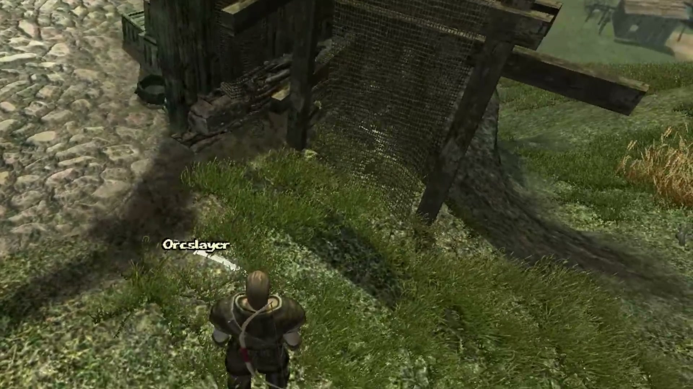

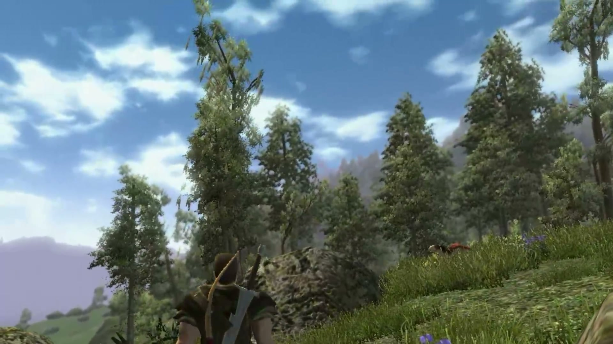

## Evidence and reproduction limits

Use the pictures to reproduce design relationships with original work, not to extract Gothic meshes, textures, logos or animation files into Tervain. This document is local study material. No game edits, version promotion, releases, Actions dispatches, push, PR creation/update or merge are part of this audit. All proposed remote publication remains subject to the coordinating assistant's current Actions budget preflight and the existing CI/hosting block; unknown monthly usage remains unknown.

## Detailed environment, construction and human-scale ledger

### 1. Landscape is a sequence of readable spaces

At 12:30 (`plates/reference-0750.jpg`) the foreground hero is backed by a wooded slope to the right, an open green descending meadow and sandy shore to the left, and a broad hazy headland behind the water. These are different shapes with different visual jobs. Tall trees are not plastered onto the entire coast. At 12:33 (`second-half-native/12-33.jpg`) two small shore buildings and a fence stair establish a human path down the landform. The sandy bay occupies its own low platform. Vegetation thins at the transition to exposed sand and the sea becomes a single quiet dark mass.

**Tervain translation:** author a continuous route from settlement ridge to coast, with a lower fishing/work shelter, believable descending footpath or stair, a grass shoulder, eroded rock lip and sandy low ground. Compose the bay from the route at hero height before making the map larger. Its original geography can preserve Rillford, the coastal beacon and local Templar obligations; it does not need the reference's settlement names or exact silhouette. In a wide shot the coast should be recognizable by shape even in a neutral gray-material mode.

**Failure to avoid:** huge high-detail trees placed between the player and every landmark; a uniformly high grass carpet down to the water; perfectly concentric circular shore bands; a house looking isolated because neither path nor work space connects to it. The reference's very dense lavender haze is visible art direction, but copying its exact color is unnecessary. Choose a muted blue-gray horizon that fits Tervain's sky and daylight, then validate in motion. Do not solve an empty background by making fog opaque at near distances.

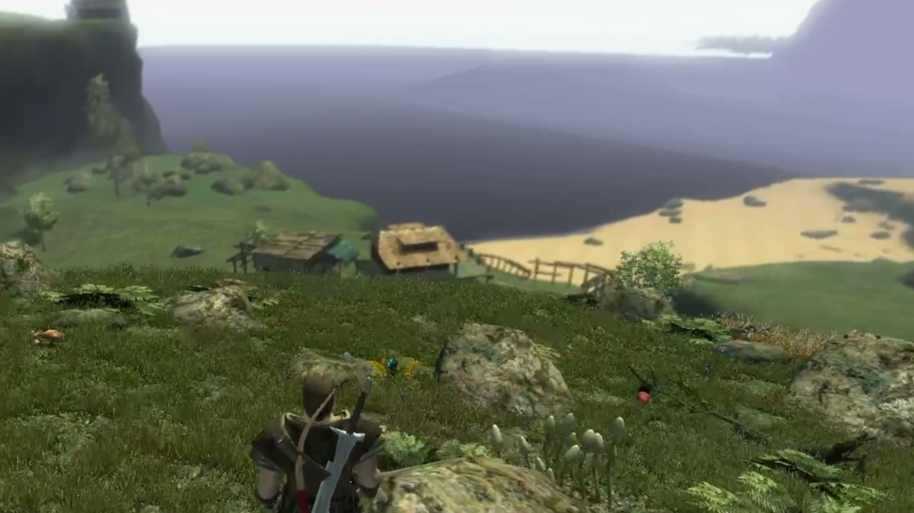

### 2. Ground is the main lushness layer

At 11:16, the ground is almost completely occupied by small mottled leaf/low-plant marks with scattered rounded stones and thin fallen twigs. These marks read at a much smaller scale than the hero. The image does not prove whether they are in one diffuse texture, multiple blends, decals or geometry, but much of the ground stays visually rich without tall silhouettes. At 06:50 the same principle combines worn soil, mottled low green cover and discrete tufts close to a palisade.

**Tervain translation:** make a small original terrain family: compacted dirt, short trampled meadow, leafy woodland soil, exposed mineral earth and coastal sand. Give each enough low-frequency color variation to read from a distance and middle-scale texture to hold near the hero. Allow the route's dirt to feather and fray into nearby cover. Keep minimum believable surface coverage with 3D grass disabled. Additional plants should enrich an already coherent surface rather than obscure texture deficiencies.

**Authoring rule:** footsteps and cart traffic justify dirt; runoff and shade justify damp/mossy soil; mineral exposure follows rock and steep banks; sand belongs on the shore. Noise is a breakup tool inside those causes, not their substitute. The exact texture scale must be reviewed against an actual 1.8m character; the video cannot provide a meter calibration for each pebble.

**Acceptance:** a 60-second walking sweep toward, across and away from the junction, with a slow orbit at ground level. Check the dirt corridor remains continuous, grass does not reappear through road centers, and terrain detail does not scintillate as the hero moves. Compare foliage-on and foliage-off images. Record the same position, time-of-day and camera each time.

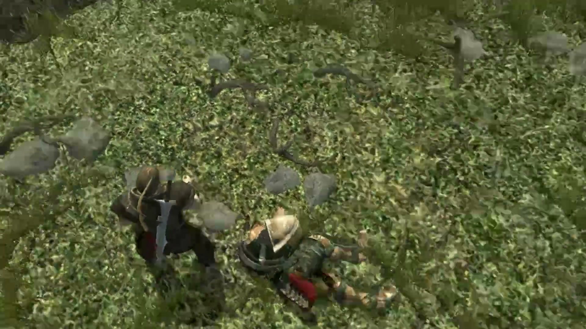

### 3. Grass height varies by purpose

At 11:05 the path is nearly bare while each side is composed of different blocks of upright grass, broader plants and low cover. At 15:53 the beacon path is much narrower and surrounded by taller meadow, but its central travel strip still remains visible. At 16:06 the dirt opens into a wider rubbed patch at the building entrance. At 16:31 foreground tall grass frames the conversation and hazy cliffs, while shorter vegetation remains around the actual route.

**Tervain translation:** derive density and height from route, doorway, courtyard, work-area, slope and root masks. Use a compact grass/low-herb set with a few broader silhouettes, not hundreds of identical long blades distributed at one global height. Use taller clumps on untravelled shoulders, low cover within a settlement and shrub/fern clusters in moist wooded pockets. Place some dry seed stalks as accents. Anchor every cluster to the same terrain/contact rules as rocks.

**Acceptance:** no blades crossing toes on a maintained route; named residents visible from torso to face; no grass rooted in cobblestone slabs, bare steps, furnace working surfaces or building interiors. Do not make every plant collide; reserve physical contacts for meaningful obstacles so an ordinary meadow remains traversable.

### 4. Readable roads are created by negative space

At 11:05 three directions can be understood from the dirt alone. The tilted boulder and signs reinforce the decision point. At 11:24 the wooden arrow plank and its screen-space object label identify a route. The visible name “Montera” floats above the prop; this image does not establish painted text on the wood.

**Tervain translation:** keep the physical Tervain sign readable in-world, with correct arrow and town destination, and keep its support behind the readable face. A subtle object label can support interaction, but it should not be required to comprehend the landmark. Make the dirt widths and edge plants match how often a route is used. Town-to-town routes are broader; a beacon keeper's approach can be narrower; a work courtyard is more rubbed and irregular. Place visible route change landmarks ahead of the player, not behind foliage.

**Acceptance:** a player who has never seen the map should be able to reach the first town by following its sign and worn ground; compare both approach directions. The test is not satisfied by a readable sign only in a free-camera screenshot.

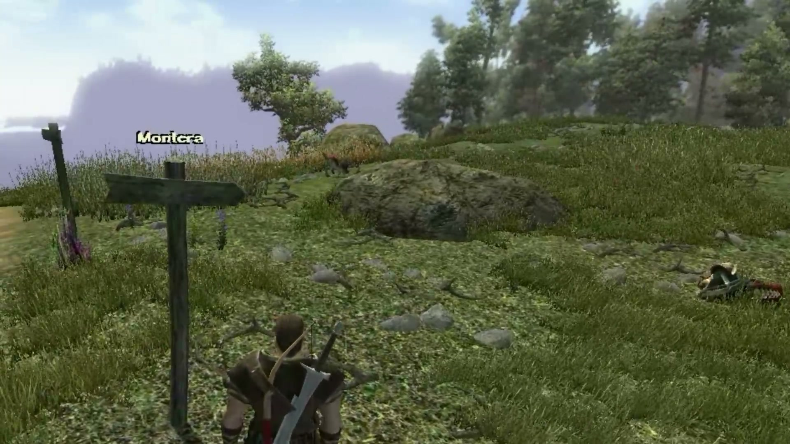

### 5. Rocks have larger form and smaller surface detail

At 11:24 the central rock is a broad low outcrop; a second boulder sits farther uphill; small stones cover the foreground at a different scale. At 12:18 the main boulder has a rough mottled surface and uneven top that works as a foreground mass. Its material reads gray-brown and mossy rather than like polished metal. The exact normal-map implementation and friction cannot be established from the video.

**Tervain translation:** use a few original hero rock shapes with broad ledges, irregular broken profiles and a family of companion stones. Avoid uniformly smooth spherical rocks and specular glints over every face. Use world-consistent material color, roughness and moderate relief, and place mottled moss in retained moisture and shaded recesses. Let broad terrain shelves meet outcrops at plausible boundaries.

**Contact task:** make the collision shape agree with the visible walkable top, preserving intentionally unwalkable steep sides. Low rocks should be stepable or jumpable with ordinary movement; tall steep outcrops should remain true obstacles. A ray-hit to one triangle alone is not a good walkability decision. Validate the character capsule, slope/step limits and landing support on the same authored shapes. Do not promise friction, a climbing system or collision correctness solely from screenshot similarity.

### 6. Trees retain an understandable branch skeleton

At 11:48, the broadleaf tree visibly splits into large trunk limbs, smaller crooked branches and leaf groups with sky visible between them. The leaves have readable ovoid shapes and muted shades; many planes reveal lighter and darker sides. At 12:18 a narrower mixed stand repeats the same hierarchy at a distance, with differently sized crowns and open lower trunks.

**Tervain translation:** do not build lushness by turning each tree into one solid green blob. Keep a continuous trunk-to-limb-to-foliage relationship. Place leaf clusters along meaningful branch tips and secondary limbs. Accept some silhouette holes and some bare limbs; these are what reveal the tree's volume. Use clumped placement, varying crown width, height and lean. Use the original custom 10k pine where it belongs, with new authored trees below their approved 20k ceiling, and preserve full source proportions instead of squeezing all trees into one template bounding box.

**Rendering task:** use well-guttered alpha cards and stable alpha/mip filtering if original foliage cards are adopted; validate the underside, silhouette, noon/day shadow, distance transitions and tree rotation. This is a proposed implementation, not a finding that the original video uses one specific card system. Static trunk/attached foliage can remain the approved baseline. A later leaf-only breeze must leave trunk and rooted contacts still; no wormlike whole-tree sway.

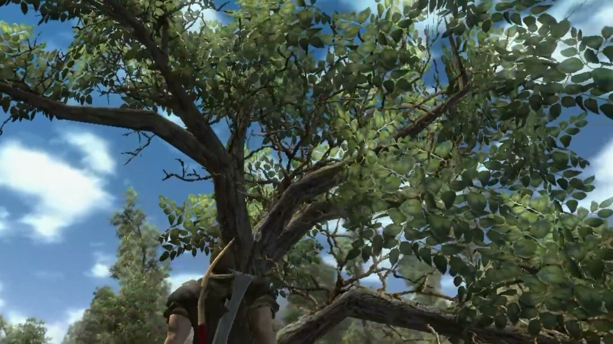

### 7. Density has local intent

At 12:18 the foreground combines fern, small flowers, one main boulder and taller trees. At 12:33 meadow and stone clusters remain separated enough that the fishing structures and sandy beach are not lost. At 15:53 deer are visible in the meadow to the right of a clear path, next to a dead limb, rather than standing in the middle of an obstruction-filled route.

**Tervain translation:** author small biome/purpose recipes: open grazed coast, woodland shoulder, shaded fern pocket, work-yard hardstand, herb patch, exposed ridge. Density should be a field with exclusions and cluster centers, not one constant random count. Keep repeated plants different in rotation/size but not in arbitrary extreme stretch. Put wildlife where it adds life to an understandable scene. Its route, turning and avoidance should match terrain contacts and not clip through the beacon or road sign.

### 8. Architecture exaggerates proportions, not finish quality

At 04:24 the hall is tall and blocky; roofs are huge warm masses over dark walls. At 13:56 (`plates/reference-0836.jpg`) hut roof pitches are steep, roof surfaces are divided into broad overlapping shingles, and rafter ends project beyond the eaves. At 14:25 the great timber hall has rough plank variation, heavy doorway jambs, a dark interior and an irregular stone stair. At 16:16 the lighthouse keeper's house combines a steep triangular gable, stone upper wall, darker plank lower body and a simple projecting timber canopy.

**Tervain translation:** choose a small regional construction vocabulary and make its members relate: oversized steep roof pitches, deep eaves, stout uprights and braces, visibly older planks, a rough stone footing and practical access. Give civic buildings greater height/roof span and ordinary buildings lower masses. The point is deliberate form and life, not modern clean realism. Keep the accepted original architectural assets or remake them with a consistent kit; do not extract reference assets.

**Full geometry requirement:** front, rear, underside/eaves, interior-visible doorway, gable side, stair ends and foundation must be authored. A beautiful front face on a hollow disconnected box is not sufficient. Ensure canopy loads have posts or wall supports, braces actually meet their beams, roofs meet walls and foundation depth covers local terrain variation. Vary boards and shingles enough to feel weathered while retaining structural logic.

**Acceptance:** full orbit with close views on all façades; ordinary traversal around rear and up entrance stairs; camera approaching and leaving the doorway; underside shot at roof edge. Check no open backfaces, sky gaps through supposedly solid wall, floating foundation, spikes at terrace boundaries or materials stretched to a completely different scale. Building footprints and colliders must match the rendered volume.

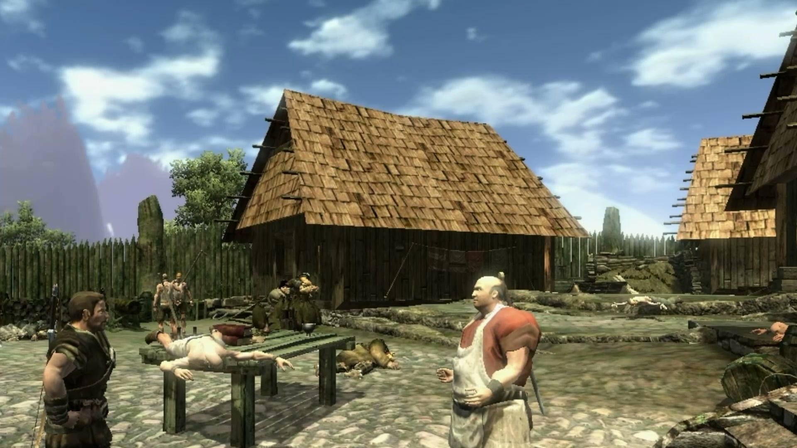

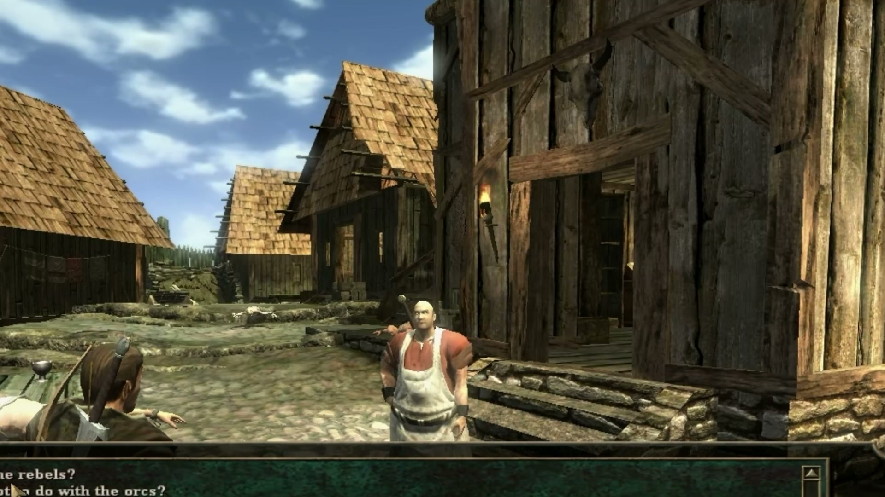

### 9. Settlement ground changes height in small increments

At 15:31 the courtyard is not a flat disc. Broad irregular shallow terraces connect two areas and wrap around a tree, while crates and a rope coil occupy an edge. Stone footings follow those levels. The route remains bare enough for movement. At 15:23 the forge is a slightly raised paved working space with a retaining edge, a furnace at the back and clear access at the front.

**Tervain translation:** add authored human-scale terraces and worn steps inside and around the settlement. Use them to distinguish civic entrance, forge hardstand and ordinary walking ground. Do not simply apply high-frequency noise to a previously flat map. Every level change must have an accessible route and colliders that agree with it. Tree bases should meet terrain; roots can widen into the soil but must not create unintended ankle-high collision fences.

**Acceptance:** normal walk/run/jump from courtyard to each door, forge and upper terrace, with a low side camera showing boots and step edges. Check grounded status and floor contacts; do not tune the controller to ignore all stairs merely to hide a bad mesh. Preserve the existing road/save/world contacts until replacements have evidence.

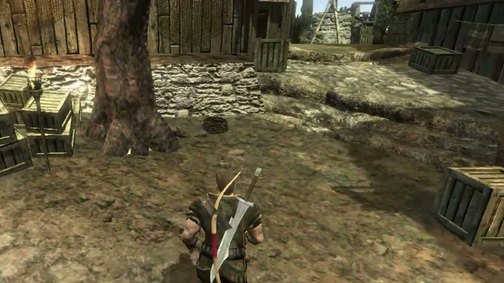

### 10. Props describe work and social use

At 10:06 the cluster consists of log stacks, a sawhorse-supported log, chopping/wood tools and a bucket against a palisade. The items form one wood-processing station. At 15:23 the forge contains an anvil, a furnace, a grindstone, work-space paving and crates. At 13:56 a treatment/work table has a body, a small bowl and surrounding residents. The recording's combat leaves bodies in those spaces; this is an observed situation, not a proposed target for Tervain gore or encounter design.

**Tervain translation:** make compact original stations tied to NPC roles: woodworker, fisher, forge keeper, trader, herbalist and hall quartermaster. Place a main working object, necessary tools and supplies, and one staging/storage cluster. Give NPCs the correct reach, body orientation, work animation, tool grip and walk-in/walk-out space. One small complete station adds more credibility than a dozen unrelated barrels along every wall.

**Acceptance:** from a still picture, a reviewer can state what work happens there; in motion, the hands meet the tool/work surface without obvious drift; all support legs rest on the correct floor. Consumable items and clutter should be intentionally placed according to ownership and interaction rules, not made pickup-able solely because they are visible.

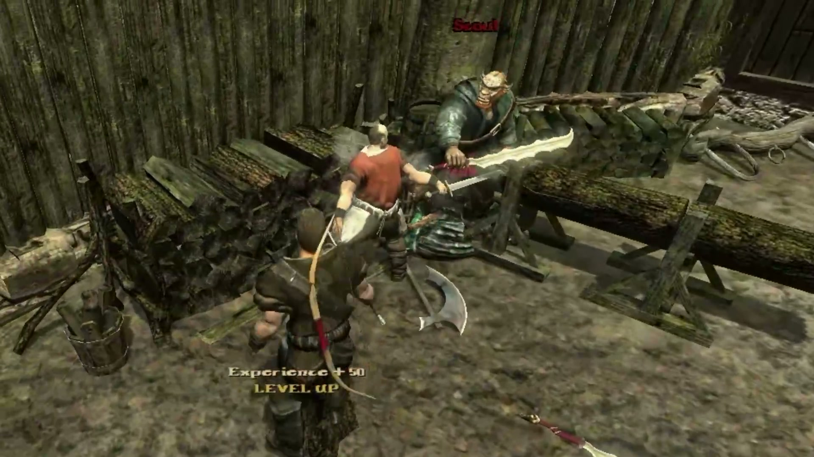

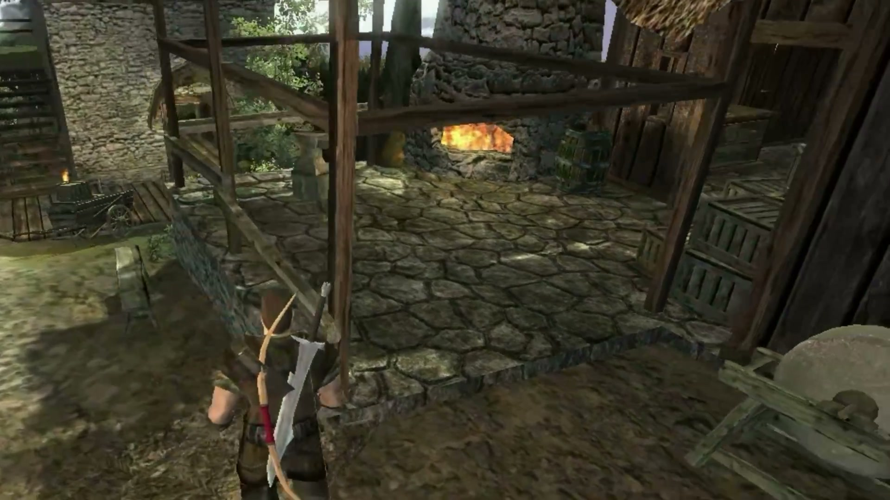

### 11. Lore is located where institutions would place it

At 04:24 the reference hall has two slim vertical red banners; most smaller huts do not. A shield-shaped sign sits by one hut in the 14:54 inventory plate. The art's institutions are not pasted onto all available surfaces.

**Tervain translation:** follow the approved Hegemony emblem and Templar relationship. Place one deliberate banner at a hall, gate post or other institutionally justified location; use original woven/stitched material and a real attachment to the building/pole. Ordinary traders show silk, sacks, spice vessels, tools and goods. A native banner must sit within a credible cloth mesh with seams, pole/loops and gravity; a random rigid emblem disk attached to the castle or repeated on every prop remains the wrong direction. Gentle approved cloth motion should use anchored edge constraints and limited leaf/cloth movement, not displacement of entire structures.

### 12. Characters are strongly shaped and materially restrained

At 18:14 the hero close-up has a broad brow, long clear nose plane, wide cheek/jaw volume, strong beard shape and a stout neck. Eyebrows/beard/hair structure are substantially texture-defined rather than sculpted strand by strand. At 13:56 the apron-clad speaker has broad upper arms and thick torso volume; the white apron, reddish short sleeves and dark belt establish the role with a few major material blocks. At 16:16 the lighthouse speaker's coat is a large brown volume, with ordinary skin/hair and a held pickaxe. Costumes have thick shoulders, large cuff breaks, belts and overlapping cloth/leather layers. The reference is exaggerated and rough, not miniature photoreal anatomy.

**Tervain translation:** preserve the approved Wanderer and cleaned Meshed NPC faces while improving screen-scale silhouette: coherent shoulder/chest width, layered clothing thickness, readable hair/jaw and properly attached hands. Use role/faction color restraint and a small material hierarchy. Spend geometry on actual silhouette, bending joints and visible clothing layers, and texture resolution on face/hands/important garment regions. Do not use high normal strength to substitute for those shapes or add tiny wrinkles that make the face noisy. Keep all complete NPCs under 50k triangles including equipment; the approved hero exception remains separate.

**Acceptance:** show front, side, rear and three-quarter at conversation distance, with a neutral/lighting-free albedo check as well as daylight/overcast/night game light. Validate chin, brow, ear, armpit, palm, waist, crotch and skirt hem rather than judging only the front final screenshot. Include idle, walking, turning, sitting, working and a tool hold. The current 0.0.12 surface repair is a useful baseline; do not undo it or claim new evidence verifies every future pose.

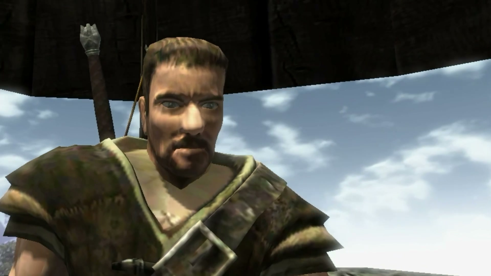

### 13. Conversation is staged inside the world

At 14:25 the player and resident are framed next to the hall and its access. At 16:16 the two characters face one another beneath the keeper house and tower. The resident holds a pickaxe near its shaft, while the hero's hands gesture. At 16:31 a second speaker angle retains meadow and distant cliffs. The actors are not isolated in a featureless portrait booth. However the pickaxe head can cross the resident's face in some angles, which is a weakness, not a feature to copy.

**Tervain translation:** build a camera rule that finds a readable two-shot or speaker view using actual actor locations and local obstacles; keep world context and an unobstructed face. Use eye-line/head turn, varied gestures and stable support. Preserve the player's prior dialogue-window direction until a new UX is deliberately approved; this reference supports scene staging without automatically authorizing a new permanent dialog window. Tools should remain plausible held props, but camera compositions should avoid putting their shafts across eyes or mouths.

**Acceptance:** talk near hall wall, meadow edge, forge canopy and a slope. Test left/right speaker order and different heights, with tools and equipment equipped. Neither actor intersects the other; camera never clips through a wall; UI remains readable without requiring exact Gothic colors or copying cropped pixel positions.

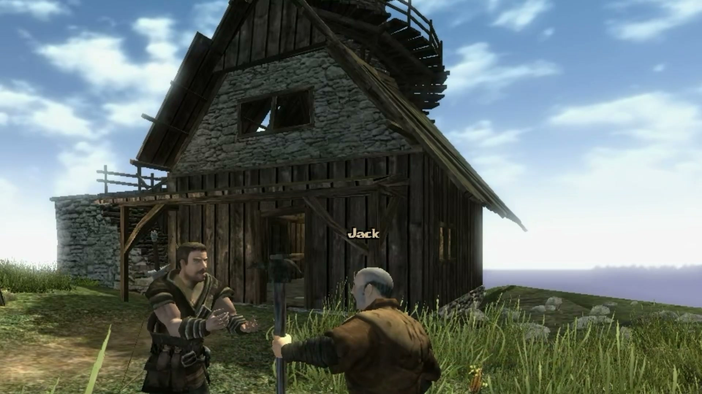

### 14. Items and UI show objects instead of generic dashboard symbols

At 10:38 the inventory's weapon category contains small pictorial sword, bow, arrow stack and axe icons in a consistent grid. A mana plant tooltip has a small plant picture, one effect and value, with the world visible behind it. At 14:54 bottles, meat, herbs and a special object occupy a compact grid; many cells are empty. Thin muted metal borders support the content rather than filling every slot with decorative icons.

**Tervain translation:** preserve the originally empty hotbar/skill panel for a new character. Populate inventory from genuinely collected/equipped items and provide pictorial original icons that correspond to the 3D world pickups. Category and tooltip hierarchy can use warm parchment/brass/charcoal that fits Tervain. Keep persistent 3D world context in inventory where it does not create performance or readability problems; exact pausing behavior cannot be concluded from these screenshots.

**Acceptance:** hover, drag to hotbar, equip, split a stack if supported, pick up in world, save/load, close and reopen. Empty slots remain empty; the item picture and description correspond to the model. The recording crops the screen; do not take its shown margins as verified original HUD layout.

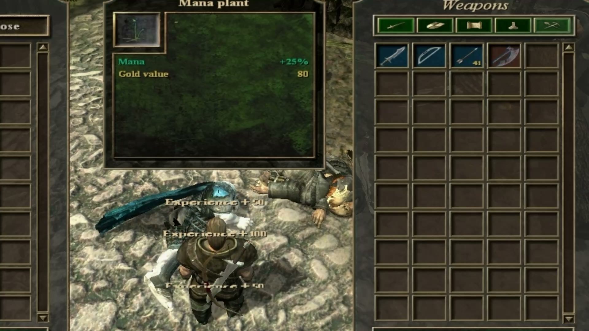

## Consecutive-frame study of four targeted bursts

Each burst is 120 consecutive decoded recording frames at 60 fps, spanning roughly two seconds. Thumbnails were visually inspected in order in four 30-frame sheets per burst. Picture similarity is not an engine performance metric: repeated or subtly different frames can result from capture cadence, video compression, interpolation, actual motion or engine timing. These strips have no world-unit speed calibration and do not establish internal collision or foot-IK technology.

| Burst | Recording interval | Consecutive-frame observation | Tervain action and specific limit |
|---|---|---|---|
| Combat | 05:23.000–05:24.983 | Frames 001–030 establish a facing opponent in a broad-legged stance within the cobbled clear corridor. In 031–060 the opponent raises/prepares a weapon and moves toward the hero; 061–090 show a large sweep/turn with bent body and visible arm arc; 091–120 lower the weapon/body into recovery. Surrounding structures stay consistent; side combat continues. | Use distinct anticipation, strike, follow-through and recovery with facing/position decisions tied to resolved physical movement. Weapon contact/hit time needs actual engine diagnostics, not these pixels. Do not reproduce the reference's crowded intersections simply because the action has weight. |
| “Walk” folder / roadside hold | 11:03.000–11:04.983 | The hero holds broadly the same roadside position and the junction/rock/sign composition remains almost fixed throughout 120 frames; subtle body/vegetation/image changes are present. This is not a good visible foot-stride sample. | Use it to study stable composition and path hierarchy, not to assert walk speed, cadence, foot locking, engine FPS or run animation quality. Acquire a separate in-engine Tervain constant-speed stride strip for speed/animation calibration. |
| Stair/platform | 17:57.000–17:58.983 | 001–030 begin close to timber boards/rail; 031–060 progressively reveal upper platform and sky; 061–090 open a horizon behind the platform; 091–120 leave the character against a wide timber deck and tower stair. Camera is rising/progressing in a cramped constructed space; much foot contact is cropped. | Validate a connected rendered floor and physics floor, camera shortening/occlusion handling and stable stair progression. It does not prove perfect foot contacts/IK or a specific continuous-ramp collider. Test Tervain boot contact with an uncropped low side view. |
| Camera/body stress | 18:36.000–18:37.983 | Close timber wall, rail and the player's body occupy most of the frame. The body is pressed against the wall with limited view space and camera proximity; the frame moves down/around the rail. Later 18:40 full-resolution plate shows camera/body/understructure intersection explicitly. | Treat as a negative acceptance case. Sweep camera volume against architecture, prevent ray-only thin-rail failures, shorten smoothly where possible, use a safe near limit and controlled actor fade only when necessary. Do not reproduce an inside-torso view, broken underside or camera trapped behind stair beams. |

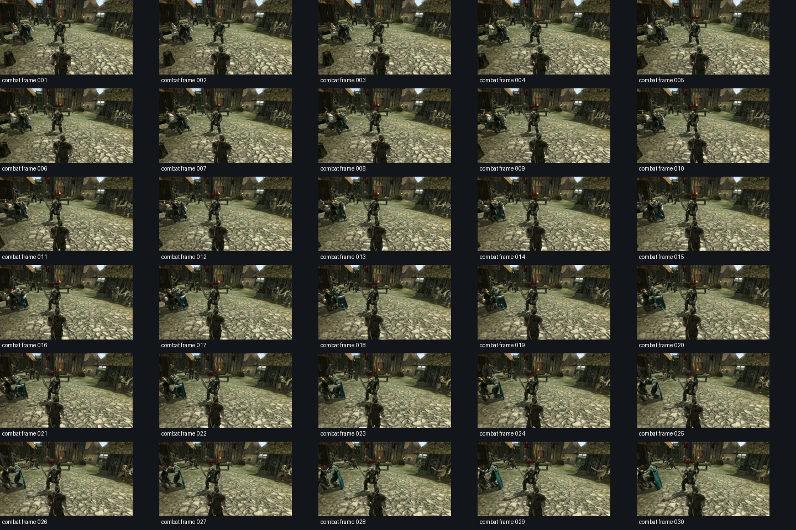

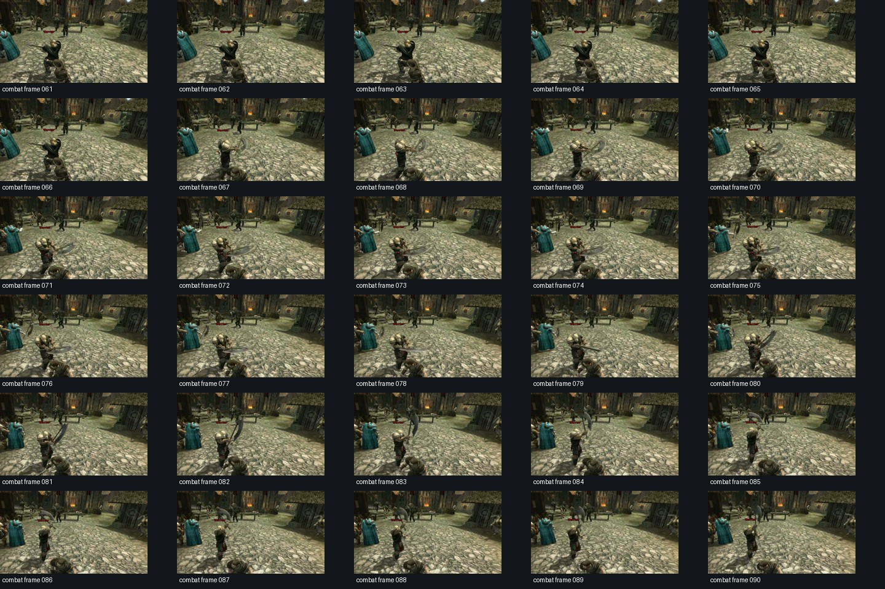

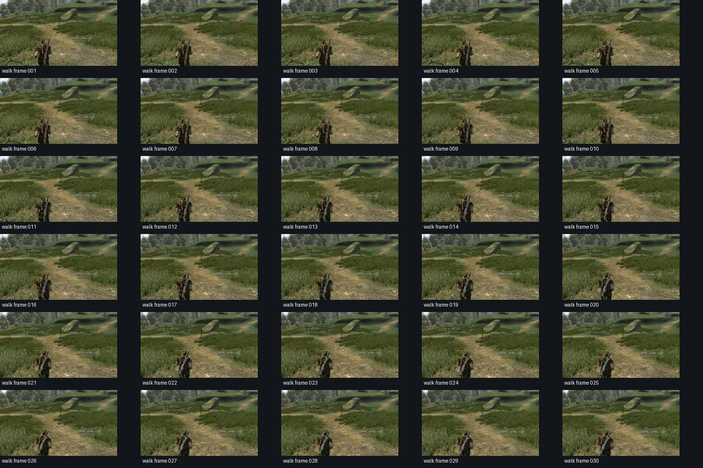

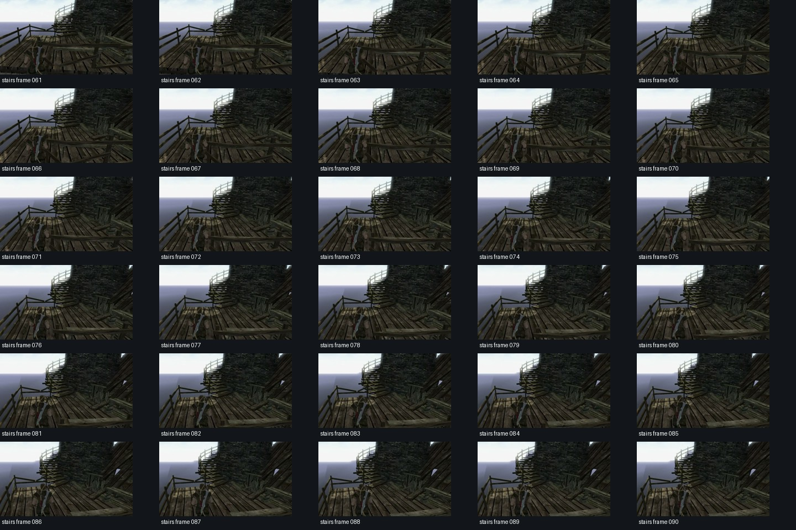

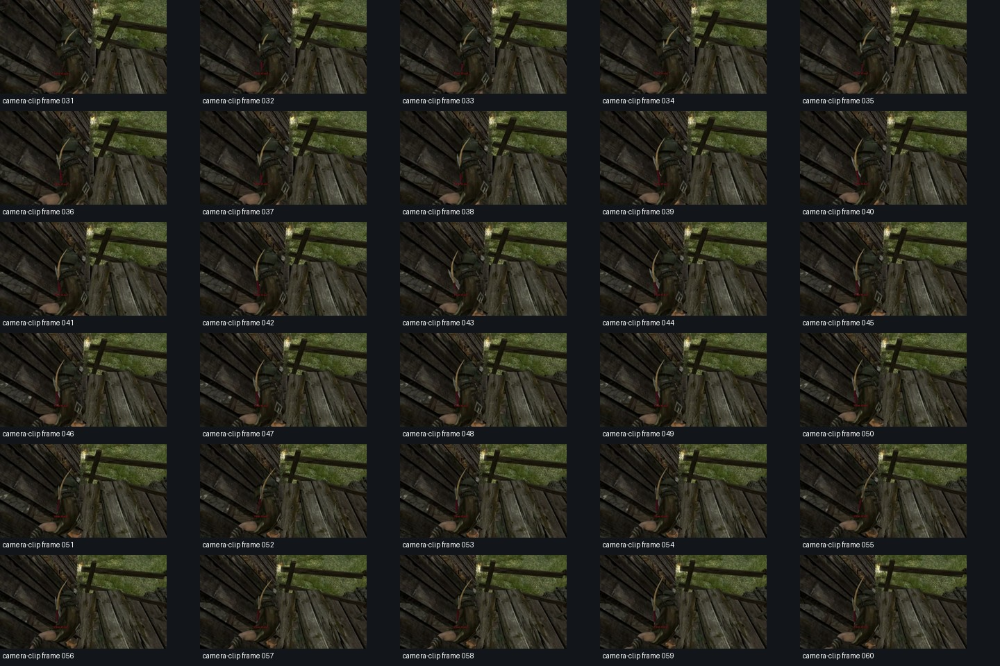

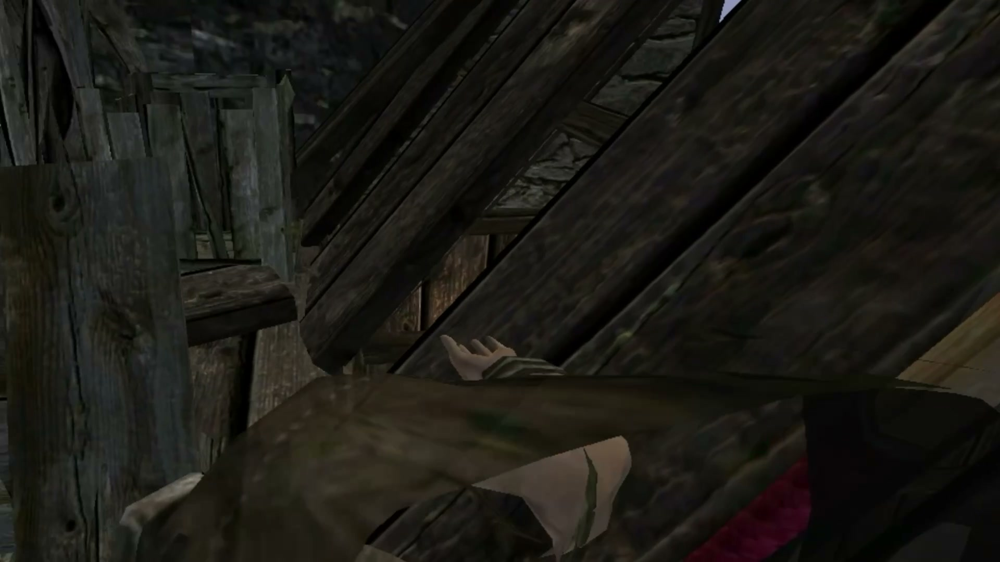

## Original Tervain production sequence derived from the ledger

1. **Build one controlled representative route.** Pick a hall courtyard → worn junction → meadow shoulder → wooded overlook → beacon approach. Keep this manageable instead of expanding every biome simultaneously. Use fixed native capture positions and a recorded normal walk through them. Let this route prove the style before spreading it.
2. **Repair the ground and plant hierarchy.** Low textured cover, meaningful wear/soil masks, variable grass heights, route/footprint exclusions and stable mip/alpha behavior come before simply increasing vegetation counts. The tree triangle budget is a ceiling; expensive overdraw can still make an under-budget tree unsuitable.
3. **Author architectural masses and construction.** Tall/low roof hierarchy, coherent original wood/stone family, completed all-sided geometry, deep thresholds, practical stairs and connected terrain foundations. Build one complete hall, ordinary hut and forge before variations.
4. **Make activities believable.** Grounded work stations; correct tools and grips; resident poses oriented to their work; clear entry, turning and interaction spaces; small deliberate lore marking. Keep irrelevant objects out of the center of routes.
5. **Refine actor motion and contact.** Preserve final 0.0.12 repaired geometry. Validate idle/walk/run/turn/stop/work/sit/attack with physical movement, real capsule support and cloth/limb clearance. Use actual authored clip phase/contact data if available; the road-hold burst cannot set a new speed.
6. **Resolve camera and distance presentation.** Match readable scene relationships with the complete intended desktop viewport, safe collision behavior and distance layers. Test draw-distance transitions in motion from both approach directions. Add distant silhouette geometry that remains stable, then tune fog; do not infer Gothic's exact FOV or LOD pipeline from cropped video.
7. **Add restrained atmosphere after the base is correct.** Quiet wildlife, a few justified fires, gentle limited cloth motion and a restrained audio/visual life rhythm. Dramatic portal/pre-rendered intro lighting is not the default town lighting target.
8. **Prove the result with a consistent acceptance set.** Same route, time-of-day, camera, quality and installed build; native game frames and a traversal video; local type/tests/build and asset/pose budgets; actual shader errors/contact diagnostics; representative desktop frame-time/memory measurements. No numeric engine-FPS assertion should use the source recording's 60fps container rate as evidence.

## Where the video itself falls short

The visual hierarchy and inhabited composition are useful, but the recorded example is not perfect. At very close range, roof/wood surfaces show coarse stretched-looking detail; silhouette edges remain visibly polygonal; some held-tool and conversation angles obscure the face; battle clutter overlaps bodies and props; extreme camera movement at the tower produces awkward inside-body/under-roof views. Tervain should retain the exaggerated large forms while improving those weaknesses. “More Gothic-like” is an art-direction target, not permission to keep these bugs or copy protected game assets.

# Current Tervain source levers for the Gothic 3 video audit

Prepared 5 October 2026, Europe/Belgrade. Read-only investigation. No game edits, new release, remote CI, or publication were performed. These are proposals, not implemented changes or newly approved lore.

## Evidence boundary and main finding

The source inspected is `Tervain repository (local checkout path withheld)`, documentation HEAD `9e7c6fbd`; latest accepted runtime source is `67788fa1`, character repair within 0.0.12. Landscape evidence from the preceding `88cf6678` revision remains relevant because the subsequent character repair does not modify the world/terrain/tree/hero sources. Use the latest character portrait for people, and label the older landscape captures with their genuine revision. Do not call either candidate live.

I visually inspected these supplied-video study frames: frame-sheet files `000689.jpg` (11:28 sign/road), `000748.jpg` (12:27 forest), `000837.jpg` (13:56 settlement hall), `000870.jpg` (14:29 table/steps), `000964.jpg` (16:03 lighthouse approach), `001088.jpg` (18:07 parapet), plus the native-size selected `second-half-native/12-33.jpg` coastal view. These are selections from the parent's broader frame analysis, not a claim that this sub-audit personally inspected every decoded frame.

The dominant gap is not insufficient total triangle count. Gothic 3's recorded look combines dense fine plant texture, believable material scale, irregular assembled structures, rolling spatial layers, and an inhabited arrangement of props. In current Tervain, a few oversized crown plates, discrete folded grass ribbons, dark repeated masonry joints, smooth broad ground, and generic rectangular structures are more visually legible than those finer ecological and human relationships. Increasing every model's polygon count would retain that mismatch and increase cost.

The current renderer already has useful machinery: eight height-blended terrain layers, triplanar stone, source-derived accepted crown masks, whole-root tree grounding, material batching, resident terrain tiles, analytic water relief/depth/reflections, calibrated authored hero locomotion, eleven-joint private NPC rigs, and a stable camera. Extend those systems surgically; do not replace the engine to obtain this look.

## 1. Tree crowns: repair the represented scale of leaves

**Observed contrast.** At 12:27, the reference's trunks are tall, relatively narrow vertical accents and its crowns read as collections of small leaves with numerous gaps. In current `final-eastern-oaks-high.jpg`, large olive-green plate-like leaves and broad opaque crown patches remain visible at ordinary gameplay distance. In `final-trail-high.jpg`, the hanging silhouette at the top edge contains prominent jagged sheets. Atmospheric treatment cannot make an obviously giant leaf cluster behave visually like fine foliage.

**Exact current source.** `src/presentation/meshyTrees.ts:117` maps family and explicit source IDs; line 122 sets family base heights to oak 18 m, birch 16 m, fir 24 m, shorepine 10 m, palm 14 m, orchard 7 m, shrub 1.5 m, dead 13 m. `createMeshyForest` applies the source transform, one uniform family scale, and root translation. Its private material clone uses roughness at least 0.88 for wood / 0.82 for leaves, environment intensity 0.35, zero metalness/emission, double-sided leaf rendering, and alpha-to-coverage when a cutout threshold exists. This is already a sensible material boundary; there is no universal missing alpha-switch fix to assume.

**Proposed remedy.** Inspect each prepared source's retained solid crown versus added leaf-card contribution separately. Reject crown surfaces that dominate the screen as sealed horizontal shelves or single giant leaves. Reauthor prepared crown geometry into smaller connected branch clusters, with original atlas cutouts depicting many leaflets per cluster, varied orientation, sparse perforations, and spatially coherent light/dark clusters. Keep actual branch attachment evidence. Preserve the custom 9,706-triangle pine untouched. Remixes belong in the asset preparation tool (`tools/build-meshy-trees.py`) and the prepared binaries, with current provenance and counts; never squeeze axes or bend trees based on the camera.

**Do not misdiagnose scale.** Base height is not an automatic failure: a tall tree is valid. The mismatch is the ratio of trunk diameter, crown mass, visual leaflet size, and surrounding buildings. Measure these in native captures before choosing another family-height table. A generic 20% scale reduction can improve a screenshot while breaking root contacts, clearings, and the accepted source silhouette.

**Acceptance.** Each new complete natural asset remains strictly below 20,000 triangles, counting wood, retained crown, attached custom foliage and hidden pieces. Capture each family front/side/back/upward at near, middle and far range, plus a continuous turn. Validate cutout coverage and texture mips. Recompute conservative rendered envelopes and canonical contacts if the prepared wood changes. Screenshots must show fine crown texture without sealed plates; motion review must show no alpha shimmer or visible distance substitution. Static attached gameplay foliage remains paused; detached falling leaves retain their existing bounded behavior.

## 2. Grass: replace the lawn made of ribbons with a coherent textured sward

**Observed contrast.** The reference sign at 11:28 stands in a continuous, fine meadow with taller localized grasses along the road shoulder; the 12:27 hillside also carries a coherent carpet punctuated by flowers/ferns. Current Tervain's foreground exposes individual low-poly folded blades and gaps of smooth dirt. This is primarily a representation and ground-integration issue, not a demand to cover the entire world with more instances.

**Exact current source.** `src/presentation/ground/grass.ts:59` builds a tuft from individual tapered folded blades, six triangles per blade, without a grass image atlas. High uses 13 blades per tuft, 4.6 candidate patches/m² before habitat acceptance/thinning, 16 m streaming tiles, 12–96 m distance fade; Medium 10/3.0/10–80 m, Low 6/1.4/8–64 m. Base normal bias is 0.26. `grassHabitatProfile` and `ground/habitat.ts` coordinate moisture, canopy, exposure, slope, roads and clearing masks. `ground/patchMaterial.ts` uses a standard rough material plus analytic rib/color variation, common hemisphere-oriented normals, root-to-tip shade, rank fade and pushers. The visually effective density is not 4.6 × 13 everywhere; habitat rejection, rank thinning, frustum and tile state all intervene.

**Proposed remedy.** Make a small original grass/herb atlas with dense internal tuft texture and irregular alpha edges; add two or three interleaved clump-card orientations and a minority of geometry blades where the outline requires thickness. Each instance should carry many fine strands in the image, not merely a wider solid ribbon. Use shared roughness, subdued yellow-green/olive colour families, darker roots and selected sun-facing tips. Retain per-root terrain grounding and stable tile seeds. Tie the underlying grass/heath ground albedo to the same colony field, so distant or thinned grass dissolves into a similar ground value instead of unveiling tan blank soil.

**Placement changes.** Build three readable grass populations: short trampled village/road grass, patchy coastal exposed grass, and meadow/woodland-edge tall tufts. Dense plants may grow near rocks and banks but must leave actual road width and interaction zones readable. Crown shade should exchange grass for litter/moss/ferns, rather than turn every canopy into an almost empty black oval. The sparse arrival remains sparse; compare ecological continuity rather than equal grass density everywhere.

**Acceptance.** Walk a repeatable path with Low/Medium/High saved settings, inspect side-on and shallow angles, and turn while running. Require gradual rank changes, stable ground value at the fade edge, no rectangular cards, no buried/torn roots or colliding UI, and readable pickup silhouettes. Measure alpha overdraw and shadow cost before increasing candidate density. New atlas preparation is a proposal, not authorization to feed reference-game frames to image generation.

## 3. Forest floor: connect texture, understory and tree bases

`src/presentation/forestFloor.ts` already authors deterministic fern/shrub/moss/litter/log/fungi colonies. It samples actual transformed source crowns when available, uses terrain tangent checks for flat carpet pieces, and excludes roads, physical tree wood, steep terrain and palm-inappropriate moisture. `src/presentation/plantedCrowns.ts`, `floraPopulation.ts`, `world/forestStands.ts` and `ground/habitat.ts` make the accepted trees authoritative for cover.

The reference does not distribute every plant family equally: fern islands gather around stones and hollows, flowers are accents against fine grass, trees frame gaps. Preserve that existing architecture but change the visual balance: use less empty dark earth, more low continuous litter/ground detail beneath crowns, clumped ferns next to existing stone/wood, and occasional open sunlit breaks. Do not convert clearings into uniform concentric exclusion rings. Author mulch transitions around bases from actual accepted canopy/root extent, and localize large shrubs to places that serve composition rather than a repeated cell lattice.

Use a close reference pair to distinguish texture detail from real physical clutter. A dead branch may be a tiny decorative mesh, but a log tall enough to affect a route must share finite support/contact data. Props can be sparse near the starting strand while still being ecologically convincing.

## 4. Terrain: create spatial rhythm with a few deliberate forms

**Observed contrast.** Reference 12:27 has overlapping slopes: near rock/fern bank, descending trees, a middle trough, then an ascending distant wooded hill. The coast at 12:33 layers near vegetation, a lower hut/fence shelf, ochre sand, blue sea, lighthouse wall, distant promontory. The layers remain intelligible despite recording blur. Current Tervain now has a bay/headland and hills, but broad smooth slopes and simple material bands can still expose a procedural surface.

**Exact current source.** `src/world/layout.ts` holds the authored coast, shelves, forest hills/swale, arrival and lighthouse polylines/grades, building footprints and world anchors. World bounds are x −380..200 m, z −170..170 m, canonical height grid cell 2 m. `world/coast.ts` shapes the coast and lighthouse cap. `world/terrain.ts` composes authored forest relief, low boundary rise, local bumps, road/stream cuts, terrace support and natural rock surfaces. `presentation/terrainMesh.ts` uses render subdivision 2: material samples refine to 1 m while sampling the same authored physical planes; 64 rendered-cell resident tiles allow ordinary frustum culling without terrain unloading or distance LOD. Tile normals are copied from the globally computed surface to avoid seams.

**Proposed remedy.** Compose the existing coast/forest with a small number of authored banks, shallow gullies, broken shelf rims and variable-width road shoulders. Prioritize silhouettes visible from ordinary playable paths: one left-side foreground bank, a clear bend toward a landmark, a contrasting middle depression and a low distant closure. Use offset, irregular forms instead of repeating radial bumps. The lighthouse approach can widen near its entrance, narrow past a bank, and reveal the roof before the full tower. Do not add an alpine mountain wall over the sparse coast merely because an earlier reference contains distant mountains.

Terrain, visibility and navigation must read the same forms. Any edited height requires tree base re-grounding, finite rock/support checks, canonical obstacle review and saved-position compatibility. Extra render subdivisions only create extra triangles if they continue sampling the old plane; they cannot add real terrain shape and may worsen cost. Physical local relief must be authored in the shared height/support source, not cosmetic shader displacement under the player's feet.

**Acceptance.** Use fixed views of arrival, trail fork, forest trough, eastern grove, bay, lighthouse approach, village and archive threshold. Inspect slopes at player height rather than fly-only beauty viewpoints. Require a clear walkable route, easy ordinary rock landings, no levitating whole bases, no road ending at an ornamental obstruction, and no changed obstacle IDs caused solely by preset choice.

## 5. Ground materials: improve scale and relationship before extra microdetail

`src/presentation/terrainMaterial.ts` already height-blends eight texture layers: grass, heath, earth, gravel, sand, wet sand, rock, compacted path. Repeats cover respectively 2.4, 2.8, 2.2, 1.8, 3.2, 3.2, 3.6 and 2.0 m. Dry roughness is 0.95–0.99; wet sand is 0.4. Rock is world-axis triplanar, texture gradients are explicit and detail fades with range. This is a better starting point than introducing another terrain material framework.

The reference ground succeeds because it is legible as tiny plants, pale stones, compact dirt and moss gathering in physical depressions. Current noisy/smeared broad colour can read as low-frequency camouflage. Reauthor original layer content to recognizable, consistently scaled features; reserve fine noise for detail, medium patches for growth/traffic and broad fields for the ecosystem. Calibrate gravel pebble sizes against boots, and compare exposed stone with wall stone. Blend route edges in broad irregular islands; avoid crisp ribbons and avoid muddying the central travelled strip so much that it vanishes.

Bake broad material occlusion/contact into the original albedo only when it is associated with the material (mortar, moss/stone pores); do not bake a sun direction into universal tileable terrain. Keep day/night lighting functional. Do not add sharpen/grain to simulate missing ground geometry or bitmap content.

## 6. Architecture: use bespoke assemblies on top of the efficient build kit

**Observed contrast.** At 13:56, the reference hall's large warm roof is the dominant form. Its uneven eave, timber boards, diagonal framing, tall dark wall, nearby palisade and irregular steps feel built and repaired. At 14:29, shallow stepped stone terraces, a plank platform, roof supports, clutter and a loaded table describe a working settlement. The lighthouse at 16:03 and parapet at 18:07 have linked wooden circulation and stone structure. Native Tervain's current character portrait shows a materially flatter façade with prominent dark schematic stone joints and a generic roof/noticeboard combination.

**Exact current source.** `src/presentation/buildings.ts:buildStandard` assembles one of timber/plaster/stone wall forms, dark backing core, roof, windows, chimney and sparse use-clutter. `structures.ts` supplies slabs, quoins, frames, foundations, steps and doors. `roofs.ts` already builds real closed decking/underside/eaves, individual courses, chip/fray, pitched overlaps and broad correlated weathering: tile course 0.24 m, piece width 0.3333 m; slate .27/.31; thatch .36/.66; shingle .38/.26. Its functional complete-shell work should be retained. `settlement.ts` is explicitly all procedural primitives and does not currently request external structure models. `buildKit.ts` and `regions.ts` merge geometry by material and region rather than one draw per stone.

**Proposed remedy.** Create 3–5 original hero building assemblies: keeper/lighthouse compound, inn or trading hall, ordinary timber cottage, stone archive and a work shed. Share beams, posts, stone steps, roofing and materials, but author structural proportions and history per building. More asymmetry is meaningful if it follows use: a replaced section of planks, an older stone retaining wall under a newer timber wing, one leaning porch support, a partially mismatched repair row. Independent per-vertex jitter everywhere produces noise, not craftsmanship.

Increase roof silhouette variation through broken but closed eaves, visible beam ends and grouped roof wear; avoid a perfect ridge and repeated horizontal black stripes. Give each timber wall a large readable board grain and occasional broad discoloration, with actual open/slit window depth and door casing. The dark wall core is valid as gap backing but must not make open traversable interiors or doorways appear artificially sealed. Scale bench heights, stair risers and railings against the accepted 1.8 m character.

Retain fully completed roof/wall/foundation geometry. Do not manufacture the reference's appearance by creating missing backs or gap-ridden shells. `world/buildingEntries.ts` and `world/lighthouse.ts` are the shared thresholds/support authority; presentation edits must preserve the measured entrance and walkable surfaces or deliberately update both sides with tests.

## 7. Masonry: stop dark joints from reading like a drawn grid

`buildingTextures.ts:134` produces coursed rubble from seven horizontal courses and four/five columns per 2 m stone repeat, warped slightly with periodic noise. Mortar is strongly darkened toward RGB .075/.070/.052, and the generated height recess is then converted into normals. `regions.ts` applies stone normal scale .8 and roughness .98; albedo is multiplied by vertex colour. Thus making the material matte has already been done. The remaining black block-outline look is not fixed by another roughness increase.

Propose a new original rubble material with more irregular stone silhouettes, broken courses and thin warm grey mortar rather than universally near-black creases. Build variation at the stone face and whole-wall scale: mottled light/dark weathering, selected moss at the damp base, pale worn outer corners, localized repaired patches. Check vertex-colour × albedo energy before painting a second dark tint. Keep quoins/support stones visibly larger than infill; current universal stone repeat on every area makes structural parts equally patterned.

Reserve modeled protruding blocks for the skyline, doorway, parapet top and near corners. Ordinary wall interiors can remain textures. At 18:07, broad rough rocks forming the parapet silhouette carry the impression; tiny repetitive joints alone do not. Material realism is an artistic relationship, not more scalar roughness.

## 8. Settlement props: organize evidence of use

The reference table at 14:29 contains several distinct sizes, heights and objects against a continuous worn surface. Barrels, buckets, crates, firewood and stairs gather by an entrance, not at equally spaced coordinates across an open square. The comparison should imitate that human organizing logic without copying the exact table, bodies, quests or layout.

`settlement.ts`, `props.ts`, `structures.ts`, `physicalProps.ts`, `worldPickups.ts` and `world/layout.ts` are the concrete levers. Existing movable supplies and one-time provisions are systems to build on. Author a carpenter's clustered bench, keeper's fuel corner, modest store unloading patch, or inn doorstep repair—original environmental narratives that identify a resident's role. Give each vignette a focal large object, two/three medium supporting props and small accents, with clear walking clearance and no giant logo decals. Cloth/banners should use current original lore and approved insignia; the menu keeps exactly one Hegemony banner.

Do not make decorative items secretly collectible or grant quest state by proximity. Keep observation nonblocking and no dialogue window in this exploration pass. Props intended for lifting or support must retain consistent render/physics transforms and bounded meshes. Avoid importing reference names such as Cape Dun or Gothic quests into Tervain canon.

## 9. Light and colour: calibrate the whole scene, not one screenshot

The source video has bright sky, substantial distant violet/blue haze, warm roof/sand, dark wood, green grounds and fairly directional sun. The recording also contains blur/compression and changing camera framing, so its colour should not be treated as a lossless engine LUT or measured physical exposure. Its regional value grouping is the valid inspiration.

Current `app.ts` sets ACES filmic tone mapping and PCF shadow mapping. `sky.ts` has explicit daylight keyframes, sun/hemi/moon, and FogExp2 density .0031 at construction; `SkyRig.update()` replaces that with .0019 + .0019 × nightness (.0019 in daylight, .0038 at full night). Its sun shadow frustum is 140 m wide, normalBias .075 and bias −.00018. World quality shadow sizes are High 4096, Medium 2048, Low 1024. `environment.ts` generates a low-resolution original sky IBL every 1.8 seconds, intensity .78 on High/Medium, .73 on Low, plus slowly eased exposure. `grade.ts` adds display-space saturation .94, contrast 1.06, vignette 0.1 and grain 0.004; quarter-resolution bloom starts at threshold .85 with strength 0.24. Chromatic separation is already off in the shipped natural image.

Propose a fixed neutral daylight comparison first. Tune background horizon, fog and environment colour together so hills have decreasing contrast and cooler distance while near ground retains a warm/cool material distinction. Avoid globally reducing saturation until all foliage becomes khaki, or globally lowering fill until the woodland is black. The brighter native reference forest retains low-detail dark trunks while having a lively ground carpet. Set leaf transmission and source albedo before raising hemisphere fill, which can flatten people and all walls.

Do not assert native Gothic 3 uses the same IBL, ACES, shadow settings or post pipeline; these are Tervain controls with analogous visible purposes. No SSAO pass is currently evidenced in `grade.ts`; a restrained ambient/contact solution is an optional experiment, not a prerequisite. Test fake contact darkening or a low-cost effect in one location first, rejecting black halos, grass speckle and double darkening of authored albedo. Never mask invalid support with an AO blob.

Validate noon, overcast-like daylight and night separately. Preserve existing night route/cloth readability and lantern headroom. Global changes must not destroy the score-led dusk menu's material identity; grade exposes get/set restoration precisely for separate menu/game looks.

## 10. Sea and coast: quieter palette, stable reflection and stronger land layers

Current Tervain already has metre-based sea waves of wavelengths 34/18/10 m and amplitudes .35/.21/.08 m plus a .12 harmonic, shore damping, depth absorption, filtered highlight/ripple math and planar reflection. `seaGeometry.ts` supplies sufficient geometry sampling. `waterRenderPass.ts` refreshes a moving camera's reflection every visible pose rather than throttling it; stationary capture uses bounded cadence. High reflection target is 512², Medium 384²; Low skips the higher optics path. These stability fixes must survive art tuning.

Reference 12:33 has a large comparatively quiet blue/violet sea field, a warm sandy band and very distinct foreground/intermediate/distant layers. Propose calmer colour/normal/highlight balance for the same daylight conditions, with deeper sea value offshore and pale shallows confined to measured depth. Adjust authored coastal shelf silhouette and far promontory grouping first. Do not solve shallow-looking water by making the whole shore opaque blue or causing wave displacement to penetrate land.

The distant original silhouette in `coastalBackdrop.ts` / `world/distantCoast.ts` should continue being resident scenery. A more legible layered headland can be authored without importing a reference terrain heightmap. Keep physical wetness elevation-aware on outcrops and preserved easy rock landings.

Acceptance is a shoreline run-and-turn sequence, not one still. Check reflection movement, glints, far-normal filtering, bounds at screen edges, shore mask, wetness on raised rocks, fog horizon and repeated noon/night. The source video's blur is not evidence that Tervain should deliberately render unstable reflections or smear the whole picture.

## 11. People: preserve the latest repair, then integrate cast into scene scale

Use `final-game-character-portrait.jpg` from runtime 67788fa1. The preceding request already repaired17 NPC surfaces and reduced long-skirt distortion; their completed maximum is46,980 triangles including equipment. Do not compare the older collapsed-face screenshot as though it is the current implementation.

`meshynpcs.ts` owns per-world private rig/geometry/material resources; `npcSurface.ts` conditions normals for the reduced Meshy cast at strength 0.38 with forward floor .65. Current rebaked assets preserve source-derived custom basis and original UVs as secondary data. `actors.ts` resident/enemy gait advances with actual collision-resolved metres, preventing blocked walking-in-place. The hero remains the distinct approved 65k derivative, native PBR and all six authored clips with calibrated Walking 1.65 m/s  / Running 5.85 m/s; do not impose the NPC 50k cap on it accidentally.

Reference inhabitants are comparatively bulky, clothed silhouettes with purposeful gestures, often staged against props so their jobs are visible. The next improvement should be cast staging, distinct posture/task selection, believable eye/hand direction and environmental framing, not another universal high-poly character rebuild. Tune a specific work loop near an actual bench only if its hand/task placement is checked in motion; avoid constant broad synchronized idles. Retain controller-authoritative support, unarmed start and inventory-equipped weapons. Eleven-joint procedural NPC movement is not an imported authored animation collection or cloth simulation.

For any future surface/rig change, require native front/side/rear/close face plus a full walk, widest stride, sitting and work modes; a neutral bind or final screenshot is insufficient. Preserve the existing independent actual-GLB validation and source identity/provenance.

## 12. Camera: preserve stable control; compose like a third-person world

`cameraRig.ts` has PerspectiveCamera60°, near .1 m, far1400 m; default follow distance5.4 m, player control range2.6–9 m, pitch−.65..1.25, target offset1.55 m. Horizontal target lag was deliberately removed because it pulled the view through corners; vertical easing is frame-time-based, obstruction shortens the boom promptly and expands it gradually. Contact is checked against canonical nearby obstacles and piecewise planar terrain, with reset on load/teleport.

The recorded reference often keeps the hero low in the frame while the road, forest or architecture occupies the center and upper area. This is worth studying by apparent hero screen height and horizon position, not copying a guessed FOV. Establish a fixed Tervain camera shot with measured viewport and actual standing height; vary camera distance/pitch/target slightly for proposals, keep user manual look responsive and preserve obstruction clearance. A closer camera can enlarge characters but will not fix giant crown plates or missing material structure.

Do not introduce handheld shaking, excessive spring lag, automatic zoom pumping or exaggerated locomotion bob. Those were previous owner complaints. A screenshot-only cinematic camera is not proof the default playable camera is appropriate.

## 13. HUD and interactions: retain actual systems, reduce visual competition

The reference footage frequently lets the world and small object label dominate. Current Tervain has a large persistent objective panel upper left, purse/time/access hints upper right, a gold compass, a central ten-slot hotbar and lower-right health/stamina. The latest native portrait also contains a very prominent noticeboard text plate. That is a presentation difference, not necessarily an invalid system.

`presentation/ui/hud.ts`, `hotbar.ts`, `uiModel.ts`, `src/style.css:1473–1578` are the local controls. Hotbar slots are real item/weapon actions and bindings; they must remain 1–0 and empty on a fresh game. Do not substitute inventory/journal/map icon shortcuts in the center. Inventory drag/drop, keyboard assignment/swap/clear, consumption/equipment, saved bindings and map behavior remain functional.

Propose smaller calmer framing, thinner weathered edges, lower decorative gold contrast and fewer persistent access reminders after the player learns them. Keep text accessible and controller/keyboard focus obvious. A compact optional objective presentation should still convey navigation and objectives; any hide/auto-fade preference is a proposal. Object interaction can use a short restrained world-space name plus a contextual input cue, rather than a huge screen plate, while still avoiding occlusion and unreadable distance labels.

Do not use the reference's recorded absence of a HUD as proof that its native interface is always hidden. Keep the current no-dialogue exploration policy. The gold/Hegemony/Templar vocabulary belongs in original Tervain design; do not redraw the exact Gothic HUD.

## 14. Performance: triangles are necessary accounting, not the image-quality diagnosis

This source inspection did not run a benchmark; no frame rate, minimum specification or GPU capacity claim is made. The recording is not a benchmark of either game, and its motion/compression does not reveal native draw calls, geometry count, shader cost, texture residency, CPU time or shadow passes.

Natural asset20k /NPC 50k limits remain strict, but total frame cost also includes instance population, shaded area, cutout overdraw, shadow pass, reflected scene, skinning, terrain/material samples, MSAA/render pixel count and post passes. High currently renders at device pixel ratio up to2, Medium1.5, Low1; a high-DPI screen can therefore shade4× the CSS pixel count before water/post overhead. Quality policies deliberately retain source-faithful High trees and full resident terrain. Do not silently restore popping/unloading to improve a reported number.

Profile representative gameplay scenes individually: coast water, deepwood crown/ground overlap, village NPC group, lighthouse compound and score menu. Record build/revision, viewport, DPR, preset, device/browser, warmup, route, frame-time median/p95/p99, draw/triangle numbers across all passes and memory/asset loading. Use CPU/GPU timing where supported, state availability instead of inventing values. Split cold loading from warmed movement. Close other expensive game or gallery views during capture so the measurement reflects one active Tervain scene.

Potential efficient improvements include retaining region/material batching for buildings; atlas/texture sharing with correct private lifetimes; tighter conservative bounds; omitting reflected objects genuinely outside reflection frustum; coherent texture-based vegetation detail instead of expensive tiny modeled leaves; and stable ranked ground detail transitions. Any changed visibility must retain silhouettes and continuous appearance while moving/turning. Alpha cards can save geometry and increase fill cost; measure both before making them a universal policy.

## 15. Proposed implementation sequence and measurable gates

### Pass A — one reference-matched playable corridor

Choose the existing shore→sign→woodland bend, keeping location IDs, saves and readable route. Repair one representative broadleaf crown and one grass/herb material; connect floor albedo, understory colonies and plant density; author two/three banks that form foreground/middle/background. Capture the same fixed playable views before/after and one continuous walk/turn. Accept only if it reads like fine inhabited vegetation without silhouette distortion, new contacts or pop.

### Pass B — one original working settlement vignette

Use the existing village/waystation, not a wholesale geographical clone of the reference town. Improve one hall/cottage roof and façade, remove the outlined masonry look, add a coherent entrance/stair/worktable assembly with original props, and place two existing NPCs doing relevant tasks. Preserve complete geometry/support and correct equipment. Review day/night, every side of the building and entry/climb routes. Reuse this kit for later structures once its look is proven.

### Pass C — lighthouse/bay composition

Retain graded route, stable water optics and the shared lighthouse construction measurements. Add original weathering/roof/railing silhouette variation, improve coastal shelf/headland layering and quieter sea palette. Validate the source's 16:03 approach/18:07 elevated viewpoint relationship as inspiration while composing Tervain's own shape. Inspect all steps, deck support, rock landings and saved-player positions.

### Pass D — scene calibration, interface and bounded scaling

After materials/geometry are credible, tune daylight/fog/IBL/grade with fixed captures. Simplify HUD competition without changing item functions. Scale proven kits across coherent habitats and buildings, preserving source budgets / wood authority and paused foliage. Run strict TypeScript, appropriate regression/full suite and production build; verify actual files and warmed native motion. Keep each acceptance category distinct: tests, binary audits, native appearance, hardware cost and live publication.

The key completion test is that a regular walk across the current world carries the same material scale, connected plants, spatial layers and human construction quality—not merely that one staged picture looks vaguely green and medieval.

## 16. Existing boundaries that implementation must preserve

- 0.0.12 and the owner-held 0.0.x stage; no automatic 0.0.13 / 0.1 promotion.
- Original serious PC single-player high fantasy with Hegemony-affiliated Templar traces; no imported Gothic map/characters/UI/lore or Hyperion canon.
- All supplied originals read-only; original custom pine untouched; every other complete tree / stone <20k and NPC ≤50k including hidden equipment.
- Hero native maps, identity, all six clips, calibrated distance-driven movement and resolved collision/support, plus at least two minutes fresh-meter running endurance.
- Static attached gameplay foliage; detached falling leaves and separately authorized menu motions keep existing Reduced Motion behavior.
- Sparse arrival, clear road/sign, graded lighthouse entry, whole-base tree/stone grounding, canonical contacts independent of graphics preset, physical saved positions and gradual visibility continuity.
- Real ten-slot empty-at-start item hotbar, inventory/equipment/pickups, journal/map/save systems; no dialogue window or observation-based quest/trust grant.
- Score-led tree door/wisps and exactly one approved Hegemony banner in the menu; no new song video requested.
- Study-only local reference evidence. The video frames are private analysis pictures, not assets for the shipped game or image-generation input.

## 17. Remote publication is a separate gate

The latest local work remains durable. Required checks were unavailable at the historical checkpoint. Hosting was separately unverified in that snapshot. Do not bypass required checks or alter service triggers to obtain a green release.

Before any push, PR creation/update, merge, dispatch/rerun or trigger edit that can start Actions, the coordinating assistant must inspect the current UTC day's full repository run history across every workflow, actor and branch, including queued/in-progress/completed runs and rerun attempts of older runs. Estimate duplicate push/PR events, downstream workflow_run chains, scheduled/GitHub-generated services and likely runner minutes. Unknown monthly usage stays unknown; do not acquire extra billing access merely to resolve it. Coordinate agents against that snapshot and handle exceptions under current owner approval policy. This audit itself requires no remote mutation.

## Source index for the coordinating report

| Visual domain | Current source | What to change first | What to preserve |
|---|---|---|---|
| Prepared foliage | `tools/build-meshy-trees.py`, `presentation/meshyTrees.ts` | crown-scale/cluster representation, original cutout maps | protected pine, full 20k counts, uniform scale, wood contacts |
| Forest ecology | `world/forestStands.ts`, `presentation/floraPopulation.ts`, `plantedCrowns.ts` | coherent crown/ground/understory relationships | independent seeds, roads, native source silhouettes |
| Grass | `presentation/ground/grass.ts`, `patchMaterial.ts`, `habitat.ts`, `tileStream.ts` | fine textured tufts + continuous matching ground value | rooted geometry, rank fades, bounded streaming |
| Understory | `presentation/forestFloor.ts` | connected fern/litter/moss colonies | actual crown masks and tangent/support checks |
| Topography | `world/layout.ts`, `terrain.ts`, `coast.ts`, `distantCoast.ts` | deliberately composed shelves/banks/troughs | graded paths and canonical support/nav |
| Ground look | `presentation/terrainTextures.ts`, `terrainMaterial.ts`, `groundSplat.ts` | recognizable scaled material content | height blend, rock triplanar, wetness |
| Terrain submission | `presentation/terrainMesh.ts` | existing full-detail resident tile organization | shared normals and no distance unloading |
| Architecture | `presentation/buildings.ts`, `structures.ts`, `roofs.ts`, `buildKit.ts`, `regions.ts` | bespoke assemblies and grouped wear | closed shells, batching, measured entrances |
| Wall textures | `presentation/buildingTextures.ts`, `regions.ts` | irregular rubble/thinner warm mortar | matte light response, correctly scaled maps |
| Use-clutter | `presentation/settlement.ts`, `props.ts`, `physicalProps.ts`, `worldPickups.ts` | original coherent work/doorway vignettes | real interactions/contact/pickup state |
| Sea/coastal depth | `sea.ts`, `seaGeometry.ts`, `waterOptics.ts`, `waterRenderPass.ts`, `coastalBackdrop.ts` | calmer palette and coherent land layers | wave/depth stability, moving reflection cadence |
| Atmosphere | `sky.ts`, `skyState.ts`, `environment.ts`, `grade.ts`, `app.ts` | fixed-scene value/colour calibration | readable nights, separate menu look, stable pipeline |
| People | `meshynpcs.ts`, `npcSurface.ts`, `actors.ts`, `mainHero.ts`, `hero/` | purposeful staging/task direction | latest surface repair, private resources, authored hero clips |
| Camera | `cameraRig.ts`, `cameraObstruction.ts` | measured framing experiments | responsive regular look and stable obstruction |
| UI | `ui/hud.ts`, `ui/hotbar.ts`, `ui/uiModel.ts`, `src/style.css` | quieter visual weight | accessible genuine ten-slot item actions |
