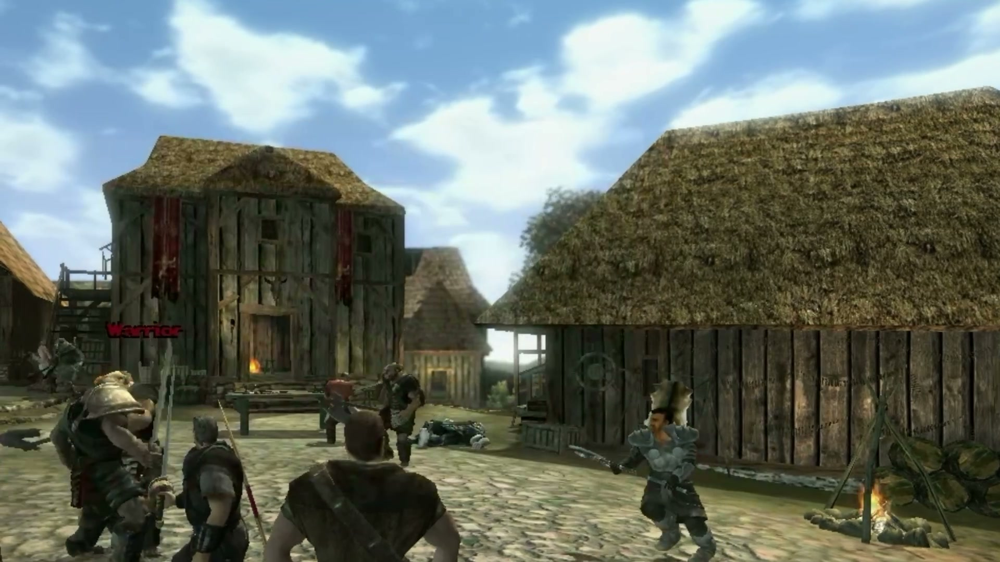
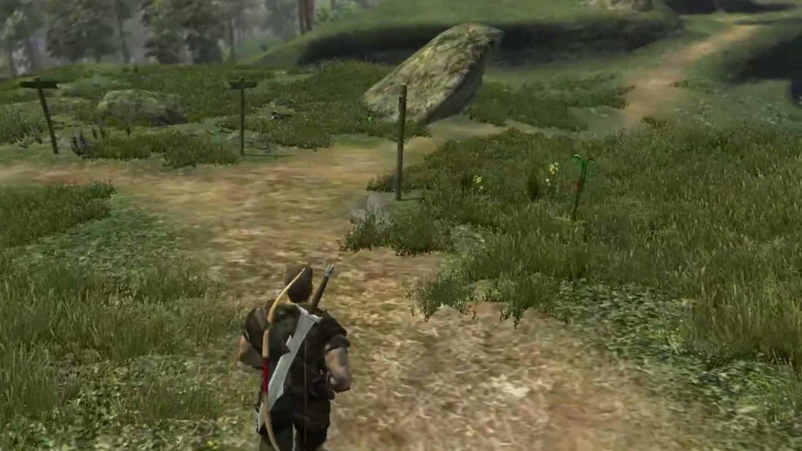
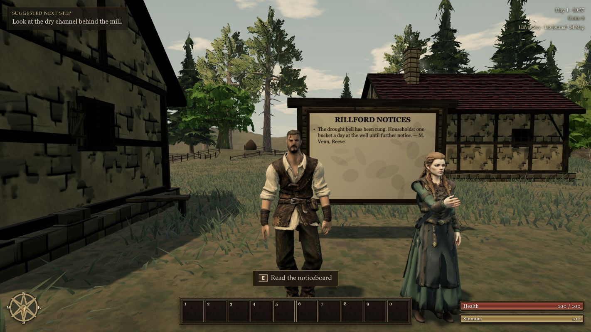

# Gothic 3 video and Tervain visual audit — 5 October 2026

**Status: historical study material, imported 7 October 2026.** The owner supplied the standalone `Tervain-Visual-Audit.pdf` and the accompanying illustrated audit folder for repository documentation. This edition preserves their findings, comparisons and selected visual evidence. It does not adopt the reports' embedded instructions, approve their proposed lore or implementation, or certify the current game.

The study's central finding is that **connected composition, believable scale and material hierarchy matter more than extra triangles**: a worn road connects a functional yard to a building; low plants reveal the terrain; large warm roofs frame people; rocks, roots and steps meet the ground. Tervain should interpret those relationships through original work.

## Start here

| Material | Purpose |
| --- | --- |
| [Illustrated report](Audit.html) | Full report with annotated images, 23 main chapters, 44 proposal tickets and two technical appendices. Download this directory and open the HTML locally; GitHub's file view displays its source. |
| [Corrected bundle PDF](Tervain-Visual-Audit.pdf) | Preferred 97-page reading copy, including the later water and fog corrections. |
| [Separately submitted PDF](Tervain-Visual-Audit-submitted.pdf) | The distinct earlier 97-page submission, retained for traceability. |
| [Markdown report](Audit-text.md) | Searchable report text, including the complete T01–T44 proposal ledger. The HTML/PDF retain the primary annotated figures. |
| [Reference observation ledger](reference-ledger.md) | Timestamped observations separated from suggested Tervain translations and acceptance checks. |
| [Historical engineering proposals](tervain-gap-sourcearchitecture-render-material-camera-HUD-performance-proposal.md) | The source controls and implementation hypotheses inspected at the time. Recheck them against current code before planning changes. |
| [Selected motion inspector](Frame-Atlas.html) | All four 120-frame gameplay passages with frame stepping and their 16 contact sheets. This repository edition is a selected atlas, not the whole recording timeline. |
| [Retained evidence catalog](frame-index.json) | Recording timestamps, zero-based source frame numbers and the explicit archive boundary. |
| [Recording probe](source-probe.json), [analysis summary](analysis-summary.json), [frame metrics](every-frame-metrics.csv) | Supplied technical evidence, with private source paths removed from metadata. |
| [Source and package manifest](study-manifest.json), [import checks](import-validation.json) | Original PDF fingerprints, retained-file hashes, adaptations and bounded repository validation. |

## What the study establishes

The owner-supplied recording is `2026-10-05 16-00-07.mov`: 1920 × 1080 H.264, 19:24.517 long, recorded at 60 frames per second. Its supplied SHA-256 is `bc4221ac17de325a83d78644f64669cb2bb0329ab5fd34cdfd25916938821e0b`. The MOV is not copied into the repository.

The original audit reports a complete decode of **69,871 frames**, numerical luminance/difference measurements at **96 × 54**, chronological visual sampling through **1,165 one-second images / 59 sheets**, selected detailed pictures, and **480 consecutive frames** across four passages. That is not manual full-resolution review of all 69,871 frames. This import checks the supplied records and selected images; it does not repeat the source-video decode.

Capture rate does not establish game FPS, hardware cost, simulation timing, optical flow, exact field of view or collision implementation. Recording crop and missing feet limit gait/contact interpretation. The passage called `walk` is mostly a roadside hold. Brightness relationships are observable; underlying engine constants cannot be recovered from them alone.

| Recording passage | Read it as |
| --- | --- |
| Opening menu/loading images | Title hierarchy, broad theatrical color groups and interface composition. |
| Approximately 00:56–04:19 introduction | Cinematic mood and silhouettes; not evidence of gameplay water, lighting or rendering cost. |
| 04:24–approximately 10:40 | Inhabited courtyard, usable lanes, large construction masses, combat and item interfaces. |
| Approximately 10:40–12:45 | Primary outdoor reference: branching roads, plant scale, crown layering, rocks and coastal slopes. |
| Approximately 12:45–15:40 | Thresholds, tables, workspaces and resident staging. |
| Approximately 15:40–18:30 | Lighthouse route, lookout construction, conversation/trade and stairs. |
| Final gameplay camera intersections | Negative contact/camera examples to test against, not behaviors to reproduce. |

## How to translate the findings

| Domain | Visible evidence / useful times | Proposed original Tervain work | Review criterion |
| --- | --- | --- | --- |
| Connected places | 04:24 courtyard; 05:15 gate; 11:05 junction; 12:33 coast | Develop one continuous settlement-to-beacon corridor with deliberate openings and landmarks. | At hero height, the route and destination remain legible without the map. |
| Ground cover | 06:50 mineral flecks and bare use areas; 11:28 path edge; 12:18 woodland floor | Layer low cover, soil, litter and localized tall stems; use activity and shade to determine placement. | Feet, travelled margins, stairs and foundations stay visible; hiding tall grass does not destroy the ground composition. |
| Trees | 11:48 broadleaf crown; 12:16–12:18 slope | Smaller twig/leaf groups on connected branches, varied crown cohorts and useful sky holes. | Check cardinal and underside views, alpha/shadow agreement and complete runtime geometry budgets. Preserve the custom Pine contract. |
| Rocks and relief | 12:18 hillside; 12:33 bay; 18:07 lookout | Broad stratified masses, matte weathering, buried bases and subordinate stones. | Visual shelves agree with movement support and camera clearance. |
| Construction | 13:56 roof; 14:06 hall; 15:23 workshop; 18:07 lookout | Irregular large roof/wall groups, deep openings and an original connected construction kit. | Backing, gables, foundations, stairs and rear views remain complete; asymmetry has construction logic. |
| Props and people | 14:29 table; 15:23 workstation; 16:15 resident | Give clusters a job and space to approach; prioritize coherent silhouette, surface paint, posture and motion. | Items, work poses and collision agree; movement timing follows actual resolved travel. |
| Light and atmosphere | 04:24 roofs; 12:33 coastline; 16:03 beacon approach | Calibrate warm surfaces, cool shade and declining distant contrast together. | Compare a fixed route/hour/preset, with sharp nearby detail and readable dusk/night. |
| Water | 12:33 gameplay coast versus 01:31 cinematic sea | Refine the existing physical water and land joins using gameplay evidence. | Walking/running views stay stable; refraction, depth, support, swimming and banks remain consistent. |
| Interface and identity | 16:57 inventory; opening menu | Preserve current functions and the original Hegemony-affiliated Templar identity; reduce competition with the world. | Controls remain readable, the starting hotbar stays empty, and faction marks have a contextual purpose. |
| Performance | Supplied Tervain captures and metrics | Measure matched cold/warm routes on declared hardware, including alpha overdraw, shadows, memory and frame-time tails. | Report actual costs and continuity; do not treat polygon totals or a recording's frame rate as performance acceptance. |

The report's suggested order is **shape/scale/contact first**, then materials/light/contextual animation, then secondary detail and icons. Its 44 ticket IDs are stable study references, not an approved backlog or completion checklist. Before implementing a ticket, compare its historical diagnosis with the current build and the [owner decision register](../../../decisions.md).

### Example evidence

*Third-party Gothic 3 recording evidence: construction hierarchy and a usable shared floor, not Tervain geography or a reusable game texture.*

*Third-party Gothic 3 recording evidence: the track, plant shoulders and landmark boulder serve different spatial roles.*

*Historical Tervain evidence after the character surface repair. It is not a capture of the current release.*

## Historical baseline and later changes

The report inspected documentation revision `9e7c6fbd`, accepted character evidence `67788fa1`, and preceding landscape evidence `88cf6678`, within **0.0.12**. The current repository was **0.0.13**, at `34516bf6`, when this edition was prepared. The older report's private-study label, version hold and CI/hosting block describe its creation context; they are not the present project's status.

Use the [character repair record](../../character-polish-2026-10-05.md), [current grass record](../../../engineering/grass-0.0.13.md), [physical water record](../../../engineering/water-0.0.13.md) and [0.0.13 release evidence](../../../production/releases/0.0.13.md) when evaluating the current game. In particular, 0.0.13 removes the folded grass tufts and patch material criticized in the audit and introduces a blade engine, wind, trampling and a title meadow. This supersedes that diagnosed implementation; it does not prove every vegetation/composition ticket has passed visual acceptance. Recheck historical file paths and tuning values before using Appendix B.

The separate [Gothic 3 browser rebuild](../../../engineering/gothic3-browser-port.md) has its own source and release records. These visual proposals concern the original Tervain game; importing this study does not implement a reconstruction checkpoint.

## Repository edition and privacy

Both PDFs contain 97 pages but are different revisions. The bundle version corrects wording on page 27, the existing water-depth path on pages 38–39 and dynamic fog density on page 91. It is the preferred report. Both submissions are retained, with local recording/checkout paths replaced on pages 64 and 86 and account-specific publication details neutralized on pages 63 and 95. The replacements remove the original text operands rather than covering them with rectangles. Other extracted text, imagery and page counts are preserved; originals remain untouched locally. [The manifest](study-manifest.json) pins both original hashes and the published copies.

This directory includes 39 selected plates, 19 detailed second-half images, four historical Tervain JPEGs, 480 consecutive gameplay images and 16 motion contact sheets. The images and frame-metric CSV are copied without pixel/data changes. Metadata and prose use portable source identifiers; creator-application tags and account-specific publication details are removed. The historical landscape receipt identifies original capture names/hashes; these are distinct from the retained report JPEGs, whose actual hashes are in the package manifest.

The original one-second timeline and 59 sheets include recording-app, desktop and account screens. They remain in the private original bundle, along with the MOV, authoring/extraction scripts, proof logs and raw browser accessibility capture. The selected inspector and evidence catalog are adapted to the retained files and do not reference absent timeline images. Original reports still describe their complete source bundle; that description is historical, not a claim that all those files are public here.

The HTML documents are repository references that can be opened locally. This change does not add the audit to `public/`, the shipped game, an asset pack or the Pages application. No build version, gameplay code, model, soundtrack or workflow trigger is changed.

## Attribution and rights

Gothic 3 imagery comes from the owner's supplied recording. **Gothic 3 © THQ Nordic GmbH; developed by Piranha Bytes.** The study and Tervain are not affiliated with or endorsed by those parties. The accompanying Tervain comparison images retain their own project provenance.

The owner requested this selected study edition in the repository. That request does not establish rights-holder clearance, a Creative Commons license, general redistribution/reuse permission or permission to ship reference pixels as original game assets. No such grant is asserted. Documentation, images and Gothic 3 research are outside the eligible source-code grant in [LICENSE-SCOPE.md](../../../../LICENSE-SCOPE.md). Read this alongside the [reference ledger](../../../references.md) and [Gothic 3 look reference](../../gothic3-reference.md); existing licenses and asset-specific terms remain unchanged.
