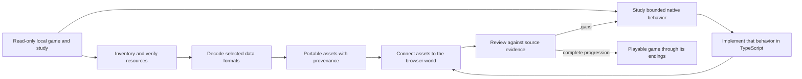

# Rebuilding Gothic 3 for the browser

This repository contains a new TypeScript browser implementation of Gothic 3,
guided by the owner's local installation. The Windows game is a read-only
reference during preparation; it is not converted into a web program. Native
executables and decompilation listings are studied to understand selected
formats and behaviors, then the browser runtime is implemented separately.

The goal is a game a player can start, progress through, save and finish at one
of Gothic 3's endings. A scene viewer, a decoded model or a successfully read
native data structure is a useful component milestone, but it does not by
itself establish a playable reconstruction.

The latest published source checkpoint recorded on 7 October 2026 is 101,
merged in [PR 65](https://github.com/ael-dev3/Tervain/pull/65) at commit
`f9d8b609afebb8f1e4781d3f1665f6f38d4b50e9` and published by successful
[workflow run 37611795592](https://github.com/ael-dev3/Tervain/actions/runs/37611795592).
It adds GUID text construction, CString operations, canonical literal storage
and the original 48-byte holder pool, following the selected ScriptAdmin static
initializer bodies in checkpoint 100. Their production NPC integration remains
unfinished.
The browser supports exploration and selected gameplay paths. Native NPC
activation and most campaign progression remain unfinished. See
[current implementation status](#current-implementation-status) below; the
[detailed checkpoint record](gothic3-rebuilding-process.md) preserves the
individual source and review receipts.

## Start here

| Task | Entry point | Required input |
| --- | --- | --- |
| Run the reconstruction | [`/gothic3/`](https://ael-dev3.github.io/Tervain/gothic3/) or the [local build](#run-the-committed-browser-build) | Committed browser assets; no installation picker |
| Compare a scene with your own installed files | [`/gothic3-local/`](https://ael-dev3.github.io/Tervain/gothic3-local/), documented in the [local viewer guide](gothic3-local.md) | Your Gothic 3 installation, read by the browser |
| Reproduce an asset or native-source checkpoint | [`tools/gothic3/`](../../tools/gothic3/README.md) and the matching [checkpoint receipt](gothic3-rebuilding-process.md) | The extracted offline study and that checkpoint's tool revision |
| Extend gameplay | [`src/gothic3/`](../../src/gothic3/), starting with the [feature workflow](#how-to-rebuild-one-feature) | Verified records, native behavior evidence and the live session services needed by the feature |

The original Tervain game uses the root URL. The two Gothic routes have their
own entries and implementation directories. The local-install viewer's format
readers and generated trees are a separate study path; its rendering progress
does not establish gameplay progress in the reconstruction.

## The rebuilding loop

The work follows two tracks—recovering original game data and reconstructing
game behavior—and joins them in playable slices:



### 1. Inventory the source

The preparation tools read a local installation and its offline study. They
record hashes and determine which archive or patch layer supplies each logical
resource. This makes it possible to select the same winning file consistently
instead of silently using an older duplicate. Archive extraction only exposes
bytes; meshes, images, world records and behavior still require separate
readers.

The local input layout used by the offline tools is:

```text
C:\Program Files (x86)\Steam\steamapps\common\Gothic 3\
  Data\                             installed archives and patch layers

<LOCAL_GOTHIC3_STUDY>\
  00_Original_Runtime\               preserved native executables and DLLs
  01_Decompiled_Code\                reconstructed C-like and assembly listings
  02_Unpacked_Data\
    Archives\                       extracted resource bytes
    _metadata\effective_layers.json logical resource paths, layers and hashes
```

The offline producers expect this study to exist already. They do not create
the complete extraction and decompilation study from an installation folder.

The browser archive reader supports stored and zlib-compressed entries in the
selected `G3V0` archives. Reading a binary resource after decompression still
requires its own parser. These steps do not establish that every file in the
installation uses the same format. See the [archive reader](../../src/gothic3local/archive.ts)
and [source-layer reader](../../src/gothic3local/source.ts).

### 2. Decode only what the browser needs

Format-specific tools decode world placements, meshes, actors, textures,
materials, motions and gameplay records. Conversion outputs keep source
provenance, hashes, coordinate transforms, assumptions and known omissions.
The browser loads these portable outputs; it does not need access to the
player's installation. The first data slice is Ardea, with landscape and
gameplay foundations being added as their readers are verified.

The main source formats and their readers are:

| Original data | What we recover | Preparation code |
| --- | --- | --- |
| `.node`, `.lrentdat` | Entity identities, transforms, property sets and actor resource references | [`read_genome.py`](../../tools/gothic3/read_genome.py) |
| `.xcmsh` | Static mesh vertices, triangles, UVs and material sections | [`read_xcmsh.py`](../../tools/gothic3/read_xcmsh.py) |
| `.xact` | Actor hierarchy, geometry, skin weights and bind transforms | [`read_xact_skin.py`](../../tools/gothic3/read_xact_skin.py) |
| `.xmot` | Native motion tracks, default poses and animation phases | [`export_animated.py`](../../tools/gothic3/export_animated.py) |
| `.ximg`, `.xshmat` | Texture pixels, mip layout and selected material properties | [`prepare_ardea.py`](../../tools/gothic3/prepare_ardea.py), [`read_xshmat.py`](../../tools/gothic3/read_xshmat.py) |
| `.quest`, `.info`, strings and gameplay properties | Quest/dialogue operands, localization and initial data | [`export_gameplay.py`](../../tools/gothic3/export_gameplay.py) |
| `.wrldatasc`, `.secdat` and world contexts | World/sector membership, enabled flags and landscape inventory | [`export_world_index.py`](../../tools/gothic3/export_world_index.py) |

For trees, the separate local study viewer reads SpeedTree `.spt` definitions
and generates its own trunk, branch and leaf geometry. Its appearance remains
an approximation; matching the in-game trees requires further work on their
generation, leaf selection, materials and wind. The
[tree fidelity limits](gothic3-local.md#what-is-implemented) are recorded with
that viewer. A recovered filename or a rotating model does not establish an
in-game visual match.

### 3. Reconstruct native behavior in small, evidenced pieces

For a behavior such as constructing the Hero, starting a quest or changing a
game event, the study follows the relevant native functions, call paths,
callbacks, layouts and object lifetimes. Decompiled C-like listings are
reference material, not original buildable C++ source. The implementation
checks claims against captured native bytes or source data where possible,
then writes a bounded TypeScript equivalent. Unknown engine calls stay
explicit rather than being filled in with guesses.

The native-source preparation packages keep `runtime-rules.json` for the
selected layouts and operations, `native-evidence.json` for byte audits, and a
manifest of the captured files. The Game CRT and selected ScriptAdmin startup
manifests also pin producer and shared-helper dependencies. Their `sources/`
directories retain selected listings for review. The corresponding TypeScript
owner checks the source identity and implements the admitted operations.
Reconstructing an object also means preserving its shared storage, aliasing,
callback order and teardown; inventing a successful return for a missing
service would hide the next implementation requirement.

### 4. Join data and behavior in a playable slice

Recovered assets and reconstructed behavior must share the same live game
state. Entity identity, Hero properties, world time, input, movement, animation,
interactions, NPCs, quests and browser saves need to work together. Start with
one concrete encounter or progression step, connect its prerequisites and
effects, and preserve enough state to continue after loading. A standalone
reader or inspector remains a study tool until it participates in this flow.

### 5. Review the exact claim

Review each change against the evidence it is intended to reproduce: resource
hashes and conversion receipts for assets, tests for state transitions, and a
browser exercise for rendering and interaction. Compare behavior with the
installed game where a direct comparison is possible. Record unsupported
branches and separate build success, browser observations and original-game
equivalence; each proves a different thing. Keep coherent checkpoints so the
same sources and steps can reproduce the result.

## Example: rebuild one behavior end to end

The Hero's `GiveXP` path shows how a small Gothic behavior moves through the
rebuild. The native `Script_Game.dll` handler was traced to its machine-code
instructions and checked against the installed binary. That evidence resolves
a disagreement in the decompiled listing: this call form multiplies the
requested amount by five. It also establishes that one award can increment the
Hero's level once and add 10 learning points when it crosses a threshold. The
captured source identity and byte-level audit are kept with the
[combat evidence](../../assets/gothic3/combat/native-source-evidence.json) and
[public evidence receipt](../../public/gothic3/combat/native-combat-evidence.json).

The browser implementation then divides that behavior across its boundaries:
[`combat.ts`](../../src/gothic3/combat.ts) plans the supported XP transition;
[`live-dialogue.ts`](../../src/gothic3/live-dialogue.ts) accepts it only for the
recognized Hero-targeted command; [`quest-runtime.ts`](../../src/gothic3/quest-runtime.ts)
applies and validates the saved progression; and
[`npc-reading.ts`](../../src/gothic3/npc-reading.ts) retains the source-backed
Hero NPC property data. Focused cases live in
[`give-xp.test.ts`](../../tests/gothic3-dialogue/give-xp.test.ts) and
[`hero-progression.test.ts`](../../tests/gothic3-dialogue/hero-progression.test.ts).

This is a bounded feature, not a completed game mechanic: the Hero NPC property
set is not yet attached to the live world entity, the native level-up visual
effect is absent, and combat task execution is not connected. The next work is
to close those world/entity lifecycle gaps and exercise the behavior in the
browser. The same evidence-to-runtime-to-playable-review chain is required for
each quest, NPC, interaction and campaign transition.

The health potion is a second, smaller example of the same method. The runtime
resolves the Hero's `It_Potion_Health` stack to its exact source template and
checks its identity and modifier before use. The inventory action in
[`main.ts`](../../src/gothic3/main.ts) calls
[`useHealthPotion()`](../../src/gothic3/quest-runtime.ts), which applies the
source-defined HP change through
[`PlayerMemory::ApplyMod`](../../src/gothic3/player-properties.ts); the browser
save retains the remaining stack count. A focused case verifies the HP change
and save/restore in
[`hero-progression.test.ts`](../../tests/gothic3-dialogue/hero-progression.test.ts).
This connects the verified item effect to player state and saving, but does not
recreate the native quick-use task or animation, and combat still cannot injure
the Hero in ordinary play. The detailed evidence and limits are recorded in
[checkpoint 50](gothic3-rebuilding-process.md#50-apply-the-source-defined-health-potion-effect).

## Example: trace a native inventory handoff

The original `Give` dialogue command illustrates why a rebuild follows the
whole native call path. `Script_Game.dll` reads donor, recipient, item template
and amount; it calls `PSInventory::AssureItems` on the donor at quality 0 with
the requested amount, then passes the returned stack index to
`PSInfoManager::Give`. The indexed Game.dll overload clamps the transfer amount
only when the donor is the player, then delegates to
`gCInventory_PS::TransferItemsTo`; that transfer creates the recipient stack
before subtracting from the donor. Its remaining behavior includes inventory
callbacks, conditional quest manager notification, and localized Given/Taken
messages. The TypeScript inventory module now models this positive-amount
command path separately from the template-based Info Give overload. The
captured command registration and behavior summary are in
[`native-command-table.json`](../../assets/gothic3/gameplay/native-command-table.json)
and [`native-semantics.json`](../../public/gothic3/gameplay/native-semantics.json);
the assurance body is in
[`10003c65.c.txt`](../../assets/gothic3/inventory/sources/Script/10003c65.c.txt),
and the selected transfer bodies are under
[`assets/gothic3/inventory/sources/Game/`](../../assets/gothic3/inventory/sources/Game/).

The browser now connects positive-amount `Give` records that transfer the
source-pinned `It_Gold` template between PC_Hero and the active Ardea dialogue
owner. A new game replays the Hero's 121 source-seeded inventory assurances;
the native Script_Game path assures quality 0 for the donor and uses its
returned stack index. Before transfer, the host checks both inventories and
all 641 loaded quest definitions for a matching item-receive delivery target
with the item and participants. The dialogue host now also handles condition-8 NPC delivery
callbacks for Running type-1/type-4 quests: the first exact `Info.Npc` target
counter advances once, and source-backed rewards are preflighted before a
completed quest changes state. The browser PickPocket action transfers
source-resolved loot, but its property-listener and quest-start chain is not
connected, so `Ardea_Pocket` remains Open and its theft-reporting sequence is
not reachable in a fresh game. Both inventories retain their source-resolved
templates and stack values in browser saves, so a gold transfer survives
reload. The browser prints a simple transfer receipt; the game's localized
Given/Taken messages are not reproduced. Other templates, linked items,
item-receive quest delivery, trade and equipment remain outside this slice.
See [checkpoint
61](gothic3-rebuilding-process.md#61-connect-the-source-backed-ardea-gold-give-path)
and [checkpoint
62](gothic3-rebuilding-process.md#62-connect-the-bounded-info-delivery-callback).

## How to rebuild one feature

Choose a concrete player outcome, such as talking to a resident, receiving a
quest reward, or equipping a weapon. Use this sequence for each checkpoint:

1. **Define the scenario.** Record its starting state, player action, expected
   result and save/reload behavior. Use the detailed history to identify which
   parts are already connected.
2. **Resolve its data.** Follow entity GUIDs and resource references through the
   effective archive index. Record the selected source path and SHA-256 before
   decoding; preserve the original bytes.
3. **Trace its behavior.** Follow the native entry through forwarding exports,
   imports, virtual calls and callbacks. Confirm the examined instructions
   against the original binary. Include prerequisites and teardown order.
4. **Implement the next supported operation.** Keep source identities, field
   ownership, mutation order and error boundaries in the TypeScript module.
   Preserve effects already applied if a later dependency is unavailable.
5. **Connect ordinary play.** Supply the required services from the live world
   and use its shared entity, inventory, clock and save state. A component that
   works only with a test fixture still needs this integration.
6. **Check the result.** Review the diff and relevant scenarios, then exercise
   the changed interaction in the browser. Compare with the installed game
   where possible and check save/reload for persistent effects.
7. **Record and publish the checkpoint.** Keep its inputs, conversion receipts,
   implementation, observed result and remaining limits together. Review
   Actions state before publication and retain the resulting commit/run URLs.

A useful checkpoint records the source resource or function, verified hashes,
changed modules, exact scenario, local results, browser observations and next
unresolved dependency. This makes it possible for another contributor to
continue from the same boundary. Keep the required behavior explicit even
when its dependency chain spans several modules.

## Where each stage lives

| Stage | Repository location | Result |
| --- | --- | --- |
| Inspect and decode local files | [`tools/gothic3/`](../../tools/gothic3/) | Offline readers and preparation scripts verify selected inputs and convert native records. The installed game and full study remain outside the repository. |
| Keep browser-ready source data | [`assets/gothic3/`](../../assets/gothic3/) and [`public/gothic3/`](../../public/gothic3/) | Reviewed portable assets and JSON catalogs, with provenance and conversion limits recorded alongside the data. |
| Implement game behavior | [`src/gothic3/`](../../src/gothic3/) | TypeScript modules model selected native state and operations; unsupported behavior stays unavailable or explicitly unknown. |
| Present and connect the game | [`gothic3/index.html`](../../gothic3/index.html) → [`src/gothic3/main.ts`](../../src/gothic3/main.ts) | The separate browser entry composes the runtime, scene, controls and UI. |
| Check and document the result | [`tests/`](../../tests/) and [`docs/engineering/`](./) | Focused checks cover bounded behavior; engineering notes preserve evidence, limitations and reproducible checkpoints. |

## Example: rebuild a placed world landmark

The local Xardas Tower addition shows the asset path from an original world
record to the running scene. The source `.node` record identifies the tower's
placement and low-poly mesh family. The exporter checks that record and both
mesh variants against the committed world indexes, then selects the matching
full-detail `.xcmsh`, reads its material sections, and embeds the original
diffuse image pixels in a GLB. Its manifest preserves source hashes, placement,
triangle counts and known rendering omissions.

[`world-landmarks.ts`](../../src/gothic3/world-landmarks.ts) verifies the
manifest and GLB bytes, streams the model near the Hero, and applies the source
placement. The loaded mesh also joins the browser's static collision geometry.
That collider uses rendered triangles; it is not a recovered Gothic PhysX
shape. The material preview currently uses the first diffuse sampler and does
not reproduce the native shader graph, normal/specular effects, illumination,
lightmaps or vertex stream 73. See the
[exporter](../../tools/gothic3/export_xardas_tower.py),
[asset receipt](../../public/gothic3/world/landmarks/manifest.json), and
[checkpoint 93](gothic3-rebuilding-process.md#93-export-and-stream-a-source-placed-xardas-tower).
The mesh is connected in code, and a local preview-teleport check rendered the
tower and left the Hero grounded on its geometry. Ordinary overland travel to
the tower has not yet been confirmed.

The boundary between stages matters: a successful decoder proves that a data
format was read; a passing runtime check proves a bounded state transition; and
a browser interaction proves that the pieces are connected for that case. None
alone proves that the original game has been rebuilt. Each playable slice should
carry its source evidence through conversion, TypeScript behavior, browser use
and saving before the next campaign feature is treated as integrated.

## Reproduce a rebuilding checkpoint

### Run the committed browser build

Use Node.js 24, matching the [Pages workflow](../../.github/workflows/pages.yml).
From the repository root:

```powershell
npm ci
npm run dev
# Open the printed local URL with /gothic3/ appended.
```

The committed portable assets are sufficient for this route. For a production
preview, run `npm run build`, then `npm run preview` and open the same route.
These commands use [`package.json`](../../package.json) and the three browser
entries in [`vite.config.ts`](../../vite.config.ts). The production output is
`dist/`; an asset conversion does not replace the TypeScript build step.
See the [controls and scope](gothic3-browser-port.md#controls) for exploration,
the model inspector, dialogue and local browser saves.

### Regenerate source data when needed

Asset preparation is a separate offline step. Its input is the owner's
read-only installation, normally
`C:\Program Files (x86)\Steam\steamapps\common\Gothic 3`, and a verified
offline study containing extracted archives, the effective patch-layer index
and native binary evidence. The full installation and study are not committed.
The [preparation guide](../../tools/gothic3/README.md) lists each tool's inputs,
dependencies and output folders; use the converter for the feature being
rebuilt rather than regenerating unrelated assets.

For visual exports, the preparation guide specifies Python 3.10+, Pillow with
DDS support and Rimy3D. Rimy3D converts selected actor assets offline; it is not
a browser dependency. Keep converter scratch output outside the study:

```powershell
$gothicStudy = 'C:\path\to\Gothic3_Decompiled_Study_2026-10-04'
python tools/gothic3/prepare_ardea.py --study $gothicStudy `
  --rimy 'C:\path\to\Rimy3D.exe' --scratch 'C:\outside-the-study\ardea-preparation'
```

This prepares the selected static Ardea assets in `public/gothic3/`. Use the
separate animation, terrain, world-index and gameplay exporters listed in the
preparation guide when extending those parts. Review the generated manifests
and changed files before committing them.

For example, the selected NPC record package can be reproduced with:

```powershell
python tools/gothic3/prepare_npc_entity_source.py --study "C:\path\to\Gothic3_Decompiled_Study_2026-10-04"
```

Its [source manifest](../../assets/gothic3/npc-entity/manifest.json) pins the
original input, record boundaries and compressed/decoded output hashes. The
[runtime reader](../../src/gothic3/browser-npc-entity.ts) verifies the available
wire bytes and all decoded bytes before admitting the three selected records.
When HTTP gzip decoding hides wire bytes, only the exact decoded receipt can
be checked in the browser. Source graph metadata remains
separate from live world registration and activation. At published checkpoint
91, the three selected bandit names are copied from their verified
source string-table bytes into heap-backed CStrings using the same MemoryAdmin
as the entity allocation. A lower browser session-mode adapter lets the read
pass its selected application-mode check. It materializes the 5,385
source-verified Navigation zones and paths across 67 groups, resolves the
bandit's current-zone proxy through Engine's cache/copy path, and exercises the
selected actor contact callback. The same heap owner now includes the
source-audited 32-byte bucket required for the 31-byte `CurrentZoneEntityProxy`
CString. The focused read reaches the unresolved ScriptAdmin getter; the NPC
remains outside the world and inactive. This minimal Navigation owner does not
run the original reflected factories or load every property set on those
entities. See [checkpoint
91](gothic3-rebuilding-process.md#91-reconstruct-the-selected-navigation-contact-callbacks),
[90](gothic3-rebuilding-process.md#90-resolve-source-backed-navigation-entity-proxies-during-npc-read)
and [89](gothic3-rebuilding-process.md#89-materialize-navigation-areas-for-the-npc-query).

### Regenerate dependent native-source packages together

The allocator and selected startup packages have linked receipts. For work on
this source set, generate the base before the packages that read it:

```powershell
python -B tools/gothic3/prepare_runtime_admin_source.py --study $gothicStudy
python -B tools/gothic3/prepare_npc_heap_source.py --study $gothicStudy
python -B tools/gothic3/prepare_scene_startup_source.py --study $gothicStudy
```

The selected ScriptAdmin startup package reads the Game CRT rules:

```powershell
python -B tools/gothic3/prepare_game_crt_source.py --study $gothicStudy
python -B tools/gothic3/prepare_script_admin_startup_source.py --study $gothicStudy
```

These commands assume the other committed prerequisite packages are present.
The Game CRT and ScriptAdmin producers also record hashes of shared Python
helpers; changing a helper can require regenerating their manifests even when
the captured native instructions are unchanged. Review dependent receipts and
TypeScript source pins together. A hash update needs an explained input or
scope change; it is not a substitute for reviewing the newly admitted behavior.
Reproduce an older checkpoint from its recorded commit and tools.

### Record a reviewable result

For each implementation checkpoint, retain:

| Record | What it establishes |
| --- | --- |
| Input path, archive/patch winner and SHA-256 | The exact original resource studied. |
| Conversion manifest and native evidence receipt | The selected bytes, transforms, call order and known omissions. |
| TypeScript module and focused scenario cases | The implemented operations and their supported boundaries. |
| Browser exercise and save/reload result | Whether that operation is connected to the visible session and persisted state. |
| Exact commit and successful workflow/deployment URL | Which reviewed version was checked and published. |

Run `npm run typecheck`, `npm test` and `npm run build`, review the diff, and
exercise the changed browser interaction. For documentation edits, check
relative links and `git diff --check`. Record partial execution as partial:
an unknown prerequisite must preserve the effects already applied and must
not replay them after restore.

Before publishing, inspect repository-wide Actions runs and workflow triggers.
Reuse relevant results and allow an existing applicable run to finish. A pull
request runs the checks; a merge to `main` runs checks and the Pages deployment.
Use the resulting deployment receipt to verify the public `/gothic3/` route.

### Publish the reviewed browser build

The [Pages workflow](../../.github/workflows/pages.yml) installs the locked
dependencies with Node.js 24, typechecks, runs the existing scenario suite and
builds all three entries. Pull requests perform those checks. A push to `main`
also uploads `dist/` and deploys it to GitHub Pages. The workflow additionally
has a manual trigger; no manual run is needed when the normal publication run
already supplies the relevant evidence.

Inspect repository-wide queued, running and completed runs, including rerun
attempts, before a push, pull-request update or merge. Check the actual workflow
and any downstream triggers, and reuse applicable results. After publication,
record the exact commit, successful deployment and served route. Document-only
changes can reuse the unchanged application's existing build evidence; check
their Markdown links and diff without treating them as a new gameplay release.

## Current implementation status

The published `/gothic3/` route is an incomplete browser reconstruction. The
status below describes gameplay evidence through checkpoint 94; subsequent
runtime work must carry its own source and browser review receipts.

| Area | Connected or recovered | Work still required |
| --- | --- | --- |
| World and rendering | Source-derived Ardea, streamed landscape cells across Myrtana/Nordmar/Varant, and the source-placed Xardas Tower | Complete world interactions, native physics shapes, lighting and material fidelity; ordinary travel to the tower remains unverified |
| Characters and motion | Original Hero skin/motions, a skinned Diego preview and source-identified Ardea actors | Native NPC activation, routines, animation selection, responses and equipment attachment |
| Dialogue and quests | Selected Ardea dialogue, Jack's bounded bandit quest, destination callbacks and supported rewards | Most original dialogue, quests, faction consequences and campaign endings |
| Inventory and combat | Selected inventory operations, potion/XP effects and bounded fist damage/death prefixes | Full item/equipment lifecycle, native attack eligibility, NPC attacks, defeat/death cleanup and loot |
| Persistence | Browser saves for the supported session state and selected progression effects | Full campaign state and recovery for every added system |
| Runtime foundations | Selected property readers, heap/runtime owners, Navigation callbacks and the ScriptAdmin getter model | Original startup/registration services, reflected factories, full entity attachment, world membership and processing activation |

Checkpoint 92 connects source-registered Navigation zones to the native type-8
quest-entry callback and has focused save/restore coverage. Checkpoint 93 adds
Xardas Tower rendering and browser collision using its mesh triangles. A local
preview-teleport review confirmed rendering and a grounded Hero; ordinary
overland arrival remains unverified. Checkpoint 94 models the ScriptAdmin
getter protocol. The production NPC services still lack its class-name,
ModuleAdmin, RTTI and ScriptAdmin call-slot owners, so the selected NPC read
stops at that dependency. See [checkpoint 94](gothic3-rebuilding-process.md#94-model-the-source-scriptadmin-getter-without-inventing-a-module-owner)
and the [current controls and scope](gothic3-browser-port.md).

## Road toward a complete game

1. Complete the startup and registration dependencies needed to construct a
   source-backed NPC, attach its property sets, place it in the live world and
   register it for processing.
2. Connect that NPC's routines, equipment, contact eligibility, animation,
   dialogue and responses to the same session used by the Hero.
3. Finish a complete encounter, including inventory/rewards, death or defeat,
   enclave consequences and save/reload. Expand the supported Ardea scenarios
   only after those services work together.
4. Extend the connected systems through Myrtana, Nordmar and Varant, including
   travel, quests, factions, settlements, items and all ending prerequisites.
5. Play from a fresh game through each intended ending and review persistence,
   progression failures and browser performance on the exact published build.

Completion means the player can finish Gothic 3 through ordinary browser play.
Asset counts, decompiled function counts and passing component checks do not
measure campaign completion. The
[detailed process and checkpoints](gothic3-rebuilding-process.md) retain the
technical evidence for the work already completed and its remaining gaps.

## Runtime owners after the gameplay baseline

Checkpoints 95–98 add the ScriptAdmin class-name owner, creator-edge
research, ModuleAdmin registry and its audited 80-byte allocator pool. Checkpoint 99 adds the concrete input dispatcher, corrects reviewed ModuleAdmin
boundaries and composes its SceneAdmin registration bridge. These owners still
need original application/ScriptAdmin creation and live NPC integration. See
[checkpoint 99](gothic3-rebuilding-process.md#99-own-the-engine-input-dispatcher-and-compose-moduleadmin-registration)
for source receipts, local review and exact remaining dependencies.

Checkpoint 100 captures the three selected ScriptAdmin static initializers and
their cleanup callbacks, then reproduces their bounded TypeScript state
changes. It also admits the original 128-, 640- and 1,536-byte allocator pools.
The first selected callback follows 1,672 earlier callbacks; those callbacks
and full CRT traversal have not been implemented. GUID conversion, property
factory construction and native ScriptAdmin creation remain explicit lower
dependencies. See [checkpoint 100](gothic3-rebuilding-process.md#100-own-selected-scriptadmin-static-initializer-bodies)
for the exact scope and reproduction steps.

Checkpoint 101 reconstructs GUID text assignment over the actual temporary
CString and GUID views, adds the original 48-byte holder pool, and registers
the existing Game GUID literal with the platform's pointer geometry. Its
explicitly selected ASCII/UTF16 provider supplies conversion and parsing
writes without executing Windows APIs. The next property initializer boundary
is the mutable Shared GUID NullPayload and its original startup writer; it
cannot be replaced by an assumed zero array. These owners still need full
startup and production NPC integration. See
[checkpoint 101](gothic3-rebuilding-process.md#101-own-guid-text-construction-and-canonical-literal-storage).
