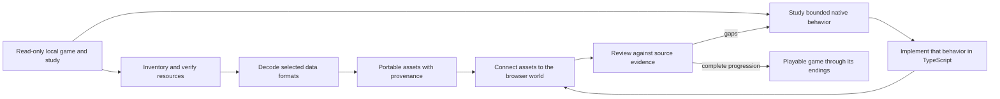

# Rebuilding Gothic 3 for the browser

This repository contains a new TypeScript browser implementation of Gothic 3,
guided by the owner's local installation. The Windows game is a read-only
reference during preparation; it is not converted into a web program. Native
executables and decompilation listings are studied to understand selected
formats and behaviors, then the browser runtime is implemented separately.

The goal is a game a player can start, progress through, save and finish at one
of Gothic 3's endings. A scene viewer, a decoded model or a successfully read
native data structure is a useful component milestone, but it does not by
itself establish a playable reconstruction.

## The rebuilding loop

The work follows two tracks—recovering original game data and reconstructing
game behavior—and joins them in playable slices:

### 1. Inventory the source

The preparation tools read a local installation and its offline study. They
record hashes and determine which archive or patch layer supplies each logical
resource. This makes it possible to select the same winning file consistently
instead of silently using an older duplicate. Archive extraction only exposes
bytes; meshes, images, world records and behavior still require separate
readers.

### 2. Decode only what the browser needs

Format-specific tools decode world placements, meshes, actors, textures,
materials, motions and gameplay records. Conversion outputs keep source
provenance, hashes, coordinate transforms, assumptions and known omissions.
The browser loads these portable outputs; it does not need access to the
player's installation. The first data slice is Ardea, with landscape and
gameplay foundations being added as their readers are verified.

### 3. Reconstruct native behavior in small, evidenced pieces

For a behavior such as constructing the Hero, starting a quest or changing a
game event, the study follows the relevant native functions, call paths,
callbacks, layouts and object lifetimes. Decompiled C-like listings are
reference material, not original buildable C++ source. The implementation
checks claims against captured native bytes or source data where possible,
then writes a bounded TypeScript equivalent. Unknown engine calls stay
explicit rather than being filled in with guesses.

### 4. Join data and behavior in a playable slice

Recovered assets and reconstructed behavior must share the same live game
state. Entity identity, Hero properties, world time, input, movement, animation,
interactions, NPCs, quests and browser saves need to work together. Start with
one concrete encounter or progression step, connect its prerequisites and
effects, and preserve enough state to continue after loading. A standalone
reader or inspector remains a study tool until it participates in this flow.

### 5. Review the exact claim

Review each change against the evidence it is intended to reproduce: resource
hashes and conversion receipts for assets, tests for state transitions, and a
browser exercise for rendering and interaction. Compare behavior with the
installed game where a direct comparison is possible. Record unsupported
branches and separate build success, browser observations and original-game
equivalence; each proves a different thing. Keep coherent checkpoints so the
same sources and steps can reproduce the result.

## Example: rebuild one behavior end to end

The Hero's `GiveXP` path shows how a small Gothic behavior moves through the
rebuild. The native `Script_Game.dll` handler was traced to its machine-code
instructions and checked against the installed binary. That evidence resolves
a disagreement in the decompiled listing: this call form multiplies the
requested amount by five. It also establishes that one award can increment the
Hero's level once and add 10 learning points when it crosses a threshold. The
captured source identity and byte-level audit are kept with the
[combat evidence](../../assets/gothic3/combat/native-source-evidence.json) and
[public evidence receipt](../../public/gothic3/combat/native-combat-evidence.json).

The browser implementation then divides that behavior across its boundaries:
[`combat.ts`](../../src/gothic3/combat.ts) plans the supported XP transition;
[`live-dialogue.ts`](../../src/gothic3/live-dialogue.ts) accepts it only for the
recognized Hero-targeted command; [`quest-runtime.ts`](../../src/gothic3/quest-runtime.ts)
applies and validates the saved progression; and
[`npc-reading.ts`](../../src/gothic3/npc-reading.ts) retains the source-backed
Hero NPC property data. Focused cases live in
[`give-xp.test.ts`](../../tests/gothic3-dialogue/give-xp.test.ts) and
[`hero-progression.test.ts`](../../tests/gothic3-dialogue/hero-progression.test.ts).

This is a bounded feature, not a completed game mechanic: the Hero NPC property
set is not yet attached to the live world entity, the native level-up visual
effect is absent, and combat task execution is not connected. The next work is
to close those world/entity lifecycle gaps and exercise the behavior in the
browser. The same evidence-to-runtime-to-playable-review chain is required for
each quest, NPC, interaction and campaign transition.

## Where each stage lives

| Stage | Repository location | Result |
| --- | --- | --- |
| Inspect and decode local files | [`tools/gothic3/`](../../tools/gothic3/) | Offline readers and preparation scripts verify selected inputs and convert native records. The installed game and full study remain outside the repository. |
| Keep browser-ready source data | [`assets/gothic3/`](../../assets/gothic3/) and [`public/gothic3/`](../../public/gothic3/) | Reviewed portable assets and JSON catalogs, with provenance and conversion limits recorded alongside the data. |
| Implement game behavior | [`src/gothic3/`](../../src/gothic3/) | TypeScript modules model selected native state and operations; unsupported behavior stays unavailable or explicitly unknown. |
| Present and connect the game | [`gothic3/`](../../gothic3/) | The separate browser route connects the runtime, scene, controls and UI. |
| Check and document the result | [`tests/`](../../tests/) and [`docs/engineering/`](./) | Focused checks cover bounded behavior; engineering notes preserve evidence, limitations and reproducible checkpoints. |

The boundary between stages matters: a successful decoder proves that a data
format was read; a passing runtime check proves a bounded state transition; and
a browser interaction proves that the pieces are connected for that case. None
alone proves that the original game has been rebuilt. Each playable slice should
carry its source evidence through conversion, TypeScript behavior, browser use
and saving before the next campaign feature is treated as integrated.

## Current milestone

The current browser project has an Ardea exploration scene, a moving third-
person Hero presentation, original-data inspectors, streamed landscapes for
Myrtana, Nordmar and Varant, and a source-backed fresh-world quest journal. The
audited startup path runs `Xardas_FindXardas`; browser saves retain exploration
state, the world clock, quest states and the Hero's `PlayerKnows` game events.
A bounded Ardea dialogue slice now adds selected native predicates, event
changes, ended actor flags, quest-log pairs and condition 6/11/21 quest status
transitions. Native Hello records now use their captured `Dialog` and
`TalkedToPlayer` state, without depending on unresolved death/wound facts. A
manual browser conversation with Milten confirmed that the
source record `BPANKRATZ31756` requires 12 `It_FiremageCup` items. Bounded
`CondItems` checks now read the Hero's 121 hash-checked starting inventory
stacks, so this requirement is known to be unmet at the captured starting
state. That inventory is an immutable source snapshot; item use, transfer,
equipment and other live inventory changes are not implemented. Source-backed
`SetTradeEnabled` commands from Jack and Hamlar now update `Dialog.TradeEnabled`
and persist through browser saves; the trade interface and item exchange remain
unavailable. Source-backed
`SetPartyEnabled` and `SetTeachEnabled` commands now persist their matching
Dialog flags too, while follower behavior and training effects remain absent.
At scene startup, three Ardea residents are now placed at their native `Start`
routine points when all stored work/rest/sleep assignments agree. Diego's
source point is within the original 5 m dialogue radius of `Ardea_4Friends`,
but the response has not yet been retested in the browser after this placement
change. The browser still does not execute the native scheduler, move residents
between points or activate their native entity lifecycle.
Source-backed
`GiveXP` awards update retained Hero PlayerMemory;
threshold crossings also update a source-constructed Hero NPC Level, grant LP,
show the localized level-up text and persist through save/restore. The
hash-checked Hero NPC packet now reads through its registered accessor; the
old `Level` record is preserved as opaque `bCObsoleteClass` bytes. The property
set is not attached to a live entity, and the level-up visual effect is absent.
Bounded `SucceedQuest` calls now apply native PoliticalFame increments and
attribute-base rewards before GiveXP. Ardea_Pocket raises THF and awards XP;
Anog_ReportInog increments its alignment's PoliticalFame entry. Saves retain
these values. Enclave-fame rewards, arena updates and the Ardea_Revolution
tutorial popup still block their quests.
The play HUD displays Hero HP; the source-backed `SetHitPoints` path clamps it
to the live native range and browser saves preserve it through the PlayerMemory
setters. Attacks and healing are not connected to that state yet.
These are integrated foundations, while most original dialogue
progression, combat, NPC schedules and movement, inventory, faction
consequences and endings still need to be rebuilt. A byte-audited combat kernel
covers bounded damage and defeat arithmetic. A single-use effect executor now
dispatches resolved melee effects through ordered host callbacks and reports
partial application, but its host is not connected to live actors;
the Hero also plays the recovered fist attack phases from mouse or keyboard
input. At the hit window, the animated right hand now samples rendered
character bounds and reports a contact candidate, but it does not damage a
target or trigger an NPC response. A contact candidate now resolves to one
hash-checked Ardea NPC source record, checks its script-routine, navigation and
damage-receiver property sets, and initializes browser-owned mutable HP and
stamina from the audited processing-range refresh. Those points persist in the
browser save and are rejected on restore if the source hash or re-derived
maximum differs. This still does not construct or activate a native entity,
accept engine collision, run an AI task, or apply damage;
`ordinaryPlayIntegrated`
remains false: the live Ardea actors do not yet pass the original entity
construction, context, cache-in and processing-range lifecycle needed to accept
combat. The entity lifecycle evidence explicitly leaves those world-activation
steps unresolved, so a verified damage formula is not yet an encounter the
player can fight. The original unarmed `Fist` carrier now resolves from its
exact template source path (Impact1, 10 damage), but it is not attached to live
combat state. The NPC combat bridge now follows named treasure sets into their
hash-checked templates and resolves deterministic Weaponry recipes to item
damage and equipment-slot plans. For the Ardea Raider, the recipe resolves to
`It_Axe_OrcSword_01` with 125 Edge damage; random Plunder generation and native
cache-in are still absent, so the item is not attached to an active actor. The
next integration gate is to confirm Diego's proximity response after source
placement, construct and activate a source-backed NPC through the native
lifecycle, then connect accepted contact, damage, response, defeat, quest
counters and save/load as one playable encounter. The current limits and controls are listed in the
[browser-port scope](gothic3-browser-port.md); native readers, conversion
choices and dated implementation checkpoints are in the
[detailed process record](gothic3-rebuilding-process.md).

The requested second URL is now live at
[Gothic 3 / Ardea](https://ael-dev3.github.io/Tervain/gothic3/). It serves the
incomplete `main` build at commit
`72e2a3993437e4b108291f8cb19692d0d4e5f620`; newer local gameplay changes have
not yet been published. A live URL confirms hosting, not completion of the
reconstruction.

## Rebuild sequence from here

The current branch resolves the native Start point for three residents and the
local preview reports those placements at scene startup. It also resolves an
attack-contact candidate to one exact source NPC and creates browser-owned,
source-hash-bound mutable health and stamina state, which survives a save and
restore. The NPC bridge resolves named treasure sets and deterministic
Weaponry recipes through their hash-checked templates; it identifies the
Ardea Raider's `It_Axe_OrcSword_01` as a UseType 52, 125-damage Edge weapon
whose native primary slot is 6. Plunder generation remains unimplemented, and
this source recipe is not yet applied to a live entity. The unarmed `Fist`
damage carrier resolves from its exact template path, but it is not attached to
the Hero. The earlier dialogue review measured Diego 1073.9 adjusted units from
`Ardea_4Friends` before routine placement was connected; the post-placement
response has not been checked yet. The next milestone is to verify that source
predicate in the browser, finish tracing random treasure generation, and
connect the resolved weaponry recipe through NPC cache-in so a resident's
generated inventory, equipped weapon and armor come from the same live actor.
Activate that resident through the
full entity lifecycle: construct it, attach its properties, supply its world
context, cache it in and register it for scene processing. Current browser
actors remain presentation objects with a separate mutable state record; this
bridge does not make them active engine entities. The routine-point integration
seeds transforms only and does not bypass dialogue conditions.

Once that gate works, use the resident to complete a small encounter from start
to finish: approach and interact, run the source-backed dialogue and quest
changes, accept contact using the reconstructed collision rules, execute the
damage and NPC response, update the journal and reward, then save and restore
the result. Review each link against native evidence and the installed game
before treating the encounter as integrated.

After the first encounter is end-to-end, extend the same connected runtime to
the rest of Ardea's dialogue, NPC routines, combat and inventory; then cover
faction consequences and travel across Myrtana, Nordmar and Varant. Complete the
campaign branches and endings last, with save/load exercised at each major
progression boundary. This order keeps new systems tied to a playable path
instead of counting isolated readers or inspectors as finished game features.

## Completion standard

The reconstruction is complete when a player can start a new game and play
through Gothic 3's progression to its available endings, with the required
worlds, NPC routines, factions, dialogue, quests, combat and save/load working
together. A successful build or faithful conversion validates only its own
part of that experience.

For local asset preparation and source requirements, see the
[preparation guide](../../tools/gothic3/README.md).
