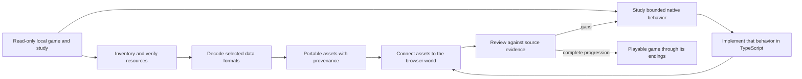

# Rebuilding Gothic 3 for the browser

This repository contains a new TypeScript browser implementation of Gothic 3,
guided by the owner's local installation. The Windows game is a read-only
reference during preparation; it is not converted into a web program. Native
executables and decompilation listings are studied to understand selected
formats and behaviors, then the browser runtime is implemented separately.

The goal is a game a player can start, progress through, save and finish at one
of Gothic 3's endings. A scene viewer, a decoded model or a successfully read
native data structure is a useful component milestone, but it does not by
itself establish a playable reconstruction.

## Process at a glance

1. **Identify the installed inputs.** Start with
   `C:\Program Files (x86)\Steam\steamapps\common\Gothic 3`.
   Inventory archives and patch precedence, and preserve hashes of the native
   modules and resource bytes used by each checkpoint.
2. **Prepare the assets.** Readers in [`tools/gothic3/`](../../tools/gothic3/)
   decode selected world records, meshes, skinned actors, animations, textures
   and gameplay data. Outputs retain the original resource paths and conversion
   evidence in [`assets/gothic3/`](../../assets/gothic3/); browser-ready resources
   live in [`public/gothic3/`](../../public/gothic3/).
3. **Recover the behavior.** Compare decompiled listings and disassembly with
   original DLL bytes. Follow constructors, callbacks, globals, allocation,
   ownership and cleanup. Record the next unresolved operation explicitly.
4. **Implement it in TypeScript.** Runtime owners in
   [`src/gothic3/`](../../src/gothic3/) reproduce the supported state changes.
   Connect them to world entities, rendering, input, NPCs, combat, dialogue,
   quests and saves as their dependencies become available.
5. **Check a coherent checkpoint.** Verify source identities and relevant
   behavior, typecheck and build, inspect the diff, and exercise the integrated
   feature in the browser. Record the tested revision and remaining limits in
   the [checkpoint history](gothic3-rebuilding-process.md).
6. **Publish and continue toward an ending.** Review existing Actions runs and
   workflow triggers, then publish the reviewed revision through the repository's
   Pages workflow to [`/gothic3/`](https://ael-dev3.github.io/Tervain/gothic3/).
   Completion requires ordinary gameplay through a campaign ending, including
   progression and save/reload across the connected systems.

The current development bottleneck is native startup and its shared runtime
dependencies. The live Game path stops before `__cinit` at `204678f2`.
Separately, the local SharedBase path completes selected CP1252 classification,
case mapping, candidate installation and its normal SEH return. The enclosing
setargv frame now acquires the declared virtual `Gothic3.exe` filename, publishes
its module-buffer pointer and selects the actual command-line input or fallback.
Both original parser passes now return with actual count outputs and filled
strings. The caller allocates the combined vector/string block, publishes
argc/argv and returns zero. SharedBase setenvp now builds its environment vector,
copies strings, frees the temporary block and returns zero. The initializer now
checks actual image headers and section ownership, restores FS and installs
ten floating-point conversion addresses. The original division-erratum query
now returns through retained virtual imports and publishes its selected result.
It clears the x87 exception status bits, returns the hook and enters conversion
encoding. The cached PTD encoder returns for all ten conversion pointers and
stores their opaque encoded identities; its next boundary is the error-table
walker, which skips the original leading NULL slots and enters the first
callback, which allocates and publishes its encoded exit table and returns.
The next callback returns through its already-initialized multibyte branch,
and the processor callback executes its original probe with the declared virtual
CPU profile. Its normal SIMD frame restores FS and saved registers and returns;
the stdio callback builds its original FILE vector and checks owned descriptor
handles. The fifth callback repeats the probe and publishes the memcpy flag.
The error table returns zero and reaches pending RTC exit registration at
`100aa676 -> 100a72d0`. Without a selected CPU profile,
PUSHFD at `100ce0a8` remains an explicit boundary. Allocation failures retain
the original partial cleanup; a positive retry delay remains unresolved.
Those local helper results still need to join the live
startup path before they can enable NPC activation. The full game remains
unfinished; successful extraction, compilation or deployment alone does not
establish campaign completion.

## Current status — 8 October 2026

The latest merged runtime checkpoint is [PR 117](https://github.com/ael-dev3/Tervain/pull/117),
merged at `0270bb5cdd54f521731a4c6de164e3e967265d37` after successful
[CI run 37761728106](https://github.com/ael-dev3/Tervain/actions/runs/37761728106).
[Pages run 37762574694](https://github.com/ael-dev3/Tervain/actions/runs/37762574694)
completed successfully.

The selected SharedBase path completes argument and environment setup,
floating-point conversion installation and cached pointer encoding. Its first
error initializer publishes the exit table; the second returns through its live
multibyte flag. The third executes its original CPU and normal SIMD probe using
the declared virtual CPU profile. Missing CPU selection, CPUID leaves, SIMD
exception dispatch, pointer fallback resolution and allocation retry/cleanup
remain explicit boundaries. Full startup and campaign completion remain
unfinished.

[PR 116](https://github.com/ael-dev3/Tervain/pull/116) merged the processor
exception-frame source evidence and process documentation at
`43a5892f7ce6cb9724d0fc41ec7fe83e3a6857d5`.
[Pages run 37759987854](https://github.com/ael-dev3/Tervain/actions/runs/37759987854)
succeeded. Its source package contains 80 generated files; capturing those
helpers alone did not execute them.

PR 117 executes PUSHFD/POPFD, both selected CPUID
leaves and the normal SIMD probe using an explicit virtual CPU profile. It owns
the original scope, EH4 prologue/epilogue and XMM register copy; no host CPU or
Windows state is inferred. It returns the processor result and reaches the
fourth error initializer, `100bef05`. Missing CPUID data or SIMD exception
dispatch remains an explicit boundary. Typechecking, 125 focused checks and
source regeneration pass. The full suite passes 2,682 tests across 259 files,
and the production build passes. See the detailed process history for scope.

The next stdio checkpoint executes the fourth and fifth error callbacks and
returns the error walker to cinit. It preserves original allocation fallback,
FILE storage, descriptor/HANDLE identities and failure code 26. RTC exit-callback
registration, void-table traversal and enclosing attach remain unfinished.
Typechecking, 141 focused checks and exact source regeneration pass. The full
suite passes 2,698 tests across 259 files, and the production build passes.

### What each repository folder contributes

| Folder | Purpose | What it establishes |
| --- | --- | --- |
| `tools/gothic3/` | Extraction, decoding and source-package generators | Repeatable preparation from identified local inputs |
| `assets/gothic3/` | Captured bytes, listings, manifests and provenance | Evidence for specific formats and native behavior |
| `public/gothic3/` | Portable resources loaded by the browser | Available scene/model/data inputs |
| `src/gothic3/` | TypeScript runtime and its owners | Implemented behavior within explicit supported boundaries |
| `docs/engineering/` | Process, dependency records and checkpoints | Scope, validation receipts and remaining integration work |

A normal contribution traces a missing dependency, captures its original input,
implements its state changes under the responsible runtime owner, connects the
caller, and records both the supported cases and the next unresolved operation.
Regeneration checks evidence fidelity; runtime checks establish implemented
behavior; browser play and save/reload establish gameplay integration.

### Earlier supporting checkpoints

Startup now completes the selected environment initialization and stops before
Game's `__cinit` call at `204678f2`. The repository captures all 2,473 Game
initializer callbacks and verifies 49,272 instructions against 207,641 original
bytes. Capturing those callbacks does not execute them.

PR 81 implements original property constructors, CString equality, template-array
reserve behavior and pointer identity preservation during allocation copies.
Its CI passed typechecking, the production build and 2,477 tests. These supporting
components still need to join actual initializer traversal and property
registration before they can enable full NPC startup.

PR 82 publishes read support for 328 property-owner getter layouts, original
property-object and named-factory constructors, and pointer-preserving template
removal. These components are not connected to live virtual-call execution or
property registration.

[PR 83](https://github.com/ael-dev3/Tervain/pull/83) merges the string-keyed
property type table's lookup, insertion, clear/recreation and constructor;
original signed-byte CString hashing; the original 4-byte allocator pool used
by registration wrappers; and canonical SharedBase singleton storage. The
singleton constructor preserves the allocation sequence: construct 43 buckets,
clear/recreate them, then grow to 359 buckets with capacity 367. These components are included in the confirmed publication above.

PR 84 publishes the canonical singleton getter, original guard writes, selected
shutdown callback and destruction sequence. The callback uses the browser's
selected shutdown adapter; full original SharedBase CRT traversal remains
unfinished. It also publishes the Arena class-name owner, RTTI lookup, CString
construction, Game exit registration, later initializer publication and selected
cleanup. The original Game string-length predicate now handles arbitrary unknown
padding bits. Its CI passed typechecking, scenarios and the production build.

PR 85 additionally publishes the Arena type singleton's base
and factory construction and its SharedBase RegisterTemplate sequence. The
registry stores a real 4-byte wrapper pointing to the canonical type object,
using the actual source vtable/class-name slot and shared CString key. Selected
type cleanup destroys the factory before the base. Focused checks cover pointer
identity, original callback order, shared CString lifetime, untouched padding,
warm guards and retained failure prefixes. This published work is not yet connected to the live Game CRT initializer frame. See the
[Arena type package](../../assets/gothic3/arena-type/README.md) and
[property destruction evidence](../../assets/gothic3/property-object-destruction/README.md).

Local validation for this type-registration work passed typechecking and the
full suite of 2,523 tests across 252 files. The new source integrity checks are
included in that full run. Repeated source preparation preserves the captured
bytes. These checks do not establish live Game initializer execution or new
campaign progress.

PR 86 publishes the first Arena Status descriptor's constructor,
cold virtual Create/reset and original unregister lookup, then pointer-array
registration through its diagnostic call. It constructs the actual temporary
Status CString, obtains the canonical Arena type and stores the descriptor in
its real property array. The selected template demangler now constructs
`bTPropertyContainer<enum gEArenaStatus>`, restores its local name tables and
registers the original Status name cleanup callback.

PR 87 connects that diagnostic to an explicitly loaded SharedBase static TLS
block for the retained logical thread. It retains the actual property/type
CString pointers, forwards NULL locale and writes the original vsprintf FILE
prefix. The call stops at `100a7eff -> 100b5355`, before formatter execution.
Missing thread or unloaded TLS remains an explicit failure. No formatted text,
terminator or MessageAdmin dispatch is fabricated. The virtual loader's slot
assignment does not claim a captured Windows slot or completed DLL attach.

The published PTD helper allocates the actual SharedBase FLS/TLS thread index with
its canonical cleanup capability, allocates a zeroed 532-byte PTD from its own
heap and installs that same physical record. The original PTD initializer stores
exception/codec fields, increments multibyte and default-locale references under
static lock 12, then releases the lock. With an actual thread-ID provider, it
stores the ID and original -1 handle and returns `__mtinit` 1. Missing providers
retain the completed prefix without replay. Non-NULL PTD destruction remains
unimplemented. The selected cold-locale path does not implement dynamic locales.

Further local work traverses the original all-NULL RTC table, stores an actual
command-line pointer and copies/converts the ANSI or selected ASCII UTF16
environment into SharedBase heap storage. Allocation failure follows original
errno lookup with LastError preservation and OS-block cleanup. Scalar memcpy
follows DWORD/tail dispatch and REP MOVSD; unsupported branches remain explicit.
The selected I/O helper now returns 0. Further local argument startup completes selected multibyte configuration and
installation, owns the normal SEH return and completes the original parser
counting and filling passes. After argc/argv publication and normal setargv
return, it builds and publishes the SharedBase environment vector and returns
from setenvp. It stops at initializer startup `100adb5a -> 100aa632`; initializer
traversal remains unfinished. Exception paths, full CRT attachment and the older-version
main-image `.mixcrt` scan remain unimplemented.
These helpers are not connected to the live Game CRT frame; formatter execution,
full NPC startup and campaign completion remain unfinished.

The temporary Status name remains retained; descriptor cleanup registration and
the first initializer's normal return have not executed. Full initializer
traversal remains unfinished.

See the [Status descriptor evidence](../../assets/gothic3/arena-status-descriptor/README.md),
[property registration and diagnostic evidence](../../assets/gothic3/arena-property-registration/README.md)
and [template demangler evidence](../../assets/gothic3/game-template-demangler/README.md).
Property pointer-array cleanup with a live non-NULL element still needs that
property's original virtual destructor. Full NPC startup and campaign completion
remain unfinished.

The browser supports exploration and selected gameplay paths. Whole-module
startup, native NPC activation and most campaign progression remain unfinished.
See [current implementation status](#current-implementation-status) below; the
[detailed checkpoint record](gothic3-rebuilding-process.md) preserves the
individual source and review receipts.

## Start here

| Task | Entry point | Required input |
| --- | --- | --- |
| Run the reconstruction | [`/gothic3/`](https://ael-dev3.github.io/Tervain/gothic3/) or the [local build](#run-the-committed-browser-build) | Committed browser assets; no installation picker |
| Compare a scene with your own installed files | [`/gothic3-local/`](https://ael-dev3.github.io/Tervain/gothic3-local/), documented in the [local viewer guide](gothic3-local.md) | Your Gothic 3 installation, read by the browser |
| Reproduce an asset or native-source checkpoint | [`tools/gothic3/`](../../tools/gothic3/README.md) and the matching [checkpoint receipt](gothic3-rebuilding-process.md) | The extracted offline study and that checkpoint's tool revision |
| Extend gameplay | [`src/gothic3/`](../../src/gothic3/), starting with the [feature workflow](#how-to-rebuild-one-feature) | Verified records, native behavior evidence and the live session services needed by the feature |

The original Tervain game uses the root URL. The two Gothic routes have their
own entries and implementation directories. The local-install viewer's format
readers and generated trees are a separate study path; its rendering progress
does not establish gameplay progress in the reconstruction.

## The rebuilding loop

In practical terms, we extract and identify the original resources, convert the
selected data into browser-readable assets, recover the behavior that uses
those resources, and implement that behavior in TypeScript. Each feature then
joins the same running world and saved state. Comparing the resulting encounter
with the installed game reveals the next missing resource or behavior.

The work follows two tracks—recovering original game data and reconstructing
game behavior—and joins them in playable slices:



### Example: turning an Ardea NPC into a playable character

The process has a concrete dependency chain:

1. Read the NPC's world record to recover its identity, placement, property sets
   and actor references. Preserve the effective archive layer and input hashes.
2. Decode its actor, skin weights, textures and motion tracks. Convert coordinates
   consistently and compare the rendered result with the installed game.
3. Follow the native entity construction and property-registration calls. Capture
   the relevant functions, layouts, globals and initializer order from the DLLs.
4. Implement the admitted behavior in TypeScript. Keep one actual owner for shared
   storage; preserve pointer identity, allocation, callbacks and teardown. A
   missing dependency stops at an explicit boundary with its prior effects intact.
5. Connect the constructed entity to the browser world, processing, routines,
   animation, equipment, interaction and dialogue services.
6. Exercise an ordinary encounter, including its quest effects and save/reload.
   Record the exact checked revision, then publish through the repo workflow.

Today, decoded actors and selected gameplay services exist, while original NPC
startup is still being reconstructed. A model that can be rotated proves that
its geometry can be displayed; activating that NPC requires the later steps.

### Where the work lives

| Repository path | Purpose |
| --- | --- |
| `tools/gothic3/` | Offline readers and producers for original resources and bounded native evidence. |
| `assets/gothic3/` | Captured source packages, runtime rules and provenance used by reconstruction modules. |
| `public/gothic3/` | Browser-served converted assets and reading packages. |
| `src/gothic3/` | The TypeScript reconstruction, gameplay services and native behavior owners. |
| `src/gothic3local/` | Readers and rendering for the separate local-install study viewer. |
| `tests/gothic3-dialogue/` | Source-derived scenarios and runtime checks for supported behavior. |
| `.github/workflows/pages.yml` | Checks, production build and GitHub Pages deployment. |

The [detailed checkpoint history](gothic3-rebuilding-process.md) records the
individual inputs and receipts. The sections below explain how to reproduce and
extend the work; the completion criterion is ordinary play through the campaign.

### 1. Inventory the source

The preparation tools read a local installation and its offline study. They
record hashes and determine which archive or patch layer supplies each logical
resource. This makes it possible to select the same winning file consistently
instead of silently using an older duplicate. Archive extraction only exposes
bytes; meshes, images, world records and behavior still require separate
readers.

The local input layout used by the offline tools is:

```text
C:\Program Files (x86)\Steam\steamapps\common\Gothic 3\
  Data\                             installed archives and patch layers

<LOCAL_GOTHIC3_STUDY>\
  00_Original_Runtime\               preserved native executables and DLLs
  01_Decompiled_Code\                reconstructed C-like and assembly listings
  02_Unpacked_Data\
    Archives\                       extracted resource bytes
    _metadata\effective_layers.json logical resource paths, layers and hashes
```

The offline producers expect this study to exist already. They do not create
the complete extraction and decompilation study from an installation folder.

The browser archive reader supports stored and zlib-compressed entries in the
selected `G3V0` archives. Reading a binary resource after decompression still
requires its own parser. These steps do not establish that every file in the
installation uses the same format. See the [archive reader](../../src/gothic3local/archive.ts)
and [source-layer reader](../../src/gothic3local/source.ts).

### 2. Decode only what the browser needs

Format-specific tools decode world placements, meshes, actors, textures,
materials, motions and gameplay records. Conversion outputs keep source
provenance, hashes, coordinate transforms, assumptions and known omissions.
The browser loads these portable outputs; it does not need access to the
player's installation. The first data slice is Ardea, with landscape and
gameplay foundations being added as their readers are verified.

The main source formats and their readers are:

| Original data | What we recover | Preparation code |
| --- | --- | --- |
| `.node`, `.lrentdat` | Entity identities, transforms, property sets and actor resource references | [`read_genome.py`](../../tools/gothic3/read_genome.py) |
| `.xcmsh` | Static mesh vertices, triangles, UVs and material sections | [`read_xcmsh.py`](../../tools/gothic3/read_xcmsh.py) |
| `.xact` | Actor hierarchy, geometry, skin weights and bind transforms | [`read_xact_skin.py`](../../tools/gothic3/read_xact_skin.py) |
| `.xmot` | Native motion tracks, default poses and animation phases | [`export_animated.py`](../../tools/gothic3/export_animated.py) |
| `.ximg`, `.xshmat` | Texture pixels, mip layout and selected material properties | [`prepare_ardea.py`](../../tools/gothic3/prepare_ardea.py), [`read_xshmat.py`](../../tools/gothic3/read_xshmat.py) |
| `.quest`, `.info`, strings and gameplay properties | Quest/dialogue operands, localization and initial data | [`export_gameplay.py`](../../tools/gothic3/export_gameplay.py) |
| `.wrldatasc`, `.secdat` and world contexts | World/sector membership, enabled flags and landscape inventory | [`export_world_index.py`](../../tools/gothic3/export_world_index.py) |

For trees, the separate local study viewer reads SpeedTree `.spt` definitions
and generates its own trunk, branch and leaf geometry. Its appearance remains
an approximation; matching the in-game trees requires further work on their
generation, leaf selection, materials and wind. The
[tree fidelity limits](gothic3-local.md#what-is-implemented) are recorded with
that viewer. A recovered filename or a rotating model does not establish an
in-game visual match.

### 3. Reconstruct native behavior in small, evidenced pieces

For a behavior such as constructing the Hero, starting a quest or changing a
game event, the study follows the relevant native functions, call paths,
callbacks, layouts and object lifetimes. Decompiled C-like listings are
reference material, not original buildable C++ source. The implementation
checks claims against captured native bytes or source data where possible,
then writes a bounded TypeScript equivalent. Unknown engine calls stay
explicit rather than being filled in with guesses.

The native-source preparation packages keep `runtime-rules.json` for the
selected layouts and operations, `native-evidence.json` for byte audits, and a
manifest of the captured files. The Game CRT and selected ScriptAdmin startup
manifests also pin producer and shared-helper dependencies. Their `sources/`
directories retain selected listings for review. The corresponding TypeScript
owner checks the source identity and implements the admitted operations.
Reconstructing an object also means preserving its shared storage, aliasing,
callback order and teardown; inventing a successful return for a missing
service would hide the next implementation requirement.

### 4. Join data and behavior in a playable slice

Recovered assets and reconstructed behavior must share the same live game
state. Entity identity, Hero properties, world time, input, movement, animation,
interactions, NPCs, quests and browser saves need to work together. Start with
one concrete encounter or progression step, connect its prerequisites and
effects, and preserve enough state to continue after loading. A standalone
reader or inspector remains a study tool until it participates in this flow.

### 5. Review the exact claim

Review each change against the evidence it is intended to reproduce: resource
hashes and conversion receipts for assets, tests for state transitions, and a
browser exercise for rendering and interaction. Compare behavior with the
installed game where a direct comparison is possible. Record unsupported
branches and separate build success, browser observations and original-game
equivalence; each proves a different thing. Keep coherent checkpoints so the
same sources and steps can reproduce the result.

## Example: rebuild one behavior end to end

The Hero's `GiveXP` path shows how a small Gothic behavior moves through the
rebuild. The native `Script_Game.dll` handler was traced to its machine-code
instructions and checked against the installed binary. That evidence resolves
a disagreement in the decompiled listing: this call form multiplies the
requested amount by five. It also establishes that one award can increment the
Hero's level once and add 10 learning points when it crosses a threshold. The
captured source identity and byte-level audit are kept with the
[combat evidence](../../assets/gothic3/combat/native-source-evidence.json) and
[public evidence receipt](../../public/gothic3/combat/native-combat-evidence.json).

The browser implementation then divides that behavior across its boundaries:
[`combat.ts`](../../src/gothic3/combat.ts) plans the supported XP transition;
[`live-dialogue.ts`](../../src/gothic3/live-dialogue.ts) accepts it only for the
recognized Hero-targeted command; [`quest-runtime.ts`](../../src/gothic3/quest-runtime.ts)
applies and validates the saved progression; and
[`npc-reading.ts`](../../src/gothic3/npc-reading.ts) retains the source-backed
Hero NPC property data. Focused cases live in
[`give-xp.test.ts`](../../tests/gothic3-dialogue/give-xp.test.ts) and
[`hero-progression.test.ts`](../../tests/gothic3-dialogue/hero-progression.test.ts).

This is a bounded feature, not a completed game mechanic: the Hero NPC property
set is not yet attached to the live world entity, the native level-up visual
effect is absent, and combat task execution is not connected. The next work is
to close those world/entity lifecycle gaps and exercise the behavior in the
browser. The same evidence-to-runtime-to-playable-review chain is required for
each quest, NPC, interaction and campaign transition.

The health potion is a second, smaller example of the same method. The runtime
resolves the Hero's `It_Potion_Health` stack to its exact source template and
checks its identity and modifier before use. The inventory action in
[`main.ts`](../../src/gothic3/main.ts) calls
[`useHealthPotion()`](../../src/gothic3/quest-runtime.ts), which applies the
source-defined HP change through
[`PlayerMemory::ApplyMod`](../../src/gothic3/player-properties.ts); the browser
save retains the remaining stack count. A focused case verifies the HP change
and save/restore in
[`hero-progression.test.ts`](../../tests/gothic3-dialogue/hero-progression.test.ts).
This connects the verified item effect to player state and saving, but does not
recreate the native quick-use task or animation, and combat still cannot injure
the Hero in ordinary play. The detailed evidence and limits are recorded in
[checkpoint 50](gothic3-rebuilding-process.md#50-apply-the-source-defined-health-potion-effect).

## Example: trace a native inventory handoff

The original `Give` dialogue command illustrates why a rebuild follows the
whole native call path. `Script_Game.dll` reads donor, recipient, item template
and amount; it calls `PSInventory::AssureItems` on the donor at quality 0 with
the requested amount, then passes the returned stack index to
`PSInfoManager::Give`. The indexed Game.dll overload clamps the transfer amount
only when the donor is the player, then delegates to
`gCInventory_PS::TransferItemsTo`; that transfer creates the recipient stack
before subtracting from the donor. Its remaining behavior includes inventory
callbacks, conditional quest manager notification, and localized Given/Taken
messages. The TypeScript inventory module now models this positive-amount
command path separately from the template-based Info Give overload. The
captured command registration and behavior summary are in
[`native-command-table.json`](../../assets/gothic3/gameplay/native-command-table.json)
and [`native-semantics.json`](../../public/gothic3/gameplay/native-semantics.json);
the assurance body is in
[`10003c65.c.txt`](../../assets/gothic3/inventory/sources/Script/10003c65.c.txt),
and the selected transfer bodies are under
[`assets/gothic3/inventory/sources/Game/`](../../assets/gothic3/inventory/sources/Game/).

The browser now connects positive-amount `Give` records that transfer the
source-pinned `It_Gold` template between PC_Hero and the active Ardea dialogue
owner. A new game replays the Hero's 121 source-seeded inventory assurances;
the native Script_Game path assures quality 0 for the donor and uses its
returned stack index. Before transfer, the host checks both inventories and
all 641 loaded quest definitions for a matching item-receive delivery target
with the item and participants. The dialogue host now also handles condition-8 NPC delivery
callbacks for Running type-1/type-4 quests: the first exact `Info.Npc` target
counter advances once, and source-backed rewards are preflighted before a
completed quest changes state. The browser PickPocket action transfers
source-resolved loot, but its property-listener and quest-start chain is not
connected, so `Ardea_Pocket` remains Open and its theft-reporting sequence is
not reachable in a fresh game. Both inventories retain their source-resolved
templates and stack values in browser saves, so a gold transfer survives
reload. The browser prints a simple transfer receipt; the game's localized
Given/Taken messages are not reproduced. Other templates, linked items,
item-receive quest delivery, trade and equipment remain outside this slice.
See [checkpoint
61](gothic3-rebuilding-process.md#61-connect-the-source-backed-ardea-gold-give-path)
and [checkpoint
62](gothic3-rebuilding-process.md#62-connect-the-bounded-info-delivery-callback).

## How to rebuild one feature

Choose a concrete player outcome, such as talking to a resident, receiving a
quest reward, or equipping a weapon. Use this sequence for each checkpoint:

1. **Define the scenario.** Record its starting state, player action, expected
   result and save/reload behavior. Use the detailed history to identify which
   parts are already connected.
2. **Resolve its data.** Follow entity GUIDs and resource references through the
   effective archive index. Record the selected source path and SHA-256 before
   decoding; preserve the original bytes.
3. **Trace its behavior.** Follow the native entry through forwarding exports,
   imports, virtual calls and callbacks. Confirm the examined instructions
   against the original binary. Include prerequisites and teardown order.
4. **Implement the next supported operation.** Keep source identities, field
   ownership, mutation order and error boundaries in the TypeScript module.
   Preserve effects already applied if a later dependency is unavailable.
5. **Connect ordinary play.** Supply the required services from the live world
   and use its shared entity, inventory, clock and save state. A component that
   works only with a test fixture still needs this integration.
6. **Check the result.** Review the diff and relevant scenarios, then exercise
   the changed interaction in the browser. Compare with the installed game
   where possible and check save/reload for persistent effects.
7. **Record and publish the checkpoint.** Keep its inputs, conversion receipts,
   implementation, observed result and remaining limits together. Review
   Actions state before publication and retain the resulting commit/run URLs.

A useful checkpoint records the source resource or function, verified hashes,
changed modules, exact scenario, local results, browser observations and next
unresolved dependency. This makes it possible for another contributor to
continue from the same boundary. Keep the required behavior explicit even
when its dependency chain spans several modules.

## Where each stage lives

| Stage | Repository location | Result |
| --- | --- | --- |
| Inspect and decode local files | [`tools/gothic3/`](../../tools/gothic3/) | Offline readers and preparation scripts verify selected inputs and convert native records. The installed game and full study remain outside the repository. |
| Keep browser-ready source data | [`assets/gothic3/`](../../assets/gothic3/) and [`public/gothic3/`](../../public/gothic3/) | Reviewed portable assets and JSON catalogs, with provenance and conversion limits recorded alongside the data. |
| Implement game behavior | [`src/gothic3/`](../../src/gothic3/) | TypeScript modules model selected native state and operations; unsupported behavior stays unavailable or explicitly unknown. |
| Present and connect the game | [`gothic3/index.html`](../../gothic3/index.html) → [`src/gothic3/main.ts`](../../src/gothic3/main.ts) | The separate browser entry composes the runtime, scene, controls and UI. |
| Check and document the result | [`tests/`](../../tests/) and [`docs/engineering/`](./) | Focused checks cover bounded behavior; engineering notes preserve evidence, limitations and reproducible checkpoints. |

## Example: rebuild a placed world landmark

The local Xardas Tower addition shows the asset path from an original world
record to the running scene. The source `.node` record identifies the tower's
placement and low-poly mesh family. The exporter checks that record and both
mesh variants against the committed world indexes, then selects the matching
full-detail `.xcmsh`, reads its material sections, and embeds the original
diffuse image pixels in a GLB. Its manifest preserves source hashes, placement,
triangle counts and known rendering omissions.

[`world-landmarks.ts`](../../src/gothic3/world-landmarks.ts) verifies the
manifest and GLB bytes, streams the model near the Hero, and applies the source
placement. The loaded mesh also joins the browser's static collision geometry.
That collider uses rendered triangles; it is not a recovered Gothic PhysX
shape. The material preview currently uses the first diffuse sampler and does
not reproduce the native shader graph, normal/specular effects, illumination,
lightmaps or vertex stream 73. See the
[exporter](../../tools/gothic3/export_xardas_tower.py),
[asset receipt](../../public/gothic3/world/landmarks/manifest.json), and
[checkpoint 93](gothic3-rebuilding-process.md#93-export-and-stream-a-source-placed-xardas-tower).
The mesh is connected in code, and a local preview-teleport check rendered the
tower and left the Hero grounded on its geometry. Ordinary overland travel to
the tower has not yet been confirmed.

The boundary between stages matters: a successful decoder proves that a data
format was read; a passing runtime check proves a bounded state transition; and
a browser interaction proves that the pieces are connected for that case. None
alone proves that the original game has been rebuilt. Each playable slice should
carry its source evidence through conversion, TypeScript behavior, browser use
and saving before the next campaign feature is treated as integrated.

## Reproduce a rebuilding checkpoint

### Run the committed browser build

Use Node.js 24, matching the [Pages workflow](../../.github/workflows/pages.yml).
From the repository root:

```powershell
npm ci
npm run dev
# Open the printed local URL with /gothic3/ appended.
```

The committed portable assets are sufficient for this route. For a production
preview, run `npm run build`, then `npm run preview` and open the same route.
These commands use [`package.json`](../../package.json) and the three browser
entries in [`vite.config.ts`](../../vite.config.ts). The production output is
`dist/`; an asset conversion does not replace the TypeScript build step.
See the [controls and scope](gothic3-browser-port.md#controls) for exploration,
the model inspector, dialogue and local browser saves.

### Regenerate source data when needed

Asset preparation is a separate offline step. Its input is the owner's
read-only installation, normally
`C:\Program Files (x86)\Steam\steamapps\common\Gothic 3`, and a verified
offline study containing extracted archives, the effective patch-layer index
and native binary evidence. The full installation and study are not committed.
The [preparation guide](../../tools/gothic3/README.md) lists each tool's inputs,
dependencies and output folders; use the converter for the feature being
rebuilt rather than regenerating unrelated assets.

For visual exports, the preparation guide specifies Python 3.10+, Pillow with
DDS support and Rimy3D. Rimy3D converts selected actor assets offline; it is not
a browser dependency. Keep converter scratch output outside the study:

```powershell
$gothicStudy = 'C:\path\to\Gothic3_Decompiled_Study_2026-10-04'
python tools/gothic3/prepare_ardea.py --study $gothicStudy `
  --rimy 'C:\path\to\Rimy3D.exe' --scratch 'C:\outside-the-study\ardea-preparation'
```

This prepares the selected static Ardea assets in `public/gothic3/`. Use the
separate animation, terrain, world-index and gameplay exporters listed in the
preparation guide when extending those parts. Review the generated manifests
and changed files before committing them.

For example, the selected NPC record package can be reproduced with:

```powershell
python tools/gothic3/prepare_npc_entity_source.py --study "C:\path\to\Gothic3_Decompiled_Study_2026-10-04"
```

Its [source manifest](../../assets/gothic3/npc-entity/manifest.json) pins the
original input, record boundaries and compressed/decoded output hashes. The
[runtime reader](../../src/gothic3/browser-npc-entity.ts) verifies the available
wire bytes and all decoded bytes before admitting the three selected records.
When HTTP gzip decoding hides wire bytes, only the exact decoded receipt can
be checked in the browser. Source graph metadata remains
separate from live world registration and activation. At published checkpoint
91, the three selected bandit names are copied from their verified
source string-table bytes into heap-backed CStrings using the same MemoryAdmin
as the entity allocation. A lower browser session-mode adapter lets the read
pass its selected application-mode check. It materializes the 5,385
source-verified Navigation zones and paths across 67 groups, resolves the
bandit's current-zone proxy through Engine's cache/copy path, and exercises the
selected actor contact callback. The same heap owner now includes the
source-audited 32-byte bucket required for the 31-byte `CurrentZoneEntityProxy`
CString. The focused read reaches the unresolved ScriptAdmin getter; the NPC
remains outside the world and inactive. This minimal Navigation owner does not
run the original reflected factories or load every property set on those
entities. See [checkpoint
91](gothic3-rebuilding-process.md#91-reconstruct-the-selected-navigation-contact-callbacks),
[90](gothic3-rebuilding-process.md#90-resolve-source-backed-navigation-entity-proxies-during-npc-read)
and [89](gothic3-rebuilding-process.md#89-materialize-navigation-areas-for-the-npc-query).

### Regenerate dependent native-source packages together

The allocator and selected startup packages have linked receipts. For work on
this source set, generate the base before the packages that read it:

```powershell
python -B tools/gothic3/prepare_runtime_admin_source.py --study $gothicStudy
python -B tools/gothic3/prepare_npc_heap_source.py --study $gothicStudy
python -B tools/gothic3/prepare_scene_startup_source.py --study $gothicStudy
```

The selected ScriptAdmin startup package reads the Game CRT rules:

```powershell
python -B tools/gothic3/prepare_game_crt_source.py --study $gothicStudy
python -B tools/gothic3/prepare_script_admin_startup_source.py --study $gothicStudy
python -B tools/gothic3/prepare_shared_guid_null_source.py --study $gothicStudy --repo . --output assets/gothic3/shared-guid-null
```

These commands assume the other committed prerequisite packages are present.
The Shared GUID null producer reads the focused ScriptAdmin package and retains
its IsNull, raw equality and destructor receipts as dependencies. Its complete
C/C++ tables remain source context; preparing them executes no callbacks.
The Game CRT and ScriptAdmin producers also record hashes of shared Python
helpers; changing a helper can require regenerating their manifests even when
the captured native instructions are unchanged. Review dependent receipts and
TypeScript source pins together. A hash update needs an explained input or
scope change; it is not a substitute for reviewing the newly admitted behavior.
Reproduce an older checkpoint from its recorded commit and tools.

The process-input continuation uses separate producers. Preserve the existing
Game CRT package and generate the memcpy supplement before its dependent
continuation package:

```powershell
python -B scripts/gothic3_game_memcpy_supplement.py --study $gothicStudy --repo . --output assets/gothic3/game-memcpy
python -B scripts/gothic3_game_attach_continuation.py --study $gothicStudy --repo . --output assets/gothic3/game-attach-continuation
```

Their [source packages](../../assets/gothic3/game-attach-continuation/README.md)
include later I/O, argument and initializer evidence for review. Capturing a
callee or a full initializer table supplies source context; each reached
operation still needs its actual runtime owner.

The [I/O startup package](../../assets/gothic3/game-io-startup/README.md) reads
those finalized packages without modifying them:

```powershell
python -B scripts/gothic3_game_io_startup_source.py --study $gothicStudy --repo . --output assets/gothic3/game-io-startup
```

It preserves original cataloged bodies, readonly scope bytes and separately
marked PE-only gaps. Its new live consumer owns the ordinary stack/prolog
prefix; exception handlers and later I/O operations remain source context.

The focused writer supplement reads those same finalized packages and reuses
their exact I/O and allocation-wrapper listings:

```powershell
python -B scripts/gothic3_game_io_writer_source.py --study $gothicStudy --repo . --output assets/gothic3/game-io-writer
```

Its [receipt](../../assets/gothic3/game-io-writer/README.md) pins the import call,
normal continuation and five post-return rows. The void stdcall ABI is declared
virtual compatibility behavior; the Windows callee is not captured or executed.
The TypeScript writer still needs private current-call authority to write the
actual retained stack frame. Generating the source package executes no writer.

### Record a reviewable result

For each implementation checkpoint, retain:

| Record | What it establishes |
| --- | --- |
| Input path, archive/patch winner and SHA-256 | The exact original resource studied. |
| Conversion manifest and native evidence receipt | The selected bytes, transforms, call order and known omissions. |
| TypeScript module and focused scenario cases | The implemented operations and their supported boundaries. |
| Browser exercise and save/reload result | Whether that operation is connected to the visible session and persisted state. |
| Exact commit and successful workflow/deployment URL | Which reviewed version was checked and published. |

Choose checks proportionate to the change and record only those actually
performed. Runtime changes need typechecking, a production build and source
review; reuse applicable CI scenario results. Exercise the browser when a
connected interaction changes. For documentation edits, check relative links
and `git diff --check`. Record partial execution as partial: an unknown
prerequisite must preserve the effects already applied and must not replay them
after restore.

Before publishing, inspect repository-wide Actions runs and workflow triggers.
Reuse relevant results and allow an existing applicable run to finish. A pull
request runs the checks; a merge to `main` runs checks and the Pages deployment.
Use the resulting deployment receipt to verify the public `/gothic3/` route.

### Publish the reviewed browser build

The [Pages workflow](../../.github/workflows/pages.yml) installs the locked
dependencies with Node.js 24, typechecks, runs the existing scenario suite and
builds all three entries. Pull requests perform those checks. A push to `main`
also uploads `dist/` and deploys it to GitHub Pages. The workflow additionally
has a manual trigger; no manual run is needed when the normal publication run
already supplies the relevant evidence.

Inspect repository-wide queued, running and completed runs, including rerun
attempts, before a push, pull-request update or merge. Check the actual workflow
and any downstream triggers, and reuse applicable results. After publication,
record the exact commit, successful deployment and served route. Document-only
changes can reuse the unchanged application's existing build evidence; check
their Markdown links and diff without treating them as a new gameplay release.

## Current implementation status

The `/gothic3/` reconstruction remains incomplete. The table summarizes gameplay
evidence through checkpoint 94 and runtime implementation through checkpoint
110. The historical publication receipt retained here covers checkpoint 109;
the local startup execution observation is recorded separately above.
Startup components have not established new NPC gameplay in the browser.

| Area | Connected or recovered | Work still required |
| --- | --- | --- |
| World and rendering | Source-derived Ardea, streamed landscape cells across Myrtana/Nordmar/Varant, and the source-placed Xardas Tower | Complete world interactions, native physics shapes, lighting and material fidelity; ordinary travel to the tower remains unverified |
| Characters and motion | Original Hero skin/motions, a skinned Diego preview and source-identified Ardea actors | Native NPC activation, routines, animation selection, responses and equipment attachment |
| Dialogue and quests | Selected Ardea dialogue, Jack's bounded bandit quest, destination callbacks and supported rewards | Most original dialogue, quests, faction consequences and campaign endings |
| Inventory and combat | Selected inventory operations, potion/XP effects and bounded fist damage/death prefixes | Full item/equipment lifecycle, native attack eligibility, NPC attacks, defeat/death cleanup and loot |
| Persistence | Browser saves for the supported session state and selected progression effects | Full campaign state and recovery for every added system |
| Runtime foundations | Selected property readers, heap/runtime owners, Navigation callbacks, ScriptAdmin/ModuleAdmin components, canonical GUID storage and the Game CRT prefix through I/O, cold encoding-table initialization, argument parsing and the normal environment return | Remaining CRT/module startup, reflected factories, full entity attachment, world membership and processing activation |

Checkpoint 92 connects source-registered Navigation zones to the native type-8
quest-entry callback and has focused save/restore coverage. Checkpoint 93 adds
Xardas Tower rendering and browser collision using its mesh triangles. A local
preview-teleport review confirmed rendering and a grounded Hero; ordinary
overland arrival remains unverified. Checkpoint 94 models the ScriptAdmin
getter protocol. Checkpoints 95–110 add individual registration and startup
prerequisites; full native ScriptAdmin creation and live NPC activation remain
unfinished. Checkpoint 108's local observation reached the caller TEST after
I/O returned zero. Checkpoint 109's corrected local production observation
continues through the argument return to the unexecuted environment CALL. The
preceding public step is recorded in [checkpoint 108](gothic3-rebuilding-process.md#108-own-standard-handles-critical-sections-and-the-normal-io-return),
and the environment return and next boundary are described in [checkpoint 110](gothic3-game-environment-startup.md)
and the [current scope](gothic3-browser-port.md).

### Why startup is the current implementation focus

Original NPC loading depends on shared engine services, module registration,
property factories and native object lifetimes. Those services depend on
initialization that the browser must supply. The current work follows that
dependency chain so a decoded NPC can eventually become a live, processing
entity in the same world as the Hero.

Checkpoints 106–108 connect the virtual stack, original I/O startup prolog,
selected 68-byte startup-info writer, nested allocation, record initialization,
standard handles and sections, and the actual I/O return. Checkpoint 109 owns
the caller branch and the selected normal argument initialization with its
MBC/NLS dependencies, both parser passes and actual return. Checkpoint 110
continues through environment initialization and its actual return. Remaining
initializer traversal, module creation and NPC
activation remain prerequisites for the full gameplay loop.
The finishable campaign remains the completion criterion.

## Road toward a complete game

1. Complete the startup and registration dependencies needed to construct a
   source-backed NPC, attach its property sets, place it in the live world and
   register it for processing.
2. Connect that NPC's routines, equipment, contact eligibility, animation,
   dialogue and responses to the same session used by the Hero.
3. Finish a complete encounter, including inventory/rewards, death or defeat,
   enclave consequences and save/reload. Expand the supported Ardea scenarios
   only after those services work together.
4. Extend the connected systems through Myrtana, Nordmar and Varant, including
   travel, quests, factions, settlements, items and all ending prerequisites.
5. Play from a fresh game through each intended ending and review persistence,
   progression failures and browser performance on the exact published build.

Completion means the player can finish Gothic 3 through ordinary browser play.
Asset counts, decompiled function counts and passing component checks do not
measure campaign completion. The
[detailed process and checkpoints](gothic3-rebuilding-process.md) retain the
technical evidence for the work already completed and its remaining gaps.

## Runtime owners after the gameplay baseline

Checkpoints 95–98 add the ScriptAdmin class-name owner, creator-edge
research, ModuleAdmin registry and its audited 80-byte allocator pool. Checkpoint 99 adds the concrete input dispatcher, corrects reviewed ModuleAdmin
boundaries and composes its SceneAdmin registration bridge. These owners still
need original application/ScriptAdmin creation and live NPC integration. See
[checkpoint 99](gothic3-rebuilding-process.md#99-own-the-engine-input-dispatcher-and-compose-moduleadmin-registration)
for source receipts, local review and exact remaining dependencies.

Checkpoint 100 captures the three selected ScriptAdmin static initializers and
their cleanup callbacks, then reproduces their bounded TypeScript state
changes. It also admits the original 128-, 640- and 1,536-byte allocator pools.
The first selected callback follows 1,672 earlier callbacks; those callbacks
and full CRT traversal have not been implemented. At checkpoint 100, GUID
conversion, property factory construction and native ScriptAdmin creation were
explicit lower dependencies. See [checkpoint 100](gothic3-rebuilding-process.md#100-own-selected-scriptadmin-static-initializer-bodies)
for the exact scope and reproduction steps.

Checkpoint 101 reconstructs GUID text assignment over the actual temporary
CString and GUID views, adds the original 48-byte holder pool, and registers
the existing Game GUID literal with the platform's pointer geometry. Its
explicitly selected ASCII/UTF16 provider supplies conversion and parsing
writes without executing Windows APIs. At checkpoint 101, the next property
initializer boundary was the mutable Shared GUID NullPayload and its original
startup writer. See
[checkpoint 101](gothic3-rebuilding-process.md#101-own-guid-text-construction-and-canonical-literal-storage).

[Checkpoint 102](gothic3-rebuilding-process.md#102-own-the-canonical-shared-guid-null-initializer)
owns that selected Shared GUID initializer and its canonical storage.
[Checkpoint 103](gothic3-rebuilding-process.md#103-connect-the-browser-game-crt-attach-prerequisites)
connects the declared browser CRT provider to the actual Game attach prefix.
[Checkpoint 104](gothic3-rebuilding-process.md#104-own-the-game-command-line-and-environment-prefix)
adds command-line and environment buffers and the source environment routine.
[Checkpoint 105](gothic3-rebuilding-process.md#105-own-the-game-io-startup-stack-and-seh-prolog)
adds the physical virtual stack and I/O startup prolog.
[Checkpoint 106](gothic3-rebuilding-process.md#106-own-the-startup-info-writer-and-normal-import-return)
implements the selected startup-info writer and normal import return, stopping
before the actual allocation call. These components still need complete startup
and live NPC integration before they can support ordinary campaign play.

### Local SharedBase I/O continuation

The selected no-inherited-handles path now owns a 68-byte startup-info buffer,
executes its actual declared writer through a private grant, allocates and
initializes 32 physical descriptor records, queries canonical standard handles
and file types, initializes descriptor sections before count increments and
returns I/O result 0 after SetHandleCount. Native SEH stack installation and
inherited descriptors remain unimplemented. The next attach boundary is original
`__setargv` at `100adb46 -> 100c0ba7`. Parser/multibyte source evidence is captured,
but argument initialization has not executed. The live Game boundary remains
before `__cinit`; no full NPC activation or finishable campaign is established.


## SharedBase locale and argument continuation — 8 October 2026

PR 94 is merged at `e885eb55aaf70e6eed293cfc2476444c01f3a6b6` and deployed by
successful [Pages run 37722991608](https://github.com/ael-dev3/Tervain/actions/runs/37722991608).
It adds original standard-descriptor construction after environment setup.
The selected no-inherited-handles helper returns I/O result 0; arguments and
SharedBase initializer traversal remain unfinished.

Further local work owns the full original 544-byte multibyte record, with its
refcount and PTD pointer using the same physical backing. It follows warm PTD
lookup, lock-13 multibyte comparison, the NULL locale-update constructor and
`getSystemCP(-3)` through an actual retained platform GetACP service. The temporary
locale flag is restored after normal return. Original malloc and 136 DWORD
copies create a separate candidate multibyte record, then stop before
configuration at `100b1718 -> 100b14a5`. Missing services retain completed writes.

These supporting components are not connected to live Game initializer traversal.
The live startup remains before `__cinit` at `204678f2`; formatter execution,
full NPC activation and a finishable campaign are still unfinished.


### Local single-byte configuration continuation

The next local argument component follows the original five-entry code-page
lookup and actual retained NLS IsValidCodePage/GetCPInfo services. Its selected
CP1252 result writes the original 18-byte CPInfo structure with unknown padding,
clears 257 character-type bytes with source-ordered alignment/DWORD/tail stores,
and initializes the code-page, single-byte and locale-information fields of the
separate candidate record. The source-selected SSE memset branch remains an
explicit boundary with prior effects retained.

Execution now stops before case mapping at `100b1614 -> 100b11fd`. The candidate
has not replaced the PTD or global record. Case tables, the configuration return
and cookie check, complete arguments and original initializer traversal remain
unfinished. This helper does not add live NPC activation or campaign progress.


### Local Unicode classification query continuation

PR 95 is confirmed deployed at `c0fc863caa8b106614ba5ecab991bf13a8e59926` by
successful [Pages run 37724188449](https://github.com/ael-dev3/Tervain/actions/runs/37724188449).
It publishes locale-update, code-page lookup and candidate multibyte allocation.
PR 96 has passed CI and is merged; its deployment is not yet confirmed here.

Further local work follows the original case helper's GetCPInfo call and builds
the 256-byte input repertoire. The ANSI classification wrapper enters its locale
scope, calls the original Unicode-service probe, publishes mode 1 and queries
MultiByteToWideChar through the actual retained platform procedure. The selected
result is 256 code units. Execution stops before aligned temporary stack
allocation at `100c6f4c -> 100ce300`.

The type and lower/upper case outputs remain unknown; conversion fill, mapping,
cookie checks and wrapper return have not run. The wrapper's temporary locale
flag is retained until it can return normally. The candidate remains separate
from the original PTD/global record. Live Game initializer traversal, full NPC
activation and completion of the campaign are still unfinished.


### Local direct-helper stack allocation continuation

PR 96 is confirmed deployed at `d3fbb74114f0d850b4a2de899b0865abe2d77a19` by
successful [Pages run 37724835223](https://github.com/ael-dev3/Tervain/actions/runs/37724835223).
PR 97's deployment subsequently succeeded in Pages run 37726681547.
PR 98 passed CI run 37726972996 and merged at
`58a8da9672a4fb67448526f22fb31db97ec0728d`; its deployment is not yet confirmed here.

The next local component places the classification stat helper on the canonical
cold logical-thread x86 graph through a private pending-call token. It preserves
the source argument words, saved registers, cookie/EBP relation, original probe
alias and NLS import CALL/RET cleanup. The selected alloca16 path uses explicitly
selected virtual page geometry, derives padding, relocates the owned return word
and writes `0xcccc`. Its 512-byte payload aliases that same actual stack.
Unknown alignment retains the pending call; a Game-bound graph cannot be claimed.

This is a direct translated helper ABI. Preceding SharedBase DLL/CRT caller
frames, module attachment and live Game stack integration are not established.
Execution stops before temporary wide memset at `100c6f80 -> 100a7980`;
conversion/classification fill, case maps, cookie checks and normal wrapper return
remain unfinished. Full NPC activation and the finishable campaign remain missing.

### Local wide-buffer memset continuation

The subsequent local change follows `100c6f80 -> 100a7980` on that same stack.
It pushes the original three arguments, records the cdecl return, saves EDI,
selects the cold non-SSE path, checks the actual direction flag and writes
128 zero DWORDs. EDI is restored and the caller removes its 12 argument bytes.
All 512 payload bytes become known zero; the preceding `cccc` header and
classification probe remain intact. Opaque stack addresses retain unknown
arithmetic flags except those proved by the selected operation.

Focused validation passes 58 tests across the SharedBase heap/runtime and
source-package suites; typechecking and the production build also pass.
The full suite passes 2,596 tests across 258 files, and all 153 regenerated
source-package files match exactly.
The cleanup and cookie-check source listings are additionally captured, but
their execution remains pending. The next runtime boundary is conversion fill
at `100c6f95`; classification fill, case mapping, cleanup and live Game startup
integration remain unfinished.

### Local classification and normal-return continuation

The next local component fills the actual 512-byte stack buffer through the
canonical `MultiByteToWideChar` service at `100c6f95`, then writes 256 original
character-type WORDs through `GetStringTypeW` at `100c6fa3`. These operations use
the explicitly selected virtual CP1252 profile. They do not claim capture of
the user's Windows locale. Input byte zero is the source replacement space;
byte `80` converts to Unicode `20ac`.

The stack graph records both import calls and their stdcall cleanup. It follows
`__freea` without freeing the stack's `cccc` allocation, restores saved registers,
decodes the symbolic cookie/EBP relationship, compares it with the canonical
SharedBase cookie and returns through the original helper return capability.
The caller removes its seven argument words, returning ESP to its original
reservation offset. All helper calls return. Temporary and probe call authority
expire; their retained bytes remain inspectable. Reading the canonical cookie
does not establish that its separate startup initializer has executed.

The translated caller restores the classification locale ownership bit when
its local flag requires it, then enters the next mapping scope. Its boundary is
`100b5112 -> 100b4d44`. Lower/upper mapping buffers remain unknown and the global
multibyte candidate is not installed. Focused validation passes 59 tests,
including all 256 converted/type values and locale flags 0, 1 and 3.
Typechecking, the production build and 2,597 full-suite tests across 258 files pass.
This remains a direct helper ABI; preceding CRT frames and live Game startup
integration, NPC activation and campaign completion remain unfinished.

### Local lower and upper case mapping continuation

The next local branch follows both original mapping calls at `100b12b3` and
`100b12d8`. Each owns a direct mapping stat frame on the same logical-thread
stack, with the source arguments, saved registers and symbolic cookie relation.
The original Unicode mapping-mode probe selects mode 1 once. A 256-byte source
scan retains the full input length because the original zero byte was replaced
with space.

For each map, the actual conversion service queries and fills a 512-byte UTF-16
input alias. The mapping service queries its size and fills a second 512-byte
alias. Both original `alloca16` calls relocate their return capabilities and
derive padding from the selected virtual geometry: 520 and 528 allocated bytes
for two 520-byte requests. The original narrowing service writes the 256-byte
lower or upper output. Source cleanup preserves both stack allocations,
checks the cookie, restores registers and returns; the translated caller restores
its locale ownership flag.

The candidate then receives the original 256 type-bit/case-byte updates. The
source package additionally records the cold `localeMapMode` DWORD at
`102f6950`; it now has 76 functions and 55 cold ranges. Focused validation passes
60 tests covering every lower/upper byte, candidate table entry, both returned
mapping frames, argument cleanup, shared backing and locale flags 0/1/3.
The full suite passes 2,598 tests across 258 files; typechecking and the
production build pass, and all 153 regenerated source files match exactly.
Temporary aliases expire and may be overwritten by subsequent frames; retained
views show current stack bytes, not independent historical copies.

The local boundary is `100b1370`, before the enclosing case helper's cookie
epilogue. That enclosing native caller frame is not yet owned. The candidate
is not installed in PTD/global storage, and full SharedBase attach, live Game
initializer traversal, NPC activation and a finishable campaign remain missing.

PR 100 passed CI run 37728723765 and merged at
`532d63718610c1710b192c70af8585c781d29e8d`; Pages run 37729493625 subsequently succeeded.

### Local enclosing case frame and wrapper continuation

The next local change owns the case call at `100b1614`, its adjusted EBP,
`51c`-byte stack reservation and saved EBX/EDI. CPInfo, character types,
upper/lower maps and input bytes are aliases at the original offsets on the
same stack backing. The CPInfo import uses its original CALL/RET and arguments.

Classification and both mapping wrappers now enclose their stat helpers.
Their locale records alias the actual 16-byte wrapper locals. The locale
constructor ABI preserves ESI and returns with four-byte argument cleanup;
its PTD/locale effects still use the translated lower implementation.
The parent defers classification's 32 argument bytes: after lower mapping it
removes 68 bytes, then removes 36 bytes after upper mapping. This changes
allocation padding from the earlier direct stat-entry checkpoints: the selected
classification temporary consumes 532 bytes; each map consumes 528 bytes for
each of its two 520-byte requests.

The parent clears EBX before mapping, and its original 256-entry table loop
updates the candidate and EAX/ECX. Its cookie check preserves the symbolic
cookie/adjusted-EBP relationship. Saved registers and EBP return through the
original case return capability; the caller's `100b14d5` XOR sets EAX to zero.
Focused validation passes 61 tests, including stack aliases, returned calls,
deferred cleanup, every table entry, locale flags and rejected forged grants.
Cleanup and cookie-check source receipts are pinned at runtime; changed
instruction-byte hashes reject construction before CRT state is admitted.
Final validation passes typechecking, the production build and 2,599 tests
across 258 files.

The configuration cookie frame at `100b166f` remains unowned. PTD/global
candidate installation, preceding SharedBase CRT caller frames and live Game
initializer integration remain unfinished. These local results do not establish
NPC activation or a finishable campaign.

PR 101 passed CI run 37729901404 and merged at
`597a38ecee0dae61a38e8ab92eb5ee2ba30101e3`; Pages run 37730924635 subsequently succeeded.


### Local configuration frame and cookie return

The configuration call at `100b1718` now precedes the translated code-page
services. Its original EBP frame reserves 32 bytes, saves EBX/ESI/EDI and retains
the cookie expression at EBP-4. CPINFO is a 20-byte alias at EBP-24 on the same
logical-thread stack. The five code-page table comparisons retain the source
counter and EAX/flag effects. IsValidCodePage and GetCPInfo follow their source argument
words, normal-return capabilities and stdcall cleanup. The configuration memset
uses the source cdecl call and twelve-byte caller cleanup; its lower writes and
getSystemCP lower effects remain translated by the retained owner.

The case helper enters from this running frame, and restores this parent's EBP
and ESP before the configuration epilogue. The canonical-cookie comparison,
saved-register restoration, LEAVE and RET reach `100b171d`. Two caller argument
words remain on the stack because the enclosing setmbcp SEH frame is still
unowned. The selected classification allocation now consumes 520 bytes; each
mapping pair consumes 532 and 528 bytes, derived from the new parent geometry.

Final validation passes 61 focused tests, typechecking, the production build
and all 2,599 tests across 258 files. Candidate installation,
full SharedBase attachment, live Game initializer traversal and the finishable
campaign remain unfinished. See [the configuration integration requirements](gothic3-shared-configuration-frame.md)
for the source-ordered candidate publication and reference-count work.

PR 102 passed CI run 37734612264 and merged at
`95290022ef61505810a6c5155159f0e265a3a24e`; Pages run 37735133657 subsequently succeeded.


### Local setmbcp SEH parent frame

The local source package now also captures the original SEH prologue at
`100aeb68`, epilogue at `100aebad`, lock-release handler at `100b181b`, and
28-byte scope table at `100f8be0`. Their source hashes and scope bytes are pinned;
altered helper receipts or live scope data reject admission.

The setmbcp call at `100b185f` owns a parent frame before PTD, multibyte warmup,
code-page selection and allocation. The original prologue retains the incoming
FS word, encodes the scope pointer with the canonical cookie, saves the
cookie/EBP relation and registers FS with the actual EBP-16 stack alias. It
relocates the prologue return word in source order. The existing lower PTD,
locale, allocation and memset bodies remain translated owner effects.

The candidate copy and configuration now share that parent. After the
configuration returns, the source caller pops both argument words, saves the
zero result at EBP-32, reloads PTD from EBP-36 and pushes the previous multibyte
record for `100b1730`. Execution stops with that decrement import CALL pending:
no reference count is decremented, candidate installed, or initialization flag
published. The parent call and FS registration remain live in the retained
blocked prefix. Exception dispatch, lock-release execution and the SEH epilogue
are captured source but have not executed on this path.

For the explicitly selected 4,096-byte relative stack, the parent EBP is 4,084,
FS points to offset 4,068, configuration EBP is 4,016, and the pending import ESP
is 4,024. These are opaque relative model offsets, not Windows memory addresses.
The selected classification allocation remains 520 bytes and each mapping pair
consumes 532 and 528 bytes.

Final validation passes 64 focused tests, typechecking, the production build
and all 2,602 tests across 258 files. Regeneration reproduces all 159 source
files exactly. Full SharedBase attachment,
live Game initializer integration, NPC activation and a finishable campaign
remain unfinished.

PR 103 passed CI run 37735759120 and merged at
`5e6576d52bfacdf5abdcb1e07a951b7deec557ad`. Its Pages deployment is not yet confirmed here.


### Local multibyte candidate installation and normal return

The source decrement/increment calls now use private pending grants and a
canonical virtual platform counter service. A call is consumed once and its
normal-return object records the exact before/after values. Forged calls cannot
admit storage or mutate a counter. The old static record is not freed when its
PTD reference reaches zero; its later global decrement follows the source even
when this produces `ffffffff`. Counts are not clamped.

The candidate replaces PTD+104 and receives its PTD reference. Own-locale mask
0x02 and global locale mask 0x01 select the original publication branch. The
published branch acquires the actual lock 13, enters the scope, writes three
DWORD fields, five WORD fields, 257 classification bytes and 256 case bytes in
source order, exchanges the old global reference, publishes the typed candidate
pointer and increments its global reference. The table loops retain the source
counter/register effects. The retained lock-release handler returns after the
actual lower unlock service. The other branch retains a PTD-only candidate and
leaves the global record and tables unchanged.

The original normal SEH epilogue restores the incoming FS word and saved
registers, relocates its return word and returns through setmbcp. The init-table
caller removes its argument and sets the initialization flag; the translated
path models its final XOR setting EAX to zero.
Execution now stops at module filename acquisition `100c0bd1`. The candidate's
reference count is 2 after global publication or 1 when retained only by PTD.
All owned calls on the selected normal path have returned and ESP is restored
to the selected stack top.

Final validation passes 65 focused tests, typechecking, the production build
and all 2,603 tests across 258 files. Dynamic old-record free, allocation-failure and exception paths remain
unimplemented. Lower PTD/locale/allocation/memset and lock bodies still use the
retained owner's translated effects. Complete SharedBase attach, live Game
initializer traversal, NPC activation and a finishable campaign remain missing.

PR 104 passed CI run 37736807410 and merged at
`861fbf5ab7fca284b52e3cc8aebaeaf9b0ae2a6f`. Its Pages deployment is not yet confirmed here.
