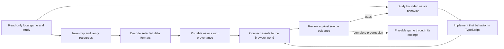

# Rebuilding Gothic 3 for the browser

This repository contains a new TypeScript browser implementation of Gothic 3,
guided by the owner's local installation. The Windows game is a read-only
reference during preparation; it is not converted into a web program. Native
executables and decompilation listings are studied to understand selected
formats and behaviors, then the browser runtime is implemented separately.

The goal is a game a player can start, progress through, save and finish at one
of Gothic 3's endings. A scene viewer, a decoded model or a successfully read
native data structure is a useful component milestone, but it does not by
itself establish a playable reconstruction.

## The rebuilding loop

The work follows two tracks—recovering original game data and reconstructing
game behavior—and joins them in playable slices:



### 1. Inventory the source

The preparation tools read a local installation and its offline study. They
record hashes and determine which archive or patch layer supplies each logical
resource. This makes it possible to select the same winning file consistently
instead of silently using an older duplicate. Archive extraction only exposes
bytes; meshes, images, world records and behavior still require separate
readers.

### 2. Decode only what the browser needs

Format-specific tools decode world placements, meshes, actors, textures,
materials, motions and gameplay records. Conversion outputs keep source
provenance, hashes, coordinate transforms, assumptions and known omissions.
The browser loads these portable outputs; it does not need access to the
player's installation. The first data slice is Ardea, with landscape and
gameplay foundations being added as their readers are verified.

### 3. Reconstruct native behavior in small, evidenced pieces

For a behavior such as constructing the Hero, starting a quest or changing a
game event, the study follows the relevant native functions, call paths,
callbacks, layouts and object lifetimes. Decompiled C-like listings are
reference material, not original buildable C++ source. The implementation
checks claims against captured native bytes or source data where possible,
then writes a bounded TypeScript equivalent. Unknown engine calls stay
explicit rather than being filled in with guesses.

### 4. Join data and behavior in a playable slice

Recovered assets and reconstructed behavior must share the same live game
state. Entity identity, Hero properties, world time, input, movement, animation,
interactions, NPCs, quests and browser saves need to work together. Start with
one concrete encounter or progression step, connect its prerequisites and
effects, and preserve enough state to continue after loading. A standalone
reader or inspector remains a study tool until it participates in this flow.

### 5. Review the exact claim

Review each change against the evidence it is intended to reproduce: resource
hashes and conversion receipts for assets, tests for state transitions, and a
browser exercise for rendering and interaction. Compare behavior with the
installed game where a direct comparison is possible. Record unsupported
branches and separate build success, browser observations and original-game
equivalence; each proves a different thing. Keep coherent checkpoints so the
same sources and steps can reproduce the result.

## Example: rebuild one behavior end to end

The Hero's `GiveXP` path shows how a small Gothic behavior moves through the
rebuild. The native `Script_Game.dll` handler was traced to its machine-code
instructions and checked against the installed binary. That evidence resolves
a disagreement in the decompiled listing: this call form multiplies the
requested amount by five. It also establishes that one award can increment the
Hero's level once and add 10 learning points when it crosses a threshold. The
captured source identity and byte-level audit are kept with the
[combat evidence](../../assets/gothic3/combat/native-source-evidence.json) and
[public evidence receipt](../../public/gothic3/combat/native-combat-evidence.json).

The browser implementation then divides that behavior across its boundaries:
[`combat.ts`](../../src/gothic3/combat.ts) plans the supported XP transition;
[`live-dialogue.ts`](../../src/gothic3/live-dialogue.ts) accepts it only for the
recognized Hero-targeted command; [`quest-runtime.ts`](../../src/gothic3/quest-runtime.ts)
applies and validates the saved progression; and
[`npc-reading.ts`](../../src/gothic3/npc-reading.ts) retains the source-backed
Hero NPC property data. Focused cases live in
[`give-xp.test.ts`](../../tests/gothic3-dialogue/give-xp.test.ts) and
[`hero-progression.test.ts`](../../tests/gothic3-dialogue/hero-progression.test.ts).

This is a bounded feature, not a completed game mechanic: the Hero NPC property
set is not yet attached to the live world entity, the native level-up visual
effect is absent, and combat task execution is not connected. The next work is
to close those world/entity lifecycle gaps and exercise the behavior in the
browser. The same evidence-to-runtime-to-playable-review chain is required for
each quest, NPC, interaction and campaign transition.

The health potion is a second, smaller example of the same method. The runtime
resolves the Hero's `It_Potion_Health` stack to its exact source template and
checks its identity and modifier before use. The inventory action in
[`main.ts`](../../src/gothic3/main.ts) calls
[`useHealthPotion()`](../../src/gothic3/quest-runtime.ts), which applies the
source-defined HP change through
[`PlayerMemory::ApplyMod`](../../src/gothic3/player-properties.ts); the browser
save retains the remaining stack count. A focused case verifies the HP change
and save/restore in
[`hero-progression.test.ts`](../../tests/gothic3-dialogue/hero-progression.test.ts).
This connects the verified item effect to player state and saving, but does not
recreate the native quick-use task or animation, and combat still cannot injure
the Hero in ordinary play. The detailed evidence and limits are recorded in
[checkpoint 50](gothic3-rebuilding-process.md#50-apply-the-source-defined-health-potion-effect).

## Example: trace a native inventory handoff

The original `Give` dialogue command illustrates why a rebuild follows the
whole native call path. `Script_Game.dll` reads donor, recipient, item template
and amount; it calls `PSInventory::AssureItems` on the donor at quality 0 with
the requested amount, then passes the returned stack index to
`PSInfoManager::Give`. The indexed Game.dll overload clamps the transfer amount
only when the donor is the player, then delegates to
`gCInventory_PS::TransferItemsTo`; that transfer creates the recipient stack
before subtracting from the donor. Its remaining behavior includes inventory
callbacks, conditional quest manager notification, and localized Given/Taken
messages. The TypeScript inventory module now models this positive-amount
command path separately from the template-based Info Give overload. The
captured command registration and behavior summary are in
[`native-command-table.json`](../../assets/gothic3/gameplay/native-command-table.json)
and [`native-semantics.json`](../../public/gothic3/gameplay/native-semantics.json);
the assurance body is in
[`10003c65.c.txt`](../../assets/gothic3/inventory/sources/Script/10003c65.c.txt),
and the selected transfer bodies are under
[`assets/gothic3/inventory/sources/Game/`](../../assets/gothic3/inventory/sources/Game/).

The browser now connects positive-amount `Give` records that transfer the
source-pinned `It_Gold` template between PC_Hero and the active Ardea dialogue
owner. A new game replays the Hero's 121 source-seeded inventory assurances;
the native Script_Game path assures quality 0 for the donor and uses its
returned stack index. Before transfer, the host checks both inventories and
all 641 loaded quest definitions for a matching item-receive delivery target
with the item and participants. The dialogue host now also handles condition-8 NPC delivery
callbacks for Running type-1/type-4 quests: the first exact `Info.Npc` target
counter advances once, and source-backed rewards are preflighted before a
completed quest changes state. The browser PickPocket action transfers
source-resolved loot, but its property-listener and quest-start chain is not
connected, so `Ardea_Pocket` remains Open and its theft-reporting sequence is
not reachable in a fresh game. Both inventories retain their source-resolved
templates and stack values in browser saves, so a gold transfer survives
reload. The browser prints a simple transfer receipt; the game's localized
Given/Taken messages are not reproduced. Other templates, linked items,
item-receive quest delivery, trade and equipment remain outside this slice.
See [checkpoint
61](gothic3-rebuilding-process.md#61-connect-the-source-backed-ardea-gold-give-path)
and [checkpoint
62](gothic3-rebuilding-process.md#62-connect-the-bounded-info-delivery-callback).

## Where each stage lives

| Stage | Repository location | Result |
| --- | --- | --- |
| Inspect and decode local files | [`tools/gothic3/`](../../tools/gothic3/) | Offline readers and preparation scripts verify selected inputs and convert native records. The installed game and full study remain outside the repository. |
| Keep browser-ready source data | [`assets/gothic3/`](../../assets/gothic3/) and [`public/gothic3/`](../../public/gothic3/) | Reviewed portable assets and JSON catalogs, with provenance and conversion limits recorded alongside the data. |
| Implement game behavior | [`src/gothic3/`](../../src/gothic3/) | TypeScript modules model selected native state and operations; unsupported behavior stays unavailable or explicitly unknown. |
| Present and connect the game | [`gothic3/`](../../gothic3/) | The separate browser route connects the runtime, scene, controls and UI. |
| Check and document the result | [`tests/`](../../tests/) and [`docs/engineering/`](./) | Focused checks cover bounded behavior; engineering notes preserve evidence, limitations and reproducible checkpoints. |

The boundary between stages matters: a successful decoder proves that a data
format was read; a passing runtime check proves a bounded state transition; and
a browser interaction proves that the pieces are connected for that case. None
alone proves that the original game has been rebuilt. Each playable slice should
carry its source evidence through conversion, TypeScript behavior, browser use
and saving before the next campaign feature is treated as integrated.

## Reproduce a rebuilding checkpoint

### Run the committed browser build

Use Node.js 24, matching the [Pages workflow](../../.github/workflows/pages.yml).
From the repository root:

```powershell
npm ci
npm run dev
# Open the printed local URL with /gothic3/ appended.
```

The committed portable assets are sufficient for this route. For a production
preview, run `npm run build`, then `npm run preview` and open the same route.
See the [controls and scope](gothic3-browser-port.md#controls) for exploration,
the model inspector, dialogue and local browser saves.

### Regenerate source data when needed

Asset preparation is a separate offline step. Its input is the owner's
read-only installation, normally
`C:\Program Files (x86)\Steam\steamapps\common\Gothic 3`, and a verified
offline study containing extracted archives, the effective patch-layer index
and native binary evidence. The full installation and study are not committed.
The [preparation guide](../../tools/gothic3/README.md) lists each tool's inputs,
dependencies and output folders; use the converter for the feature being
rebuilt rather than regenerating unrelated assets.

For example, the selected NPC record package can be reproduced with:

```powershell
python tools/gothic3/prepare_npc_entity_source.py --study "C:\path\to\Gothic3_Decompiled_Study_2026-10-04"
```

Its [source manifest](../../assets/gothic3/npc-entity/manifest.json) pins the
original input, record boundaries and compressed/decoded output hashes. The
[runtime reader](../../src/gothic3/browser-npc-entity.ts) verifies the available
wire bytes and all decoded bytes before admitting the three selected records.
When HTTP gzip decoding hides wire bytes, only the exact decoded receipt can
be checked in the browser. Source graph metadata remains
separate from live world registration and activation; this reader currently
stops at the first unowned ErrorAdmin prerequisite. See
[checkpoint 73](gothic3-rebuilding-process.md#73-construct-retained-npc-owners-and-reach-the-first-property-factory).

### Record a reviewable result

For each implementation checkpoint, retain:

| Record | What it establishes |
| --- | --- |
| Input path, archive/patch winner and SHA-256 | The exact original resource studied. |
| Conversion manifest and native evidence receipt | The selected bytes, transforms, call order and known omissions. |
| TypeScript module and focused scenario cases | The implemented operations and their supported boundaries. |
| Browser exercise and save/reload result | Whether that operation is connected to the visible session and persisted state. |
| Exact commit and successful workflow/deployment URL | Which reviewed version was checked and published. |

Run `npm run typecheck`, `npm test` and `npm run build`, review the diff, and
exercise the changed browser interaction. For documentation edits, check
relative links and `git diff --check`. Record partial execution as partial:
an unknown prerequisite must preserve the effects already applied and must
not replay them after restore.

Before publishing, inspect repository-wide Actions runs and workflow triggers.
Reuse relevant results and allow an existing applicable run to finish. A pull
request runs the checks; a merge to `main` runs checks and the Pages deployment.
Use the resulting deployment receipt to verify the public `/gothic3/` route.

## Current implementation status

The steps above can be followed in the checked-out repository. The committed
portable assets are sufficient to run the browser build; regenerating original
assets additionally requires the owner's offline study and the tools described
in the [preparation guide](../../tools/gothic3/README.md).

```powershell
npm ci
npm run dev
# Open the local Vite URL with /gothic3/ appended.
```

Before publishing implementation changes, run `npm run typecheck`, `npm test`
and `npm run build`, inspect the diff and exercise the changed interaction in
the browser. Keep its source receipts and save/restore checks with the same
checkpoint. The production workflow checks the build and deploys the separate
route when the reviewed changes reach `main`.

The separate TypeScript route is live at
[Gothic 3 / Ardea](https://ael-dev3.github.io/Tervain/gothic3/). The deployed
integration through checkpoint 79 is `main` commit
`b408a48a68c222c20f64766ccf63f7e3c2007b0d`, merged in
[PR 48](https://github.com/ael-dev3/Tervain/pull/48) and published by successful
[workflow run 37541106669](https://github.com/ael-dev3/Tervain/actions/runs/37541106669), attempt 1.

The public browser check loads 202 scene objects and 70 character models,
enters Ardea with Hero HP 100 and inspects the Hero model (10,692 triangles,
three meshes) and a coastal bandit (11,280 triangles, two meshes).
The route serves `gothic3-C3iMc5TP.js`; no captured warnings or
errors were observed. The checkpoint's standalone runtime admins are not
connected to the browser NPC reader. The isolated shared heap
owners in [checkpoint 75](gothic3-rebuilding-process.md#75-alias-selected-npc-fields-to-the-shared-heap)
still require full native startup and browser integration; their tests do not
establish an activated NPC or campaign progress.
[Checkpoint 76](gothic3-rebuilding-process.md#76-separate-physical-sceneadmin-construction-from-singleton-lookup)
implements physical SceneAdmin construction separately from cached module
lookup and class-name startup. Actual CRT, section, module and application
services remain prerequisites before these owners can supply live NPCs.
[Checkpoint 77](gothic3-rebuilding-process.md#77-own-the-engine-crt-heap-locks-and-selected-class-name-decoder)
adds source-owned CRT heap/lock operations and the selected ordinary class RTTI
decoder. Its isolated checks use explicitly admitted OS/TLS/platform fixtures;
they do not supply full native startup to the live NPC reader.
[Checkpoint 78](gothic3-rebuilding-process.md#78-rebuild-the-ordinary-engine-dll-attach-prefix)
adds the ordinary Engine DLL attach prefix: physical security cookie, OS
output, TLS/FLS indices, encoded pointers and the 532-byte CRT thread record.
It reaches the next GetCommandLineA dependency before full DLL startup; these
components remain separate from the live NPC reader.
[Checkpoint 79](gothic3-rebuilding-process.md#79-preserve-navigation-attachment-notifications-and-live-area-ownership)
adds the original nonpropagated Navigation notification sequence and a browser
owner for the application session cache and area query services. Actual area
construction, reflected type ownership and lower notification services remain
required before this can activate the selected NPCs.
[Checkpoint 80](gothic3-rebuilding-process.md#80-reproduce-fresh-cstring-text-construction-and-owned-byte-operations)
corrects fresh CString text construction and the class-name adapter's original
space search and scalar copy. Pointer alignment and capacity come from actual
owned allocation records. These component changes are prerequisites for the
Game Navigation class-name/type owners; they do not advance the live NPC reader.
Subsequent build and deployment receipts are recorded in the
[Pages workflow](https://github.com/ael-dev3/Tervain/actions/workflows/pages.yml).
This is an incomplete reconstruction; hosting and a successful build do not
mean the campaign can be completed.

The current playable slice combines a source-derived Ardea scene, a moving
third-person Hero, model and motion inspection, and streamed landscape cells
from Myrtana, Nordmar and Varant. Its browser-owned session can save and restore
the Hero's position, world clock, quest states, supported game events, selected
dialogue flags, and bounded progression values. The startup quest run,
selected dialogue conditions and effects, Hero XP/level/learning-point changes,
some quest rewards, and a source-verified health-potion effect are connected to
that session. These are narrow supported paths; most original quests, item
interactions, faction consequences and endings are not implemented.

Scene data identifies all 70 placed Ardea actors by their source records,
including Jack's three coastal bandits.
Three residents can be placed at matching native Start routine points when
their work, rest and sleep assignments agree. Diego's bounded dialogue was
exercised after placement and across save/restore.
Their daily routines, AI and native entity lifecycle are not connected. The
selected bandits now run the scheduled death prefix described below. Combat
research resolves damage rules, the unarmed Fist carrier,
serialized equipment references and deterministic Weaponry recipes. On the
current checkpoint, the Plunder bridge resolves distribution-0 draws
with a browser-owned MSVCRT-compatible random stream and creates NPC inventory
stacks through `NativeInventory`. Distribution-3 Weaponry now adds the
hash-checked Raider axe through `AssureItems` at quality 256 and amount 1; its
primary-slot-6 `EquipStack` plan is retained with `applied: false`. UseType 2
two-hand weapons are marked as requiring a split-stack/slots-6-and-5 path that
is not yet implemented. Browser NPC save schema v3 persists the source-bounded
inventory, and v1 saves rebuild the new Weaponry stack from their stored Plunder
draws. Creation still occurs on browser first contact, not native NPC cache-in;
the browser seed and global
random-call order do not reproduce the installed game's sequence. Physical
ItemWorld objects, actual equipment attachment and AI remain disconnected.
This checkpoint applies browser-hosted fist damage to the 15 exact
starting Raider identities and Jack's three coastal bandits. It uses
source-verified Hero and Fist data and the audited damage calculation, then
updates NPC HP in browser saves. Zero-HP visuals hide immediately and stay
hidden after restore. Only the bandits have a source-resolved lethal
disposition; Raider zero HP does not establish a kill. The kill callback
updates exact-name targets for types 2/3/4 and can complete eligible quests,
with their supported rewards saved once. The hit detector and standing target
state remain browser-owned; native NPC activation, AI, attacks and responses,
full Kill/Defeat handling, death animation, loot and several reward
services remain absent. The connected bandit death prefix is described below. The
retained initialized Hero seed supplies verified enum fields because the sparse
runtime NPC reader does not decode them. Details are in [checkpoint
55](gothic3-rebuilding-process.md#55-create-browser-npc-inventory-from-plunder)
and [checkpoint
57](gothic3-rebuilding-process.md#57-materialize-deterministic-weaponry-in-the-browser-npc-inventory).
The branch also connects Jack's first bandit-quest dialogue: its source events,
condition-5 report and condition-6 quest start now persist through browser
save/restore ([checkpoint
69](gothic3-rebuilding-process.md#69-start-jacks-source-backed-bandit-quest)).
The three source-directed bandit kill callbacks can now complete the quest,
award its 500 XP and unlock the condition-10 return dialogue for 50 gold and
250 further XP. This is a bounded browser path. See [checkpoint
70](gothic3-rebuilding-process.md#70-connect-jacks-bandits-and-correct-native-quest-callbacks).
Source-directed lethal hits now schedule `ZS_RagDollDead` through the recovered
Script wrapper. A later script-processor frame executes its one-time prefix,
dispatches the Kill quest event and calculates 50 defeat XP from the Hero's
post-event progress. The third kill's 500 quest XP therefore precedes its
50 defeat XP. Each prefix stops explicitly at the unconnected `NotifyEnclave`
callback; its applied state is retained in saves. Native speech playback,
ragdoll, plunder cleanup and the full NPC lifecycle remain incomplete. See
[checkpoint 72](gothic3-rebuilding-process.md#72-schedule-the-bandit-death-state-and-preserve-its-applied-prefix).
Checkpoint 73 constructs retained original owners for those three
bandits and remaps their constructor GUIDs through the original Node read.
The first Navigation factory stops at an unowned ErrorAdmin service, before
serialized property reading or attachment. The Models inspector's collapsed
developer details show that partial read and its current boundary. These
owners do not yet supply native activation or replace browser combat state.
See [checkpoint 73](gothic3-rebuilding-process.md#73-construct-retained-npc-owners-and-reach-the-first-property-factory).
The next local runtime component owns the shared ErrorAdmin, MessageAdmin and
MemoryAdmin chain under an explicit cold platform profile. Its isolated checks
exercise real heap backing, callback records, history and shutdown. It is not
connected to those NPC owners: their earlier entity, reflection and scene-map
allocations must first use the same heap. See
[checkpoint 74](gothic3-rebuilding-process.md#74-own-the-shared-runtime-admin-chain-before-connecting-it-to-npcs)
for the source audit, reproduction command and remaining allocation gate.
The current branch also resolves the native body-template `Robe` flag from
inventory slot17 and labels routine `Action`/`AniState` fields separately from
live combat animation state. A new reader maps the selected Hero motion into
the pose candidates and blend weight that `TrackCurrentPose` writes when the
actor transition flag is supplied. It is not connected to the damage planner;
other NPCs still use static bind-pose models. Diego is now an exception: the
branch converts his exact source body and head XACT files into a skinned actor,
checks their shared bind hierarchy, and maps the 11 audited Hero clips onto
matching named bones. The browser places and idles Diego's actor by his source
person GUID, and the model inspector can play the same clips. These are visual
and verified combat inputs; they do not select original NPC animations, apply
damage or activate NPC responses. See [checkpoint
56](gothic3-rebuilding-process.md#56-resolve-npc-armor-class-without-misusing-routine-state),
[checkpoint
58](gothic3-rebuilding-process.md#58-decode-the-live-motions-tracked-pose-fields),
and [checkpoint
59](gothic3-rebuilding-process.md#59-convert-and-connect-diegos-source-skinned-actor).
The bounded damage integration is described in [checkpoint
60](gothic3-rebuilding-process.md#60-apply-a-bounded-browser-hero-fist-hit), and
the 15-Raider HP, defeat-visual and save/restore integration is described in
[checkpoint 67](gothic3-rebuilding-process.md#67-persist-defeat-for-the-starting-ardea-raiders).
The current branch also exposes a browser PickPocket action. It reads the
source Hero Theft value and target level, applies the source gate, and adds
successful distribution-7 loot to the saved Hero inventory. The target's
`Dialog.PickedPocket` flag is saved by exact actor identity. Failure/caught
responses, the enclave crime effect, native InfoManager lifecycle, property
listeners and the `Ardea_Pocket` quest-start path remain unresolved, so the
quest stays Open. See [checkpoint
64](gothic3-rebuilding-process.md#64-port-the-bounded-pickpocket-gate-and-loot-generator)
and [checkpoint
65](gothic3-rebuilding-process.md#65-persist-the-source-backed-pickedpocket-actor-flag)
and [checkpoint
66](gothic3-rebuilding-process.md#66-connect-source-backed-pickpocket-loot-to-hero-inventory).

## Next playable integration gate

The next slice is to connect a source-backed NPC encounter through native
activation, action state and saved game state. The browser can already apply
bounded damage to the 15 starting Raiders and Jack's three bandits, and
complete Jack's supported quest through source-directed bandit kill callbacks.
Their native behavior is not connected:

1. Trace and connect the PickPocket failure/caught response, enclave crime,
   `Dialog.PickedPocket` property-listener and quest-start callback, then route
   the browser action through the native InfoManager lifecycle.
2. Replace browser first-contact inventory creation with the NPC
   processing-range/cache-in callback order and the native process-wide random
   sequence for Plunder.
3. Apply the Weaponry stack through the live actor's entity/skeleton/stat
   equipment host, including the source-serialized body/head attachments.
4. Construct and activate that NPC through property attachment, world context
   and processing registration. Route its earlier tagged allocations and
   registered scene-map backing through the same MemoryAdmin before consuming
   the new shared ErrorAdmin's panic result. Then supply the original
   application/module/session path and attach properties in source order.
5. Connect native contact eligibility, animation/action state and NPC responses,
   then finish the scheduled death prefix through enclave notification,
   destination and plunder cleanup, ragdoll and knockout handling. The bandit
   prefix already dispatches its connected quest and XP operations in order.
6. Save, reload and verify the encounter's resulting state.

Then expand the connected loop across Ardea, the other regions, faction
consequences and the campaign branches. Completion means a player can start a
new game and play through Gothic 3's progression to an available ending, with
worlds, NPC behavior, factions, dialogue, quests, combat and save/load working
together. A decoder, inspector, isolated formula or browser scene is evidence
for that component only.

For local asset preparation and source requirements, see the
[preparation guide](../../tools/gothic3/README.md).
