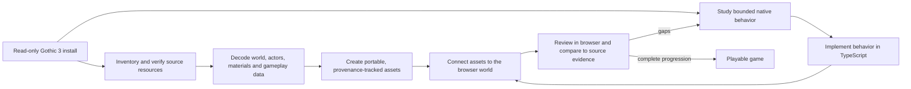

# Rebuilding Gothic 3 for the browser

This project is a new TypeScript browser implementation of Gothic 3, guided by
the owner's local installation. The Windows game is not converted into a web
program, and the recovered C-like decompilation listings are not original source
code that can be recompiled. Instead, the work studies original data and native
behavior, then implements and connects selected parts in a separate runtime.

The objective is a playable reconstruction of the original game's progression,
not only a model viewer or a recreated starting area. The current Ardea scene,
Hero presentation, original-data inspectors, selected Hero property readers,
and a source-backed first quest state are runtime milestones. They do not yet
provide ordinary gameplay through quests and endings.

## The rebuilding loop

### 1. Preserve and identify the source data

The local installation and its extracted study are read-only inputs. Inventory
the archives, hashes, and winning patch or archive layer for each resource
before using it. This avoids accidentally exporting an outdated duplicate. A
resource's bytes are then decoded by a format-specific reader; unpacking an
archive alone does not turn its contents into usable models or game behavior.

### 2. Recover assets and game data

Offline tools read Gothic 3 world records, meshes, actors, textures, materials,
motions, quests, dialogue and property sets. They convert only the needed data
to portable files for the browser and record source hashes, conversion choices
and known omissions. The current scene uses recovered world placements and
geometry, while the Hero export preserves the original skin and motion data.
Native engine services such as SpeedTree, complete shader graphs, lighting and
collision still need browser implementations.

### 3. Reconstruct behavior from bounded native evidence

For a behavior such as reading a property set or advancing a quest, inspect the
relevant native functions, their callers, callbacks and data layout. Follow
forwarding exports and virtual dispatch when needed, and compare captured
instructions with the installed binary. Then implement the specific operation
in TypeScript with its observed state, call order and object lifetime. Keep
unresolved engine services explicit; a decompilation is evidence for this work,
not proof that the browser implementation behaves identically.

### 4. Integrate each part into one live game

Portable assets, native-inspired behavior and the browser scene must share live
state. The Hero's property sets need to belong to the loaded player entity; input
must reach movement and animation; interactions must call dialogue, combat,
inventory and quest logic; world and NPC activation must follow the game state;
and saving/loading must preserve progression. A working isolated reader or a
rendered model is a useful milestone, but it is not complete integration.

### 5. Review against evidence and keep reproducible checkpoints

Build and inspect a coherent change locally. Verify resource receipts and
source hashes, exercise the behavior in the browser, and compare it against the
specific original data or behavior being reproduced. Record unsupported paths
and distinguish build evidence from browser review and original-game comparison.
Publish only through the repository's established deployment path when it is
available.

## What completion means

The reconstruction is complete only when a player can start a new game and play
through Gothic 3's progression to its available endings, with the necessary
worlds, NPC routines, factions, dialogue, quests, combat, progression and
save/load working together. A successful build, faithful asset conversion, or
native property reader validates only the part it covers.

For the current implementation, commands, source-format details, behavior
receipts and dated checkpoints, see the [detailed rebuilding process](gothic3-rebuilding-process.md).
For controls, current features, limitations and project boundaries, see the
[browser-port scope](gothic3-browser-port.md). Asset conversion prerequisites
and resource decisions are in the [preparation guide](../../tools/gothic3/README.md).
