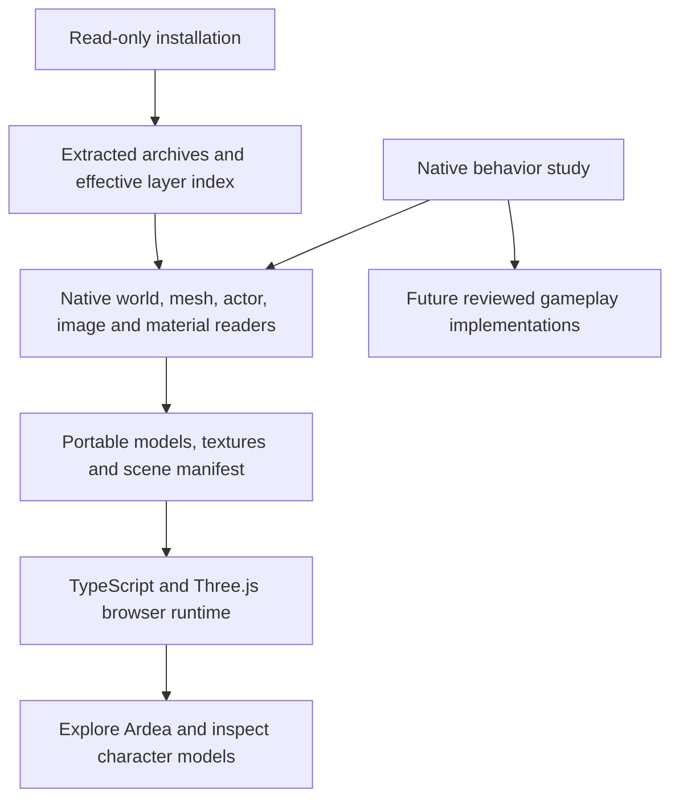

# How Gothic 3 is being rebuilt for the browser

Updated: 5 October 2026. Current source result: Ardea exploration, streamed native landscape
across three regions, Hero motion inspection, original quest/dialogue catalogs
and source-state/clock inspection in TypeScript. This is an
incomplete game reconstruction. Completing the original game in the browser
remains the objective; the inspector does not satisfy that objective.

The owner requested this separate project and explicitly approved hosting it
in Tervain. GitHub reports the repository as private on 5 October 2026. The route is
[Gothic 3 / Ardea](https://ael-dev3.github.io/Tervain/gothic3/).
The [scope record](gothic3-browser-port.md) describes the current controls,
limitations and source terms.

This guide describes the source on `codex/gothic3-gameplay-initialization`.
The hosted page remains at its last successful deployment; the latest source
checkpoints have not been deployed. Sections 10–14 cover the newer runtime work.

## Process at a glance

1. Inventory the local installation, preserve its bytes and identify the archive
   layer that supplies each resource.
2. Decode original world records, meshes, actors, textures, materials, motions,
   quests, dialogue and property sets into documented portable formats.
3. Recover one native behavior at a time from the installed binaries. Follow
   forwarding exports, imports and virtual dispatch, and compare the examined
   instructions with original program bytes.
4. Implement that behavior in TypeScript with its original state, callback
   order and object lifetimes. Record unresolved engine calls where they occur.
5. Connect those implementations to one live world: entity loading and context
   activation, the Hero's property sets, the existing script processor, clock,
   input, animation, collision, rendering and gameplay services.
6. Review coherent changes locally, preserve the source and resource hashes,
   then publish through the repository's deployment workflow when it can run.
7. Establish completion by playing the original progression through its endings,
   including quests, factions, combat, travel and saving/loading.

The current scene covers part of step 2 and the rendering side of step 5.
The newer source components advance steps 3–4. A successful TypeScript build
does not establish that step 5 is connected or that step 7 is possible.

## 1. Preserve and study the installed game

The installed game is the source of the selected geometry, texture pixels,
entity placements and character appearances. The original installation and the
completed local study are read-only inputs. Installed Gothic 3 executables and
DLLs are not run by the browser or the asset-preparation pipeline. Rimy3D is a
separate converter run offline during preparation.

The earlier local study inventoried and hashed the installation, extracted
38 archives containing 107,370 file records, and recorded which archive layer
is the selected static candidate for each logical resource. That broad index
does not establish every runtime zero-byte/deletion-entry behavior. The later
InfoManager study in section 10 verifies the specific compiled-info deletion
and fallback path. Those complete archive contents and native
binaries are kept outside this repository. The published derivatives cover the
rendered Ardea scene and the indexed animation, gameplay and world foundations
described below.

The preparation tool reads this study layout:

```text
<LOCAL_GOTHIC3_STUDY>/
  00_Original_Runtime/               native binaries used for offline byte evidence
  01_Decompiled_Code/                reconstructed native behavior references
  02_Unpacked_Data/
    Archives/                         physically extracted archive contents
    _metadata/effective_layers.json  logical names, selected layers and hashes
```

Archive extraction and resource decoding are different operations. Extracting
a file exposes its original resource bytes; a mesh, image or world record still
needs its own format reader. A successful archive extraction does not recover
original engine source code.

## 2. Recover behavior references from the native programs

The completed local decompilation study covers 36 runtime, script and updater
modules. It contains 224,676 native C-like functions, one exact assembly
forwarding entry and a managed IL/C# supplement. These are reconstructed
representations of compiled programs, with inferred types and control flow.
They are not the original C++ project and cannot simply be compiled into a
browser game.

The rebuilding method is to inspect a bounded native behavior, identify its
inputs and state changes, then deliberately implement its counterpart in
TypeScript. Native addresses, original file hashes and resource records provide
the evidence. A replacement needs comparison with original behavior before it
can be described as equivalent.

For example, native `eCColorSrcSampler::SetSwitch` establishes the zero-based
material switch behavior used by the texture converter. Native
`eCShaderBase::ExecuteZPass` and `SetShaderRenderStates` establish masked alpha
reference normalization. Those findings guide small implementations; the
native engine itself has not been translated.

The Ardea quest research in
[content-provenance.json](../../assets/gothic3/content-provenance.json) records
original quest predicates, dialogue commands and behavior references.
[content.ts](../../src/gothic3/content.ts) presents a reviewed summary. All six
listed quests currently have `implemented: false`: reading their source does
not implement their state machine, rewards or dialogue effects.

## 3. Decode the native resources and select an Ardea slice



| Native resource | What is recovered | Implementation |
| --- | --- | --- |
| `.node`, `.lrentdat` | Entity GUIDs, world matrices, visual resources and body/head slots | [read_genome.py](../../tools/gothic3/read_genome.py) |
| `.xcmsh` | Positions, normals, triangle indices, UVs and material sections | [read_xcmsh.py](../../tools/gothic3/read_xcmsh.py) |
| `.xact` / embedded FXA actor payloads | Static NPC body/head geometry; native Hero skeleton, skin and cleaned hierarchy | [prepare_ardea.py](../../tools/gothic3/prepare_ardea.py), [read_xact_skin.py](../../tools/gothic3/read_xact_skin.py) |
| `.xmot` / embedded LMA motion payloads | Original poses, timed position/rotation/scale tracks and motion phases | [export_animated.py](../../tools/gothic3/export_animated.py) |
| `.ximg` | Native DXT1/3/5 texture pixels and mip layout | [prepare_ardea.py](../../tools/gothic3/prepare_ardea.py), using Pillow |
| `.xshmat` | Diffuse sampler names, switch modes, blend mode and mask reference | [read_xshmat.py](../../tools/gothic3/read_xshmat.py) |
| Original `.quest`, `.info`, string table and gameplay properties | Full catalogs, original operands, localization and source state | [export_gameplay.py](../../tools/gothic3/export_gameplay.py) |
| `.wrldatasc`, `.secdat` and geometry contexts | World/sector membership, source enabled flags and terrain inventory | [export_world_index.py](../../tools/gothic3/export_world_index.py) |

The tool resolves resources through the effective layer index. It verifies an
input's SHA-256 before using it and refuses ambiguous file lookup. This avoids
silently taking an older base-archive version when a patch supplies the winning
resource.

The material reader distinguishes indexed `GENOMFLE` table strings from older
inline length-prefixed strings. A zero-length inline value is valid; it must not
make the containing shader disappear. Recognized shader/sampler parsing errors
stop preparation instead of silently dropping their metadata.

Rimy3D replaces spaces and tabs in exported material names with underscores.
Material lookup applies that same recorded name transformation with a uniqueness
check, preserving the actual native resource reference. It does not use fuzzy
name matching.

### World and characters

- Static families use the recorded entities in
  `G3_World_Lowpoly_01_Levelmesh_01_Spat.node`. Full-detail family resources are
  selected when present, at their corresponding recorded family transforms.
  Each entry records both `sourceResource` and `selectedResource`.
- City and outdoor props come from the effective Ardea dynamic-object `.node`
  layers. Six original Myrtana landscape LOD cells provide the terrain.
- The two Ardea NPC `.lrentdat` layers supply original body/head slots and
  material switches. Nearby named characters and the Hero's arrival position
  come from the effective `SysDyn` layer. Duplicate GUIDs are excluded.
- Diego, Milten, Gorn, Lester, Jack and Hamlar retain their recorded positions.
  Both NPC layers are included as source exhibits; original quest-controlled
  activation and NPC routines have not been reproduced.
- The Nameless Hero is a separate model-inspection exhibit. It is not an
  invented extra NPC placed at the scene origin.

### Coordinates and mesh conversion

The native world uses centimetres and Y-up coordinates. The browser uses metres
and a reflected Z axis. With native origin `[92000, 5200, -12000]`, conversion is:

```text
browser position = [(X - 92000) / 100,
                    (Y - 5200) / 100,
                   -(Z + 12000) / 100]
```

Normals are reflected and triangle winding is reversed. Entity matrices are
reflected on both sides before their position, quaternion and scale are
decomposed. Landscape vertices already contain world coordinates, so the origin
is applied to those vertices once; it is not applied again to their placement.

The native `PC_Hero` arrival position is
`[87984.9375, 5145.56396484375, -10197.4775390625]` centimetres. The browser feet
position is `[-40.150625, -0.544360, -18.025225]` metres. The exploration camera
adds its new 1.65-metre eye height. The chosen view toward Ardea is a browser
camera decision, not a recovered native camera controller.

### Texture and material conversion

Native XIMG mip levels are stored from smallest to largest. The full-resolution
DXT level must be read at `imagePayloadEnd - fullMipBytes`. Reading from the
start of the payload mixes mip levels and corrupts spatial detail. The converter
checks the payload layout and records dimensions, mip count, byte range and
source offset in `textureSelections`.

Opaque decoded pixels become JPEG at quality 92 without resizing. Textures
with alpha become PNG. A dark source albedo is preserved; an unproven gamma
correction is not baked into the exported pixels.

Native sampler switches select contiguous `S1..Sn` variants. Repeat wraps by
texture count, Clamp stays at an endpoint, and PingPong reflects over
`count - 1`. The selected sampler, variant, available range and original mode
are recorded in `materialSelections`.

Each model retains native Normal, Masked or AlphaBlend mode and the original
`MaskReference` byte. Alpha in a DXT image does not make an opaque stone or wood
material transparent. Masked surfaces use the native byte/255 reference, with
a small browser comparison epsilon to account for Three.js's discard boundary.
For the first Ardea OBJ export, full shader graphs, terrain layer blends, normal/specular maps and native
lighting remain unimplemented. The preview currently selects one diffuse
sampler for each material and records the unsupported blends.

## 4. Build a new TypeScript runtime

The separate entry is [gothic3/index.html](../../gothic3/index.html). Its browser
code is under [src/gothic3](../../src/gothic3):

| File | Responsibility |
| --- | --- |
| `types.ts` | Portable scene, character and material data shapes |
| `assets.ts` | Model caching, OBJ/MTL loading, texture completion and native alpha modes |
| `controls.ts` | New first-person movement, raycast ground support, wall sliding and flight |
| `main.ts` | Scene assembly, character inspector, map, journal, camera saves and UI |
| `content.ts` | Recovered character and quest reference summaries |
| `animation.ts`, `skinning.ts` | Hero clip playback and all native bone influences |
| `native-motion.ts` | Source quaternion packing/interpolation, pose fallback and normalization |
| `catalog.ts`, `catalog-view.ts` | Verified original quest/dialogue records and language selection |
| `quest-state.ts` | Native status transition kernel with explicit host effects; not enabled for play |
| `resource.ts` | Hash-checked, bounded decompression of lazy native-data chunks |
| `style.css` | The separate page's interface |

This code uses Three.js to display the prepared resources. It does not load
native DLLs, execute decompiled functions or import Tervain's simulation.
Ground support and movement are new approximations. NPC models remain static
bind-pose previews. The Hero inspector uses original skin weights and selected
motion tracks; equipment attachments, combat and NPC animation selection still
need corresponding native behavior. Preview lighting and brightness are browser
choices.

The generated [scene manifest](../../public/gothic3/scene.json) connects models
to placements and appearances. The
[source manifest](../../public/gothic3/source-manifest.json) records input and
output hashes, source layers, conversion details and omissions. Personal local
filesystem prefixes are omitted from the hosted records.

## 5. Reproduce, review and publish

Asset preparation requires the existing extracted study, Python 3.10+ with Pillow,
and Rimy3D. It writes the generated asset folder and an explicitly supplied
scratch folder outside the read-only study:

```powershell
python tools/gothic3/prepare_ardea.py --study "C:\path\to\Gothic3_Decompiled_Study_2026-10-04" --rimy "C:\path\to\Rimy3D.exe" --scratch "C:\outside-the-study\ardea-preparation"
```

See the [preparation README](../../tools/gothic3/README.md) for prerequisites,
format references and license separation. The installation/study generation
itself is an earlier local operation, not a step provided by this repository's
Ardea converter.

Use Node 24, matching the Pages workflow, to build the three browser entries with
the repository's pinned dependencies:

```powershell
npm ci
npm run typecheck
npm run build
```

`npm run dev` serves `/gothic3/` locally. Review the actual rendered scene and
models as well as the source diff. Check every generated output hash, asset
reference and source record; record unsupported behavior instead of treating
successful conversion as game equivalence. The current snapshot contains
202 world instances, 67 NPC records, 130 models and 139 textures.

Vite builds Tervain, `/gothic3/` and `/gothic3-local/` into one `dist`
artifact. Publication uses the existing Pages workflow. Before a coherent main
push, inspect repository-wide runs, attempts and workflow trigger chains; reuse
applicable results and avoid duplicate runs. The workflow retains its required
typecheck, scenario suite and build, followed by deployment. Confirm the served
Ardea route, the local-install viewer introduction and the original Tervain
version after the deployment succeeds.

The 4 October foundation checkpoint passed local typecheck, production build,
documentation link checks and generated-byte verification. All 11,843 gameplay
output receipts matched; 9,301 gzip files also matched their decoded receipts.
The largest decoded chunk was 2,749,307 bytes. Native Hero walking and paused
fist deformation rendered in the browser without console warnings, and catalog
search/language selection showed the original records. This evidence does not
include a native-game comparison run or a browser playthrough.

## 6. What still has to be rebuilt

A complete game requires implementations and original-behavior comparisons for:

1. Additional actor rigs, attachments, expression motion and native animation selection/blending.
2. Player combat, targeting, damage, hit reactions and death/revival rules.
3. NPC AI, routines, factions, hostility and original activation conditions.
4. Dialogue predicates and commands, inventory, trading, skills and quest state.
5. Remaining material cases, native vegetation, lighting, audio and world-object streaming.
6. Broad world content and save compatibility or an explicitly new save format.

Those systems are not implied by a model rendering correctly. Each future
milestone should name its native evidence, supported behavior, unsupported
cases and comparison results. Whole-game completion needs corresponding content
and behavior, rather than a larger collection of static models.

Gothic 3's assets remain third-party material with no asserted open-content
license. The offline preparation scripts retain their GPL-3.0-only license;
that license does not license the game's assets. The separate browser runtime
does not bundle those scripts. See [NOTICE](../../assets/gothic3/NOTICE.md).

## 7. Native foundations added after the first scene

### Hero skin and motion

The separate [animation manifest](../../public/gothic3/animated/manifest.json)
records 16 verified native inputs, 73 shared cleaned joints, 6,630 split vertices,
10,692 triangles and 11 original clips. Body and head retain their separate
inverse binds. The export reproduces the native helper-node cleanup, confirmed
at Engine.dll `eCWrapper_emfx2Actor::CleanUpHierachy` (`0x3002f955`) and its actor
load call sites. The raw hierarchy and every original motion key remain in
`hero-native.json`.

Some body vertices have 17 influences. The browser restores the original first
weight set, which GLTFLoader otherwise normalizes in isolation, and uses all five
body sets or two head sets in both GPU deformation and CPU bounds/raycasts.
Keeping only four weights would alter the original deformation. Independent
native-byte and static-converter checks are recorded in `animated/audit.json`.

Walking, running, idle and individual fist attack phases can be selected in the
model inspector. This is clip inspection: it does not execute combat. Native
rotation tracks are packed into signed shorts, decoded with the original
constant, interpolated by shortest-sign component lerp and normalized after
motion-layer evaluation. The browser's `native-motion.ts` reads the verified
raw keys and follows that path for one full-weight clip, rather than using
glTF's spherical interpolation. The portable GLB still has standard glTF
semantics for other viewers. Original multi-layer blending, motion effects and
repositioning remain unimplemented; JS float storage is not an x87 emulator.
Native normals/UVs and diffuse images are retained; the browser PBR response
still differs from the complete native material graph.

```powershell
python tools/gothic3/export_animated.py --study "C:\path\to\Gothic3_Decompiled_Study_2026-10-04"
python tools/gothic3/audit_animated.py --study "C:\path\to\Gothic3_Decompiled_Study_2026-10-04"
python tools/gothic3/research_native_motion.py --study "C:\path\to\Gothic3_Decompiled_Study_2026-10-04"
```

### Quest, dialogue and player state

The [gameplay manifest](../../public/gothic3/gameplay/manifest.json) covers 641
quests, 4,381 info records and 35,114 localization keys in five original languages.
Parallel command arrays retain their original positional cells and exact
operands. Compact runtime records omit duplicate raw text/byte representations;
the detailed extraction remains available locally. Browser catalog downloads
are checked against the manifest's output lengths and SHA-256 hashes.

The original Script_Game.dll startup table contains 54 info command entries.
Its lookup is case insensitive. The source `SuccessQuest` spelling is preserved
as unrecognized, rather than silently changed to `SucceedQuest`. `Description`
is handled by the separate Game.dll info layer. Reading a dialogue line does
not establish its availability or execute its actions.

The TypeScript quest kernel reproduces reviewed manager/status gates and calls
explicit host effects for rewards, arena state and the Ardea tutorial. It needs
actual initialized state and implemented host services before ordinary play can
use it. `CloseQuest` means Open → Obsolete or Running → Cancelled, not Success.
Prerequisites are unfinished while Open, Running or Lost in this native build.
ExperiencePoints is a script input, not necessarily final XP: the native quest
reward callback passes WorldEntity/Player roles, and the XP script applies
additional rules, including a multiplier on that path.

Serialized `PC_Hero` data contains pre-initialization placeholders. The native
`OnGameStartUp` callback sets health to 200, sets other attributes, initializes
inventory and starts `Xardas_FindXardas`. Those callback effects must be recovered
and executed; displaying serialized defaults as a completed new-game state
would be incorrect. The browser currently grants no quest rewards and retains
camera-only saves.

The recovered [initialized player seed](../../public/gothic3/gameplay/initial/initialized-player.json)
combines the serialized Hero with verified startup setters and 121 ordered
inventory assurances. It records 200 health, 100 mana, 100 stamina, the original
attribute values, template GUIDs and quick-slot operands. Five assurances
explicitly mark items learned. The other learned states remain unresolved where
creation notifications or template defaults still matter. The separate
[world clock record](../../public/gothic3/gameplay/initial/world-clock.json)
preserves Year 0, Day 0, noon and Factor 12, with the native read/notification
path attached. These are preparation records; the exploration controller does
not yet consume them as an active character simulation.

Enum numeric values are preserved from native files. Community enum labels are
advisory: this installed build uses older action numbering. For example, local
Game.dll initializes Action 24 as `StumbleR` at `0x20522a10`; dispatch must use
the verified mapping for this build.

### Bounded gameplay data

World entities and template properties are prepared independently from visual
models. The current index contains 230,337 entity records, including 49,586 with
selected gameplay properties, and 17,634 template headers. Decoding succeeds for
2,519 of 2,529 world sources and 6,081 of 6,082 template sources. The remaining
failures are recorded in the audit; they are not silently treated as empty data.

The ten world failures are seven version-only dynamic-layer stubs, one zero-byte
node and two unfinished dynamic layers. The template failure is an older tree
header format. Unknown property data remains in quest/info managers, inventory,
movement, items and other systems; the
[property audit](../../assets/gothic3/gameplay/runtime-property-audit.json)
records exact counts and classes. These gaps affect faithful state and save
integration even though the quest catalog can already be read.

Large property sets and their lookup indices use lazy gzip chunks. Each chunk
decodes to at most 4 MiB and carries compressed and decoded length/hash receipts.
World entity chunks contain at most 256 entities. The browser resource reader
checks the transport bytes, bounds decompression, then checks the decoded bytes
before parsing JSON. Exporting this data does not execute its native callbacks
or resolve every property type.

```powershell
python tools/gothic3/export_gameplay.py --study "C:\path\to\Gothic3_Decompiled_Study_2026-10-04" --raw-output "C:\outside-the-repository\gothic3-gameplay-raw"
python tools/gothic3/assemble_initial_player.py --study "C:\path\to\Gothic3_Decompiled_Study_2026-10-04" --raw "C:\outside-the-repository\gothic3-gameplay-raw"
python tools/gothic3/repack_gameplay.py --refresh-receipts-only
```

The detailed raw audits occupy several gigabytes outside the repository. The
initial-state assembly runs after the full export, then the last command refreshes
the final output receipts.

### Full-world indexing

The [world source manifest](../../public/gothic3/world/source-manifest.json)
records world registries → sector memberships → native world files. This is the
input to future streaming; an Ardea radius list cannot represent the full world.
The index includes 2,421 nodes, 108 dynamic world layers and 782 native landscape
Cell meshes across Myrtana, Nordmar and Varant. Source enabled flags, unresolved
references and bounds are retained explicitly. Bounds use absolute reflected
metres; a renderer must subtract its chosen floating origin once.

Indexing the resources does not render or activate them. The first index
checkpoint retained six Ardea landscape LOD cells. The terrain work below adds
conversion, exact source membership and rendering for all 782 landscape cells;
missing registries, native activation and collision/navigation remain separate.

The native defaults distinguish the `G3_Startup` menu world from gameplay world
`G3_World_01`. The gameplay registry contains 169 enabled references absent from
all extracted project layers, including old Ardea levelmesh/NPC names. Native
sector import appends `.sec`, performs an exact lookup and warns/skips missing
resources. The index retains those missing references; it does not infer
replacement sectors from similarly named files.

```powershell
python tools/gothic3/export_world_index.py --study "C:\path\to\Gothic3_Decompiled_Study_2026-10-04"
```

Completion must be evaluated against the original starting state, story gates,
quests, combat, region transitions and ending paths. A visible model, a complete
catalog, a successful build or a successful deployment alone cannot establish
that the original game is finishable.

## 8. Terrain streaming and reviewed gameplay kernels

### Convert the complete landscape-cell inventory

[export_terrain.py](../../tools/gothic3/export_terrain.py) consumes the existing
world index and verifies each selected native input against the immutable study.
It binds each Cell to its exact native GUID/entity, node, spatial context and
sector registration. It exports 303 Myrtana, 119 Nordmar and 360 Varant cells:
2,082,155 triangles, 1,931,561 vertices and 2,549 material sections.

The GLBs retain every section's indices, normals, tangent vectors, UV0–3 where
present, and the original unsigned BGRA diffuse/specular streams. Vertices are
centered in local float32 metres; the GLB node restores its absolute center.
The browser subtracts `[920,52,120]` once to share the existing Ardea display
origin. Maximum measured position rounding is 0.00001465 metres.

The separate [terrain manifest](../../public/gothic3/terrain/manifest.json)
links 65 native material graphs and 89 XIMG dependencies. The largest original
decoded mip becomes a lossless PNG, with no resizing, gamma transform or lossy
encoding. Identical pixels deduplicate to 88 PNG files. Geometry is 129,558,488
bytes and PNGs are 114,014,271 bytes. Original lower mips, lightmaps and collision
companions retain source receipts but are not converted/applied yet.

```powershell
python -B tools/gothic3/export_terrain.py --study "C:\path\to\Gothic3_Decompiled_Study_2026-10-04" --game "C:\path\to\Gothic 3"
python -B tools/gothic3/audit_terrain.py --study "C:\path\to\Gothic3_Decompiled_Study_2026-10-04"
```

The actual [conversion audit](../../assets/gothic3/terrain/conversion-audit.json)
compares all 782 meshes with their source streams/indices and all 89 image
dependencies with original decoded RGBA pixels. It checks source/output hashes;
it does not run the native game or establish visual equivalence.

### Compile graphs and stream resident geometry

[terrain-materials.ts](../../src/gothic3/terrain-materials.ts) compiles recovered
sampler, constant, vertex-color, combiner and blend nodes. Coordinate nodes
include Scale and native BumpOffset. A valid UV proxy follows its referenced
node; a missing-instance proxy selects its own UV stream. An outer sampler's
selector must not override a linked Scale node's original UV input.

Vertex blend weights use original alpha. With reflected geometry, the bitangent
is `cross(N,T) * (2*red-1)`, where red is original BGRA byte 2 divided by 255.
Native normal-map X/Y come from alpha/green, with reconstructed Z. BumpOffset
uses `(height-.5)*[offset,-offset]*tangentEye.xy`, without an eye-Z division or
renormalizing interpolated tangent/binormal. Native shader-source receipts and
instruction references accompany the exported graphs.

One connected sampler has an empty native image path. Nine original primitives
request UV1 while providing only UV0. Their unresolved materials are explicitly
marked in magenta and listed in Help; their geometry is retained. The renderer
does not substitute UV0 or an unrelated texture. Native global lighting,
specular lookup, lightmaps, mip chains and sampler gamma state remain fidelity
gaps; the surrounding Three.js lighting is an adjustable preview.

[terrain.ts](../../src/gothic3/terrain.ts) selects nearby enabled, registered
cells by absolute horizontal bounds. It uses two concurrent cell loads, a
48-cell resident target, distance hysteresis and a texture-memory estimate.
Geometry, textures and graphs are receipt-verified before use. Shared material
and texture leases release GPU resources when cells unload. An acquisition
rechecks cache identity after awaiting, so eviction cannot return a disposed
texture/material. Failed reads can be retried.

The six legacy Ardea terrain objects are hidden after native support cells are
ready. Collision-index refreshes preserve the camera state. Walking pauses at
unloaded terrain; static render-mesh raycasts remain a browser approximation,
not native PhysX. Landscape preview destinations read exact stored Hamlar,
Xardas and Vatras records, providing views near Ardea, Xardas's tower and Lago.
They do not execute NPC routines or quest travel. World buildings, vegetation,
caves and actors still need corresponding streaming.

For `.json.gz` served as raw gzip files, `resource.ts` verifies both compressed
and decoded receipts. If HTTP `Content-Encoding: gzip` makes Fetch transparently
decode first, it verifies the bounded decoded receipt; original wire bytes are
unavailable through Fetch on that route. The source JSON is never used without
its exact decoded hash. `native-data.ts` shares verified lazy reads with a
decoded-byte cache budget, exact source/GUID lookup and explicit ambiguity.

### Recover the real quest seed and bounded behavior

[initial-quests.json](../../public/gothic3/dialogue/initial-quests.json) contains
637 exact compiled QuestManager runtime packets and four native factory/INI
records, covering all 641 definitions. All statuses/counters/activation times
are zero before startup; the original `KapDun_Hunter_Fur` journal pair is
retained. The reader consumes every packet byte and retains source offsets,
versions and hashes. It does not apply startup's `RunQuest Xardas_FindXardas`.

[initial-state.ts](../../src/gothic3/initial-state.ts) validates and combines
those quest records with the recovered player/clock seed. Its default host
rejects gameplay effects. The browser's read-only character-state panel shows
HP/MP/SP, serialized Level/XP/LP, 121 inventory assurances, equipment references,
the original clock and pending callbacks. It does not tick time or grant items.

[dialogue.ts](../../src/gothic3/dialogue.ts) provides tri-state availability and
guarded command plans. Unknown host predicates remain unknown. Unsupported
commands/callbacks prevent script start; an accepted start marks Given before
asynchronous commands finish. The native Given exclusions are conditions
9/51/52, InfoType 0/4, Permanent and player ownership. Fresh omitted Permanent
defaults to false, while serialized InfoManager overrides remain separate.
Distance checks scale NPC-target distance by 0.25. Fresh INI defaults alone do
not establish restored Given state. Section 10 adds the separate, verified
ordinary-world-read Given seed; native save restoration remains unsupported.

[combat.ts](../../src/gothic3/combat.ts) provides bounded Hero fist/single-hand
Impact/Blade calculations, guards, death eligibility, native skill activation
and ordered effect plans. Missing contact, participant state, attitudes or
skills return unsupported. Native fists use their hit-phase marker; sword
contacts require the native touch/contact path. The module is not connected to
ordinary exploration. Its receipt matches 152 native entries, 12,465 listed
instruction records, 43,699 original PE bytes and all 138 action labels.

The native XP callback adds level/LP effects with the verified formula and a
single level increment per call. Info GiveXP passes None/player roles and gets
the fivefold source branch. These kernels require actual inventory, contacts,
AI, dialogue lifecycle and startup services before they can support gameplay.

```powershell
python -B tools/gothic3/read_initial_quests.py --study "C:\path\to\Gothic3_Decompiled_Study_2026-10-04"
python -B tools/gothic3/read_dialogue_native_evidence.py --study "C:\path\to\Gothic3_Decompiled_Study_2026-10-04"
python -B tools/gothic3/read_info_defaults_evidence.py --study "C:\path\to\Gothic3_Decompiled_Study_2026-10-04"
python -B tools/gothic3/freeze_dialogue_receipts.py
python -B tools/gothic3/research_native_combat.py --study-root "C:\path\to\Gothic3_Decompiled_Study_2026-10-04"
```

The dialogue proof matches 10,819 listed native instruction records; the fresh
info-default proof matches 2,749. These are offline byte/control-flow audits,
not native execution, exhaustive program verification or a game playthrough.

## 9. A separate viewer that reads the visitor's installation

[Claude's local-install viewer](gothic3-local.md), integrated from
[PR #21](https://github.com/ael-dev3/Tervain/pull/21), provides another way to
study Ardea at `/gothic3-local/`. The visitor selects their installed Gothic 3
folder. Original TypeScript readers decode archives, meshes, images, material
graphs, world cells and vegetation inside the tab; this route hosts no game
data and uploads none. Its development-only archive server requires a local
`G3_DATA` path and accepts loopback requests only.

This viewer has its own rendering assumptions. Tree crowns are generated
approximations, daylight is authored, and native lighting equivalence is
unverified. It loads its starting cells once and has no characters, dialogue
execution, combat or quest progression. Its author-reported parser and frame
measurements are recorded in its guide with their one-machine limits.

The `/gothic3/` reconstruction continues to use the audited preparation tools
and hosted derivatives described above. The two entries remain separate; a
working landscape renderer is only one component of rebuilding a finishable
game. The remaining runtime milestones in section 6 still require startup,
inventory, AI, contacts, dialogue, quests and saves to work together.

## 10. Rebuild initialization before enabling gameplay

This checkpoint adds source-backed inventory, InfoManager, startup and enclave
planners. The scene inspector uses the new read-only facts. A complete native
session and NPC simulation are still pending; these modules do not make the
browser game finishable.

### Select the real InfoManager provider

The latest `Projects_compiled.p01` entry for
`compiledinfos_G3_World_01.bin` is empty and has the deletion attribute
`0x8000`. Original VFS instructions show that it suppresses the same name in
lower archive layers. Choosing the most recent **nonempty** file would
therefore select an obsolete catalog.

The ordinary InfoManager read tries the compiled table where appropriate and
falls back to INIs when that lookup fails and entity patching is enabled.
The source `GetInfoDir` prefix selects exactly 4,381 current-world INI records.
The former `.pak` and `.p00` tables have 4,260 and 4,265 records respectively;
they are preserved as separate historical providers, never merged into the
current table.

All 4,381 current INIs explicitly set `InfoGiven=false`. Stored `Permanent`
is true for 197, explicitly false for 4,076 and absent for 108. The missing
properties retain the native fresh-factory false default. Stored Permanent
alone does not determine derived dialogue permanence or availability.

The selected world InfoManager is class version 4 with no runtime tail. Its
ordinary `Read` skips the older runtime-overlay branch. `ReadSaveGame` is a
different route; its Given packets must be restored separately. Permanent is
not a field of those packets.

[info-state.ts](../../src/gothic3/info-state.ts) loads independently hash-pinned
providers and guards Given lookups/updates by the info's exact archive, path
and hash. An unsupported restore invalidates those facts instead of resetting
them to convenient defaults. `loadBrowserInfoState()` uses an explicit fresh
`G3_World_01` profile with patching enabled, the deleted compiled lookup and
no `noinfos` command-line skip. This is a browser initialization choice backed
by the specified source route; it is not a capture of a running native game.
The source document records its assumptions and unapplied callbacks.

### Recreate stacks through the original inventory operations

[inventory.ts](../../src/gothic3/inventory.ts) ports bounded `CreateItems`,
`AssureItems`, `AssureItemsEx`, quickslot, Learn and skill-activation behavior.
It retains native signed/unsigned arithmetic, template GUID identity and
ordered callback notifications. Assure sums exact-quality matching stacks and
creates only a shortfall. Its selected stack is the last matching unlinked
stack, or the first linked match when no unlinked match exists.

Original vtable/import/export bytes bind stack property Enter/Exit hooks to
SharedBase methods which return true without effects. `CreateItems` assigns a
template proxy; it does not spawn an ItemWorld or execute that template's Skill
or Spell handlers. From an empty serialized stack list, the 121 original
assurances leave 116 stacks intrinsically Learned=false and explicitly set
five true. The two serialized Head/Body equipment references preserve their
original item and template GUIDs.

External inventory listeners are a separate runtime boundary. An omitted or
unknown registry rejects mutations before they start. A caller must supply a
complete ordered registry; passing an empty registry explicitly asserts that
it is complete and empty. The inspector instead reads the intrinsic projection
through [inventory-source.ts](../../src/gothic3/inventory-source.ts), which
performs no creation, listener or equipment calls. It does not assert that a
native session has no listeners.

The supported `Give` foundation selects the first **any-quality** donor stack
and transfers that stack's actual quality. Only a player donor is clamped to
that first stack's amount. It never combines donor stacks or creates a gift
when the donor has none. Ordinary unlinked transfers retain source removal,
recipient creation and quest-notification ordering. Physical unlink/equip,
mission-item special branches and localized transfer messages still need
their host implementations. Equipment plans are decisions, not completed
physical/stat effects; starting weapon equipment has not been established.

### Preserve the original new-game callback order

[startup.ts](../../src/gothic3/startup.ts) loads a hash-verified recipe and
plans the installed build's new-game mode 0 callbacks. `OnInit` invokes twelve
helper resets in native order, including the 63-row action-transition table,
entity caches, flags and distance entries. `OnGameStartUp` then performs:

1. Script entity-cache reset and Hero Chapter=1.
2. The temple-door height repair and Yepas alignment repair.
3. Larson's `Start` navigation routine.
4. Ardea alignment=1, Raid=true and Revolution=true.
5. `NotifyEnclave(Hero, Ardea_Orkboss, 2)`.
6. `RunQuest Xardas_FindXardas`.
7. Gorn's `OnExit_Gorn` ROI callback assignment.
8. Eighteen player stat setters, attribute LP=0 and `InventoryPopulate(...,0)`.

The Gorn exit callback was absent from the original C/function index. Offline
PE disassembly recovered its complete 412-byte body and direct branch
boundaries. It does nothing when `Gorn_ShowReddock` is Open. Otherwise it calls
CloseQuest, selects `GothaPrison`, moves to the selected working point and
clears ExitROIScript. That conditional is preserved as compiled. Its spatial
ROI scheduling has not been rebuilt.

The source also requires session prerequisites and later work: clock resume,
engine warmup, menu return, intro/audio restoration and ongoing AI/ROI/contact
scheduling. The recovered 757-byte `OnReturnFromMenu` body refreshes NPC
HP/SP maxima while preserving percentages; it is retained as evidence, not
claimed as an executed browser lifecycle step.

The startup host prepares every effect against a detached draft, then commits
one revision-checked state change. Plans and receipts are frozen and single
use. Missing handlers reject the entire transaction without applying a prefix.
`gameplayReady` remains false even after a bounded callback plan succeeds.

### Port Ardea raid entry without inventing active NPCs

[enclave.ts](../../src/gothic3/enclave.ts) plans the source-proven event 2,
Status 0→1 raid-entry path. Its gate compares **Other** with Other's enclave:
at startup that is Ardea_Orkboss versus Ardea, not Hero versus Ardea.
Political-attitude result 1 identifies same-side defenders, and result 4
identifies their opponents. The full eight-by-eight switch table and
chapter-dependent entries are recorded from original PE data.

Membership comes from the enclave's cached proxies. An empty cache is built
from NavigationAdmin's registered navigation property sets whose NPC enclave
ID matches. Rendered NPCs are insufficient evidence for that live registry.
Processing range is a live navigation byte, not a browser distance guess.

AIModes 6, 9 and 8 exclude defenders from the eligible count but retain them
in the total count. The signed native threshold selects liberated Status 2
only when `eligible * 5 < total`; equality at 20% and zero/zero select Status 1.
The supported branch preserves party detachment, Status assignment, ordered
FullStop/ContinueRoutine calls and distance-ordered recruitment toward ten
active members per side. Recruitment uses GroundBias=None, AniState=2 and
StartGoto(Player, walk mode 3).

Party clears require proved postconditions, because a native true return alone
does not establish a changed Party proxy. The status return/read and subsequent
member/distance facts also require host postconditions. Native float32 squared
distances are required; tied distances need the original qsort permutation.
Unknown facts produce no plan effects. Liberation, its quest/mission-item/death
callback chain, other events and actual AI/task execution remain unsupported.

### Evidence and reproduction

These audits overlap some earlier functions; their counts must not be added
as a count of unique ported engine methods.

| Boundary | Evidence in this checkpoint | Implementation boundary |
| --- | --- | --- |
| Inventory | 136 entries, 2,772 instructions and 7,666 bytes matched to original PEs | Unknown observers, physical equipment and special transfer paths remain |
| Startup | 75 functions, 7,220 listed/decoded instructions and 154 checked evidence files | Complete session, navigation, tasks and ROI remain |
| Enclave | 23 bodies, 1,883 instructions and 6,822 bytes matched to original PEs; 256-byte political switch table | Raid-entry planner requires a complete native host |
| Info state | 2,348 instructions matched to original DLLs, plus 421 matched to the separately labeled unpacked executable derivative | Fresh-world provider selection; native save restoration remains |

The derivative executable's evidence is explicitly distinguished from original
PE evidence. None of these tools executes an installed Gothic 3 binary.

```powershell
python tools/gothic3/research_info_runtime.py --study <LOCAL_GOTHIC3_STUDY> --installation <LOCAL_GOTHIC3_INSTALLATION>
python tools/gothic3/freeze_info_state.py
python tools/gothic3/research_native_inventory.py --study <LOCAL_GOTHIC3_STUDY>
python tools/gothic3/research_native_startup.py --study <LOCAL_GOTHIC3_STUDY> --capstone-path <CAPSTONE_5_0_7_PACKAGE_DIRECTORY>
python tools/gothic3/research_native_enclave.py --study <LOCAL_GOTHIC3_STUDY>
python tools/gothic3/freeze_initialization_checkpoint.py
```

See each tool's arguments and the separate `assets/gothic3/{inventory,startup,
enclave,info-state}` receipts. The original broad gameplay receipt is preserved;
these findings have their own source/output receipts.

The final checkpoint tool checks frozen bytes and catalog source identities.
It records the files present; it does not run or certify a typecheck, build,
browser inspection or native playthrough. Those validations need their own
evidence for the source being reviewed.

The candidate's source is reviewed separately from live deployment. The latest
new PR checks were refused before any workflow steps because GitHub reported
an account payment or spending-limit issue. A source-only checkpoint branch
can be reviewed without treating it as a successful Pages release. The live
site remains at its last successfully deployed revision until required CI and
deployment are available again; no checks or triggers are bypassed.

## 11. Add the clock, navigation lifecycle and task controls

Checkpoint `864422d` added executable TypeScript components for the
session runtime. Their supported operations perform actual state changes;
their remaining host boundaries still prevent a complete new-game session.

- [world-clock.ts](../../src/gothic3/world-clock.ts) reconstructs the paused
  source clock, timestamp sentinel, unsigned millisecond wrap, float32 stores,
  truncating calendar conversion and ordered time notifications. Its exact
  promoted millisecond coefficient is `0.0010000000474974513`. Callers select
  24, 53 or 64 bit nearest-even arithmetic; the live native control word was
  not captured. The browser clock inspector selects the native FPUAdmin
  default of 24 bits explicitly. Quest timestamps read the last published
  Year/Day/Hour properties without advancing time.
- [navigation-runtime.ts](../../src/gothic3/navigation-runtime.ts) preserves
  insertion-ordered navigation and ROI registries, duplicate handling,
  constructor-null caches, live vector references across property callbacks,
  enclave member-cache lifetime, processing sphere/AABB decisions and
  exits-before-entries dispatch. It does not register rendered NPCs implicitly.
  Compiled navigation scenes, sector/PVS traversal, real floor/physics queries
  and complete movement/property handlers remain required.
- [inventory-observers.ts](../../src/gothic3/inventory-observers.ts) implements
  the original list, recipe-stat and stack-stat callback writes, selection
  shifts and self-unregistration. `OnPlayerChanged` invalidates the script
  player cache and routes GUI binding to the persistent main page, then the
  active page. Active HUD composition still determines the complete inventory
  observer registry. Linked equipment retains a physical item/slot boundary.
- [script-routine.ts](../../src/gothic3/script-routine.ts) executes bounded SPU
  task/state/routine control. FullStop aborts the matching active instruction
  and does not clear the task or state automatically. Detection mode precedes
  SetTask's boolean-flag gate. Property setters retain their captured property
  set across notifications; time setters resolve Self independently. State
  replacement destroys every frame in capacity, rereads its object pointer
  before deletion, and clears each slot immediately. Original instruction
  bodies, script handlers, object deletion and property notifications remain
  explicit host responsibilities; the full SPU scheduler is still pending.

Landscape → **Inspect original world clock** runs an isolated browser instance
from the verified source seed. Run, Pause, Read next frame and Reset exercise
the clock component. The instance never resumes the game session or applies
NPC, quest, weather, music or ambient effects. Closing its panel stops it.

The new audits cover 60 clock entries/1,576 instructions/5,675 PE bytes;
117 navigation bodies/13,499 instructions/46,857 PE bytes; 90 inventory
observer functions/1,377 instructions/3,751 PE bytes; and 44 routine entries/
718 instructions/2,075 PE bytes. Functions overlap earlier checkpoints, so
these counts are not a sum of unique ported functions or a completion metric.

```powershell
python -B tools/gothic3/research_native_clock.py --study <LOCAL_GOTHIC3_STUDY>
python tools/gothic3/research_native_navigation.py --study <LOCAL_GOTHIC3_STUDY>
python tools/gothic3/research_inventory_observers.py --study <LOCAL_GOTHIC3_STUDY>
python tools/gothic3/research_native_routines.py --study <LOCAL_GOTHIC3_STUDY>
python -B tools/gothic3/freeze_session_checkpoint.py
```

[session-checkpoint.json](../../assets/gothic3/session-checkpoint.json) records
the file hashes at `864422d` and the separate offline audits. Its freezer verifies
the retained initialization checkpoint at commit `a2c3ce3`, the frozen module
receipts and routine source pins. It does not execute the game, run runtime
tests or certify a build, browser review, deployment or completed playthrough.
The older initialization receipt remains historical evidence for its own
checkpoint; the updated guide and attributes have new hashes here.

The next runtime dependencies are navigation-scene compilation
(`CompileNavigationScene 200131a1` → `CompileStaticNavigationScene 20013b29`),
floor-entry logic (`GetDistToGround 20027926`), active HUD binding and real
instruction/script execution. Startup can then compose these components in
the original order. The original complete game remains the delivery target;
an isolated clock, landscape or source-backed task API does not fulfill it.

## 12. Connect stored navigation, HUD composition and instruction processing

The following checkpoint adds bounded runtime components that consume the
original source records. These are implementation APIs, with their own native
evidence and explicit host requirements. They have not yet been assembled into
a complete browser `NativeGameSession`, and are not a completed game release.

### Load the installed world's stored navigation map

The selected map comes from
`Projects_compiled.p00/G3_World_01/NavigationMap.xnav` in the extracted local
study. Its original size is 14,550,529 bytes and its SHA256 is
`1b163f4f1be7115aeef37835e798772a3437db3429a32b4d36d866437b9a41c3`.
The `GENOMFLE` wrapper contains `GE3-NAV-MAP` version 3/0. The producer reads
the stored grid, negative zones, path intersections and network/interaction
lists. Original PE `ReadLists` behavior is the runtime reference; g3dit's
readers provide separately identified layout corroboration.

[research_navigation_scene.py](../../tools/gothic3/research_navigation_scene.py)
resolves all 5,385 stored map zone/path IDs to unique original typed world
records: 2,226 zones and 3,159 paths. It verifies selected input hashes and
decodes their properties again from the original world files. Source registry
and sector metadata are retained. These records do not establish which
entities are registered, resident or activated in a live session.

[navigation-scene.ts](../../src/gothic3/navigation-scene.ts) loads the verified
query subset and definitions. An explicit host resolves original live
property-set objects. The stored associations set zone network/exclusion data
and path intersection properties in native order. Callback attempts and writes
are recorded; a partial binding cannot be silently replayed on the same scene.

`GetZone` uses the native signed-angle zone test, radius selection, height and
LinkInner priorities, internal negative zones, tapered path cylinders and
intersection margins. A renderer mesh or generic AABB is insufficient for
these decisions. This implementation models float stores with JavaScript
arithmetic; exact x87 boundary behavior has not been established. Stored-list
loading does not implement forced map recompilation, AIZone inheritance, door
binding, path search, movement or collision avoidance.

The query subset is about 2.6 MB decoded; definitions are about 7.6 MB decoded.
The optional full stored lists are about 60.8 MB decoded and are not loaded for
a zone query. The shared [resource loader](../../src/gothic3/resource.ts)
requires an explicit larger decode budget for these resources and retains
bounded streaming, exact lengths and compressed/decoded SHA256 checks.

### Construct the original inventory-facing HUD controls

[hud-runtime.ts](../../src/gothic3/hud-runtime.ts) follows the root constructor,
Main2 creation and all seventeen page slots. Initially active and previous
page indices are -1, entity slots are null and controls are unbound. Startup
player slot 0 calls the focus helper (whose entity bind belongs to slot 1),
then binds mana, health and stamina controls, QuickSlots and the compass in
that order. It then handles the active page when there is one.

All 37 constructed inventory listener controls are accounted for: 26 list
controls, seven stack-stat controls and four recipe-stat controls. Their binds
and callbacks use the existing
[inventory-observers.ts](../../src/gothic3/inventory-observers.ts) adapters.
The native stack-stat selected-index field is uninitialized at construction;
it becomes usable only when the original Bind receives a real stack index.
The separate selection helper's labels/icons and other effects still require
their own implementation.

The host must perform the specified GFC, progress, header, cash, category,
trade and tutor subcalls. An evidence address can identify the containing
native function; it is not an instruction to rerun that whole function and
duplicate the already-ported listener bind. Entity identity must preserve the
original captured pointer lifetime across callbacks. The selected live-owner
profile does not establish arbitrary entity destruction/recreation behavior.

The original destructor destroys Main2, the crosshair, seventeen page slots
and three logo controls in that order, retaining post-destructor pointer reads
before deletion. Member listener destructors do not implicitly call
`RemoveListener`. Knowing every constructed HUD listener does not prove that
all external inventory observers are accounted for. Full equipment and world
entity effects remain separate requirements. This module is a runtime
composition model; it has not recreated the complete native HUD visually.

### Implement the notification chain used by routine setters

[native-properties.ts](../../src/gothic3/native-properties.ts) implements the
audited ScriptRoutine, PlayerMemory and NPC property-set notification profiles.
Outer Notify calls the owner's `Modified`, dispatches virtual OnNotify, and
the inherited OnNotify calls `Modified` again before returning true. In the
original entity classes, `Modified` reads DWORD `+0x130`; it does not write a
dirty flag. The constructor subset starts that word at `0xffffffff` and does
not claim a complete entity create/read/world lifecycle.

NPC exit notifications for the exact property name `Enclave`, with propagation
false, update the cached enclave proxy before the inherited OnNotify chain.
PropertyID storage occupies twenty bytes, but native equality compares the
first sixteen. Assignment copies those sixteen and clears the trailing DWORD.
For a changed ID, the proxy copies it before releasing a nonnull cached
internal reference, then clears that internal pointer. A real reference-release
host is still required when an existing internal reference is present.

Routine hooks bind the exact property-set value object captured by the native
setter. Replacing `Self.properties` during a callback cannot redirect the
remaining write/exit notification to a different property set. Other
property-set classes are not assigned generic successful no-op callbacks.

### Process the existing SPU state and run WAIT

[script-instructions.ts](../../src/gothic3/script-instructions.ts) implements
`ProcessScript`, the original WAIT instruction and shared per-frame callback
counters. It operates on the same live
[script-routine.ts](../../src/gothic3/script-routine.ts) state, revision,
ordered journal and failure state used by task/state control. It does not
maintain a second copy of the actor's task or instruction pointer.

The original factory has capacity for five distinct frames, one active frame,
a null audio channel and uninitialized instruction/callback timer fields where
the constructor leaves bytes unwritten. Callers must provide a real owner,
the application and EntityAdmin processing gates, and source-registered script
bodies. The arithmetic profile explicitly selects 24, 53 or 64 bit nearest-even
precision; a live native control word was not captured.

Each processing step stores scaled frame seconds before converting to
milliseconds, advances task/state/WAIT timers, polls an active instruction,
and decides whether it remains pending by rereading the active pointer.
The callback's return value alone does not decide that branch. State and
function completion comparisons preserve the original AL-byte checks.
WAIT reads its entity/uint32-duration descriptor only when starting; polling
uses the existing timer fields. Completion or abort clears both instruction
proxies and the active pointer. Legal nested instruction starts and setters
share the active scope; reentrant `ProcessScript` is rejected by this bounded
profile.

The empty-routine fallback checks original `NPC_PS` selector `0x1e`, independent
of Navigation_PS, before invoking `ContinueRoutine`. Native frame-object
destruction, audio-channel updates and missing script bodies remain explicit
requirements. Unknown effects expose their attempted/applied prefix and block
further use of the affected instance. This protects the reconstruction from
treating unresolved native work as a successful frame.

### Reproduce and checkpoint the source work

These are the commands for the historical `2637d1e` checkout. Use that commit's
files when reproducing its receipt; the current branch extends the shared
routine API and uses the new checkpoint in section 13.

```powershell
python -B tools/gothic3/research_native_properties.py --study <LOCAL_GOTHIC3_STUDY>
python -B tools/gothic3/research_native_hud.py --study <LOCAL_GOTHIC3_STUDY>
python -B tools/gothic3/research_navigation_scene.py --study <LOCAL_GOTHIC3_STUDY>
python -B tools/gothic3/research_spu_instructions.py --study <LOCAL_GOTHIC3_STUDY>
python -B tools/gothic3/freeze_dispatch_checkpoint.py
```

[dispatch-checkpoint.json](../../assets/gothic3/dispatch-checkpoint.json) records
the source file hashes and separate offline audits. Its freezer verifies the
historical `864422d` session receipt, retained file bytes and intentional
changes to the routine API, resource loader, guide and attributes. Each new
namespace has its own evidence/output receipts. Counts overlap earlier native
functions and are not a percentage of game completion.

| Source boundary | Original PE evidence in this checkpoint |
| --- | --- |
| Property notifications | 83 entries, 989 instructions, 3,556 matched bytes |
| HUD construction/binding | 328 bodies, 6,351 instructions, 20,514 matched bytes |
| SPU processing/WAIT | 117 entries, 2,055 instructions, 6,207 matched bytes |
| Stored navigation loading/query | 86 bodies, 11,040 instructions, 37,469 matched bytes |

The freezer checks hashes and receipts. It does not perform a fresh original
PE comparison, execute native code, run tests or certify a browser review,
build, deployment or playthrough. The historical initialization and session
receipts remain evidence for their respective commits; rerunning an old
freezer against a changed runtime is not a substitute for a new checkpoint.

The local candidate passed `npm run typecheck` and `npm run build`. Those
static checks cover compilation and packaging. They do not establish runtime
equivalence or a playable integrated session. No runtime tests, new browser
review, native execution or complete playthrough were performed for this
checkpoint. The new source components still require session integration.

The next integration step is a single session host with the original entity
and property-set lifecycle. It must connect clock/frame scheduling, live
navigation registration and sector residency, startup callbacks, HUD binding
and concrete AI/script bodies in their source order. Movement, contact and
physics then support combat, spells, dialogue, quest/enclave events and saves.
Completion requires an original-game playthrough in the browser, including
quest progression and endings. Those delivery requirements remain unfinished.

## 13. Connect entity identity, player storage, script bodies and session order

The next source checkpoint implements several parts of that integration. It
does not supply a complete browser engine host or change the deployed game's
completion status. The parts use the same live entity, property value and SPU
objects. Source records and an independently rendered model do not establish
that an entity has completed its original loading and activation lifecycle.

| Runtime component | Responsibility |
| --- | --- |
| [entity-lifecycle.ts](../../src/gothic3/entity-lifecycle.ts) | Original entity identity registration/rekeying, ordered property-set operations and examined lifecycle/notification profiles |
| [player-properties.ts](../../src/gothic3/player-properties.ts) | One captured PlayerMemory_PS and shared original gCAttribute/gCStat objects, seeded before startup |
| [routine-scripts.ts](../../src/gothic3/routine-scripts.ts) | Examined original ContinueRoutine, Hero routine and state/function prefixes on the existing SPU |
| [session-runtime.ts](../../src/gothic3/session-runtime.ts) | Original session controller and concrete GameApp application frame order, with explicit engine subcalls |

### Retain physical state and complete the loading stages

Original ID registration and world residency are separate operations. An
entity constructor can register its generated ID before Node::Read replaces
it with the serialized ID. Property sets also have a specific order for
setting their owner, receiving OnPropertySetAdded and being appended to the
entity's property-set array. Reflective validity, the property-set flag byte,
entity registration and active world context must each be tracked according
to their own original fields.

Node::Read consumes the 20 serialized ID bytes but clears the live ID's trailing
cache word after copying its first 16 bytes. The raw source ID remains intact
in the provenance record. NavPath reset also preserves a valid original height
cache; its first height calculation uses the live owner's matrix storage.
Its reset uses the recovered entity-pointer NULL proxy overload: release a
cached reference, clear the pointer, then destroy all 20 ID bytes. The
PropertyID overload used by the NPC enclave setter has a different order.

The installation contains separate Ardea NPC contexts with different context
flags. Enabling a sector registry entry alone does not prove that every source
entity in that sector is resident. Template patching, class-specific callbacks,
context activation and engine cache/physics effects remain explicit loading
requirements. The new lifecycle code supplies examined operations for those
objects; it does not activate every indexed entity as a shortcut.

### Share the original player properties

The player-property producer reads the original serialized PC_Hero record,
before OnGameStartUp changes its stats. It retains 15 original attribute/stat
objects, 24 serialized PlayerMemory fields and 51 attribute/stat property values
(75 values in total). A caller can bind the
existing captured PS rather than create another player-state copy.

The 18 startup stat setters use their recovered wrappers and attribute
notification chains. Hit-point and stamina current/max setters have ordering
and clamping behavior which a plain assignment would lose. gCAttribute and
gCStat notifications are different from entity property-set notifications.
Chapter, learning points and other PlayerMemory fields use their examined
paths on the same store. The session tutorial adapter also retains that store.

Startup, HUD, equipment, routines and combat must read these same objects.
This component does not by itself complete inventory population, physical
equipment changes or all attribute-modifier enumeration.

### Execute registered script prefixes on the existing SPU

The serialized Hero has `Routine = Rtn_Player`. Its execution must dispatch
that registered script, while the examined empty-routine NPC branch uses
ContinueRoutine. The new script module retains those identities and uses the
existing scheduler, property stores, instruction state and native frame stack.
It supplies examined routine/state/function bodies and exposes unimplemented
engine effects at their original call positions.

The shared frame API now supports the original Add/SetCount behavior needed
by player function calls. Its explicit successful moving-allocation profile
copies slot values into new physical frame objects; only newly allocated slots receive constructor
defaults. The examined Script Entity wrappers are nonowning field copies; their recovered
copy and destructor behavior must be retained without inventing AddRef/Release
calls. Native allocation and unsupported wrapper branches remain explicit.
Captured arguments must still belong to the same SPU allocation when read or
written after a callback. Reentrant destruction retains the applied prefix
and blocks the next access rather than using a surviving JavaScript object.
Known script branches can advance through their recovered prefix. Missing
player input, animation, targeting, movement or other bodies cannot return a
fabricated completion value.

### Preserve session startup and the application loop

The recovered Start controller performs these steps in order:

1. Stop an existing selected player when the start mode requires it, then
   select the original player and camera entities.
2. Fetch ScriptAdmin, compile navigation with the original force flag, and
   write the session's game-running byte from `compileResult === 1`.
3. Invoke OnInit for modes 0/1 and OnGameStartUp for mode 0. The original
   controller continues this sequence even when compilation returned a
   supported result other than 1.
4. Apply the optional command-line clock hour, factor 12 and ResumeClock,
   then resume the session. The Clock_PS adapter must include its property
   notifications; the arithmetic-only clock does not complete that setter.
5. For a new game, disable the engine component and mute channel 0.
6. Set warmup, perform 20 actual GameApp OnRun calls, and await the host's
   100 ms delay after each call. Clear warmup after all iterations.
7. Close the menu/page, invoke OnReturnFromMenu, play G3_Intro.bik for mode 0,
   restore the component/audio, handle TUT_Start and restore the thread pool.

GameApp's virtual `+0x270` reads that same current session game-running byte.
The routine host adapter and SPU frame input use it. The scaled frame time is
the original stored float32 field; the adapter does not invent an additional
pause or AI switch.

Each warmup frame follows the recovered OnRun/Process order: outer panic
check, optional memory validation, frame-counter increment and inner panic
check, keyboard, mouse, module processing, application OnProcess, entity
processing, module post-processing, physics, entity removal and rendering.
The original byte comparisons and repeated receiver lookups are retained.
The named input/module/entity/physics/rendering subcalls still need concrete
browser implementations. A counter-only warmup is insufficient.

The controller records attempted/applied calls and blocks after an unknown
dependency, retaining its earlier effects. It does not roll back those effects
or restore audio/warmup flags through a cleanup path absent from the original
function. Async browser video and delays must finish before the next source
step. Their timing is a selected browser host profile, not a Win32 capture.
Successful execution of an examined controller remains `gameplayReady: false`.

### Reproduce this checkpoint

```powershell
python -B tools/gothic3/research_entity_lifecycle.py --study <LOCAL_GOTHIC3_STUDY>
python -B tools/gothic3/research_player_properties.py --study <LOCAL_GOTHIC3_STUDY>
python -B tools/gothic3/research_routine_scripts.py --study <LOCAL_GOTHIC3_STUDY>
python -B tools/gothic3/research_session_runtime.py --study <LOCAL_GOTHIC3_STUDY>
python -B tools/gothic3/freeze_lifecycle_checkpoint.py
```

[lifecycle-checkpoint.json](../../assets/gothic3/lifecycle-checkpoint.json)
records current files and deliberate changes from `2637d1e`. The earlier
dispatch/instruction receipts remain historical evidence at their recorded
commits, including the previous shared routine implementation. They are not
rewritten to claim that the extended frame API has unchanged bytes. The new
receipt also records the deliberate `native-properties.ts` addition for the
entity-pointer NULL proxy overload; its existing PropertyID setter is retained.

The offline producers verified these instruction excerpts against the original
PE bytes. Entries include forwarding exports and overlapping bodies, so these
counts are evidence sizes rather than a percentage of the game implemented.

| Evidence set | Entries | Instructions | Original instruction bytes |
| --- | ---: | ---: | ---: |
| Entity lifecycle | 270 | 5,300 | 16,632 |
| Player properties | 383 | 6,088 | 18,846 |
| Routine scripts | 1,013 | 29,182 | 102,962 |
| Session/application order | 49 | 1,058 | 3,727 |

The combined TypeScript check and production build passed locally on 5 October
2026 (`npm run build`, 235 Vite modules). The build retains the existing large
chunk warning. The new modules are source components requiring engine-host
integration; this build does not establish that their session path ran in the
browser. No tests, native execution, browser session or playthrough were run
for this checkpoint. Publishing this source branch does not deploy it.

The remaining delivery work includes complete world activation and browser
engine services, the rest of the original scripts, movement/contact/physics,
animations, equipment, combat, spells, dialogue, quest and enclave chains,
saves, deployment and an original-game playthrough through its endings.

## 14. Read live entities, share Clock_PS and schedule original Hero behavior

This checkpoint extends the lifecycle work above. It supplies examined
TypeScript controllers and original-byte evidence for four more parts of the
runtime. The current browser entry still provides exploration and inspection;
it does not yet bind these controllers into a playable original-game session.

| Component | Source implementation | Current boundary |
| --- | --- | --- |
| Base entity ReadV83 and scalar/name setters | [entity-reading.ts](../../src/gothic3/entity-reading.ts), [entity-setters.ts](../../src/gothic3/entity-setters.ts) | Reflective class factory, full property reads, dynamic/spatial wrappers and active context loading |
| Physical Clock_PS | [clock-properties.ts](../../src/gothic3/clock-properties.ts), [world-clock.ts](../../src/gothic3/world-clock.ts) | Actual module lookup and weather/music/ambient effects, full entity construction |
| Hero state bodies and native input queue | [player-state.ts](../../src/gothic3/player-state.ts), [routine-scripts.ts](../../src/gothic3/routine-scripts.ts) | Full input dispatcher, physical movement, focus search, animation and remaining states |
| Application timing and entity processing | [application-process.ts](../../src/gothic3/application-process.ts) | Resident range construction, ROI/PVS updates, physics, renderer and host scheduling |

### Read the base entity in its original order

ReadV83 consumes the node identity, flags, setters and name before reading
embedded geometry data. Each matrix, box or sphere is one original stream
read of 64, 24 or 16 bytes into the entity's existing embedded storage. Its
three box reads are **world-tree, local-node, world-node**. The later validity
updates have a different order: **local-node bit 19, world-node bit 20,
world-tree bit 21**. Named native getters establish the physical offsets;
similar-looking decompiler field names cannot establish their meaning.

The property-set loop preserves the native accessor's validity-byte check,
dynamic cast, serialized/current version comparison, repeated native-object
lookup, AddPropertySet(false), DEADC0DE sentinel and accessor destruction.
OnPostRead runs before the saved source timestamp is written to the entity's
modified word. Its uniform scaling field is then replaced using the original
world-matrix scaling helper. A completed base Read does not certify that the
enclosing dynamic/spatial load, template patch or context activation completed.

The setters retain their different child-recursion and callback behavior.
Picking/collision update the captured collision-shape property set and then
reread the physics object. Lock's recovered child path invokes picking.
SetName unregisters the previous name, assigns the new name, registers it and
reads Modified in that order. The name registry retains ordered, nonowning
entity pointers, duplicate entries and removal of the last matching pointer.
Allocation, string and finite-float assumptions are explicit supported profiles.

### Use one physical clock property set

The original World_MCP record supplies Clock_PS version 1 with Year 0, Day 0,
Hour 12, Minute 0, Second 0 and Factor 12. The adapter binds those mutable
properties to the same lower clock and exposes a calendar view of those
properties. Session startup, quest time, property setters and processing must
use that same object.

Clock setters preserve Enter, assignment and Exit notifications. A
nonpropagated Exit constructs the original time/date scratch fields, calls
bCClock.Set, then rereads Factor for Adjust with 86,400 seconds/day and
365 days/year. The derived Read hook is implemented separately from the
reflective loader that must populate the property set first.

Processing obtains the lower clock date, compares the old published Hour's
daytime, and directly publishes Year/Day/Hour/Minute/Second without setter
notifications. It computes and sends weather time, then, on a daytime change,
captures Ambient before looking up Music and calls Music before Ambient.
Captured receiver pointers and arguments survive consumer callbacks. An absent
host implementation remains unknown; a proven null native module takes the
original skip branch. The weather scalar setter can write supplied actual
admin storage, while module creation and the remaining consumer behavior still
need implementations.

### Drive Hero states through the original queue and SPU

PS_Normal_Loop consumes the module's native action queue and shared movement
flags. Its recovered signals include Jump 54, Sneak 74, weapon toggle 65,
quick slots 128–137 and use 60. A browser key mapping may choose those events
under an explicit host profile; this does not recover the installed game's
active user keyboard configuration or complete its input dispatcher. Recovered
default mappings are evidence for that selected configuration branch; custom
settings and the live browser device/event adapter still need binding.

The local study has no decompiled C body for PS_Normal_Loop. Its available
assembly range and original PE bytes supply the evidence for this body; the
checkpoint records that assembly-only entry explicitly.

The new adapter installs examined bodies on the existing routine scheduler.
It shares the Hero's property sets and original attribute/stat objects.
Ordinary movement can write the same Navigation and CharacterControl wished
movement modes. Those wishes still require the original physical movement
controller, collision and animation to move the Hero correctly.

The Jump state constructs its original 340-byte argument object and script
frame, preserving callback inheritance, captured nonowning entity wrappers and
destructor/delete order. The examined CanJump=false branch completes. The
true branch retains the original pose, action, animation-state, queue and
movement/stamina prefix before stopping at unresolved animation calls.
Focus lookup, talking, taking, fighting and other states retain their explicit
dependencies. Recovering a state prefix does not make that player action fully
playable.

### Publish frame time at the successful render tail

The concrete GameApp inherits an **empty OnProcess**. Application timing is
updated by UpdateTick at the end of a successful DoRender, after OnPostRender
and the final fogging disable. Processing earlier in the frame consumes the
previously stored frame/scaled seconds. A browser adapter that calculates a
new RAF delta inside OnProcess would change this order.

The timing implementation retains the original timer GetTime/Reset sequence,
smoothing, fixed frame time, single step, bounds, pause-override fields and
float32 stores. x87 precision and rounding are selected profiles; they are
not a captured native FPU environment. Browser scheduling must provide the
ordered timer/Sleep effects and preserve renderer early returns.

EntityAdmin starts with processing disabled, and CreateEngine later sets it
from the concrete engine setup's byte at offset 0xc6. Range updates still run
when processing is disabled. With processing enabled, the original controller
copies its ordered range array, adds references to every snapshot entity,
then runs pre/process/post for each eligible entity before releasing all
snapshot references. Dynamic property traversal rereads the application pause
state and invokes actual property-count/accessor callbacks. The clock adapter
delegates to the same physical Clock_PS, and routine processing uses the same
embedded SPU and stored application timing.

Rendered or indexed entities do not establish this range membership. A complete
session needs original context residency, cache/physics setup and the
ROI/PVS/hysteresis/exit/enter updates before this dispatch tail.

### Reproduce and retain the current evidence

Run the producers against the preserved local study on this source revision:

```powershell
python -B tools/gothic3/research_entity_reading.py --study <LOCAL_GOTHIC3_STUDY>
python -B tools/gothic3/research_clock_properties.py --study <LOCAL_GOTHIC3_STUDY>
python -B tools/gothic3/research_player_state.py --study <LOCAL_GOTHIC3_STUDY>
python -B tools/gothic3/research_application_process.py --study <LOCAL_GOTHIC3_STUDY>
python -B tools/gothic3/freeze_processing_checkpoint.py
```

[processing-checkpoint.json](../../assets/gothic3/processing-checkpoint.json)
chains from source commit `08cf0580`. It pins the four new namespaces and the
intentional shared changes to world-clock, routine-script dispatch and the
session timing comment. It also records this guide, its documentation index
link and byte-preservation attributes. Earlier receipts remain evidence at
their recorded commits; they do not claim unchanged bytes for extended shared
implementations.

The producers compare the examined instructions with original PE bytes and
preserve the source excerpts and hashes. Those evidence counts describe the
examined code, including forwarding entries and overlapping bodies. They do
not measure how much of the full game is implemented.

| Evidence set | Entries | Instructions | Original instruction bytes |
| --- | ---: | ---: | ---: |
| Entity reading/setters | 64 | 1,865 | 5,758 |
| Physical clock properties | 150 | 1,045 | 3,436 |
| Hero state/input prefixes | 152 | 11,357 | 39,010 |
| Application timing/entity processing | 133 | 3,421 | 11,912 |

The final combined TypeScript check and production build passed locally on
5 October 2026 (`npm run build`, 235 Vite modules). The existing large-chunk
warning remains. Source/excerpt hashes and local documentation links were
checked. No tests, original native execution, browser session, deployment or
playthrough were run for this checkpoint. The new controllers still require
browser-host integration.

The remaining delivery requirement is a connected browser runtime with the
original world activation and gameplay services, followed by a complete
original-game progression and save/load playthrough. This checkpoint keeps
`gameplayReady: false`.
