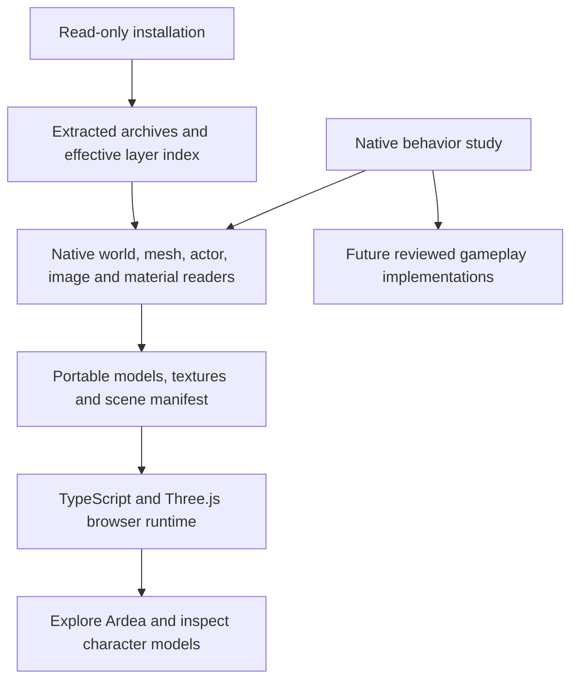

# How Gothic 3 is being rebuilt for the browser

Date: 4 October 2026. Current result: Ardea exploration, streamed native landscape
across three regions, Hero motion inspection, original quest/dialogue catalogs
and source-state inspection in TypeScript. This is an
incomplete game reconstruction. Completing the original game in the browser
remains the objective; the inspector does not satisfy that objective.

The owner requested this separate project and explicitly approved hosting it
in the public Tervain repository. The route is
[Gothic 3 / Ardea](https://ael-dev3.github.io/Tervain/gothic3/).
The [scope record](gothic3-browser-port.md) describes the current controls,
limitations and source terms.

## 1. Preserve and study the installed game

The installed game is the source of the selected geometry, texture pixels,
entity placements and character appearances. The original installation and the
completed local study are read-only inputs. Installed Gothic 3 executables and
DLLs are not run by the browser or the asset-preparation pipeline. Rimy3D is a
separate converter run offline during preparation.

The earlier local study inventoried and hashed the installation, extracted
38 archives containing 107,370 file records, and recorded which archive layer
wins for each logical resource. Those complete archive contents and native
binaries are kept outside this repository. The published derivatives cover the
rendered Ardea scene and the indexed animation, gameplay and world foundations
described below.

The preparation tool reads this study layout:

```text
<LOCAL_GOTHIC3_STUDY>/
  02_Unpacked_Data/
    Archives/                         physically extracted archive contents
    _metadata/effective_layers.json  logical names, winning layers and hashes
```

Archive extraction and resource decoding are different operations. Extracting
a file exposes its original resource bytes; a mesh, image or world record still
needs its own format reader. A successful archive extraction does not recover
original engine source code.

## 2. Recover behavior references from the native programs

The completed local decompilation study covers 36 runtime, script and updater
modules. It contains 224,676 native C-like functions, one exact assembly
forwarding entry and a managed IL/C# supplement. These are reconstructed
representations of compiled programs, with inferred types and control flow.
They are not the original C++ project and cannot simply be compiled into a
browser game.

The rebuilding method is to inspect a bounded native behavior, identify its
inputs and state changes, then deliberately implement its counterpart in
TypeScript. Native addresses, original file hashes and resource records provide
the evidence. A replacement needs comparison with original behavior before it
can be described as equivalent.

For example, native `eCColorSrcSampler::SetSwitch` establishes the zero-based
material switch behavior used by the texture converter. Native
`eCShaderBase::ExecuteZPass` and `SetShaderRenderStates` establish masked alpha
reference normalization. Those findings guide small implementations; the
native engine itself has not been translated.

The Ardea quest research in
[content-provenance.json](../../assets/gothic3/content-provenance.json) records
original quest predicates, dialogue commands and behavior references.
[content.ts](../../src/gothic3/content.ts) presents a reviewed summary. All six
listed quests currently have `implemented: false`: reading their source does
not implement their state machine, rewards or dialogue effects.

## 3. Decode the native resources and select an Ardea slice



| Native resource | What is recovered | Implementation |
| --- | --- | --- |
| `.node`, `.lrentdat` | Entity GUIDs, world matrices, visual resources and body/head slots | [read_genome.py](../../tools/gothic3/read_genome.py) |
| `.xcmsh` | Positions, normals, triangle indices, UVs and material sections | [read_xcmsh.py](../../tools/gothic3/read_xcmsh.py) |
| `.xact` / embedded FXA actor payloads | Static NPC body/head geometry; native Hero skeleton, skin and cleaned hierarchy | [prepare_ardea.py](../../tools/gothic3/prepare_ardea.py), [read_xact_skin.py](../../tools/gothic3/read_xact_skin.py) |
| `.xmot` / embedded LMA motion payloads | Original poses, timed position/rotation/scale tracks and motion phases | [export_animated.py](../../tools/gothic3/export_animated.py) |
| `.ximg` | Native DXT1/3/5 texture pixels and mip layout | [prepare_ardea.py](../../tools/gothic3/prepare_ardea.py), using Pillow |
| `.xshmat` | Diffuse sampler names, switch modes, blend mode and mask reference | [read_xshmat.py](../../tools/gothic3/read_xshmat.py) |
| Original `.quest`, `.info`, string table and gameplay properties | Full catalogs, original operands, localization and source state | [export_gameplay.py](../../tools/gothic3/export_gameplay.py) |
| `.wrldatasc`, `.secdat` and geometry contexts | World/sector membership, source enabled flags and terrain inventory | [export_world_index.py](../../tools/gothic3/export_world_index.py) |

The tool resolves resources through the effective layer index. It verifies an
input's SHA-256 before using it and refuses ambiguous file lookup. This avoids
silently taking an older base-archive version when a patch supplies the winning
resource.

The material reader distinguishes indexed `GENOMFLE` table strings from older
inline length-prefixed strings. A zero-length inline value is valid; it must not
make the containing shader disappear. Recognized shader/sampler parsing errors
stop preparation instead of silently dropping their metadata.

Rimy3D replaces spaces and tabs in exported material names with underscores.
Material lookup applies that same recorded name transformation with a uniqueness
check, preserving the actual native resource reference. It does not use fuzzy
name matching.

### World and characters

- Static families use the recorded entities in
  `G3_World_Lowpoly_01_Levelmesh_01_Spat.node`. Full-detail family resources are
  selected when present, at their corresponding recorded family transforms.
  Each entry records both `sourceResource` and `selectedResource`.
- City and outdoor props come from the effective Ardea dynamic-object `.node`
  layers. Six original Myrtana landscape LOD cells provide the terrain.
- The two Ardea NPC `.lrentdat` layers supply original body/head slots and
  material switches. Nearby named characters and the Hero's arrival position
  come from the effective `SysDyn` layer. Duplicate GUIDs are excluded.
- Diego, Milten, Gorn, Lester, Jack and Hamlar retain their recorded positions.
  Both NPC layers are included as source exhibits; original quest-controlled
  activation and NPC routines have not been reproduced.
- The Nameless Hero is a separate model-inspection exhibit. It is not an
  invented extra NPC placed at the scene origin.

### Coordinates and mesh conversion

The native world uses centimetres and Y-up coordinates. The browser uses metres
and a reflected Z axis. With native origin `[92000, 5200, -12000]`, conversion is:

```text
browser position = [(X - 92000) / 100,
                    (Y - 5200) / 100,
                   -(Z + 12000) / 100]
```

Normals are reflected and triangle winding is reversed. Entity matrices are
reflected on both sides before their position, quaternion and scale are
decomposed. Landscape vertices already contain world coordinates, so the origin
is applied to those vertices once; it is not applied again to their placement.

The native `PC_Hero` arrival position is
`[87984.9375, 5145.56396484375, -10197.4775390625]` centimetres. The browser feet
position is `[-40.150625, -0.544360, -18.025225]` metres. The exploration camera
adds its new 1.65-metre eye height. The chosen view toward Ardea is a browser
camera decision, not a recovered native camera controller.

### Texture and material conversion

Native XIMG mip levels are stored from smallest to largest. The full-resolution
DXT level must be read at `imagePayloadEnd - fullMipBytes`. Reading from the
start of the payload mixes mip levels and corrupts spatial detail. The converter
checks the payload layout and records dimensions, mip count, byte range and
source offset in `textureSelections`.

Opaque decoded pixels become JPEG at quality 92 without resizing. Textures
with alpha become PNG. A dark source albedo is preserved; an unproven gamma
correction is not baked into the exported pixels.

Native sampler switches select contiguous `S1..Sn` variants. Repeat wraps by
texture count, Clamp stays at an endpoint, and PingPong reflects over
`count - 1`. The selected sampler, variant, available range and original mode
are recorded in `materialSelections`.

Each model retains native Normal, Masked or AlphaBlend mode and the original
`MaskReference` byte. Alpha in a DXT image does not make an opaque stone or wood
material transparent. Masked surfaces use the native byte/255 reference, with
a small browser comparison epsilon to account for Three.js's discard boundary.
For the first Ardea OBJ export, full shader graphs, terrain layer blends, normal/specular maps and native
lighting remain unimplemented. The preview currently selects one diffuse
sampler for each material and records the unsupported blends.

## 4. Build a new TypeScript runtime

The separate entry is [gothic3/index.html](../../gothic3/index.html). Its browser
code is under [src/gothic3](../../src/gothic3):

| File | Responsibility |
| --- | --- |
| `types.ts` | Portable scene, character and material data shapes |
| `assets.ts` | Model caching, OBJ/MTL loading, texture completion and native alpha modes |
| `controls.ts` | New first-person movement, raycast ground support, wall sliding and flight |
| `main.ts` | Scene assembly, character inspector, map, journal, camera saves and UI |
| `content.ts` | Recovered character and quest reference summaries |
| `animation.ts`, `skinning.ts` | Hero clip playback and all native bone influences |
| `native-motion.ts` | Source quaternion packing/interpolation, pose fallback and normalization |
| `catalog.ts`, `catalog-view.ts` | Verified original quest/dialogue records and language selection |
| `quest-state.ts` | Native status transition kernel with explicit host effects; not enabled for play |
| `resource.ts` | Hash-checked, bounded decompression of lazy native-data chunks |
| `style.css` | The separate page's interface |

This code uses Three.js to display the prepared resources. It does not load
native DLLs, execute decompiled functions or import Tervain's simulation.
Ground support and movement are new approximations. NPC models remain static
bind-pose previews. The Hero inspector uses original skin weights and selected
motion tracks; equipment attachments, combat and NPC animation selection still
need corresponding native behavior. Preview lighting and brightness are browser
choices.

The generated [scene manifest](../../public/gothic3/scene.json) connects models
to placements and appearances. The
[source manifest](../../public/gothic3/source-manifest.json) records input and
output hashes, source layers, conversion details and omissions. Personal local
filesystem prefixes are omitted from the hosted records.

## 5. Reproduce, review and publish

Asset preparation requires the existing extracted study, Python 3.10+ with Pillow,
and Rimy3D. It writes the generated asset folder and an explicitly supplied
scratch folder outside the read-only study:

```powershell
python tools/gothic3/prepare_ardea.py --study "C:\path\to\Gothic3_Decompiled_Study_2026-10-04" --rimy "C:\path\to\Rimy3D.exe" --scratch "C:\outside-the-study\ardea-preparation"
```

See the [preparation README](../../tools/gothic3/README.md) for prerequisites,
format references and license separation. The installation/study generation
itself is an earlier local operation, not a step provided by this repository's
Ardea converter.

Use Node 24, matching the Pages workflow, to build the two browser entries with
the repository's pinned dependencies:

```powershell
npm ci
npm run typecheck
npm run build
```

`npm run dev` serves `/gothic3/` locally. Review the actual rendered scene and
models as well as the source diff. Check every generated output hash, asset
reference and source record; record unsupported behavior instead of treating
successful conversion as game equivalence. The current snapshot contains
202 world instances, 67 NPC records, 130 models and 139 textures.

Vite builds the original Tervain page and this separate entry into one `dist`
artifact. Publication uses the existing Pages workflow. Before a coherent main
push, inspect repository-wide runs, attempts and workflow trigger chains; reuse
applicable results and avoid duplicate runs. The workflow retains its required
typecheck, scenario suite and build, followed by deployment. Confirm the served
Ardea route and the original Tervain version after the deployment succeeds.

The 4 October foundation checkpoint passed local typecheck, production build,
documentation link checks and generated-byte verification. All 11,843 gameplay
output receipts matched; 9,301 gzip files also matched their decoded receipts.
The largest decoded chunk was 2,749,307 bytes. Native Hero walking and paused
fist deformation rendered in the browser without console warnings, and catalog
search/language selection showed the original records. This evidence does not
include a native-game comparison run or a browser playthrough.

## 6. What still has to be rebuilt

A complete game requires implementations and original-behavior comparisons for:

1. Additional actor rigs, attachments, expression motion and native animation selection/blending.
2. Player combat, targeting, damage, hit reactions and death/revival rules.
3. NPC AI, routines, factions, hostility and original activation conditions.
4. Dialogue predicates and commands, inventory, trading, skills and quest state.
5. Remaining material cases, native vegetation, lighting, audio and world-object streaming.
6. Broad world content and save compatibility or an explicitly new save format.

Those systems are not implied by a model rendering correctly. Each future
milestone should name its native evidence, supported behavior, unsupported
cases and comparison results. Whole-game completion needs corresponding content
and behavior, rather than a larger collection of static models.

Gothic 3's assets remain third-party material with no asserted open-content
license. The offline preparation scripts retain their GPL-3.0-only license;
that license does not license the game's assets. The separate browser runtime
does not bundle those scripts. See [NOTICE](../../assets/gothic3/NOTICE.md).

## 7. Native foundations added after the first scene

### Hero skin and motion

The separate [animation manifest](../../public/gothic3/animated/manifest.json)
records 16 verified native inputs, 73 shared cleaned joints, 6,630 split vertices,
10,692 triangles and 11 original clips. Body and head retain their separate
inverse binds. The export reproduces the native helper-node cleanup, confirmed
at Engine.dll `eCWrapper_emfx2Actor::CleanUpHierachy` (`0x3002f955`) and its actor
load call sites. The raw hierarchy and every original motion key remain in
`hero-native.json`.

Some body vertices have 17 influences. The browser restores the original first
weight set, which GLTFLoader otherwise normalizes in isolation, and uses all five
body sets or two head sets in both GPU deformation and CPU bounds/raycasts.
Keeping only four weights would alter the original deformation. Independent
native-byte and static-converter checks are recorded in `animated/audit.json`.

Walking, running, idle and individual fist attack phases can be selected in the
model inspector. This is clip inspection: it does not execute combat. Native
rotation tracks are packed into signed shorts, decoded with the original
constant, interpolated by shortest-sign component lerp and normalized after
motion-layer evaluation. The browser's `native-motion.ts` reads the verified
raw keys and follows that path for one full-weight clip, rather than using
glTF's spherical interpolation. The portable GLB still has standard glTF
semantics for other viewers. Original multi-layer blending, motion effects and
repositioning remain unimplemented; JS float storage is not an x87 emulator.
Native normals/UVs and diffuse images are retained; the browser PBR response
still differs from the complete native material graph.

```powershell
python tools/gothic3/export_animated.py --study "C:\path\to\Gothic3_Decompiled_Study_2026-10-04"
python tools/gothic3/audit_animated.py --study "C:\path\to\Gothic3_Decompiled_Study_2026-10-04"
```

### Quest, dialogue and player state

The [gameplay manifest](../../public/gothic3/gameplay/manifest.json) covers 641
quests, 4,381 info records and 35,114 localization keys in five original languages.
Parallel command arrays retain their original positional cells and exact
operands. Compact runtime records omit duplicate raw text/byte representations;
the detailed extraction remains available locally. Browser catalog downloads
are checked against the manifest's output lengths and SHA-256 hashes.

The original Script_Game.dll startup table contains 54 info command entries.
Its lookup is case insensitive. The source `SuccessQuest` spelling is preserved
as unrecognized, rather than silently changed to `SucceedQuest`. `Description`
is handled by the separate Game.dll info layer. Reading a dialogue line does
not establish its availability or execute its actions.

The TypeScript quest kernel reproduces reviewed manager/status gates and calls
explicit host effects for rewards, arena state and the Ardea tutorial. It needs
actual initialized state and implemented host services before ordinary play can
use it. `CloseQuest` means Open → Obsolete or Running → Cancelled, not Success.
Prerequisites are unfinished while Open, Running or Lost in this native build.
ExperiencePoints is a script input, not necessarily final XP: the native quest
reward callback passes WorldEntity/Player roles, and the XP script applies
additional rules, including a multiplier on that path.

Serialized `PC_Hero` data contains pre-initialization placeholders. The native
`OnGameStartUp` callback sets health to 200, sets other attributes, initializes
inventory and starts `Xardas_FindXardas`. Those callback effects must be recovered
and executed; displaying serialized defaults as a completed new-game state
would be incorrect. The browser currently grants no quest rewards and retains
camera-only saves.

The recovered [initialized player seed](../../public/gothic3/gameplay/initial/initialized-player.json)
combines the serialized Hero with verified startup setters and 121 ordered
inventory assurances. It records 200 health, 100 mana, 100 stamina, the original
attribute values, template GUIDs and quick-slot operands. Five assurances
explicitly mark items learned. The other learned states remain unresolved where
creation notifications or template defaults still matter. The separate
[world clock record](../../public/gothic3/gameplay/initial/world-clock.json)
preserves Year 0, Day 0, noon and Factor 12, with the native read/notification
path attached. These are preparation records; the exploration controller does
not yet consume them as an active character simulation.

Enum numeric values are preserved from native files. Community enum labels are
advisory: this installed build uses older action numbering. For example, local
Game.dll initializes Action 24 as `StumbleR` at `0x20522a10`; dispatch must use
the verified mapping for this build.

### Bounded gameplay data

World entities and template properties are prepared independently from visual
models. The current index contains 230,337 entity records, including 49,586 with
selected gameplay properties, and 17,634 template headers. Decoding succeeds for
2,519 of 2,529 world sources and 6,081 of 6,082 template sources. The remaining
failures are recorded in the audit; they are not silently treated as empty data.

The ten world failures are seven version-only dynamic-layer stubs, one zero-byte
node and two unfinished dynamic layers. The template failure is an older tree
header format. Unknown property data remains in quest/info managers, inventory,
movement, items and other systems; the
[property audit](../../assets/gothic3/gameplay/runtime-property-audit.json)
records exact counts and classes. These gaps affect faithful state and save
integration even though the quest catalog can already be read.

Large property sets and their lookup indices use lazy gzip chunks. Each chunk
decodes to at most 4 MiB and carries compressed and decoded length/hash receipts.
World entity chunks contain at most 256 entities. The browser resource reader
checks the transport bytes, bounds decompression, then checks the decoded bytes
before parsing JSON. Exporting this data does not execute its native callbacks
or resolve every property type.

```powershell
python tools/gothic3/export_gameplay.py --study "C:\path\to\Gothic3_Decompiled_Study_2026-10-04" --raw-output "C:\outside-the-repository\gothic3-gameplay-raw"
python tools/gothic3/assemble_initial_player.py --study "C:\path\to\Gothic3_Decompiled_Study_2026-10-04" --raw "C:\outside-the-repository\gothic3-gameplay-raw"
python tools/gothic3/repack_gameplay.py --refresh-receipts-only
```

The detailed raw audits occupy several gigabytes outside the repository. The
initial-state assembly runs after the full export, then the last command refreshes
the final output receipts.

### Full-world indexing

The [world source manifest](../../public/gothic3/world/source-manifest.json)
records world registries → sector memberships → native world files. This is the
input to future streaming; an Ardea radius list cannot represent the full world.
The index includes 2,421 nodes, 108 dynamic world layers and 782 native landscape
Cell meshes across Myrtana, Nordmar and Varant. Source enabled flags, unresolved
references and bounds are retained explicitly. Bounds use absolute reflected
metres; a renderer must subtract its chosen floating origin once.

Indexing the resources does not render or activate them. The first index
checkpoint retained six Ardea landscape LOD cells. The terrain work below adds
conversion, exact source membership and rendering for all 782 landscape cells;
missing registries, native activation and collision/navigation remain separate.

The native defaults distinguish the `G3_Startup` menu world from gameplay world
`G3_World_01`. The gameplay registry contains 169 enabled references absent from
all extracted project layers, including old Ardea levelmesh/NPC names. Native
sector import appends `.sec`, performs an exact lookup and warns/skips missing
resources. The index retains those missing references; it does not infer
replacement sectors from similarly named files.

```powershell
python tools/gothic3/export_world_index.py --study "C:\path\to\Gothic3_Decompiled_Study_2026-10-04"
```

Completion must be evaluated against the original starting state, story gates,
quests, combat, region transitions and ending paths. A visible model, a complete
catalog, a successful build or a successful deployment alone cannot establish
that the original game is finishable.

## 8. Terrain streaming and reviewed gameplay kernels

### Convert the complete landscape-cell inventory

[export_terrain.py](../../tools/gothic3/export_terrain.py) consumes the existing
world index and verifies each selected native input against the immutable study.
It binds each Cell to its exact native GUID/entity, node, spatial context and
sector registration. It exports 303 Myrtana, 119 Nordmar and 360 Varant cells:
2,082,155 triangles, 1,931,561 vertices and 2,549 material sections.

The GLBs retain every section's indices, normals, tangent vectors, UV0–3 where
present, and the original unsigned BGRA diffuse/specular streams. Vertices are
centered in local float32 metres; the GLB node restores its absolute center.
The browser subtracts `[920,52,120]` once to share the existing Ardea display
origin. Maximum measured position rounding is 0.00001465 metres.

The separate [terrain manifest](../../public/gothic3/terrain/manifest.json)
links 65 native material graphs and 89 XIMG dependencies. The largest original
decoded mip becomes a lossless PNG, with no resizing, gamma transform or lossy
encoding. Identical pixels deduplicate to 88 PNG files. Geometry is 129,558,488
bytes and PNGs are 114,014,271 bytes. Original lower mips, lightmaps and collision
companions retain source receipts but are not converted/applied yet.

```powershell
python -B tools/gothic3/export_terrain.py --study "C:\path\to\Gothic3_Decompiled_Study_2026-10-04" --game "C:\path\to\Gothic 3"
python -B tools/gothic3/audit_terrain.py --study "C:\path\to\Gothic3_Decompiled_Study_2026-10-04"
```

The actual [conversion audit](../../assets/gothic3/terrain/conversion-audit.json)
compares all 782 meshes with their source streams/indices and all 89 image
dependencies with original decoded RGBA pixels. It checks source/output hashes;
it does not run the native game or establish visual equivalence.

### Compile graphs and stream resident geometry

[terrain-materials.ts](../../src/gothic3/terrain-materials.ts) compiles recovered
sampler, constant, vertex-color, combiner and blend nodes. Coordinate nodes
include Scale and native BumpOffset. A valid UV proxy follows its referenced
node; a missing-instance proxy selects its own UV stream. An outer sampler's
selector must not override a linked Scale node's original UV input.

Vertex blend weights use original alpha. With reflected geometry, the bitangent
is `cross(N,T) * (2*red-1)`, where red is original BGRA byte 2 divided by 255.
Native normal-map X/Y come from alpha/green, with reconstructed Z. BumpOffset
uses `(height-.5)*[offset,-offset]*tangentEye.xy`, without an eye-Z division or
renormalizing interpolated tangent/binormal. Native shader-source receipts and
instruction references accompany the exported graphs.

One connected sampler has an empty native image path. Nine original primitives
request UV1 while providing only UV0. Their unresolved materials are explicitly
marked in magenta and listed in Help; their geometry is retained. The renderer
does not substitute UV0 or an unrelated texture. Native global lighting,
specular lookup, lightmaps, mip chains and sampler gamma state remain fidelity
gaps; the surrounding Three.js lighting is an adjustable preview.

[terrain.ts](../../src/gothic3/terrain.ts) selects nearby enabled, registered
cells by absolute horizontal bounds. It uses two concurrent cell loads, a
48-cell resident target, distance hysteresis and a texture-memory estimate.
Geometry, textures and graphs are receipt-verified before use. Shared material
and texture leases release GPU resources when cells unload. An acquisition
rechecks cache identity after awaiting, so eviction cannot return a disposed
texture/material. Failed reads can be retried.

The six legacy Ardea terrain objects are hidden after native support cells are
ready. Collision-index refreshes preserve the camera state. Walking pauses at
unloaded terrain; static render-mesh raycasts remain a browser approximation,
not native PhysX. Landscape preview destinations read exact stored Hamlar,
Xardas and Vatras records, providing views near Ardea, Xardas's tower and Lago.
They do not execute NPC routines or quest travel. World buildings, vegetation,
caves and actors still need corresponding streaming.

For `.json.gz` served as raw gzip files, `resource.ts` verifies both compressed
and decoded receipts. If HTTP `Content-Encoding: gzip` makes Fetch transparently
decode first, it verifies the bounded decoded receipt; original wire bytes are
unavailable through Fetch on that route. The source JSON is never used without
its exact decoded hash. `native-data.ts` shares verified lazy reads with a
decoded-byte cache budget, exact source/GUID lookup and explicit ambiguity.

### Recover the real quest seed and bounded behavior

[initial-quests.json](../../public/gothic3/dialogue/initial-quests.json) contains
637 exact compiled QuestManager runtime packets and four native factory/INI
records, covering all 641 definitions. All statuses/counters/activation times
are zero before startup; the original `KapDun_Hunter_Fur` journal pair is
retained. The reader consumes every packet byte and retains source offsets,
versions and hashes. It does not apply startup's `RunQuest Xardas_FindXardas`.

[initial-state.ts](../../src/gothic3/initial-state.ts) validates and combines
those quest records with the recovered player/clock seed. Its default host
rejects gameplay effects. The browser's read-only character-state panel shows
HP/MP/SP, serialized Level/XP/LP, 121 inventory assurances, equipment references,
the original clock and pending callbacks. It does not tick time or grant items.

[dialogue.ts](../../src/gothic3/dialogue.ts) provides tri-state availability and
guarded command plans. Unknown host predicates remain unknown. Unsupported
commands/callbacks prevent script start; an accepted start marks Given before
asynchronous commands finish. The native Given exclusions are conditions
9/51/52, InfoType 0/4, Permanent and player ownership. Fresh omitted Permanent
defaults to false, while serialized InfoManager overrides remain separate.
Distance checks scale NPC-target distance by 0.25. Fresh INI defaults alone do
not establish restored Given state.

[combat.ts](../../src/gothic3/combat.ts) provides bounded Hero fist/single-hand
Impact/Blade calculations, guards, death eligibility, native skill activation
and ordered effect plans. Missing contact, participant state, attitudes or
skills return unsupported. Native fists use their hit-phase marker; sword
contacts require the native touch/contact path. The module is not connected to
ordinary exploration. Its receipt matches 152 native entries, 12,465 listed
instruction records, 43,699 original PE bytes and all 138 action labels.

The native XP callback adds level/LP effects with the verified formula and a
single level increment per call. Info GiveXP passes None/player roles and gets
the fivefold source branch. These kernels require actual inventory, contacts,
AI, dialogue lifecycle and startup services before they can support gameplay.

```powershell
python -B tools/gothic3/read_initial_quests.py --study "C:\path\to\Gothic3_Decompiled_Study_2026-10-04"
python -B tools/gothic3/read_dialogue_native_evidence.py --study "C:\path\to\Gothic3_Decompiled_Study_2026-10-04"
python -B tools/gothic3/read_info_defaults_evidence.py --study "C:\path\to\Gothic3_Decompiled_Study_2026-10-04"
python -B tools/gothic3/freeze_dialogue_receipts.py
python -B tools/gothic3/research_native_combat.py --study-root "C:\path\to\Gothic3_Decompiled_Study_2026-10-04"
```

The dialogue proof matches 10,819 listed native instruction records; the fresh
info-default proof matches 2,749. These are offline byte/control-flow audits,
not native execution, exhaustive program verification or a game playthrough.
