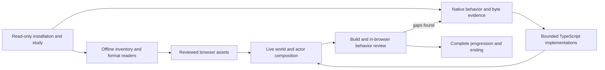
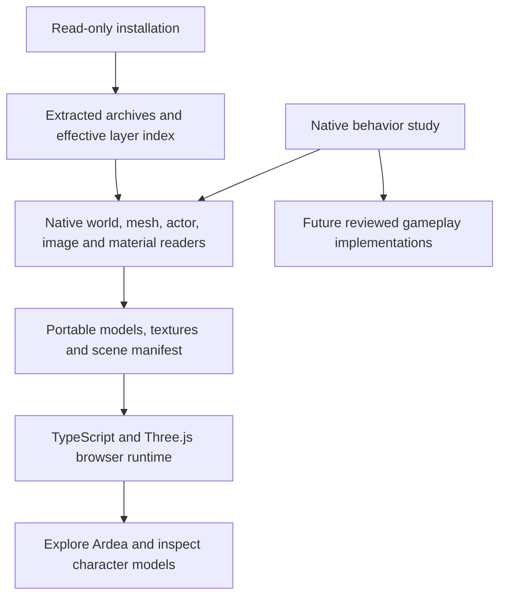

# How Gothic 3 is being rebuilt for the browser

For a short, reader-facing explanation of the approach and completion standard,
start with the [rebuilding overview](gothic3-rebuild-overview.md). This document
is the detailed technical record and dated checkpoint history.

Updated: 7 October 2026. Historical deployed baseline preceding checkpoint 72:
`main` commit `610619f43a809e14118ee8edb186fed67aa2052b`. Checkpoints 55–71 add
browser NPC Plunder inventory in checkpoint 55, resolves NPC armor class in
checkpoint 56, materializes deterministic Weaponry stacks with unapplied
equip plans in checkpoint 57, reads tracked pose fields from selected native
motions in checkpoint 58, adds a source-checked animated Diego actor in
checkpoint 59, and adds a bounded browser-hosted fist damage profile for one
Ardea Orc record in checkpoint 60. Checkpoint 61 connects source-backed Hero
and Ardea NPC inventories to a bounded gold `Give` path. Checkpoint 62 connects
condition-7 status preservation and a narrowly supported condition-8 delivery
callback for running quest types 1/4; the Ardea pickpocket quest still has no
connected start action. Checkpoint 63 traces the native PickPocket command,
and checkpoint 64 adds TypeScript helpers for its level/perk/roll gate and
distribution-7 loot generator. Checkpoint 65 reads, saves and restores the
actor's `Dialog.PickedPocket` flag. Checkpoint 66 connects a browser PickPocket
action to the source gate, successful loot transfer and saved actor flag.
Checkpoint 67 applies the damage profile to all 15 exact starting Ardea
Raiders, persists NPC HP and hides defeated visuals across save restore.
Checkpoint 68 introduced exact-name kill-objective counters. Checkpoint 69
connects Jack's condition-5 report and condition-6 bandit-quest start to saved
browser dialogue state. Checkpoint 70 corrects the native callback evidence,
adds Jack's three original bandits and connects their bounded quest success
and return rewards. Raider zero HP now leaves the kill-versus-defeat decision
unresolved and does not dispatch kill credit. The TypeScript reconstruction has an
Ardea exploration scene, a moving Hero, three streamed regions, and
source-backed foundations for selected dialogue, quests, player progression
and browser saves. Diego now uses his original skinned body and head with
mapped Hero clips; other NPCs remain static. Bounded browser fist hits update
saved Raider and bandit HP; source-directed lethal bandit hits can advance
Jack's quest. Checkpoint 72 schedules a recovered death-state prefix for those
bandits and connects its quest event and defeat XP, stopping at the remaining
enclave callback. Native NPC
activation, AI, responses, full death handling and most campaign progression remain
unavailable.

Checkpoints 73–81 add retained source NPC readers, shared runtime admins,
heap-backed field owners, physical SceneAdmin startup components and the
selected Engine CRT class-name decoder and an ordinary DLL attach prefix.
Checkpoint 79 preserves Navigation notifications and application/area ownership;
checkpoint 80 corrects the fresh CString text constructor and its owned byte
operations, and checkpoint 81 adds the separate Game CRT ownership and startup
prefix before the Game Navigation class-name/type integration. The new
admin, heap and SceneAdmin owners remain separate from the live NPC reader,
which still stops at its first property-factory dependency. The [overview](gothic3-rebuild-overview.md)
records the latest confirmed publication; the individual receipts below
distinguish locally validated components from published browser behavior.

The [Gothic 3 / Ardea route](https://ael-dev3.github.io/Tervain/gothic3/) serves
this incomplete build. The preceding baseline was deployed by [workflow run
37504891018](https://github.com/ael-dev3/Tervain/actions/runs/37504891018);
later publication receipts are available in the repository's
[Pages workflow](https://github.com/ael-dev3/Tervain/actions/workflows/pages.yml).
The [scope record](gothic3-browser-port.md) describes the current controls,
limitations and source terms.

This guide records the preceding hosted baseline and subsequent dated
checkpoints that preserve the evidence for each stage. Sections 10–81 cover
the later runtime work; each receipt identifies its source revision and scope.

Each checkpoint's reproduction commands describe its recorded source revision.
To reproduce an older receipt, use a checkout at that commit and its producers.
Running an older producer against today's extended shared source does not
reproduce the historical source hashes.

## Process at a glance

1. Inventory the local installation, preserve its bytes and identify the archive
   layer that supplies each resource.
2. Decode original world records, meshes, actors, textures, materials, motions,
   quests, dialogue and property sets into documented portable formats.
3. Recover one native behavior at a time from the installed binaries. Follow
   forwarding exports, imports and virtual dispatch, and compare the examined
   instructions with original program bytes.
4. Implement that behavior in TypeScript with its original state, callback
   order and object lifetimes. Record unresolved engine calls where they occur.
5. Connect those implementations to one live world: entity loading and context
   activation, the Hero's property sets, the existing script processor, clock,
   input, animation, collision, rendering and gameplay services.
6. Review coherent changes locally, preserve the source and resource hashes,
   then publish through the repository's deployment workflow when it can run.
7. Establish completion by playing the original progression through its endings,
   including quests, factions, combat, travel and saving/loading.

The current scene covers part of step 2 and the rendering side of step 5.
Source-backed quest state, selected Ardea dialogue, game events, ended actor
flags and bounded Hero XP/level/LP progression now connect to browser sessions
and saves. The Ardea scene also seeds three residents from unambiguous native
`Start` routine points; it does not execute routines or activate native NPC
entities. A collision candidate can resolve and save source-bound NPC point
state, including serialized inventory-slot templates. Its Plunder runtime now
follows recovered distribution-0 draws and creates browser NPC inventory stacks
from exact source templates. The inventory and browser-owned random state are
saved and restored. This first-contact path does not reproduce native cache-in
timing or the original process-wide random sequence; it creates no physical
ItemWorld entities. The deterministic distribution-3 Weaponry recipe now
creates source-resolved NPC inventory stacks with the native quality bit and
configured minimum amount. The runtime retains an `EquipStack` plan, but it is
not applied to an actor or skeleton. The UseType 2 split-stack case is still
explicitly unresolved. Original actor activation and combat callbacks remain
unconnected. The browser also applies the audited Hero Fist damage calculation
to 15 exact starting Raider profiles and three coastal bandit profiles, and
saves their resulting HP. Each profile
uses browser contact detection and a standing target state; it does not
construct the native actor, run attack eligibility or execute native combat
callbacks or NPC responses. Its bandit death integration now schedules the
recovered state and runs the evidenced Kill prefix through the quest event and
defeat XP; enclave notification, ragdoll and loot remain unavailable.
The captured Hero PlayerMemory and Attribute/Stat data also feed an on-demand
character panel. These are bounded integrations: most dialogue, live NPC
activation, combat, schedule changes, world interactions and campaign
transitions are still missing. A successful TypeScript build does not establish
that the whole game loop works or that the completion step is possible.

In practical terms, rebuilding proceeds as a sequence of playable slices. First
choose one in-game outcome, such as a resident responding to the Hero. Trace
every required resource and native state transition, verify those inputs against
their recorded hashes, and implement only the evidenced behavior in TypeScript.
Then connect it to the same live entity, world and save state used by ordinary
play. Review the exact interaction in the browser and record what succeeded and
what remains unavailable. A converter, formula or isolated dialogue handler is
evidence for its own step; the slice counts as integrated only when the player
can trigger its outcome and continue after save/restore. Expand from that slice
to the campaign only after its links work together.

## What “rebuilding” means here

This is a new browser implementation guided by the installed game. It does not
turn Gothic 3's Windows executable into a web game, and the decompiled C-like
listings are not buildable original source. The work follows two connected
tracks: recover data such as meshes and world records, and study native code to
recreate selected behavior in TypeScript. Both tracks must meet in the running
game before an isolated reader or asset counts as a player-facing feature.



For each feature, the practical loop is: identify the winning source resource or
native operation; record its provenance and known limits; decode or implement
it without guessing at missing behavior; connect it to the existing world,
actor and frame lifecycle; then review the result and keep a reproducible
checkpoint. Unsupported engine calls remain explicit until there is evidence
and a working replacement. Converting a model proves only that model's data
path; loading a native property reader proves only that bounded code path. The
end-to-end criterion is to play through Gothic 3's progression, with working
NPC behavior, combat, dialogue, quests, world travel and save/load through its
available endings.

Section 21 records the checkpoint with 18 of the Hero's 19 property-set
factories. Section 22 adds bounded Attribute/Stat and PlayerMemory factories,
bringing the source count to 19 of 19. They remain detached from the enclosing
live entity/world pipeline; this count does not measure how much of the original
game is playable. Section 23 adds a browser-side third-person presentation;
that visual actor still does not use the recovered native entity pipeline.

## 1. Preserve and study the installed game

The installed game is the source of the selected geometry, texture pixels,
entity placements and character appearances. The original installation and the
completed local study are read-only inputs. Installed Gothic 3 executables and
DLLs are not run by the browser or the asset-preparation pipeline. Rimy3D is a
separate converter run offline during preparation.

The earlier local study inventoried and hashed the installation, extracted
38 archives containing 107,370 file records, and recorded which archive layer
is the selected static candidate for each logical resource. That broad index
does not establish every runtime zero-byte/deletion-entry behavior. The later
InfoManager study in section 10 verifies the specific compiled-info deletion
and fallback path. Those complete archive contents and native
binaries are kept outside this repository. The published derivatives cover the
rendered Ardea scene and the indexed animation, gameplay and world foundations
described below.

The preparation tool reads this study layout:

```text
<LOCAL_GOTHIC3_STUDY>/
  00_Original_Runtime/               native binaries used for offline byte evidence
  01_Decompiled_Code/                reconstructed native behavior references
  02_Unpacked_Data/
    Archives/                         physically extracted archive contents
    _metadata/effective_layers.json  logical names, selected layers and hashes
```

Archive extraction and resource decoding are different operations. Extracting
a file exposes its original resource bytes; a mesh, image or world record still
needs its own format reader. A successful archive extraction does not recover
original engine source code.

## 2. Recover behavior references from the native programs

The completed local decompilation study covers 36 runtime, script and updater
modules. It contains 224,676 native C-like functions, one exact assembly
forwarding entry and a managed IL/C# supplement. These are reconstructed
representations of compiled programs, with inferred types and control flow.
They are not the original C++ project and cannot simply be compiled into a
browser game.

The rebuilding method is to inspect a bounded native behavior, identify its
inputs and state changes, then deliberately implement its counterpart in
TypeScript. Native addresses, original file hashes and resource records provide
the evidence. A replacement needs comparison with original behavior before it
can be described as equivalent.

For example, native `eCColorSrcSampler::SetSwitch` establishes the zero-based
material switch behavior used by the texture converter. Native
`eCShaderBase::ExecuteZPass` and `SetShaderRenderStates` establish masked alpha
reference normalization. Those findings guide small implementations; the
native engine itself has not been translated.

The Ardea quest research in
[content-provenance.json](../../assets/gothic3/content-provenance.json) records
original quest predicates, dialogue commands and behavior references.
[content.ts](../../src/gothic3/content.ts) presents a reviewed summary. All six
listed quests currently have `implemented: false`: reading their source does
not implement their state machine, rewards or dialogue effects.

## 3. Decode the native resources and select an Ardea slice



| Native resource | What is recovered | Implementation |
| --- | --- | --- |
| `.node`, `.lrentdat` | Entity GUIDs, world matrices, visual resources and body/head slots | [read_genome.py](../../tools/gothic3/read_genome.py) |
| `.xcmsh` | Positions, normals, triangle indices, UVs and material sections | [read_xcmsh.py](../../tools/gothic3/read_xcmsh.py) |
| `.xact` / embedded FXA actor payloads | Static NPC body/head geometry; native Hero skeleton, skin and cleaned hierarchy | [prepare_ardea.py](../../tools/gothic3/prepare_ardea.py), [read_xact_skin.py](../../tools/gothic3/read_xact_skin.py) |
| `.xmot` / embedded LMA motion payloads | Original poses, timed position/rotation/scale tracks and motion phases | [export_animated.py](../../tools/gothic3/export_animated.py) |
| `.ximg` | Native DXT1/3/5 texture pixels and mip layout | [prepare_ardea.py](../../tools/gothic3/prepare_ardea.py), using Pillow |
| `.xshmat` | Diffuse sampler names, switch modes, blend mode and mask reference | [read_xshmat.py](../../tools/gothic3/read_xshmat.py) |
| Original `.quest`, `.info`, string table and gameplay properties | Full catalogs, original operands, localization and source state | [export_gameplay.py](../../tools/gothic3/export_gameplay.py) |
| `.wrldatasc`, `.secdat` and geometry contexts | World/sector membership, source enabled flags and terrain inventory | [export_world_index.py](../../tools/gothic3/export_world_index.py) |

The tool resolves resources through the effective layer index. It verifies an
input's SHA-256 before using it and refuses ambiguous file lookup. This avoids
silently taking an older base-archive version when a patch supplies the winning
resource.

The material reader distinguishes indexed `GENOMFLE` table strings from older
inline length-prefixed strings. A zero-length inline value is valid; it must not
make the containing shader disappear. Recognized shader/sampler parsing errors
stop preparation instead of silently dropping their metadata.

Rimy3D replaces spaces and tabs in exported material names with underscores.
Material lookup applies that same recorded name transformation with a uniqueness
check, preserving the actual native resource reference. It does not use fuzzy
name matching.

### World and characters

- Static families use the recorded entities in
  `G3_World_Lowpoly_01_Levelmesh_01_Spat.node`. Full-detail family resources are
  selected when present, at their corresponding recorded family transforms.
  Each entry records both `sourceResource` and `selectedResource`.
- City and outdoor props come from the effective Ardea dynamic-object `.node`
  layers. Six original Myrtana landscape LOD cells provide the terrain.
- The two Ardea NPC `.lrentdat` layers supply original body/head slots and
  material switches. Nearby named characters and the Hero's arrival position
  come from the effective `SysDyn` layer. Duplicate GUIDs are excluded.
- Diego, Milten, Gorn, Lester, Jack and Hamlar retain their recorded positions.
  Both NPC layers are included as source exhibits; original quest-controlled
  activation and NPC routines have not been reproduced.
- The Nameless Hero is a separate model-inspection exhibit. It is not an
  invented extra NPC placed at the scene origin.

### Coordinates and mesh conversion

The native world uses centimetres and Y-up coordinates. The browser uses metres
and a reflected Z axis. With native origin `[92000, 5200, -12000]`, conversion is:

```text
browser position = [(X - 92000) / 100,
                    (Y - 5200) / 100,
                   -(Z + 12000) / 100]
```

Normals are reflected and triangle winding is reversed. Entity matrices are
reflected on both sides before their position, quaternion and scale are
decomposed. Landscape vertices already contain world coordinates, so the origin
is applied to those vertices once; it is not applied again to their placement.

The native `PC_Hero` arrival position is
`[87984.9375, 5145.56396484375, -10197.4775390625]` centimetres. The browser feet
position is `[-40.150625, -0.544360, -18.025225]` metres. The exploration camera
adds its new 1.65-metre eye height. The chosen view toward Ardea is a browser
camera decision, not a recovered native camera controller.

### Texture and material conversion

Native XIMG mip levels are stored from smallest to largest. The full-resolution
DXT level must be read at `imagePayloadEnd - fullMipBytes`. Reading from the
start of the payload mixes mip levels and corrupts spatial detail. The converter
checks the payload layout and records dimensions, mip count, byte range and
source offset in `textureSelections`.

Opaque decoded pixels become JPEG at quality 92 without resizing. Textures
with alpha become PNG. A dark source albedo is preserved; an unproven gamma
correction is not baked into the exported pixels.

Native sampler switches select contiguous `S1..Sn` variants. Repeat wraps by
texture count, Clamp stays at an endpoint, and PingPong reflects over
`count - 1`. The selected sampler, variant, available range and original mode
are recorded in `materialSelections`.

Each model retains native Normal, Masked or AlphaBlend mode and the original
`MaskReference` byte. Alpha in a DXT image does not make an opaque stone or wood
material transparent. Masked surfaces use the native byte/255 reference, with
a small browser comparison epsilon to account for Three.js's discard boundary.
For the first Ardea OBJ export, full shader graphs, terrain layer blends, normal/specular maps and native
lighting remain unimplemented. The preview currently selects one diffuse
sampler for each material and records the unsupported blends.

## 4. Build a new TypeScript runtime

The separate entry is [gothic3/index.html](../../gothic3/index.html). Its browser
code is under [src/gothic3](../../src/gothic3):

| File | Responsibility |
| --- | --- |
| `types.ts` | Portable scene, character and material data shapes |
| `assets.ts` | Model caching, OBJ/MTL loading, texture completion and native alpha modes |
| `controls.ts` | New first-person movement, independent controller position, raycast ground support, wall sliding and flight |
| `main.ts` | Scene assembly, character inspector, map, journal, camera saves and UI |
| `combat.ts`, `browser-melee.ts`, `npc-combat-runtime.ts` | Audited combat arithmetic plus the narrow browser-hosted Ardea Raider damage profile and saved NPC HP; native actor lifecycle and responses remain open |
| `content.ts` | Recovered character and quest reference summaries |
| `animation.ts`, `skinning.ts` | Hero clip playback and all native bone influences |
| `native-motion.ts` | Source quaternion packing/interpolation, pose fallback and normalization |
| `catalog.ts`, `catalog-view.ts` | Verified original quest/dialogue records and language selection |
| `quest-state.ts` | Native status transition kernel with explicit host effects; not enabled for play |
| `resource.ts` | Hash-checked, bounded decompression of lazy native-data chunks |
| `native-data.ts`, `scene-routine-position.ts` | Read indexed source entities, resolve unambiguous routine-point references and seed Ardea character transforms; no NPC scheduler or activation |
| `style.css` | The separate page's interface |

This code uses Three.js to display the prepared resources. It does not load
native DLLs, execute decompiled functions or import Tervain's simulation.
Ground support and movement are new approximations. NPC models remain static
bind-pose previews. The Hero inspector uses original skin weights and selected
motion tracks; equipment attachments, combat and NPC animation selection still
need corresponding native behavior. Preview lighting and brightness are browser
choices.

The generated [scene manifest](../../public/gothic3/scene.json) connects models
to placements and appearances. The
[source manifest](../../public/gothic3/source-manifest.json) records input and
output hashes, source layers, conversion details and omissions. Personal local
filesystem prefixes are omitted from the hosted records.

## 5. Reproduce, review and publish

Asset preparation requires the existing extracted study, Python 3.10+ with Pillow,
and Rimy3D. It writes the generated asset folder and an explicitly supplied
scratch folder outside the read-only study:

```powershell
python tools/gothic3/prepare_ardea.py --study "C:\path\to\Gothic3_Decompiled_Study_2026-10-04" --rimy "C:\path\to\Rimy3D.exe" --scratch "C:\outside-the-study\ardea-preparation"
```

See the [preparation README](../../tools/gothic3/README.md) for prerequisites,
format references and license separation. The installation/study generation
itself is an earlier local operation, not a step provided by this repository's
Ardea converter.

Use Node 24, matching the Pages workflow, to build the three browser entries with
the repository's pinned dependencies:

```powershell
npm ci
npm run typecheck
npm run build
```

`npm run dev` serves `/gothic3/` locally. Review the actual rendered scene and
models as well as the source diff. Check every generated output hash, asset
reference and source record; record unsupported behavior instead of treating
successful conversion as game equivalence. The current snapshot contains
202 world instances, 67 NPC records, 130 models and 139 textures.

Vite builds Tervain, `/gothic3/` and `/gothic3-local/` into one `dist`
artifact. Publication uses the existing Pages workflow. Before a coherent main
push, inspect repository-wide runs, attempts and workflow trigger chains; reuse
applicable results and avoid duplicate runs. The workflow retains its required
typecheck, scenario suite and build, followed by deployment. Confirm the served
Ardea route, the local-install viewer introduction and the original Tervain
version after the deployment succeeds.

The 4 October foundation checkpoint passed local typecheck, production build,
documentation link checks and generated-byte verification. All 11,843 gameplay
output receipts matched; 9,301 gzip files also matched their decoded receipts.
The largest decoded chunk was 2,749,307 bytes. Native Hero walking and paused
fist deformation rendered in the browser without console warnings, and catalog
search/language selection showed the original records. This evidence does not
include a native-game comparison run or a browser playthrough.

## 6. What still has to be rebuilt

A complete game requires implementations and original-behavior comparisons for:

1. Additional actor rigs, attachments, expression motion and native animation selection/blending.
2. Player combat, targeting, damage, hit reactions and death/revival rules.
3. NPC AI, routines, factions, hostility and original activation conditions.
4. Dialogue predicates and commands, inventory, trading, skills and quest state.
5. Remaining material cases, native vegetation, lighting, audio and world-object streaming.
6. Broad world content and save compatibility or an explicitly new save format.

Those systems are not implied by a model rendering correctly. Each future
milestone should name its native evidence, supported behavior, unsupported
cases and comparison results. Whole-game completion needs corresponding content
and behavior, rather than a larger collection of static models.

Gothic 3's assets remain third-party material with no asserted open-content
license. The offline preparation scripts retain their GPL-3.0-only license;
that license does not license the game's assets. The separate browser runtime
does not bundle those scripts. See [NOTICE](../../assets/gothic3/NOTICE.md).

## 7. Native foundations added after the first scene

### Hero skin and motion

The separate [animation manifest](../../public/gothic3/animated/manifest.json)
records 16 verified native inputs, 73 shared cleaned joints, 6,630 split vertices,
10,692 triangles and 11 original clips. Body and head retain their separate
inverse binds. The export reproduces the native helper-node cleanup, confirmed
at Engine.dll `eCWrapper_emfx2Actor::CleanUpHierachy` (`0x3002f955`) and its actor
load call sites. The raw hierarchy and every original motion key remain in
`hero-native.json`.

Some body vertices have 17 influences. The browser restores the original first
weight set, which GLTFLoader otherwise normalizes in isolation, and uses all five
body sets or two head sets in both GPU deformation and CPU bounds/raycasts.
Keeping only four weights would alter the original deformation. Independent
native-byte and static-converter checks are recorded in `animated/audit.json`.

Walking, running, idle and individual fist attack phases can be selected in the
model inspector. This is clip inspection: it does not execute combat. Native
rotation tracks are packed into signed shorts, decoded with the original
constant, interpolated by shortest-sign component lerp and normalized after
motion-layer evaluation. The browser's `native-motion.ts` reads the verified
raw keys and follows that path for one full-weight clip, rather than using
glTF's spherical interpolation. The portable GLB still has standard glTF
semantics for other viewers. Original multi-layer blending, motion effects and
repositioning remain unimplemented; JS float storage is not an x87 emulator.
Native normals/UVs and diffuse images are retained; the browser PBR response
still differs from the complete native material graph.

```powershell
python tools/gothic3/export_animated.py --study "C:\path\to\Gothic3_Decompiled_Study_2026-10-04"
python tools/gothic3/audit_animated.py --study "C:\path\to\Gothic3_Decompiled_Study_2026-10-04"
python tools/gothic3/research_native_motion.py --study "C:\path\to\Gothic3_Decompiled_Study_2026-10-04"
```

### Quest, dialogue and player state

The [gameplay manifest](../../public/gothic3/gameplay/manifest.json) covers 641
quests, 4,381 info records and 35,114 localization keys in five original languages.
Parallel command arrays retain their original positional cells and exact
operands. Compact runtime records omit duplicate raw text/byte representations;
the detailed extraction remains available locally. Browser catalog downloads
are checked against the manifest's output lengths and SHA-256 hashes.

The original Script_Game.dll startup table contains 54 info command entries.
Its lookup is case insensitive. The source `SuccessQuest` spelling is preserved
as unrecognized, rather than silently changed to `SucceedQuest`. `Description`
is handled by the separate Game.dll info layer. Reading a dialogue line does
not establish its availability or execute its actions.

The TypeScript quest kernel reproduces reviewed manager/status gates and calls
explicit host effects for rewards, arena state and the Ardea tutorial. It needs
actual initialized state and implemented host services before ordinary play can
use it. `CloseQuest` means Open → Obsolete or Running → Cancelled, not Success.
Prerequisites are unfinished while Open, Running or Lost in this native build.
ExperiencePoints is a script input, not necessarily final XP: the native quest
reward callback passes WorldEntity/Player roles, and the XP script applies
additional rules, including a multiplier on that path.

Serialized `PC_Hero` data contains pre-initialization placeholders. The native
`OnGameStartUp` callback sets health to 200, sets other attributes, initializes
inventory and starts `Xardas_FindXardas`. Those callback effects must be recovered
and executed; displaying serialized defaults as a completed new-game state
would be incorrect. The browser currently grants no quest rewards and retains
camera-only saves.

The recovered [initialized player seed](../../public/gothic3/gameplay/initial/initialized-player.json)
combines the serialized Hero with verified startup setters and 121 ordered
inventory assurances. It records 200 health, 100 mana, 100 stamina, the original
attribute values, template GUIDs and quick-slot operands. Five assurances
explicitly mark items learned. The other learned states remain unresolved where
creation notifications or template defaults still matter. The separate
[world clock record](../../public/gothic3/gameplay/initial/world-clock.json)
preserves Year 0, Day 0, noon and Factor 12, with the native read/notification
path attached. These are preparation records; the exploration controller does
not yet consume them as an active character simulation.

Enum numeric values are preserved from native files. Community enum labels are
advisory: this installed build uses older action numbering. For example, local
Game.dll initializes Action 24 as `StumbleR` at `0x20522a10`; dispatch must use
the verified mapping for this build.

### Bounded gameplay data

World entities and template properties are prepared independently from visual
models. The current index contains 230,337 entity records, including 49,586 with
selected gameplay properties, and 17,634 template headers. Decoding succeeds for
2,519 of 2,529 world sources and 6,081 of 6,082 template sources. The remaining
failures are recorded in the audit; they are not silently treated as empty data.

The ten world failures are seven version-only dynamic-layer stubs, one zero-byte
node and two unfinished dynamic layers. The template failure is an older tree
header format. Unknown property data remains in quest/info managers, inventory,
movement, items and other systems; the
[property audit](../../assets/gothic3/gameplay/runtime-property-audit.json)
records exact counts and classes. These gaps affect faithful state and save
integration even though the quest catalog can already be read.

Large property sets and their lookup indices use lazy gzip chunks. Each chunk
decodes to at most 4 MiB and carries compressed and decoded length/hash receipts.
World entity chunks contain at most 256 entities. The browser resource reader
checks the transport bytes, bounds decompression, then checks the decoded bytes
before parsing JSON. Exporting this data does not execute its native callbacks
or resolve every property type.

```powershell
python tools/gothic3/export_gameplay.py --study "C:\path\to\Gothic3_Decompiled_Study_2026-10-04" --raw-output "C:\outside-the-repository\gothic3-gameplay-raw"
python tools/gothic3/assemble_initial_player.py --study "C:\path\to\Gothic3_Decompiled_Study_2026-10-04" --raw "C:\outside-the-repository\gothic3-gameplay-raw"
python tools/gothic3/repack_gameplay.py --refresh-receipts-only
```

The detailed raw audits occupy several gigabytes outside the repository. The
initial-state assembly runs after the full export, then the last command refreshes
the final output receipts.

### Full-world indexing

The [world source manifest](../../public/gothic3/world/source-manifest.json)
records world registries → sector memberships → native world files. This is the
input to future streaming; an Ardea radius list cannot represent the full world.
The index includes 2,421 nodes, 108 dynamic world layers and 782 native landscape
Cell meshes across Myrtana, Nordmar and Varant. Source enabled flags, unresolved
references and bounds are retained explicitly. Bounds use absolute reflected
metres; a renderer must subtract its chosen floating origin once.

Indexing the resources does not render or activate them. The first index
checkpoint retained six Ardea landscape LOD cells. The terrain work below adds
conversion, exact source membership and rendering for all 782 landscape cells;
missing registries, native activation and collision/navigation remain separate.

The native defaults distinguish the `G3_Startup` menu world from gameplay world
`G3_World_01`. The gameplay registry contains 169 enabled references absent from
all extracted project layers, including old Ardea levelmesh/NPC names. Native
sector import appends `.sec`, performs an exact lookup and warns/skips missing
resources. The index retains those missing references; it does not infer
replacement sectors from similarly named files.

```powershell
python tools/gothic3/export_world_index.py --study "C:\path\to\Gothic3_Decompiled_Study_2026-10-04"
```

Completion must be evaluated against the original starting state, story gates,
quests, combat, region transitions and ending paths. A visible model, a complete
catalog, a successful build or a successful deployment alone cannot establish
that the original game is finishable.

## 8. Terrain streaming and reviewed gameplay kernels

### Convert the complete landscape-cell inventory

[export_terrain.py](../../tools/gothic3/export_terrain.py) consumes the existing
world index and verifies each selected native input against the immutable study.
It binds each Cell to its exact native GUID/entity, node, spatial context and
sector registration. It exports 303 Myrtana, 119 Nordmar and 360 Varant cells:
2,082,155 triangles, 1,931,561 vertices and 2,549 material sections.

The GLBs retain every section's indices, normals, tangent vectors, UV0–3 where
present, and the original unsigned BGRA diffuse/specular streams. Vertices are
centered in local float32 metres; the GLB node restores its absolute center.
The browser subtracts `[920,52,120]` once to share the existing Ardea display
origin. Maximum measured position rounding is 0.00001465 metres.

The separate [terrain manifest](../../public/gothic3/terrain/manifest.json)
links 65 native material graphs and 89 XIMG dependencies. The largest original
decoded mip becomes a lossless PNG, with no resizing, gamma transform or lossy
encoding. Identical pixels deduplicate to 88 PNG files. Geometry is 129,558,488
bytes and PNGs are 114,014,271 bytes. Original lower mips, lightmaps and collision
companions retain source receipts but are not converted/applied yet.

```powershell
python -B tools/gothic3/export_terrain.py --study "C:\path\to\Gothic3_Decompiled_Study_2026-10-04" --game "C:\path\to\Gothic 3"
python -B tools/gothic3/audit_terrain.py --study "C:\path\to\Gothic3_Decompiled_Study_2026-10-04"
```

The actual [conversion audit](../../assets/gothic3/terrain/conversion-audit.json)
compares all 782 meshes with their source streams/indices and all 89 image
dependencies with original decoded RGBA pixels. It checks source/output hashes;
it does not run the native game or establish visual equivalence.

### Compile graphs and stream resident geometry

[terrain-materials.ts](../../src/gothic3/terrain-materials.ts) compiles recovered
sampler, constant, vertex-color, combiner and blend nodes. Coordinate nodes
include Scale and native BumpOffset. A valid UV proxy follows its referenced
node; a missing-instance proxy selects its own UV stream. An outer sampler's
selector must not override a linked Scale node's original UV input.

Vertex blend weights use original alpha. With reflected geometry, the bitangent
is `cross(N,T) * (2*red-1)`, where red is original BGRA byte 2 divided by 255.
Native normal-map X/Y come from alpha/green, with reconstructed Z. BumpOffset
uses `(height-.5)*[offset,-offset]*tangentEye.xy`, without an eye-Z division or
renormalizing interpolated tangent/binormal. Native shader-source receipts and
instruction references accompany the exported graphs.

One connected sampler has an empty native image path. Nine original primitives
request UV1 while providing only UV0. Their unresolved materials are explicitly
marked in magenta and listed in Help; their geometry is retained. The renderer
does not substitute UV0 or an unrelated texture. Native global lighting,
specular lookup, lightmaps, mip chains and sampler gamma state remain fidelity
gaps; the surrounding Three.js lighting is an adjustable preview.

[terrain.ts](../../src/gothic3/terrain.ts) selects nearby enabled, registered
cells by absolute horizontal bounds. It uses two concurrent cell loads, a
48-cell resident target, distance hysteresis and a texture-memory estimate.
Geometry, textures and graphs are receipt-verified before use. Shared material
and texture leases release GPU resources when cells unload. An acquisition
rechecks cache identity after awaiting, so eviction cannot return a disposed
texture/material. Failed reads can be retried.

The six legacy Ardea terrain objects are hidden after native support cells are
ready. Collision-index refreshes preserve the camera state. Walking pauses at
unloaded terrain; static render-mesh raycasts remain a browser approximation,
not native PhysX. Landscape preview destinations read exact stored Hamlar,
Xardas and Vatras records, providing views near Ardea, Xardas's tower and Lago.
They do not execute NPC routines or quest travel. World buildings, vegetation,
caves and actors still need corresponding streaming.

For `.json.gz` served as raw gzip files, `resource.ts` verifies both compressed
and decoded receipts. If HTTP `Content-Encoding: gzip` makes Fetch transparently
decode first, it verifies the bounded decoded receipt; original wire bytes are
unavailable through Fetch on that route. The source JSON is never used without
its exact decoded hash. `native-data.ts` shares verified lazy reads with a
decoded-byte cache budget, exact source/GUID lookup and explicit ambiguity.

### Recover the real quest seed and bounded behavior

[initial-quests.json](../../public/gothic3/dialogue/initial-quests.json) contains
637 exact compiled QuestManager runtime packets and four native factory/INI
records, covering all 641 definitions. All statuses/counters/activation times
are zero before startup; the original `KapDun_Hunter_Fur` journal pair is
retained. The reader consumes every packet byte and retains source offsets,
versions and hashes. It does not apply startup's `RunQuest Xardas_FindXardas`.

[initial-state.ts](../../src/gothic3/initial-state.ts) validates and combines
those quest records with the recovered player/clock seed. Its default host
rejects gameplay effects. The browser's read-only character-state panel shows
HP/MP/SP, serialized Level/XP/LP, 121 inventory assurances, equipment references,
the original clock and pending callbacks. It does not tick time or grant items.

[dialogue.ts](../../src/gothic3/dialogue.ts) provides tri-state availability and
guarded command plans. Unknown host predicates remain unknown. Unsupported
commands/callbacks prevent script start; an accepted start marks Given before
asynchronous commands finish. The native Given exclusions are conditions
9/51/52, InfoType 0/4, Permanent and player ownership. Fresh omitted Permanent
defaults to false, while serialized InfoManager overrides remain separate.
Distance checks scale NPC-target distance by 0.25. Fresh INI defaults alone do
not establish restored Given state. Section 10 adds the separate, verified
ordinary-world-read Given seed; native save restoration remains unsupported.

[combat.ts](../../src/gothic3/combat.ts) provides bounded Hero fist/single-hand
Impact/Blade calculations, guards, death eligibility, native skill activation
and ordered effect plans. Missing contact, participant state, attitudes or
skills return unsupported. Native fists use their hit-phase marker; sword
contacts require the native touch/contact path. The module is not connected to
ordinary exploration. Its receipt matches 152 native entries, 12,465 listed
instruction records, 43,699 original PE bytes and all 138 action labels.

The native XP callback adds level/LP effects with the verified formula and a
single level increment per call. Info GiveXP passes None/player roles and gets
the fivefold source branch. These kernels require actual inventory, contacts,
AI, dialogue lifecycle and startup services before they can support gameplay.

```powershell
python -B tools/gothic3/read_initial_quests.py --study "C:\path\to\Gothic3_Decompiled_Study_2026-10-04"
python -B tools/gothic3/read_dialogue_native_evidence.py --study "C:\path\to\Gothic3_Decompiled_Study_2026-10-04"
python -B tools/gothic3/read_info_defaults_evidence.py --study "C:\path\to\Gothic3_Decompiled_Study_2026-10-04"
python -B tools/gothic3/freeze_dialogue_receipts.py
python -B tools/gothic3/research_native_combat.py --study-root "C:\path\to\Gothic3_Decompiled_Study_2026-10-04"
```

The dialogue proof matches 10,819 listed native instruction records; the fresh
info-default proof matches 2,749. These are offline byte/control-flow audits,
not native execution, exhaustive program verification or a game playthrough.

## 9. A separate viewer that reads the visitor's installation

[Claude's local-install viewer](gothic3-local.md), integrated from
[PR #21](https://github.com/ael-dev3/Tervain/pull/21), provides another way to
study Ardea at `/gothic3-local/`. The visitor selects their installed Gothic 3
folder. Original TypeScript readers decode archives, meshes, images, material
graphs, world cells and vegetation inside the tab; this route hosts no game
data and uploads none. Its development-only archive server requires a local
`G3_DATA` path and accepts loopback requests only.

This viewer has its own rendering assumptions. Tree crowns are generated
approximations, daylight is authored, and native lighting equivalence is
unverified. It loads its starting cells once and has no characters, dialogue
execution, combat or quest progression. Its author-reported parser and frame
measurements are recorded in its guide with their one-machine limits.

The `/gothic3/` reconstruction continues to use the audited preparation tools
and hosted derivatives described above. The two entries remain separate; a
working landscape renderer is only one component of rebuilding a finishable
game. The remaining runtime milestones in section 6 still require startup,
inventory, AI, contacts, dialogue, quests and saves to work together.

## 10. Rebuild initialization before enabling gameplay

This checkpoint adds source-backed inventory, InfoManager, startup and enclave
planners. The scene inspector uses the new read-only facts. A complete native
session and NPC simulation are still pending; these modules do not make the
browser game finishable.

### Select the real InfoManager provider

The latest `Projects_compiled.p01` entry for
`compiledinfos_G3_World_01.bin` is empty and has the deletion attribute
`0x8000`. Original VFS instructions show that it suppresses the same name in
lower archive layers. Choosing the most recent **nonempty** file would
therefore select an obsolete catalog.

The ordinary InfoManager read tries the compiled table where appropriate and
falls back to INIs when that lookup fails and entity patching is enabled.
The source `GetInfoDir` prefix selects exactly 4,381 current-world INI records.
The former `.pak` and `.p00` tables have 4,260 and 4,265 records respectively;
they are preserved as separate historical providers, never merged into the
current table.

All 4,381 current INIs explicitly set `InfoGiven=false`. Stored `Permanent`
is true for 197, explicitly false for 4,076 and absent for 108. The missing
properties retain the native fresh-factory false default. Stored Permanent
alone does not determine derived dialogue permanence or availability.

The selected world InfoManager is class version 4 with no runtime tail. Its
ordinary `Read` skips the older runtime-overlay branch. `ReadSaveGame` is a
different route; its Given packets must be restored separately. Permanent is
not a field of those packets.

[info-state.ts](../../src/gothic3/info-state.ts) loads independently hash-pinned
providers and guards Given lookups/updates by the info's exact archive, path
and hash. An unsupported restore invalidates those facts instead of resetting
them to convenient defaults. `loadBrowserInfoState()` uses an explicit fresh
`G3_World_01` profile with patching enabled, the deleted compiled lookup and
no `noinfos` command-line skip. This is a browser initialization choice backed
by the specified source route; it is not a capture of a running native game.
The source document records its assumptions and unapplied callbacks.

### Recreate stacks through the original inventory operations

[inventory.ts](../../src/gothic3/inventory.ts) ports bounded `CreateItems`,
`AssureItems`, `AssureItemsEx`, quickslot, Learn and skill-activation behavior.
It retains native signed/unsigned arithmetic, template GUID identity and
ordered callback notifications. Assure sums exact-quality matching stacks and
creates only a shortfall. Its selected stack is the last matching unlinked
stack, or the first linked match when no unlinked match exists.

Original vtable/import/export bytes bind stack property Enter/Exit hooks to
SharedBase methods which return true without effects. `CreateItems` assigns a
template proxy; it does not spawn an ItemWorld or execute that template's Skill
or Spell handlers. From an empty serialized stack list, the 121 original
assurances leave 116 stacks intrinsically Learned=false and explicitly set
five true. The two serialized Head/Body equipment references preserve their
original item and template GUIDs.

External inventory listeners are a separate runtime boundary. An omitted or
unknown registry rejects mutations before they start. A caller must supply a
complete ordered registry; passing an empty registry explicitly asserts that
it is complete and empty. The inspector instead reads the intrinsic projection
through [inventory-source.ts](../../src/gothic3/inventory-source.ts), which
performs no creation, listener or equipment calls. It does not assert that a
native session has no listeners.

The supported `Give` foundation selects the first **any-quality** donor stack
and transfers that stack's actual quality. Only a player donor is clamped to
that first stack's amount. It never combines donor stacks or creates a gift
when the donor has none. Ordinary unlinked transfers retain source removal,
recipient creation and quest-notification ordering. Physical unlink/equip,
mission-item special branches and localized transfer messages still need
their host implementations. Equipment plans are decisions, not completed
physical/stat effects; starting weapon equipment has not been established.

### Preserve the original new-game callback order

[startup.ts](../../src/gothic3/startup.ts) loads a hash-verified recipe and
plans the installed build's new-game mode 0 callbacks. `OnInit` invokes twelve
helper resets in native order, including the 63-row action-transition table,
entity caches, flags and distance entries. `OnGameStartUp` then performs:

1. Script entity-cache reset and Hero Chapter=1.
2. The temple-door height repair and Yepas alignment repair.
3. Larson's `Start` navigation routine.
4. Ardea alignment=1, Raid=true and Revolution=true.
5. `NotifyEnclave(Hero, Ardea_Orkboss, 2)`.
6. `RunQuest Xardas_FindXardas`.
7. Gorn's `OnExit_Gorn` ROI callback assignment.
8. Eighteen player stat setters, attribute LP=0 and `InventoryPopulate(...,0)`.

The Gorn exit callback was absent from the original C/function index. Offline
PE disassembly recovered its complete 412-byte body and direct branch
boundaries. It does nothing when `Gorn_ShowReddock` is Open. Otherwise it calls
CloseQuest, selects `GothaPrison`, moves to the selected working point and
clears ExitROIScript. That conditional is preserved as compiled. Its spatial
ROI scheduling has not been rebuilt.

The source also requires session prerequisites and later work: clock resume,
engine warmup, menu return, intro/audio restoration and ongoing AI/ROI/contact
scheduling. The recovered 757-byte `OnReturnFromMenu` body refreshes NPC
HP/SP maxima while preserving percentages; it is retained as evidence, not
claimed as an executed browser lifecycle step.

The startup host prepares every effect against a detached draft, then commits
one revision-checked state change. Plans and receipts are frozen and single
use. Missing handlers reject the entire transaction without applying a prefix.
`gameplayReady` remains false even after a bounded callback plan succeeds.

### Port Ardea raid entry without inventing active NPCs

[enclave.ts](../../src/gothic3/enclave.ts) plans the source-proven event 2,
Status 0→1 raid-entry path. Its gate compares **Other** with Other's enclave:
at startup that is Ardea_Orkboss versus Ardea, not Hero versus Ardea.
Political-attitude result 1 identifies same-side defenders, and result 4
identifies their opponents. The full eight-by-eight switch table and
chapter-dependent entries are recorded from original PE data.

Membership comes from the enclave's cached proxies. An empty cache is built
from NavigationAdmin's registered navigation property sets whose NPC enclave
ID matches. Rendered NPCs are insufficient evidence for that live registry.
Processing range is a live navigation byte, not a browser distance guess.

AIModes 6, 9 and 8 exclude defenders from the eligible count but retain them
in the total count. The signed native threshold selects liberated Status 2
only when `eligible * 5 < total`; equality at 20% and zero/zero select Status 1.
The supported branch preserves party detachment, Status assignment, ordered
FullStop/ContinueRoutine calls and distance-ordered recruitment toward ten
active members per side. Recruitment uses GroundBias=None, AniState=2 and
StartGoto(Player, walk mode 3).

Party clears require proved postconditions, because a native true return alone
does not establish a changed Party proxy. The status return/read and subsequent
member/distance facts also require host postconditions. Native float32 squared
distances are required; tied distances need the original qsort permutation.
Unknown facts produce no plan effects. Liberation, its quest/mission-item/death
callback chain, other events and actual AI/task execution remain unsupported.

### Evidence and reproduction

These audits overlap some earlier functions; their counts must not be added
as a count of unique ported engine methods.

| Boundary | Evidence in this checkpoint | Implementation boundary |
| --- | --- | --- |
| Inventory | 136 entries, 2,772 instructions and 7,666 bytes matched to original PEs | Unknown observers, physical equipment and special transfer paths remain |
| Startup | 75 functions, 7,220 listed/decoded instructions and 154 checked evidence files | Complete session, navigation, tasks and ROI remain |
| Enclave | 23 bodies, 1,883 instructions and 6,822 bytes matched to original PEs; 256-byte political switch table | Raid-entry planner requires a complete native host |
| Info state | 2,348 instructions matched to original DLLs, plus 421 matched to the separately labeled unpacked executable derivative | Fresh-world provider selection; native save restoration remains |

The derivative executable's evidence is explicitly distinguished from original
PE evidence. None of these tools executes an installed Gothic 3 binary.

```powershell
python tools/gothic3/research_info_runtime.py --study <LOCAL_GOTHIC3_STUDY> --installation <LOCAL_GOTHIC3_INSTALLATION>
python tools/gothic3/freeze_info_state.py
python tools/gothic3/research_native_inventory.py --study <LOCAL_GOTHIC3_STUDY>
python tools/gothic3/research_native_startup.py --study <LOCAL_GOTHIC3_STUDY> --capstone-path <CAPSTONE_5_0_7_PACKAGE_DIRECTORY>
python tools/gothic3/research_native_enclave.py --study <LOCAL_GOTHIC3_STUDY>
python tools/gothic3/freeze_initialization_checkpoint.py
```

See each tool's arguments and the separate `assets/gothic3/{inventory,startup,
enclave,info-state}` receipts. The original broad gameplay receipt is preserved;
these findings have their own source/output receipts.

The final checkpoint tool checks frozen bytes and catalog source identities.
It records the files present; it does not run or certify a typecheck, build,
browser inspection or native playthrough. Those validations need their own
evidence for the source being reviewed.

The candidate's source was reviewed separately from live deployment. Historical
PR checks did not execute workflow steps. A source-only checkpoint can be
reviewed without treating it as a successful Pages release. The live
site remains at its last successfully deployed revision until required CI and
deployment are available again; no checks or triggers are bypassed.

## 11. Add the clock, navigation lifecycle and task controls

Checkpoint `864422d` added executable TypeScript components for the
session runtime. Their supported operations perform actual state changes;
their remaining host boundaries still prevent a complete new-game session.

- [world-clock.ts](../../src/gothic3/world-clock.ts) reconstructs the paused
  source clock, timestamp sentinel, unsigned millisecond wrap, float32 stores,
  truncating calendar conversion and ordered time notifications. Its exact
  promoted millisecond coefficient is `0.0010000000474974513`. Callers select
  24, 53 or 64 bit nearest-even arithmetic; the live native control word was
  not captured. The browser clock inspector selects the native FPUAdmin
  default of 24 bits explicitly. Quest timestamps read the last published
  Year/Day/Hour properties without advancing time.
- [navigation-runtime.ts](../../src/gothic3/navigation-runtime.ts) preserves
  insertion-ordered navigation and ROI registries, duplicate handling,
  constructor-null caches, live vector references across property callbacks,
  enclave member-cache lifetime, processing sphere/AABB decisions and
  exits-before-entries dispatch. It does not register rendered NPCs implicitly.
  Compiled navigation scenes, sector/PVS traversal, real floor/physics queries
  and complete movement/property handlers remain required.
- [inventory-observers.ts](../../src/gothic3/inventory-observers.ts) implements
  the original list, recipe-stat and stack-stat callback writes, selection
  shifts and self-unregistration. `OnPlayerChanged` invalidates the script
  player cache and routes GUI binding to the persistent main page, then the
  active page. Active HUD composition still determines the complete inventory
  observer registry. Linked equipment retains a physical item/slot boundary.
- [script-routine.ts](../../src/gothic3/script-routine.ts) executes bounded SPU
  task/state/routine control. FullStop aborts the matching active instruction
  and does not clear the task or state automatically. Detection mode precedes
  SetTask's boolean-flag gate. Property setters retain their captured property
  set across notifications; time setters resolve Self independently. State
  replacement destroys every frame in capacity, rereads its object pointer
  before deletion, and clears each slot immediately. Original instruction
  bodies, script handlers, object deletion and property notifications remain
  explicit host responsibilities; the full SPU scheduler is still pending.

Landscape → **Inspect original world clock** runs an isolated browser instance
from the verified source seed. Run, Pause, Read next frame and Reset exercise
the clock component. The instance never resumes the game session or applies
NPC, quest, weather, music or ambient effects. Closing its panel stops it.

The new audits cover 60 clock entries/1,576 instructions/5,675 PE bytes;
117 navigation bodies/13,499 instructions/46,857 PE bytes; 90 inventory
observer functions/1,377 instructions/3,751 PE bytes; and 44 routine entries/
718 instructions/2,075 PE bytes. Functions overlap earlier checkpoints, so
these counts are not a sum of unique ported functions or a completion metric.

```powershell
python -B tools/gothic3/research_native_clock.py --study <LOCAL_GOTHIC3_STUDY>
python tools/gothic3/research_native_navigation.py --study <LOCAL_GOTHIC3_STUDY>
python tools/gothic3/research_inventory_observers.py --study <LOCAL_GOTHIC3_STUDY>
python tools/gothic3/research_native_routines.py --study <LOCAL_GOTHIC3_STUDY>
python -B tools/gothic3/freeze_session_checkpoint.py
```

[session-checkpoint.json](../../assets/gothic3/session-checkpoint.json) records
the file hashes at `864422d` and the separate offline audits. Its freezer verifies
the retained initialization checkpoint at commit `a2c3ce3`, the frozen module
receipts and routine source pins. It does not execute the game, run runtime
tests or certify a build, browser review, deployment or completed playthrough.
The older initialization receipt remains historical evidence for its own
checkpoint; the updated guide and attributes have new hashes here.

The next runtime dependencies are navigation-scene compilation
(`CompileNavigationScene 200131a1` → `CompileStaticNavigationScene 20013b29`),
floor-entry logic (`GetDistToGround 20027926`), active HUD binding and real
instruction/script execution. Startup can then compose these components in
the original order. The original complete game remains the delivery target;
an isolated clock, landscape or source-backed task API does not fulfill it.

## 12. Connect stored navigation, HUD composition and instruction processing

The following checkpoint adds bounded runtime components that consume the
original source records. These are implementation APIs, with their own native
evidence and explicit host requirements. They have not yet been assembled into
a complete browser `NativeGameSession`, and are not a completed game release.

### Load the installed world's stored navigation map

The selected map comes from
`Projects_compiled.p00/G3_World_01/NavigationMap.xnav` in the extracted local
study. Its original size is 14,550,529 bytes and its SHA256 is
`1b163f4f1be7115aeef37835e798772a3437db3429a32b4d36d866437b9a41c3`.
The `GENOMFLE` wrapper contains `GE3-NAV-MAP` version 3/0. The producer reads
the stored grid, negative zones, path intersections and network/interaction
lists. Original PE `ReadLists` behavior is the runtime reference; g3dit's
readers provide separately identified layout corroboration.

[research_navigation_scene.py](../../tools/gothic3/research_navigation_scene.py)
resolves all 5,385 stored map zone/path IDs to unique original typed world
records: 2,226 zones and 3,159 paths. It verifies selected input hashes and
decodes their properties again from the original world files. Source registry
and sector metadata are retained. These records do not establish which
entities are registered, resident or activated in a live session.

[navigation-scene.ts](../../src/gothic3/navigation-scene.ts) loads the verified
query subset and definitions. An explicit host resolves original live
property-set objects. The stored associations set zone network/exclusion data
and path intersection properties in native order. Callback attempts and writes
are recorded; a partial binding cannot be silently replayed on the same scene.

`GetZone` uses the native signed-angle zone test, radius selection, height and
LinkInner priorities, internal negative zones, tapered path cylinders and
intersection margins. A renderer mesh or generic AABB is insufficient for
these decisions. This implementation models float stores with JavaScript
arithmetic; exact x87 boundary behavior has not been established. Stored-list
loading does not implement forced map recompilation, AIZone inheritance, door
binding, path search, movement or collision avoidance.

The query subset is about 2.6 MB decoded; definitions are about 7.6 MB decoded.
The optional full stored lists are about 60.8 MB decoded and are not loaded for
a zone query. The shared [resource loader](../../src/gothic3/resource.ts)
requires an explicit larger decode budget for these resources and retains
bounded streaming, exact lengths and compressed/decoded SHA256 checks.

### Construct the original inventory-facing HUD controls

[hud-runtime.ts](../../src/gothic3/hud-runtime.ts) follows the root constructor,
Main2 creation and all seventeen page slots. Initially active and previous
page indices are -1, entity slots are null and controls are unbound. Startup
player slot 0 calls the focus helper (whose entity bind belongs to slot 1),
then binds mana, health and stamina controls, QuickSlots and the compass in
that order. It then handles the active page when there is one.

All 37 constructed inventory listener controls are accounted for: 26 list
controls, seven stack-stat controls and four recipe-stat controls. Their binds
and callbacks use the existing
[inventory-observers.ts](../../src/gothic3/inventory-observers.ts) adapters.
The native stack-stat selected-index field is uninitialized at construction;
it becomes usable only when the original Bind receives a real stack index.
The separate selection helper's labels/icons and other effects still require
their own implementation.

The host must perform the specified GFC, progress, header, cash, category,
trade and tutor subcalls. An evidence address can identify the containing
native function; it is not an instruction to rerun that whole function and
duplicate the already-ported listener bind. Entity identity must preserve the
original captured pointer lifetime across callbacks. The selected live-owner
profile does not establish arbitrary entity destruction/recreation behavior.

The original destructor destroys Main2, the crosshair, seventeen page slots
and three logo controls in that order, retaining post-destructor pointer reads
before deletion. Member listener destructors do not implicitly call
`RemoveListener`. Knowing every constructed HUD listener does not prove that
all external inventory observers are accounted for. Full equipment and world
entity effects remain separate requirements. This module is a runtime
composition model; it has not recreated the complete native HUD visually.

### Implement the notification chain used by routine setters

[native-properties.ts](../../src/gothic3/native-properties.ts) implements the
audited ScriptRoutine, PlayerMemory and NPC property-set notification profiles.
Outer Notify calls the owner's `Modified`, dispatches virtual OnNotify, and
the inherited OnNotify calls `Modified` again before returning true. In the
original entity classes, `Modified` reads DWORD `+0x130`; it does not write a
dirty flag. The constructor subset starts that word at `0xffffffff` and does
not claim a complete entity create/read/world lifecycle.

NPC exit notifications for the exact property name `Enclave`, with propagation
false, update the cached enclave proxy before the inherited OnNotify chain.
PropertyID storage occupies twenty bytes, but native equality compares the
first sixteen. Assignment copies those sixteen and clears the trailing DWORD.
For a changed ID, the proxy copies it before releasing a nonnull cached
internal reference, then clears that internal pointer. A real reference-release
host is still required when an existing internal reference is present.

Routine hooks bind the exact property-set value object captured by the native
setter. Replacing `Self.properties` during a callback cannot redirect the
remaining write/exit notification to a different property set. Other
property-set classes are not assigned generic successful no-op callbacks.

### Process the existing SPU state and run WAIT

[script-instructions.ts](../../src/gothic3/script-instructions.ts) implements
`ProcessScript`, the original WAIT instruction and shared per-frame callback
counters. It operates on the same live
[script-routine.ts](../../src/gothic3/script-routine.ts) state, revision,
ordered journal and failure state used by task/state control. It does not
maintain a second copy of the actor's task or instruction pointer.

The original factory has capacity for five distinct frames, one active frame,
a null audio channel and uninitialized instruction/callback timer fields where
the constructor leaves bytes unwritten. Callers must provide a real owner,
the application and EntityAdmin processing gates, and source-registered script
bodies. The arithmetic profile explicitly selects 24, 53 or 64 bit nearest-even
precision; a live native control word was not captured.

Each processing step stores scaled frame seconds before converting to
milliseconds, advances task/state/WAIT timers, polls an active instruction,
and decides whether it remains pending by rereading the active pointer.
The callback's return value alone does not decide that branch. State and
function completion comparisons preserve the original AL-byte checks.
WAIT reads its entity/uint32-duration descriptor only when starting; polling
uses the existing timer fields. Completion or abort clears both instruction
proxies and the active pointer. Legal nested instruction starts and setters
share the active scope; reentrant `ProcessScript` is rejected by this bounded
profile.

The empty-routine fallback checks original `NPC_PS` selector `0x1e`, independent
of Navigation_PS, before invoking `ContinueRoutine`. Native frame-object
destruction, audio-channel updates and missing script bodies remain explicit
requirements. Unknown effects expose their attempted/applied prefix and block
further use of the affected instance. This protects the reconstruction from
treating unresolved native work as a successful frame.

### Reproduce and checkpoint the source work

These are the commands for the historical `2637d1e` checkout. Use that commit's
files when reproducing its receipt; the current branch extends the shared
routine API and uses the new checkpoint in section 13.

```powershell
python -B tools/gothic3/research_native_properties.py --study <LOCAL_GOTHIC3_STUDY>
python -B tools/gothic3/research_native_hud.py --study <LOCAL_GOTHIC3_STUDY>
python -B tools/gothic3/research_navigation_scene.py --study <LOCAL_GOTHIC3_STUDY>
python -B tools/gothic3/research_spu_instructions.py --study <LOCAL_GOTHIC3_STUDY>
python -B tools/gothic3/freeze_dispatch_checkpoint.py
```

[dispatch-checkpoint.json](../../assets/gothic3/dispatch-checkpoint.json) records
the source file hashes and separate offline audits. Its freezer verifies the
historical `864422d` session receipt, retained file bytes and intentional
changes to the routine API, resource loader, guide and attributes. Each new
namespace has its own evidence/output receipts. Counts overlap earlier native
functions and are not a percentage of game completion.

| Source boundary | Original PE evidence in this checkpoint |
| --- | --- |
| Property notifications | 83 entries, 989 instructions, 3,556 matched bytes |
| HUD construction/binding | 328 bodies, 6,351 instructions, 20,514 matched bytes |
| SPU processing/WAIT | 117 entries, 2,055 instructions, 6,207 matched bytes |
| Stored navigation loading/query | 86 bodies, 11,040 instructions, 37,469 matched bytes |

The freezer checks hashes and receipts. It does not perform a fresh original
PE comparison, execute native code, run tests or certify a browser review,
build, deployment or playthrough. The historical initialization and session
receipts remain evidence for their respective commits; rerunning an old
freezer against a changed runtime is not a substitute for a new checkpoint.

The local candidate passed `npm run typecheck` and `npm run build`. Those
static checks cover compilation and packaging. They do not establish runtime
equivalence or a playable integrated session. No runtime tests, new browser
review, native execution or complete playthrough were performed for this
checkpoint. The new source components still require session integration.

The next integration step is a single session host with the original entity
and property-set lifecycle. It must connect clock/frame scheduling, live
navigation registration and sector residency, startup callbacks, HUD binding
and concrete AI/script bodies in their source order. Movement, contact and
physics then support combat, spells, dialogue, quest/enclave events and saves.
Completion requires an original-game playthrough in the browser, including
quest progression and endings. Those delivery requirements remain unfinished.

## 13. Connect entity identity, player storage, script bodies and session order

The next source checkpoint implements several parts of that integration. It
does not supply a complete browser engine host or change the deployed game's
completion status. The parts use the same live entity, property value and SPU
objects. Source records and an independently rendered model do not establish
that an entity has completed its original loading and activation lifecycle.

| Runtime component | Responsibility |
| --- | --- |
| [entity-lifecycle.ts](../../src/gothic3/entity-lifecycle.ts) | Original entity identity registration/rekeying, ordered property-set operations and examined lifecycle/notification profiles |
| [player-properties.ts](../../src/gothic3/player-properties.ts) | One captured PlayerMemory_PS and shared original gCAttribute/gCStat objects, seeded before startup |
| [routine-scripts.ts](../../src/gothic3/routine-scripts.ts) | Examined original ContinueRoutine, Hero routine and state/function prefixes on the existing SPU |
| [session-runtime.ts](../../src/gothic3/session-runtime.ts) | Original session controller and concrete GameApp application frame order, with explicit engine subcalls |

### Retain physical state and complete the loading stages

Original ID registration and world residency are separate operations. An
entity constructor can register its generated ID before Node::Read replaces
it with the serialized ID. Property sets also have a specific order for
setting their owner, receiving OnPropertySetAdded and being appended to the
entity's property-set array. Reflective validity, the property-set flag byte,
entity registration and active world context must each be tracked according
to their own original fields.

Node::Read consumes the 20 serialized ID bytes but clears the live ID's trailing
cache word after copying its first 16 bytes. The raw source ID remains intact
in the provenance record. NavPath reset also preserves a valid original height
cache; its first height calculation uses the live owner's matrix storage.
Its reset uses the recovered entity-pointer NULL proxy overload: release a
cached reference, clear the pointer, then destroy all 20 ID bytes. The
PropertyID overload used by the NPC enclave setter has a different order.

The installation contains separate Ardea NPC contexts with different context
flags. Enabling a sector registry entry alone does not prove that every source
entity in that sector is resident. Template patching, class-specific callbacks,
context activation and engine cache/physics effects remain explicit loading
requirements. The new lifecycle code supplies examined operations for those
objects; it does not activate every indexed entity as a shortcut.

### Share the original player properties

The player-property producer reads the original serialized PC_Hero record,
before OnGameStartUp changes its stats. It retains 15 original attribute/stat
objects, 24 serialized PlayerMemory fields and 51 attribute/stat property values
(75 values in total). A caller can bind the
existing captured PS rather than create another player-state copy.

The 18 startup stat setters use their recovered wrappers and attribute
notification chains. Hit-point and stamina current/max setters have ordering
and clamping behavior which a plain assignment would lose. gCAttribute and
gCStat notifications are different from entity property-set notifications.
Chapter, learning points and other PlayerMemory fields use their examined
paths on the same store. The session tutorial adapter also retains that store.

Startup, HUD, equipment, routines and combat must read these same objects.
This component does not by itself complete inventory population, physical
equipment changes or all attribute-modifier enumeration.

### Execute registered script prefixes on the existing SPU

The serialized Hero has `Routine = Rtn_Player`. Its execution must dispatch
that registered script, while the examined empty-routine NPC branch uses
ContinueRoutine. The new script module retains those identities and uses the
existing scheduler, property stores, instruction state and native frame stack.
It supplies examined routine/state/function bodies and exposes unimplemented
engine effects at their original call positions.

The shared frame API now supports the original Add/SetCount behavior needed
by player function calls. Its explicit successful moving-allocation profile
copies slot values into new physical frame objects; only newly allocated slots receive constructor
defaults. The examined Script Entity wrappers are nonowning field copies; their recovered
copy and destructor behavior must be retained without inventing AddRef/Release
calls. Native allocation and unsupported wrapper branches remain explicit.
Captured arguments must still belong to the same SPU allocation when read or
written after a callback. Reentrant destruction retains the applied prefix
and blocks the next access rather than using a surviving JavaScript object.
Known script branches can advance through their recovered prefix. Missing
player input, animation, targeting, movement or other bodies cannot return a
fabricated completion value.

### Preserve session startup and the application loop

The recovered Start controller performs these steps in order:

1. Stop an existing selected player when the start mode requires it, then
   select the original player and camera entities.
2. Fetch ScriptAdmin, compile navigation with the original force flag, and
   write the session's game-running byte from `compileResult === 1`.
3. Invoke OnInit for modes 0/1 and OnGameStartUp for mode 0. The original
   controller continues this sequence even when compilation returned a
   supported result other than 1.
4. Apply the optional command-line clock hour, factor 12 and ResumeClock,
   then resume the session. The Clock_PS adapter must include its property
   notifications; the arithmetic-only clock does not complete that setter.
5. For a new game, disable the engine component and mute channel 0.
6. Set warmup, perform 20 actual GameApp OnRun calls, and await the host's
   100 ms delay after each call. Clear warmup after all iterations.
7. Close the menu/page, invoke OnReturnFromMenu, play G3_Intro.bik for mode 0,
   restore the component/audio, handle TUT_Start and restore the thread pool.

GameApp's virtual `+0x270` reads that same current session game-running byte.
The routine host adapter and SPU frame input use it. The scaled frame time is
the original stored float32 field; the adapter does not invent an additional
pause or AI switch.

Each warmup frame follows the recovered OnRun/Process order: outer panic
check, optional memory validation, frame-counter increment and inner panic
check, keyboard, mouse, module processing, application OnProcess, entity
processing, module post-processing, physics, entity removal and rendering.
The original byte comparisons and repeated receiver lookups are retained.
The named input/module/entity/physics/rendering subcalls still need concrete
browser implementations. A counter-only warmup is insufficient.

The controller records attempted/applied calls and blocks after an unknown
dependency, retaining its earlier effects. It does not roll back those effects
or restore audio/warmup flags through a cleanup path absent from the original
function. Async browser video and delays must finish before the next source
step. Their timing is a selected browser host profile, not a Win32 capture.
Successful execution of an examined controller remains `gameplayReady: false`.

### Reproduce this checkpoint

```powershell
python -B tools/gothic3/research_entity_lifecycle.py --study <LOCAL_GOTHIC3_STUDY>
python -B tools/gothic3/research_player_properties.py --study <LOCAL_GOTHIC3_STUDY>
python -B tools/gothic3/research_routine_scripts.py --study <LOCAL_GOTHIC3_STUDY>
python -B tools/gothic3/research_session_runtime.py --study <LOCAL_GOTHIC3_STUDY>
python -B tools/gothic3/freeze_lifecycle_checkpoint.py
```

[lifecycle-checkpoint.json](../../assets/gothic3/lifecycle-checkpoint.json)
records current files and deliberate changes from `2637d1e`. The earlier
dispatch/instruction receipts remain historical evidence at their recorded
commits, including the previous shared routine implementation. They are not
rewritten to claim that the extended frame API has unchanged bytes. The new
receipt also records the deliberate `native-properties.ts` addition for the
entity-pointer NULL proxy overload; its existing PropertyID setter is retained.

The offline producers verified these instruction excerpts against the original
PE bytes. Entries include forwarding exports and overlapping bodies, so these
counts are evidence sizes rather than a percentage of the game implemented.

| Evidence set | Entries | Instructions | Original instruction bytes |
| --- | ---: | ---: | ---: |
| Entity lifecycle | 270 | 5,300 | 16,632 |
| Player properties | 383 | 6,088 | 18,846 |
| Routine scripts | 1,013 | 29,182 | 102,962 |
| Session/application order | 49 | 1,058 | 3,727 |

The combined TypeScript check and production build passed locally on 5 October
2026 (`npm run build`, 235 Vite modules). The build retains the existing large
chunk warning. The new modules are source components requiring engine-host
integration; this build does not establish that their session path ran in the
browser. No tests, native execution, browser session or playthrough were run
for this checkpoint. Publishing this source branch does not deploy it.

The remaining delivery work includes complete world activation and browser
engine services, the rest of the original scripts, movement/contact/physics,
animations, equipment, combat, spells, dialogue, quest and enclave chains,
saves, deployment and an original-game playthrough through its endings.

## 14. Read live entities, share Clock_PS and schedule original Hero behavior

This checkpoint extends the lifecycle work above. It supplies examined
TypeScript controllers and original-byte evidence for four more parts of the
runtime. The current browser entry still provides exploration and inspection;
it does not yet bind these controllers into a playable original-game session.

| Component | Source implementation | Current boundary |
| --- | --- | --- |
| Base entity ReadV83 and scalar/name setters | [entity-reading.ts](../../src/gothic3/entity-reading.ts), [entity-setters.ts](../../src/gothic3/entity-setters.ts) | Reflective class factory, full property reads, dynamic/spatial wrappers and active context loading |
| Physical Clock_PS | [clock-properties.ts](../../src/gothic3/clock-properties.ts), [world-clock.ts](../../src/gothic3/world-clock.ts) | Actual module lookup and weather/music/ambient effects, full entity construction |
| Hero state bodies and native input queue | [player-state.ts](../../src/gothic3/player-state.ts), [routine-scripts.ts](../../src/gothic3/routine-scripts.ts) | Full input dispatcher, physical movement, focus search, animation and remaining states |
| Application timing and entity processing | [application-process.ts](../../src/gothic3/application-process.ts) | Resident range construction, ROI/PVS updates, physics, renderer and host scheduling |

### Read the base entity in its original order

ReadV83 consumes the node identity, flags, setters and name before reading
embedded geometry data. Each matrix, box or sphere is one original stream
read of 64, 24 or 16 bytes into the entity's existing embedded storage. Its
three box reads are **world-tree, local-node, world-node**. The later validity
updates have a different order: **local-node bit 19, world-node bit 20,
world-tree bit 21**. Named native getters establish the physical offsets;
similar-looking decompiler field names cannot establish their meaning.

The property-set loop preserves the native accessor's validity-byte check,
dynamic cast, serialized/current version comparison, repeated native-object
lookup, AddPropertySet(false), DEADC0DE sentinel and accessor destruction.
OnPostRead runs before the saved source timestamp is written to the entity's
modified word. Its uniform scaling field is then replaced using the original
world-matrix scaling helper. A completed base Read does not certify that the
enclosing dynamic/spatial load, template patch or context activation completed.

The setters retain their different child-recursion and callback behavior.
Picking/collision update the captured collision-shape property set and then
reread the physics object. Lock's recovered child path invokes picking.
SetName unregisters the previous name, assigns the new name, registers it and
reads Modified in that order. The name registry retains ordered, nonowning
entity pointers, duplicate entries and removal of the last matching pointer.
Allocation, string and finite-float assumptions are explicit supported profiles.

### Use one physical clock property set

The original World_MCP record supplies Clock_PS version 1 with Year 0, Day 0,
Hour 12, Minute 0, Second 0 and Factor 12. The adapter binds those mutable
properties to the same lower clock and exposes a calendar view of those
properties. Session startup, quest time, property setters and processing must
use that same object.

Clock setters preserve Enter, assignment and Exit notifications. A
nonpropagated Exit constructs the original time/date scratch fields, calls
bCClock.Set, then rereads Factor for Adjust with 86,400 seconds/day and
365 days/year. The derived Read hook is implemented separately from the
reflective loader that must populate the property set first.

Processing obtains the lower clock date, compares the old published Hour's
daytime, and directly publishes Year/Day/Hour/Minute/Second without setter
notifications. It computes and sends weather time, then, on a daytime change,
captures Ambient before looking up Music and calls Music before Ambient.
Captured receiver pointers and arguments survive consumer callbacks. An absent
host implementation remains unknown; a proven null native module takes the
original skip branch. The weather scalar setter can write supplied actual
admin storage, while module creation and the remaining consumer behavior still
need implementations.

### Drive Hero states through the original queue and SPU

PS_Normal_Loop consumes the module's native action queue and shared movement
flags. Its recovered signals include Jump 54, Sneak 74, weapon toggle 65,
quick slots 128–137 and use 60. A browser key mapping may choose those events
under an explicit host profile; this does not recover the installed game's
active user keyboard configuration or complete its input dispatcher. Recovered
default mappings are evidence for that selected configuration branch; custom
settings and the live browser device/event adapter still need binding.

The local study has no decompiled C body for PS_Normal_Loop. Its available
assembly range and original PE bytes supply the evidence for this body; the
checkpoint records that assembly-only entry explicitly.

The new adapter installs examined bodies on the existing routine scheduler.
It shares the Hero's property sets and original attribute/stat objects.
Ordinary movement can write the same Navigation and CharacterControl wished
movement modes. Those wishes still require the original physical movement
controller, collision and animation to move the Hero correctly.

The Jump state constructs its original 340-byte argument object and script
frame, preserving callback inheritance, captured nonowning entity wrappers and
destructor/delete order. The examined CanJump=false branch completes. The
true branch retains the original pose, action, animation-state, queue and
movement/stamina prefix before stopping at unresolved animation calls.
Focus lookup, talking, taking, fighting and other states retain their explicit
dependencies. Recovering a state prefix does not make that player action fully
playable.

### Publish frame time at the successful render tail

The concrete GameApp inherits an **empty OnProcess**. Application timing is
updated by UpdateTick at the end of a successful DoRender, after OnPostRender
and the final fogging disable. Processing earlier in the frame consumes the
previously stored frame/scaled seconds. A browser adapter that calculates a
new RAF delta inside OnProcess would change this order.

The timing implementation retains the original timer GetTime/Reset sequence,
smoothing, fixed frame time, single step, bounds, pause-override fields and
float32 stores. x87 precision and rounding are selected profiles; they are
not a captured native FPU environment. Browser scheduling must provide the
ordered timer/Sleep effects and preserve renderer early returns.

EntityAdmin starts with processing disabled, and CreateEngine later sets it
from the concrete engine setup's byte at offset 0xc6. Range updates still run
when processing is disabled. With processing enabled, the original controller
copies its ordered range array, adds references to every snapshot entity,
then runs pre/process/post for each eligible entity before releasing all
snapshot references. Dynamic property traversal rereads the application pause
state and invokes actual property-count/accessor callbacks. The clock adapter
delegates to the same physical Clock_PS, and routine processing uses the same
embedded SPU and stored application timing.

Rendered or indexed entities do not establish this range membership. A complete
session needs original context residency, cache/physics setup and the
ROI/PVS/hysteresis/exit/enter updates before this dispatch tail.

### Reproduce and retain the current evidence

Run the producers against the preserved local study on this source revision:

```powershell
python -B tools/gothic3/research_entity_reading.py --study <LOCAL_GOTHIC3_STUDY>
python -B tools/gothic3/research_clock_properties.py --study <LOCAL_GOTHIC3_STUDY>
python -B tools/gothic3/research_player_state.py --study <LOCAL_GOTHIC3_STUDY>
python -B tools/gothic3/research_application_process.py --study <LOCAL_GOTHIC3_STUDY>
python -B tools/gothic3/freeze_processing_checkpoint.py
```

[processing-checkpoint.json](../../assets/gothic3/processing-checkpoint.json)
chains from source commit `08cf0580`. It pins the four new namespaces and the
intentional shared changes to world-clock, routine-script dispatch and the
session timing comment. It also records this guide, its documentation index
link and byte-preservation attributes. Earlier receipts remain evidence at
their recorded commits; they do not claim unchanged bytes for extended shared
implementations.

The producers compare the examined instructions with original PE bytes and
preserve the source excerpts and hashes. Those evidence counts describe the
examined code, including forwarding entries and overlapping bodies. They do
not measure how much of the full game is implemented.

| Evidence set | Entries | Instructions | Original instruction bytes |
| --- | ---: | ---: | ---: |
| Entity reading/setters | 64 | 1,865 | 5,758 |
| Physical clock properties | 150 | 1,045 | 3,436 |
| Hero state/input prefixes | 152 | 11,357 | 39,010 |
| Application timing/entity processing | 133 | 3,421 | 11,912 |

The final combined TypeScript check and production build passed locally on
5 October 2026 (`npm run build`, 235 Vite modules). The existing large-chunk
warning remains. Source/excerpt hashes and local documentation links were
checked. No tests, original native execution, browser session, deployment or
playthrough were run for this checkpoint. The new controllers still require
browser-host integration.

The remaining delivery requirement is a connected browser runtime with the
original world activation and gameplay services, followed by a complete
original-game progression and save/load playthrough. This checkpoint keeps
`gameplayReady: false`.

## 15. Execute live startup and connect physical model state

The next source checkpoint continues the runtime work above. Its purpose is to
connect the original callbacks to retained objects: the same loaded property
sets, player queue, movement fields, script processor and animation skeleton.
It adds implementations of selected native paths, with the remaining engine
operations required explicitly from their hosts. The current browser entry
point still uses the exploration controller and inspection tools. These new
components are not yet bound into a playable session.

### Execute startup in original order

[startup-controller.ts](../../src/gothic3/startup-controller.ts) implements the
live call order of `OnInit` and `OnGameStartUp`. The atomic planner in section
10 remains a separate planning API. For runtime execution, each original call
acts on the current objects; a failed or unresolved call retains preceding
effects and prevents automatic replay. A host callback may have applied effects
before reporting that it cannot finish.

`OnInit` constructs its local Self/Other wrappers, then invokes the original
twelve module helpers. Its movement reset changes the seven bytes in the same
[NativePlayerControls](../../src/gothic3/player-state.ts) used by the Hero
handlers. The queue reset changes its first three bytes, then reaches the
original array destruction/free boundary. Existing records are cleared after
a confirmed release. A NULL storage pointer preserves the original metadata.
The pending signal, argument and Other at offsets `+164/+168/+16c` are retained:
the native helper does not clear them. The remaining helper bodies require
their actual module storage and allocation operations.

`OnGameStartUp` clears the two imported Entity caches when allocated, zeros the
last-frame counter and assigns None to the imported player cache. It then
captures the real player and applies Chapter 1. The dirty-hack callback copies
the Al Shedim door's matrix and lowers its Y translation by 50 native
centimetres through the original world-matrix setter. It also sets Yepas's
political alignment to 7 when his NPC wrapper is valid. The original door
warning is deliberately repeated when Yepas is missing or invalid.

The following calls retain their original sequence: Larson's `Start` routine;
Ardea's alignment, raid and revolution setters; `NotifyEnclave` event 2 with
Hero Self and Ardea_Orkboss Other; world `RunQuest Xardas_FindXardas`; Gorn's
`OnExit_Gorn`; the eighteen stat setters; zero attribute learning points; and
`InventoryPopulate`. Direct stat and inventory calls pass the captured player
and explicit global None. They do not introduce another SPU state frame.

The scalar PlayerMemory adapter delegates to the already retained
[OriginalPlayerMemory](../../src/gothic3/player-properties.ts), including its
property notification chain. It requires the captured wrapper's actual PS
pointer; a NULL pointer reaches the original warning callback without a property
write. Full stat-wrapper fallback branches,
entity lookup/AttachTo, native allocation, navigation, enclave, quest, inventory
and world-matrix effects remain required host implementations. A completed
ordered callback alone does not establish a completed game session.

### Construct real property objects before adding them to entities

[entity-reflection.ts](../../src/gothic3/entity-reflection.ts) follows the
serialized accessor, registered class factory and property-wrapper path used
by the base entity reader. The accessor, singleton, factory and wrapper each
consume their own header fields; reading one layer does not imply that the next
object exists. A source class
name selects a registered factory, whose actual template/clone operation must
create the concrete object before its reflective and native readers can run.

The bounded Clock path retains one physical
[OriginalClockProperties](../../src/gothic3/clock-properties.ts), including its
values and reference word. Reflective properties dispatch the real descriptor
reader, notify enter, resolve the captured wrapper's current native storage,
write the payload, then notify exit. Clock's derived `Read` follows and applies
its nonpropagated notification. The normal property reader consumes the stored
size field without using it to skip or bound a successfully dispatched reader.

The original Hero's nineteen property-set records and the World_MCP records
provide schemas and serialized inputs. Unsupported constructors/readers stop
at their native boundary. A detached, successfully read Clock is still not a
resident world entity; preceding property sets, entity addition, context
activation, cache/physics residency and processing registration remain separate
operations.

### Change the shared movement state through native operations

[movement-state.ts](../../src/gothic3/movement-state.ts) retains the actual
CharacterMovement byte store and its known-byte mask. Its movement mode is the
same DWORD at `+100` read by the Hero scripts. Navigation and CharacterControl
wishes continue to use their existing storage. No second movement mode or
exploration position is substituted.

The recovered `SetMovementMode` performs its dependency creation, shape,
speed, rigid-body flag/velocity and effect operations before writing the mode.
Jump sets the captured rigid body's upward velocity before publishing mode 6.
The mode-change callback and trailing resets follow in source order. Ordinary
branches are bounded by their recovered conditions; unsupported swim, fall,
contact and effect paths require their real implementations.

The callback captures the actual ScriptAdmin dispatcher before rereading the
owner. Its host must preserve the game/processing gates, embedded admin SPU
updates and installed script registration. The incoming Hero SPU cannot stand
in for that admin processor, even when the selected callback body returns 1.

Rigid-body flag assignments and pending physics commands preserve the
examined physical stores and queue ordering. Sensor and translation prefixes
require the original collision, ray/floor and actor services. These operations
do not establish full browser physics or convert a rendered mesh into a native
collision shape.

### Select the original animation descriptors and tracks

[animation-state.ts](../../src/gothic3/animation-state.ts) uses the installed
program's action, phase, pose and direction definitions. The installed action
table identifies action 54 as Jump; the Hero jump script requests `Jump_Stand`
then `Fall_Loop`. Naming and selection use the live actor prefix, animation
state, equipment UseTypes, pose and direction, followed by the native variation
and resource lookup rules.

Recovered motion tracks bind to the existing Hero skeleton through
[native-motion.ts](../../src/gothic3/native-motion.ts). Its added `sampleAt`
entry samples an explicit time without applying the inspector's modulo loop,
while retaining sparse channels, base-pose values and endpoint clamping. The
existing inspector controls keep their previous playback behavior.

Native playback descriptors, loop counts, animation layer operations,
repositioning and weighted locomotion selection remain distinct from sampling
one full-weight clip. The longitudinal/strafe axis helpers use original
filename speeds; the diagonal combiner, synchronized layers and footsteps
remain dependencies. The PlayAni instruction conductor preserves continuation
and cleanup order, while its Start and internal-loop bodies require actual
VisualAnimation/actor services. Resource identity lookup does not manufacture
ResourceAdmin cache lifetime or loaded-actor motion membership. Exporting the
Jump/Fall tracks and sampling their bones does not prove that the player's
movement and animation are connected in the browser.

At source checkpoint `4252aa9a`, the SPU could expose its instruction pointer and, inside a live scheduler
scope, its wait fields. It did not yet provide the PlayAni completed byte or
animation scratch/descriptor fields. A complete PlayAni storage binding was
therefore missing. A cloned SPU snapshot could not supply that shared storage;
the missing fields, proxy cleanup, polling and abort adapter needed to join the
existing processor before this conductor could drive gameplay.

Section 16 implements that shared storage and instruction binding. It still
requires actual loaded actor and engine services before browser gameplay.

### Reproduce this source checkpoint

The four producers read the preserved local study and compare their examined
instructions with original binary bytes:

```powershell
python -B tools/gothic3/research_startup_controller.py --study <LOCAL_GOTHIC3_STUDY>
python -B tools/gothic3/research_entity_reflection.py --study <LOCAL_GOTHIC3_STUDY>
python -B tools/gothic3/research_movement_state.py --study <LOCAL_GOTHIC3_STUDY>
python -B tools/gothic3/research_animation_state.py --study <LOCAL_GOTHIC3_STUDY>
python -B tools/gothic3/freeze_activation_checkpoint.py
```

[activation-checkpoint.json](../../assets/gothic3/activation-checkpoint.json)
chains from source commit `48c7ee73` and its processing receipt. It preserves
unchanged baseline bytes, the new source/resource receipts and the intentional
shared changes to player controls and motion sampling. Older receipts remain
historical at their recorded commits. The freezer checks local source/excerpt
hashes; it does not run the game, tests, a browser, a build or a deployment.

The offline evidence totals for this checkpoint are below. Entries can include
forwarding exports and overlapping bodies; these counts do not measure game
completion. Three movement entries are preserved only as assembly excerpts;
no decompiled C counterpart is asserted for them.

| Evidence set | Entries | Instructions | Original instruction bytes |
| --- | ---: | ---: | ---: |
| Ordered startup callbacks | 69 | 3,034 | 10,360 |
| Entity reflection and property registrars | 996 | 28,412 | 108,725 |
| Physical movement and pending physics commands | 162 | 11,210 | 39,176 |
| Animation selection and instruction conductor | 109 | 8,741 | 28,248 |

The combined TypeScript check and production build passed locally on
5 October 2026 (`npm run build`, 235 Vite modules). The existing large-chunk
warning remains. This build checks the new source types and packages the
current browser entry points; it does not connect the new controllers. No
tests, original native execution, browser review, deployment or playthrough
were run for this checkpoint.

The required next integration is still one actual loaded and active world,
with its player, camera, input, startup, script/AI scheduling, clock, collision,
animation and renderer sharing the same runtime objects. Original gameplay,
save/load and progression through the endings remain unfinished. This source
checkpoint keeps `gameplayReady: false`.

## 16. Bind animation instructions and read physical Hero properties

This checkpoint builds on `4252aa9a`. It connects the recovered PlayAni
conductor to the existing script processor and implements concrete factory/read
paths for the Hero's Navigation and CharacterMovement property sets. The
browser entry point still uses the exploration controller; these components
require the original entity, actor, resource and physics services before they
can own a playable world.

### Retain the actual SPU animation fields

[script-routine.ts](../../src/gothic3/script-routine.ts) now retains the
completion byte, VisualAnimation pointer, embedded motion descriptor, animation
name, wait-for-fade flag and phase state in the same `NativeScriptProcessingUnit`
as the scheduler. The descriptor has seven physical fields at `+134..14c`.

The original fresh constructor gives that descriptor fade-in `0.3f`, mode 0,
speed 1, unsigned loop count `0xffffffff`, weight 1, fade-out 0 and blend mode 1.
Its `Invalidate` clears the completion byte and VisualAnimation pointer, clears
the name, and resets wait elapsed. Neither body initializes `+158`, `+15c` or
`+164`; their values remain unknown until an original write occurs. The factory
adapter supplies the proven completed constructor state. It does not replay
`Invalidate` on an existing loaded processor.

[animation-spu.ts](../../src/gothic3/animation-spu.ts) exposes one persistent
field facade and one persistent embedded descriptor for each bound processor.
Every getter and setter requires the current scheduler scope for that same
processor. Snapshot copies remain diagnostic data. The descriptor passed to
`PlayMotion` is the same object whose fields subsequent original calls can
change; it is never substituted with a descriptor snapshot.

Initial PlayAni invocation, `ProcessScript` polling at `2001c76f`, and
`FullStop` abort share that conductor, physical storage and
[NativeInstructionProxyRegistry](../../src/gothic3/script-instructions.ts).
The proxy reader supports retained live internals and zero IDs. Lazy resolution
of a nonzero ID and destroyed owners still require the original EntityAdmin
and lifetime services. Failed engine callbacks retain preceding writes and
prevent automatic replay.

### Execute Start and the internal loop

[animation-instruction.ts](../../src/gothic3/animation-instruction.ts) ports
the installed `sAIPlayAniStart` and `sAIPlayAniItlLoop` bodies. Start assigns
the instruction proxy, follows the original resource fallback candidates,
updates the actual NPC CurrentAni field, stops/fades the relevant existing
layers, sets and releases resource references, writes the shared descriptor,
and reaches `PlayMotion` and motion-owner changes in source order. Optional
Other playback can change that same captured descriptor after Self playback.

The internal loop preserves the timer gate, repeated actor speed/time reads,
overlay completion branches, movement-disable calls and Begin phase handling.
Begin's state script captures the ScriptAdmin virtual slot before the next
proxy read and dereferences the slot at invocation afterward. A successful
name/catalog lookup does not supply resource-cache ownership, actor loaded
membership or an animation layer implementation.

`connectOriginalAnimationSPU` composes those actual bodies with the conductor;
it supplies the shared proxy and storage operations and requires concrete actor
services for the remaining engine calls. `originalPlayerAnimationPort`
connects that binding to the original Hero
[_AI_Jump handler](../../src/gothic3/player-state.ts). Jump now calls the
actual GetAni path for action 54/phase 12, invokes PlayAni with duration 0 and
returns AL 0 while pending. Its next stage requests action 57/phase 5 and
duration -1. It resumes through the original frame labels rather than advancing
both animations in one call. A rendered clip or elapsed browser time alone
cannot satisfy those instruction results.

### Create and read concrete Navigation and Movement objects

The shared [reflection controller](../../src/gothic3/entity-reflection.ts) now
dispatches a registered factory's actual virtual reader and version. It has
metadata-only base-root registration, separate from factory registration; an
empty inherited property table does not claim a concrete constructor exists.
Shared wrapper/default/property-reader helpers retain their iterator,
reference-count and notification order. The newly selected read profile is a
fresh initialized wrapper; a repeat read is not silently treated as a fresh
object.

[navigation-reading.ts](../../src/gothic3/navigation-reading.ts) constructs
the native Navigation object, initializes original descriptor defaults, and
reads the Hero's actual reflective records and modern native tail. Its state,
numeric fields and wished movement refer to the same retained stores used by
the navigation and Hero handlers. Source constructors and Invalidate write
only their proven bytes; unrelated bytes remain masked as unknown.
The movement wish aliases physical `+218`; the separate `+21c` field is not
used as a substitute. The native tail consumes version 37 while this class's
virtual `GetVersion` returns 1.

Default PropertyID creation still invokes the original GUID generation
boundary, even when a later serialized field replaces that default. The port
requires the actual captured GUID scratch writes and preserves the ignored
HRESULT behavior. A browser entropy adapter must declare its own profile.
OnAdded/Removed use the existing navigation lifecycle; full PostRead/GameReset
and owner/context effects remain required services.

[movement-reading.ts](../../src/gothic3/movement-reading.ts) constructs and
reads the Hero's CharacterMovement object into the same
[NativeMovementBytes](../../src/gothic3/movement-state.ts) used by its native
operations. Bit masks retain constructor OR writes without asserting that the
other bits were initialized. Whole-byte reads continue to reject unknown bits.
Embedded animation/effect resets require the actual application total-time
store and captured effect-module service. They are not supplied with a guessed
zero timestamp or a presumed missing module.
The class has 36 registered scalar descriptors; the installed Hero packet
serializes 35. `TreatWaterAsSolid` keeps its factory default when absent from
that packet. The selected modern native tail consumes version 76 without
calling the older migration/reset path. The installed class's virtual
`GetVersion` returns 77 and its property-set selector is `0x15` (21); these
values are separate from the stored packet version.

The Hero records begin with Navigation, RigidBody, CollisionShape and
CharacterMovement. A detached factory/read of the first or fourth record does
not permit the entity reader to skip the intervening unresolved factories.
All nineteen original property sets, their native tails, owner additions and
world activation still need to finish before the Hero is resident and can be
processed in the browser.

### Reproduce and integrate the checkpoint

```powershell
python -B tools/gothic3/research_animation_instruction.py --study <LOCAL_GOTHIC3_STUDY>
python -B tools/gothic3/research_navigation_reading.py --study <LOCAL_GOTHIC3_STUDY>
python -B tools/gothic3/research_movement_reading.py --study <LOCAL_GOTHIC3_STUDY>
python -B tools/gothic3/research_animation_spu.py --study <LOCAL_GOTHIC3_STUDY>
python -B tools/gothic3/freeze_actor_checkpoint.py
```

The [actor reading checkpoint](../../assets/gothic3/actor-reading-checkpoint.json)
preserves the prior activation receipt, unchanged source/resource bytes and
the current implementations' source/evidence pins. Older receipts remain
historical at their recorded commits.

The producers checked these selected instructions against the original PE
bytes. Entries can include forwarding exports and overlapping bodies; these
counts describe the examined evidence and do not measure game completion.

| Evidence set | Entries | Instructions | Original instruction bytes |
| --- | ---: | ---: | ---: |
| Shared SPU fields, proxies and Hero Jump | 45 | 1,164 | 3,670 |
| PlayAni Start and internal loop | 90 | 2,941 | 8,920 |
| Navigation factory, defaults and readers | 767 | 11,194 | 33,630 |
| CharacterMovement construction and readers | 449 | 6,346 | 21,718 |

The combined TypeScript check and production build passed locally on
5 October 2026 (`npm run build`, 235 Vite modules). The existing large-chunk
warning remains. This checks the new source types and packages the current
browser entry points; it does not connect these readers or animation services
to a playable world. No tests, original native execution, browser review,
deployment or playthrough were run for this checkpoint.

Remaining work includes the intervening Hero factories, full world loading and
activation, actual actor/layer/resource lifetimes, collision/contact processing,
camera/input, script registry and story services, save/load restoration, and
original progression through the endings. This checkpoint keeps
`gameplayReady: false`; compilation does not establish full gameplay or online
deployment.

## 17. Restore the Hero's physics records and enclosing entity read

This checkpoint follows the actual first four Hero records in source order:
Navigation, RigidBody, CollisionShape and CharacterMovement. It adds the two
intervening factories and a controller for the enclosing installed
`gCEntity.Read` sequence. All nineteen property sets, their owner callbacks,
template patching, children and active world membership still have to finish.

### Keep the complete original record and its separate hierarchy

[hero-record.json](../../assets/gothic3/entity-loading/hero-record.json) retains
the actual 8,485-byte `PC_Hero` record, original indexed strings and the nineteen
packet boundaries. It comes from the winning `Projects_compiled.p00` entry:

```text
G3_World_01/
  SysDyn_{9A103CC2-4190-4DB3-9618-0419E5445AAD}/
    SysDyn_{9A103CC2-4190-4DB3-9618-0419E5445AAD}.lrentdat

PC_Hero source index: 371
Record: [1183912, 1192397), end exclusive
SHA256: 8b0478a57152023598a3d93550151d623d58fc6d49d90b3ea505a2202efa5e8b
Versions: game64 / dynamic83 / entity83 / node1
World translation, centimeters: 87984.9375, 5145.56396484375, -10197.4775390625
```

The original archive header declares 26,927 entity records. The existing
gameplay metadata retains 24,811 after property-set filtering; those counts measure
different stages of preparation. The new producer checks the original count
directly at file offset 148 and pins each selected source record against its
original bytes.

`RootEntity` index 370 is the Hero's parent. `Head_Player` index 372 and
`Body_Player` index 373 are separate children, each with Item, Interaction and
VisualAnimation property sets. Their original nearby records are retained too.
The parent links `[370,371]`, `[371,372]`, `[371,373]` are stored separately in
the archive metadata. Reading the Hero record does not populate its child array
or attach the original layer context. The graph loader must perform those
operations through the existing native lifecycle.

### Preserve real physics object identity

| Original object | Hero packet index | Virtual version | Native tail version | Property-set selector |
| --- | ---: | ---: | ---: | ---: |
| `eCRigidBody_PS` | 1 | 65 | 65 | 13 |
| `eCCollisionShape_PS` | 2 | 63 | 63 | 14 |
| Two nested `eCCollisionShape` objects | inside packet 2 | 74 | 74 | not entity property sets |

[rigidbody-reading.ts](../../src/gothic3/rigidbody-reading.ts) constructs and
reads the original rigid-body object and inherited `PhysicsEnabled` field.
Thirteen leaf descriptors plus that inherited descriptor account for the
fourteen serialized properties. The native body flags and StartVelocity alias
the same physical storage used by
[NativeOriginalRigidBody](../../src/gothic3/movement-state.ts). A second copied
velocity or flags object would leave later movement reads stale.

The native tail has its own version-gated flag, vector and pose reads; it does
not silently call a generic base reader or reset the object afterward.
OnAdded's non-template branch requires the actual owner transform and original
temporary quaternion lifetime. Original scene buffers and any live PhysX actor
remain required services for their corresponding operations.

[collision-reading.ts](../../src/gothic3/collision-reading.ts) reads the five
CollisionShape_PS descriptors, then constructs and reads the two actual nested
shape accessors. Each shape has fifteen reflective properties and its own
version-74 native payload. Fresh construction initializes the shape arrays;
Read uses its original AddShapeInternal path and destroys the temporary
accessors in order. Decoded dimensions alone do not supply live collision registration or
the original contact processing service.

The same CollisionShape_PS object also supplies the existing movement and
entity-setter interfaces. Picking/collision notifications write its actual
IgnoredByTraceRay/DisableCollision bytes. Local notification Exit also requires
the original temporary CString comparisons and destruction; a direct JavaScript
name comparison cannot skip those calls. ClearTouchingShapes clears its original
byte and releases the separate proprietary-shape array in source order; it does
not erase the loaded ordinary shapes. Final-reference destruction still needs
the corresponding concrete lifetime service.

The shared [reflection controller](../../src/gothic3/entity-reflection.ts) now
retains both entity property sets and actual non-property-set reflected objects.
A nested shape has its own native identity, value storage, reference word and
nullable physical wrapper slot. Its persistent factory/wrapper capability is
separate from that slot. A factory must explicitly identify its non-property-set
category; only that retained source-backed object can produce a known failed
cast to `eCEntityPropertySet`. An unfamiliar object keeps its cast unresolved.
The shape's reflected parent is NULL at the original `bCObjectRefBase` end
sentinel; its C++ inheritance still supplies the native reference methods.

The inherited `IsProcessable` virtual for Navigation, RigidBody and
CollisionShape clears native AL and returns false. The Navigation factory now
uses that examined result. Actual world processing is governed by the original
membership and processable property sets; these three factories do not certify
that membership.

### Execute the enclosing read without omitting its patch tail

[entity-loading.ts](../../src/gothic3/entity-loading.ts) composes the existing
[entity reader](../../src/gothic3/entity-reading.ts),
[native setters](../../src/gothic3/entity-setters.ts), reflection controller and
[property lifecycle](../../src/gothic3/entity-lifecycle.ts) over the same live
entity. Its selected installed path is:

```text
gCEntity.Read: consume64
  eCDynamicEntity.Read: consume83
    read creator-present flag
    if present: read creator GUID16 and serialized cacheDWORD; clear live cache
    OR embedded dynamic word+1bc with1
    eCEntity.Read: consume83, dispatch ReadV83
      read Node identity and header using real setters
      read/add all19 original property sets and their DEADC0DE sentinels
      execute inherited Dynamic.OnPostRead property traversal
      restore original timestamp; derive scaling from original world matrix
    if creator present: query actual IsEntityPatchingEnabled
    if native AL is exactly1: PatchWithTemplate(current creator,true)
    AND embedded dynamic word+1bc withfffd
    return1, preserved by the Game wrapper's epilogue
```

The creator is the embedded `bCPropertyID` at entity `+1a8`, not a reference-owning
entity proxy. Its reader transfers the GUID, consumes the serialized cache word
and zeros the live cache. The patch flag is an actual engine setting. It cannot
be inferred from the Hero packet. Template lookup and patch observers remain
explicit services even though Dynamic.Read ignores PatchWithTemplate's bool
return.

The selected Game vtable inherits `eCDynamicEntity.OnPostRead`; its actual slot
and import are pinned by the producer. The controller uses the existing ordered
property traversal and each class's real callback. World scaling still requires
the original GetPureScaling math profile: the examined code spills each sum of
squared basis components to float32 before its CRT square root. A generic scene
decomposition or an assumed scale of 1 does not supply that operation.

This reader accepts an already constructed original entity. Construction
evidence identifies the actual dynamic-layer callback, which allocates the
`gCEntity`, invokes Create and registers its generated ID before Node.Read
replaces it. The constructor requires original GUID generation, a frustum
timestamp and the live SceneAdmin construction counter. Those services are
still separate integration work. Source evidence also preserves the original
invalid-box sentinels and sphere layout: sphere radius is `-F32_MAX` with zero
center components, rather than four zero fields.

A missing factory or service preserves the stream cursor, retained allocations
and preceding writes, then blocks automatic replay. It cannot skip a packet,
choose a disabled patch setting or report world residence. Completing this
read alone still does not perform child attachment, cache-in, physics/PVS
registration or processing-range activation.

### Reproduce this source checkpoint

```powershell
python -B tools/gothic3/research_entity_loading.py --study <LOCAL_GOTHIC3_STUDY>
python -B tools/gothic3/research_rigidbody_reading.py --study <LOCAL_GOTHIC3_STUDY>
python -B tools/gothic3/research_collision_reading.py --study <LOCAL_GOTHIC3_STUDY>
python -B tools/gothic3/freeze_physics_checkpoint.py
```

The [physics reading checkpoint](../../assets/gothic3/physics-reading-checkpoint.json)
chains the actor checkpoint at `a81549c8`, verifies unchanged baseline files and
records intentional shared-source updates. Older receipt hashes stay historical.
The inherited PhysicsEnabled registrar absent from the exported C catalog is
identified explicitly as original PE assembly evidence; it is not presented as
a decompiled C function.

These producers inspect source and original program bytes offline. They do not
execute the installed DLLs. The selected evidence includes forwarding exports
and overlapping bodies; these counts describe examined entries, not game
completion.

| Evidence set | Entries | Instructions | Original instruction bytes |
| --- | ---: | ---: | ---: |
| Enclosing entity read, factory context and complete Hero record | 79 | 1,340 | 4,548 |
| RigidBody construction and reading, including one ASM-only registrar | 559 | 6,050 | 18,676 |
| CollisionShape_PS and nested original shape objects | 2,297 | 36,704 | 114,000 |

The combined TypeScript check and production build passed locally on
5 October 2026 (`npm run build`, 235 Vite modules). The existing large-chunk
warning remains. This checks source types and packages the current browser
entry points. The new original readers still require connection to the live
application and their remaining concrete services. No tests, native execution,
browser review, deployment or playthrough were run for this checkpoint.

This work keeps `gameplayReady: false`; the full playable browser game and its
deployment remain unfinished.

## 18. Construct the original entity and restore Control/Sensor

The next source checkpoint adds the actual custom entity factory and the next
two Hero property factories. These are prerequisites for loading the original
Hero as a live engine object. The current browser entry still uses its existing
exploration controller; it does not yet execute this construction/read pipeline.

### Follow the constructor before reading serialized state

[entity-construction.ts](../../src/gothic3/entity-construction.ts) retains one
entity, owner, embedded arrays and dynamic creator store through this sequence:

```text
successful new(0x1c0,0x170)
  RefBase constructor: wrapper NULL, reference word1
  Node: empty child storage; PropertyID constructor; CreateRandom; parent NULL
  Entity: embedded no-store math constructors; empty name/property storage
    frustum defaults; actual timestamp service
    Invalidate: property bits/pointer/flag masks; current shared identity matrices
      invalid box/sphere sentinels; name clear; remaining scalar defaults
  Dynamic: creator ID; ordered word/flag masks; context NULL
    clear creator; increment captured live SceneAdmin construction counter
  Game final vtable
  virtual Create: validity high bit, frustum owner, property comparator
  fresh SceneAdmin getter for NULL check
  if non-NULL: second fresh getter; RegisterEntity with generated constructor ID
```

The allocator's second argument is recorded without inferring its meaning.
The original NULL allocation path subsequently dereferences NULL; this
implementation has an explicit successful-allocation profile. A missing
constructor service stops with the preceding writes retained. Its diagnostic
copies expose only initialized fields and masks; a partially constructed
entity or owner capability is not returned to the world loader.

Node's temporary GUID has sixteen initially unknown bytes. Its constructor
initializes only the validity byte. Generate calls the external CoCreateGuid
service, ignores HRESULT, sets validity, and CreateRandom copies the actual
GUID bytes while clearing the cached DWORD. The browser service uses browser
UUIDs with native GUID field byte order. It is a replacement platform service,
without a claim to reproduce the installed Windows generation algorithm.

The timer uses the already documented selected monotonic uint32 millisecond
profile. The original QueryPerformanceCounter quantization and origin were not
captured. SceneAdmin's live construction counter increments with uint32 wrap;
it is never reset or replaced by a captured counter value. Its constructor
getter and the factory's two conditional getters remain distinct calls.

The source timestamp at entity `+130` has one physical backing:
`entity.propertyOwner.modifiedWord`. Existing ReadV83 and notification callbacks
use that same store. Frustum timestamp `+15c` remains separate. Original
read-only float constants are checked against their PE bytes and section
permissions. The identity matrix is a mutable lazy module cache and has a real
shared implementation, rather than an assumed constant matrix.

### Preserve Control's owner effects and Sensor's shared movement data

| Original property set | Hero packet | Selector | GetVersion | Packet bytes including sentinel |
| --- | ---: | ---: | ---: | ---: |
| `gCCharacterControl_PS` | 4 | 22 | 2 | 223 |
| `gCCharacterSensor_PS` | 5 | 23 | 2 | 101 |

[control-reading.ts](../../src/gothic3/control-reading.ts) reads the five
reflective descriptors and original derived tail. Its wished movement and
pressed-event facades use its actual physical fields. Current enum defaults
and the shared Matrix.GetIdentity guard/cache belong to one retained module
state. A cold original image and a supplied live module state are distinct
profiles. Lazy initialization records its guard and sixteen DWORD writes before
the original CRT destructor registration attempt; its ignored native return is
preserved. The registered destructor's original body is a literal RET absent
from the exported C catalog, so the receipt records it as assembly evidence.

Control's virtual SetEntity first performs inherited owner assignment and then,
for a non-NULL incoming owner, calls that same entity's DisableProcessing(false).
The property lifecycle now dispatches this real override during add/remove.
The new connector maps the actual entity to its retained data and invokes the
existing entity setter. The constructor's matrix connector also reads Control's
same module cache through live indexed getters at each copy step.

Movement contact queries using selector 22 now have CharacterControl names.
PlayerMemory is selector 60. The literal contact query remains 22; its name
must identify the actual queried class for later integration.

[sensor-reading.ts](../../src/gothic3/sensor-reading.ts) has no reflective
fields. Its version-2 tail consumes three raw vectors, four bool bytes and one
raw 28-byte goal-position/quaternion block in source order. The movement pointer
is not serialized. Constructor and Invalidate defaults preserve known masks and
Quaternion.Clear's original XYZ=0/W=1. The movement facade shares the same
physical vectors, quaternion, flags and nonowning movement capability used by
the actual property set. Full ProcessPlayerMovements remains a required body
service, including its real collision/control/navigation/application calls.

Inherited added/removed/post-read callbacks and processable results are taken
from their examined bodies. Source-empty inherited callbacks do not establish
physics or world services. Lifecycle guards now stop immediately after an
unsupported callback reentry, retaining the attempted prefix before any later
OnAdded/reference/append/flag operations.

### Reproduce and integrate the checkpoint

```powershell
python -B tools/gothic3/research_entity_construction.py --study <LOCAL_GOTHIC3_STUDY>
python -B tools/gothic3/research_control_reading.py --study <LOCAL_GOTHIC3_STUDY>
python -B tools/gothic3/research_sensor_reading.py --study <LOCAL_GOTHIC3_STUDY>
python -B tools/gothic3/freeze_construction_checkpoint.py
```

The [construction reading checkpoint](../../assets/gothic3/construction-reading-checkpoint.json)
chains the physics source at `cce28354`, verifies retained baseline files and
pins the intentional lifecycle/contact API changes. Older receipts keep their
original source hashes and reproduction revisions.

| Evidence set | Entries | Instructions | Original instruction bytes |
| --- | ---: | ---: | ---: |
| Custom entity construction and factory | 67 | 584 | 2,180 |
| CharacterControl, including one ASM-only destructor | 196 | 2,963 | 9,442 |
| CharacterSensor construction and reading | 243 | 3,879 | 11,997 |

The final combined TypeScript check and production build passed locally on
5 October 2026 (`npm run build`, 235 Vite modules). The existing large-chunk
warning remains. This checks source types and packages current browser entry
points; the new pipeline is not yet invoked by the browser. No tests, native
execution, browser review, deployment or playthrough were run for this
checkpoint.

The first six Hero factories now have separate source implementations. They
still need one connected application with the remaining thirteen factories,
their callbacks and full template/graph/context services. Subsequent work must
connect construction and all nineteen property reads to world cache, physics,
PVS and processing activation, then original input, scripts, story, combat,
inventory, animation and save/load restoration. Browser progression through the
original endings and successful online deployment remain unproven.

This checkpoint keeps `gameplayReady: false`; it does not establish a playable
or fully deployed game.

## 19. Restore the Hero's NPC, inventory and script state

The next three property sets in the same original Hero record are NPC,
Inventory and ScriptRoutine. Their factories and readers extend the source
work in section 18. Their required services must execute the actual recovered
bodies before these objects can participate in the browser game's world.

| Property set | Hero packet | Relative record bytes, including sentinel | GetVersion | Type selector |
| --- | ---: | --- | ---: | ---: |
| `gCNPC_PS` | 6 | `[2615,3266)` — 651 bytes | 78 | 30 |
| `gCInventory_PS` | 7 | `[3266,3677)` — 411 bytes | 9 | 31 |
| `gCScriptRoutine_PS` | 8 | `[3677,3922)` — 245 bytes | 1 | 45 |

These offsets refer to the original 8,485-byte `PC_Hero` record documented in
section 17. They do not describe an already initialized player, a saved game
or world residency.

### NPC defaults, read and Enclave proxy

[npc-reading.ts](../../src/gothic3/npc-reading.ts) constructs the concrete NPC
allocation and its 43 reflective fields. The same physical values back its
`NativeLivePropertySet` and `OriginalEntityPropertySet` notifications. The
notification owner follows the current live entity pointer. The Enclave
property ID at native `+50` and its embedded proxy at `+1c4` are distinct
storage; the callback updates that same proxy.

The Enclave descriptor default calls `bCPropertyID.CreateRandom`. It requires
the actual source-equivalent GUID service at that call site. The later
serialized read can replace that generated default. Current enum globals and
uninitialized pose fields retain masks; a missing initialized bit must not be
read as a fabricated zero.

The derived NPC reader always consumes its native `u16`, then writes
`ManaUsed+158=0`. Its post-read callback clears the nonserialized DWORD `+1a4`,
updates the existing Enclave proxy from the current Enclave ID and calls the
inherited post-read body. `IsProcessable` is true. Actual pose tracking requires
the original animation services; these defaults and reads do not provide
those services.

### Stored inventory precedes startup inventory

[inventory-reading.ts](../../src/gothic3/inventory-reading.ts) restores the
original inventory record over its actual physical arrays, proxies and nested
slot objects. The original Hero record contains **zero serialized item
stacks** and **19 equipment-slot records**; two slots hold the Head and Body
records. This is the source before the later startup item assurances. The
earlier initialized-player projection containing 121 stacks remains evidence
of that separate stage.

The live inventory state must retain its nested slot and template proxy
identities across subsequent equipment, transfer, observer and startup
operations. Connecting it to native inventory methods requires those methods
to mutate this same store and execute their real callbacks. Copying it into a
second inventory would lose the required relationship between serialized
state and later gameplay effects.

### ScriptRoutine owns one embedded processor

[routine-reading.ts](../../src/gothic3/routine-reading.ts) restores the 500-byte
`gCScriptRoutine_PS` allocation. Its constructor builds four CString slots,
five enum containers and one embedded `gCScriptProcessingUnit` at `+64`, then
clears the debug byte at `+1f0`. The embedded constructor remains an actual
required capability. It must return the processor belonging to this
allocation and retain that processor through the callbacks.

The reflective fields share one `NativeRoutineProperties` store with script
setters and notification bindings. The original Hero has `Routine=Rtn_Player`,
empty CurrentTask/LastTask/CurrentState strings, six zero numeric properties
and enum values `AniState=2`, `Action=24`, `AmbientAction=0`, `AIMode=0` and
`HitDirection=0`. The native derived reader consumes only its two-byte version
and returns 1; it does not read an inherited base tail.

Post-read then executes `GameReset`: clear the debug byte, notify and clear
StatePosition, StateTime, CommandTime and CurrentBreakBlock, call the embedded
SPU's reset, copy the current task CString and call task setters, construct
the empty task callback, copy the current state CString and call state
setters, and construct the empty local callback. These calls reread the live
fields at their original positions. By-value CString arguments retain their
actual ownership and callee destruction boundaries. Missing services stop at
the call site with the already applied prefix retained.

`IsProcessable` is true. Pre-process supplies the current owner to that same
embedded SPU. Process reads the first original timestamp, calls inherited
processing, supplies the current owner, executes the real SPU process body,
reads the second timestamp and adds the wrapping elapsed ticks through the
current ScriptAdmin. Those dependencies are required before original routines
can run in the world.

### String ownership and evidence

The new readers distinguish NULL CString storage from a nonNULL allocated
empty string. NPC and Routine require the actual indexed CString assignment
service over their mutable slots. Copy, reference-count and free operations
must follow the recovered ownership branches. A table lookup yielding
JavaScript text alone does not prove that sequence.

Inventory supports a narrower branch here: all five original Hero TreasureSet
strings are empty and their destination slots are physically NULL. The
recovered assignment and `SetText` bodies leave those destinations NULL for
either a NULL or an allocated-empty source, without allocation, reference-count
or free calls. Nonempty inventory strings stop at the unresolved ownership
branch. Numeric heap pointer bits stay unknown while actual capability
identities remain live.

The producers compare selected original instructions with immutable local
PEs, verify the focused Hero bytes and retain source vtables, descriptor
metadata and source excerpts. Current implementation receipts pin the code,
helpers and namespace output. Reproduce this source evidence from the same
local study:

```powershell
python -B tools/gothic3/research_npc_reading.py --study $study
python -B tools/gothic3/research_inventory_reading.py --study $study
python -B tools/gothic3/research_routine_reading.py --study $study
python -B tools/gothic3/freeze_character_checkpoint.py
```

The [character reading checkpoint](../../assets/gothic3/character-reading-checkpoint.json)
chains the unchanged construction source at `eb97f57b`, preserves historical
receipts and pins these current readers and their dependencies. Its source
audit and file hashes remain distinct from build, browser and game-progression
evidence.

| Evidence set | Entries | Instructions | Original instruction bytes |
| --- | ---: | ---: | ---: |
| NPC construction, reading and callbacks | 542 | 9,800 | 32,083 |
| Inventory and nested Slot construction and reading | 254 | 4,511 | 13,867 |
| ScriptRoutine construction, reading and callbacks | 386 | 7,857 | 25,072 |

The final combined TypeScript check and production build passed locally on
5 October 2026 (`npm run build`, 235 Vite modules). The existing large-chunk
warning remains. This checks source types and packages the current browser
entry points; these new readers are not yet invoked by that application. No
tests, native execution, browser review, deployment or playthrough were run for
this checkpoint.

These three factories bring the first nine Hero property sets into the source
reconstruction. The other ten, their real services and the full enclosing
entity/world pipeline remain necessary. The actual CString/GUID services,
embedded SPU, equipment mutation, templates and scene graph must be connected
before world cache, physics, PVS, processing, original inputs and story can
become live. Original save/load, progression through the endings and successful
online deployment remain unproven. This checkpoint keeps `gameplayReady: false`.

## 20. Restore interaction, damage, focus, dialogue and party state

Six more Hero property sets now have bounded construction and serialized-read
implementations. These continue the original record from section 19 and also
cover Dialog and Party later in that record. They require the original host
services at the recorded call sites before they can run in the browser world.

| Property set | Hero packet | Relative bytes including sentinel | Version | Type selector | Reflected fields |
| --- | ---: | --- | ---: | ---: | ---: |
| `gCInteraction_PS` | 9 | `[3922,4158)` — 236 bytes | 84 | 49 | 14 |
| `gCDamage_PS` | 10 | `[4158,4263)` — 105 bytes | 76 | 51 | 5 |
| `gCDamageReceiver_PS` | 11 | `[4263,4423)` — 160 bytes | 33 | 52 | 9 |
| `gCFocus_PS` | 12 | `[4423,5563)` — 1,140 bytes | 44 | 59 | 80 |
| `gCDialog_PS` | 14 | `[7180,7320)` — 140 bytes | 1 | 68 | 9 |
| `gCParty_PS` | 16 | `[7575,7653)` — 78 bytes | 1 | 77 | 3 |

Each row describes a source packet, not an activated entity or a working
gameplay system. These readers are not yet invoked by the browser application.

### Interaction includes real proxy and CString ownership

[interaction-reading.ts](../../src/gothic3/interaction-reading.ts) preserves
the separate inherited entity owner and the reflected Owner/User/AnchorPoint
proxies. The same 224-byte allocation also owns a Spell template proxy and an
additional nonreflected property-set proxy. Defaults, reads and callbacks
retain those physical slots and capability identities.

The original FocusNameBone default is `Head_Head_End`. Its literal assignment
and subsequent indexed archive read require the actual CString ownership
service, including allocation, references and release. Returning JavaScript
text alone does not implement that service. NULL and allocated-empty strings
remain distinct. Current masked enum globals are required at the original
constructor and default boundaries.

Interaction is not processable. Its added/removed callbacks still require
actual NavigationAdmin registration, subject to the original template-owner
branch. Processing-range entry adds it to InteractionAdmin before the script
gate; exit runs the script and destroys a fallback name before removal.
The application-mode check is strict byte value 1, and ScriptAdmin may be
NULL. Real registry, application and script services remain dependencies.

### Damage records precede combat implementation

[damage-reading.ts](../../src/gothic3/damage-reading.ts) supplies both concrete
factories. Their reflective views, base objects, enum containers and receiver's
LastInflictor proxy retain one store for each allocation. The original native
read consumes its two-byte version and returns 1 for each class. Both classes
are not processable; their examined process and lifecycle callbacks are empty.

Damage PostInitialize sets DamageAmount to 10, DamageType to 2 through its
actual enum temporary, ManaMultiplier to 1, ManaUsed to 0 and HitMultiplier to
1. Receiver PostInitialize sets HitPoints and HitPointsMax to 1. Serialized
fields then replace the reflective defaults in their original order. The
receiver's entity proxy follows 16-byte GUID equality, cache-DWORD clearing
and the original reference-release order. Constructing these records does
not yet execute attacks, animation events, hit detection or combat scripts.

### Focus defaults and search belong to the same allocation

[focus-reading.ts](../../src/gothic3/focus-reading.ts) restores 80 reflected
fields in the 408-byte Focus allocation. Its 70 floats, six booleans, three
enum containers and CurrentEntity proxy share that physical storage. The
vector constructors leave uninitialized bits unknown. Descriptor defaults,
Invalidate and PostInitialize then apply their recorded stores in source
order. Reused eight-byte enum temporaries retain their base and typed vtable
writes, scalar copies and destruction boundaries.

CurrentEntity's descriptor default resolves the member without clearing it.
Focus Enter uses the inherited second owner.Modified read. Focus overrides
OnNotifyExit with literal return 1, so Exit performs only the outer owner
read. Treating every property set's notification chain as identical would
change that behavior.

Invalidate frees a captured nonNULL candidate array before clearing its
pointer, count and capacity. A NULL pointer leaves count and capacity alone.
Focus is processable. Process calls the actual FindFocusEntity search only when
DrawFocusName is strict byte value 1. PostProcess clears the same look-direction
vector before the inherited empty callback. Candidate allocation/free and the live scene,
picking and interaction search must be supplied by their real services.

### Dialog and Party preserve embedded identities and list state

[dialog-party-reading.ts](../../src/gothic3/dialog-party-reading.ts) restores
the 88-byte Dialog and 72-byte Party allocations, including their embedded
entity proxies and masked TradeCategory/PartyMemberType defaults. Dialog
PostInitialize clears TalkedToBy and assigns NULL to the existing TalkingTo
proxy through the original temporary and assignment order. Party's
PartyLeaderEntity descriptor default resolves its member without a preset.

Party's native tail consumes its version, a list prefix byte and a uint32
count. The original Hero count is zero. Nonempty-list allocation and element
lifetimes remain explicit dependencies; the current empty record does not
prove that branch. Cached proxy resolution, QueryEntityProxyInternal,
GetEntity, nonNULL internal references and terminal destruction also require
their actual services. Dialog is processable but its examined processing
callbacks are empty; Party is not processable.

### Reproduce and review this checkpoint

The four offline producers verify the immutable Game/Engine/SharedBase inputs,
selected instruction bytes, vtables, descriptor metadata and focused Hero
packets. Evidence includes supporting native bodies whose full behavior may
remain unimplemented. Counts measure the examined evidence, not completed
gameplay features. Current receipts pin each implementation, producer,
imported Python helper and owned output.

This checkpoint selects assembly globally by each original catalog function's
inclusive body ranges, including discontiguous ranges. Every range must have
complete instruction-byte coverage and match the original PE. Adjacent
functions are excluded. The earlier collector used the next assembly ENTRY
header as its boundary; historical receipts retain that recorded method and
their original counts. The new [capture helper](../../tools/gothic3/bounded_native_capture.py)
and checkpoint audit enforce the tighter boundaries for these four evidence
sets.

Reproduce them at this recorded source revision:

```powershell
python -B tools/gothic3/research_interaction_reading.py --study $study
python -B tools/gothic3/research_damage_reading.py --study $study
python -B tools/gothic3/research_focus_reading.py --study $study
python -B tools/gothic3/research_dialog_party_reading.py --study $study
python -B tools/gothic3/freeze_hero_properties_checkpoint.py
```

The [Hero properties checkpoint](../../assets/gothic3/hero-properties-checkpoint.json)
chains the unchanged character-reading source at `fd804884`, retains the
historical receipts and pins the current code, evidence and guide.

| Evidence set | Entries | Instructions | Original instruction bytes |
| --- | ---: | ---: | ---: |
| Interaction construction, read and callbacks | 299 | 4,103 | 12,698 |
| Damage and DamageReceiver construction and reading | 441 | 5,612 | 17,316 |
| Focus construction, defaults, reading and process boundaries | 544 | 10,804 | 38,245 |
| Dialog and Party construction, proxies and list reading | 1,044 | 17,592 | 52,250 |

The final combined TypeScript check and production build passed locally on
5 October 2026 (`npm run build`, 235 Vite modules). The existing large-chunk
warning remains. This validates source types and packages the current browser
entries; it does not exercise these detached readers or establish gameplay
completion. No tests, native execution, browser review, deployment or
playthrough were run for this checkpoint.

Fifteen of the Hero's 19 property sets now have bounded source factories.
PlayerMemory, Illuminated, Effect and VisualAnimation still need concrete
factories and native reads. Existing PlayerMemory behavior must use the same
live player storage when its factory is connected. All 19 must then enter the
original enclosing entity reader and template/child/context pipeline, with
the actual world cache, physics, PVS and processing activation. Input, combat,
inventory, dialogue, routines, quests, original saving/loading and progression
through the endings remain integration and completion work. This checkpoint
keeps `gameplayReady: false`; the full game is unfinished and this newer source
has not been deployed.

## 21. Restore lighting, effects and the physical animation factory

This source checkpoint adds the Hero's Illuminated, Effect and VisualAnimation
factories to the same reflection controller. Each retains its own original
property set and physical storage. Detached construction and reading do not
attach these objects to the original enclosing entity or activate a world.
The current application has not enabled these readers as live gameplay.

### Keep lighting state and owner callbacks together

[Illuminated](../../src/gothic3/illuminated-reading.ts) is type 74, version 8,
with an original 188-byte allocation. Its nine property names include the
original spellings `ReciveShadows`, `ReciveTreeShadows` and
`ReciveStaticShadows`. The winning Hero record uses those same names.

Construction preserves two embedded enum containers and seven Vector4
constructors, then the original light, shadow, occlusion and update stores.
Current mutable enum values are captured from an actual host or remain masked
unknown; cold PE zero-fill does not establish their live values. PostInitialize
sets its seven booleans in order without adding an inherited call.

The current native read consumes its version, static-light count and one
112-byte bulk directly into the same shader-light block. Its exported byte and
mask views refer to that block. It then copies the two static shadow booleans
from the current normal shadow fields. Earlier conversion branches stop where
their original services are needed.

Added binds the same PS to the actual owner's embedded FrustumItem. Removed
performs CacheOut before rereading the owner and clearing that slot. A local
Exit notification reaches the actual illumination administrator before the
inherited notification; propagated reads skip that local branch. Fresh NULL
light/shadow/query paths are concrete. NonNULL light membership, shadow
reference lifetimes, occlusion and render services remain explicit dependencies.
Public pointer reads validate the physical masks against their retained
capabilities, including the wrapper and owner pointers.

### Preserve effect allocation and immediate processing order

[Effect](../../src/gothic3/effect-reading.ts) is type 96, version 1, with an
original 64-byte allocation. Its four fields share that store with the owned
CString, current effect handle and runtime-effect hash-map header.

The native constructor requests 43 buckets. The examined reserve operation
grows capacity to 51 and requires the actual `Realloc(NULL, 204)` allocation,
zeros its 204 bytes, stores capacity, then stores bucket count and zeros the
43 active heads again. JavaScript object identity does not supply a numerical
heap address; its pointer bits remain masked while the real allocation
capability is retained. The native reader consumes its version and returns 1.

Processing tests `Static == 0`; entering the processing range tests
`Static == 1`. The Hero's empty effect name follows the original skip path.
For a nonempty name, creation requires the actual effect module/system and
shared identity matrix, copies the current offset into the stack matrix, and
passes the captured name, owner, NULL argument, matrix and true to the system.
The current handle is stored before the failure warning and name clearing.
Stopping preserves the captured/current receiver order and clears the handle
after the service returns. Probability is not applied as an invented random
gate in this immediate creation path. Terminal lifetimes and active world
effect services remain unfinished integration work.

### Retain the animation factory and its embedded cloth object

[VisualAnimation](../../src/gothic3/visual-animation-reading.ts) restores the
original version 64 record and its 31 descriptors. Its animation factory is
embedded in the same allocation; it is not the inspector's rendered actor.
The cloth descriptor reads into the same SpringAndDamperEffector wrapper
constructed at native offset `+0x80`.

The [reflection controller](../../src/gothic3/entity-reflection.ts) now retains
embedded wrapper placement by parent identity and native offset, rejects a
second constructor for the same slot, and preserves the original masked flag
word with bit 2 set. It records an embedded constructor, without asserting a
separate heap allocation. Attach, descriptor defaults, native reading and
reference operations use this same wrapper. Terminal destructor and memory
administrator calls remain actual service boundaries.

The native animation reader retains the original LoD, motion and attachment
ownership and call order. Reading an actor filename does not load an actor
through the inspector or establish native cache residency. Archive lookup,
resource ownership, current scene callbacks and the actual processing services
must be connected before this property set can drive a live player. Its
embedded motion records must supply the same resource objects to the existing
animation/SPU consumers.

This bounded reader covers the installed Hero's Visual version 64, Factory
version 5 and LoD version 4, with canonical 0/1 bool bytes and successful
allocations supplied by actual services. The LoD's 44-byte allocation keeps
the allocator's returned storage and identity. Cleanup preserves captured
record backing across callbacks; an unsupported replacement stops before
continuing through a different object. Earlier conversion and populated
resource branches retain their explicit service boundaries.

The original Hero packet is 740 bytes including its sentinel. Its 99-byte
native tail contains two factory parts, seven motion records, zero attachments,
the 24-byte box and the base property set's version/enabled state. The embedded
cloth table has 13 fields: nine SpringAndDamper fields followed by four inherited
Effector fields, then native versions 62, 39 and 1. Those packet facts do not
establish that actor resources have been loaded or animation is running.

The three mutable enum globals lie in the original PE section's virtual tail,
outside its file-backed data. The producer pins their actual section header and
address ranges. Their current values still come from the live source-module
capability; cold virtual zero-fill does not supply those values.

### Prepare PlayerMemory without replacing its live attributes

At the preceding checkpoint, the separate [PlayerMemory loading evidence](../../assets/gothic3/player-memory-loading/README.md)
was explicitly marked `factoryImplemented: false`. Its
[loading contract](../../assets/gothic3/player-memory-loading/loading-contract.json)
records the remaining constructor, map and nested-object work.

The original allocator at `Game:20327f10` requests 184 bytes with tag `0xc4`
and calls the no-argument constructor export `20036cdc`, whose actual body is
`2031e9c0`. The copy overload `2000cce3` reaches `2031e440`; it is not a fresh
constructor. PE initializer pointers prove the order of 25 registered fields.
The stored Hero contains 24, so `IsConsumingItem` must retain its native
default when the table is read.

The original 1,617-byte packet contains a version 5 native read of 1,125 bytes
and 15 nested attributes. The producer checks that packet and 197 focused
record byte checks and their string references against the immutable winning
world. This proves source layout, not execution of the missing reader.

That checkpoint had not yet created the default attributes, destroyed them
before loading stored values, preserved node/CString/reference lifetimes,
handled missing or broken entries in original order, or performed the later
PostRead resizing. Section 22 records the concrete reader that now implements
those selected paths while retaining the same map and
`OriginalNativeAttribute` objects for startup, HUD and combat.

### Reproduce and integrate this checkpoint

The three runtime producers and the evidence-only PlayerMemory producer use
the complete inclusive body-range capture method described in section 20.
They check original PE bytes, descriptor/vtable metadata and focused original
resource bytes offline. Supporting captured functions are not a count of
implemented gameplay. Each receipt pins current producer/helper/output bytes;
runtime receipts additionally pin the implementation and shared dependencies.

Fresh offline audits compared the captured instructions and complete inclusive
body ranges with all three original PE files, verified excerpt/current receipt
hashes, and checked every published mirror. The Visual audit also checked its
three virtual enum-global ranges and twelve PostInitialize constants directly
against the original section header/data.

| Evidence scope | Captured native bodies | Instructions | Original PE bytes |
| --- | ---: | ---: | ---: |
| Illuminated construction, reading and callbacks | 396 | 4,809 | 14,686 |
| Effect construction, reading and processing boundaries | 298 | 3,356 | 10,186 |
| VisualAnimation, embedded cloth, factory and resource ownership | 2,881 | 58,274 | 184,229 |
| PlayerMemory loading research, factory still absent | 1,376 | 19,081 | 55,562 |

The final combined TypeScript check and production build passed locally on
5 October 2026 (`npm run build`, 235 Vite modules). The existing large-chunk
warning remains. The build packages the current browser entries; it does not
execute these detached factories or establish original gameplay. No tests,
native execution, browser review, deployment or playthrough were run for this
checkpoint.

```powershell
python -B tools/gothic3/research_illuminated_reading.py --study $study
python -B tools/gothic3/research_effect_reading.py --study $study
python -B tools/gothic3/research_visual_animation_reading.py --study $study
python -B tools/gothic3/research_player_memory_loading.py --study $study
python -B tools/gothic3/freeze_visual_properties_checkpoint.py
```

The [visual properties checkpoint](../../assets/gothic3/visual-properties-checkpoint.json)
extends the frozen source at `42c7149a`, retains its historical receipts and
records the intentional shared reflection/guide changes. PlayerMemory evidence
does not count as a nineteenth concrete factory. All 19 still have to enter
the original enclosing entity, template, child, layer and context pipeline
with real cache, physics, PVS and processing activation. Original input,
combat, inventory, dialogue, routines, quests, saving/loading and progression
through the endings remain completion work. This source keeps
`gameplayReady: false` and has not been deployed.

## 22. Implement all Hero property-set factories

This checkpoint adds the selected native `gCAttribute`, `gCStat` and
`gCPlayerMemory_PS` paths. The new readers use the same reflected wrapper and
physical native storage that is retained by their consumers. They are
source-bounded implementations; they are not yet registered in a complete
browser entity-loading composition or connected to the live scene.

### Keep Attribute and Stat native identity

`gCAttribute` allocates 24 native bytes and `gCStat` allocates 32; both use
tag `0xc4` and a 16-byte wrapper with tag `0x190`. Stat owns `BaseMaximum` and
`MaximumModifier` and inherits `Tag`, `Modifier` and `Value`. The Attribute
metadata base resolves to NULL at the native `bCObjectRefBase` sentinel;
Stat's real metadata base is the registered Attribute root. The Stat CRT
initializer is absent from the decompiler's function and assembly catalogs, so
the producer records only its verified 75 original PE bytes rather than
inventing a decompiled body.

Construction preserves the original defaults and registration order.
Attributes start with empty Tag, Modifier 0 and Value 100; Stat first sets
BaseMaximum 100 and MaximumModifier 0. Descriptor reads resolve their receiver
again after each notification callback. Serialized descriptor reads use the
registered property name and literal `true`, which makes the original Exit
callback skip Cap. Gameplay setters use `BaseValue`, literal `false` and the
original Cap path. The same `OriginalNativeAttribute` instance backs its
wrapper, physical values, native references and PlayerMemory entry.

### Read PlayerMemory into the same consumer storage

The fresh PlayerMemory native object is 184 bytes with tag `0xc4`; its clone is
the real wrapper table at `20697d2c`. The wrapper's `GetVersion` returns 6,
while the current serialized native read begins with version 5. The reader
preserves that distinction. It does not substitute the separate copy
constructor for fresh construction.

The implementation builds the 25 registered descriptors and preserves the
15 default attributes in original order. It follows the real 43-bucket map
constructor, capacity growth to 51, 204-byte allocation, node insertion order,
CString byte hash and reference ownership. `DestroyAttributes` releases stored
attributes before replacing entries, then uses the same physical map and
`OriginalNativeAttribute` objects as startup, HUD and combat consumers. The
PlayerMemory scalar fields and array headers are backed by the native storage;
the later OnPostRead step reserves the four nine-element arrays and retains
existing values.

The Hero packet is 1,617 bytes including its sentinel, with a 1,125-byte native
read and 15 nested attributes. The producer independently checks the original
world bytes and string indices, all 25 registrations, 24 serialized fields and
197 nested byte ranges. PlayerMemory defaults still require real GUID, mutable
enum, heap, CString, localization and logging services. Unsupported legacy
V3/V4 attribute readers and foreign non-PlayerMemory RTTI cases retain an
explicit failure boundary; failed allocation and repeated wrapper reads are
not claimed as supported.

### Reproduce the current source checkpoint

The Attribute receipt covers 639 native bodies, 9,461 instruction records and
27,882 bytes, plus the separate 75-byte Stat initializer proof. The PlayerMemory
receipt covers 724 bodies, 11,542 instruction records and 34,733 bytes. These
counts describe captured source evidence, not feature or gameplay counts. Both
receipts pin the current runtime, producers, imported helpers and every owned
asset/public mirror. The pre-existing PlayerMemory loading-evidence receipt
remains evidence-only and is not rewritten.

```powershell
$study = 'C:\path\to\Gothic3_Decompiled_Study_2026-10-04'
python -B tools/gothic3/research_attribute_reading.py --study $study --capture-only
python -B tools/gothic3/research_player_memory_reading.py --study $study --capture-only
python -B tools/gothic3/research_attribute_reading.py --study $study
python -B tools/gothic3/research_player_memory_reading.py --study $study
python -B tools/gothic3/freeze_player_attributes_checkpoint.py
npm run build
```

The local TypeScript check and production build pass; Vite transforms 235
modules, and the existing large-chunk warning remains. These factory modules
are typechecked but are not imported by the current browser entry, so this
build does not execute them or demonstrate live gameplay. The factories are
still disconnected from entity/template/child/layer/context loading, world
cache, physics, PVS, input, combat, inventory, dialogue, quests, save/load and
the endings. No tests, native execution, browser playthrough or deployment
were performed for this checkpoint; `gameplayReady` remains `false`.

## 23. Present the moving Hero in third person

The local Ardea scene now loads the recovered skinned Hero rig and native
motion data as a world actor. The view toggle follows the controller's
position behind the actor; first-person camera coordinates and the logical
movement position are separate, so changing the rendered camera does not move
the controller. The Hero root follows that position and heading. Browser
displacement chooses one recovered idle, walk or run clip. The ready page
loaded 202 scene objects and 67 characters, with the Hero view enabled.

This makes the moving player model visible while traversing the current scene,
but does not yet bind it to the reconstructed native entity, PlayerMemory,
movement, animation-state or collision pipelines. Input, raycast support and
clip selection remain browser implementations. The Hero view is not a native
third-person controller; NPCs, dialogue effects, combat, quests, save/load and
the rest of the game progression remain unimplemented for ordinary play.

The production TypeScript build passed after this change (235 Vite modules;
the existing large bundle warning remains). The local browser reached its
ready state. No tests, complete gameplay session, native execution, deployment
or playthrough were performed. The view is still a partial step toward a
playable game and `gameplayReady` remains `false`.

## 24. Load the captured Hero attributes in the browser

The [Hero property runtime](../../src/gothic3/hero-property-runtime.ts)
provides browser-owned byte allocations, known-byte masks, CString storage,
localization entries, GUID generation and bounded logging. It composes the
existing reflection, Attribute/Stat and PlayerMemory readers on one retained
controller, then reads `PC_Hero` property-set index 13 from the hash-checked
serialized record. The browser Character panel requests this read on demand
and displays the same PlayerMemory consumer's Chapter, XP, learning points and
15 stored attributes. The 1,617-byte packet is consumed through its enclosing
`DEADC0DE` sentinel; the final cursor must match the record end.

This checkpoint exposed and fixed two integration details: initialize the
PlayerMemory native reference count before the reflection controller retains
the object, and let the packet caller validate its enclosing sentinel. A
direct execution of the built TypeScript module returned Chapter 0, XP 0,
zero learning points and 15 attributes at value/maximum 100, with no unresolved
controller operation. This validates the captured record and selected browser
services only. New-game startup, ordinary play updates, combat, XP awards,
save/load and world/entity residency still do not update or own this state.

The production TypeScript check and build pass after this integration (258
Vite modules; the pre-existing large-bundle warning remains). No test suite,
native executable, review of the new browser panel, full browser playthrough,
deployment or complete-game progression was run; `gameplayReady` remains
`false`.

## 25. Seed a live quest journal and run the first startup quest

The [quest runtime](../../src/gothic3/quest-runtime.ts) now combines the
hash-checked fresh-world quest seed with the effective native quest definitions.
It validates all 641 source states and counter arrays, then constructs the
existing `NativeQuests` transition kernel for the browser session. On entering
Ardea it applies the one explicitly audited `OnGameStartUp` operation:
`RunQuest("Xardas_FindXardas")`. The original initial packet marks that quest
Open at Year 0, Day 0, 12:00; the native transition makes it Running and records
that source clock time. The session then uses the original World_MCP clock seed,
factor 12 and the selected 24-bit FPU profile. The footer displays the current
world clock, and the Journal reads live quest status, counters and source
provenance rather than presenting the catalog as progress.

This is one connected quest transition, not a complete `OnGameStartUp` or
session start. The source receipt explicitly leaves the other startup callbacks
and entity mutations unapplied. NPC identities/routines, eligible dialogue,
delivery updates, quest rewards, Hero progression and save/load are still not
connected. Unsupported nonempty quest effects stop at the host boundary; this
runtime does not award invented XP or political changes. Exploration remains
available if the quest/clock resources fail to load, with that limitation shown
to the player.

The production TypeScript build passed after this change (259 Vite modules; the
existing large bundle warning remains). A one-off Vite SSR runtime invocation
loaded and hash-checked the browser resources, seeded 641 states, produced
`Xardas_FindXardas` Running at 0/0/12, and advanced one clock frame. The local
browser loaded the scene and its 202 scene objects, but the new session start
and journal interaction were not manually reviewed. No automated test suite,
full browser playthrough, original executable comparison or deployment was run.
`gameplayReady` remains `false`.

## 26. Save and restore the source-backed browser session

The browser's version-2 local save contains the explorer position and view,
selected landscape, all 641 quest states, the world-clock date and the ordered
PlayerKnows game-event list. Game events start from the actual retained Hero
PlayerMemory packet. Their Set operation adds only a missing exact string;
Clear removes the first exact match, following the source-instruction sequence.
Restore checks that the quest seed, effective quest definitions, clock seed
and Hero PlayerMemory have the same SHA-256 receipts as the current prepared
data. It validates saved quest IDs and state values before seeding the manager,
and restores the clock through set/adjust/process/resume. A legacy version-1
save still restores its exploration position; it starts a fresh source-backed
quest session because that format contains no quest, clock or event state.
These browser saves are not compatible with Gothic 3's native save files and
do not serialize the full Hero PlayerMemory, inventory, NPC routines or world
entity activation.

Saving remains a partial session feature. A malformed or source-incompatible
quest session is not silently replaced by new-game state; exploration remains
available and the error is shown. This keeps the mismatch visible while
preserving the saved record. A later dialogue addition stores the sorted true
InfoManager Given IDs with the exact provider identity, restoring them only
against that source; older v2 saves without this optional field still migrate.

The TypeScript check, 91 test files / 927 tests and production build pass; Vite
transformed 263 modules and retains the existing large-bundle warning. A
one-off Vite SSR exercise loaded the captured Hero PlayerMemory, verified the
fresh-world quest state, planned and executed Diego's source record
`BPANKRATZ31454`, set `Diego_WarIsLost`, marked the Info Given, saved it and
restored both the event and Given state. The browser loaded the scene and the
new-world journal, but the dialogue panel itself was not manually exercised.
This SSR exercise verified command and save-state wiring under its supplied
facts; it predates the browser's selected SysDyn owner-distance lookup. It did
not establish that the response passed every current source availability gate
in the live Ardea world.
No complete gameplay playthrough, original executable comparison or deployment
was run. This does not establish full gameplay save/load, and `gameplayReady`
remains `false`.

## 27. Run a bounded source-backed Ardea conversation

The previous checkpoint exposed original dialogue as a read-only catalog. This
one connects a limited subset to the live Hero quest session through
[`live-dialogue.ts`](../../src/gothic3/live-dialogue.ts). Pressing E on a nearby
person now opens a separate interaction panel. The catalog verifies the exact
54-name `Script_Game.dll` command table before it treats a command absent from
that table as the native unknown-command advance path.

Before presenting a response, the TypeScript planner checks its source Info
record, parent/availability predicates, accepted-start guards, every command
capability and the completion lifecycle. Facts come only from the active Ardea
scene, the source-seeded quest manager, Hero `PlayerKnows` events and the
selected InfoManager provider. Unloaded entities and unsupported actor,
inventory, faction or callback state return `unknown`; they are shown as
unavailable with a reason. The later checkpoint in section 28 extends this
bounded lifecycle to source condition types 3 and 19 when no delivery callback
is required.

The host displays each source `Say` line and waits for Continue before advancing
the original command sequence. It applies `SetGameEvent`/`ClearGameEvent` only
to `PC_Hero`; bounded quest commands are delegated to the existing quest kernel
only when its reward or arena side effects are supported. On an accepted start,
the source Info's `Given` flag is marked under the native permanence rules.
Browser saves retain those flags alongside the PlayerKnows list and verify the
InfoManager provider when restoring them. Section 28 also adds positive
`TalkedToPlayer` actor IDs and validates the source people receipt.

Diego's `BPANKRATZ31454` record is the first source-backed case: its four
commands include source lines and `SetGameEvent("Diego_WarIsLost")`. A test host
using the real source catalog and live plan/execution functions confirmed the
event and Given flag, then saved and restored both under the harness's supplied
facts. This did not establish all source availability gates; the selected
SysDyn position lookup used for owner-distance predicates was added in section
28. TypeScript, repository tests and production build pass. The local browser
successfully entered Ardea and loaded the new-world session, but this particular
UI panel had not yet been manually exercised. Original voice, camera direction,
NPC routines, most Info conditions, delivery callbacks, inventory, rewards and
broad quest progression remain unsupported. This is an initial live dialogue
slice, not a playable campaign; `gameplayReady` remains `false`.

## 28. Retain ended dialogue state and quest journal pairs

The bounded conversation path now reads the seven selected Ardea actors'
`gCNPC_PS` and `gCDialog_PS` source properties from the captured initial-people
record. It verifies the actor ID/name pairing, preserves the original
`TalkedToPlayer` seed, and exposes the flag only for the matching actor. Unknown
death and wound state still does not inherit a default.

When an Info script is accepted, the browser host begins an InfoManager session
for its NPC. Closing or replacing the panel ends that session. The reviewed
`Game.dll::gCInfoManager_PS::EndInfoManager` behavior marks each participating
non-player dialog actor as talked-to; the browser stores those positive actor
IDs alongside the exact Ardea-people source receipt and restores them only
against that source. A save without this optional field remains readable as a
pre-flag v2 save.

The dialogue facts resolver now queries only names needed by the active owner's
source records from the hash-checked index chunks of the SysDyn file named in
the Ardea scene manifest. It keeps duplicate name matches ambiguous and uses
the native coordinate origin and target property sets for the original
distance multiplier. A missing entity in a successfully read source index
produces the native missing-target distance; a source or hash failure remains
unknown.

`Game.dll::gCInfo_PS::OnEndInfo` iterates source Say commands and appends their
speaker/text localization pairs to the associated quest for several condition
types. The browser currently enables only the no-delivery condition 3 and 19
paths for this completion callback; condition 19's quest must resolve, and this
case does not apply a quest-status transition. Other callback paths stay
disabled. The quest state retains both the pair and its text key for the journal.

The focused actor/log and SysDyn-index tests, TypeScript check, all 93 test
files / 933 tests, and the production build pass. The build transformed 264
modules and retains the existing large-bundle warning. A one-off Vite SSR
round trip loaded the real gameplay manifest and all 641 quests, ended Diego's
source-backed InfoManager, and restored his true `TalkedToPlayer` flag from a
browser save. Browser automation could not open the active Ardea tab because
CDP `Emulation.setFocusEmulationEnabled` timed out, so this specific panel and
its spatial predicates have not been manually exercised. No complete gameplay
playthrough or deployment was run; `gameplayReady` remains `false`.

## 29. Apply bounded native GiveXP awards

This checkpoint is retained as the earlier below-threshold implementation;
section 30 records the subsequent threshold-crossing progression work.

The live dialogue host and quest reward service now connect the source
`Script_Game.dll::GiveXP` path to the retained Hero PlayerMemory. The captured
handler at `0x100628c0` multiplies the requested amount by five for its
world-script call form (`Self=None`, `Other=PC_Hero`), adds it to XP, and checks
the next native level threshold. The TypeScript planner reuses the existing
native XP threshold and overflow kernel. A verified initialization-seed reader
ties the browser session to the current Hero XP, attribute-learning points,
serialized NPC level and `Perk_Learn` stack.

If an award stays below the next level threshold, the host writes the new XP
through the same retained `OriginalPlayerMemory` object and its source property
notifications, then shows the localized `GO_XP` message. Multiple XP commands
in one dialogue are simulated in order before the script can start, so their
combined award cannot cross the threshold after a partial conversation. Quest
rewards are enabled only when their sole effect is one such award. Browser saves
retain XP with the initialized-player source receipt; restore validates that it
can be derived from supported five-times awards and writes it through the same
native PlayerMemory setter. Previous session saves without this optional field
still restore from the original XP seed.

Level-up awards remain locked. The initial `Perk_Learn` learned state is
unresolved, the Hero's live `gCNPC_PS` level is not connected, and the original
level-up effect/message services are not in the browser world. For example,
`Xardas_FindXardas` grants a requested 250 XP (1,250 through this call form),
which crosses the initial threshold; the quest correctly remains Running until
those dependencies are implemented. This bounded reward path is not a
complete progression system.

TypeScript, all 94 test files / 937 tests, and the production build pass; Vite
transformed 265 modules. The existing large Tervain chunk warning remains. A
one-off Vite SSR round trip loaded the hash-checked Hero and quest sources,
applied `GiveXP 50` as 250 XP, saved/restored it through the native setter,
rejected a subsequent level-crossing award, and held the Xardas reward without
changing XP. The local tab was identified, but browser UI inspection timed out
twice in CDP at `Emulation.setFocusEmulationEnabled`; this does not verify the
dialogue panel presentation or reachability. These checks verify the selected
property/reward path, not a full browser playthrough; `gameplayReady` remains
`false`.

## 30. Carry GiveXP through a level-up

The GiveXP bridge now handles a single native level-up threshold crossing.
For the world-script call form (`Self=None`, `Other=PC_Hero`), the captured
`Script_Game.dll::GiveXP` handler multiplies the requested amount by five,
updates PlayerMemory XP and, on crossing the next threshold, increments
`gCNPC_PS.Level` once and adds 10 LP. The initial Hero inventory snapshot
records `Perk_Learn` as `Learned=false`, `ActivationCount=0`, so no extra
learning point is added. The browser writes XP and LP through the retained
PlayerMemory objects and Level through a source-traced scalar setter on an NPC
property set created with the verified new-game constructor. The dialogue
displays localized `GO_LevelUp` text.

The serialized candidate contains an accessor frame around the NPC property
packet, so the complete packet must enter through `controller.readAccessor`;
calling the wrapper's property reader directly starts at the wrong byte. The
NPC reader's missing or mismatched property path is `Game:20312d30`, which
registers `bTPropertyType<gCNPC_PS,bCObsoleteClass>` under a critical section.
Its reader stub at `Game:20016be4` jumps to `Game:202fd000`. In the pinned
`Game.dll`, that 192-byte body is byte-for-byte identical to the already
audited PlayerMemory obsolete-class reader at `Game:2031fe50` (SHA-256
`ac7a65d11aea9f4e1ff69afde164a9e793328cf767554d673f8d901c6bb43744`). It
consumes a `u16` version, `u32` payload length and opaque bytes. The old Level
payload is retained exactly; it is not misread as the current unsigned-long
Level value. This closes the serialized Hero NPC read path but does not attach
the NPC property set to the live Hero entity.

The original `eff_event_levelup_01` visual effect, native message services and
general inventory skill activation are not connected. Saves retain the
requested award sequence and validate restored XP, Level and LP by replaying
the native progression planner against the verified initialization seed. A
legacy save without award history is accepted only if it remains
below-threshold.

The focused progression and GiveXP suites pass (6 tests). The round-trip check
awards requested 250 XP, verifies native 1,250 XP / Level 1 / 10 LP, then
saves and restores those values into a fresh retained Hero session. This is a
source-backed progression slice, not a complete level system or gameplay
playthrough. A dedicated assertion confirms that the serialized NPC property
set owns Level's opaque payload and remains attached to its registered wrapper.
After the accessor-frame and obsolete-reader evidence update, `npm run typecheck`
and `npm run build` both pass; the build transforms 267 modules and retains
Tervain's existing large-chunk warning. The mirrored NPC-reading outputs and
their implementation receipts also match their current file hashes.
The dialogue UI still needs manual review; live entity activation, combat and
campaign progression remain open. `gameplayReady` remains `false`.

## 31. Apply quest transitions at dialogue end

The dialogue host now connects the bounded no-delivery `OnEndInfo` conditions
6, 11 and 21 to the quest state already retained by the browser session.
Condition 6 runs an Open quest, condition 11 closes a Running quest, and
condition 21 sets a Lost quest back to Running. The implementation uses the
existing source-validated quest transition kernel, so Running captures the
source-seeded clock and quest changes flow to the journal and save listeners.
Conditions 6 and 11 also retain their source Say localization pairs; conditions
3 and 19 keep the previously connected log path, and condition 21 does not
append a pair under the captured semantics.

Preflight requires the condition's expected quest status, a resolved native
quest definition, a no-delivery record, and no script command that also
changes the callback quest. Arena quest notifications remain locked because
their native status observers are not connected. Conditions with other
party, teaching or mob callbacks remain unavailable. This covers a few more
native quest transitions but does not activate residents, implement general
dialogue conditions, or form a campaign loop. The recorded semantics identify
the state changes and log conditions; the fine-grained native order between
those operations is not established here.

Validation for this checkpoint: the five focused `OnEndInfo` transition cases
pass, TypeScript checking passes, all 96 test files / 944 tests pass, and the
production build transforms 267 modules. The local production preview loads
the Ardea scene with 202 scene objects and 67 source characters. Browser
review verified scene startup and the initial source quest, but did not
complete an Ardea conversation. The browser dialogue panel, full actor
activation, combat and campaign remain unverified; `gameplayReady` remains
`false`.

## 32. Persist the Hero's source-backed hit points

The retained Hero PlayerMemory now exposes its current HP and maximum to the
play HUD and browser session save. `NativeQuestRuntime.setHeroHitPoints` uses
the registered `SetHitPoints` path, including the native signed32 operand
check, lower-bound-to-zero behavior and upper clamp to the current maximum.
Session restore applies `SetHitPointsMax` before `SetHitPoints`, preserving the
same physical PlayerMemory attribute object and its notification/cap behavior.
Older browser saves without `heroVitals` still restore from the captured Hero
seed.

The reviewed Script_Game `SetHitPoints` implementation is at `0x10045b20`
([captured source listing](../../assets/gothic3/combat/sources/Script_Game/10045b20.c.txt));
the PlayerMemory setter writes the retained HP attribute through its registered
setter. The focused progression suite checks over-max and negative clamping,
invalid signed32 input, and HP save/restore. `npm run typecheck`, the focused
suite (2 tests), and `npm run build` pass. The local production preview loaded
the scene with 202 objects and 67 characters; entering Ardea displayed
`HP 100 / 100` with `Xardas_FindXardas` running. This verifies HUD wiring only.
Enemy damage, healing items, death/recovery, and world-entity activation remain
disconnected, so this is not yet a playable combat loop.

## 33. Apply Ardea dialogue trade flags

Jack's `BPANKRATZ31459` and Hamlar's `FILLER939` source records issue
`SetTradeEnabled` for the current NPC. The dialogue host now preflights that the
target has the captured `gCDialog_PS`, writes its `TradeEnabled` value into the
same Ardea actor state used by condition 17, and re-renders response choices
after the script completes. Browser saves retain the complete set of actors
whose trade flag is enabled; older saves without that field keep their
source-seeded values.

The original Dialog property flag can now unlock a future trade-eligible
response. This does not implement price calculation, inventory transfer, or a
trade screen, and the actors still are not full runtime world entities. Local
source validation found seven Ardea actor records with Dialog property sets;
each has one decoded boolean `TalkedToPlayer` and `TradeEnabled` field.

## 34. Read source-seeded inventory in dialogue predicates

The runtime now validates all 121 starting stack rows against both the
initialized Hero source record and the standalone, hash-checked inventory
receipt. It retains their original template names, GUIDs, amounts, qualities
quickslots and Learned flags. `CondItems` checks for `PC_Hero` read this verified
snapshot: a present template returns its exact starting amount, an absent stack
is unavailable, and another entity's inventory remains unresolved. Browser
saves record the inventory evidence hash and reload the unchanged source
snapshot.

The Inventory panel (I) displays all 121 entries in original assurance order
and marks the five rows whose source Learned flag is set. This is still a
read-only startup snapshot, not the live inventory system.
Item use, transfer, loot, equipment, mutations and inventory persistence remain
unimplemented. The browser dialogue does not mark a character's serialized
inventory as a live actor inventory.

Validation: TypeScript checking passed; all 96 test files / 946 tests passed;
the production build transformed 267 modules; documentation links and
`git diff --check` are clean. In the local production preview the Ardea scene
loaded with 202 objects and 67 characters, the I panel displayed 121 stack
rows with five source Learned flags set, including `It_Gold × 123`, and
Milten's unavailable Fire Mage Cup response was no longer reported as blocked
on unknown inventory state. This verifies the source snapshot and UI path only,
not item mutation or full gameplay.

## 35. Preserve party and teaching enable flags from dialogue

The verified Ardea `gCDialog_PS` source records contain the original
`PartyEnabled` and `TeachEnabled` booleans alongside `TradeEnabled`. The
dialogue command planner now maps `SetPartyEnabled` and `SetTeachEnabled` to
those exact fields. Browser saves retain positive actor IDs for both flags,
validate them against the captured Ardea actor identities, and restore omitted
fields from the source seed for older saves. The existing native Dialog/Party
reader confirms the corresponding original fields and setter methods.

This adds the source flag writes only. It does not activate followers, build a
trade page, implement trainer choices, spend learning points or teach perks.
The wider party, teaching and world-entity systems remain incomplete, and
`gameplayReady` remains `false`.

Validation: command-planning and actor-state/save tests pass; all 97 test files
and 949 tests pass; `npm run typecheck` and the production build pass. The build
transforms 267 modules and retains the existing large Tervain chunk warning.
These checks cover source command mapping and retained flags, not in-game party
or training interactions.

## 36. Apply source-backed political and attribute quest rewards

The original `gCQuest_PS::SetStatus` reward order now reaches the retained Hero
PlayerMemory for the PoliticalFame array increment, attribute base-value
increment and following GiveXP script. The fame update writes the same
nine-entry `bTValArray<long>` backing used by the serialized Hero record and
does not invent a property notification. Quest-success preflight rejects
unresolved fields or unsupported effects before any reward is applied.

Ardea_Pocket now applies its THF base reward and XP; Anog_ReportInog applies
PoliticalFame alignment 3 and XP. Browser saves retain those fame entries and
the distinct attributes used by source quest rewards, then restore them through
the retained PlayerMemory data and setters. Enclave fame, arena status and the
Ardea_Revolution tutorial popup remain unsupported and continue to block those
particular quest successes. Actor activation, item delivery, combat and
complete campaign progression remain open; `gameplayReady` remains `false`.

Validation: `npm run typecheck` and the focused reward progression case pass.
The test completes both source quests and checks the skill/fame/XP results and
save/restore. Full-suite and build validation for the combined worktree is
recorded in checkpoint 37.

## 37. Expose unmet source-dialogue conditions

The Ardea dialogue panel now separates source responses that are ready, blocked
by an evaluated unmet predicate, or blocked by a native service that is not yet
connected. The unmet-condition disclosure shows the response text, source Info
ID and first evaluated reason. `CondOwnerNearEntity` failures include the
measured adjusted distance and the source threshold of 500; predicates remain
unchanged, and showing a reason does not make a response executable.

Before source routine placement was connected, a local browser review entered a new world, loaded the source-seeded
`Xardas_FindXardas` journal, and opened Diego's original conversation. His
`BPANKRATZ31454` "What happened here?" response failed its current native
owner-to-`Ardea_4Friends` proximity predicate: 1073.9 adjusted units against
the 500 limit. The earlier SSR exercise in sections 26–27 tested command and
save-state wiring under harness facts; it did not test this live spatial gate.
The bundled native condition semantics specify a 0.25 multiplier only when
the target has `gCNPC_PS`; other targets use 1, and the adjusted value must be
at most 500. In the same hash-checked Ardea SysDyn source, Diego is at
`(88540.336, 5157.565, -10058.180)` cm and `Ardea_4Friends` is at
`(88129.695, 5113.936, -11049.464)` cm. The anchor has `gCAnchor_PS`, not
`gCNPC_PS`; their 1073.86 cm separation therefore agrees with the browser's
1073.9 / 500 result. This cross-check rules out a unit-conversion mismatch in
this case. At the time of this capture, Diego's source routine point had not yet
been connected to scene placement; section 38 records that follow-up. The
predicate remains unchanged.
The other Ardea responses show their own unmet quest, event or proximity
predicates, while FILLER175's condition-8 delivery and FILLER930's source-parser
anomaly remain unresolved. This identifies the next player-facing integration
gate: verify the dialogue condition after applying the source placement; do not
bypass it with the browser's player-to-NPC interaction radius.

The same browser session confirmed the Ardea scene loads with 202 placed
objects and 67 source characters, Hero HP at 100 / 100, and the original
source-seeded world clock. These observations verify scene startup and the
dialogue-gate display only, not a completed conversation, native NPC
simulation, combat, campaign progression or game completion.

Validation on that checkpoint's worktree: `npm run typecheck` passed; all 98
test files and 950 tests passed; `npm run build` transformed 267 modules. The
production build reported the existing large Tervain chunk warning.
`git diff --check` was clean. These checks plus the local browser review above
verified the source-gate display; they did not establish NPC routine behavior
or full game progression.

## 38. Seed Ardea residents at their native Start points

The previous checkpoint showed Diego standing at his stored SysDyn transform,
about 10.74 m from `Ardea_4Friends`; the source dialogue predicate's 5 m limit
was correctly blocking `BPANKRATZ31454`. The source actor already contains a
`gCNavigation_PS` record with `Routine = Start` and `WorkingPoints`,
`RelaxingPoints` and `SleepingPoints`, plus the actor's current point fields.
Resolve the Start index in each array, require the stored `WorkingPoint`,
`RelaxingPoint` and `SleepingPoint` values to match that row by native PropertyID
equality, and only seed a position when all three day-part assignments agree.
If they differ, leave the person at the existing scene placement until the
native scheduler is implemented.

The target reference is resolved inside that actor's exact SysDyn source file.
Native PropertyID comparison uses the first 16 bytes; the browser scans the
hash-checked entity-index chunks, requires exactly one matching entity, then
loads its full world matrix. `native-data.ts` provides the bounded source-index
lookup, and `scene-routine-position.ts` validates the actor arrays, source
identity, target uniqueness and scene bounds before converting native
centimetres/reflected Z to the scene's metres and yaw. It does not edit the
dialogue condition or infer a time-of-day choice.

For Diego, the shared Start point resolves to `Stand`
(`bce7457eadf75f45b70381866846a48600000000`) at
`[88306.328, 5115.416, -11121.124]` cm. `Ardea_4Friends` is at
`[88129.695, 5113.936, -11049.464]` cm, a separation of about 1.91 m; this is
inside the original 5 m gate. Milten and Gorn have their own in-scene shared
Start points. The runtime places three residents from these source assignments;
points that are ambiguous, malformed or outside loaded scene bounds are skipped.

The local preview reported `3 source routine positions`, then entered Ardea with
the source-seeded `Xardas_FindXardas` journal. Focused tests cover routine
agreement, disagreement, coordinate conversion, ID equality/ambiguity,
source-index descriptor identity/lookup and the source proximity math: Diego's
Start transform measures about 191 / 500 adjusted units from the anchor, while
his old stored scene transform measured about 1074 / 500. Cached variants of
the same PropertyID are compared by their first 16 bytes, matching native
identity and avoiding false schedule disagreement. This confirms startup
integration and the expected source geometry. A post-placement browser dialogue
attempt has not yet confirmed that Diego's response is now enabled. Pathfinding,
schedule changes, movement, native entity construction/context/cache-in,
processing-range activation and combat remain unimplemented; this checkpoint
only seeds initial scene transforms.

Validation on the current combined worktree: `npm run typecheck` passes; all
102 test files and 965 tests pass; `npm run build` transforms 270 modules. The
production build still reports the large Tervain chunk warning. `git diff
--check` and relative-link checks for the rebuilding overview, process and
scope documents pass.

## 39. Evaluate native Hello dialogue from Dialog state

Condition type 2 (Hello) reads only the owner actor's `gCDialog_PS` presence
and `TalkedToPlayer` value in the implemented branch. The previous live facts
adapter asked for the broader actor service, which also includes unresolved
death and wound state, so every Hello record stayed unknown despite its two
required Dialog fields being captured. Availability now reads the narrower
source-backed actor Dialog record and preserves the original rule: the owner
must have a Dialog property set and must not already be marked talked-to.

The `OnEndInfo` evidence records no quest transition or Say-log append for
condition 2. The quest host therefore accepts it as a no-effect completion;
it does not require a quest name or change quest state. The existing
InfoManager session still owns `TalkedToPlayer`: it marks the NPC when the
dialog session ends, and browser saves retain that positive source actor ID.
Conditions needing alive/unhurt checks, delivery, crime, faction, party or
other unported actor state remain unknown.

This makes source Hello records executable when their commands also pass the
existing command and lifecycle gates. It does not claim the original voice,
camera, NPC activation or conversation selection order. The Diego response
after native routine placement remains unverified in the browser.

Validation for this change: `npm run typecheck` passed and `npm run build`
transformed 270 modules. The build retains Tervain's existing large-bundle
warning. The test suite was not run for this change; browser interaction after
native routine placement remains unverified.

## 40. Revalidate the combined gameplay branch and scene startup

On 6 October 2026, the combined local branch passed `npm test` (102 files,
965 tests) and `npm run build` (270 modules). The production build still reports
the existing large Tervain chunk warning. These checks establish code and
catalog consistency for this worktree; they do not establish a full Gothic 3
playthrough.

A fresh local browser tab at `http://127.0.0.1:5174/gothic3/` loaded the Ardea
scene with 202 objects, 67 source characters and 3 source routine positions.
Entering the scene loaded `Xardas_FindXardas` as Running, Hero HP as 100 / 100,
and the source-seeded world clock. The Hero could be switched to third-person
view. This confirms scene startup and these UI bindings only.

The browser exercise did not verify Diego's response after routine placement.
The available browser input sent isolated key presses and could not sustain
movement long enough to approach a resident; no dialogue availability result
is claimed from this attempt. Routine scheduling, NPC activation, combat,
inventory mutation and campaign progression remain incomplete.

## 41. Correct the native NPC health and XP floor species set

Combat research found that the existing TypeScript kernel used its broader
ambient-creature list for two narrower native calculations. The byte-audited
`Script_Game:100187b0` switch accepts species 24–28, 30–32, 35–37 and 42–46;
species 47 falls through. `RefreshHitPoints` uses that result to give the listed
species one maximum hit point, while the default NPC XP callback uses it for
the lower XP floor. The kernel now has a distinct predicate for this exact
native set, so species 47 receives ordinary level-scaled NPC health and the
ordinary 50-point XP floor. The general ambient-creature classification stays
separate.

The new focused regression test reads the hash-checked Ardea world record for
`Orc_GameStartRaider_Warrior_01`. Its captured `gCNPC_PS` values are Level 10,
LevelMax 30 and species 5; its serialized DamageReceiver packet starts at
1 HP / 1 maximum HP. For normal difficulty, the audited processing-range
`RefreshHitPoints` calculation derives 600 maximum HP and 300 maximum stamina
for this actor. The test also confirms species 47 is excluded from the reduced
HP and XP floors. This validates source-data lookup and bounded arithmetic;
the browser scene still does not execute the native processing-range callback
or run an active encounter.

Validation on 6 October 2026: the focused test passes (2 tests), `npm run
typecheck` passes, and `npm run build` transforms 270 modules. The build
retains the existing large Tervain chunk warning. Full suite, native execution,
browser combat and campaign progression were not verified in this checkpoint.

## 42. Dispatch resolved melee effects through a single-use host

The melee planner now has an executor that dispatches each resolved effect to
an explicit host callback in source order. It stops on an unknown result or a
callback error, reports the attempted effect and already-applied prefix, and
blocks replay through that executor because the host may have applied writes
before failing. Rejected plans call no host methods. This makes the execution
boundary and partial-failure behavior explicit for future live integrations.

The host remains an interface, not a connection to the browser actors. Contact
detection, a live source-backed victim, NPC proxy writes, perception, task
activation, impact effects and entity damage callbacks are still not wired to
ordinary play. The executor therefore does not make a fight playable. Its
focused regression cases verify callback order, rejected-plan behavior, partial
prefix reporting and replay blocking.

Validation on 6 October 2026: `npm run typecheck` passes; the focused combat
effect test passes (3 tests); the full suite passes (104 files, 970 tests); and
`npm run build` transforms 270 modules. The build retains the existing large
Tervain chunk warning. These checks establish the dispatcher contract, not
live combat or Gothic 3 equivalence.

## 43. Play recovered Hero fist attack phases from browser input

The Hero can now start the original fist Attack or PowerAttack sequence from
the world controls: left-click or C selects Attack, and right-click or V
selects PowerAttack. The sequence requires one source clip for each Raise, Hit
and Recover phase and advances with their recovered durations. The hit-window
event uses the audited float32 `MaxTime` times native `0.6000000238418579`
threshold, and is emitted once per swing. Another swing cannot replace the
active sequence before recovery finishes.

This completes the animation/input edge of the melee path only. The hit-window
event is not connected to collision, target eligibility, `planNativeHeroMelee`
or the effect executor. It does not reduce NPC or Hero health, make an NPC
react, award defeat XP or persist combat. The animated Hero is visible only in
the existing third-person view; first-person arms are still absent.

Validation on 6 October 2026: `npm run typecheck` passed; all 105 test files
and 973 tests passed; and `npm run build` transformed 271 modules. The existing
large Tervain chunk warning remains. The local route opened at
`http://127.0.0.1:5175/gothic3/`, but this checkpoint did not verify the swing
visually or verify a hit against a target. The next combat gate is to connect
the emitted hit window to source-backed target eligibility and a live mutable
actor, then complete one fight including reaction, defeat reward and save/load.

## 44. Port the NPC processing-range health refresh

The isolated TypeScript function `initializeNativeNpcOnProcessingRange` now
models the captured `OnEnterProcessingRange` point refresh. It derives the
NPC's level-scaled HP and stamina maxima, then returns both current values set
to those maxima. This is the final state of the source callback's two-step
refresh: clamp/preserve current while setting each maximum, then refill current
HP and stamina to those maxima. It rejects point packets outside the signed32-bit
input domain and keeps the source record immutable. The evidence chain is
`Script_Game:100cec10` through `10045c90`, `10045b20`, `10046960` and
`100467f0`.

This is a pure lifecycle transition, not a live actor. The browser still does
not activate scene NPCs or connect this result to their mutable properties,
collision, attacks or saves. The next step remains a live encounter that joins
the actual source actor, native contact acceptance, ordered damage effects,
NPC reaction, defeat reward and persisted state.

Local `npm run typecheck` and `npm run build` are the checks for this
checkpoint. Unit tests and browser encounter behavior were not run.

## 45. Sample Hero hand contact at the recovered hit window

The browser now samples `Hero_Right_Hand_Hand_1` when the recovered Attack or
PowerAttack sequence emits its hit-window event. It compares that animated
world-space point with the loaded character meshes' world-space bounds and
reports the closest candidate within a 0.12 m tolerance. This connects the
native-timed Hero animation to a real geometry query against the scene's
original character models. The tolerance and AABB collision are TypeScript
runtime choices; they are not claimed as the installed engine's exact
collision primitive.

This candidate is not native contact acceptance. Current Ardea NPCs are still
static, and a contact does not alter HP, attacker fields, AI task, pose,
perception, XP or browser saves. The next step is to resolve candidate identity
to the same live source actor, run the planner with established eligibility,
and execute damage and reaction effects through that actor's retained state.

Validation on 6 October 2026: `npm run typecheck` passes; the full suite passes
(106 files, 977 tests); and `npm run build` transforms 272 modules with the
existing large Tervain chunk warning. The local browser at port 5176 loaded 202
scene objects, 67 characters and three source routine placements, then entered
Ardea and rendered the Hero's attack pose after a canvas click. The contact
query is unit-tested for range, inactive/hidden targets, stable ties and invalid
tolerance, but contact with an NPC was not manually confirmed. No damage,
reaction, defeat reward or combat save was verified.

## 46. Resolve contact candidates to source-backed NPC state

The new `BrowserArdeaNpcCombatRuntime` takes a rendered Ardea person identity
and resolves its provenance path and entity index against the hash-checked
native world index. It requires one matching GUID/name/index row and unique
`gCNPC_PS`, `gCScriptRoutine_PS`, `gCNavigation_PS` and
`gCDamageReceiver_PS` property sets, then retains selected source state such as
level, species, routine action and current attacker. When the Hero's hand
overlaps a rendered actor's bounds at the recovered hit window, the browser
creates a mutable state record and applies the audited processing-range refresh
to its HP and stamina. The Ardea session save now stores those point values
alongside the native path and source hash; restore re-resolves the source and
rejects mismatched identity or values above the freshly derived maxima.

This is an identity and state bridge, not native entity activation. Current
contact still uses the browser's rendered AABB candidate and fixed tolerance;
the original engine has not accepted a collision. The bridge does not attach
properties to an engine entity, run NPC perception or tasks, animate or move a
victim, apply damage, award defeat experience or update quest counters. Its HP
is initialized on the first browser contact as an implementation step; native
processing-range timing and radius are not reproduced. Therefore no fight is
playable yet.

Validation on 6 October 2026: `npm run typecheck` passes; the focused runtime
and processing-range tests pass (5 tests across 2 files); the full suite passes
(108 files, 984 tests); and `git diff --check` passes. The Vite build transformed
274 modules and completed successfully, with the existing warning for chunks
larger than 1,200 kB. Browser contact, damage, NPC response, defeat, campaign
progression and original-game equivalence remain unverified.

## 47. Resolve the original unarmed melee carrier by source path

`loadNativeFistCarrier` resolves `Fist` only in the exact
`Items/Items/Action_Items_Fist.tple` file, then reads its `gCDamage_PS` and
`gCItem_PS` values through the hash-checked template resources. A name-only
lookup is ambiguous in the installed data: another `Fist` is under `_deleted/`
and has a different damage type. Selecting by the original file path yields the
carrier with DamageType `Impact1` (1), DamageAmount 10, DamageHitMultiplier 1,
quality bits 0, and no spell or projectile property. The loader requires one
matching non-helper template and rejects malformed owners or unsupported
property values.

This establishes the source carrier definition only. It does not prove that the
Hero's current hands use it, does not resolve NPC generated inventory or armor,
and does not connect the carrier to the hand-contact callback. Ardea's static
NPC combat state now also retains the five original inventory `TreasureSet`
names. For the Ardea Orc Raider, these identify `TS_Plunder_Orc_Warrior` and
`TS_Weaponry_Orc_Halberd`; they do not enumerate generated stacks. The generated
inventory, equipped weapon, perks and body armor still require the original
cache-in/inventory path. Damage, NPC reactions, defeat credit and a playable
encounter remain unavailable.

Validation on 6 October 2026: `npm run typecheck` passes; the focused carrier
tests pass (3 tests), including the deleted-name ambiguity case; and
`git diff --check` passes. No full browser encounter was verified.

## 48. Retain NPC treasure-set inputs for inventory activation

The Ardea source combat bridge now also resolves all five `gCInventory_PS`
`TreasureSet1` through `TreasureSet5` strings from the same uniquely identified,
hash-checked actor record. They are retained as source configuration on the
browser NPC state. For `Orc_GameStartRaider_Warrior_01`, the record names
`TS_Plunder_Orc_Warrior` and `TS_Weaponry_Orc_Halberd`; the other three slots
are empty. Saves continue to persist mutable points and re-derive these static
values from the source hash on restore.

These strings do not contain the generated stacks or establish which weapon,
armor or perks are active after cache-in. The next combat integration requires
the original treasure-set generation and NPC inventory/equipment lifecycle to
populate the same actor state before the melee planner can accept it. NPC
damage, reaction and defeat remain unavailable.

Validation on 6 October 2026: the full suite passes (109 files, 987 tests),
`npm run build` succeeds with 274 modules and the existing large Tervain chunk
warning, and `git diff --check` passes. No browser encounter was verified.

## 49. Resolve deterministic NPC weaponry recipes from original templates

The NPC combat bridge now follows its five source `TreasureSet` names into the
native template index, attaches each selected template's source path and SHA-256,
and reads the original `gCTreasureSet_PS` distribution plus the contained
`gCInventoryStack` template references. `templateByNameWithSource` and
`templateByGuidWithSource` keep name/GUID resolution tied to one unique source
file. The item templates are then read through the existing hash-checked
gameplay resource catalog.

The deterministic Weaponry path is supported from `Script_Game:100ced90`:
distribution value 3 walks the configured inventory stacks, reads each item's
UseType, ensures its amount/quality, and equips a split stack. The TypeScript
reader records the configured amount and quality, applies the native `0x100`
quality bit except for UseTypes 4 and 7, and derives the source inventory
equipment slots. It also builds a weapon damage carrier when the source item
has one unique `gCDamage_PS`. Other treasure distributions remain
source-identified but ungenerated; in particular, this does not recreate the
random Plunder choices.

For `Orc_GameStartRaider_Warrior_01`, the Plunder source is
`Treasure/NPC/Plunder_NPC_TS_Plunder_Orc_Warrior.tple` (SHA-256
`ee1ca5684ffa3685e8ae1c8083341412d62c2c4e664daba29855f961c86f11e2`),
distribution 0 with 2–4 transfer stacks. Its generated result stays
unimplemented. The Weaponry source is
`Treasure/NPC/Weaponry_NPC_TS_Weaponry_Orc_Halberd.tple` (SHA-256
`5d5fc11780e788241bd99233bbca96d59c17ddd502ffcaa5276dfa1a9f9f4cf8`). It
resolves one `It_Axe_OrcSword_01` stack (GUID
`a4f100d0f5b6a347b3acfaa532a6976500000000`), UseType 52, quality 256 after
the native bit operation, and a source `gCDamage_PS` profile of Edge damage
125 with multiplier 1. The native equip plan selects primary slot 6.

These facts now travel with the browser NPC's source-bound combat record, and
the first-contact notice can display the source weapon definition. They do not
mean the original entity was constructed or cached in, or that its inventory or
rendered hand has been changed. The current contact remains an AABB candidate;
damage, NPC reaction, defeat, XP and combat save state are still not connected.

Validation on 6 October 2026: `npm run typecheck` passes, the focused
`npc-combat-runtime.test.ts` suite passes (3 tests), and `npm run build`
transforms 276 modules successfully. The production build retains the existing
large Tervain chunk warning. `git diff --check` is clean. No browser encounter,
full-suite run or remote deployment was performed.

## 50. Apply the source-defined health-potion effect

The inventory panel now exposes a Drink action for the Hero's source-seeded
`It_Potion_Health` stack. Before changing state, it resolves the exact original
template by name within its recorded template path, checks the GUID and
SHA-256, then verifies `UseType=16`, an empty `ScriptUseFunc`, and one `HP`
`ModAttrib` with operation 2 and value 50. The retained Hero PlayerMemory then
dispatches the same `gCPlayerMemory_PS::ApplyMod` operation to its HP Stat, so
the original `AddPercentageToVal` arithmetic and maximum cap run against the
live browser property object. The browser save records the used stack count;
dialogue item predicates and the inventory panel read the reduced amount.

This closes the item effect and player-stat edge for one potion. It does not
recreate the native `PS_QuickUse` task, sip animation, full ordered inventory
observer registry, or generic item-use branches. The count is a browser-owned
overlay on the verified initial stack, and the ordinary combat path still
cannot injure an NPC or Hero. Thus potion state can be exercised through the
runtime with a damaged Hero, but the full fight-and-heal loop is not yet
playable.

Validation on 6 October 2026: `npm run typecheck` passes; the focused Hero
progression file passes all 3 tests, including a 37-to-87 HP use and
save/restore of the remaining nine potions; the full suite passes (109 files,
988 tests); `npm run build` succeeds after transforming 276 modules; and
`git diff --check` is clean. The existing large Tervain bundle warning
remains. No browser potion interaction or native `PS_QuickUse` execution was
verified.

## 51. Load dialog state for the visible Ardea actors

The scene manifest contains 67 rendered Ardea people, while the original
dialog-state seed covered only seven. New-game and restore now resolve every
visible person through the exact archive and path in its scene source reference,
then require one native entity-index row whose file index, entity index, name
and GUID all match. The corresponding hash-checked entity record supplies the
serialized `gCNPC_PS` and `gCDialog_PS` properties. The initial seven records
are merged by GUID; repeated names remain separate actors.

The session receipt stores the actor IDs and names together with the hashes of
the three source files. Restores reject a changed scene-actor source identity.
Older saves without that receipt still load: their saved enable flags apply to
the original seven, while newly included actors keep the defaults read from
their source. Dialogue resolves the current owner by its scene identity even
when another resident has the same display name; other duplicate-name
references remain unresolved instead of selecting an arbitrary person.

This expands serialized NPC/Dialog facts for dialogue predicates and commands.
It does not construct or activate native entities, run NPC routines or AI,
enable combat, or add dialogue records. Those lifecycle and campaign links
remain separate work.

Validation on 6 October 2026: `npm run typecheck` passes; the focused
`actor-dialogue-state.test.ts` suite passes all 10 tests, including exact source
identity checks, duplicate display names and legacy-save flag defaults. The
browser scene reports 67 characters ready and three source routine positions;
entering Ardea loads the source quest journal with `Xardas_FindXardas` running,
and browser diagnostics show no warnings or errors. The full suite passes (109
files, 992 tests); `npm run build` passes after transforming 276 modules. The
existing 5.27 MB Tervain bundle still exceeds the configured 1.2 MB chunk
warning threshold; the Gothic 3 route bundle is 830 KB. `git diff --check` is
clean. No remote deployment was performed.

## 52. Resolve serialized NPC equipment-slot templates

On first contact with a rendered Ardea person, the NPC combat bridge now reads
the serialized `gCInventory_PS` slot tail from that person's exact,
hash-checked entity record. It accepts the slot list only when its decoded count,
indices and ordering agree, and every nonempty entry contains a decoded
`gCInventorySlot` with present 20-byte `Template` and `Item` identities. Each
template identity is then resolved through a unique native template-index row
and a hash-checked template payload whose GUID must match. The record retains
the slot index, template name/path/hash and separate item-instance GUID.

For `Orc_GameStartRaider_Warrior_01`, slot 16 resolves to `Orc_Head_S12` at
`NPC/__Master_Orcs/OrcBodyParts_Orc_Head_S12.tple` (SHA-256
`d8973d2d3f4e8b19d73041be8443064abafd205a408387c973b7796d03fb502c`), and slot
17 resolves to `Orc_Body_Warrior_Outlaw` at
`NPC/__Master_Orcs/OrcBodyParts_Orc_Body_Warrior_Outlaw.tple` (SHA-256
`0c8cc6735162e4a816cecbe39828e40d29314a11b13acde7c5d23f2de37ef522`). These
are serialized slot references for head/body templates. They do not prove that
treasure generation ran, that the items are attached to an active actor, or that
either entry is a weapon or armor item. Their separate item-instance GUIDs are
`79220ebbac147840a428aa71eb33512800000000` and
`1ce894592b52a042b9975d84611a4c8800000000`, respectively.

The first-contact notice now displays resolved slot names alongside the
previously resolved deterministic weapon definition, while preserving the
warning that contact is a browser bounds candidate and hit effects are not
connected. Malformed or ambiguous slot data remains unresolved instead of
silently selecting a template. This advances source inspection for cache-in;
NPC construction, item creation, attachment, accepted collision and damage
remain outstanding.

Validation on 6 October 2026: `npm run typecheck` passes and the focused
`npc-combat-runtime.test.ts` suite passes 3 tests, including the Raider's
slot indices, template source hashes and separate item GUIDs. Subsequent
worktree-wide revalidation also passes `npm run typecheck`, `npm test` (109
files, 992 tests) and `npm run build` (276 modules). The build retains the
existing 1,200 kB warning for Tervain's 5.27 MB bundle; the Gothic route bundle
is 833 kB. A local browser session at `http://127.0.0.1:5177/gothic3/` loaded
the 202-object Ardea scene with 67 characters and three source routine
positions; entering it showed `Xardas_FindXardas`, Hero HP and the source clock.
A fist input reported a miss, and talking at the spawn did not open dialogue.
This confirms route entry only; no NPC contact, post-placement Diego response,
combat effect or full playthrough was verified. No remote deployment was
performed.

## 53. Verify Diego's Start-point dialogue in the browser

The local browser loaded the Ardea scene with 202 scene objects, 67 characters
and three source routine positions. After following Diego's resolved native
`Start` point, the Hero reached the `E · talk to Diego` prompt at approximately
`(-36.9, 0.8, -9.2)` metres. The source dialogue panel offered two responses.
`Hear Diego's news` completed as `BPANKRATZ31453`; `What happened here?`
completed as `BPANKRATZ31454`, showing the Hero's question and Diego's source
responses about the orc victory and enslavement of humans.

The browser save action reported that position, world clock and quest journal
were saved. After reloading the route and entering the restored session, the
Hero returned to the same position with the Diego talk prompt. Opening his
panel reported that no source dialogue was currently ready, consistent with
the completed records no longer being offered. This is direct evidence for one
post-placement source-dialogue path and browser save/restore; it does not prove
all source Given flags, the whole Ardea dialogue set, native routine/AI
execution, the `Find Xardas!` ending, or full-game completion.

The interaction still uses the browser presentation actor and the selected
source Start transform. Dialogue voice and camera behavior, resident movement,
native entity context/cache-in/processing, combat, inventory generation and
campaign progression remain separate unfinished systems.

Validation on 6 October 2026: local browser review confirmed all 67 characters
and three routine positions, the two completed Diego records, save and reload,
and no ready repeat response after restore. `git diff --check` passes. This
checkpoint changes documentation only; it does not claim a new build or test
run.

## 54. Trace distribution-0 Plunder draws and retain browser results

The local decompilation study identifies
`gCTreasureSet_PS::GeneratePlunderInventory` at `Game.dll:0x2000c626`; that
entry forwards to the body at `0x204123c0`. The implementation first requires
an attached treasure-set entity, its `gCInventory_PS`, and at least one
configured stack. For distribution 0, it chooses an inclusive transfer count
from the configured minimum and maximum (sorting the bounds when needed; equal
values below one produce one transfer). Each transfer selects a configured
stack with replacement. For configured amounts above one, its output amount is
drawn inclusively from `floor(amount / 2)` through the configured amount. It
then calls destination `gCInventory_PS::CreateItems` with the selected template,
quality argument 0, the drawn amount and final flag 1.

The function calls the local `Game.dll` `_rand` implementation at `0x20464af7`.
Its verified transition is `state = state * 0x343fd + 0x269ec3` modulo 2^32,
returning `(state >>> 16) & 0x7fff`. The loader menu's `FUN_20175290` seeds this
shared stream from `bCTimer::GetTimeStamp`; unrelated game systems also consume
the global stream. The reproducible inventory-research tool now records the
`0x20003558` once-only dispatcher, the `0x2000c626` forwarding entry and its
full `0x204123c0` target body, the `_rand` implementation and the loading-time
seed function. Against the read-only local `Game.dll`
(`b09afc5c180969a6302d9d706f0ad8efebf7c1fcd9301096bf5c1b1f2cf8eb2f`,
8,228,864 bytes), all recorded instruction bytes match: 393 instructions / 1,104
bytes for the target body, 9 / 34 for `_rand`, and 72 / 215 for the seed
function. The two named forwarding entries each match their five-byte `E9`
instruction and retain their resolved target addresses in the receipt.

The evidence is reproducible with
`python -B tools/gothic3/research_native_inventory.py --study <completed-study-directory>`.
The emitted receipt is
[`native-inventory-evidence.json`](../../public/gothic3/inventory/native-inventory-evidence.json);
source excerpts are retained under
[`assets/gothic3/inventory/sources/Game/`](../../assets/gothic3/inventory/sources/Game/).

`loadNativeTreasureSet()` now resolves every Plunder candidate through its
unique GUID-indexed item template and retains both template source hashes.
`generateNativePlunder()` mirrors the verified count, replacement-selection and
amount draws. The Ardea Orc Raider's `TS_Plunder_Orc_Warrior` contains three
configured choices: 50 `It_Gold`, one `It_Booze`, and one
`It_Plant_Health_03`; its configured transfer count is 2–4. The browser uses a
separately seeded MSVCRT-compatible 15-bit stream and saves both its current
state and each source-bound `CreateItems` argument record. Restore checks those
records against the resolved source set and candidate templates instead of
drawing them again.

This is a browser-side generation plan created during first-contact NPC
resolution. Its random seed and call sequence are not the installed game's
timestamp-seeded global sequence. The records are not instantiated inventory
items; they are not attached to an actor, and the browser has not reproduced the
native once-only `GeneratedPlunder` cache-in flag or callback timing. The next
step is to construct and activate the NPC, execute the real destination
inventory path, and join that inventory with Weaponry/equipment cache-in before
attempting one end-to-end fight.

Validation on 6 October 2026: read-only comparison matched the original PE bytes
for the dispatcher and Plunder body/alias, `_rand` and seed function. The
inventory evidence audit records 143 selected entries, 3,306 instructions and
9,188 matched instruction bytes. `npm run build` passes; no test suite or
browser fight was run. The working branch remains unpublished.

## 55. Create browser NPC inventory from Plunder

The source-bound Plunder draws from checkpoint 54 now flow into the existing
TypeScript `NativeInventory` stack kernel. The Ardea NPC runtime resolves each
generated template by its full 20-byte GUID, confirms the exact template name,
archive path and SHA-256, and reads the source UseType, item category and item
flags needed by the inventory definition. It invokes `createItems` for every
saved draw with quality 0 and stack type 0. Repeated draws for the same item
merge according to the existing CreateItems path. The byte-audited overload
`Game:0x2001563b` forwards to `0x201ae430`, which calls `0x201d0210`; that
helper passes the default stack type 0 to the original stack creator. Plunder's
extra final argument is not consumed by that GUID overload.

The NPC combat state now owns this inventory. Browser saves retain its stack
snapshot alongside the draw records. Restore resolves the templates again and
rehydrates the intrinsic stack values without rerolling; the source GUID and
name must match, and an unresolved observer side effect rejects restoration.
The TypeScript context supplies an empty observer list because no NPC inventory
UI listener has been connected to this actor in the browser. That is a browser
host fact only; it does not prove the complete original runtime listener
registry. The existing UI still does not expose NPC loot or mutate the Hero's
starting inventory.

This makes Plunder observable as browser NPC inventory state but does not
complete the native cache-in path. Creation still happens on first browser
contact, the browser's seed and random call sequence differ from the installed
process, and generated stacks do not spawn physical ItemWorld entities. The NPC
is not yet constructed and activated through the native entity/context/PVS
lifecycle; Weaponry/equipment attachment, AI, incoming attacks, damage, defeat
credit and loot transfer remain separate work.

Validation on 6 October 2026: `npm run typecheck` passes; the focused NPC
runtime suite passes all three tests, including source-resolved stack amounts
and inventory save/restore. The full suite passes 110 files and 994 tests.
`npm run build` passes and packages 276 modules. Vite reports the existing
Tervain chunk at 5,265.79 kB, above the 1,200 kB warning threshold. `git diff
--check` passes. The browser policy blocked local-route navigation, so no
browser encounter or full playthrough was verified. No deployment was run; the
branch remains unpublished.

## 56. Resolve NPC armor class without misusing routine state

The attack planner's target-protection path follows `Script_Game:1003c980`.
Its audited body looks up inventory slot17, obtains that slot's template item,
calls `PSItem::IsRobe`, and then queries `Perk_LightArmor` or
`Perk_HeavyArmor`. The byte receipt records 165 instructions / 541 bytes
matching the installed `Script_Game.dll`. The source excerpt is
[`1003c980.c.txt`](../../assets/gothic3/combat/sources/Script_Game/1003c980.c.txt);
the evidence record is in
[`native-source-evidence.json`](../../assets/gothic3/combat/native-source-evidence.json).

The NPC bridge now resolves its serialized slot17 template by GUID and
source-hash, loads that template, and reads the exact `gCItem_PS.Robe` boolean.
For `Orc_GameStartRaider_Warrior_01`, slot17 is
`Orc_Body_Warrior_Outlaw` and the captured value is `false`. Other slots keep
`robe: null`; a missing/undecoded body template remains an explicit unknown.
This identifies the armor-class fact needed by the native protection branch
without inferring it from an item's name or UseType.

The source actor also carries `Action`, `AniState` and `StatePosition` on
`gCScriptRoutine_PS`. Those serialized schedule fields are now named
`routineAction`, `routineAniState` and `routineStatePosition` in the browser
state. They do not supply the current combat animation action used by the
melee planner; that state still requires the live NPC animation/task runtime.

This checkpoint adds combat inputs only. It does not apply damage, activate an
NPC, execute AI or task callbacks, or make an encounter playable. Validation
on 6 October 2026: `npm run typecheck` passes and
`npm test -- --reporter=dot tests/gothic3-dialogue/npc-combat-runtime.test.ts`
passes all three tests, including the source-verified slot17 robe value and
source slot identity. The branch remains unpublished.

## 57. Materialize deterministic Weaponry in the browser NPC inventory

The audited `Script_Game:100ced90` callback registered as `EquipWeaponry`
handles distribution 3. It reads each configured weapon stack's amount,
quality, UseType and template; ORs `0x100` into quality except for UseTypes 4
and 7; ensures the configured minimum amount in the NPC inventory; then calls
`EquipStack` (or explicit hand-slot attachment for UseType 2). All 502 bytes of
the callback body match the installed `Script_Game.dll` receipt in
[`native-source-evidence.json`](../../assets/gothic3/combat/native-source-evidence.json).

The browser NPC inventory now runs the resolved Weaponry recipe through
`NativeInventory.assureItems` after the recorded Plunder draws. This preserves
the native ensure-at-least behavior for each configured stack and the Weaponry
quality bit. The Raider's `It_Axe_OrcSword_01` is present in browser inventory
at quality 256 and amount 1, with its exact template GUID, path and SHA-256.
The runtime also records the corresponding `NativeInventory.planEquipStack`
result: the axe would link to primary slot 6. That plan has `applied: false`;
it does not attach the weapon to the rendered NPC, update its hand, apply stats
or create a physical ItemWorld item. UseType 2 is recorded as requiring the
native split into primary/offhand slots 6 and 5; that split has not been
implemented.

Browser save schema v2 persists this inventory and rejects stacks outside the
source-derived Plunder and Weaponry bounds. Version-1 browser NPC saves are
migrated by reconstructing deterministic Weaponry from their retained Plunder
draws instead of interpreting a Plunder-only snapshot as an equipped actor.
Version-2 restore permits an expected stack to be partially or fully consumed,
while refusing invented templates, amounts above their generated source
amount, linked slots and physical-item identities. Generation still occurs on
browser first contact; the native processing-range callback order and equip
effect host are not reproduced.

Validation on 6 October 2026: `npm run typecheck` passes and the focused NPC
runtime suite passes all three tests, including Raider Weaponry stack creation,
the unapplied primary-slot plan, save/restore, version-1 migration and rejection
of an invented stack. The full suite passes all 110 files and 994 tests.
`npm run build` succeeds with 276 modules; Vite reports the existing Tervain
bundle at 5,265.79 kB, above its 1,200 kB warning limit. `git diff --check`
passes. No browser encounter was verified or deployed for this checkpoint; the
branch remains unpublished.

## 58. Decode the live motion's tracked pose fields

`gCNPC_PS::TrackCurrentPose` (`Game:202f90c0`) reads the active visual motion
filename, play time, maximum time and actor transition-direction flag. It maps
the first pose from the fourth underscore and the alternate from eight more
underscores, then selects their order and float32 blend weight from normalized
play time and the actor flag. `trackNativePoseFromMotion()` ports that bounded
filename/time mapping. `NativeMotionPlayer.playTime` and `AnimatedActor.trackedPose()`
expose the fields for a selected animated actor when the caller has the actual
transition flag.

The implementation does not select NPC animations or create a live NPC
animation host. The browser manifest still animates only the Hero; Ardea NPCs
are static bind-pose models. The new pose result is not wired into `combat.ts`
or used to permit damage. Combat still needs the target's live animation/action,
equipment, eligibility and effect hosts.

Validation on 6 October 2026: `npm run typecheck` passes and the focused pose
tests cover Hero idle and fist-hit motion names, time-based pose ordering, and
unknown transition/malformed filename inputs. The branch remains unpublished.

## 59. Convert and connect Diego's source-skinned actor

The actor identity comes from Ardea person GUID
`1e51df278c13ed4f9d578491bbd3c4cd00000000`. The exact body is
`_compiledAnimation.p00 :: G3_Hero_Body_RebBanditMed.xact`
(`0b145b0bb6c9b01793a034c78e9d773be417ab0fe268ac5e3204f417e282aa3c`); the
head is `_compiledAnimation.pak :: G3_Head_Hero_Diego_Animated_01.xact`
(`27bc51d9632594d1563312859bf77a8761600b71a99e2aa760eb1df2f5b8c153`). The
exporter requires those local extracted files and checks their hashes and sizes
against the scene's source manifest before decoding them. It does not modify or
load the installed game. The reproducible command is:

```powershell
python tools/gothic3/export_diego_animated.py `
  --body-xact "<extracted G3_Hero_Body_RebBanditMed.xact>" `
  --head-xact "<extracted G3_Head_Hero_Diego_Animated_01.xact>"
```

The converter retains Diego's original skin weights, triangles, UVs and
source-selected textures/material metadata. The cleaned body and head rigs have
58 common named nodes; their maximum bind-position difference is
`4.39e-7` metres and their maximum quaternion component difference is
`1.19e-7`. The combined actor has 95 joints and 17,670 triangles. Its maximum
weighted rest-pose error is `5.19e-7` metres. The exporter carries all skin
influences across two joint/weight sets and the separate first-weight backup
used by the Three.js skinning path.

Motion data comes from `animated/hero-native.json`, whose source bytes and
independent audit are already checked for the Hero asset. The converter maps
the 11 audited idle, locomotion and fist-attack clips onto bones whose names
exist in both the Diego actor and the audited Hero rig, retaining the original
tracks on those retargeted bones. The clips contain 15,531 source keyframes;
15,218 are mapped onto Diego's compatible rig. The motion files also contain
helper and unrelated actor entries; those are retained as unmatched metadata
and excluded from the runtime clips. In particular, a same-named `Diego`
motion entry is not treated as a Hero skeleton joint. The converter records
source and mapped keyframe counts with source-checked output receipts in
[`manifest.json`](../../public/gothic3/animated/manifest.json):
[`diego.glb`](../../public/gothic3/animated/diego.glb) and
[`diego-native.json`](../../public/gothic3/animated/diego-native.json). The
receipt is marked `source-checked-conversion`; Diego is not listed as an
independently audited actor. The motion curves are Hero motions mapped onto a
compatible skeleton, not recovered Diego-specific animation selection.

The browser resolves the animated asset by Diego's person GUID, replaces his
static scene model with the skinned actor, and loops an idle clip during play.
The model inspector can also rotate and zoom the animated actor and select its
11 clips. Other NPCs remain bind-pose models. This does not execute Diego's
schedule, select his native motions, provide facial animation or attachments,
activate NPC AI, or connect combat damage.

Validation on 6 October 2026: the exporter completed from the exact source
files; `npm run typecheck` passes and `npm run build` succeeds with 277 modules.
Vite retains its existing Tervain chunk-size warning (`5,265.79 kB` above the
`1,200 kB` warning threshold). The local browser preview was then opened and
Diego's skinned actor was inspected in the model panel: the source-person model
loaded, displayed its idle motion, and exposed the mapped clips for inspection.
The browser console had no warnings or errors. This verifies the local preview
path, not native schedule-driven animation, combat, or a complete in-game
encounter. No deployment was run; the branch remains unpublished.

## 60. Apply a bounded browser Hero fist hit

The existing hit-window now carries the recovered attack or power-attack style
into a browser combat adapter. It resolves the installed `Fist` item by its
source GUID, path and SHA-256, loads the retained `PC_Hero` PlayerMemory, and
passes the live Strength, current Hero level and source-seeded `Perk_OrcSlayer`
state into `calculateNativeHeroMelee()`.

The target gate accepts only `Orc_GameStartRaider_Warrior_01` at its recorded
Ardea GUID, source path and file hash. It also checks the source Level 10 /
LevelMax 30 / Species 5 / Type 0 profile, zero status effects, absent current
attacker, empty serialized inventory stack list, and the slot17 `Robe=false`
template value. The source-resolved browser Plunder and Weaponry stack
templates must have no `gCItem_PS.Skill` reference; this gives the bounded
damage calculation a known inactive `Perk_HeavyArmor` value.

Only the resulting browser HP value changes. The rendered Raider is a static
bind-pose actor with an explicit browser standing profile and no attached
Weaponry; browser fist contact still uses the Hero hand bone against rendered
bounds. This does not implement the native NPC entity/context lifecycle,
`AssessHit` eligibility, live animation selection, AI/task callbacks, incoming
attacks, reactions, death/defeat, XP, quest credit or loot. The NPC runtime
already saves and restores its bounded HP value, so the change flows through
that browser save record.

Validation on 6 October 2026: `npm run typecheck` passes, and `npm run build`
completes with 279 modules. Vite reports the existing Tervain chunk warning
(`5,265.79 kB` above the `1,200 kB` threshold). No test suite, browser
encounter, save/reload interaction or deployment was run for this checkpoint.
The code update remains unpublished. A successful build does not establish
source-game combat equivalence or full campaign playability.

## 61. Connect the source-backed Ardea gold Give path

The live dialogue host now handles positive Script_Game `Give` operations when
the donor and recipient are PC_Hero and the active Ardea dialogue owner, and
the item is the source-pinned `It_Gold` template. The template identity is
checked by GUID, source path and SHA-256, UseType, category and MissionItem
value. The host resolves both mutable inventories before planning a record.
NPC inventory initialization uses the existing Ardea source actor bridge;
Hero new-game inventory replays the 121 original `AssureItemsEx` startup calls
from the validated player seed.

Execution follows the recovered Script_Game opcode-13 flow: assure at least the
requested amount at quality 0, use the returned stack index, clamp only for a
player donor, then transfer into the recipient before reducing the donor.
Before enabling a transfer, the browser scans all 641 loaded quest definitions
for type 0/11 delivery records whose destination is either participant and
whose target entity is exactly `It_Gold`. A possible match keeps the response
unavailable because `gCQuest_PS::OnReceiveItem` can change delivery counters
and trigger quest success. Other item templates and participant combinations
remain gated. After success the browser shows a simple gold transfer receipt;
native localized Given/Taken messages are still host work.

The Hero save now includes a mutable inventory snapshot. NPC combat saves
already retained initialized actor inventories; transferred source template
records are kept in those snapshots so both ends survive reload. Saves created
before the Hero snapshot existed rebuild the 121-stack source inventory and
restore their separately recorded consumed-potion counts. The source observer
registry is still supplied as an explicit empty browser registry; this does
not reproduce native external listeners, physical ItemWorld objects, equipment
attachment, or the full inventory GUI.

Validation on 6 October 2026: `npm run typecheck` passes, all 997 tests across
111 files pass, and `npm run build` succeeds with 279 modules. Vite reports the
existing 5,265.79 kB application chunk above its 1,200 kB warning threshold.
The inventory evidence producer was rerun against the local completed study
exports and original PE inputs; it records 143 selected entries, 3,306
instructions and 9,188 matched instruction bytes. No deployment or browser
Give interaction was run for this checkpoint. The connected slice is
unpublished and does not establish a complete campaign.

## 62. Connect the bounded Info delivery callback

Historical checkpoint: section 70 corrects the omitted common-tail Say logging,
and section 71 separates delivery preflight from the end callback. The earlier
description of a no-op refers only to quest status preservation.

The native dialogue receipt now includes `gCQuest_PS::CheckDeliveryEntitiesStatus`
at `Game.dll:0x20025bc6`, in addition to the already audited
`gCInfo_PS::AreConditionsFulfilled`, `OnDelivery` and `OnEndInfo` bodies. Its
updated audit has 52 methods, 10,871 instruction records and zero instruction
byte mismatches against the installed PE files. The receipt is
[`native-evidence.json`](../../assets/gothic3/dialogue/native-evidence.json);
the producer is
[`read_dialogue_native_evidence.py`](../../tools/gothic3/read_dialogue_native_evidence.py).
Decompiler listings remain reconstructed references, not original source code.

`AreConditionsFulfilled` requires condition type 8's quest to be Running. For
that condition, `OnDelivery` supports quest numeric types 1 and 4: it compares
the current Info NPC name with delivery targets, increments the first exact
match by one, and calls `CheckDeliveryEntitiesStatus`. When all target counters
meet their amounts, the quest becomes Success. The browser now models that
counter update and completion for those two types, checks the Info's native
`Npc` identity against the active Ardea owner, and preflights any success
rewards before accepting the dialogue. Condition type 7 also runs through its
source no-op `OnEndInfo` branch, allowing its supported commands to finish when
its quest is already Running. Type 9 and other condition-8 quest types remain
unsupported.

This does not start `Ardea_Pocket`. Its captured fresh-world state is Open, its
Jack dialogue requires the quest to be Running, and its native pickpocket
handler is not connected. The handler's decompiled body does not directly call
`RunQuest`; its `Dialog.PickedPocket` property write may still have surrounding
engine effects that have not been traced. The counter callback therefore
remains unreachable through a fresh-game route. Recover the action, property
notifications, quest-start linkage, target inventory and callbacks before
Jack's full reporting sequence can count as playable.

Validation on 6 October 2026: `npm run typecheck` passes and `npm run build`
succeeds with 279 modules in 25.66 seconds. It retains the
existing 5,265.79 kB Tervain chunk warning above the 1,200 kB threshold.
`git diff --check` passes. No tests, browser interaction, save/reload dialogue
sequence or deployment was run for this checkpoint. The code remains
unpublished and does not establish full campaign completion.

## 63. Trace the native PickPocket command without assuming quest startup

The byte-audited Script_Game receipt now includes `PickPocket` at
`0x1004db60`, `GeneratePickpocketInventory` at `0x1004d8f0`, and the failure
response at `0x10041af0`. Its total is recorded in
[`native-evidence.json`](../../assets/gothic3/dialogue/native-evidence.json).
The decompiler listing and function-table mappings are local study references;
the receipt compares selected instruction bytes with the pinned installed
Script_Game.dll.

The decompiled PickPocket path reads the target's `LevelMax` and
`PlayerMemory.Theft`. For target levels 30–44 it requires `Perk_PickPocket_2`;
from level 45 upward it requires `Perk_PickPocket_3`. Its standard player path
compares `GetRandomNumber(100)` with `Theft / 2 - targetLevel + 85`, capping the
target level at 50. Success processes TreasureSet1 through TreasureSet5, sets
the target's `Dialog.PickedPocket` property, and increments the enclave's crime
count when the target belongs to one. The helper only generates an item for
treasure distribution 7; the failure path asks the NPC to attack or flee
according to native state and ends the Info manager.

Neither the audited PickPocket body nor its loot helper directly calls
`RunQuest`. The property setter notifies engine listeners, so the absence of a
direct call does not prove there is no indirect quest-start path. Jack's Info
data includes condition-7 event response and condition-8 delivery records,
both of which require a Running quest, while the captured fresh-world quest is
Open. The extracted Info catalog has explicit `Pickpocket` commands for
PC_Hero and Ali, but none for Jack. The handler may still be called by
interaction logic outside Info records; that caller remains untraced. The
browser still exposes no pickpocket action; the property-listener chain, live
random-call order, item transfer and quest transition need separate
source-backed work before this becomes a playable Ardea route. Checkpoint 64
added bounded TypeScript helpers for the perk/level/roll gate and distribution-7
loot. The browser action was connected later in checkpoint 66; the native
InfoManager command lifecycle, failure response, crime effect and quest-start
listener are still unresolved.

Validation on 6 October 2026: the evidence producer completed against the
installed PE inputs with 59 methods, 11,721 instructions and zero instruction
byte mismatches. No browser action or quest behavior changed in this
checkpoint. No deployment was run; the changes remain unpublished.

## 64. Port the bounded PickPocket gate and loot generator

`src/gothic3/pickpocket.ts` implements the evidenced level/perk check and
success comparison as a pure TypeScript plan. It requires PickPocket II for
target levels 30–44 and PickPocket III from level 45 onward, caps the threshold
difficulty at level 50, and compares the injected 0–99 roll inclusively with
`trunc(Theft / 2) - difficulty + 85`. Unknown perk state stays unsupported.
The plan does not draw random numbers or change a player or NPC.

`native-treasure-sets.ts` now resolves distribution-7 stack amount, quality and
item-template identity from hash-checked source records. Its loot helper
selects a configured candidate and calculates its amount using the audited
`GetRandomNumber` behavior: bounds below two return zero without consuming a
draw; a generated zero amount becomes one. The source quality is preserved.
This extends data recovery and a bounded behavior kernel, not the live theft
flow.

The PickPocket tests cover level/perk boundaries, the inclusive roll, the
level-50 cap, distribution-7 candidate/amount/quality handling, small-bound
random behavior and invalid input. Validation on 6 October 2026:
`npm run typecheck` passes and
`npx vitest run tests/gothic3-dialogue/native-pickpocket.test.ts` passes six
tests. No PickPocket action, actor response, inventory transfer, enclave crime,
property-notification or quest-start chain is connected at this checkpoint.
The helpers do not make Jack's `Ardea_Pocket` dialogue reachable. No deployment was run; the
changes remain unpublished and do not establish campaign completion.

## 65. Persist the source-backed PickedPocket actor flag

The visible-Ardea actor reader already decodes `gCDialog_PS.PickedPocket`.
`NativeArdeaActorDialogState` now seeds that flag alongside the other serialized
dialog state and can retain a bounded browser value for an exact actor ID. The
quest-session save records positive PickedPocket IDs, validates them against
the loaded source actors on restore, and preserves source defaults when an
older save does not cover a newly added actor.

This is persistence for the native property value, not its complete engine
effect. The `SetPickedPocket` setter notifies property listeners; the browser
state store does not dispatch that listener chain. At this checkpoint no player
action calls this setter, and no inventory transfer, failure response, enclave
crime increment or quest-start notification has been connected.
`Ardea_Pocket` remains unreachable through this state-only change.

Validation on 6 October 2026: `npm run typecheck` passes and the focused
actor-dialogue and Hero save/restore suites pass 15 tests across two files.
`npm run build` succeeds with 322 modules. The Gothic route bundle is
896.47 kB; the existing Tervain bundle is 5,628.27 kB and triggers Vite's
1,200 kB warning. `git diff --check` passes. No deployment was run; the change
remains unpublished and does not establish a playable PickPocket route or
campaign completion.

## 66. Connect source-backed PickPocket loot to Hero inventory

The Ardea character panel now offers a browser PickPocket action for actors
with source dialog state. The action reads the Hero's current `PlayerMemory`
Theft value and the target's source `LevelMax`, applies the source level/perk
gate before drawing randomness, and uses the saved browser random stream for
the bounded outcome roll. Unknown high-level perk state blocks the attempt
before a roll. On success, the selected distribution-7 treasure candidates
are resolved against their source templates and appended to the Hero's mutable
inventory. Their exact stack identity, quality and amount survive save and
restore. The target's `Dialog.PickedPocket` flag is also persisted by exact
actor identity.

This is an interactive browser adapter around the audited gate and loot data;
it does not reproduce the native InfoManager command lifecycle or its process-
global random sequence. Failure/caught responses and the enclave crime effect
are absent. Although setting `Dialog.PickedPocket` is saved, its property
listeners are not dispatched, and the native quest-start caller remains
untraced. Therefore `Ardea_Pocket` stays Open and Jack's condition-7/8 report
sequence remains unreachable in a fresh game. This feature advances one
source-backed interaction; it does not make the Ardea campaign route or Gothic
3 complete.

Validation on 6 October 2026: `npm run typecheck` and `git diff --check` pass.
`npx vitest run tests/gothic3-dialogue` passes 81 tests across 21 files.
`npm run build` succeeds with 323 modules; the Gothic bundle is 905.22 kB and
the existing Tervain bundle is 5,628.27 kB, which triggers Vite's 1,200 kB
chunk warning. No deployment was run; the changes remain unpublished.

## 67. Persist defeat for the starting Ardea Raiders

`browser-melee.ts` now allows the audited Hero fist calculation for exactly
the 15 placed `Orc_GameStartRaider_Warrior_01..05` and
`Orc_GameStartRaider_Scout_01..10` identities. The Raider GUID/name mapping is
pinned to the Ardea NPC `.lrentdat` path and SHA-256. Its target profile
requires the source species, type and level fields, an empty serialized
inventory, no status effects or attacker, a resolved non-robe armor template,
and source-resolved treasure sets. The Hero's combat profile comes from the
hash-checked initialized `PC_Hero` source seed; this avoids treating missing
fields in the sparse live NPC reader as zero. Other people and altered source
records remain unsupported.

Resolved hits update the browser NPC combat state. At zero HP the Raider's
rendered object is hidden, and save restore hides it again from persisted HP.
The Raider remains a saved zero-HP actor; the browser does not run its native
death animation or callback. The implementation does not add NPC activation,
enemy AI or attacks, native hit eligibility, death events, XP, kill credit,
loot or quest effects. It is a persistent damage/visibility slice, not a native
combat encounter loop.

Validation on 6 October 2026: `npm run typecheck` passes, and
`npx vitest run tests/gothic3-dialogue/browser-melee.test.ts` passes. The test
checks all 15 placed Raiders receive a resolved hit, then defeats one and
verifies zero HP survives NPC combat save/restore. The full
`npx vitest run tests/gothic3-dialogue` suite passes 82 tests across 22 files;
`npm run build` succeeds with 323 modules. The Gothic bundle is 907.98 kB and
the existing Tervain bundle is 5,628.27 kB, triggering Vite's 1,200 kB chunk
warning. `git diff --check` passes. No deployment was run; the work remains
local and unpublished.

## 68. Dispatch bounded NPC kill-objective counters

Historical checkpoint: section 70 supersedes this counter-only interpretation,
its signed bounds and its assumption that Raider zero HP establishes a kill.

The source-verified `gCQuest_PS::OnNPCKilled` behavior handles Open, Running
and Lost quests, ignores `PC_Hero`, and increments counters for exact NPC-name
matches. `NativeQuests.recordNpcKilled` now ports that counter update for
numeric-type-2 kill objectives. It validates all matching amounts and
signed-32-bit counters before applying changes, then publishes the changed
quest states through the existing listener/save path. It leaves unrelated
quest types and terminal statuses alone and retains exact case-sensitive names.

When the bounded Hero fist hit reduces one of the 15 source-pinned starting
Raiders to zero HP, the browser passes that source actor name to the callback.
The updated quest counters are serialized in the existing quest-session save.
This is a direct browser dispatch from the lethal hit; the native event source
and cache, Kill/Defeat task acceptance, quest auto-completion behavior, defeat
XP, full quest rewards and NPC AI remain unimplemented. In particular, this
does not make `Ardea_Revolution` complete: its source objective is an Ardea
enclave target, not a matching Raider-name kill objective.

Validation on 6 October 2026: `npm run typecheck` passes, and
`npx vitest run tests/gothic3-dialogue/npc-kill-quests.test.ts
tests/gothic3-dialogue/browser-melee.test.ts` passes five tests across two
files. The tests cover the real source `Jack_KillBandits` target and saved
counter restore, Open/Running/Lost states, exact-name matching, Hero exclusion,
unresolved targets and overflow; the browser combat test checks all 15 Raider
hit profiles and zero-HP save/restore. `npm test` passes 1,705 tests across
168 files on the current `main` base. `npm run build` succeeds with 324 modules.
The Gothic bundle is 909.55 kB and the Tervain bundle is 5,638.85 kB, triggering
Vite's 1,200 kB chunk warning. Typecheck and `git diff --check` pass. No
deployment was run; the work remains local and unpublished.

## 69. Start Jack's source-backed bandit quest

Historical checkpoint: section 70 adds quest success and the return callback,
and corrects the condition-5 Say-log behavior described here.

Jack's Ardea Info chain first sets `Jack_NiceTower`, then the condition-5
`BPANKRATZ31461` report records `Jack_BanditsThrere` without changing the Open
quest. The following condition-6 `BPANKRATZ31462` entry runs
`Jack_KillBandits`. The live dialogue lifecycle now accepts that condition-5
no-op callback, and the existing condition-6 callback stores the quest start
time. The report event and Running quest state survive the browser save.

This connects the quest's start to the existing lethal-hit counter path, but
does not claim the whole quest works: Kill/Defeat task acceptance, automatic
quest success, defeat XP and the condition-10 return-reward lifecycle are still
unconnected.

Validation on 6 October 2026: `npm test` passes 1,707 tests across 168 files,
including the source Info IDs, event gates, condition-5 state preservation,
condition-6 transition, and save/restore. `npm run build` succeeds with 324
modules; the Gothic bundle is 909.91 kB, and the existing Tervain bundle is
5,638.85 kB with the 1,200 kB chunk warning. The build includes TypeScript
checking, and `git diff --check` passes. No deployment was run; the work
remains local and unpublished.

## 70. Connect Jack's bandits and correct native quest callbacks

The next slice follows `Jack_KillBandits` from its source Info records through
its exact target actors and completion rewards. The preparation script now
includes `Ardea_OutNovice_01`, `Ardea_OutNovice_02` and `Ardea_OutNovice_03`
from the patch-winning source:

```text
Projects_compiled.p00 ::
G3_World_01/SysDyn_{9A103CC2-4190-4DB3-9618-0419E5445AAD}/
SysDyn_{9A103CC2-4190-4DB3-9618-0419E5445AAD}.lrentdat
SHA-256: 28f7273b3d54415b84445651a3dfa962c1ff158e9183deba81ba47e4d5d57938
Entities: 22138, 22141, 22144
```

The actors retain their recorded world transforms, body/head slots and material
switches. Four new converted model variants and one diffuse image extend the
scene to 70 people, 134 models and 140 textures. The 409 output receipts resolve
to the prepared bytes; existing model and texture bytes remain unchanged.
The scene contains 202 world instances and 652,328 triangles across unique
model assets, with a 132,962,888-byte model/texture payload.

The native behavior study also corrected two earlier interpretations:

- `Game.dll::OnNPCKilled` at body `0x203384f0` handles quest types 2/3/4.
  It increments every exact-name matching counter, then invokes the delivery
  completion checker. Counters wrap through all 32 bits; completion compares
  counters and amounts as unsigned values. Open/Running completion can request
  Success and its rewards. Lost quests retain Lost because the status setter
  rejects that transition.
- `Game.dll::OnEndInfo` at body `0x204383b0` appends common-tail Say pairs for
  conditions 3/4/5/6/7/8/10/11/19. Conditions 5/7/8/10 preserve status but still
  log. The browser supports the evidenced cases whose predicates and commands
  are connected; condition 4's overtime predicate remains unavailable.

[`quest-state.ts`](../../src/gothic3/quest-state.ts) now projects kill counters
and pending completion effects before mutation. The browser preflights those
effects, applies supported rewards once and persists the final quest state.
This is a browser aggregate operation; native observer interleaving across
multiple quest callbacks is not reproduced. The evidence producer and updated
[`dialogue/native-evidence.json`](../../assets/gothic3/dialogue/native-evidence.json)
audit 61 methods and 12,128 instructions with no native byte mismatches.

The bandits' serialized Outlaw alignment resolves their directed attitude
against the humanoid Hero to 4 in `Script_Game::GetOutlawAttitude` at
`0x10018070`. That permits the bounded damage profile to resolve a lethal
disposition. Raider disposition remains unknown; their zero-HP visuals still
hide, but the browser does not send a kill callback for them. This preserves
the distinction needed by the quest instead of deriving a native kill from HP
alone. The combat evidence now audits 154 entries, 12,584 instructions and
44,088 matching bytes.

Three source-directed bandit callbacks can complete `Jack_KillBandits` and
award its requested XP 100 through the audited GiveXP multiplier, yielding
500 Hero XP. The Success state unlocks Jack's original condition-10
`BPANKRATZ31463` return Info, whose connected commands transfer 50 gold and
request XP 50, yielding another 250 XP. These are quest and dialogue rewards;
native defeat XP has not been connected. The previously supported condition-5
report and condition-6 start share the same quest, actor flags and save state.

Local browser review on 6 October 2026 loaded the 70-person scene and inspected
all three bandits with their exact source body/head pairs. The models have
11,280, 14,294 and 11,232 triangles respectively; the first model's rotation
control was observed running. This verifies asset presentation and startup. It does not
establish a browser playthrough of all three kills and the return conversation.
Native NPC activation, routine/task acceptance, AI, incoming attacks, death
animation, defeat XP, loot and the campaign remain unfinished.

## 71. Preserve browser action and save consistency

Connecting quest callbacks exposed boundaries that also need to survive ordinary
browser use. [`live-dialogue.ts`](../../src/gothic3/live-dialogue.ts) now checks
the delivery phase before delivery and the end phase at `OnEndInfo`. A completed
condition-8 delivery must not be projected a second time at dialogue finish;
otherwise its newly successful quest rejects the callback and loses its Say log.
Focused regressions cover completed delivery with one reward, incomplete
delivery without a projected next reward, and mismatched callback identity.

The source-backed Jack return scenario also exposed an inventory participant
identity mismatch. Dialogue represents the Hero as `PC_Hero`, while native
inventory transfers require his 20-byte entity GUID. The host resolves that
GUID from the retained, hash-checked Hero source profile before transfer; the
dialogue's symbolic participant remains available for its own predicates.
This is exercised by the real 50-gold reward, including the donor's native
`AssureItems` behavior when his initial stack contains less than the reward.
Hero seed templates and NPC templates also retain different source receipt
shapes. The inventory now compares their native GUID, exact path and SHA-256,
archive identity when both receipts declare it, and intrinsic item properties.
Equivalent receipts can merge the same gold or PickPocket item; conflicting
identity or properties remain rejected.

[`browser-pickpocket.ts`](../../src/gothic3/browser-pickpocket.ts) owns a shared
per-actor in-flight guard across interaction panels. Reopening a panel while
source assets load cannot initiate a duplicate theft. The health-potion action
now consumes from the current mutable inventory, with a post-load amount check,
so newly received potions are usable. Older consumed-item overlays migrate once;
new saves preserve the actual remaining stacks. Consumption is limited to the
audited browser-owned, unlinked stacks with no equipped/physical items or
unconnected inventory observers.

The interaction selector also excludes hidden and zero-HP actors and checks
that state again before opening a conversation. The model inspector remains a
source exhibit and can inspect those models separately from world interaction.

Adding the three bandits changes the scene's saved actor identity. Restore now
accepts the canonical previous 67-actor receipt only when every existing actor
and source file hash matches the current 70-actor source roster. Exactly the
three pinned bandits may be added; altered names, removed actors, unexpected
additions, changed hashes or injected new-actor flags are rejected. Existing
actors retain their saved dialogue flags and game state, and the new bandits
receive their serialized source defaults. Saves with the current receipt restore
all scene actor flags; receipt-less legacy saves retain the earlier migration.

The source-backed automated Jack scenario executes the original
`BPANKRATZ31460 → 31461 → 31462` dialogue chain through the browser host, then
the three target callbacks and `BPANKRATZ31463`. It verifies 500 quest XP, the
50-gold/250-XP return reward, all 12 quest Say pairs, Given-state replay
rejection and restoration of both inventories, quest state and Hero progress.
Additional cases exercise a real PickPocket candidate merging into an existing
Hero stack and reject GUID/path/hash/archive/property conflicts. This is an
automated host scenario; the complete encounter has not been played manually
in the browser.

Final combined validation on 6 October 2026, after integration with `main`
`59854ed6`: `npm run typecheck` passes; `npm test` passes 1,760 tests across
176 files; `npm run build` succeeds with 336 modules. The Gothic bundle is
919.55 kB and the existing Tervain bundle is 5,701.33 kB, retaining the 1,200 kB
chunk warning. All 206 checked relative documentation links resolve, and
`git diff --check` passes. Local browser review also confirms a saved journal
and world clock restore, with Hero HP 100/100. Publication uses the existing
Pages workflow; these local checks do not establish original-game equivalence
or a completed campaign.

## 72. Schedule the bandit death state and preserve its applied prefix

This checkpoint replaces the hit handler's immediate kill-objective update
with the recovered state path for Jack's three exact source bandits. A fatal
hit updates live attacker fields and HP, performs `FullStop`, and calls the
Script `PSRoutine::SetTask` wrapper with `ZS_RagDollDead`. Scheduling emits no
quest event. A later application frame runs the original script-processor
dispatch and the registered death-state body. The frame position advances
before the one-time operations, independently of the routine property's
state-position and time fields.

The new [`npc-death-lifecycle.ts`](../../src/gothic3/npc-death-lifecycle.ts)
ports ordered Kill/Defeat and death-state operations behind explicit host
boundaries. [`browser-npc-death.ts`](../../src/gothic3/browser-npc-death.ts)
connects only the selected empty-hand humanoid bandit profile. Its retained
live properties are separate from immutable source records. Empty effect,
interaction, hand-item, party and combat branches require their actual source
and live state; missing rendered weapons or a global actor scan cannot prove
those branches. Nonempty branches remain unavailable.

The source bandits contain native VisualAnimation, collision-shape and
rigid-body classes. This bounded browser host has not attached those native
services to its static Three.js owners. ResetAll therefore selects explicit
absent attached VisualAnimation/control/DCC/collision and null physical-object
branches; it does not assert those source classes are absent. The owned
movement set still receives alignment and ground-target writes, including the
float32 null-ground offset calculated from the source StepHeight 65.

Before Kill, the humanoid state attempts the original `DEAD` speech category.
[`prepare_svm_data.py`](../../tools/gothic3/prepare_svm_data.py) reads the
effective `Strings.p00/SVMAdmin.dat`: 28,188 bytes, SHA-256
`018295b8a7ae06e45dcb8ce9816b1fe65f672aeecbc93de5308a3af3aa884943`.
It retains 54 voices, 15 categories and 581 label/text pairs, plus the 31
trailing bytes separately from the 648 declared indexed strings. The checked
local `ge3.ini` selects English audio. Prepared arrays represent successfully
read native manager contents; native hash-bucket allocation and shutdown
lifetime are not implemented.

[`native-speech-output.ts`](../../src/gothic3/native-speech-output.ts) owns
the actual browser storage for the native 20-byte channel and 16-byte sound
wrappers. Their constructor writes and retained SPU identities execute before
the explicitly absent native AudioModule branch returns false. Playback does
not occur. The void Script wrappers ignore that result, and the admitted
SaySVM category returns true. Absence of native VisualAnimation does not skip
this speech prefix. The wrapper allocations and shared speech timestamp are
saved with the scheduled actor.

Kill's connected prefix runs cleanup, writes AIMode 9, dispatches the quest
event, then reads the Hero's current progression for defeat credit and XP.
It awards 50 defeat XP per bandit and sets `DefeatedByPlayer`. On the third
kill, the quest's 500 XP reward therefore precedes the final 50 defeat XP.
The prefix then stops explicitly at the unconnected `NotifyEnclave` callback.
Destination reset, plunder cleanup, ragdoll and the complete death lifecycle
are not represented as successful no-ops. Raiders still have an unresolved
kill-versus-knockout disposition and receive no kill credit at zero HP.

NPC save schema v3 retains source-separated live fields, pending SPU/frame
state, speech objects, shared loader globals and the selected browser playing
time. A scheduled save can reattach its not-yet-executed state. A blocked prefix
restores inertly, retaining its applied quest/XP changes without replay. Legacy
v1/v2 zero-HP actors and current unscheduled zero-HP actors have distinct inert
markers. The browser's outer save key remains `gothic3:ardea:game:v2`.
Hero XP history also retains an ordered scalar-prefix receipt if execution
stops between XP, Level and learning-point writes. Restore validates that exact
prefix against the recovered progression plan and applies only recorded
writes; it does not invent the remainder of a level-up. Complete awards retain
the existing numeric replay representation. This covers observer or browser
presentation failures during an award as well as the later enclave boundary.

The source receipt
[`npc-death-native-evidence.json`](../../assets/gothic3/combat/npc-death-native-evidence.json)
audits 108 method entries with 8,235 body-instruction references against the
installed PE bytes, with zero byte mismatches. Aliases repeat some bodies;
the receipt identifies 7,638 unique physical instructions. Its SHA-256 is
`b6001504b3f50d62a88888fd418d2309d1e49c79c7276b5eee55147541bff001`. The
separate [bandit source receipt](../../assets/gothic3/combat/bandit-death-source-evidence.json)
audits full source class boundaries, exact empty Party member tails, movement
fields and the two serialized collision shapes for each selected bandit. The
separate [Script SetTask receipt](../../assets/gothic3/routines/script-set-task-evidence.json)
records its forwarding entry, 72 instructions, 214 body bytes and freeze-name
gates. Reproduction uses the read-only local study:

```powershell
python tools/gothic3/read_npc_death_native_evidence.py --study "C:\path\to\Gothic3_Decompiled_Study_2026-10-04"
python tools/gothic3/prepare_bandit_death_source.py --study "C:\path\to\Gothic3_Decompiled_Study_2026-10-04"
python tools/gothic3/prepare_svm_data.py --study "C:\path\to\Gothic3_Decompiled_Study_2026-10-04" --ini "C:\Program Files (x86)\Steam\steamapps\common\Gothic 3\Ini\ge3.ini"
```

Automated browser-host scenarios use actual source bandits and fist hits to
exercise later-frame scheduling, quest-before-defeat-XP ordering, retained
speech allocation, pending restore and blocked-prefix restore. They establish
these bounded operations, not a manual full encounter or campaign playthrough.
Native NPC activation, AI, incoming attacks, knockout behavior, enclave and
corpse services, most quests and the endings remain incomplete.

Combined validation on 6 October 2026: `npm run typecheck` passes;
`npm test` passes 1,854 tests across 182 files; `npm run build` succeeds with
346 modules. The Gothic bundle is 1,129.03 kB; the existing Tervain bundle is
5,701.33 kB and retains its 1,200 kB chunk warning. All 218 checked relative
documentation links resolve, and `git diff --check` passes. Production browser
review verifies startup, source bandit model selection/rotation/wheel zoom and
restoration of position, clock and journal, with HP 100/100 and no captured
console warnings or errors. The complete three-kill encounter remains an
automated browser-host scenario rather than a manual browser playthrough.

## 73. Construct retained NPC owners and reach the first property factory

This checkpoint begins replacing detached source-seeded NPC facades with
retained entity storage. It does not bypass native prerequisites to make a
death callback appear complete. The browser loads the exact three bandit
records, allocates each through the existing source-backed entity factory,
and follows the original Dynamic/Entity/Node read sequence on that same owner.
The constructor first obtains a platform GUID; Node.Read then unregisters it,
reads the original identity, clears its cache DWORD and registers the same
object under the source identity. Source IDs are not constructor GUIDs, and
rendered groups are not registry entries.

[`prepare_npc_entity_source.py`](../../tools/gothic3/prepare_npc_entity_source.py)
keeps three complete 6,544-byte records, all 48 property packets in source
order, 6,069 indexed strings, and the original SysDyn context's 26,927
identities and 26,926 parent edges. The original 80,176,690-byte source has
SHA-256 `28f7273b3d54415b84445651a3dfa962c1ff158e9183deba81ba47e4d5d57938`.
The browser package is 1,176,387 compressed bytes and 5,492,461 decoded bytes;
both receipts are recorded. Available wire bytes and all decoded bytes are
verified before admission; HTTP gzip decoding can hide the compressed bytes
from Fetch, in which case the exact decoded receipt is checked. Context
metadata establishes source relationships, including the unique parentless
index-zero record. It does not
attach a graph or supply the other entities' complete contents.

The new [`browser-npc-entity.ts`](../../src/gothic3/browser-npc-entity.ts)
retains constructor/reflection allocations, original read traces and registry
state. Fresh SceneAdmin counter and table seeds have their own byte-checked
constructor evidence. GUID and monotonic timer services use explicit browser platform
adapters. Matrix.GetIdentity uses the shared control module's actual lazy
cache. The [platform service](../../src/gothic3/browser-npc-entity-services.ts)
retains the original Matrix shutdown callback and its module before reporting
registration success. Explicit disposal invokes callbacks in reverse order
once. The source callback is a literal `RET`, so cache and guard remain intact.
This adapter does not reconstruct native CRT encoding, allocation, locks or
process termination, and does not promise page-unload delivery.

Navigation is property packet zero, before NPC and Routine. Its concrete
factory constructs, creates and initializes the Navigation property defaults.
The default creator then calls the native ErrorAdmin singleton. The browser
does not own that singleton's initialization, MemoryAdmin allocations,
MessageAdmin callback registration and nonempty shutdown callback, so the
read stops at byte cursor 338 of 6,544. Returning a guessed nonpanic flag would
skip those required effects.

The serialized Navigation packet has not been read and neither SetEntity nor
OnAdded has run. Each partial Navigation wrapper retains reference count 2;
the entity's property array and NavigationAdmin lists remain empty. Each bandit
has an independent guarded read, and a retained partial preparation is not
replayed. NPC and Routine cannot be attached ahead of Navigation.

After ErrorAdmin is connected, later prerequisites still include the original
application-mode getter: the native path checks the shared application
initialized flag, obtains the first registered `gCSession` module through
ModuleAdmin/RTTI and reads its game-running byte. A menu flag cannot replace
it. Setting the initialized flag false while supplying a nonnull original
SceneAdmin would combine incompatible startup states.

Source template admission now has a separate `templateByPropertyId` helper.
It uses the first 16 bytes of a native 20-byte PropertyID, preserving duplicate
headers as ambiguous; it never manufactures or registers a live template.
The original entity-read adapter also binds the setter receiver correctly,
so serialized flags and recursive alpha changes reach the retained storage.

The [native evidence](../../assets/gothic3/npc-entity/native-evidence.json)
revalidates 44 methods from existing receipts and adds 14 method bodies plus
the one-instruction Matrix callback: 1,679 instruction references, zero PE
byte mismatches. The source manifest and receipt record all input hashes and
packet boundaries. Reproduction uses the read-only local study:

```powershell
python tools/gothic3/prepare_npc_entity_source.py --study "C:\path\to\Gothic3_Decompiled_Study_2026-10-04"
```

The existing browser combat/death bridge remains a separate bounded runtime.
These owners do not yet provide attached NPC/Routine properties, graph context,
cache residency, processing-range registration, physics, AI or native death
resolution. Their partial source read is not serialized as a completed actor
or substituted for the existing NPC save state. The next gate is owning the
actual ErrorAdmin singleton and its initialization and shutdown services,
then the application/module/session service and source-ordered property
factories, callbacks, PostRead and activation path before routing gameplay
through these owners.

The Models inspector exposes these facts under the collapsed **Original entity
study · developer details** section when one of Jack's coastal bandits is
selected. It reports the real source ID, read cursor, attached property count,
Navigation ownership, graph context and current boundary. Loading this study
does not gate exploration, browser combat, quests or saving. The visible model
and existing browser combat/death state still have separate owners.

Focused validation passes 22 cases for actual source owner reads,
partial-state retention, GUID remapping, Navigation default initialization,
template PropertyID equality, setter receiver binding and shutdown storage.
Combined local validation on 6 October 2026: `npm run typecheck` passes;
`npm test` passes 1,876 tests across 186 files; `npm run build` succeeds with
361 modules. The entity study and platform services use separate dynamic
chunks; the Gothic entry is 1,148.99 kB (258.69 kB gzip). The existing Tervain
bundle remains 5,701.33 kB and retains its 1,200 kB chunk warning. All 231
checked relative documentation file links resolve, and `git diff --check`
passes. Production-preview browser review confirms all three registered source
owners at the exact 338-byte boundary, zero attached property sets and null
graph context. It also checks wide/narrow Inspector scrolling, model rotation,
wheel zoom, exploration and save/reload. The applied constructor/read prefix
is separate from saved browser combat state. No captured browser warnings or
errors are reported. These are bounded observations; native NPC activation
and a full original encounter remain incomplete. This checkpoint was merged as
`0a439f819cfe51b20180765df8c58d278df4fa6b` and published by successful main-branch
[run 37520227542](https://github.com/ael-dev3/Tervain/actions/runs/37520227542).
The public route was checked serving `gothic3-siaPiAJn.js`; the separate local
browser exercises above establish its observed component behavior.

## 74. Own the shared runtime admin chain before connecting it to NPCs

The next component reconstructs the dependency at checkpoint 73's first
property-creator cleanup. The original ErrorAdmin does more than read two
flags: its first GetInstance sets a static guard, initializes a critical
section, runs Create and registers a nonempty shutdown callback. Create begins
with Destroy, which requests MessageAdmin even when all ErrorAdmin holder
pointers are NULL. MessageAdmin initializes its own heap-backed callback
array, asks ErrorAdmin again, and starts the Spy and Spie diagnostic admins.
The recursive ErrorAdmin call returns the same in-progress pointer; this call
does not read its panic flags. Treating the chain as a constant `false` skips
those effects.

This checkpoint adds separate source-owned modules:

| Module | Retained state and supported behavior |
| --- | --- |
| [`native-memory-admin.ts`](../../src/gothic3/native-memory-admin.ts) | Shared singleton flags; heap critical section; admitted small-pool bitmaps, descriptors and counters; medium block splitting/coalescing; allocation, reallocation and free through actual retained region views. |
| [`native-message-admin.ts`](../../src/gothic3/native-message-admin.ts) | Message/Spy/Spie cold guards and fields; actual callback holder/backing; source registration, growth and removal; disabled diagnostic callback prefixes; nonempty shutdown bodies. |
| [`native-error-admin.ts`](../../src/gothic3/native-error-admin.ts) | The 44-byte ErrorAdmin and guard; actual CRT holders and 12,500-byte history allocation; exact byte-equals-1 panic checks; four ASCII formatter paths; the 50-entry, 250-byte history ring; callback removal and shutdown. |
| [`native-runtime-platform.ts`](../../src/gothic3/native-runtime-platform.ts) | Explicit bounded CRT/VirtualAlloc storage, known-byte masks, pointer capabilities, selected region ordering, critical-section lifetimes, scoped diagnostic registries and retained reverse-order shutdown callbacks. |

`createNativeRuntimeAdminOwner()` creates one shared MemoryAdmin, MessageAdmin
and ErrorAdmin with those platform services. Both Error-first and Message-first
cold startup are exercised. Internal pointer-only recursion uses the actual
same owner. An external panic read during partial construction remains
unknown. A blocked initialization retains its guard and applied prefix and
does not replay it on a subsequent service call.

ErrorAdmin history uses the actual MemoryAdmin allocation, not a second JS
string queue. The three CRT holders retain their byte storage, masks and free
state. Error messages format into an owned temporary CRT buffer, copy at most
249 bytes to the original 250-byte scratch area, and push into the physical
ring. A full ring pops its oldest entry into the other original scratch area
before pushing. Native NUL termination and signed 32-bit line formatting are
preserved for the selected ASCII profile. Other C-string encodings remain
unowned. The scratch addresses, formatter literals and source methods are
admitted from the original bytes.

MessageAdmin's holder is a tagged 12-byte native allocation. Its first callback
growth requests 108 bytes and uses the admitted 112-byte pool. Callback
function addresses and priorities are written into the actual array records;
the browser retains userdata capabilities without inventing x86 pointer
values. Spy registers its callback even when its scoped window query returns
NULL. Spie does not register its callback when the scoped `zSpie.txt` query
returns NULL. The disabled callback prefixes return their source values;
active CString/window/socket logging remains explicitly unported. The helper
for invoking an actual registered callback is not the full native
MessageAdmin.OnMessage dispatch routine.

The selected platform is an owned execution profile. Virtual regions start
with known zero bytes; CRT buffers start with unknown content masks until
source writes establish values. Critical-section storage becomes opaque after
initialization, while the platform retains its actual section capability,
entry depth and lifetime. Diagnostic queries use scoped window and file
registries. These services do not reconstruct or report the installed game's
Win32 allocation addresses, native critical-section internals, process-wide
threading or actual host diagnostic state.

Shutdown registrations retain their real module owner and implemented
callback before returning zero. Explicit disposal drains them in reverse
order once. Error-first startup registers Memory, Spy, Spie, Message and Error
callbacks, so disposal destroys Error's history/holders and removes its
callback before destroying Message's array. The source Memory callback clears
its owned NULL CString prefix and resets the source singleton bytes; it does
not free all heap regions. Dump-enabled or non-NULL CString shutdown branches
remain unsupported. A blocked shutdown retains the executed prefix and does
not replay it. Native CRT callback encoding, locks, process termination and
page-unload delivery are outside this selected platform.

### Preserve a compatible allocation history

These standalone admins are **not connected to the browser NPC reader yet**.
The audit found that allocations before the ErrorAdmin request use the same
original SharedBase heap:

| Earlier source operation | Request and consequence |
| --- | --- |
| Entity factory | 448-byte tagged allocation before `gCEntity` construction. |
| Navigation reflection wrapper | 16-byte tagged allocation before wrapper construction. |
| Navigation native object | 688-byte tagged allocation, dispatched to the 768-byte pool. |
| Selected SceneAdmin registered map constructor | Grow request 43 plus native growth slack 8 gives 51 DWORDs, so Realloc requests 204 bytes and dispatches to the 224-byte pool; 43 active buckets are initialized. |
| New registered PropertyID | A 28-byte tagged map node is allocated. Node.Read unregisters/frees the constructor ID node and registers another node for the serialized source ID. |
| Source name registration | The new name path allocates temporary and resident 36-byte pointer arrays and a tagged 20-byte name-map entry, then frees the temporary array. The name map has separate 204-byte bucket backing; native CString assignment and hashing need their own owners. |

The existing retained entity factory and scene table preserve logical source
state under selected successful-allocation hosts. They do not route all those
preceding allocations and writes through the new MemoryAdmin. Attaching an
independent cold allocator only when ErrorAdmin is reached would combine
incompatible source startup states. The next gate is to make actual entity,
wrapper, native property and selected scene-map backing share this heap and
retain the original allocation/free order. The full SceneAdmin constructor
and module getter need their own wider ownership audit; supplying the selected
registered table does not establish that complete singleton startup.

The browser therefore still stops at cursor 338 of 6,544 with zero attached
property sets and null graph context. This checkpoint does not claim an NPC
activation, additional gameplay, a completed death path or campaign progress.
After allocation ownership, the application/module/session getter and later
property readers, callbacks and activation still remain separate gates.

### Reproduce the source admission

The [producer](../../tools/gothic3/prepare_runtime_admin_source.py) reads the
original SharedBase, Game and Engine DLLs and their saved study without
executing native code:

```powershell
python tools/gothic3/prepare_runtime_admin_source.py --study "C:\path\to\Gothic3_Decompiled_Study_2026-10-04"
```

The [manifest](../../assets/gothic3/runtime-admin/manifest.json),
[runtime rules](../../assets/gothic3/runtime-admin/runtime-rules.json) and
[native evidence](../../assets/gothic3/runtime-admin/native-evidence.json)
pin original input SHA-256
`5e5f241313f7db1093f68376a0972629eb1d9d2dc5f306aa920966de03a69214`.
Bounded C/assembly excerpts, literal strings, cold storage ranges, heap
dispatch entries and geometry operands are retained with output hashes. The
ErrorAdmin callback is assembly-only in this study; its shutdown also lacks a
C/catalog entry but has exact saved assembly. Admission of a method's bytes
does not imply every branch is implemented. Earlier checkpoint receipts are
unchanged.

The final source admission contains 105 SharedBase method entries: 4,031
instruction records and 3,990 unique physical instructions, with zero PE byte
mismatches. The separate
[prior-startup inventory](../../assets/gothic3/runtime-admin/prior-startup-allocations.json)
checks 21 Game/Engine methods and 888 instructions, also with zero mismatches.
It records the name/ID table allocation calls and unowned CString/map
prerequisites; it does not claim to execute the complete SceneAdmin startup.
The producer was reproduced byte-identically across 225 output files, and 223
referenced source excerpts were rehashed.

| Output | Bytes | SHA-256 |
| --- | ---: | --- |
| Runtime rules | 287,330 | `64f3cabc691a51639fc3d5b320e986bf8372ab50a61a6faa21bb9c58b70375a6` |
| Native evidence | 769,607 | `ad427ca4d4437862d1bb60043612c4ff766d9258ae54576009a90bf1faebde9b` |
| Prior startup inventory | 140,798 | `18e0ed94d3b09a2c73b346c5a4ac29bd99b139317ec43d4777be829bbc8d2ebe` |

Focused validation passes 45 cases across the four new test files. It covers
both singleton bootstrap orders, same-owner recursion, actual pool storage
and masks, all eight admitted small buckets, medium allocation quirks,
callback growth/removal, exact formatter/ring behavior, disabled diagnostics,
retained partial states and reverse shutdown. Failed teardown latches the
Error service as blocked after its applied frees. Its actual registered
shutdown can remove its callback from a later-blocked Message startup without
exposing that partial Message singleton as ready to other callers.

Combined local validation on 6 October 2026: `npm run typecheck` passes;
`npm test` passes 1,921 tests across 190 files in 146.27 seconds;
`npm run build` succeeds with 362 modules in 53.39 seconds. The Gothic entry
remains `gothic3-siaPiAJn.js`, 1,148.99 kB (258.69 kB gzip); these standalone
modules have no application entry import. The existing Tervain entry remains
5,701.33 kB and retains its 1,200 kB chunk warning. Documentation file links
and the staged diff are checked. The new source excerpt directory follows the
repository's byte-preserving Git attributes so its receipt hashes survive
checkout. No additional gameplay or native encounter is claimed from these
isolated admin checks.

## 75. Alias selected NPC fields to the shared heap

Date: 6 October 2026. Scope: isolated allocation and field ownership. The
browser NPC reader still uses its earlier selected allocation profile and
stops at cursor 338 of 6,544. This checkpoint does not attach a property set,
activate an NPC, or add a playable campaign step.

The [NPC heap producer](../../tools/gothic3/prepare_npc_heap_source.py) adds a
new package while preserving the runtime admin receipts from checkpoint 74.
Its [manifest](../../assets/gothic3/npc-heap/manifest.json),
[rules](../../assets/gothic3/npc-heap/runtime-rules.json) and
[evidence](../../assets/gothic3/npc-heap/native-evidence.json) pin 38 fresh
SharedBase methods, 945 unique instructions and zero PE byte mismatches. It
also references 18 previously audited Engine map/name methods. Regeneration
reproduced all 73 output files byte-for-byte without executing native code.

| Output | Bytes | SHA-256 |
| --- | ---: | --- |
| NPC heap rules | 57,822 | `f9fa050a26ec7ec8f476b74ab5ddacbe8fb89fbf55b1397040d2e3c27509e877` |
| NPC heap evidence | 159,948 | `145d1e38e160aee4737f95e2eca3fb8152282993b180049860cea2f6659a3ee6` |

### Physical owners implemented

| Component | Owned behavior and boundary |
| --- | --- |
| [MemoryAdmin extension](../../src/gothic3/native-memory-admin.ts) | A fresh owner can admit the exact source package for the 20/40-byte buckets. Cold ranges, pointer-area storage and all ten admitted buckets use the same heap and critical section. Copies or repeated extension identities are rejected before bootstrap. The base eight-bucket profile remains available. |
| [Heap field views](../../src/gothic3/native-heap-views.ts) | Scalar, bit-mask, PropertyID, float-array and DWORD-array views read/write actual retained bytes and masks. Allocation and region aliases share one canonical pointer slot. Non-NULL browser capabilities keep opaque numerical pointer bits; NULL has known DWORD0. Supported field/iterator accesses check current backing lifetime. |
| [Entity fields](../../src/gothic3/native-entity-heap.ts) and [factory](../../src/gothic3/entity-construction.ts) | An optional isolated host routes tagged-new(448,0x170) through MemoryAdmin before any constructor store. Vtables, IDs, flags, reference count, owner DWORD130, matrices, boxes, spheres, frustum fields and pointer slots alias the same object. Narrow byte/WORD stores preserve adjacent bytes. Empty child/property arrays cannot grow until their physical container operations are owned. SceneAdmin, identity matrix, GUID, timer and imported comparator capabilities remain explicit external hosts. |
| [Selected registered table](../../src/gothic3/native-scene-heap.ts) | A selected 16-byte embedded/static holder owns actual Realloc(204) backing, 43 buckets and capacity 51. Tagged-new(28,0x199) nodes hold physical IDs/entity/next slots. Lookup traverses bucket chains using the source hash and equality of the first 16 bytes. Node.Read unregisters/frees the old node before reading the new ID. The supplied initialized scene section is required; this subservice does not bootstrap the complete SceneAdmin singleton or its other tables. |
| [CString owner](../../src/gothic3/native-heap-cstring.ts) | Source ASCII bytes allocate length+9 through audited Malloc. The selected 18-byte names request 27 bytes and use the 28-byte pool. Holder length, ushort reference count, character bytes and NUL remain physical. Assignment shares a same-heap holder; mutation, Clear, Release, destructor, free and hash preserve their separate source branches. The byte bridge does not own the native indexed-string table or name-map registration. |
| [Reflection](../../src/gothic3/entity-reflection.ts) and [Navigation fields](../../src/gothic3/navigation-reading.ts) | An optional heap host allocates the actual 16-byte wrapper and retains its base constructor/native-NULL/concrete-vtable prefix. Native 688-byte field bindings are implemented as a separately exercised lower-level route. Reference count, base flags, owner/wrapper slots, vectors, caches and embedded proxies share actual backing. Nonempty CString and non-NULL array content remain explicit dependencies. |

The allocator's known zero-filled VirtualAlloc bytes remain known. Applying
the source masked constructor stores does not turn those facts into unknown
bytes just to match the earlier logical profile's masks. Reused or opaque
storage retains its actual masks instead. Tests mutate backing bytes and
confirm that field consumers see the changes through the same object.

### Earlier Navigation type-registry gate

Following the actual owned wrapper call order revealed a prerequisite before
the native 688-byte request. `Clone20292300` calls the lazy
`PropertyObjectType.GetInstance2028cbd0` after constructing its 16-byte wrapper.
That getter constructs type/factory objects, uses CString and a global
PropertyObjectSingleton registration, and registers a nonempty shutdown.
Registering a JavaScript reflection metadata root does not perform this native
startup. The isolated owned route therefore stops after its real wrapper
prefix when that service is absent; it does not allocate the native property
set or ask ErrorAdmin on that path. Lower-level Navigation field tests do not
claim to traverse this getter.

The selected table and CString owners are further building blocks. Connecting
the browser requires the full SceneAdmin/module startup, source string-table
and name-map lifetimes, reflection/type registry, and preceding allocation/free
history to be compatible. Later application/session, property readers,
notifications, graph membership, processing and activation remain separate
gates. The browser's existing ErrorAdmin boundary describes its earlier
logical profile; the newly isolated shared-heap route has its own earlier
type-registry boundary. Neither establishes an original live encounter.

### Validation

Independent source review checked constructor offsets, store widths/order,
pointer aliasing, allocation masks, physical lookup and retained partial
failures. Review fixes include canonical allocation/region pointer slots,
per-read iterator lifetime checks, latched table reentry, and owned Navigation
container gates. The five new focused files cover the heap fields, entity
factory, allocator/CString extension, scene table and Navigation wrapper.
Final local validation passes `npm run typecheck` and all 1,969 tests in 195
files (142.36 seconds), including 48 new focused cases. The production build
succeeds with 364 modules in 38.83 seconds. Its local Gothic entry is
`gothic3-BKEJVbVp.js`, 1,157.24 kB (261.29 kB gzip); the retained NPC entity
chunk is 79.98 kB and its services chunk is 77.64 kB. The separate Tervain entry
remains 5,701.33 kB with its existing 1,200 kB chunk warning.

Local browser regression loads 202 scene objects and 70 character models,
enters Ardea with Hero HP 100, and inspects Ardea_OutNovice_01 (11,280 triangles,
two meshes). Its source study still reports zero attached property sets, no
graph context and the same cursor 338 ErrorAdmin boundary. No captured browser
warnings/errors were observed. All 73 staged package blobs match disk bytes;
106 referenced source excerpts and 256 documentation file links were checked.
The source directory uses byte-preserving Git attributes. Build, tests and
the browser regression establish this isolated checkpoint's implementation
and compatibility; they do not establish complete native startup or a game
that can be played through its endings.

## 76. Separate physical SceneAdmin construction from singleton lookup

Date: 6 October 2026. Scope: source-ordered SceneAdmin startup components on
the same physical heap. These components remain isolated from the browser NPC
reader. Native application initialization, reflection registration, module
attachment and NPC activation are still required before an original encounter.

The [Scene startup producer](../../tools/gothic3/prepare_scene_startup_source.py)
adds a [manifest](../../assets/gothic3/scene-startup/manifest.json),
[rules](../../assets/gothic3/scene-startup/runtime-rules.json),
[evidence](../../assets/gothic3/scene-startup/native-evidence.json) and bounded
source excerpts. It preserves the earlier runtime-admin and NPC-heap packages.
The selected SceneAdmin allocations now admit source pools 24 and 384 through
`nativeSceneStartupHeapExtension`; combining it with the NPC extension admits
twelve pools on one MemoryAdmin, with one canonical cold global image and
pointer-area prefix. Caller-created copies of either extension remain invalid.

### Construction and lookup have different responsibilities

[`NativeSceneAdminConstruction`](../../src/gothic3/native-scene-admin.ts)
models the selected reflected creator's request of 348 bytes/tag `0xc4` in the
384-byte pool. The base constructors and SceneAdmin vtable stores precede five
map constructors, at offsets `+14`, `+24`, `+34`, `+44` and `+54`. Each map owns
a separate real 204-byte allocation in the 224-byte pool, with capacity 51 and
43 logical buckets. The registered map's holder aliases the SceneAdmin's
actual `+14` bytes and reuses the physical PropertyID table operations.

The subsequent EntityAdmin constructor owns its base, empty array headers and
source Create fields. Default sphere/vector constructors write nothing; they
preserve the allocator's existing bytes and masks. Its next call sets spin
count 4000 on section `30af23d0`. This requires an actual initialized platform
section. A cold zero-filled PE range cannot provide it. If absent, all five
map allocations and preceding EntityAdmin stores remain applied, and a later
call does not replay that prefix.

With explicitly owned services, construction continues through the source
global CString clear, box invalidation and ModuleAdmin vtable `+74`
registration. The global CString must alias its original physical slot;
passing a JavaScript string does not supply that lifetime. Constructor tests
provide selected external services to exercise the later prefix. They do not
establish the full application/module startup that supplies those services.

[`NativeSceneAdminLookup`](../../src/gothic3/native-scene-startup.ts) implements
`GetInstance30009a2a -> 3007bf20` separately. It requires application byte
`30ad989c` to equal exactly 1; other values return NULL before changing the
lookup guard. On its first initialized lookup it sets the guard, gets the
class name, gets ModuleAdmin, finds a registered component and calls the RTTI
dynamic cast. It caches the result, including NULL. It never constructs a
SceneAdmin in response to a missing module. The application byte is initially
the verified cold zero, not an assumed running-game state.

### Class-name and CRT ownership

`NativeSceneClassName` retains the two original guard bits, copied CString
pointer slot, dynamic initializer and physical class-name CString. The source
calls CRT `type_info::name` with the literal RTTI descriptor `30aa3050`; the
copied class-name slot is a different field. The result then passes through
SharedBase `UnMangle`, which selects the bytes after the first space, and
constructs the `eCSceneAdmin` CString. Its 12 character bytes request 21 bytes
from MemoryAdmin and use the 24-byte pool. Its source destructor is admitted
to the platform shutdown queue.

`NativeSceneTypeInfoName` owns the selected CRT wrapper's cache, trailing-space
trim, lock 14, eight-byte list node, output copy, list links, scratch free and
unlock. These CRT allocations remain distinct from SharedBase heap storage.
The native `___unDName` helper is still an explicit prerequisite; the default
route stops before inventing its output. Isolated tests supply an owned CRT
buffer as an external helper result. They verify the wrapper and class-name
handoff, not the complete native demangler or CRT list teardown.

The saved decompilation incorrectly treats some CRT frees as nonreturning and
omits the lock-release tail. The producer checks recovered missing instruction
bytes directly against the original PE and retains those recovery records.
The TypeScript call order follows the verified instructions, including unlock,
rather than the incomplete C reconstruction.

The selected registered map constructor also does not acquire its global
section. Section ownership is checked at the first mutation that acquires it;
construction and unlocked lookup do not fabricate a section or inspect an
unused supplied callback. This corrects the earlier table host's premature
construction gate while retaining its actual mutation requirement.

### Source receipts and remaining integration

The package audits 61 fresh methods and 2,041 unique instructions, reuses 22
earlier source methods, and records ten recovered PE instructions, with zero
byte mismatches. Its outputs can be regenerated without executing native code:

```powershell
python -B tools/gothic3/prepare_scene_startup_source.py --study "C:\path\to\Gothic3_Decompiled_Study_2026-10-04"
```

| Output | Bytes | SHA-256 |
| --- | ---: | --- |
| Scene startup rules | 114,090 | `a226e0cf9479c4789a6966b7d9b6ef182858e24d0ebf1e97de6dba9340592670` |
| Scene startup evidence | 342,561 | `aff45da8753c8f112f29702510c19bed02710f7106b1650e013ef5e7f3efcc2b` |

The next integration requires the native demangler/CRT services, initialized
EntityAdmin and registered-table sections, actual ModuleAdmin construction,
input and module arrays, reflection/type registry and application initialization.
The Navigation type getter and native indexed-string/name-map operations remain
separate dependencies. The browser's current source-record read still stops
at its earlier cursor 338 boundary, with no attached property sets or native
processing graph. These new physical owners do not yet advance that reader
or prove a campaign that can be played through its endings.

### Validation

Independent review compared constructor, table, CRT wrapper, class-name and
shutdown behavior with the pinned PE receipts. Fixes preserve first-use section
gating, native initializer read order, physical global CString ownership and
mask aliasing, and immediate stops after unsupported reentry. Tests cover NULL
and unknown allocation/callback outcomes, applied partial prefixes, cache-NULL
semantics, source store widths, freed backing and class-name shutdown lifetime.

Local validation passes `npm run typecheck` and 2,019 tests across 198 files
in 157.39 seconds, including 50 added cases. The final production build
succeeds with 364 modules in 29.82 seconds. Its Gothic entry and retained NPC
chunks remain the same files as checkpoint 75: `gothic3-BKEJVbVp.js`,
`browser-npc-entity-B8mWaH7u.js` and
`browser-npc-entity-services-DdqR1NNb.js`. The new SceneAdmin modules have no
application entry import. The existing Tervain entry and chunk warning remain.

Regeneration leaves all 113 package files byte-identical (112 generated files
plus the package README). All 153 referenced source excerpts were rehashed;
the earlier source packages remain unchanged. Documentation file links and
the staged diff are checked. These results establish the admitted component
behavior and build compatibility, not native NPC activation or campaign
completion.

### Combined integration validation

On 6 October 2026, the local `codex/gothic3-reviewed-integration` branch
at merge `d1182e43ad29b4cb238505f0b83ffb4afcaf97e1` combines the frozen Scene
checkpoint `9ad68431` with the reviewed [Tervain loading changes](loading-performance.md)
at `b96a5cba`. Its ancestry retains the original PR42 and PR43 heads. Gothic
source and assets match the frozen Scene checkpoint; Tervain loading code
matches the reviewed loading branch.

Combined local validation passes `npm run typecheck`, all 2,085 tests across
206 files in 143.72 seconds, and `npm run build` with 370 modules in 53.14
seconds. The isolated checkpoint 76 receipt above remains the record of its
earlier component validation. The later PR42 commit `916aa661` only clarifies
the distinction between animation-frame callbacks and raster paints in its
measurement notes; including it does not change the validated runtime.

The combined production preview loads 202 scene objects and 70 characters,
enters Ardea at HP 100, and inspects `Ardea_OutNovice_01` (11,280 triangles,
two meshes). Wireframe and automatic rotation controls work. The retained
source reader still stops at 338 / 6,544 bytes, with zero of 16 property sets
attached and no graph context. No warnings or errors were captured on this
Gothic route. The startup owners remain isolated; this browser check does not
establish native NPC activation. The integration was subsequently merged as
`main` commit `0681c98d0f9bbc078f0ac8e15421a98ed7a8c799` in
[PR 44](https://github.com/ael-dev3/Tervain/pull/44). The successful
[Pages run 37529314472](https://github.com/ael-dev3/Tervain/actions/runs/37529314472),
attempt 1, publishes that exact commit. A fresh public browser check confirms
`gothic3-CAj9xpg6.js`, 202 scene objects, 70 characters, Hero HP 100, the Hero
and bandit model counts, and the unchanged source-reader boundary. No Gothic
warnings or errors were captured.

The original Tervain route opens its menu before world construction. New Game
advances through the counted loading phases to a playable High-quality view
with HP 100 and six coins; pause, settings inspection and resume also work.
No runtime errors were captured. A Three.js shader precision warning was
recorded during preparation. This concurrent browser smoke check is not a
performance benchmark; the matched measurements and the loading branch's
browser validation are described in its separate
[loading report](loading-performance.md).

## 77. Own the Engine CRT heap, locks and selected class-name decoder

Checkpoint 76 deliberately stopped at the original CRT demangler dependency.
This component follows that dependency through its source heap, lock table,
scratch arena and name graph. It remains separate from the live NPC reader.
It supplies neither native NPC activation nor further campaign progression.

### Source and physical ownership

The [CRT source package](../../assets/gothic3/crt-undname/README.md) pins the
original Engine.dll and 82 method receipts, including two recovered SEH entries.
Its 3,686 unique instructions match the original PE bytes; eight omitted
post-free instructions and fifteen SEH instructions are recovered from that
image. The 166 files reproduce byte-identically, and 162 source references
are checked. The producer executes no game code and captures no live state.

```powershell
python -B tools/gothic3/prepare_crt_undname_source.py --study "C:\path\to\Gothic3_Decompiled_Study_2026-10-04"
```

| Output | Bytes | SHA-256 |
| --- | ---: | --- |
| CRT rules | 165,908 | `d593c216c3cef9a2855be2dd3daa03170b36217b13d8065a320c7e5af495ef61` |
| CRT evidence | 602,256 | `285a7ec06bfdbf9dcf1ad929fff03184da75ce2cb57e45998bb972655fc55b69` |

[`NativeEngineCrtOwner`](../../src/gothic3/native-engine-crt-locks.ts) owns the
actual heap-handle slot, heap selection, 20-byte OS fields, allocation policy,
36-record lock table, fourteen static 24-byte sections, type-info list,
TLS indexes and encoded section-initializer cache. HeapCreate publishes its
retained handle before heap selection. Cold OS fields remain zero; a browser
cannot infer that the original CRT startup initialized them. The NT heap path
requires admitted platform and Windows-major fields; other heap modes retain
their unsupported boundary.

Section initialization follows the original decode/TLS/module/procedure
lookup, encode/cache and invocation order. The selected Win32 platform owns
canonical retained heap and section capabilities. Its explicit service
registry can exercise the original missing pointer-export identity branches
or an owned pointer codec. The default production platform has no inferred
TLS/module facts. An unavailable service stops at that call with the preceding
pointer stores retained. OS initialization, TLS errno construction, non-cold
TLS dispatch, the lower-major process PE scan, new handlers and fatal runtime
services remain prerequisites. Fixture OS and registry values are selected
inputs, not observations of the original running game.

Static locks initialize with spin 4000. Demangler lock 5 is dynamically
allocated under creation lock 10; type-info cache mutation uses lock 14.
Raw malloc and `__malloc_crt` remain distinct: the demangler and type-info
node/name allocations use the original raw malloc callback, while lock
creation uses the retry wrapper. Termination deletes/frees dynamic sections
and clears their pointers before deleting the static sections. Native
source store widths, failed allocation prefixes and callback order are retained.

### Selected RTTI grammar and lifetime

[`NativeCrtUndName`](../../src/gothic3/native-crt-undname.ts) shares the same
60-byte demangler globals across wrappers of one CRT owner. It locks 5,
installs the source allocator/free callbacks, clears the arena links, and
constructs two physical Replicators in a 120-byte local frame. Its ordinary
unqualified class branch consumes qualification `A`, class code `V` and the
identifier bytes from the retained input pointer. Identifier validation,
reference-table recording and concatenation use the source
[`DName`/arena operations](../../src/gothic3/native-crt-dname.ts).
Templates, scoped names, other type/function grammar and truncated scope
concatenation stop explicitly at their unowned branches.

The original SceneAdmin descriptor supplies offset 9 and flags `0x2800`.
The normal graph consumes 152 scratch bytes in one 4,104-byte heap backing
and writes `class eCSceneAdmin` into an independent 24-byte output allocation.
This text is derived from the supplied identifier bytes; it is not a fixed
label callback. The helper collapses repeated ASCII spaces, frees the scratch
arena, unlocks 5 and expires its local Replicator frame. Globals retain their
original dangling pointers, whose expired backing rejects later access.
An unsupported call retains its suspended prefix and held-lock facts;
shared recursive entry also stops before further source operations.

The SceneAdmin type-info adapter passes the retained descriptor directly,
uses the same CRT owner's eight-byte list, then applies the existing lock-14
cache sequence: eight-byte list node, nineteen-byte cached name, physical
links, temporary output free and unlock. Each CRT owner has one canonical
SceneAdmin descriptor/cache. These services are component implementations;
they are not yet imported by the browser NPC activation path.

### Validation and next dependency

Focused checks cover physical allocation/aliasing, source graph sizes,
multiple identifiers, shared globals, cache/list identity, unknown services,
failure cleanup, expired scratch/local-frame access and recursive entry.
The earlier SceneAdmin startup tests now receive retained input capabilities.
Independent source review checked the helper graph, CRT resolver/cache,
physical aliases, partial failure prefixes and expired local-frame lifetime.
Local validation passes `npm run typecheck` and all 2,154 tests across 209
files in 129.90 seconds, including 69 new cases. The production build succeeds
with 370 modules in 45.34 seconds. The Gothic entry and NPC chunks remain
`gothic3-CAj9xpg6.js`, `browser-npc-entity-Dw-uaFUt.js` and
`browser-npc-entity-services-iHoiZamx.js`: the new CRT owners have no browser
application entry import. The existing large Tervain chunk warning remains.
All 233 relative file links in the two rebuilding documents resolve, and
`git diff --check` passes. These results establish component behavior and build
compatibility; they do not establish activated NPCs or further quest progress.

This checkpoint was merged in [PR 46](https://github.com/ael-dev3/Tervain/pull/46)
as `main` commit `57c60dcddb215d4c66589acdc586831f2a0b8584` and published by
successful [run 37532478269](https://github.com/ael-dev3/Tervain/actions/runs/37532478269),
attempt one. A fresh public browser check loaded 202 objects and seventy
characters, entered Ardea at HP 100, inspected the 10,692-triangle Hero and
11,280-triangle coastal bandit, and confirmed the unchanged source-reader
boundary. The served Gothic entry remained `gothic3-CAj9xpg6.js`; no captured
warnings or errors occurred during that check.

The live source reader remains at 338 / 6,544 bytes with zero of sixteen
property sets attached and no native processing graph. Connecting these
components requires owned CRT OS/TLS startup, the remaining ErrorAdmin path,
EntityAdmin, module/application initialization, reflection/type registration,
Navigation getters and indexed-string/name-map operations. Campaign completion
still requires the full gameplay integration and playthrough described above.

## 78. Rebuild the ordinary Engine DLL attach prefix

Checkpoint 77's isolated fixtures supplied OS fields and a TLS registry before
CRT heap/lock use. This checkpoint implements the ordinary source prefix that
produces those dependencies through retained platform calls. It does not
connect a ready DLL or an active NPC to the browser scene.

### Follow the source startup order

[`native-crt-bootstrap.ts`](../../src/gothic3/native-crt-bootstrap.ts) follows
Engine entry `3067744b`, security-cookie initialization `3068e9a5`, the selected
DLL startup dispatcher `30677355` and process attach `3067717c`:

1. For process attach, initialize the physical cookie from owned FILETIME,
   process/thread IDs, ticks and performance-counter output. Preserve the
   source's default-cookie and high-word branches. QueryPerformanceCounter's
   Boolean return is ignored; an output that remains unknown still prevents
   the subsequent physical reads. Store the complement after the cookie.
2. Obtain the process heap and allocate the actual 148-byte OSVERSIONINFOA
   record with HeapAlloc flags zero. Store its size and call GetVersionExA.
   Read its platform, major, minor and build fields, call HeapFree and publish
   the five canonical CRT OS DWORDs in the original store order.
3. Call the existing physical heap initializer with argument one. The selected
   NT profile reaches heap selector one. Other source branches retain their
   writes and stop at their remaining dependency.
4. Run the thread startup owner and walk the original 64-slot pre-C-init table.
   The captured table is all NULL; each slot is read from its retained bytes.
5. Stop at the next actual source call, GetCommandLineA through IAT `30afc69c`
   at `30677251`. The attachment count remains zero because its increment
   occurs only after the later I/O, argument, environment and C initialization.

Known-null allocation and known-false version-query branches return zero in
source order. Unknown calls retain the executed prefix and do not replay
allocations or writes. The cookie's actual 16-byte local frame expires on normal
return; unknown counter output leaves that frame suspended and accessible only
according to its owned masks. A cold process detach returns zero before cookie,
OS or Engine DllMain work. Other dispatcher paths and native exception/unwind
mechanics are outside this selected ordinary trace. The canonical bootstrap
owner admits one entry frame and binds cached results to its actual module,
reason and reserved arguments; a different invocation requires another owned
frame rather than reusing that result.

### Produce thread and encoded-pointer storage

[`native-crt-thread-startup.ts`](../../src/gothic3/native-crt-thread-startup.ts)
uses actual TLS/FLS procedure capabilities and indices returned by allocation
calls. It publishes the unencoded getter in the first TLS slot before calling
the pointer-initialization callback, then encodes the procedure globals and
initializes the physical critical sections. The second index receives the
actual zeroed thread-data allocation before its initializer runs.

The original request is `calloc(1, 0x214)`: **532 bytes**. It uses HeapAlloc
flags eight; a malloc followed by a fabricated zero record would not reproduce
that operation. The initializer aliases retained MBC and locale objects,
increments the MBC counter before taking lock twelve, and updates locale
references while holding that lock. The errno accessor
uses the thread record's actual `+8` field, preserves Win32 last error and
retains the source fallback errno value twelve when no PTD is available.

The root callback implements `initPointers3067d37b`. Its encoded NULL is the
actual EncodePointer result. Source helpers write the canonical new-handler,
section-initializer, invalid-parameter, report, exception and signal slots.
The terminate and exit stores encode retained source-procedure capabilities;
their invocation remains an explicit boundary. The existing section-initializer
view at `30af7c50` is shared by both startup and lock initialization. Cold
numerical zero is not substituted for encoded NULL.

The selected platform profile declares the OS and lower API capabilities it
owns. Without those services, production constructors leave source globals
cold and return an unknown result at the first required call. These profiles
are component inputs, not observations of a running Windows Gothic process.

### Reproduce and validate

The separate source package is generated from the owner's saved local study:

```powershell
python -B tools/gothic3/prepare_crt_bootstrap_source.py --study '<LOCAL_DESKTOP_STUDY>'
npm run typecheck
npm test -- tests/gothic3-dialogue/crt-bootstrap.test.ts
npm test -- tests/gothic3-dialogue/native-crt-thread-startup.test.ts
npm test
npm run build
```

[`prepare_crt_bootstrap_source.py`](../../tools/gothic3/prepare_crt_bootstrap_source.py)
checks original instruction bytes and captures cold storage, output layouts,
pointer bindings, callbacks and omitted post-free continuations. The
[`source package`](../../assets/gothic3/crt-bootstrap/README.md) separates new
receipts from reused CRT evidence. Regeneration executes no game code and does
not alter the older packages.

The frozen package contains 52 method receipts: 31 newly audited catalog
methods, eighteen reused methods (seventeen unchanged and one attach body
extended with its omitted continuation), and three uncataloged compiler thunks.
All 1,665 unique instructions match the original Engine PE. Forty-nine recovered
post-free instructions comprise forty-one new recoveries and eight reused ones.
All 105 generated files reproduced identically; 101 excerpt references matched
their recorded SHA-256. All 166 files in the preceding CRT package remained
unchanged. The producer executes no native code.

| Frozen output | Bytes | SHA-256 |
| --- | ---: | --- |
| Bootstrap rules | 134,847 | `a57679bc2772b4be46bb0c7e960be3c17b5c1fe3a41e4c31d40d8a4a243050ef` |
| Bootstrap evidence | 329,223 | `95795ca42bce2bd0d658b63e62571a716167d92c3931f0e4bbdce7014cc46f21` |

The combined checkout includes the reviewed [grass contribution](https://github.com/ael-dev3/Tervain/pull/45)
and its local fix commit `6ee7185b19949264d8aee677c738521476b096fa`.
Pointer stamps persist until consumed and all configured flower LODs retain a
bloom row; the [grass record](grass-0.0.13.md#integration-fixes) describes those
changes. Independent reviews checked startup source order, canonical aliases,
partial cleanup, held locks, index rereads and the grass fixes.

Combined local validation passes typecheck and all **2,231 tests across 215
files** in 123.64 seconds. The production build succeeds with 373 modules in
30.26 seconds. The Gothic entry remains `gothic3-CAj9xpg6.js` (1,156.02 kB),
with unchanged NPC entity and services chunks. These startup components have
no browser application-entry import. The separate Tervain build contains the
grass changes; the existing large-chunk warning remains. All 260 relative
links checked across the rebuilding guides, tool guide and grass record resolve,
and the combined diff passes whitespace checks.

Local browser review exercised the title meadow at High, Low and Medium with
pointer brushing, then loaded a new High game and checked movement and a
pause/resume round trip. Health remained 100 and coin count six; the captured
browser console contained no warnings or errors. This was a functional review,
without a new performance benchmark.

This startup prefix still requires command-line, environment, I/O and full C
initialization before Engine DllMain and native application/module startup.
ErrorAdmin, EntityAdmin, reflection/type registration, Navigation and indexed
names remain part of the downstream NPC activation work. The live reader still
stops at 338 of 6,544 bytes, with zero of sixteen property sets attached and no
native processing graph. Passing component checks does not establish campaign
completion.

## 79. Preserve Navigation attachment notifications and live area ownership

Navigation attachment calls its property notifications with `propagated=false`.
Reflective packet reading uses `true`. The false branch can register collision
circles, send area contacts and invoke `OnEnterArea` or `OnLeaveArea`; using the
payload reader's true branch would silently omit those effects. The browser
entity callback now forwards the source flag, and
[`navigation-reading.ts`](../../src/gothic3/navigation-reading.ts) places the
custom override between the two separate owner `Modified` reads.

### Preserve the source callback sequence

[`navigation-notifications.ts`](../../src/gothic3/navigation-notifications.ts)
implements the false override with explicit lower services. Enter compares
the three point names before its inherited callback. Exit constructs a
temporary CString, compares CurrentZone, resolves current and last proxy
entities, and compares their pointer identity. Equal pointers, including both
NULL, skip area transitions. Different pointers cause a fresh last lookup and
leave sequence before a fresh current lookup and enter sequence. The later
Routine and point comparisons precede CString destruction and the inherited
owner read.

Each area sequence retains its temporary proxy, tests NavZone before NavPath,
and captures the actual property-set pointer. Leave deregisters even a NULL
cached DCC. Enter queries owner PS6 only when the cache is NULL, stores the
actual result before registration, and registers only a non-NULL pointer.
Contacts retain the receiver's vtable slot before iterator construction and
read that slot's current function after argument callbacks. Script dispatch
similarly preserves the captured vtable, reads OTHER before SELF and calls
the source area script with argument zero.

CString comparisons branch on any nonzero AL; property-set and notification
flag checks compare AL exactly with one. Unknown calls preserve temporary
strings, proxies, pointer stores and registration already performed. Cleanup
does not run beyond the first missing source call, and failed prefixes cannot
be replayed as success. Matched Routine and point branches still require their
actual lower lookup/setter services.

### Own the application cache and area query boundary

[`browser-npc-navigation-owner.ts`](../../src/gothic3/browser-npc-navigation-owner.ts)
owns a declared browser module bridge and retained source session-cache
storage. The Engine initialized byte must equal one. Cache guard bit zero is
set before module resolution, NULL results remain cached, and the application
getter calls the session getter twice before reading the current session's
mode byte. The browser mode allocation owns that field only; it does not
represent the surrounding original Session construction or Start callbacks.

The area owner reuses the verified source query geometry and existing NavPath
binding algorithms. Loading a definition creates no game entity. Admission
requires an actual live entity, attached valid property set, the same retained
area value store and a caller capability proving its full construction/read
and lifetime. Resolution asks the caller's complete property-proxy lookup;
an admitted record or local registry miss cannot substitute for SceneAdmin.
Area deregistration removes its Navigation membership while leaving entity
and property-set ownership to their actual lifecycle services.

The selected browser reader still stops at **338 of 6,544 bytes**, with zero
of sixteen property sets attached. These owners do not supply the missing
ErrorAdmin, reflection type, area constructors or contact/script services.
Production does not manufacture a nonpanic result, initialized application,
running session or active NPC from these component receipts.

### Reproduce and check the component

```powershell
python -B tools/gothic3/prepare_browser_navigation_owner_source.py --study '<LOCAL_DESKTOP_STUDY>'
npm run typecheck
npm test -- tests/gothic3-dialogue/browser-npc-navigation-owner.test.ts
npm test -- tests/gothic3-dialogue/navigation-notifications.test.ts
npm test
npm run build
```

The [source package](../../assets/gothic3/browser-navigation-owner/README.md)
contains 31 selected methods and 1,403 fully covered instructions from the
original Game, Engine and SharedBase PEs. Two regenerations produce identical
contents across 66 package files, and all 69 manifest file references match
their sizes and SHA-256 values. Older packages remain unchanged. The producer
records trailing-whitespace removal and LF normalization for its C excerpts,
while retaining each original reconstructed source-file hash. It executes no
native code and captures no running native state.

| Frozen output | SHA-256 |
| --- | --- |
| Navigation owner rules | `8084042afe1b2843f165ef8a953255d93ebcd655be1e2260309c313d12d4bf05` |
| Navigation owner evidence | `fcaa941feeebaa9b07cb288b0ee61d6720bfb442380be0d4c4e6cf7d81705c4d` |

The two new focused files pass **35 tests**: nineteen cover application cache,
area admission/query/lifetime and partial registration; sixteen cover false
notification order, pointer equality, DCC stores, retained vtable slots and
temporary lifetimes, including destruction during callbacks. Their explicit
isolated fixtures do not establish that the corresponding production services
are available.

Final local validation passes typecheck, all **2,266 tests across 217 files**
in 131.18 seconds, and a production build of 375 modules in 28.94 seconds.
The Gothic entry is `gothic3-C3iMc5TP.js`; its NPC reader chunk is
`browser-npc-entity-BF2Tojqt.js`. The existing large-chunk warning remains.
All 256 relative file links across both rebuilding guides, the tool guide and
the new source package resolve.

The final production preview loaded 202 scene objects and 70 characters,
entered Ardea with HP 100, and inspected the Hero and `Ardea_OutNovice_01`.
The latter retained its 11,280-triangle, two-mesh model and the same original
reader boundary, with no Navigation owner, attached sets or processing graph.
The captured browser console contained no warnings or errors.

The next physical integration must construct the real Navigation type and
descriptor table on the same heap as the entity, wrapper and ErrorAdmin. The
Game initializer sequence constructs its cached class name, static root and
fifteen descriptors in that order. Native descriptor registration performs
allocation and logging after append. The existing SceneAdmin class-name
adapter also needs its CString text constructor corrected before reuse:
source nonempty construction allocates and copies without a prior NULL-slot
store. Copying its current default-constructor/SetText path into Navigation
would preserve that discrepancy.

### Publication

Checkpoint 79 reached `main` commit
`b408a48a68c222c20f64766ccf63f7e3c2007b0d` through
[PR 48](https://github.com/ael-dev3/Tervain/pull/48). The reviewed head
`a0df657e003ff0df253001e1b01bdcce91ad539e` and merged main share tree
`cf09e73d8434fefac37d525e18faedef5bf2a735`. The PR check
[37540566047](https://github.com/ael-dev3/Tervain/actions/runs/37540566047)
passed on attempt one. Successful
[Pages run 37541106669](https://github.com/ael-dev3/Tervain/actions/runs/37541106669),
also attempt one, finished at 22:34:55 UTC on 6 October 2026. It passed all
2,266 tests across 217 files and built 375 modules before deploying.
The public Gothic route served `gothic3-C3iMc5TP.js`, loaded 202 scene objects
and 70 character models, entered Ardea and inspected the Hero and
`Ardea_OutNovice_01` without captured warnings or errors. The bandit's selected
reader still stopped at 338/6,544 bytes with 0/16 property sets attached.
The updated rebuilding overview was also inspected on GitHub `main`.
These observations do not establish a completed Gothic campaign.

## 80. Reproduce fresh CString text construction and owned byte operations

The next Navigation integration needs the original Game class name, reflected
type and descriptor table on the shared heap. Before reusing the SceneAdmin
class-name adapter, this checkpoint corrects its CString construction path.
The native text constructor is different from default construction followed
by `SetText`: a nonempty input allocates without reading or clearing the old
destination slot first. That distinction affects callbacks, failed allocations
and the physical heap history.

### Preserve fresh constructor order

[`native-heap-cstring.ts`](../../src/gothic3/native-heap-cstring.ts) now retains
a pending text-construction owner without accessing its destination slot.
`constructText()` follows SharedBase entry `10003ba7`, body `100135f0`:

1. NULL input writes a NULL destination. Otherwise, scan the original source
   pointer byte by byte to determine its NUL-terminated length.
2. Empty input writes NULL without allocating. Nonempty input calls the
   original `Alloc` body `10013240` with the measured length.
3. Retain the actual MemoryAdmin result for `length + 9` bytes. Write the
   holder's length DWORD, reference WORD of one, receiver pointer to holder
   byte eight and final NUL in their original order. Header bytes six and
   seven retain their previous values and masks.
4. Reload the receiver's current pointer, then copy exactly the measured
   number of bytes from the retained original source. The copy excludes the
   NUL already written by `Alloc`.

The source may change or end its lifetime during allocation callbacks. The
copy therefore rereads its actual bytes after allocation; it does not copy a
pre-allocation text snapshot. Each real load/store checks its lifetime at the
point of access. A failed construction retains its allocation, destination
bytes, pointer masks and completed writes, then blocks replay. Pending or
failed owners cannot be assigned as completed CString sources. Diagnostics
distinguish an unreadable destination pointer from a known NULL pointer.

The existing default constructor, reference-counted assignment, destruction
and retained stale-slot diagnostics keep their separate source behavior.

### Obtain pointer geometry from actual allocation owners

[`native-pointer-geometry.ts`](../../src/gothic3/native-pointer-geometry.ts)
defines retained byte pointers and their allocation geometry.
[`native-runtime-platform.ts`](../../src/gothic3/native-runtime-platform.ts)
supplies geometry only for actual successful owned Win32 HeapAlloc or
VirtualAlloc records and aliases of their original storage. Replacing the
byte or mask arrays while retaining an outer identity invalidates that proof.
Generic CRT allocation results and arbitrary JavaScript buffers do not acquire
native address facts through their labels.

The platform models the documented PE32 HeapAlloc alignment of eight bytes
and VirtualAlloc page/allocation alignment. These are selected browser
platform contracts, not captured addresses from a running Windows game.
The supporting primary contracts are
[HeapAlloc](https://learn.microsoft.com/en-us/windows/win32/api/heapapi/nf-heapapi-heapalloc)
and [VirtualAlloc](https://learn.microsoft.com/en-us/windows/win32/api/memoryapi/nf-memoryapi-virtualalloc).
Pool offsets locate the actual returned holder within that allocation.
Two pointers into the same allocation establish overlap and copy direction;
contained spans in distinct owned allocations establish disjointness.
Allocation sequence does not invent unsigned native pointer ordering.
Geometry resolution checks provenance without advancing a native memory
access or rejecting a lifetime before the source's actual load/store.

### Reproduce the selected search and scalar copy

[`native-byte-string.ts`](../../src/gothic3/native-byte-string.ts) implements
the exact space search used by class-name `UnMangle`: `strstr` sees the original
one-character space literal and enters the audited `strchr` tail at
`100a7306`. Its byte alignment peel, DWORD zero/match checks, candidate DWORD
reread and byte-order checks are preserved. Whole DWORD reads can include
bytes after the string's NUL; those bytes must have actual capacity and known
masks. Padding is not inferred from a string terminator.

The `memcpy` helper preserves ascending forward or descending backward byte
and DWORD units, retaining each source value and mask before its destination
store. Unknown source bits remain unknown after copying. A later failed load
or store keeps the completed prefix. Forward copies of at least 256 bytes
stop before alignment peels at the original live CPU-global dependency
`102f854c`; its cold-image zero is not a live value. The backward overlap
branch bypasses that dispatch and follows the scalar path for all uint32
sizes. The separate vector routine remains unowned.

[`native-scene-startup.ts`](../../src/gothic3/native-scene-startup.ts) now
passes the actual selected substring pointer into fresh text construction.
It retains the owner before invoking the constructor and registers shutdown
only after success. Its focused fixtures supply actual isolated heap-backed
CRT results; they do not establish complete Engine or Game CRT startup.

### Reproduce and validate

```powershell
python -B tools/gothic3/prepare_cstring_text_construction_source.py --study '<LOCAL_DESKTOP_STUDY>'
npm run typecheck
npm test -- tests/gothic3-dialogue/cstring-text-construction.test.ts tests/gothic3-dialogue/native-byte-string.test.ts tests/gothic3-dialogue/native-pointer-geometry.test.ts tests/gothic3-dialogue/scene-startup.test.ts tests/gothic3-dialogue/scene-startup-memory.test.ts
npm test
npm run build
```

The additive [source package](../../assets/gothic3/cstring-text-construction/README.md)
captures six selected methods and 490 instructions, all checked against the
original SharedBase PE. Its derived 87-instruction `strchr` tail is a subset
of the parent receipt. Six reachable memcpy jump-table ranges and 30 targets
are checked separately. Two final regenerations produce identical contents
across 25 package files; all 28 manifest references, including the producer
and its local dependencies, match their sizes and hashes. C excerpts record
trailing-whitespace removal and LF normalization while retaining each original
complete source-chunk hash. Older packages remain unchanged. Preparation runs
no native game code and captures no live process globals.

| Frozen output | SHA-256 |
| --- | --- |
| CString text rules | `1ac1e1e3a824b9db0df0086d0c7bdb7e10102b1993dd526b66fa91f4c5c6d396` |
| CString text evidence | `5bfa3426b990028ba43108810231633c0dc69665807129df673f7ed74d35a453` |
| Source manifest | `7c873e582293b759012b2cfbf03581f8eedb0fb0c428f1214ee9730c263024f3` |

The focused five-file run passes **72 tests**. Cases cover poisoned fresh
slots, source mutation or free during Malloc, unknown/NULL lower results,
partial DWORD copies, reentry, pending-source assignment, original storage
provenance, high-bit search bytes, candidate rereads and the forward CPU gate
versus backward scalar path. The final full run passes **2,312 tests across
220 files** in 123.86 seconds.

Typecheck and the production build also pass: 375 modules in 30.65 seconds.
The Gothic entry remains `gothic3-C3iMc5TP.js`, with NPC reader
`browser-npc-entity-BF2Tojqt.js` and services
`browser-npc-entity-services-Cw75FwNg.js`. These unchanged production chunks
reflect that the new physical constructor components are not yet connected
to the live reader. The existing large-chunk warning remains. All 264 relative
file links across both rebuilding guides, the tool guide and new package
README resolve; the reviewed diff has no whitespace errors.

The final production preview loaded 202 scene objects, 70 character models
and three source routine positions, entered Ardea with Hero HP 100, and
inspected the Hero (10,692 triangles, three meshes) and `Ardea_OutNovice_01`
(11,280 triangles, two meshes). The bandit's developer details retained the
same read boundary, no Navigation owner or membership, and no processing
graph. The captured browser console contained no warnings or errors.

The remaining integration must construct the actual Game Navigation class-name
owner, reflected type and fifteen descriptors, preserving initializer order,
physical allocations and registration logging on the same heap as the entity,
wrapper and ErrorAdmin. These CString components do not supply those owners,
the complete module/application startup or NPC processing services. The live
browser NPC reader remains at 338/6,544 bytes and 0/16 attached property sets;
full NPC activation, AI and campaign completion remain unavailable.

### Confirmed publication of checkpoint 80

[PR 49](https://github.com/ael-dev3/Tervain/pull/49) merged this constructor
checkpoint as `60c38ff6c2f1516015fc29ffe9c4d66c3295be94`, with tree
`ac970f997afef1f306d23741e0c7f8c210626b40`. Its reviewed PR head and merge
commit have the same tree. PR check
[37543201308](https://github.com/ael-dev3/Tervain/actions/runs/37543201308)
and main publication
[37543656027](https://github.com/ael-dev3/Tervain/actions/runs/37543656027)
both pass on attempt 1; each checks 2,312 tests across 220 files.
Pages deployment completes on 6 October 2026 at 23:01:25 UTC.

The first public scene load reports one material HTTP 503 and 201 objects.
One browser reload then loads 202 objects and 70 characters, enters Ardea,
inspects the Hero and coastal bandit, and captures no warnings or errors.
No Actions rerun or code change is used to recover that request.
The live NPC boundary remains unchanged.

## 81. Preserve canonical Game CRT ownership before Navigation type construction

Date: 7 October 2026. This checkpoint supplies the selected Game.dll runtime
prerequisites for constructing the original Navigation class name and type.
It remains a component milestone: the live NPC reader and its property
attachment boundary are unchanged.

### Preserve a separate module owner

The installed Engine.dll and Game.dll contain similar CRT algorithms but own
different heaps, locks, pointer globals, locale objects and thread records.
Using an Engine instance under a Game label would share the wrong physical
state. [`native-engine-crt-locks.ts`](../../src/gothic3/native-engine-crt-locks.ts)
now implements the admitted common operations under `NativeModuleCrtOwner`.
The existing public Engine facade preserves its original source profile and
trace addresses. [`native-game-crt.ts`](../../src/gothic3/native-game-crt.ts)
provides one canonical Game owner per actual platform; conflicting host service
callbacks are rejected.

[`native-game-crt-profile.ts`](../../src/gothic3/native-game-crt-profile.ts)
pins the actual Game method bodies and original module storage. Profiles are
immutable and selected internally. Game image views retain their original byte
ranges and masks; overlapping admitted ranges share their actual backing.
The MBC reference counter is an alias of the MBC object, and pointer
initialization uses the same section-initializer slot as the lock owner.
Cold image bytes do not establish a created heap, initialized critical section
or successful DLL attach.

The owner implements the selected mode-1 HeapAlloc/HeapFree, calloc, pointer
encoding and physical lock paths. The existing small-block, old-OS and
unimplemented error-handler branches retain their source boundaries. Returned
allocation identities and lower platform results must be owned; an unknown
result cannot be converted into success or NULL. Engine and Game can use the
same platform registry while retaining separate module heaps, allocations,
TLS/FLS indices, locale counters and cleanup state.

### Follow the original Game startup prefix

[`native-crt-bootstrap.ts`](../../src/gothic3/native-crt-bootstrap.ts) and
[`native-crt-thread-startup.ts`](../../src/gothic3/native-crt-thread-startup.ts)
select the matching module receipt. The separate
[`startup admission`](../../src/gothic3/native-game-crt-startup-source.ts)
pins complete Game bodies and actual instruction addresses; it does not infer
them by subtracting an Engine address offset.

Game entry `20467ab3` calls security-cookie initialization `20476a99` and DLL
startup `204679bd`. The selected process-attach path at `204677e4` retains:

1. Actual entropy output, cookie and complement writes, and the retained stack
   frame when an output or callback is unavailable.
2. The original 148-byte OSVERSIONINFOA allocation, writer, source read order,
   second process-heap query and free result before publishing OS globals.
3. Game heap initialization, actual TLS/FLS procedure resolution, unencoded
   getter publication, encoded pointer slots and physical locks.
4. The zeroed 532-byte PTD allocation, publication before initialization,
   physical MBC/locale reference counts and actual thread ID.
5. The original 64-slot RTC initializer scan, then the unresolved
   `GetCommandLineA` call at `204678b9` through IAT `207d7ca0`.

That boundary keeps the completed effects and blocks replay. The original
attach count remains zero. The Game DllMain thunk `2000f7cc`, body `20459430`,
environment, I/O, argv/envp and later C/C++ initialization remain prerequisites.
Stored terminate and exit procedure capabilities carry their actual Game
source identities; their invocation remains unowned. The platform retains
the selected Game FLS destructor `20468043` separately from Engine's `3067e143`.
The TLS fallback uses the shared lower Win32 TlsAlloc endpoint without claiming
an Engine source address for Game.

### Distinguish the three initializer tables

The early Game RTC table `[206e84d8,206e85d8)` is independently verified as 256
zero bytes in the original PE. This does not initialize the later CRT exit or
C++ object state.

| Original Game table | Source evidence | Remaining dependency |
| --- | --- | --- |
| RTC table | 64 slots, all NULL | The selected prefix completes this scan. |
| C table `[20655514,20655730)` | 135 slots, five non-NULL callbacks | The first callback initializes the physical encoded onexit array. None of these callbacks runs in this prefix. |
| C++ table `[2056c000,20655410)` | 238,852 slots, 2,468 non-NULL callbacks | Navigation initializer `204b1840` is slot 136 and the 72nd non-NULL callback; 71 preceding callbacks remain dependencies. |

The complete ordered later tables are separately pinned source files rather
than unused raw strings in the browser runtime. The Game onexit array still
needs actual Game allocations, encoded begin/end pointers and reverse cleanup;
the platform's JavaScript shutdown callback list does not supply that state.

### Reproduce this component checkpoint

```powershell
python -B tools/gothic3/prepare_game_crt_source.py --study '<LOCAL_DESKTOP_STUDY>'
npm run typecheck
npm test -- tests/gothic3-dialogue/game-crt-startup.test.ts tests/gothic3-dialogue/game-crt-owner.test.ts tests/gothic3-dialogue/crt-bootstrap.test.ts tests/gothic3-dialogue/native-crt-thread-startup.test.ts tests/gothic3-dialogue/native-engine-crt-locks.test.ts
npm test
npm run build
```

The additive [Game CRT source package](../../assets/gothic3/game-crt/README.md)
records 138 methods and 5,166 byte-checked instructions, including 28 explicitly
recovered original PE instructions. It retains the actual Game DLL, original
PE entrypoint, CSV/C mappings, original complete C chunk hashes, normalized
excerpts, imports, literals, physical storage and complete initializer order.
Two final generations reproduce all 273 package files identically. All 276
manifest references include the generated outputs, producer and imported local
dependencies. Independent review verifies the method extents, PE bytes, tables,
storage and normalized source excerpts. Earlier packages stay frozen.
Preparation runs no native game code and captures no live process state.

| Frozen output | SHA-256 |
| --- | --- |
| Game CRT rules | `e146c66c5349b0c3f65ceda9ed1df3e423d2ed3e2d606193e7d2350f977e237b` |
| Game CRT evidence | `eadb76458ca86f4faa0536162989c2a5c742d7cec309d6e294593b9dc696c250` |
| Source manifest | `7e44c8fb45b7fabf3e4deb31a62a8261adf61d9a52375bb7bc033a277d7456ec` |

The focused five-file run passes **106 tests**. Cases cover module separation,
canonical source pointer identities, immutable admission, physical aliases,
cookie/OS output masks, encoded procedures, Game FLS cleanup, NULL/FALSE lower
results, callback reentry and retained allocation/counter/lock prefixes. Each
module retains its own source TLS allocator wrapper (`3067df49` for Engine,
`20467e49` for Game) and one free-PTD procedure capability across its helpers.
Only that module's retained wrapper can take its source allocator path; the
wrapper ignores the destructor argument and delegates actual lower TlsAlloc.

The full local run passes **2,348 tests across 222 files** in 128.51 seconds.
Typecheck and the production build pass: 375 modules in 35.03 seconds. The
existing large-chunk warning remains. The Gothic entry is still
`gothic3-C3iMc5TP.js`, with NPC reader `browser-npc-entity-BF2Tojqt.js` and
services `browser-npc-entity-services-Cw75FwNg.js`. These unchanged production
chunks reflect that the Game CRT components are not yet connected to the live
reader. All 275 relative file links across both rebuilding guides, the tool
guide and new package README resolve; the reviewed diff is whitespace-clean.

The production preview loads 202 scene objects, 70 character models and three
source routine positions, enters Ardea with Hero HP 100 and the first Xardas
quest running, then inspects the Hero and `Ardea_OutNovice_01`. The inspector
reports 10,692 triangles/three meshes for the Hero and 11,280 triangles/two
meshes for the bandit. Expanded developer details retain no Navigation owner,
no NavigationAdmin membership and no processing graph. The captured console
contains no warnings or errors.

The next integration must supply the actual Game RTTI demangler and cached
class-name owner, physical onexit state, SharedBase type/factory registration
and fifteen Navigation descriptors on the same MemoryAdmin as the NPC entity,
wrapper and ErrorAdmin. This prefix supplies none of those completed owners.
The live reader remains at 338/6,544 bytes and 0/16 attached property sets;
full NPC activation, AI and campaign completion remain unavailable.
