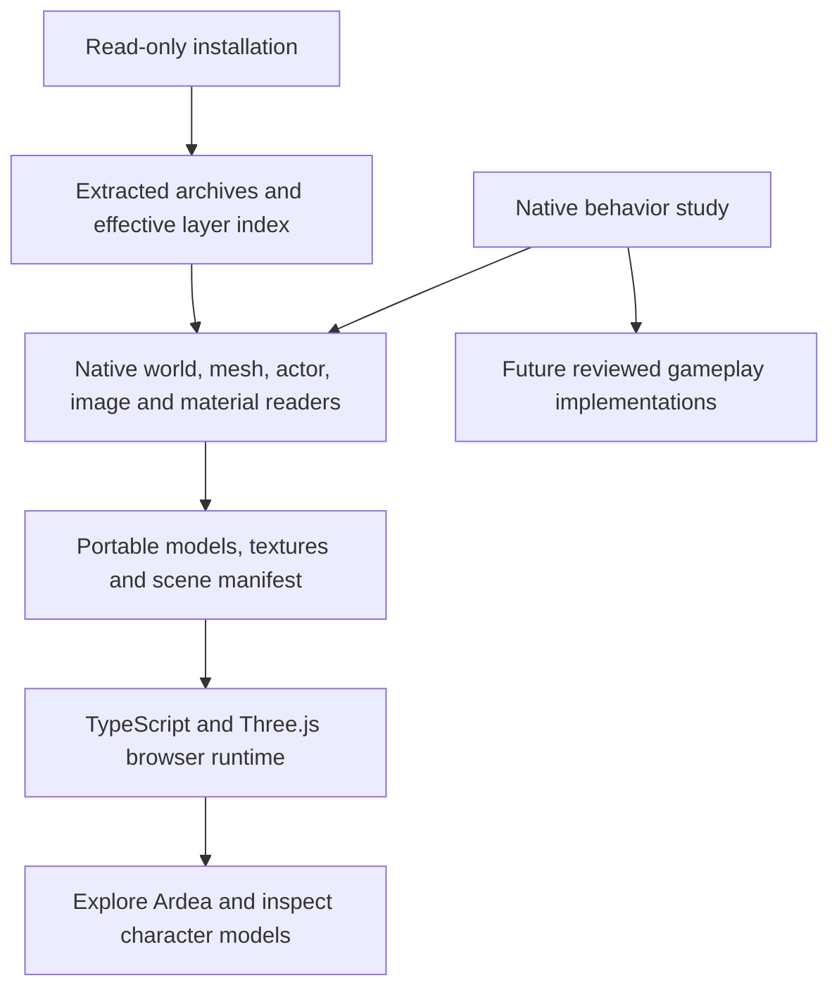

# How Gothic 3 is being rebuilt for the browser

Date: 4 October 2026. Current result: an Ardea exploration and model-inspection
milestone in TypeScript. This is an incomplete game reconstruction.

The owner requested this separate project and explicitly approved hosting it
in the public Tervain repository. The route is
[Gothic 3 / Ardea](https://ael-dev3.github.io/Tervain/gothic3/).
The [scope record](gothic3-browser-port.md) describes the current controls,
limitations and source terms.

## 1. Preserve and study the installed game

The installed game is the source of the selected geometry, texture pixels,
entity placements and character appearances. The original installation and the
completed local study are read-only inputs. Installed Gothic 3 executables and
DLLs are not run by the browser or the asset-preparation pipeline. Rimy3D is a
separate converter run offline during preparation.

The earlier local study inventoried and hashed the installation, extracted
38 archives containing 107,370 file records, and recorded which archive layer
wins for each logical resource. Those complete archive contents and native
binaries are kept outside this repository. The browser snapshot contains only
the selected derivatives needed for this scene.

The preparation tool reads this study layout:

```text
<LOCAL_GOTHIC3_STUDY>/
  02_Unpacked_Data/
    Archives/                         physically extracted archive contents
    _metadata/effective_layers.json  logical names, winning layers and hashes
```

Archive extraction and resource decoding are different operations. Extracting
a file exposes its original resource bytes; a mesh, image or world record still
needs its own format reader. A successful archive extraction does not recover
original engine source code.

## 2. Recover behavior references from the native programs

The completed local decompilation study covers 36 runtime, script and updater
modules. It contains 224,676 native C-like functions, one exact assembly
forwarding entry and a managed IL/C# supplement. These are reconstructed
representations of compiled programs, with inferred types and control flow.
They are not the original C++ project and cannot simply be compiled into a
browser game.

The rebuilding method is to inspect a bounded native behavior, identify its
inputs and state changes, then deliberately implement its counterpart in
TypeScript. Native addresses, original file hashes and resource records provide
the evidence. A replacement needs comparison with original behavior before it
can be described as equivalent.

For example, native `eCColorSrcSampler::SetSwitch` establishes the zero-based
material switch behavior used by the texture converter. Native
`eCShaderBase::ExecuteZPass` and `SetShaderRenderStates` establish masked alpha
reference normalization. Those findings guide small implementations; the
native engine itself has not been translated.

The Ardea quest research in
[content-provenance.json](../../assets/gothic3/content-provenance.json) records
original quest predicates, dialogue commands and behavior references.
[content.ts](../../src/gothic3/content.ts) presents a reviewed summary. All six
listed quests currently have `implemented: false`: reading their source does
not implement their state machine, rewards or dialogue effects.

## 3. Decode the native resources and select an Ardea slice



| Native resource | What is recovered | Implementation |
| --- | --- | --- |
| `.node`, `.lrentdat` | Entity GUIDs, world matrices, visual resources and body/head slots | [read_genome.py](../../tools/gothic3/read_genome.py) |
| `.xcmsh` | Positions, normals, triangle indices, UVs and material sections | [read_xcmsh.py](../../tools/gothic3/read_xcmsh.py) |
| `.xact` / embedded FXA actor payloads | Selected body/head geometry at the highest source triangle count | [prepare_ardea.py](../../tools/gothic3/prepare_ardea.py), using Rimy3D offline |
| `.ximg` | Native DXT1/3/5 texture pixels and mip layout | [prepare_ardea.py](../../tools/gothic3/prepare_ardea.py), using Pillow |
| `.xshmat` | Diffuse sampler names, switch modes, blend mode and mask reference | [read_xshmat.py](../../tools/gothic3/read_xshmat.py) |
| Original quest and `.info` records | Research data for future dialogue and quest execution | [content-provenance.json](../../assets/gothic3/content-provenance.json) |

The tool resolves resources through the effective layer index. It verifies an
input's SHA-256 before using it and refuses ambiguous file lookup. This avoids
silently taking an older base-archive version when a patch supplies the winning
resource.

The material reader distinguishes indexed `GENOMFLE` table strings from older
inline length-prefixed strings. A zero-length inline value is valid; it must not
make the containing shader disappear. Recognized shader/sampler parsing errors
stop preparation instead of silently dropping their metadata.

Rimy3D replaces spaces and tabs in exported material names with underscores.
Material lookup applies that same recorded name transformation with a uniqueness
check, preserving the actual native resource reference. It does not use fuzzy
name matching.

### World and characters

- Static families use the recorded entities in
  `G3_World_Lowpoly_01_Levelmesh_01_Spat.node`. Full-detail family resources are
  selected when present, at their corresponding recorded family transforms.
  Each entry records both `sourceResource` and `selectedResource`.
- City and outdoor props come from the effective Ardea dynamic-object `.node`
  layers. Six original Myrtana landscape LOD cells provide the terrain.
- The two Ardea NPC `.lrentdat` layers supply original body/head slots and
  material switches. Nearby named characters and the Hero's arrival position
  come from the effective `SysDyn` layer. Duplicate GUIDs are excluded.
- Diego, Milten, Gorn, Lester, Jack and Hamlar retain their recorded positions.
  Both NPC layers are included as source exhibits; original quest-controlled
  activation and NPC routines have not been reproduced.
- The Nameless Hero is a separate model-inspection exhibit. It is not an
  invented extra NPC placed at the scene origin.

### Coordinates and mesh conversion

The native world uses centimetres and Y-up coordinates. The browser uses metres
and a reflected Z axis. With native origin `[92000, 5200, -12000]`, conversion is:

```text
browser position = [(X - 92000) / 100,
                    (Y - 5200) / 100,
                   -(Z + 12000) / 100]
```

Normals are reflected and triangle winding is reversed. Entity matrices are
reflected on both sides before their position, quaternion and scale are
decomposed. Landscape vertices already contain world coordinates, so the origin
is applied to those vertices once; it is not applied again to their placement.

The native `PC_Hero` arrival position is
`[87984.9375, 5145.56396484375, -10197.4775390625]` centimetres. The browser feet
position is `[-40.150625, -0.544360, -18.025225]` metres. The exploration camera
adds its new 1.65-metre eye height. The chosen view toward Ardea is a browser
camera decision, not a recovered native camera controller.

### Texture and material conversion

Native XIMG mip levels are stored from smallest to largest. The full-resolution
DXT level must be read at `imagePayloadEnd - fullMipBytes`. Reading from the
start of the payload mixes mip levels and corrupts spatial detail. The converter
checks the payload layout and records dimensions, mip count, byte range and
source offset in `textureSelections`.

Opaque decoded pixels become JPEG at quality 92 without resizing. Textures
with alpha become PNG. A dark source albedo is preserved; an unproven gamma
correction is not baked into the exported pixels.

Native sampler switches select contiguous `S1..Sn` variants. Repeat wraps by
texture count, Clamp stays at an endpoint, and PingPong reflects over
`count - 1`. The selected sampler, variant, available range and original mode
are recorded in `materialSelections`.

Each model retains native Normal, Masked or AlphaBlend mode and the original
`MaskReference` byte. Alpha in a DXT image does not make an opaque stone or wood
material transparent. Masked surfaces use the native byte/255 reference, with
a small browser comparison epsilon to account for Three.js's discard boundary.
The full shader graph, terrain layer blends, normal/specular maps and native
lighting remain unimplemented. The preview currently selects one diffuse
sampler for each material and records the unsupported blends.

## 4. Build a new TypeScript runtime

The separate entry is [gothic3/index.html](../../gothic3/index.html). Its browser
code is under [src/gothic3](../../src/gothic3):

| File | Responsibility |
| --- | --- |
| `types.ts` | Portable scene, character and material data shapes |
| `assets.ts` | Model caching, OBJ/MTL loading, texture completion and native alpha modes |
| `controls.ts` | New first-person movement, raycast ground support, wall sliding and flight |
| `main.ts` | Scene assembly, character inspector, map, journal, camera saves and UI |
| `content.ts` | Recovered character and quest reference summaries |
| `style.css` | The separate page's interface |

This code uses Three.js to display the prepared resources. It does not load
native DLLs, execute decompiled functions or import Tervain's simulation.
Ground support and movement are new approximations. Character models are
static bind-pose previews, without native skeletal animation or equipment
attachment behavior. Preview lighting and brightness are browser choices.

The generated [scene manifest](../../public/gothic3/scene.json) connects models
to placements and appearances. The
[source manifest](../../public/gothic3/source-manifest.json) records input and
output hashes, source layers, conversion details and omissions. Personal local
filesystem prefixes are omitted from the hosted records.

## 5. Reproduce, review and publish

Asset preparation requires the existing extracted study, Python 3.10+ with Pillow,
and Rimy3D. It writes the generated asset folder and an explicitly supplied
scratch folder outside the read-only study:

```powershell
python tools/gothic3/prepare_ardea.py --study "C:\path\to\Gothic3_Decompiled_Study_2026-10-04" --rimy "C:\path\to\Rimy3D.exe" --scratch "C:\outside-the-study\ardea-preparation"
```

See the [preparation README](../../tools/gothic3/README.md) for prerequisites,
format references and license separation. The installation/study generation
itself is an earlier local operation, not a step provided by this repository's
Ardea converter.

Use Node 24, matching the Pages workflow, to build the two browser entries with
the repository's pinned dependencies:

```powershell
npm ci
npm run typecheck
npm run build
```

`npm run dev` serves `/gothic3/` locally. Review the actual rendered scene and
models as well as the source diff. Check every generated output hash, asset
reference and source record; record unsupported behavior instead of treating
successful conversion as game equivalence. The current snapshot contains
202 world instances, 67 NPC records, 130 models and 139 textures.

Vite builds the original Tervain page and this separate entry into one `dist`
artifact. Publication uses the existing Pages workflow. Before a coherent main
push, inspect repository-wide runs, attempts and workflow trigger chains; reuse
applicable results and avoid duplicate runs. The workflow retains its required
typecheck, scenario suite and build, followed by deployment. Confirm the served
Ardea route and the original Tervain version after the deployment succeeds.

## 6. What still has to be rebuilt

A complete game requires implementations and original-behavior comparisons for:

1. Skeletons, skin weights, body/head binding, attachments and motion clips.
2. Player combat, targeting, damage, hit reactions and death/revival rules.
3. NPC AI, routines, factions, hostility and original activation conditions.
4. Dialogue predicates and commands, inventory, trading, skills and quest state.
5. Native terrain/material blending, vegetation, lighting, audio and streaming.
6. Broad world content and save compatibility or an explicitly new save format.

Those systems are not implied by a model rendering correctly. Each future
milestone should name its native evidence, supported behavior, unsupported
cases and comparison results. Whole-game completion needs corresponding content
and behavior, rather than a larger collection of static models.

Gothic 3's assets remain third-party material with no asserted open-content
license. The offline preparation scripts retain their GPL-3.0-only license;
that license does not license the game's assets. The separate browser runtime
does not bundle those scripts. See [NOTICE](../../assets/gothic3/NOTICE.md).
