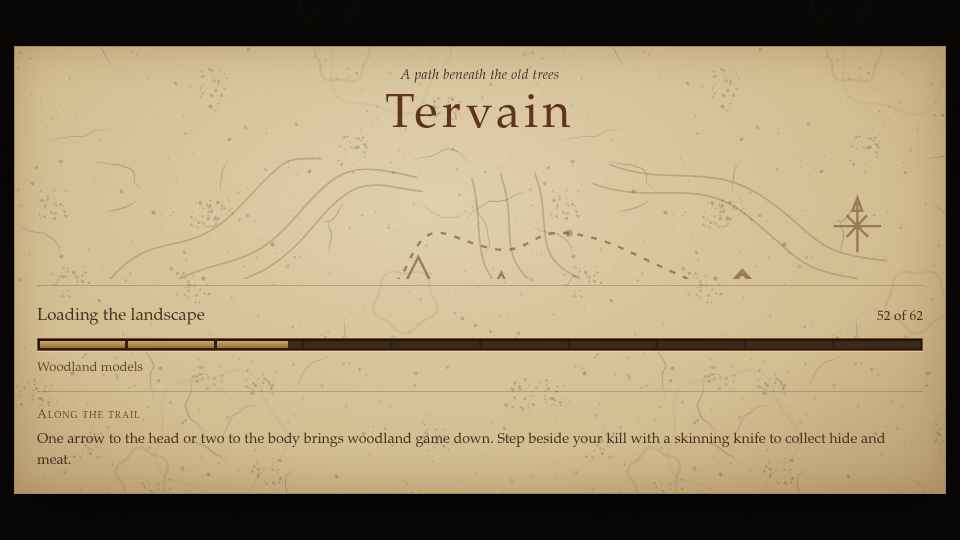
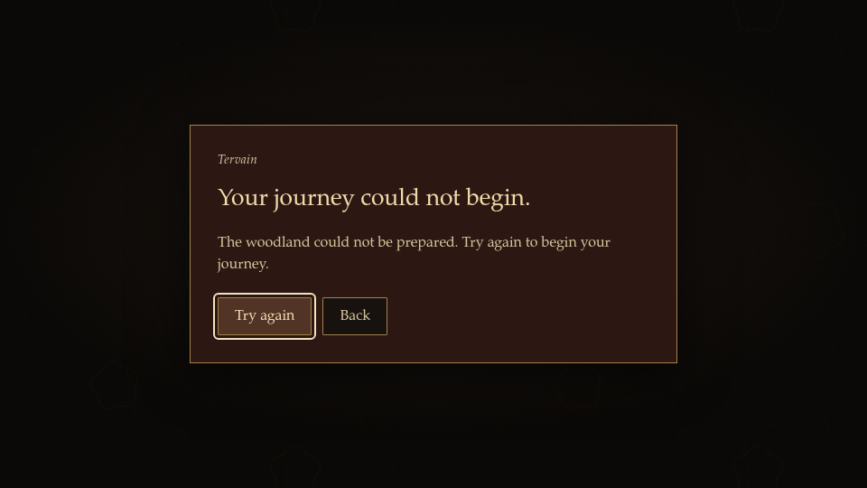

# Loading and resource preparation

The loading work separates opening the menu, acquiring resources, restoring a
world and preparing its first visible frame. A completed download is only one
part of making the valley ready to play. Startup, saved-game entry and graphics
replacement should keep player input, simulation and world audio paused until
the world and its presentation are ready, with an accessible recovery screen
when preparation fails.

## Gothic 3 study references

These are architectural and visual references for an original Tervain
implementation. No Gothic 3 source code, image, font or sound is imported into
the original game for this work.

- The recovered session controller compiles navigation, derives its running
  byte from the compile result, orders initialization callbacks, and performs
  actual application warmup frames before returning from the menu. New-game
  component/audio gates surround that preparation. See
  [the recovered startup order](gothic3-rebuilding-process.md#preserve-session-startup-and-the-application-loop),
  [the study controller](../../src/gothic3/session-runtime.ts) and its
  [runtime receipt](../../assets/gothic3/session-runtime/runtime-rules.json).
  Its 20 frames and 100 ms waits belong to that examined native sequence;
  Tervain should prepare actual renderer work without adding an artificial
  two-second wait.
- Entity identity/read completion, context residency, cache/physics setup and
  processing eligibility are distinct operations. The study explicitly avoids
  treating an indexed or rendered entity as an activated world entity. See
  [loading stages](gothic3-rebuilding-process.md#retain-physical-state-and-complete-the-loading-stages)
  and [processing gates](gothic3-rebuilding-process.md#publish-frame-time-at-the-successful-render-tail).
  The [processing](../../assets/gothic3/processing-checkpoint.json) and
  [activation](../../assets/gothic3/activation-checkpoint.json) receipts still
  record `gameplayReady: false`; this is inspiration, not native equivalence.
- The study's browser terrain implementation bounds concurrent loads, applies
  distance hysteresis, owns shared material/texture leases and discards late
  arrivals after disposal. See
  [streaming notes](gothic3-rebuilding-process.md#compile-graphs-and-stream-resident-geometry),
  [terrain ownership](../../src/gothic3/terrain.ts) and
  [material leases](../../src/gothic3/terrain-materials.ts).
  The two-load concurrency, 48-cell target and texture-memory estimate are
  selected browser adaptations, not recovered Gothic engine constants.
- The [visual study](../art/gothic3-reference.md#the-title-menu) records a
  parchment map, sepia sketches, bronze rules and amber progress. Tervain's
  original loading surfaces can use that material language while retaining
  its own map, lettering and artwork.

## Baseline observation

One fresh-profile development run measured source revision `a021b8ae` with
Chromium headless/SwiftShader, Low quality and a 960 × 540 viewport. Times below
come from browser navigation and event instrumentation; they describe this
local software-rendering sample, not production CDN timings, hardware frame
rates or a cross-device benchmark. Model bytes count observed GLB payloads.

| Observation | Baseline | Candidate |
| --- | ---: | ---: |
| First contentful paint | 2.488 s | 2.188 s |
| Title controls enabled | 22.211 s | 2.084 s |
| GLB requests completed by title readiness | 80 | 0 |
| GLB payload bytes by title readiness | 476,482,952 B | 0 B |
| New Game pointer-down to game mode reporting ready | 1.530 s | 45.139 s |
| Reported ready to two recorded play frames | 18.310 s | 0.013 s |
| Navigation to two recorded play frames | 58.450 s | 53.982 s |
| Longest observed main-thread task across the sample | 18.284 s | 11.028 s |
| Longest observed animation-frame gap across the sample | 18.316 s | 15.866 s |

The baseline built the world before enabling the title and loaded the complete
resident catalog and woodland. Resource progress also interleaved different
totals under one label: for example, `1/13`, `1/19`, `2/19`, then `2/13`.
After starting New Game, the game mode reported ready before the expensive
first presentation had completed. These observations motivate distinct phase
labels, counts tied to their actual task and a first-view readiness gate.

The candidate was measured at `c9bd05ac` with the same fresh-profile setup.
Both runs completed the same 80 GLBs and 476,482,952 payload bytes before play,
with the same native beach, 341 trees and 12 named residents, and no runtime
errors. The menu shell is now available while its imported backdrop prepares.
The longer Start-to-ready interval reflects moving world preparation from
before the title to after Start; it is not a claim that world acquisition became
free. Screenshot capture and backdrop preparation also affect when the scripted
Start press arrives (38.611 s in the baseline, 8.831 s in the candidate), so
navigation-to-play totals are observations of this flow rather than a general
speedup guarantee.

Entry-view sampler preparation produced 76 recorded status updates over 8.964 s.
The final graphics count reached 173/173 only after the submitted first view
was complete. Synchronous compilation/submission still produced a 15.866 s
frame gap on this software renderer, and subsequent software-rendered gameplay
frames remained slow. This work reduces measured startup/task costs and removes
the premature readiness signal; it does not establish smooth loading or a
hardware frame-rate improvement.

## Development file watching

The study contains tens of thousands of generated evidence/resource files.
Watching every retained excerpt and fetched public asset exhausted available
filesystem watches in the cloud workspace. The development configuration now
ignores only `assets/gothic3/**/sources` excerpt archives and `public/gothic3`
resource data. Application code under `src/gothic3` and imported JSON receipts
and manifests under `assets/gothic3` remain watched. Ignoring a watcher path
does not remove it from development serving or the production build; changes
to ignored static study resources require a manual page reload.

The actual configuration started with normal `npm run dev`. A second server
inspection found 136 watched directories and 2,874 watched entries, including
`src/gothic3` and the imported session runtime receipt, with no watchers inside
the ignored archives and no watcher errors. The original game, both study
entry pages, a public study manifest and the study session source returned
HTTP 200. These counts describe this checkout and watcher inspection, rather
than a promise about every developer's file tree.

## Implementation

The original title shell, settings, controls and save selection are available
before a playable world exists. Its separate backdrop requests only the menu
warden and the ancient tree's three LODs. Start or Continue requests the hero,
full resident catalog and valley; the world module, including the physics
runtime, is dynamically imported at that point. A failed optional backdrop
can retain the original procedural vigil, while failed required world assets
use explicit Retry and Back recovery.

One shared queue permits four complete GLB download/parse operations across
all catalogs. Successful promise caches retain source templates across
rebuilds; failed loads release their slot and can retry. Progress counts
completed decoding rather than received HTTP headers, and the model stage
counts its actual 62 world GLBs. Catalog subsets reuse the same validated
manifest and model promises as full catalogs.

Terrain and navigation use the same deterministic sampling paths as before,
with cooperative row/tile batches. Completed physical terrain fields are
cached and copied per world; contacts and mutable arrays remain independent.
Ground texture synthesis runs in a module worker and transfers its pixel
arrays. Worker startup failure uses the deterministic cooperative fallback;
generation errors and cancellation retain recovery and cleanup behavior.
Individual foliage, settlement and physics builders still run synchronously
between checkpoints, so this work does not eliminate every long task.

Preparing a world restores physical state and navigation before activation.
The first camera view is updated with zero simulation time, entry-camera
sampler uploads are prepared in bounded batches, shaders are compiled
asynchronously, the real presentation is rendered, and a WebGL2 fence waits
for its submitted graphics work. Hidden LODs and frustum-culled off-camera
drawables are excluded from sampler preparation; material factories can
explicitly expose shader samplers without changing their pixels, filtering
or ownership. Only then does the
loading screen release gameplay input. First entry, failed entry and quality
replacement keep simulation, wildlife sound and autosaving paused. Retry
retains the chosen save; Back disposes a failed first view and restores the
prior title state.

The parchment loading chart is original artwork. Phase segments show measured
work counts when available and remain indeterminate for work without a known
total; there is no guessed global percentage or minimum waiting time. Recovery
supports Tab, keyboard activation and controller selection, with held input
cleared before new controls become active.

## Slow connections, returning visitors and parallel downloads (A68, 0.0.13)

A world now downloads 117 files from the model host: 106 GLBs under `public/models` hold 564.5 MB, and a load takes
most of them, with the residents' rigs and motion, the furniture and the building surfaces beside them. Before A68, each
file had a fixed 60 s to arrive. A 7–20 MB model on a slow or throttled connection could overrun that while three others
shared the link, and the whole journey failed with the generic failure card. Measured on the previous main with the
network throttled to 4 Mbps, the journey failed after 60.3 s with `AbortError`.

[download.ts](../../src/presentation/assets/download.ts) now carries every model and surface download:

- **A stall, not a deadline.** A download is abandoned only after 45 s without any data, however long the file takes
  while data keeps arriving.
- **Passing failures are tried again.** A dropped connection, a stall, HTTP 408, 425, 429 or 5xx, a short body or a
  hash mismatch is retried up to three times, after 1.2 s and 4 s. A missing file or a web page in place of a model is
  reported at once. Only a failure that outlasts every try reaches the loading screen's Retry.
- **The reason is shown.** The failure card gives the underlying message in small print, so a report names the cause.
- **A content cache.** The hosted models are addressed by the build's commit, so every deploy gave every model a new
  address and the browser's HTTP cache never helped. A file whose SHA-256 is known is now also kept in Cache Storage
  under that hash, and an unchanged file is taken from there whatever its address. The hash comes from its manifest
  (residents, rigs, motion, furniture, surfaces) or from [modelFiles.ts](../../src/presentation/assets/modelFiles.ts).
  That table is generated by `node tools/model-files.mjs`, and `tests/presentation/modelFiles.test.ts` fails while it
  disagrees with the files. Cached bytes are hashed again before use. Once a world has loaded, cached files this
  session did not ask for are dropped.
- **Everything starts at once.** Start and Continue ask for the wanderer and the residents first, then every world
  model and surface ([journeyPrefetch.ts](../../src/presentation/journeyPrefetch.ts)). The shared four-slot queue keeps
  them in that order, so the network never waits while the residents are prepared. The ground textures' worker starts
  at the same moment instead of after the models, and furniture pieces load side by side instead of one after another.

Measured in headless Chrome against the local server, with the network throttled to 100 Mbps:

| Load | Previous main | A68 |
| --- | --- | --- |
| First visit | 72.1 s | 69.9 s |
| Returning visit | 72.1 s after every deploy | 15.6 s |

A first visit is bound by the download itself: the residents and the landscape still take about 52 s at that speed, and
only the ground textures' 3.7 s is hidden. At 4 Mbps the journey kept loading for the full four minutes measured, with
no failure, and filled the cache as it went. Reducing the 564.5 MB itself, for example with compressed geometry and
textures, is the remaining large win for first visits.

## Native loading and recovery screens

These screenshots show the actual application during a held landscape model
download and an injected required-model failure. The phase count remains tied
to decoded models; recovery retains the selected saved game.

## Validation

The final implementation passed all 1,987 tests across 198 files, TypeScript
checking and the production build locally. The pull request's GitHub CI also
passed typechecking, the complete scenario suite and the build at `c9bd05ac`.

Native Chromium checks restored a populated save through a held asset download,
tab hiding, a deliberately failed required animal model and Retry. World time,
play time and both save envelopes stayed frozen during preparation. The restored
character, equipment, injured animal and named residents remained intact through
Low-to-High-to-Low graphics replacement, including a hidden-tab rebuild. Retry
refetched the failed model once; recovery Tab navigation reached both buttons.
Saving after a further Low rebuild retained the restored state and became the
newest Continue target. Native walking moved the rebuilt hero with finite,
grounded coordinates and no runtime errors.
The injected HTTP 503 is an expected failure, separate from the error-free
baseline and candidate performance samples.

A real module-worker check compared generated albedo and normal bytes at two
small resolutions with the synchronous implementation. At High resolution it
produced two 33,554,432-byte arrays in 5.676 s while 341 animation-frame callbacks
ran, with a 16.8 ms maximum callback gap in that isolated texture-generation check.
These callback timings do not measure individual raster paints. This establishes
worker output parity and main-thread responsiveness during that operation;
the complete game still has the rendering and synchronous-work limits above.
