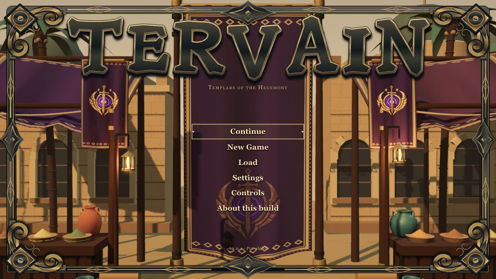
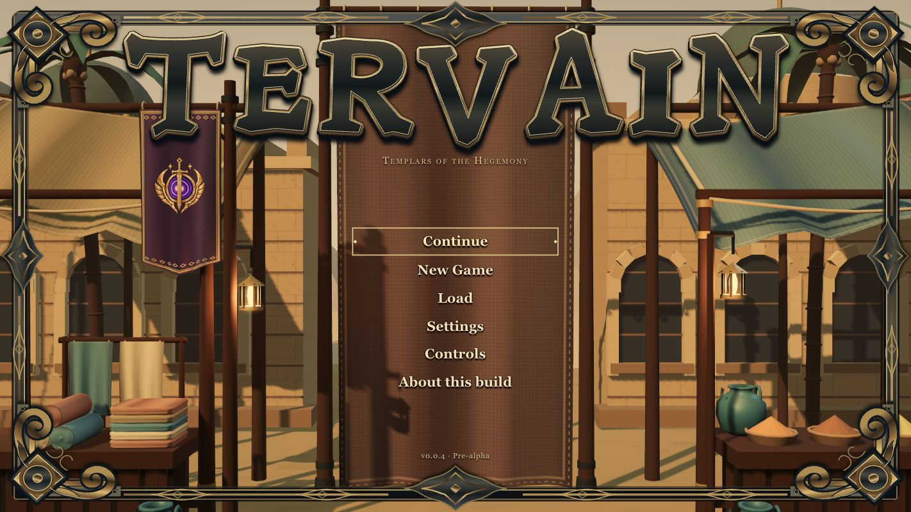
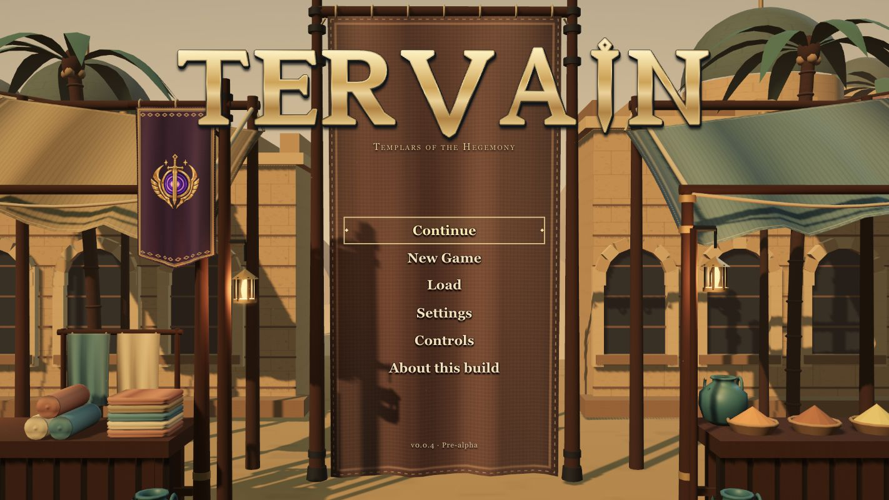
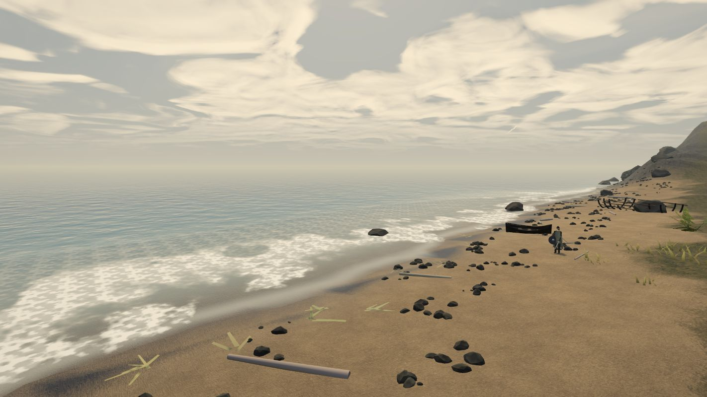
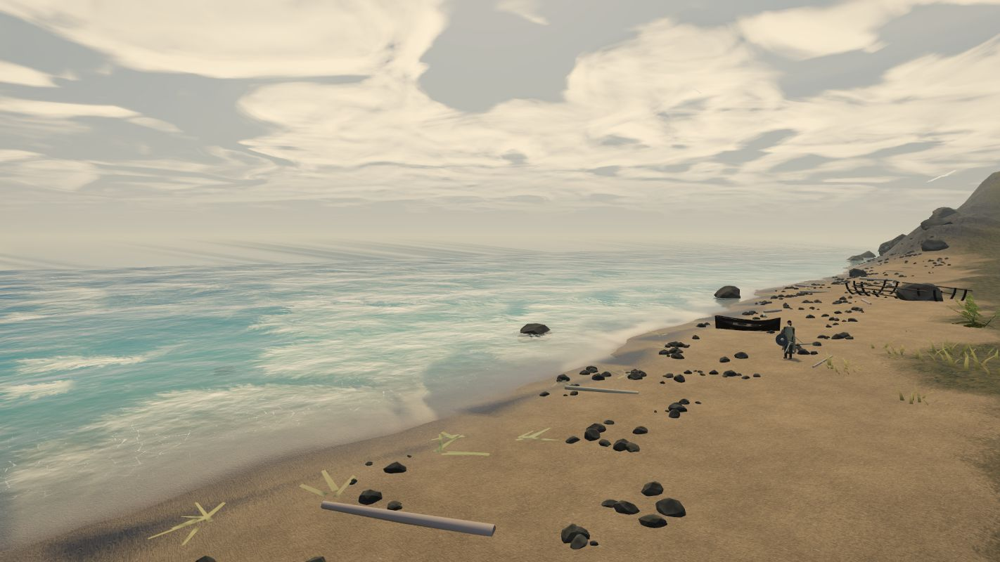

# Tervain 0.0.4 — coast, construction, and presentation revision

Status: **pre-alpha patch, 30 September 2026; local release checks passed.** The owner authorized shipping `0.0.4`. This patch stays within the accepted `0.0.x` hold; it does not claim that the [promotion gate](../versioning.md) has been met. The owner-provided rugged Gothic 3 brief guides the presentation changes. All geometry remains original code-generated art.

## What changed

### Complete building exteriors and the enterable archive

- Gable, hip, and lean roofs now have continuous structural decking, correctly facing sloped undersides, and closed edge thickness beneath the individual tile, slate, thatch, and shingle courses. Exposed roof trim is capped; the high edge of a lean roof is closed. Hip courses meet their actual tapered boundaries, including square apexes and rectangles whose long side runs front to back.
- Wall infill follows the roof's actual ridge and overhang instead of leaving daylight above gable ends or raised lean-roof walls. Timber rails cover all four walls, foundation cores back the uneven visible stones, and door bases meet the building plinths. The shrine's steps and column heights now reach the structure they support.
- The archive has thick wall segments around measured front-door and rear-shutter openings, backed moving leaves, a continuous plank floor, two correctly placed side gables, and a visible roof underside from inside. Its cut-and-filled terrace keeps terrain below the floor. Player ground height follows the rendered floor and entrance thresholds, including the rear stone sill.

Implementation: [building shells](../../../src/presentation/buildings.ts), [roof geometry](../../../src/presentation/roofs.ts), [wall infill](../../../src/presentation/structures.ts), [archive dimensions](../../../src/world/layout.ts), and [terrain/floor support](../../../src/world/terrain.ts). Geometry checks use front-facing ray intersections and normal/winding checks; they do not judge the finished appearance.

### Coast, vegetation, and interaction space

- Removed the distant mountain mesh and replaced the high boundary envelope with a low wooded heath rise. The beach and village no longer sit against the former alpine wall.
- Tree positions and blocking trunks now come from one deterministic population shared by all graphics presets. Every blocking tree is retained in the low, medium, and high render populations; lower presets thin only nonblocking decoration and reduce rendering detail. Changing quality therefore keeps the same movement obstacles and navigation routes.
- Orchard trees obey the same building, path, water, and interaction clearances as other trunks. Route tests include the actual generated tree colliders, scheduled NPC transitions, and key quest approaches.
- Rocks also use a canonical population: 132 blocking rocks across every preset. Low/medium/high retain 646/872/1,077 visible stones; only nonblocking decoration is thinned. Eight former rock candidates overlapping existing exclusion margins were removed. Combined tree-and-rock navigation tests cover roads, building shells, interaction approaches, and every named NPC schedule and override transition.
- Tree and leaf sway remains completely paused. Low-quality nearby trees retain trunk and branch geometry; their shadow detail is reduced according to preset. Invisible sleeping ambient residents no longer leave active colliders.

Implementation: [canonical flora population](../../../src/presentation/floraPopulation.ts), [flora rendering](../../../src/presentation/flora.ts), [canonical rock population](../../../src/presentation/scatterPopulation.ts), and [colliders](../../../src/world/colliders.ts).

### Grounded rite feedback

The spring rite uses a hollow, closed-bottom stone cup resting on its altar and water below the cup's rim. On success, the water settles through a small ripple, a few subdued ash flecks move over the stone immediately beneath it, and a brief warm local fill fades. The former hovering mint outline is removed. The response retains its 2.5-second duration; reduced motion keeps its geometry still. Its channel timing, inventory cost, calm window, progress display, and semantic success/unavailable feedback are unchanged. This treatment is an art interpretation of the brief, not additional ritual lore.

Implementation: [rite response](../../../src/presentation/riteResponse.ts) and [world hookup](../../../src/presentation/world.ts).

### People, materials, interface, and audio

- Named residents have stable face profiles independent of wardrobe, more distinct hair/beard/age traits, and task-specific gestures such as writing, mending, and stonework. They remain procedural proxy characters.
- Increased environmental fill and shadow readability; restrained saturation, contrast, vignette, grain, and bloom. The default chromatic separation is removed, with independent developer capture controls retained for look review.
- Replaced interface glass treatments with paper, timber, and soot surfaces. Dialogue appears immediately without typewriter blips. Guidance is static ink rather than a pulsing marker; settings controls align with their labels, and narrow-screen notifications have their own space.
- The title uses game-facing copy and the shared `0.0.4` package version. Its heading fits the available panel width even at 180% text on a narrow screen. Source revision remains available in debug/benchmark reports.
- Removed synthesized UI, interaction, combat, dialogue, and story-bell tones. Important event captions work without an audio device and with volumes muted; gate/archive captions describe the actual source. Filtered wind, water, and sea beds remain placeholder procedural ambience.

### Pausing, background tabs, and resource lifetime

- Panels and dialogue freeze active player actions, combat timers, named NPC routes, and the game clock. The frame that closes an overlay stays paused, so its closing press cannot also act in the world. Cosmetic world presentation can continue while a panel is open.
- A hidden page autosaves, stops simulation even if background animation callbacks continue, and suspends the audio context. Returning establishes a new frame baseline and consumes held controller presses without simulating the time spent hidden.
- World replacement waits for construction and releases environment/module resources before building replacement caches. Flora owns and clears its cached geometries, instanced resources, materials, and textures. Remaining scene resources are deduplicated during cleanup, and the persistent player rig survives a rebuild. Private terrain shader textures and unused scenery allocations retain their explicit disposal hooks.

Implementation: [frame timing](../../../src/platform/frameTiming.ts), [scene cleanup](../../../src/presentation/disposeScene.ts), [App lifecycle](../../../src/app.ts), and [audio visibility](../../../src/presentation/audio.ts).

## Validation and release handoff

The combined release checks passed on 30 September: **172 tests across 18 files**. They cover existing quest and persistence scenarios plus real geometry intersections, winding/closed surfaces, grounded archive entries, canonical vegetation/rock navigation, frame timing, captions independent of the audio context, and shared-resource disposal.

| Check | Release status |
| --- | --- |
| `npm run typecheck` | Passed. |
| `npm test` | Passed: 172 tests / 18 files. |
| `npm run build` | Passed: approximately 1,062 kB JS / 308 kB gzip, 12.7 kB CSS. |
| `git diff --check` and documentation links | Passed. |
| Runtime visual/input/save review | Desktop browser checks described below passed; the complete brief matrix remains outstanding. |
| Reference-hardware performance | Unverified; no frame-rate or capacity claim. |

Runtime checks used the Codex desktop browser on Apple M5 / Chromium 154. The development build was inspected at the archive exterior and inside its roof, at a village house rear facade, and through default/180% text and high-contrast settings with desktop and narrow viewport overrides. The narrow title initially clipped; it was corrected and rechecked. Opening the journal held the game clock at 15:14 across the reading interval. The built preview exercised new game, opening dialogue and exit, quicksave/quickload, pause/resume, and low/high/medium world rebuilds. All presets retained 674 tree obstacles; the final return to medium reported 322 geometries / 47 textures at the strand, compared with 765 / 52 after the benchmark had streamed through the wider world. These are lifecycle observations, not a long-duration memory test. No console warnings or errors were observed during these checks.

The built preview completed its fixed camera route at medium quality, 1422×800 CSS pixels and 0.9 renderer DPR. Over 3,241 frames it recorded median 16.70 ms, p95 18.10 ms, p99 18.60 ms, worst 18.8 ms. [The full report](0.0.4-benchmark.txt) identifies the browser, GPU, state and exact pre-commit bundle hash. This is one local run limited by display refresh, with no matched baseline or agreed reference machine; it establishes no general 60 FPS or mobile claim.

The complete brief matrix remains outstanding: physical controller use, speaker/headphone audio audition, a normal-play recording, matched before/after captures, full state-by-state night/material review, and a live hidden-tab return test. Hidden timing, caption independence, rite state/reduced motion, archive entry modes and save consequences have automated coverage. The [prototype notes](../../engineering/prototype.md) describe controls, save recovery, and capture/benchmark tools. The wider [slice acceptance scenarios](../vertical-slice.md) remain necessary before a promotion decision.

## Menu presentation follow-up

**Historical A19/A20 pass: locally reviewed, then superseded by A21/A22's native 3D desert-market direction below.** The evidence in this section applies to the earlier static hanging-cloth menu in `0.0.4`, not the replacement scene. Its artwork was original code-authored expression inspired by the brief and reference; no extracted Gothic asset was used. The earlier runtime review and benchmark above predate both menu revisions.

The owner clarified the style as rugged theatrical fantasy, with heavy expressive silhouettes, oversized ornament, painted broad value/color groups, rich earthy reds/golds, warm/cool contrast, and selective larger wear ([A20](../../decisions.md)). The revised wordmark uses seven individually authored path glyphs with varied heights, heavy angular serifs, ochre rims, charcoal faces, and gold bevels. Larger frame scrollwork and medallions surround oxblood cloth with substantial soot-dark folds, an embroidered original decorative seal, and an irregular hem. Broad cool/amber menu light masses support the image; the live gameplay grade is unchanged. This adds no lore or game systems and retains accessible controls and calm motion.

That title and pause pass shared original, statically authored SVG artwork: a worn red hanging textile, worked-metal perimeter ornament, and carved Tervain wordmark. Centered choices remained native text buttons over the cloth. Pause retained Resume, Save, Load, Journal, Settings, Controls, and Quit to title; settings, controls, records, and confirmations kept readable paper panels. Artwork stayed outside pointer and focus interaction, and the native heading supplied the accessible title.

The A20 review capture used default 100% text size and 1422×800 pixels. It is historical evidence; the current preview below shows the replacement 3D scene.

Modal panels now have a named dialog and `aria-modal`, contain Tab/Shift+Tab navigation, reject controller activation outside the active panel, and restore the triggering parent control when a nested panel closes. Key-remapping capture takes precedence over the Tab trap; bound shortcuts for directly opened journal, map, and inventory panels retain their existing toggle behavior. The title becomes inert behind a panel, while paper forms use a dark focus outline and cloth choices use a light one. Menu choices have their own scroll area for large text; very short windows scroll the complete banner content so its heading and final action remain reachable. This historical pass used a narrow-screen metal rim and corner studs; A25 removes that fallback and the desktop frame. High contrast hid the earlier textile weave and decorative seal; reduced effects removed artwork filters and shadows.

Typecheck, the existing **172 tests / 18 files**, production build, and diff checks pass after the revision. The follow-up bundle is approximately **1,082 kB JS / 314.7 kB gzip and 16.9 kB CSS**. These automated checks do not establish menu rendering or focus behavior.

The earlier A19 browser review verified native mouse/keyboard title and pause navigation, Settings and nested Controls return focus, modal Tab/Shift+Tab wrapping, Tab-remapping conflict/cancel, saving Slot 1, Continue loading that save, New Game confirmation/cancel, direct Journal's bound Tab toggle, and reduced motion. All seven pause actions remained reachable at 180% text, and pause hid the gameplay HUD.

The final A20 review inspected revised artwork in desktop title and pause at 1422×800 and 100% text. At 355×711 and 180% text/high contrast, the final About action remained reachable and the decorative seal was hidden. At 889×356 and 180%, complete-content scrolling kept the short layout usable. Reduced effects removed shadows cleanly. Continue loaded the save, pause and Quit to title worked, and Settings Back restored focus. The desktop title measured 278 px for both its menu viewport and content, with no navigation overflow. No console warnings or errors were observed; defaults were restored after review. Physical controller use and reference-hardware performance remain unverified; this is no deployed-menu or general performance claim.

Implementation: [menu composition](../../../src/presentation/ui/menuView.ts), [original artwork](../../../src/presentation/ui/menuArtwork.ts), [modal panels](../../../src/presentation/ui/panels.ts), [focus helpers](../../../src/presentation/ui/dom.ts), [App integration](../../../src/app.ts), and [menu styles](../../../src/style.css).

## Native 3D desert-market menu follow-up

**Historical A21/A22 scene review; its repeated banner arrangement is superseded by [A24's composition correction](#market-composition-correction) below.** This remains `0.0.4` in unmerged [PR #2](https://github.com/ael-dev3/Tervain/pull/2). The previous static-menu checks and benchmark do not validate the replacement scene; its own observed checks are recorded below.

The owner explicitly confirmed that the Templars are part of the Hegemony (A21), while their local campaign remains away from Warpkeep's main Hegemony–Core–Ousters conflict. A22 requests a complete native 3D Gothic 3-inspired desert-market menu: sand, palms, spice goods, market stalls, silk/shade cloth, and gentle cloth wind. Original scene geometry replaces the static lone banner and beach backdrop; the approved Hegemony emblem replaces the invented decorative seal and is integrated into fabric. No Gothic model or texture is copied, and this change does not add a desert gameplay region or new lore beyond the accepted affiliation.

The title, pause, and nested pause forms use the separate menu courtyard. Gameplay-world updates stop while it is displayed; its ambience excludes the beach sea/water layers. Native controls, accessible focus/text scaling, and readable paper forms remain. The playable Grey Strand coast, saves, and gameplay tree/leaf-animation hold are unchanged. Menu-specific wind is authorized separately; exact reduced-motion freezing is covered by CPU-side tests and byte-identical separate browser captures.

The exact approved September 27 master is copied to [public/assets/menu/hegemony-emblem.png](../../../public/assets/menu/hegemony-emblem.png): 1254×1254 RGBA, **1,486,312 bytes**, SHA-256 **`26e8664b1db0acf3e6db443caf46ef13e45fe9de794749e431b7c2e3d6fb8774`**. Source/destination byte equality, digest, size, and PNG header were checked. No image transform or metadata stripping was performed on that bundled master. At render time the image is composited onto originally authored cloth textures; side standards carry full color and the central print remains quieter behind controls. The [asset inventory](../../engineering/asset-inventory.md#approved-hegemony-menu-emblem-30-september-2026) and [machine-readable record](../../engineering/menu-assets.json) pin its branch/release source, creation disclosure, and specific owner-use authority. The archive has no separate open-license grant, and this import does not expand third-party or trademark rights.

The original authored scene contains **33,188 mesh triangles, 56 mesh objects, seven cloth panels, 50 fronds in five connected palm crowns, and 56 dust points**. These are scene/geometry counts, not draw-call or frame-rate measurements. Fronds are anchored to fixed crowns; palms stand above the awnings, and the central cloth has a pointed hem. The camera stays fixed. Menu-only cloth, crown-tip motion, flames, and dust use a bounded clock; reduced motion freezes that presentation without resuming gameplay tree sway.

Current local desktop review capture at 1422×800 pixels with default 100% text, normal contrast, and menu wind enabled; raised palm crowns frame the market above the awnings.

Local production-preview browser review passed title → Continue → playable world with HUD restored, pause and nested Settings with the gameplay HUD hidden, Settings Back focus restoration, Resume/Quit Tab and Shift+Tab wrapping, and return to title. At 355×711, both default 100% and 180% text/high contrast kept all title actions and all seven pause actions reachable through native scrolling/focus. At 889×356 with reduced effects and Low quality, complete-content scrolling kept Quit and the footer reachable. Brightness responded and was restored to 100%. Two separate desktop reduced-motion JPEG captures were byte-identical; no precise elapsed interval was recorded. The approved emblem rendered on the vertical standards and central cloth with its aspect preserved. Low → Medium quality restoration succeeded after reload. Default text/brightness, normal contrast, ordinary wind, and effects were restored; browser warning/error logs were empty.

Typecheck, **183 tests across 20 files**, production build, source/hash/link checks, and diff checks pass. The follow-up bundle is approximately **1,123 kB JS / 327.9 kB gzip and 16.5 kB CSS**. Six CPU-only scene tests using real Three.js geometry cover the emblem failure/late-callback guard, nondegenerate fronds, fixed attachment points, exact reduced-motion freeze, and idempotent disposal. The resource audit recorded **57 geometries, 53 materials, and 11 textures**, each disposed once. This validates the tested CPU-side ownership paths; it does not measure GPU memory reclamation or establish hardware performance.

Physical controller use, browser-simulated HTTP asset failure, target/reference-hardware performance, and desktop packaging remain unverified. The offline image-error guard test is not a browser network-failure test. Earlier hidden-page timing regression coverage remains separate from this scene's browser review; no new live hidden-tab-return result is asserted. The playable coast and saved gameplay state retain their prior scope.

Implementation: [native menu scene](../../../src/presentation/menuScene.ts), [menu-only cloth wind](../../../src/presentation/menuWind.ts), [scene regression tests](../../../tests/presentation/menuScene.test.ts), [cloth tests](../../../tests/menuWind.test.ts), [native menu composition](../../../src/presentation/ui/menuView.ts), and [App integration](../../../src/app.ts).

## Market composition correction

**Status: implemented and locally reviewed within `0.0.4` in unmerged [PR #2](https://github.com/ael-dev3/Tervain/pull/2).** A24 clarifies that the market should have one purposeful Hegemony banner attached to a building or post, surrounded by silk and other trading goods. The two unsupported stall standards and the central ghost emblem are removed. A single full-color banner now hangs from a braced timber crossbar, tied loops, and a post with a stone footing; its lantern shares that post. The central action backdrop is warm unmarked merchant silk with restrained woven selvedges. Ochre, cream, teal, and russet awnings have no faction prints.

The left stall has closed, low-poly rolled silk with wound end relief, five folded textile pieces, and two gently moving samples on a counter-mounted rail. The two lower rolls rest on the counter, and the third sits tangent to both. Samples remain behind the stock with clear wind margins. The right stall carries spice bowls with raised rims and pottery; wicker and produce remain market goods. Ground-level jars and baskets now use the actual rendered sand triangles and paving footprints rather than flat heights above the floor. Counter goods, supports, and fabric are native original geometry, with no new generated or extracted art.

The complete scene contains **34,900 mesh triangles / 54 meshes / eight cloth panels**, plus 50 palm fronds and 56 dust points. CPU construction/resource inspection recorded 55 geometries including dust, 46 materials, and 14 textures; the single printed canvas is used by one banner mesh. Roll geometry uses 384 triangles and folded silk uses 144 per piece. These are construction counts, not draw calls, GPU-memory reclamation, or performance results.

Typecheck, **239 tests across 25 files**, production build, and diff checks pass. The final bundle is **1,150.79 kB JS / 337.23 kB gzip**, plus **16.48 kB CSS / 4.60 kB gzip**. Ten new geometry tests cover dimensions, finite UVs/normals, closed joined surfaces, outward winding, and nondegenerate faces; existing scene tests cover exact CPU freeze/resume, attached cloth/palm roots, disposal, and one printed banner with an unprinted central cloth. Local production-browser review covers the desktop title/pause composition, 355×711 title at 100% text, Continue with HUD restored, nested Settings/Back, and Reduced Motion on/off. Browser warnings/errors were empty. Existing wider menu/input/large-text tests remain evidence for their earlier revisions; no new controller, device-performance, or deployed-build result is asserted.

Implementation (as of PR #2; replaced by the [0.0.5 menu vigil](0.0.5-menu-vigil.md)): [market scene](https://github.com/ael-dev3/Tervain/blob/605906d1b4e58fd9f3b1629efe41a331bf6fbd46/src/presentation/menuScene.ts), [trade geometry](https://github.com/ael-dev3/Tervain/blob/605906d1b4e58fd9f3b1629efe41a331bf6fbd46/src/presentation/menuTradeGoods.ts), [scene tests](https://github.com/ael-dev3/Tervain/blob/605906d1b4e58fd9f3b1629efe41a331bf6fbd46/tests/presentation/menuScene.test.ts), and [trade geometry checks](https://github.com/ael-dev3/Tervain/blob/605906d1b4e58fd9f3b1629efe41a331bf6fbd46/tests/presentation/menuTradeGoods.test.ts). The [emblem record](../../engineering/asset-inventory.md#approved-hegemony-menu-emblem-30-september-2026) retains its unchanged source and use boundary. Water, gameplay, and the tree/leaf-animation hold keep their existing scope.

## Borderless Templar wordmark

**Status: implemented and locally reviewed within `0.0.4` in unmerged [PR #2](https://github.com/ael-dev3/Tervain/pull/2).** A25 removes the outer frame from title and pause menus, including the narrow-screen rim and studs. The established name remains **Tervain**. Seven original path glyphs form a monumental gold inscription with pale upper faces, dark dimensional bevels, tapered serifs, a lowered V, and a diamond-pommel blade-shaped I. This connects the visual title to the shared Warpkeep/Hegemony/Templar identity without adding another crest or repeating the banner emblem. No reference lettering or insignia is imported.

The title's size and pause variant are adjusted to keep the subtitle clear. Native heading text supplies its accessible name; the decorative SVG takes no focus or pointer input and has unique definition IDs. Very short windows retain complete-content scrolling, with tighter action padding, proportionate type, and word wrapping for large text. The one-banner merchant scene and gentle wind retain A24's composition. Gameplay, coastal water, saves, and the paused gameplay tree/leaf animation keep their existing scope.

Typecheck, **239 tests across 25 files**, production build, and diff/link checks pass. The final bundle is **1,144.49 kB JS / 335.80 kB gzip**, plus **15.92 kB CSS / 4.47 kB gzip**. Local production-browser review checks the desktop title/pause, 355×711 title/pause at 100% and 180% text with high contrast, the 888×356 title/pause at 180% with keyboard scrolling to the final actions and footer, Continue with HUD restored, nested Settings/Back, and Quit to title. Reduced Effects and Reduced Motion were toggled on/off, ordinary settings and the viewport were restored, and browser warning/error logs were empty. The wordmark is static; menu animation continues to honor the existing Reduced Motion setting. This pass adds no new scene geometry, dependency, or hardware-performance claim.

Implementation: [original wordmark artwork](../../../src/presentation/ui/menuArtwork.ts), [native menu composition](../../../src/presentation/ui/menuView.ts), and [responsive styles](../../../src/style.css). The earlier market capture above retains its historical frame and title treatment; its native scene composition remains current.

## Water presentation follow-up

**Status: implemented and locally reviewed within `0.0.4` in unmerged [PR #2](https://github.com/ael-dev3/Tervain/pull/2).** The owner selected [Three.js Water Pro](https://www.threejswaterpro.com/) as a strong visual reference (A23). Tervain uses original WebGL surface shaders and geometry; it does not include the vendor's FFT/WebGPU package, shader code, models, or textures. The planar reflection utility is Three.js's existing MIT-licensed Reflector addon.

The sea now has four overlapping wave bands, matching surface normals, teal shallows and deeper blue-green water, actual scene-depth refraction, angle-dependent sky/world reflections, shallow caustic hints, and irregular receding foam with a small broken lip around submerged rocks. The shoreline and north/south/west ocean skirt share vertices and signed terrain depth; the previous rounded-endpoint seam and inland eastern skirt are removed. Complete sea-mesh triangles, including horizon skirts, are **9,482 / 16,860 / 37,164** for Low / Medium / High. These are construction counts, not total rendered triangles or frame-rate results.

The inland channels have nine actual cross-section vertices instead of degenerate center-line triangles expanded only in a vertex shader. Banks follow the sampled carve, the sluice split shares its cross-section exactly, and the ford's waterline is capped by its shallow bed. The wetland spring surface and outlet follow their sampled basin, share exact inlet vertices and flow response, and stay within the carve instead of using a floating fixed-height disc. The five inland meshes contain **4,386 triangles / 2,482 vertices**. Durable flow targets, terrain, collisions, walkability, saves, and gameplay tree/leaf animation hold retain their existing scope.

Medium/High reuse the opaque scene color/depth, copy those into a separate destination, then draw only the water. A water material never samples its own drawing attachment. Coastal reflection captures use **384 / 512 pixels** at normal refresh caps of **10 / 15 Hz**, skipped inland; a new world or target can initialize immediately. Low quality and Reduced Effects use sky/reflection/transparency shading without scene capture and release its private targets. Reduced Motion freezes cosmetic wave/ripple phases while flow and lighting remain responsive. Water detaches borrowed textures before world disposal, and capture code restores renderer/layer state on success and failure.

Typecheck, **229 tests across 24 files**, production build, documentation links, and diff checks pass. The final production bundle is **1,145.16 kB JS / 335.08 kB gzip**, plus **16.48 kB CSS / 4.60 kB gzip**. Water regression tests use actual Three.js geometry and CPU renderer doubles for sequencing, fallback, camera/layer restoration, throttling, world replacement, and texture ownership. They cover the exact reduced-motion clock, flowing inlet agreement at 0.34/0.5, the shallow ford cap, signed sea depths, welded borders, and nondegenerate faces.

Local desktop browser review of the production preview passed daylight, sunset, and night coast views, rock/boat occlusion, the spring basin and outlet, and the shallow ford. Low → Medium → High world rebuilds and Reduced Effects on/off retained visible water and restored full capture shading. Browser warning/error logs were empty. The matched daylight images below use Medium quality, the same camera/hour, 1422×800 pixels, 100% brightness, and zero grain; the before capture is from the preceding menu commit and the after capture uses the final water bundle.

No reference-device FPS, equivalence to the reference product, swimming/underwater mode, physical-controller, or deployed-build claim is made. The earlier 0.0.4 benchmark predates this water revision and does not measure its GPU cost.

Implementation: [sea shader](../../../src/presentation/sea.ts), [stitched geometry](../../../src/presentation/seaGeometry.ts), [inland water](../../../src/presentation/waterMesh.ts), [water optics](../../../src/presentation/waterOptics.ts), [capture/composite pass](../../../src/presentation/waterRenderPass.ts), and [Grade integration](../../../src/presentation/grade.ts). Regression coverage: [sea geometry](../../../tests/presentation/seaGeometry.test.ts), [sea motion and ownership](../../../tests/presentation/sea.test.ts), [inland geometry and flow](../../../tests/presentation/waterMesh.test.ts), and [render sequencing and resource lifetime](../../../tests/presentation/waterRenderPass.test.ts).

## Remaining pre-alpha limitations

- Ordinary closed houses have completed exterior shells and backing, not authored playable interiors. The archive is the supported enterable room.
- Geometry, materials, vegetation, and NPC art remain procedural stand-ins. Faces, clothing, animation, foot placement, and camera feel still need authored production work and playtest review.
- Ambient audio is procedural placeholder synthesis. No reviewed recordings, final effects library, voice acting, or final score are included; many interactions remain deliberately quiet while their captions carry feedback.
- The browser prototype has no Steam integration or packaged desktop release. Physical controller compatibility, Steam Deck, other target devices, and reference-hardware performance remain unverified.
- Automated checks establish geometry and simulation invariants. They establish neither a finished visual quality rating nor the enjoyment, comprehension, or production cost of the complete slice.
