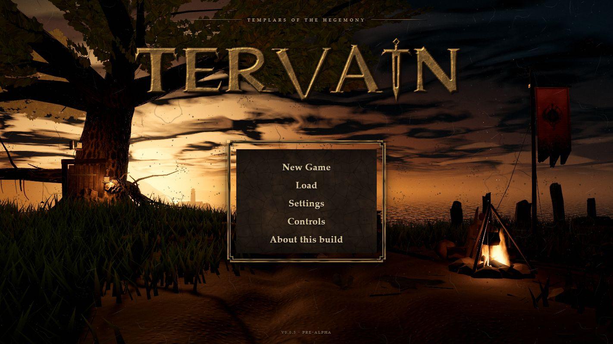
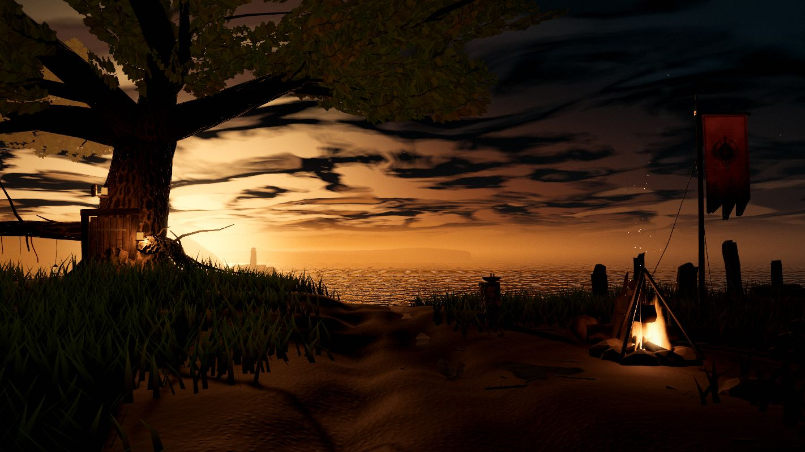
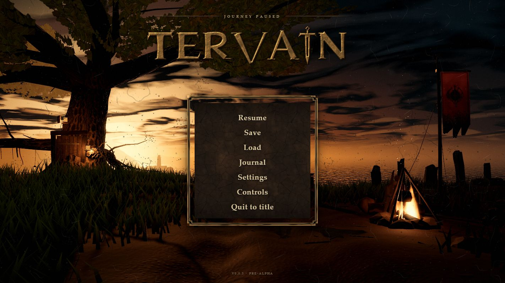
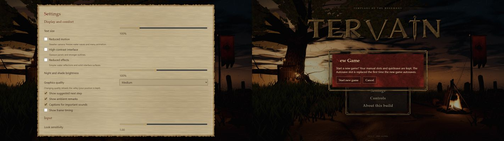

# Tervain 0.0.5 — the menu vigil

Status: **pre-alpha menu rework, 30 September 2026; Claude PR #3 and its late placement/frame follow-up are integrated and locally validated on `f0dc24c`; source published on `codex/0-0-5-templar-forest`, public Pages hosting unavailable (404).** The package version is `0.0.5`, within the `0.0.x` hold ([A15](../../decisions.md)); this is not a promotion. These notes preserve PR #3’s menu-only implementation and reported review, including [placement commit `4e1b30d81a5ddbd66f664384391625299d93705d`](https://github.com/ael-dev3/Tervain/commit/4e1b30d81a5ddbd66f664384391625299d93705d) and [solid-frame commit `48f435dc83d36796737bf79e88cacfc04b5ff624`](https://github.com/ael-dev3/Tervain/commit/48f435dc83d36796737bf79e88cacfc04b5ff624). The [combined 0.0.5 handoff](0.0.5.md) records terrain/audio work and integrated-build validation. Its earlier production-browser review and [dated local benchmark](0.0.5-benchmark.txt) cover `b2a62ab`, before these two follow-up commits; they do not validate the new placement or frame. The later desktop/short-layout production-browser review of [source `f0dc24c`](https://github.com/ael-dev3/Tervain/commit/f0dc24c6885b15534a667ce386bcffe7da8e6d8c) validates the integrated follow-up separately; its actual coverage is recorded in the combined handoff.

## Design requirements

The menu should evoke Gothic 3’s rough, human, imperfect fantasy staging: dust, dirt and mud, expressive forms, and a strong Templar presence in Tervain’s original world. Hyperion informs the setting’s broad themes; neither reference supplies this game’s assets or canon.

Recorded as [A26](../../decisions.md). It replaces PR #2's desert market (A22) for the menu and keeps A21 (Templars within the Hegemony), A24 (exactly one Hegemony banner) and A25 (no outer border; the name Tervain in original lettering with a blade-like I).

## The Gothic 3 study

The installed game's menu files were read locally for measurement and inspiration only: the main-menu and sub-screen backdrops, the GUI theme atlas and its element list, the GUI resource file with the menu layouts, the bundled font, the start screen and loading slides, and the GUI sounds. Decoded copies stayed in a scratch folder; nothing from Gothic 3 is in this repository. The findings (colours, layout, lettering, materials, sounds) and what was and was not taken are in the [look reference](../../art/gothic3-reference.md#the-title-menu).

## What changed

**The scene.** The title and pause menus show a Templar warden's dusk vigil on a headland above the sea:

- an ancient oak-like tree with a hermit's door set into a face adzed flat in its trunk between two buttress roots: lamplight through a barred grille and the gaps between the planks, a lantern on an iron bracket, a pilgrim's staff propped against the post; one great limb is dead and snapped, and two bare low boughs reach out either side of the door with pilgrims' rags and three iron lanterns hanging from them; crows wheel over the headland beyond the crown;
- the warden across a campfire from the viewer, hood up, hands to the flames, his sword driven into the mud beside him; a tripod and pot, a split log, a bedroll, a sack, a woodpile on its bearers, and a waystone with an iron offering bowl by the track;
- a wheel-rutted track of trodden mud with rainwater standing in the ruts and in front of the fire (the water glints with the flames), twigs and straw trodden into it, and heath grass that stirs in the wind;
- a single Hegemony standard on a guyed, crooked pole in a cairn: the approved emblem painted into the cloth, faded, mud-splashed and torn into tails, with the low sun shining through the wool so the embroidered emblem stands dark against it;
- split standing stones on the rise, one fallen in the grass, and a dolmen whose capstone rests on its two uprights; Lantern Point's lighthouse far off on its headland against the sunset with a faint turning beam, wooded hills and a far coast in the haze;
- a painted dusk sky (near-black teal above, one amber band at the horizon, torn cloud lit from below) and a sea with the sun's glitter path, drawn by one dome shader; sparks, smoke, dust and mist.

The scene is built from the playable game's generators and materials (terrain layers, building and bark textures, rocks, the campfire and grass), so it reads as the same world. The warden, the tree, the stones, the rags, the standard and the far country are new procedural geometry. The camera does not move. Everything animated runs on one menu clock that stops completely in Reduced Motion; nothing here advances game state.

**Placement follow-up (`4e1b30d`).** PR #3 records a pass correcting intersections and floating pieces found in close-up surveys from fifteen viewpoints and in telephoto crops from the menu camera:

- The trunk has a flat face adzed into it for the door, as deep as the bark beside the posts, so the frame is set into the wood with bark on both sides; the buttresses step aside to flank it, and no bough or root grows across it. The lit window that floated beside the trunk is gone; the light comes through a grille in the door.
- Roots follow the ground, half buried, and dive at their tips. The low boughs keep head height and their twigs spread instead of hanging into the ground. Rags are knotted just inside the underside of the bough they hang from; lanterns hang clear of the rags and at least 1.5 m above the ground.
- The camp's things have footprints that do not overlap (the warden alone sits astride his log): the sword stands off the log's end, the sack clear of his cloak, the woodpile on bearers on the ground, and the puddle that lay under the bedroll now lies in front of the fire.
- Every placed piece claims its ground, and scattered field stones, litter and grass keep out of it: nothing grows through a stone, a root, the door step, the cairn or a peg.
- The fallen standing stone lies along the slope of the turf; the dolmen's capstone is a closed slab resting a few centimetres into its uprights' highest points.
- The crows' circles keep out of the crown. Land below the waterline is left to the sea, so shores are clean lines; the far hills' height grids reach past their outlines, the far coast sinks into the sea at its ends, and the lighthouse's foot and the keeper's house run down into the rock.

**The interface.** A small spaced line of text, then the cast name standing directly on the panel of choices, the two centred together; the build in small print:

- **TERVAIN** is cast in pitted, tarnished bronze: chipped edges, hammered faces, bevels rubbed bright in places, verdigris and dirt in the hollows, a hard shadow. The I is a sword standing point-down. The letterforms are original; the casting uses seeded deterministic construction at start-up. Startup timing and pixel equality across devices were not verified.
- The choices sit in dark oiled leather held in a solid cast-bronze frame: a rail with stepped corners, a recessed face with a boss at each corner, an inner bead and a verdigris lip, filled from edge to leather so frame and panel are one piece with no scene showing between them. The choices are tooled into the leather as cells laid edge to edge. A selected choice is marked by rubbed leather, a thin brass line and two small iron marks; there is no glow (A17).
- Forms (Settings, Load, Controls, About, the journal and other records) are torn, browned parchment. The new-game confirmation is oxblood leather in the same solid frame and opens in the panel's place; the choices never show beneath a form or a confirmation.
- Dust, lint, stains and fine scratches lie over the title screen, and the menu picture has more grain and vignette than play. The loading screen uses the same surfaces.
- Lettering uses a common old-style serif (Palatino class), slightly roughened by an SVG displacement filter. No display font is bundled: adding a licensed face would need an approved download and a licence record.

High contrast gives an opaque black panel with white outlines and text and removes the overlay and roughening; Reduced Effects removes the overlay and roughening. The panel widens and the cast name shrinks as the text size grows, and the whole column scrolls rather than clipping a choice.

**Sound.** No new synthesized tones (0.0.4 removed them pending reviewed recordings). The menu now plays the existing procedural wind and distant-surf beds as an open headland rather than as a roofed courtyard.

**Removed.** The desert market scene and its trade-goods geometry and tests. The menu cloth wind (`menuWind.ts`) is kept and now moves the standard.

## Implementation

- Scene: [menuScene.ts](../../../src/presentation/menuScene.ts) with [sky and sea](../../../src/presentation/menu/menuSky.ts), [layout](../../../src/presentation/menu/menuLayout.ts), [ground, puddles and grass](../../../src/presentation/menu/menuLand.ts), [tree](../../../src/presentation/menu/menuTree.ts), [warden](../../../src/presentation/menu/menuFigure.ts), [camp](../../../src/presentation/menu/menuCamp.ts), [standing stones](../../../src/presentation/menu/menuStones.ts), [fire](../../../src/presentation/menu/menuFire.ts), [standard](../../../src/presentation/menu/menuBanner.ts), [rags](../../../src/presentation/menu/menuRibbons.ts), [far country](../../../src/presentation/menu/menuFar.ts) and [air](../../../src/presentation/menu/menuAir.ts).
- Interface: [wordmark casting](../../../src/presentation/ui/menuArtwork.ts), [menu surfaces](../../../src/presentation/ui/menuMaterials.ts), [menu view](../../../src/presentation/ui/menuView.ts), [styles](../../../src/style.css); the app switches the grade to the menu look and back ([grade](../../../src/presentation/grade.ts), [app](../../../src/app.ts)).
- Tests: [scene](../../../tests/presentation/menuScene.test.ts), [pieces](../../../tests/presentation/menuPieces.test.ts), [wordmark and surfaces](../../../tests/presentation/menuArtwork.test.ts).

The emblem is loaded unchanged from the path recorded in the [asset inventory](../../engineering/asset-inventory.md#approved-hegemony-menu-emblem-30-september-2026); weathering is applied to a runtime canvas copy. It appears on the one standard and nowhere else.

## Menu-only checks recorded in PR #3

These are the upstream menu revision’s reported checks. The late placement/frame changes subsequently passed local combined-build QA on `f0dc24c`; final results belong to the [combined handoff](0.0.5.md). Source is published in the repository, while public Pages hosting is unavailable (404).

- PR #3 records passing `npm run typecheck`, `npm test` and `npm run build`. See the pull request for the test count and bundle size of that reviewed head.
- CPU-only tests cover: finite geometry and a bounded budget on every preset; exactly one standard; a still camera across resizes and the widened view on narrow screens; an exact Reduced Motion freeze that resumes on the same clock; the emblem printed on arrival and the scene intact when it never arrives; idempotent disposal with a late emblem after teardown; ground standability, normalised terrain weights, puddles in ruts, and no fully submerged triangles; a deterministic tree within bounds; closed standing-stone slabs; the warden's size and stillness; emblem weathering that never repaints transparent pixels; a deterministic wordmark with a clear background and uneven metal; grime coverage, a frame solid from its edge to the leather with an open centre, notched corners and seamless sides, a wordmark trimmed evenly to its letters, and a seamless parchment middle.
- Placement tests cover: no bark, bough or root in front of the door, and bark reaching the posts on both sides; roots half buried along their length with buried tips; low boughs and twigs overhead, never between knee and chest height away from the trunk; standing stones clear of one another and sunk at every corner, the fallen one on the turf along its length, the dolmen's uprights just inside its cap; the camp's footprints and the puddles apart; crows' circles outside the crown.
- Headless Chrome captures at 1280 × 720, 1422 × 800, 1920 × 1080, 2560 × 1080, 355 × 711 and 888 × 356; High Contrast with Reduced Effects; 180% text; title, pause, Settings, About and the new-game confirmation. The placement pass was reviewed in close-ups from fifteen viewpoints round the camp, the tree, the stones, the standard and the coast, and in telephoto crops from the menu camera. Arrow keys move focus through the choices. Enter and Space rely on native button activation, unchanged from PR #2 and not re-verified with a physical keyboard. Browser error logs were empty.
- Construction counts at the Medium preset in headless Chrome: about 225,000 scene triangles, 32 meshes, 52 draw calls and 26 shader programs for a menu frame. These are counts, not a frame-rate result.

## Not verified

For PR #3’s menu-only review: no reference-hardware or frame-rate measurement, physical controller, Safari/Firefox capture, or mobile GPU. Graphics-preset rebuilding was type-checked but not captured there; that visual review used headless captures. The later `b2a62ab` combined build did complete a local Medium → Low → Medium rebuild and a dated Mac benchmark, recorded separately in the [combined handoff](0.0.5.md). The two late upstream commits subsequently passed local combined QA on `f0dc24c`, including desktop and short layouts, title/new-game confirmation, silent arrival, pause/Settings/Back/Resume, graphics rebuilding, and a running audio graph. That review is recorded separately; it does not extend the earlier benchmark to the revised menu.
