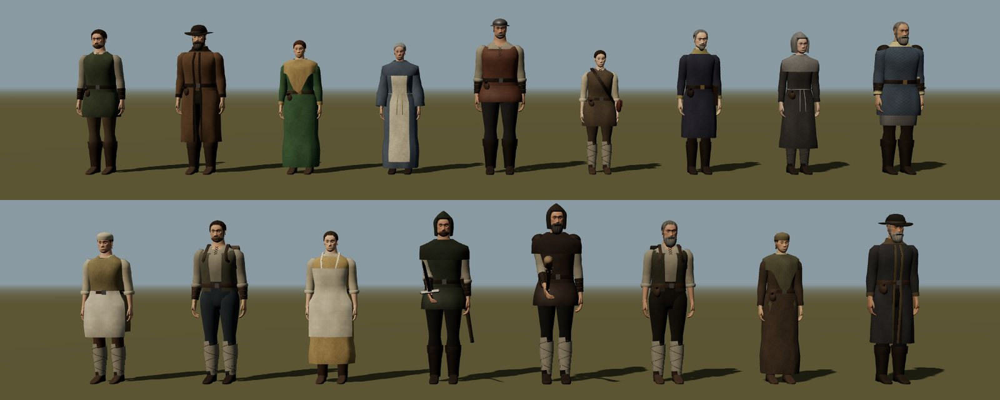
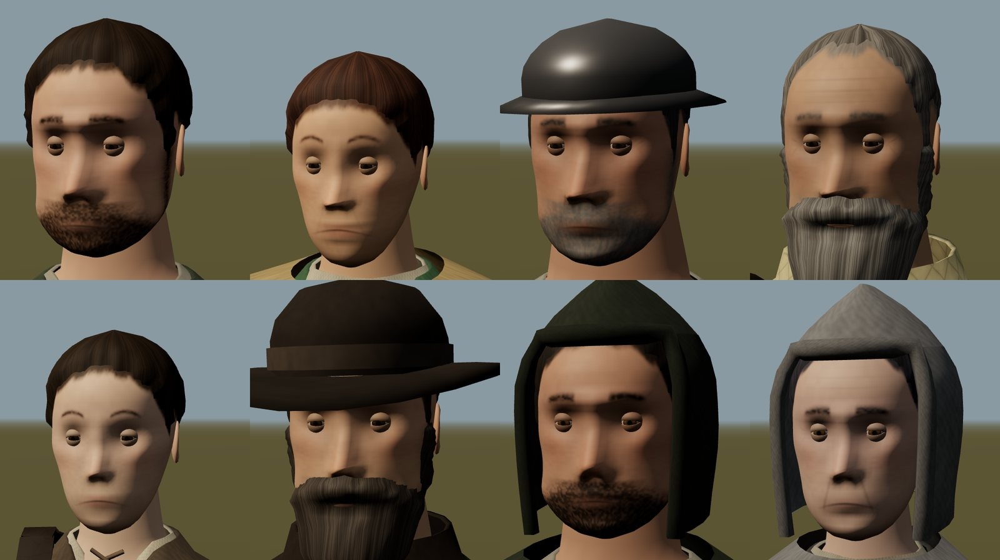
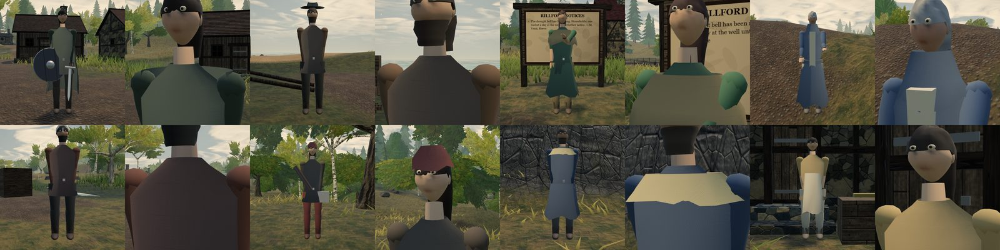
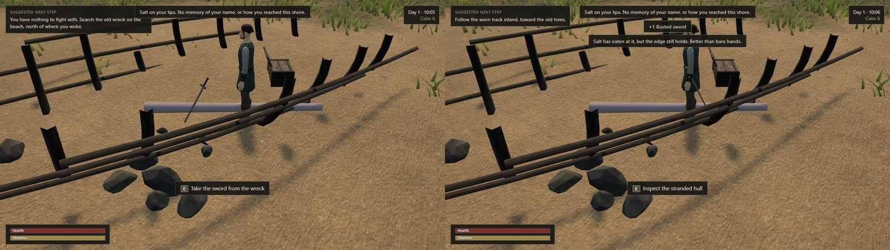
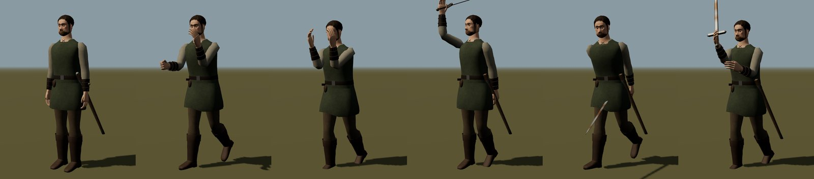
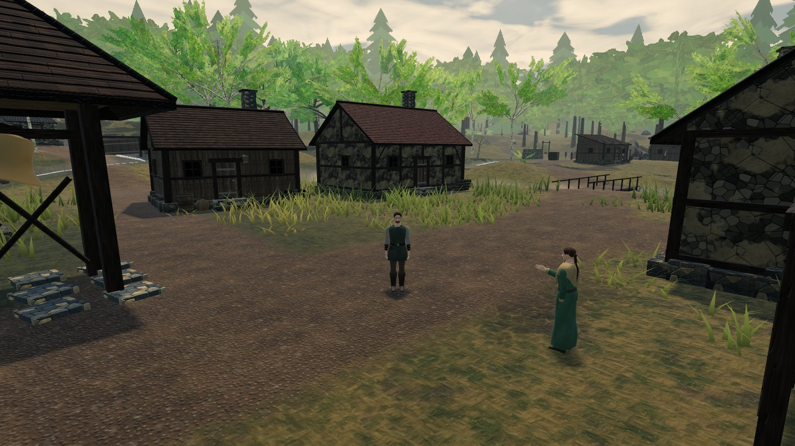

# Tervain 0.0.5 — Gothic-style people and an unarmed start

Status: **pre-alpha character rework, 30 September 2026; implemented on the combined `0.0.5` revision (forest opening and menu vigil) and locally reviewed in a pull request; publication pending.** The package version stays `0.0.5`, within the `0.0.x` hold ([A15](../../decisions.md)); this is not a promotion. These notes cover the people and the start of play; the menu is recorded in the [menu vigil notes](0.0.5-menu-vigil.md).

## What the owner asked for

> Please do the same job and study local Gothic 3 NPC files and make player character and NPC characters a lot more like Gothic 3. At the start of the game our main character should not have weapons or shields. Study how Gothic games do it.

The request came with the owner's own deep study of the installed game's NPC geometry. It is recorded as [A28](../../decisions.md); how the first weapon is found, and the builds and costumes given to named people, are proposals ([P16, P17](../../decisions.md)).

## The Gothic 3 study

The installed game's actor files were read locally for measurement and inspiration only (A14); decoded copies and rasterised views stayed in a scratch folder and nothing from Gothic 3 is in this repository. The findings and what was and was not taken are in the [look reference](../../art/gothic3-reference.md#people). In short:

- Gothic 3's people are **modular, skinned actors**: a body, a separate head with its own eye and mouth regions, and separate hair and beard meshes on one skeleton. Named people reuse the parts (Ardea's Jack is the Peasant body with Zuben's head).
- Bodies are a few thousand vertices; heads up to about 3,500; the costume's silhouette carries the role, and **faces are painted**: hair on the scalp, heavy brows, stubble, shadowed sockets.
- Proportions measured on the ordinary bodies (fractions of stature): crotch 0.50, waist 0.65, chest 0.74, shoulders 0.83, shoulder span 0.29, arm 0.38; the head is about an eighth.
- The hero's template carries **only a head and a body**: no weapon, no shield. The crudest weapons in the data, by name, are a stick (1.4 m long), a club (0.9 m) and a rusty one-handed sword (1.1 m).

## What changed

**People are rebuilt the way Gothic 3 builds its actors**, all generated in code at load:

- **One skeleton per person** (hips, torso, head, both arms and forearms, both thighs and shins), and every body, garment, head and hair shell is a skinned mesh on it. Shoulders, elbows, knees and hips bend without gaps; skirts, robes and coat tails follow the thighs, so a seated reeve's dress drapes over her lap. A person is 7–10 skinned meshes (one per material) plus any blade or scabbard.
- **Proportions** follow the measured bodies above. The head sits low on a thick neck; hands are working hands with fingers and a thumb, a little large for the frame.
- **Heads** are lofted through horizontal sections and sculpted: brow ridge, eye sockets, a nose with wings and a hook on some, lips, cheekbones, jaw and chin, all from a per-person face seed and build. **Eyes** are eyeballs set into the sockets behind upper and lower lid shells (heavy upper lids, a dark lash line). **Ears** are cupped and rimmed.
- **Faces are painted** into each head's own texture (256²): mottled outdoor skin, warm cheeks, nose and ears, shadowed sockets, brows, nostrils, lips and the line of the mouth, age lines, stubble, a painted short beard, and hair painted on the scalp so the hairline is soft. **Hair and beards** are shells grown from the same surface: short and cropped hair, a tail, a bun, and a braid down the back for long hair; full beards, goatees and moustaches stand off the jaw over their painted growth.
- **Clothes are layers** offset from the body, each ending in a turned edge: shirts (crew, laced or open necks; long, rolled or short sleeves), trousers tucked into turned-down boots or bound with crossed leg wraps over shoes, and one outer garment (tunic, jerkin, vest, gambeson, coat, dress or robe), then a belt with its buckle, pouch or knife, and what the role adds: bracers, leather pauldrons, a mail hauberk, an apron (with a bib), a triangular shawl crossed to the belt, a scapular, a cloak, a hood with a soft point, a cowl, a headscarf, a felt hat, an iron kettle hat, a pack, a satchel on a crossbody strap, a ledger. Linen, wool, leather, felt, quilted padding and mail each carry a tiling detail map.
- **Each named person has an authored costume** from their look, faction and trade (proposal P17): the caravan master in a long open coat and felt hat; the reeve in a dress with a gold shawl and a braid; Sister Edda in a robe and cream scapular with a cord belt and cowl; the foreman in a laced leather jerkin and kettle hat; Ila in a short tunic with leg wraps and a satchel; the estate steward in a closed coat with a ledger at the belt; the ash recorder hooded in grey; the warden in a quilted gambeson over mail, with pauldrons, bracers and his sword sheathed; the mill hand and baker in aprons; the quarry hand with a pack. Toll-jumpers are hooded in hard-worn leather; one carries a rusty sword, the other a nailed club. The fisher, the woman at the fire and the lighthouse keeper are dressed from their looks.
- **Builds** are a proposal (P17): women and men where the docs and dialogue already use pronouns; the mill hand, the baker and the ash recorder have a neutral build until the owner decides. Beards grow only on the men.

**The wanderer arrives unarmed** (A28), as the Gothic heroes do, and nothing hangs at the hip:

- Until they find a weapon they fight with **fists** (proposal P16): quicker, shorter and weaker than a blade (7 and 15 damage against 19 and 42, 1.6–1.8 m reach against 2.35–2.7 m), and a guard of raised forearms softens a blow (60% lands, 85% when tired, 35% with perfect timing) but never parries.
- The first guidance says so: *You have nothing to fight with. Search the old wreck on the beach, north of where you woke.* A **rusted sword** stands point-down in the sand inside the storm-wreck on the arrival strand, beside a stove-in sea chest, its hilt above the side planks. Taking it moves the guidance on to the woodland track; walking into the Deepwood without it also moves it on.
- With a blade the wanderer wears it **sheathed on the left hip** and draws it the moment they attack, raise their guard or a hostile engages them; after six quiet seconds it goes back into the scabbard. A drawn blade parries on a perfect block, as before.
- Nobody carries a shield any more; **Steady Guard** now speaks of holding your guard, blade or bare arms.
- A save made before this change (content revisions 0.0.1–0.0.4, the first 0.1 prototype, and the forest opening's `deepwood-proto-0.0.5`) was made by a wanderer who already carried a blade: loading it hands them the wreck's sword and marks the wreck searched. The content revision is now `deepwood-proto-0.0.5-unarmed`.

**Poses** were remapped for the new skeleton (the right hand holds the weapon), with separate fist and blade versions of the light and heavy attacks and the guard: a jab from a boxer's guard and a swinging hook without a blade; a forehand cut and an overhead two-handed blow with one.

**Tools.** `tools/people.html` (served by `npm run dev`, not part of the build) lines up every person under daylight, with `?only=`, `?pose=`, `?t=` and `?armed=` and views for the whole figure, the face, the hands and the feet. `tools/shot.mjs` now waits for the game correctly (its READY check had no `return` under `tools/cdp.mjs`'s wrapper and always timed out).

## Implementation

- [Skinned geometry](../../../src/presentation/human/skin.ts), [the frame and its weights](../../../src/presentation/human/frame.ts), [head shape](../../../src/presentation/human/headShape.ts), [head, eyes, ears, hair and beards](../../../src/presentation/human/head.ts), [painted faces and detail maps](../../../src/presentation/human/humanTex.ts), [clothes](../../../src/presentation/human/dress.ts), [costumes](../../../src/presentation/human/outfits.ts); rigs, weapons and poses in [characters.ts](../../../src/presentation/characters.ts); styles in [npcStyle.ts](../../../src/presentation/npcStyle.ts).
- The unarmed start: [player](../../../src/presentation/player.ts) (fists, blade, sheathing, guard), [items](../../../src/content/items.ts), [layout](../../../src/world/layout.ts) (the wreck's pickup), [the wreck and the sword](../../../src/presentation/settlement.ts), [hints](../../../src/game/hints.ts), [save loading](../../../src/platform/storage.ts), [strings](../../../src/content/strings.ts) and [Steady Guard](../../../src/content/dialogue.ts).
- Tests: [people](../../../tests/presentation/people.test.ts), [the unarmed start and old saves](../../../tests/scenarios/unarmed.test.ts), [NPC styles](../../../tests/presentation/npcStyle.test.ts), and a route from the strand to the wreck in [world](../../../tests/scenarios/world.test.ts).

## Checks

- After merging the forest opening: `npm run typecheck`, `npm test` (314 tests in 34 files) and `npm run build` pass. The production bundle is 1,240 kB JS / 376 kB gzip, against 1,189 kB / 357 kB recorded for the combined revision without the people ([0.0.5 handoff](0.0.5.md)); it now crosses Vite's 1,200 kB advisory chunk-size warning. Nothing is code-split here. See the pull request for the reviewed head.
- CPU-only tests cover: every named person on one eleven-bone skeleton with finite positions and skin weights that sum to one; feet on the ground, a man of height 1 standing about 1.8 m with a head about an eighth of it; the wanderer built with nothing in hand or at the hip, and a blade that sheathes and draws; armed toll-jumpers and the warden's sheathed sword; finite bones through walking, attacks, the guard, sitting and falling; fists weaker, shorter and quicker than a blade and unable to parry; a deterministic painted face whose hair, beard and mouth fall where the sculpt puts them; an invertible head parameterisation; detail maps near their garment's colour; no beard on a woman or neutral build; the unarmed start, the wreck's guidance, a single take of the sword, and old and current saves.
- Headless Chrome captures of the lineup (whole figures, faces, hands, feet, sitting, combat poses) and of the game (after the merge: the view from the landing to the wreck, the walk up to the hull, the wreck before and after taking the sword with the guidance, prompt and toast, and Rillford's square; before it, resident portraits). Browser error logs were empty apart from Direct3D shader-compiler precision warnings.
- Construction counts in headless Chrome on this machine: 7,200–10,400 vertices, 12,300–17,100 triangles and 7–14 meshes per person (inside the [10,000–20,000 triangle budget](../../art/art-audio-ui.md#provisional-production-budgets-and-acceptance)); painting one 256² face about 28 ms, building the 14 story characters about 0.35 s. These are development measurements, not a load-time or frame-rate result.

## Not verified

No reference-hardware, load-time or frame-rate measurement; no physical controller; no Safari, Firefox or mobile GPU; the feel of fighting with fists at the ford and the reach of the new blade were not play-tested. The look was judged from headless captures only.

## Known limits

No facial animation or lip movement; no cloth simulation (skirts follow the thighs, not the shins, so a kneeling shin can show through a hem); the blade can pass through the body in some attack frames and the left hand does not close on the hilt in the overhead blow; hats, hoods and helmets are fitted to each head but not tested against every pose; no person reacts to a drawn weapon yet; the braid and hair are rigid.
