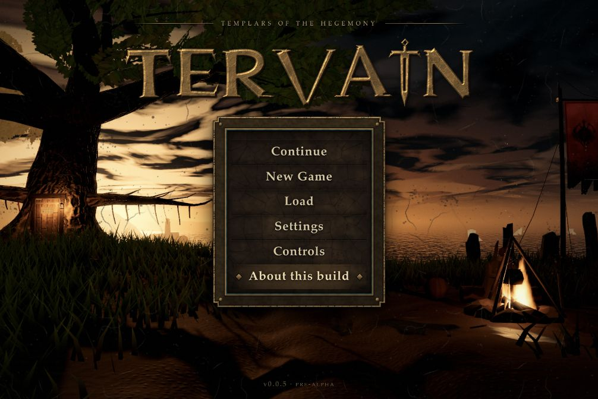
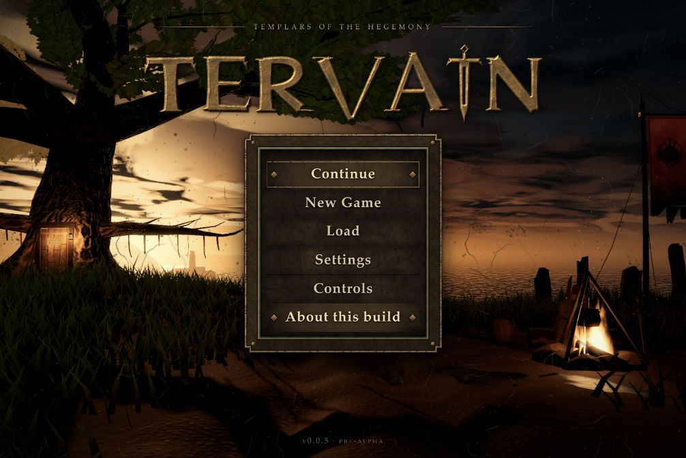
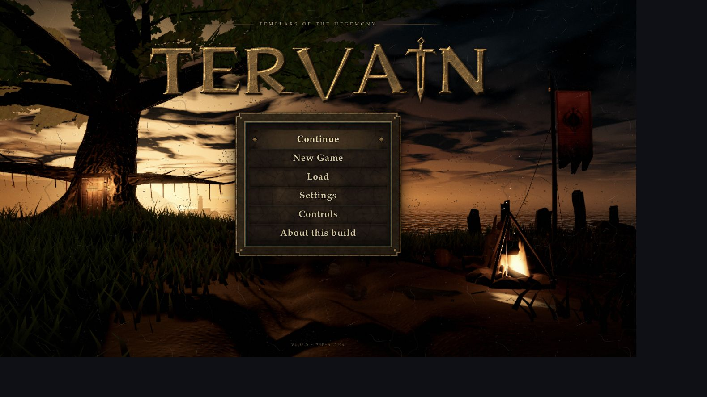

# 0.0.5 — The quiet strand and Templar deepwood

This patch combines the amnesiac forest arrival (A27), Claude's approved Templar vigil menu (A26, PR #3), the owner's road, terrain, camera and audio corrections, **The Sovereign's Oath** menu score (A28), and seeded distant ship traffic (A29). The version remains `0.0.5`; the owner has not approved `0.1`.

Implementation and local validation are complete, and the source is published in the repository. Public Pages hosting is currently unavailable; see the publication record below. The earlier [0.0.4 handoff](0.0.4.md) and [vigil menu handoff](0.0.5-menu-vigil.md) describe their own revisions and are not substitute proof for this combined build.

## The opening

A new game starts on dry sand at **(-268, 27)** at 07:30, with salt on the protagonist's lips and no memory of their name or arrival. The character faces the first inland track point. There is no automatic conversation or dialogue window.

The shoreline remains sparse. The occupied camp, trade wagon and coastal cottages have moved inland; the distant lighthouse and an abandoned wreck remain environmental landmarks. A continuous worn-earth trail, about **4.2 m wide**, enters layered old-growth woodland before reaching the first hamlet and then Rillford. A native timber fingerpost beside the coast/trail junction reads **RILLFORD → / INLAND ROAD**, with independently readable painted faces and a solid arrow pointing inland. It stands clear of the lane.

Four weathered trail-countermarkers and an open ruined shelter suggest older journeys through the wood. They use original stonework and generic shallow cuts, without inventing a second faction emblem or assigning unapproved history. The cause of the amnesia and the order's detailed doctrine remain proposals.

NPC interaction in this exploration pass is **observation only**: a short nonblocking remark, with no acquaintance, trust, consent, or hidden quest choice. Journal, map, inspection and record panels remain opt-in. The retained quest graphs are future framework, not a claim that the full dialogue-driven quest loop is playable in this patch.

## Woodland and relief

Tall pines and firs overlap spreading oaks, with a lower birch layer. Oak trunks have connected flared roots, branch morphology is stable across LODs, and the forest floor adds native ferns, moss, litter, fallen timber and fungi. Tree and leaf sway remains paused.

Three low wooded hogbacks and a winding dry swale add changing silhouettes, banks and hollows beside the trail. The quiet beach profile, graded road, occupied building terraces and navigation remain authoritative. Ground colors, local haze and floor population share one woodland mask. Small drifting pollen and night insects freeze under Reduced Motion.

Graphics presets thin decoration and change rendering detail while retaining canonical blocking trunks. Distant trees use 32–36 triangle silhouettes. Tree/floor instance selection skips unchanged camera views; turns, movement and projection changes still refresh visibility. Water capture/copy and the second scene traversal are bypassed when conservative transformed water bounds are outside the camera frustum; sea reflection also requires sea visibility. Turning back toward water retains and reuses capture targets. Middle-distance broadleaf leaves retain cheap connected twig support, checked against actual wood triangles. These are implementation facts, not a device frame-rate promise.

[Boring Forest](https://boring-forest.vercel.app/) was studied for layered canopy, large enclosing trunks, fern/moss banks, cool depth haze and warm backlight. Its public rendering approach uses quality-scaled density, instancing, LOD, foliage backlighting and haze. Tervain implements its own geometry, materials and population. No reference source, shader, model, texture, rune or floating monument was imported. Reference walking was limited by the in-app browser's pointer-lock failure; its initial render and public client implementation were inspected.

## Approved menu integration

Claude's [PR #3](https://github.com/ael-dev3/Tervain/pull/3) is integrated with its source history. It supersedes the desert market: an ancient tree with a root doorway, a hooded warden, fire, muddy wheel ruts, standing stones, a distant lighthouse, dusk sea and **one** weathered Hegemony standard. The camera stays fixed; cloth, fire, smoke, sparks, crows and air move gently and freeze in Reduced Motion.

The original TERVAIN casting uses pitted bronze, tapered lettering, and a blade-I. The viewport has no outer border. Native choices sit in the approved leather well with a bronze rim; forms use parchment and the new-game confirmation uses oxblood. The approved September 27 emblem stays on the single native banner. Hyperion and Gothic 3 inform atmosphere and structure; no lettering, assets or canon from either is shipped.

### Living sea traffic

The A29 follow-up adds a modest fleet behind the menu: three originally authored low-poly sailing vessels on Medium/High, two on Low. Faceted closed hulls, cabins, masts, yards, stays and unequal sail plans form native geometry; no external model or texture is imported. Small pinned sail flutter, restrained hull bob and faint wakes share the menu clock. The camp, monumental title and single Hegemony standard remain the focus; the ships carry no extra emblems.

The randomization script is [menuShips.ts](../../../src/presentation/menu/menuShips.ts). Every actual title/pause opening receives a new seed from browser entropy, with a local time/counter fallback. The generator uses that seed once to choose opposing lateral crossings and an oblique voyage, speeds, sizes, starting phases and depths. Movement samples the routes deterministically; there is no per-frame random steering. Initial bearings are spaced in the visible sea beside the controls, and the full voyages remain seaward of the lighthouse, wooded hills and opposite coast. Invisible endpoint fades permit recycling without a visible jump.

Nested forms retain the same visit. Graphics rebuilds preserve the seed and elapsed phase; Low uses the same first two vessels and removes the third. Reduced Motion freezes hulls, sails, wakes and route time, then resumes from the held pose. This is menu presentation only, with no naval gameplay, approved ship factions, save change or in-world simulation.

The fleet adds **1,312 triangles and six draw passes** on Medium/High (including wakes), or four passes on Low, with no new image textures. Shared wake geometry and merged vessel bodies keep the fleet small; reseeding reuses resources. These are resource counts, not mobile frame-rate evidence.

The full suite passes **316 tests across 33 files**, with typecheck and production build passing. Ship tests cover seeded variety, opposing headings, quality continuity, pace, fade-before-wrap, actual far-land clearance with hull margins, initial visibility, resource reuse and disposal. Scene tests cover freeze/resume and rebuilding at the retained ship phase. Production-preview browser review confirms modest visible silhouettes, fresh title/pause seeds, retained nested-form traffic, a frozen 64.3-second phase across Low → Medium rebuilds, and resumed movement with Reduced Motion disabled. Final settings are Medium with Reduced Motion off; captured warning/error logs are empty. A quick return from gameplay during the score fade now restores truthful playback diagnostics without restarting the media stream. The build is **1,202.15 kB JS / 360.82 kB gzip**, **20.58 kB CSS / 5.67 kB gzip**, 118 modules. Vite reports its existing 1,200 kB chunk-size advisory; this change adds about 7.8 kB minified JS, and does not change that warning threshold. Reference-device/mobile performance remains unverified. The full-song video remains paused.

## Camera and audio

The follow camera now avoids canonical tree trunks instead of passing through them. It queries candidate obstructions once for the entire boom, pulls in immediately, and lengthens gradually when an obstruction clears. Leaves remain nonblocking.

Procedural ambience uses six-second, seam-overlapped noise with DC removed and reserved peak headroom. Four voices share the buffer with distinct offsets and playback rates. Positive surf envelopes scale with actual sea proximity, so an inland character does not hear distance-independent surf modulation. Volume input is clamped, muted startup stays muted, and failed device initialization does not interrupt play.

Audio automation follows the audio clock at at most ten updates per second, skips unchanged targets, and replaces pending ramps. Hidden/suspended contexts do not accumulate updates. Sources and nodes have explicit idempotent teardown. Footsteps and contact/UI cues remain quiet placeholders; ordinary exploration has no recorded music. The approved menu score is documented separately below.

### The Sovereign's Oath

The owner supplied **The Sovereign's Oath.m4a** and approved its use in the menu and delivery to main within `0.0.5`. The actual song is **214.2 seconds (3:34.2)**. Its byte-identical original is archived outside the runtime build. The browser prefers an audio-only Ogg/Opus remux without codec re-encoding; AAC/M4A is the compatibility fallback. See the [source record](../../engineering/menu-score.md) and [file manifest](../../engineering/menu-audio-assets.json) for hashes, creation disclosure and the specific project-use instruction. No general open license is asserted.

One lazy streaming media element feeds the Music and Master buses through a 0.8 gain for headroom. Browser-safe interaction unlocks playback, with a small accessible footer cue when necessary. Title, pause and nested menu forms share the loop and playback position across quality rebuilds. Entering the world fades out and pauses after 900 ms; repeated gameplay input cannot postpone that deadline. Returning to a menu resumes from the retained position. Hiding or muting pauses immediately. These lifecycle rules do not add an in-world score.

Local validation passes typecheck, **307 tests across 32 files**, and the production build. The 23 audio tests include the stream, codec fallback, gesture rejection, mute/visibility, disposal, pending-play races and repeated-input pause deadline. Browser review confirms the selected track plays with a 214.2-second duration; Music mute preserves position, unmute resumes, nested forms and Low → Medium rebuilds retain playback, and gameplay/pause/title transitions work. Final Music/Master settings are restored to 55%/80%. Captured warning/error logs are empty. Non-Chromium playback and subjective listening on reference hardware remain unverified.

Latest music build: **1,194.29 kB JS / 357.95 kB gzip**, **20.58 kB CSS / 5.67 kB gzip**, 117 modules. Audio assets are separate streamed files, not in those bundle totals. The earlier environment validation and benchmark below retain their original source and scope.

The [local recorder](../../../tools/README-menu-film.md) uses the native animated menu scene and original procedural UI artwork at 1920×1080, with a separate full-song audio mux. Its five-second VP9 motion test completed and its image composition and motion were inspected. **The owner paused video work before the full-song recording started.** No complete-song video is delivered or claimed; the source tools and local test are retained for continuation. The recorder is outside the production bundle and its server is stopped.

## Save compatibility

The save envelope remains format 1. Existing 0.0.4 saves retain their position, inventory, quest/evidence, acquaintance/trust, permissions and door state. Amnesia is added to new games only. Compatibility tests cover old saves as well as the new silent opening.

## Validation

- Integrated typecheck and production build pass.
- The full automated suite currently passes **296 tests across 32 files**, including the late menu integration. It covers arrival, observation without quest effects, save compatibility, actual resident/landmark/tree collisions, route clearance, sign geometry, terrain pads, connected fern geometry, LOD morphology, camera obstruction, idle buffer uploads, audio signal/scheduling/lifecycle contracts, and the approved menu's geometry/materials/freeze/disposal.
- All **846** centre/side corridor samples and **38** arrival, NPC schedule, hamlet and lighthouse navigation links pass on each graphics preset with actual ambient resident colliders installed. The visual trail is 265.21 m long, rises from 0.50 to 7.85 m, and has maximum rise/run slope 0.279. Three off-road crests reach elevations 14.26, 13.51 and 3.66 m; occupied building pads stay level.
- Final production bundle after the late menu integration: **1,189.27 kB JS / 356.61 kB gzip**, **20.33 kB CSS / 5.62 kB gzip**; 117 modules, source `f0dc24c`.
- Whole-world tree/shrub placements, High/Medium/Low: **1,462 / 1,341 / 1,210**. Canonical blocking trunks: **1,026** on every preset, with none in the 34 m shore buffer. Forest-floor pieces: **1,434 / 991 / 545**. Native landmarks and sign: **3,006 triangles / 15 meshes**. These are authored resource totals, not visible-frame triangle counts.
- Production-preview browser checks pass for the combined menu → new game → pause → Settings → Back → Resume flow. The gameplay grade and HUD return; the new game has the amnesia fact and no dialogue window. Low → Medium scene rebuilds completed. The audio graph reports four running voices at 48 kHz; its device-reported 5.3 ms base buffer is not an end-to-end latency measurement. No warnings or errors were captured in the final browser review.
- A fixed 72-second camera route passes on source revision `b2a62ab`: **4,321 frames, median 16.70 ms, p95 17.10 ms, p99 17.50 ms, maximum 17.7 ms**. Device/browser: Mac, ANGLE Metal Apple M5, Chromium 154 in the Codex in-app browser; Medium quality, 1422×800 CSS viewport, DPR 0.9, Reduced Motion/Effects off. This follows the beach, wood and wider valley with the clock advancing; it is not a physical walk, pinned-time comparison, or mobile acceptance run. Animation-frame intervals are constrained by display refresh. The [complete report](0.0.5-benchmark.txt) retains the procedure and final-frame counts.

### Latest Claude menu follow-up

The two commits added during the combined review are included with their history: `4e1b30d81a5ddbd66f664384391625299d93705d` (placement) and `48f435dc83d36796737bf79e88cacfc04b5ff624` (panel). The doorway fits a cut tree face, roots follow the ground, hanging cloth and lanterns keep clearance, camp footprints exclude grass and stones, and the dolmen and lighthouse rest on their supports. Crows avoid the crown. The solid bronze molding meets the leather, choice cells meet edge to edge, and the evenly trimmed title sits on its panel. A title form or confirmation replaces the choices beneath it.

The combined follow-up passes typecheck, all **296** tests, and the production build. Browser review of `f0dc24c` covers the desktop and short layouts (1422×800 and 938×433 CSS), title confirmation, new game, pause, Settings/Back/Resume, and Low → Medium rebuilds. The four-voice audio graph stays running after the rebuilds; captured warning/error logs are empty. The gameplay forest, route, audio and water code is unchanged by these two menu commits. The earlier `b2a62ab` benchmark retains its original scope and is not a new measurement of the revised menu. The earlier [integrated menu capture](../../art/previews/0.0.5-integrated-menu.jpg) is historical.

The [landing](../../art/previews/0.0.5-landing.jpg), [road sign](../../art/previews/0.0.5-road-sign.jpg), [deepwood](../../art/previews/0.0.5-deepwood.jpg) and [inland hamlet](../../art/previews/0.0.5-inland-hamlet.jpg) captures show the integrated composition. Those environment captures precede the final invisible-water optimization and supporting-twig correction; they are framing checks, not final-build performance evidence. Authored screenshot parameters placed the camera for inspection; full-route physical walking was not verified in this browser. Automated navigation checks cover the continuous corridor and resident links.

## Publication

The sea-traffic follow-up is published for review in [PR #8](https://github.com/ael-dev3/Tervain/pull/8), implementation revision `e694b9d`, with the same `0.0.5` version. It is not merged to main. Local typecheck, all 316 tests and production build pass; the preview above records the rendered ships. The initial [PR workflow 36765400025](https://github.com/ael-dev3/Tervain/actions/runs/36765400025) has no build steps or assigned runner. Its annotation again reports failed recent account payments or a spending limit requiring increase. Hosted validation did not execute; no code-test failure is inferred. No billing, hosting or branch-rule override is changed.

The menu score, unchanged source archive, runtime derivatives, provenance, and prepared local recorder are delivered through [PR #6](https://github.com/ael-dev3/Tervain/pull/6), retaining `0.0.5`. Its local checks pass on source `42ebe64`. The initial [PR workflow 36761849757](https://github.com/ael-dev3/Tervain/actions/runs/36761849757) has no build steps: GitHub again reports failed recent account payments or a spending limit requiring increase. This is a runner restriction, not an executed code-test failure. The linked PR records the authoritative merge status. No billing, hosting, repository visibility, or branch-rule override is changed. Video work remains paused at the owner's request.

The combined patch was merged through [PR #4](https://github.com/ael-dev3/Tervain/pull/4) on 30 September 2026 at 17:06 UTC, main revision `db2a356c062f5e65fa29cf3f642fc6498f57c013`. Its GitHub PR build passed. The late menu source from PR #3 is published on `codex/0-0-5-templar-forest` and recorded in [PR #5](https://github.com/ael-dev3/Tervain/pull/5), with the same `0.0.5` version and the additional validation above. The linked PRs retain the authoritative merge status and source history.

[Main workflow 36749005389](https://github.com/ael-dev3/Tervain/actions/runs/36749005389) passed typecheck, tests, build and artifact upload, but Pages deployment failed while polling a deployment that returned 404. Subsequent repository metadata reports `private: true` and `has_pages: false`; the Pages configuration and public play URL also return 404. The earlier site succeeded at 07:53 UTC, but the exact settings or eligibility change is unconfirmed. This is source/local delivery, not a claim that the public playable site is live. Repository visibility and hosting settings were not changed. Restoring hosting is a separate owner decision.

The later [PR #5 workflow 36750619612](https://github.com/ael-dev3/Tervain/actions/runs/36750619612) did not start any build steps. Its GitHub annotation reports failed recent account payments or a spending limit that needs increasing. The specific account condition was not independently verified. This runner restriction is separate from the passing local checks and the earlier successful PR #4 build; it is not reported as a code-test failure or a successful final GitHub CI run. Billing was not changed, and no branch-rule override is used.

Automated audio tests prove signal and graph contracts; they do not constitute a subjective listening session or hardware-latency measurement. Reference-device performance, physical controllers, Steam packaging and non-Chromium browser coverage remain unverified.
