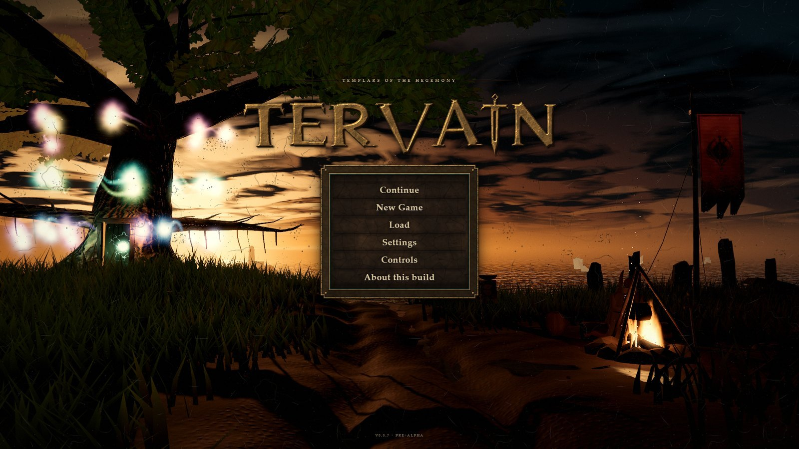
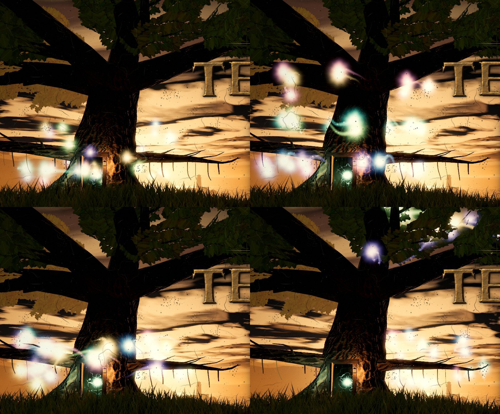
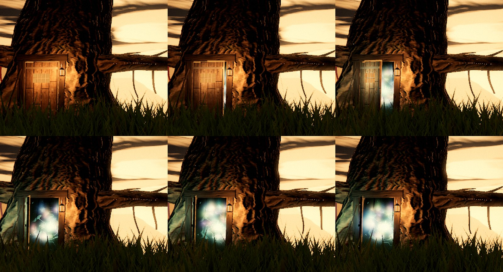
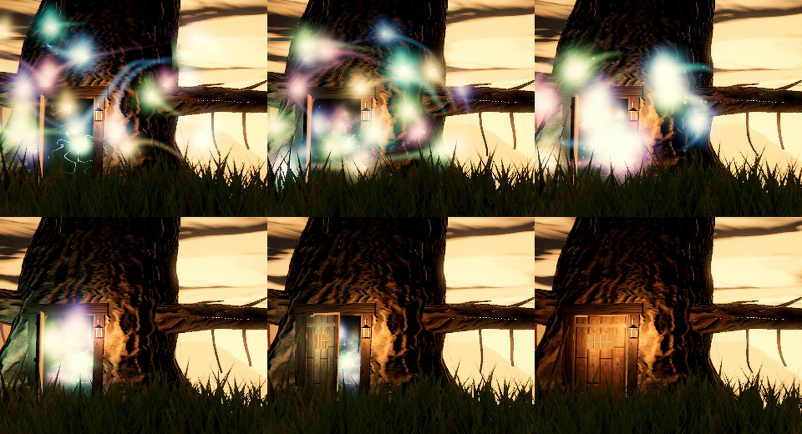

# Tervain 0.0.7 — the grove dances

Status: **menu grove rework, 1 October 2026; validation recorded below.** The package version is `0.0.7`, within the `0.0.x` hold ([A15](../../decisions.md)). This is not a promotion. The exploration content builds on `0.0.5`; this revision changes the title and pause menu's hermitage under the tree. The separate local `0.0.6` character/contact work is preserved on `codex/0-0-6-character-polish` and is not included here. Earlier evidence stays in the [0.0.5 handoff](0.0.5.md) and the [people notes](0.0.5-people.md).

## Hosted browser build

Open [Tervain 0.0.7](https://ael-dev3.github.io/Tervain/). On 1 October the owner requested the repository's hosted 0.0.7 build and made the repository public. PR #9 at `57f9083` passed its remote build check and a fresh local run of all 381 tests, strict TypeScript and the production build. Its merge is batched with the README's hosted link and corrected current-version/hosting descriptions.

The existing Pages workflow and its checks remain unchanged. The publication preflight examined every available repository run, all branches and actors, including older runs for rerun attempts: one completed successful PR run on 1 October, no pending runs, and no older rerun attempts that day. The workflow has no schedule or downstream chain; its push trigger targets `main`, and its PR trigger is unchanged. Monthly Actions usage is unknown. The batched main publication is expected to start one build/deploy run, approximately 2–4 runner minutes. Earlier billing failures and the former private-repository Pages outage remain historical records rather than current successful-deployment evidence.

## What the owner asked for

> Can you improve visual quality of wisps in the menu? They have to look better and actually dance around the tree and act as visualiser for the menu song. Improve physics, collisions, tree door internal look within the tree, etc. Ship it all as 0.0.7

Recorded as [A32](../../decisions.md). The cue itself is A30's: the door begins to open at 30 seconds of The Sovereign's Oath and the spirits come home before the song loops. The [grove record](../../engineering/menu-grove-score.md) is the full technical account.

## What changed

**The spirits look like living lights.**
- **Shape.** Each is a camera-facing flame: a white-hot heart in a coloured glow, a rim that flickers, a small upward tongue, and a streak back along its flight that lengthens with speed. Before, they were faceted pearls with round halos.
- **Trails and sparks.** A fading ribbon follows each spirit's actual path, and sparks drift down from it.
- **Light on the wood.** The brightest spirits near the tree light its bark, leaves and the ground in their own colours (3, 5 or 7 lights by preset), without extra scene lights or shadow maps. Spirits inside the trunk never light the bark through the wood.

**They dance round the tree, to the music.**
- **Measured rhythm.** A new offline analysis of the approved recording supplies its rhythm: a constant **106.99 BPM** grid that the tracked beats fit within 8.4 ms RMS, downbeats, eight-bar phrases, 550 accents and a six-band spectrum.
- **A formation per phrase.** Each phrase brings a different figure: a two-strand helix winding up and down the bole; three counter-rotating rings at the roots, the bole and under the crown; a maypole weave; or fireflies flitting along the low boughs and through the lower crown.
- **Beat and accents.** Spirits bounce on every beat. The rings breathe on loud low downbeats, and each accent throws the dancers outward and makes them flare.
- **A spectrum from root to crown.** Each spirit hears one band: low notes dance low near the roots in cool violet and blue, high notes dance high in amber and rose. The tree shows the spectrum from root to crown, and each spirit's brightness follows its band's measured level.

**Physics and collisions.**
- **Motion.** Springs with inertia carry the spirits to their places in the dance, with accent impulses and a treble-driven flutter. Speeds are bounded, and each spirit gives way to those ahead of it in the line.
- **What they avoid.** The trunk's real shape (its measured radius at every height and angle), the limbs, boughs and surface roots, the hanging lanterns, the ground and the swinging door leaf. Soft avoidance turns them before contact; contact pushes them out with a little bounce and a flare.
- **Getting round.** They fly round the bole when it is in the way, and leave and enter the trunk only through the doorway.
- **The door.** It is a heavy leaf on a damped hinge. It swings open at 0:30, knocks against its stop with a small rebound and rests there. At the end it is drawn shut, lands against the frame and latches.

**The hollow inside the tree.**
- **The cell.** The shallow pocket with a flat glowing panel is gone. Behind the door a tunnel opens into a rounded cell carved into the heartwood, about 1.5 m across and 2.2 m high. Roots hang from its roof and coil over its floor, and pale fungi grow on its walls.
- **The heart.** A burl at the back holds a small knot of light with fine veins that brighten with the low notes and flare on the accents. It lights the cell from within, with a warm spill of lantern light at the entrance.
- **Inside the trunk.** The tree cuts away anything of itself inside the hollow. Spirits gather and swirl in the cell before they come out and after they go home.

**Timing.**
- 30.0 s: the latch gives.
- From 32.75 s: one spirit leaves on each half beat.
- From 33.9 s: the phrase formations.
- From 204.4 s: home, into a wide ring before the door, then in one by one on the sixteenths.
- About 212.7 s: the door shuts. It is latched by 214.1 s, before the native loop.

## Implementation

- [menuScoreRhythm.ts](../../../src/presentation/menu/menuScoreRhythm.ts) samples the generated [rhythm data](../../../src/presentation/menu/menuScoreRhythmData.ts) from [analyze-menu-rhythm.py](../../../tools/analyze-menu-rhythm.py).
- [menuGrove.ts](../../../src/presentation/menu/menuGrove.ts) is the deterministic simulation of the door and the spirits on the score's own clock: fixed 1/60 s steps from the cue, with snapshots for seeks. All presets simulate the same 40 spirits, and a graphics rebuild hands the simulation over instead of re-running it.
- [menuWisps.ts](../../../src/presentation/menu/menuWisps.ts) draws the flames, ribbons and sparks. [menuWispLight.ts](../../../src/presentation/menu/menuWispLight.ts) supplies their light on the wood. [menuHollow.ts](../../../src/presentation/menu/menuHollow.ts) builds the carved cell and its heart.
- [menuTree.ts](../../../src/presentation/menu/menuTree.ts) now exports the trunk's measured shape, its limbs, boughs and roots as capsules, and its leaf sites, and carves the doorway and the hollow. [menuCamp.ts](../../../src/presentation/menu/menuCamp.ts) swings the door to the simulated hinge angle.
- [tools/grove.html](../../../tools/grove.html) previews the grove at any song time with the real menu overlay, or plays it with the song (`npm run dev`; not part of the build). F3's score buttons now include 0:33, 1:15 and 1:50.
- `analyze-menu-score.py` now writes UTF-8 with LF line endings; on Windows it previously failed part-way with the platform's default encoding. Its module was not regenerated.

## Checks

- **Automated.** `npm run typecheck`, `npm test` (**381 tests in 42 files**), `npm run build`, `git diff --check` and `python tools/analyze-menu-rhythm.py --check` pass.
- **Test coverage.** The new and updated tests cover:
  - the rhythm data's hashes and grid fit;
  - the door's timeline;
  - every spirit leaving and coming home;
  - no spirit entering wood or ground at any 0.25 s sample from 32 to 214 s;
  - the dance covering at least 34 of 36 compass sectors round the tree and rising above 6 m;
  - exact reconstruction from any path through the song clock;
  - the beat bounce, the phrase formations and the accent push;
  - the hollow lying inside the carved boxes, closed all round, free of bark, and showing the camera its back wall through the doorway;
  - the renderer's layers, visibility, band colours, brightness, wood light, presets and disposal;
  - the hand-over on a graphics rebuild;
  - at the narrow desktop framing, at least 10, 6 and 3 spirits (High, Medium, Low) visible beside the tree, clear of the title and choices, at every 3.2 s sample of the dance.
- **Bundle.** The production bundle is **1,361.1 kB JS / 450.2 kB gzip**, against 1,296.4 kB / 408.9 kB for `main` before this change built the same way. Of the 64.6 kB growth, the rhythm data is 42.6 kB. The chunk already crossed Vite's 1,200 kB advisory warning before this change; nothing is code-split here.
- **Headless Chrome captures** (ANGLE Direct3D 11) of the grove page with the real title overlay: every formation, the door opening, the hollow, and the homecoming and closing. Browser logs show only the Direct3D shader compiler's precision warnings.
- **Development measurements on one machine** (NVIDIA GeForce RTX 3080 Ti, headless Chrome, High preset, 1920 × 1080, 240 frames each, `gl.finish()` after each frame):
  - with the dance: median 0.8 ms, 95th percentile 2.3 ms;
  - with the spirits hidden: 1.2 ms and 2.2 ms, which is no measurable difference;
  - simulating the whole song cold: about 0.4 s in Node.

  These are not device benchmarks or frame-rate claims.

## Not verified

- No physical controller, Safari, Firefox or mobile GPU.
- No calibrated audio/display latency. The beat grid is measured from the recording, and the visual timing follows the media clock.
- The dance in motion with the music was judged from frame sequences and still captures, not watched in real time by a person.

## Known limits

- **Overlap.** In the last seconds of the homecoming the spirits crowd the doorway and their glows add up to a bright knot.
- **Crowded sky.** Against the brightest sunset some spirits wash toward white.
- **Fireflies.** During the fireflies phrase about a fifth of them pass behind the title.
- **Contacts.** Contact flares are occasional; most come where the climbing helix brushes the low boughs.
- **Inside the trunk.** The hollow lights only itself. The spirits light the bark through a few soft lights, not real shadows, so light from a spirit can reach bark it could not see.
- **Small at a distance.** At 22 m from the camera the hollow is small on screen; its heart and glow carry it rather than fine detail.
- **Video.** The full-song video request remains paused.
