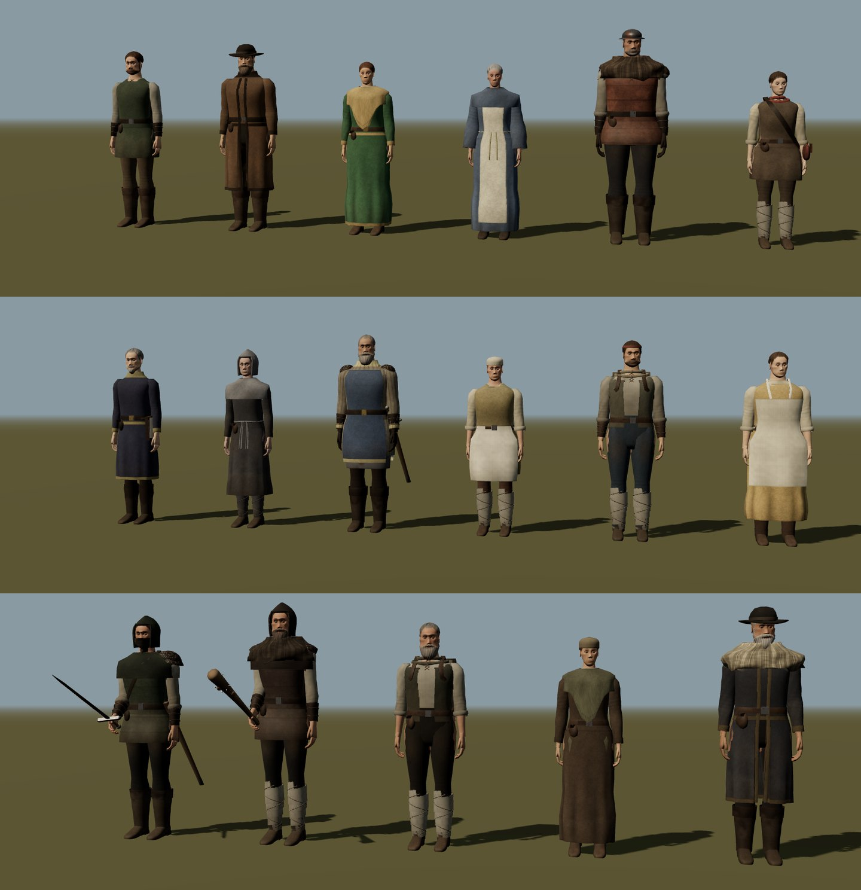
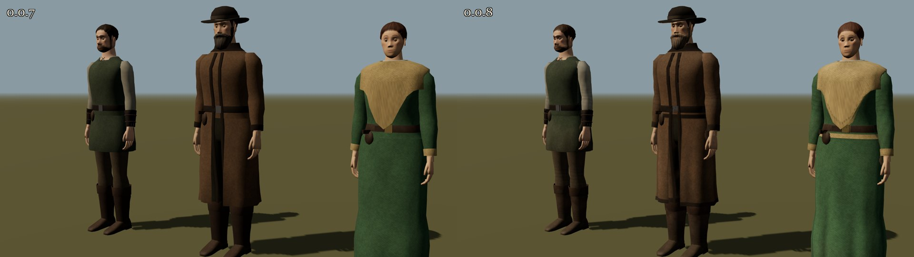
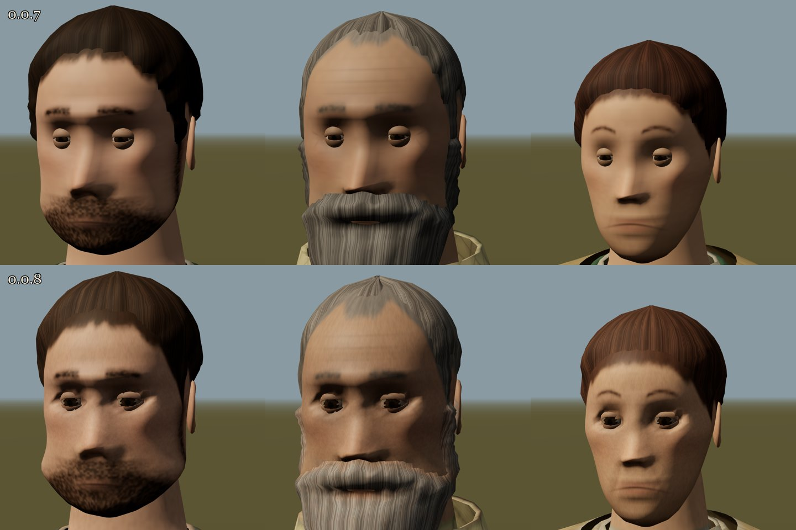
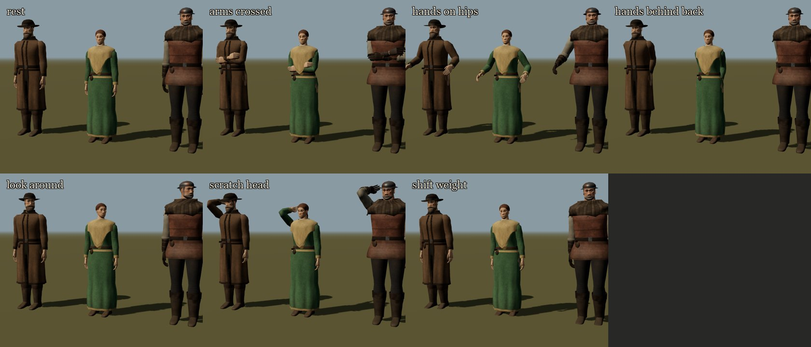
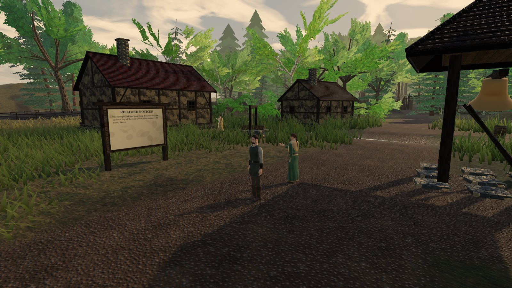

# Tervain 0.0.8 — people made to be repainted

Status: **people component of the combined 0.0.8 candidate, 1 October 2026.** Incoming source is Claude [PR #10](https://github.com/ael-dev3/Tervain/pull/10), head **`c53f1ab516c539f4f1e953b9f730d7c28555ce83`**. The owner expressly authorized merging it with the [desktop world-polish/item-map work](0.0.8-world-polish.md) and publishing one combined game. The component checks, captures and measurements below belong to the incoming branch; they are not final merged-build acceptance. Combined typecheck, **652 tests in 60 files (9.85 s)**, and build now pass; merged source checkpoint, native review and verified deployment remain pending in the [combined handoff](0.0.8-world-polish.md#publication-and-integration-boundary). The public build still serves `0.0.7` until publication is verified. Version stays within the `0.0.x` hold ([A15](../../decisions.md)). The incoming people branch built on `0.0.7`; the world polish described in the companion handoff is added by this integration. The separate local `0.0.6` work named in the [0.0.7 notes](0.0.7.md) is not included.

## What the owner asked for

> for 0.0.8 patch let's do a massive rework for NPCs
> C:\Program Files (x86)\Steam\steamapps\common\Gothic 1 Remake
> Use Gothic 1 remake local files as study material and inspiration
> Use txt files for study and inspiration
> NPC models you make should have shapes that should be easy to retexture with Codex and image gen

The request came with four text files: the owner's Gothic 3 NPC geometry study, their Gothic 3 local asset notes, and two Warpkeep handoff notes. It is recorded as [A36](../../decisions.md). The costume additions, who wears them, the idle routine, the larger eyes and the Low preset's sheet size are proposals ([P18](../../decisions.md)).

## The study

**Gothic 1 Remake.** The local install was looked at for inspiration only, under the rule that already governs Gothic 3 ([A14](../../decisions.md)). It is build `Build83_CL174209`, about 36 GB, of which 27.4 GB is packed game data. Those archives were **not opened or extracted**. Only loose files the install ships as plain images and JSON were viewed:

- the glossary's 170 character sketch portraits (500 × 264), 96 creature and 36 location entries;
- 50 loading-screen story paintings (3840 × 2160);
- `InteractionSpots.json` (9.97 MB): 10,765 placed activity spots whose tags name what people do in place, including standing around, looking around, scratching an ear, eating, drinking, sitting at a campfire, small talk, sharpening a weapon, carving wood, keeping watch, sleeping and digging.

What Tervain takes from it:

- **Silhouettes.** The portraits show a person's role carried by the shoulders (pelts, fur and a single strapped plate), the neck and face (a wound cloth, a cloth over the mouth), the head (bands, hoods, caps) and the hands (gloves, wraps), over rough, mended layers.
- **Idle activity.** The interaction tags show people who busy themselves where they stand.

Tervain answers both with original costume pieces and an idle routine (below). What it does not take: any image, model, texture, animation, data, name, character or costume design. Study crops stayed in a scratch folder, and nothing from the install is in this repository.

**The text files.** The Gothic 3 notes repeat what the [people study](../../art/gothic3-reference.md#people) found: modular actors on one skeleton, a separate head, hair and beard, and costume silhouettes that carry the role. They add that a body is painted in one to three material groups. That last point shaped this release: one painted texture per person instead of many tiling materials. The Warpkeep notes were read for project context only; nothing here depends on them, and this repository has no authority over Warpkeep.

## What changed

**One mesh, one sheet, made to be repainted.**
- **One mesh.** Every person is now **one skinned mesh with one material and one square texture**, instead of 7–14 meshes per person. Weapons, scabbards and the sash of local standing stay separate props.
- **A model sheet.** The texture is laid out as a character model sheet: the whole figure from the front, the right, the back and the left in an unwrap A-pose, the face large, and the head from the sides, the back and above. Each surface blends the views that face it, so the sheet is simply orthographic pictures of the person, and an image model or a painter can repaint it as such. The [retexture guide](../../art/people-retexture.md) explains the layout and the workflow.
- **Painted, not tiled.** The game paints each sheet at load, as a function of each point on the surface, so the views agree with one another. Wool, linen, leather, quilting, mail, iron, fur, rope, skin and hair each have their own painter: weave, wear at knees, elbows and hems, the grime where hands wipe the thighs, sun-faded shoulders, creased and scuffed boots, quilting lines, mail rings, locks and sheen in hair. Faces are painted as before and now carry the sculpt's hollows and ridges.
- **What stays in the shader.** A fine weave and grain layer is multiplied over the sheet; how rough or metallic a surface is comes from its piece.
- **Sheet sizes.** Sheets are 1024 px, or 512 px on the Low preset (proposal P18). The player's stays 1024 px: the wanderer is built once at start and is always nearest the camera.
- **Overlaps.** A surface takes colour only from views where it can be seen. Another piece lying in front of it hides it there unless the two are within 3 mm; within the same piece, 2 cm is allowed for its own curve. Overlapping pieces therefore do not lend each other colour. In the captures, the effect of this rule is barely visible.

**Repainting tools.**
- **Export.** `npm run people:sheets` writes, for every person:
  - the sheet;
  - a template: a flat-colour block-in with outlines, guide lines at the joints and features, and labelled panels;
  - a parts map;
  - masks for image editors;
  - a manifest with the layout, a description of the person and a suggested prompt.
- **Check.** `npm run people:check` builds the person in Node and checks a repainted PNG against their current shape: holes inside the figures, and stray paint where the image's figures stand but the person's do not. It exits with 1 when the image may not fit, so Codex or a script can use it without a browser.
- **Install.** An image saved as `src/assets/people/<id>.png` replaces that person's painted sheet in the game. Gaps where the image misses a silhouette by a few pixels, or leaves background inside it, are filled from the paint beside them. The game runs the same fit check and warns in the console.
- **Preview.** Dropping an image onto `tools/people.html` dresses the chosen person in it at once.

**Faces.**
- **Eyes.** The eyes no longer read as dots. They are larger than life (P18) and sit in sockets carved to the eyeball's curve, behind a wider opening and darker lids painted from the face.
- **The sculpt.** Brows are heavier, noses broader, jaws squarer and chins stronger, with folds from the nose to the mouth and fuller cheekbones.

**Costumes.** Six new pieces are shaped to read from the four sheet views (P18):
- **Fur collar:** the quarry foreman, the club-carrying toll-jumper, and the lighthouse keeper (a sheepskin collar on his coat).
- **Wound neck cloth:** Ila, the quarry hand and the fisher.
- **Face cloth** pulled up over the mouth and nose, with a **single riveted shoulder guard** strapped across the chest: the sword-carrying toll-jumper.
- **Headband** knotted at the back: the quarry hand.
- **Sleeveless tabard:** the shrine warden, blue edged in ochre over an undyed gambeson.
- **Leather gloves:** the warden and the foreman.

The cast picture at the top shows everyone.

**Idle routine (P18).** A resident standing idle now does something with themselves: rest, cross their arms, set their hands on their hips or behind their back, look around, scratch their head or shift their weight.
- **Timing.** A new choice every 7 s, deterministic for each person, with rest most often.
- **Who.** The named residents and the hamlet's people; the player and hostiles keep the plain stance.
- **Scope.** It is presentation only: schedules, observation and quest state are untouched, and Reduced Motion turns it off.

**Loading.**
- **Workers.** Sheets are painted on worker threads while the world builds, and painting falls back to the main thread if workers are unavailable.
- **Gated.** People stay hidden until their sheet is ready, and the loading screen waits for every sheet.

## Implementation

- **Sheets.** [sheet.ts](../../../src/presentation/human/sheet.ts) holds the layout, the unwrap pose and the projection with per-view weights. [raster.ts](../../../src/presentation/human/raster.ts) is a small software rasteriser plus the gutter fill and the replacement-image repair.
- **Painting.** [paint.ts](../../../src/presentation/human/paint.ts) has the painters by surface; [facePaint.ts](../../../src/presentation/human/facePaint.ts) paints the face, now with relief from the sculpt; [humanTex.ts](../../../src/presentation/human/humanTex.ts) holds the detail layers.
- **Assembly.** [person.ts](../../../src/presentation/human/person.ts) builds the one mesh and its sheet job; [sheetMaterial.ts](../../../src/presentation/human/sheetMaterial.ts) is the material.
- **Workers.** [sheetJob.ts](../../../src/presentation/human/sheetJob.ts), [sheetWorker.ts](../../../src/presentation/human/sheetWorker.ts) and [sheetPool.ts](../../../src/presentation/human/sheetPool.ts).
- **Replacement and template.** [overrides.ts](../../../src/presentation/human/overrides.ts) handles replacement sheets; [template.ts](../../../src/presentation/human/template.ts) draws the template, parts map and masks.
- **Geometry and costume.** Paint attributes per vertex in [skin.ts](../../../src/presentation/human/skin.ts); the new pieces in [dress.ts](../../../src/presentation/human/dress.ts) and their wearers in [outfits.ts](../../../src/presentation/human/outfits.ts); eyes, lids and hair in [head.ts](../../../src/presentation/human/head.ts) and the sculpt in [headShape.ts](../../../src/presentation/human/headShape.ts).
- **Rigs and actors.** The rig, the sheet's arrival and the idle routine are in [characters.ts](../../../src/presentation/characters.ts), with ids and idles for [residents](../../../src/presentation/actors.ts) and the [hamlet's people](../../../src/presentation/ambient.ts). [app.ts](../../../src/app.ts) waits for the sheets before the world is shown.
- **Tools.** [tools/export-people-sheets.mjs](../../../tools/export-people-sheets.mjs) and [tools/peopleSheets.ts](../../../tools/peopleSheets.ts) (`npm run people:sheets` and `npm run people:check`, with a small PNG reader), plus the drop preview and `?painted=1` / `?sheet=` in [tools/people.ts](../../../tools/people.ts). The install folder [src/assets/people/](../../../src/assets/people/README.md) holds only a README.
- **Tests.** The new [sheet.test.ts](../../../tests/presentation/sheet.test.ts), and updates to [people.test.ts](../../../tests/presentation/people.test.ts), [disposeScene.test.ts](../../../tests/presentation/disposeScene.test.ts) and [forestArrival.test.ts](../../../tests/scenarios/forestArrival.test.ts).

## Checks

- **Incoming-branch automated evidence.** Before integration, `npm run typecheck`, `npm test` (**395 tests in 43 files**), `npm run build` and `git diff --check` passed. The combined 652-test result is recorded separately above.
- **Test coverage.** The new and updated tests cover:
  - the layout: panels inside the sheet and apart;
  - each view's handedness, and the unwrap pose lifting only the arms;
  - per-vertex weights summing to one, with coordinates inside each vertex's own panels;
  - the eyes' fronts taking their colour from the face panel;
  - the same paint every time, covering every panel with no transparent texel;
  - every person inside the triangle budget, with their own id and a known surface for every piece;
  - the new costume pieces on the people meant to wear them, and none on the wanderer;
  - the gutter fill, and the repair of an image a little thinner than the person (which reports its gaps);
  - the template, parts map, masks and guide lines;
  - the replacement registry, with no sheet shipped, and the detail layers;
  - one painted skinned mesh per person, stature from the kept sheet job, and the idle routine: one variant per turn, every variant in time, never a broken pose.

  Tests paint 256 px sheets so they stay fast.
- **Construction counts** (Node, 1024 px sheets, built and painted inline):
  - 7,128–10,444 vertices and 12,254–17,393 triangles per person, inside the [10,000–20,000 triangle budget](../../art/art-audio-ui.md#provisional-production-budgets-and-acceptance);
  - 16–28 painted pieces per person;
  - 0.23–0.37 s to build and paint one person on the development machine.
- **Incoming-branch bundle.** **1,399.0 kB JS / 464.4 kB gzip**, plus a 28.0 kB sheet-painting worker, against 1,361.1 kB / 450.2 kB for `main` built the same way. This is not the combined bundle.
- **Browser captures.** Headless Chrome (ANGLE Direct3D 11) captures of the people tool:
  - every person whole and their faces, before and after, with the same cameras;
  - the seven idle variants;
  - a test replacement sheet applied through the people tool's code path: a scripted copy of the export with the coat recoloured and every silhouette shaved by 3 px. It applied in 167 ms and its edges were repaired.
- **The install folder, end to end.** The same test image was saved temporarily as `src/assets/people/caravan_master.png`:
  - The people tool and the production build both dressed the caravan master in it and painted everyone else.
  - The build bundled it as a 286 kB asset.
  - `npm run people:check` passed it.
  - The guard test that no sheet ships failed while it was there, as intended.

  It was then deleted and the build repeated without it.
- **The fit check.** `npm run people:check` passed the caravan master's own export and an image keeping the template's guide lines (0.3% stray paint). It flagged two images:
  - the player's sheet offered as the caravan master's (7.8% stray paint);
  - his sheet with half the coat painted out (10.0% holes).

  The game's console warning fired for the player's sheet in the people tool. A copy shifted by 12 px passed, a limit recorded in the guide.
- **Production preview.** Rillford in the production build's preview: the title after about 5.8 s, and the 14 people there with painted sheets. Browser logs were clean apart from the Direct3D shader compiler's precision warnings.
  - **On Low:** the residents and hostiles had 512 px sheets and the player 1024 px. A close view of the reeve at about 2.6 m looked nearly the same on Low and High, only slightly softer on Low.
- **Development measurements on one machine.** The branch's production build was measured against `main` (0.0.7) on 1 October 2026, alternating three runs each:
  - **Setup:** NVIDIA GeForce RTX 3080 Ti; headless Chrome, ANGLE Direct3D 11; the production preview of each build.
  - **View:** shot mode at Rillford (`place=rillford`, High, 1920 × 1080, hour 11).
  - **Procedure:** 30 warm-up frames, then 240 frames each timed with `gl.finish()`. Draw calls and triangles are for one frame. People meshes count the player's, residents' and hostiles' rigs. Load is from opening the page to the shot's READY. The heap is Chrome's used JS heap afterwards.

  | | `main` (0.0.7) | 0.0.8 |
  | --- | --- | --- |
  | Draw calls | 269 | 196 |
  | Triangles | 853,406 | 855,306 |
  | People meshes | 146 | 48 |
  | Render, median | 1.8–2.4 ms | 1.5–1.8 ms |
  | Render, 95th percentile | 2.5–4.6 ms | 2.4–2.9 ms |
  | Load to ready | 10.6–11.6 s | 11.1–11.4 s |
  | JS heap | 177–215 MB | 267–283 MB |

  These are not device benchmarks or frame-rate claims. Fewer draw calls is the expected effect of one mesh per person. In each alternating pair the 0.0.8 median was lower or equal. Load time did not change beyond the run-to-run spread.
- **Texture memory (estimate).** For the recorded 14-person sample, 1024 px RGBA sheets with mipmaps total about **74.7 MiB** (14 × 1024² × 4 bytes × 4/3). On Low, 13 sheets at 512 px plus the persistent player at 1024 px total about **22.7 MiB**. These are sheet-byte estimates, not measured driver allocation or the full game's GPU memory.

## Not verified

- **Image models.** No sheet made by an image-generation model or by Codex has been tried. The workflow was exercised with scripted edits only, so how well a given model keeps the layout is unknown.
- **Incoming-branch hardware limits.** No reference hardware, low-core-count device, Safari, Firefox or physical controller was verified in that branch. Painting time with fewer workers was not measured. Mobile work is outside the current PC-only direction (A34); the combined native runtime review is recorded in the [integration handoff](0.0.8-integration.md).
- **The idle routine** was judged from captures, not watched in the running game by a person.

## Known limits

- **Memory.** The JS heap was about 50–100 MB larger in these runs. The likely cause, not profiled, is the copy of each sheet's pixels that its texture keeps: 4 MiB per person at 1024 px.
- **Blended seams.** Where two views meet at a person's sides, both blend over a band. A repainted sheet whose front and side disagree shows a soft seam there.
- **Hidden surfaces.** Surfaces no view faces squarely (under the arms, between the thighs, under the chin) take stretched colour from the nearest views.
- **Shape changes.** A replacement sheet belongs to the shape it was exported from. Changing a costume in code needs a new export. The fit check catches holes and figures in the wrong place, but not a small shift.
- **Idle clipping.** Arms can pass through bulky pieces (a fur collar, a pack's straps) in some idle variants. There is still no facial animation, blinking or lip movement.
- **Sheet resolution.** At 1024 px the body is painted at about 270 px per metre. That holds at play distance but is soft in close-ups; the face has about seven times the density.

## Combined publication follow-up

The owner authorized merging this people rework with the desktop world, inventory, map and pickup systems, then publishing one `0.0.8` patch. The [integration record](0.0.8-integration.md) records the combined 652-test validation, loading-recovery fixes, source checkpoint and native smoke review. The earlier captures and measurements above remain evidence for this PR’s original component source.
